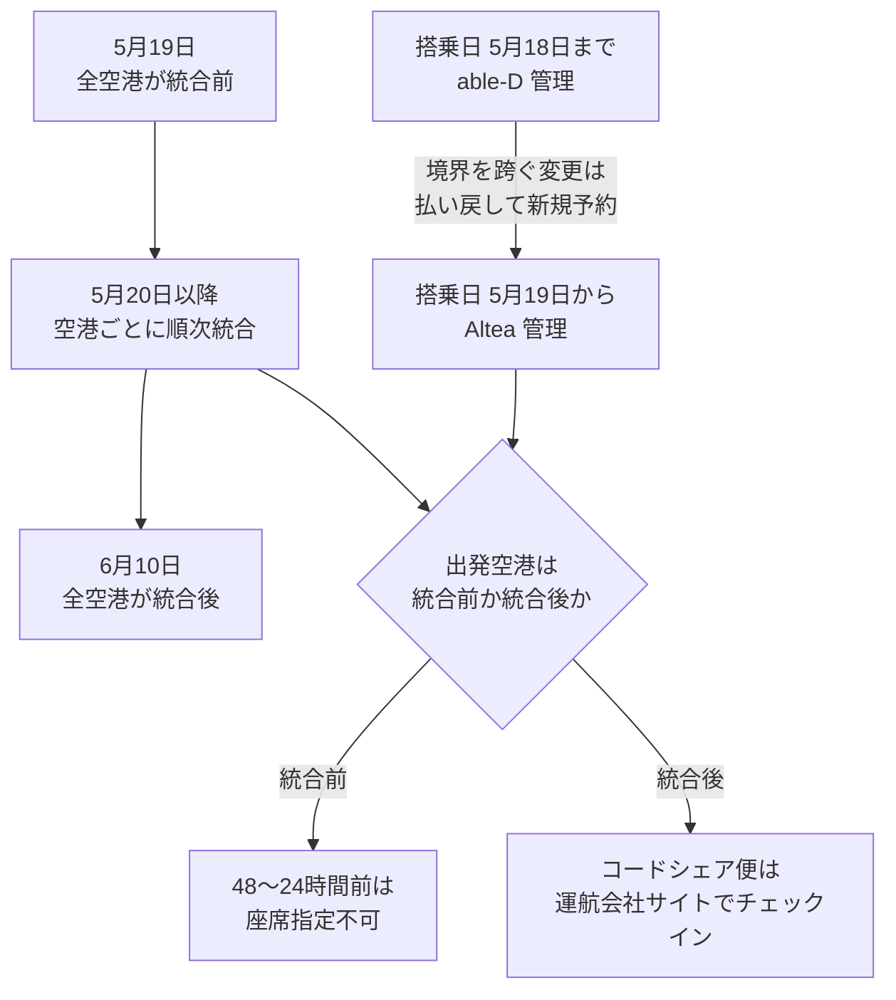
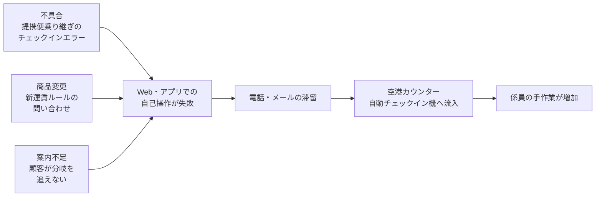

全日本空輸（ANA）が2026年5月19日搭乗分から実施した国内線の旅客系基幹システム（PSS）刷新は、オンラインチェックインの不具合と問い合わせ殺到を招き、株主総会での陳謝に至りました。

この記事では、公開情報から確認できる範囲で「なぜ大規模移行が顧客接点を飽和させたのか」を整理し、自分たちの移行計画に持ち帰れる合格条件の書き方まで落とします。航空業界の知識は前提にしません。レガシーモダナイゼーションや基幹システムの切替を設計・レビューする立場の方を想定読者としています。

結論を先に書きます。**この移行の難しさは、新旧システムの技術的な互換性ではなく、「搭乗日 × 出発空港 × 旅程種別 × 商品ルール」という業務状態の積にありました。** 機能テストの合格だけでは、この積は検証できません。

*この記事の全体像。以下、順に解説します。*

## 何が起きたのか

ANAは1988年以来、国内線と国際線でPSSを分けて運用していました。国内線は自社保有の「able-D」（BIPROGY によるオンプレミス構築）、国際線は2015年4月から Amadeus 社の「Altea」です。2023年2月14日の発表で、この2つを Altea 上へ統合する方針が示されました。狙いは予約の一元管理、新サービス投入の速度、固定費の変動費化、予約と空港ハンドリングの教育統一です。

実際の移行は次のスケジュールで進みました。

| 日付 | 出来事 |
|---|---|
| 2025年5月29日 | Altea での国内線予約受付を開始（新旧の記録が重なり始める） |
| 2026年5月19日 | 搭乗日の境界。この日以降の搭乗分が Altea 管理へ |
| 2026年5月19日〜6月10日 | 空港の端末系を順次切替。この間は空港ごとに旧新が混在 |
| 2026年5月19日 | 国内線運賃を「シンプル」「スタンダード」「フレックス」へ刷新 |

切替直後から、オンラインチェックインができない事象と領収書の不具合が発生します。ANA は問い合わせ窓口の混雑を告知し、メール返信に「2週間から1か月」を要すると案内しました（報道では ANA 発表として「2週間から2カ月」とも伝えられています）。2026年6月26日の株主総会では、ANAホールディングス社長の芝田浩二氏が陳謝し、グループ社員延べ2000人以上を支援に投入したこと、メールの滞留が半減したことが説明されました。

会社側の振り返りとして公開されているのは、**国内線と国際線で顧客の行動が異なる点を読み切れず、手作業が膨らんだ**という趣旨の説明です。ここが本題です。バグ単体の話ではありません。

## 移行設計は「一夜の切替」ではなかった

参考になるのは、JAL が2017年11月に PSS を一晩で切り替えた事例との対比です。ANA は約1年の長期オーバーラップを選びました。ANA広報の説明では「2026年5月18日搭乗分までは able-D、5月19日以降は Altea」であり、予約記録は約1年重ねて運用されました。

長期オーバーラップは、切替夜のリスクを分散する代わりに、**移行期間中ずっと分岐が顧客に見える**という代償を払います。しかもこの移行では、分岐が1本ではありませんでした。

記録の境界（搭乗日）と空港の境界（設備の切替日）は、**別レイヤで独立に動きます**。顧客から見ると「5月20日搭乗で羽田発なら旧、伊丹発なら新」といった組み合わせが発生し、しかも正規のチェックイン手順が旧新で変わります。

ここに旅程種別（自社単独 / コードシェア / 乗り継ぎ）が掛かり、さらに同日リリースの新運賃ルールが掛かります。状態は足し算ではなく**積**で増えます。

## 不具合・設計上の制限・商品変更を分けて数える

混乱の分析でいちばん効いたのは、事象を種別で分けることでした。公開されている情報を整理すると、次のように分かれます。

| 事象 | 種別 |
|---|---|
| 5月18日以前の便を19日以降へ変更できない | 設計上の制限（事前公開） |
| 統合前空港での48〜24時間前の座席指定停止 | 設計上の制限（事前公開） |
| 統合後のコードシェア便は運航会社サイトでチェックイン | 手順変更（事前公開） |
| 統合前空港利用分の搭乗証明書検索が使えない | 制限（公式に明記） |
| 自動機での領収書発行を5月19日以降順次終了 | 制限（公式に明記） |
| 提携会社便から ANA 便へ乗り継ぐオンラインチェックインがエラー | 不具合（6月10日に告知） |
| 提携会社便の非常口座席を指定できない | 不具合または制約として告知 |
| 正しく入力してもチェックインできない一部事象 | 2026年8月6日時点の FAQ に残存 |
| 最安運賃「シンプル」の事前座席指定・払い戻し制限 | 商品ルール変更 |

重要なのは、**上から6行目までの大半が「事前に公開されていた仕様」だった**ことです。隠れた複雑さではありません。それでも顧客接点は飽和しました。

つまり問題は「複雑さを隠していたこと」ではなく、**複雑さを顧客が自力で追える形で提示できなかったこと**にあります。ANA社長の平澤寿一氏も、事前案内の不足を重大な課題として挙げています。朝日新聞は、運賃ルール変更とシステム変更が重なった点を独立した要因として報じました。

自分たちの移行に置き換えると、この分類はそのまま問い合わせ票の分類になります。障害系（不具合）と仕様系（設計上の制限）と商品系（ルール変更）は、**発生タイミングが同じでも対応部隊も収束カーブも違います**。分けて数えないと、窓口容量の見積もりを誤ります。

## 失敗した自己操作はどこへ落ちるか

セルフサービス型のシステムには、必ず「失敗したあとの落ち先」があります。この事例では次の連鎖が起きました。

報じられているところでは、問い合わせの約9割がWeb・アプリのオンラインチェックイン不能に関するものでした。Web での失敗が、そのまま電話・メール、さらに空港の物理カウンターへ押し寄せる構造です。

注目したいのは、**縮退手段が「人員」と「空港」だった**点です。公開情報の範囲では、able-D への切り戻し（ロールバック）は確認できません。実施していないと断定はできませんが、少なくとも公表された対処は、延べ2000人以上の事後動員と、自動機・カウンターへの誘導案内でした。ANA社長は、シンプル運賃を理由に搭乗を断ることはないと明言しています。

事後動員は縮退としては機能します。しかし**リリース判定の合格基準にはできません**。動員できる人数は切替前に確定していないからです。

## 移行判定に書くべき合格条件

ここまでを、自分たちの移行計画に持ち帰れる形にします。Go/No-Go の判定シートに、次を合格条件として明記することを提案します。

### 1. 例外旅程マトリクスを機能テストの必須項目にする

「正常系が通ること」は入場条件であって合格条件ではありません。この事例で言えば、自社単独 / コードシェア往路 / コードシェア復路 / 旧空港から新空港への乗り継ぎ / 境界日を跨ぐ変更、の組み合わせです。

問い合わせの約9割がチェックイン不能だったという事実は、**例外旅程の機能テストが最優先である**ことを示しています。運用負荷試験の話に還元しすぎてはいけません。

自分たちの文脈では「旧テナントから新テナントへ跨る操作」「移行期間中に作成され移行後に更新されるレコード」などが該当します。

### 2. 拠点別の業務状態を、顧客向け説明と係員手順書で突き合わせる

顧客に「この空港は統合前です」と表で開示したなら、**現場の手順書がその表と完全に一致している**ことを実地で確認します。片方だけ更新されていると、顧客と係員が違う答えを持つ状態が生まれます。これは自動テストでは検出できません。

### 3. 商品ルール変更を分離するか、加算した容量で組む

システム切替と商品ルール変更を同じ日に出すなら、問い合わせの流入は**足し算になる前提**で窓口を設計します。分離できるなら分離が第一選択です。

同時変更が不可避なら、切替前に自己解決導線を固めておきます。FAQ、アプリ内の導線、入力フォームの整合性です。ANA の FAQ には、予約作成時が「姓・名」、検索時が「名・姓」という入力順の差で検索できなくなる導線が説明されていました。こうした細部の不整合が、問い合わせ量に直結します。

### 4. 失敗の落ち先そのものを負荷試験する

Web 失敗時の公式案内が「自動機とカウンター」なら、**その台数と1件あたりの手作業時間を試験対象にします**。オンライン側の性能試験だけでは、落ち先の飽和は見えません。

### 5. 縮退の種類を切替前に決める

縮退には少なくとも2種類あります。

- **欠陥機能の停止と代替導線への誘導**（機能を落として人で受ける）
- **旧記録系への切り戻し**（ロールバック）

後者を持たないなら、**前者の容量がそのまま Go/No-Go の基準になります**。「いざとなったら戻せる」を暗黙の前提にしたまま、戻す手順を書いていない、という状態がいちばん危険です。

## この事例から誤読しやすい3点

技術記事や設計レビューでこの事例を引用するとき、次の3つは避けたい誤読です。

**1. 「Altea が悪い」という評価にしない。** 公開情報は、パッケージの機能不足を主因とはしていません。問題は状態空間の積とその開示の仕方でした。製品選定の失敗譚として語ると、再発防止の対象を取り違えます。

**2. 「一晩で切り替えれば安全」としない。** JAL は2017年に一晩切替を成功させましたが、2019年には端末制御システムの過負荷でチェックイン障害が起き、2万人超に影響が出ています。切替方式の選択は、リスクを消すのではなく**リスクの形を変える**だけです。長期オーバーラップは「分岐が顧客に見える期間」を、一夜切替は「後戻りできない一点」を、それぞれ引き受けます。

**3. 「運用試験さえやれば防げた」としない。** 問い合わせの約9割がチェックイン不能である以上、主戦場は例外旅程の機能テストです。運用負荷試験は必要条件ですが十分条件ではありません。**機能欠陥・設計された分岐・商品変更・窓口容量を別々にカウントしたうえで、積として合格判定する**のが正しい構えです。

なお、5月19日のリリース判定を誰がどの基準で行ったか、事前に想定していた問い合わせ容量がいくらだったかは、公開情報からは確認できません。**公開されていないことを「無かった」と読み替えないよう注意が必要です。**

## まとめ

- ANA の国内線 PSS 刷新では、機能不具合・事前公開された設計上の制限・同日の運賃ルール変更が重なり、顧客接点が飽和した。
- 難しさの本質は新旧の技術互換ではなく、**搭乗日 × 出発空港 × 旅程種別 × 商品ルールという業務状態の積**にある。
- 記録の境界と設備の境界は別レイヤで動くため、顧客も係員も「この操作は旧か新か」を即答できなくなる。
- 事象は**不具合・設計上の制限・商品変更**に分けて数える。対応部隊も収束カーブも違うため、混ぜると窓口容量を見誤る。
- 移行判定には、例外旅程マトリクス、拠点別業務状態の突き合わせ、加算した窓口容量、失敗の落ち先の負荷試験、縮退方式の事前決定を合格条件として書く。
- 事後の人員動員は縮退としては機能するが、**リリース判定の基準にはならない**。

この記事が少しでも参考になった、あるいは改善点などがあれば、ぜひリアクションやコメント、SNSでのシェアをいただけると励みになります！

## 参考リンク

- 金子寛人「ANAの国内線システム刷新で空港混乱、バグと移行期の業務複雑化が重なる」日経クロステック, 2026-08-20. https://xtech.nikkei.com/atcl/nxt/column/18/01157/081000167/
- ANAホールディングス「2025年度より国内線旅客サービスシステムと国際線旅客サービスシステムを統合」第22-087号, 2023-02-14. https://www.anahd.co.jp/group/pr/202302/20230214-2.html
- ANAホールディングス「2026年5月19日搭乗分から国内線の運賃をリニューアル」第25-009号, 2025-05-20. https://www.anahd.co.jp/group/pr/202505/20250520-3.html
- ANAホールディングス「2026年5月19日搭乗分から空港での国内線各種ルールが変わります」第25-053号, 2025-12-18. https://www.anahd.co.jp/group/pr/202512/20251218.html
- ANA「システム移行期間のサービス制限について」 https://www.ana.co.jp/ja/jp/promotion/renewal-2025-2026/system/service_info/
- ANA「国内線のご予約・ご搭乗に関わる操作やお手続きに関する最新のよくあるお問い合わせ（2026年8月6日更新）」 https://www.ana.co.jp/ja/jp/notice/renewal-2025-2026/faq/
- ANA「お問い合わせ窓口（電話・メール）の混雑・よくあるお問い合わせについて」 https://www.ana.co.jp/ja/jp/topics/notice220715/
- ANA「搭乗証明書について」 https://www.ana.co.jp/ja/jp/guide/reservation/receipt/boarding_certificate/
- ANA「領収書について[国内線]」 https://www.ana.co.jp/ja/jp/guide/reservation/receipt/domestic/
- 日経クロステック「ANA国内線の新旅客系システムが稼働開始へ 完全移行に1年、3つの理由」2025-05-27. https://xtech.nikkei.com/atcl/nxt/column/18/00001/10680/
- Aviation Wire「ANA、国内線コードシェア便含む旅程で不具合」2026-06-10. https://www.aviationwire.jp/archives/345269
- Aviation Wire「ANA、SFC改定とラウンジ混雑『2030年度さらに悪化』国内線システム混乱は7月解消視野＝株主総会」2026-06-26. https://www.aviationwire.jp/archives/346108
- 朝日新聞「ANAに問い合わせ殺到でおわび 運賃ルールやシステム変更で混乱」2026-06-23. https://www.asahi.com/articles/ASV6L7J4FV6LOXIE00RM.html
- 朝日新聞「ANAトップが釈明 システム改修・上級会員の制度変更に批判相次ぐ」2026-06-26. https://www.asahi.com/articles/ASV6V13K9V6VULFA00PM.html
- 日経クロステック「JALチェックイン障害の真相、端末制御システムの過負荷が原因」2019-05-09. https://xtech.nikkei.com/atcl/nxt/column/18/00001/02107/
