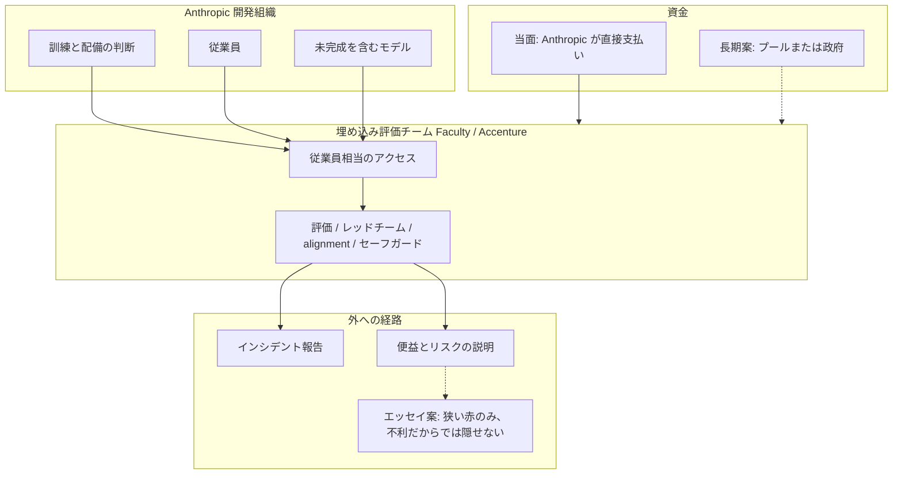

2026年9月18日、Anthropic は Accenture とフロンティアAIの独立評価で提携すると発表しました。
実務は Accenture が 2026年に買収した英国の応用AI会社 Faculty が主導します。
この記事では、評価場所がラボの外から中へ移る仕組み、資金と商業関係、公開権が発表に書かれていない範囲を一次資料に沿って整理します。
読み終わると、自社のAI導入で「独立評価を中に入れる」と決めたときに、発表文のどこを契約へ写せるか、どこを未設計として扱うかを判断できます。

:::message
数値と権限の有無は、2026-09-18 の両社発表、同年9月の Amodei エッセイ、同年6月の Anthropic Advanced AI Framework に書かれた範囲に限ります。契約本文は非公開です。
:::

*この記事の全体像。以下、順に解説します。*

## 埋め込み評価とは

埋め込み評価は、開発組織の内部で評価する形です。
評価者は従業員相当のアクセスを持ち、訓練中のモデル、構築と配備の判断、従業員への直接ヒアリングを対象にします。

作業内容は、モデル評価、レッドチーム、alignment 評価、セーフガード試験です。
リード組織は Faculty です。
Accenture の specialist AI business として位置づけられます。

資金は当面、Anthropic が Accenture の作業を直接支払います。
長期はプール資金または政府資金が望ましい、と Anthropic 自身が書いています。
今後5年で、Anthropic は公式の "this area" の能力構築に、Accenture は AI safety に、各社少なくとも 10 億ドルを投じると見込んでいます。
これは見込みであり、請求額、チーム人数、マージンは未開示です。

提携は非排他です。
数週間以内に追加評価者を発表する予定だと公式は書きます。
Accenture は他の AI 開発者でも同様の役割を担います。
METR など非営利評価者とは、相手側の自己資金によるパイロットを協議中だと書きます。

モデルの安全の最終責任は Anthropic に残ります。
公式は評価者を、検証を可能にするための装置だと定義します。
アクセス内容と報告方法の業界標準は、発表時点では未確立だと公式が認めています。

埋め込み評価は、被評価者、評価者、資金源、公開経路の4点が同時に動きます。

図の実線は 2026-09-18 発表で確認できる関係です。
点線のプールまたは政府資金と、赤付き公開権はエッセイまたは政策文書の意図であり、Accenture 発表では再掲されていません。

従来の外部評価は、完成に近いモデルを短期間、限定アクセスで見ます。
Amodei の 2026年9月エッセイは、銀行の常駐監督に近い「従業員相当アクセス」を、フロンティア企業の一方的コミットとして置きます。
2026-09-18 はそのコミットの最初の対外実装として発表されました。
公式の呼び方は “an important step” です。
報道は first と呼びます。

Anthropic 公式が評価者に与える視点は次です。

- 訓練中のモデル形成を見る
- 構築と配備の判断を追う
- 従業員と直接話す
- 安全コミットメントの履行を検証する
- 盲点を指摘し、インシデントを報告する
- 便益とリスクについて、より情報のある公開説明をする

商業関係は評価取引の前から太いです。
2025-12-09 の Anthropic 公式発表で、次が既に存在します。

- Accenture Anthropic Business Group（Claude 専用プラクティス）
- 約 3 万人が Claude 研修を受ける計画
- Claude Code を数万人の開発者に。Amodei は “our largest ever deployment” と述べる
- 規制業種向け共同オファリング
- Accenture 内の Claude Center of Excellence への共同投資

評価者は、Claude Code の “largest ever deployment” 先であり、専用 Business Group、約 3 万人研修、CoE 共同投資を持つ販売と実装のパートナーでもあります。

資金形態は公式が二段で書いています。

1. 長期: プールまたは政府。June 2026 の Advanced AI Framework で、評価者が個別開発者から資金独立できるよう government funding or pooled funding を推奨する
2. 当面: 「重要性と緊急性」を理由に Anthropic が Accenture 作業を直接資金提供する

METR 等非営利は “their own funding” のパイロット対話であり、Accenture トラックとは資金の向きが違います。

## 注意点

次の言い換えは一次ソースと一致しません。

| 言い換え | 一次の文言 |
|---|---|
| 2 億ドル規模の評価契約 | 各社が 5 年で少なくとも 10 億ドルを「能力構築 / AI safety」に投じると**見込む**。請求額、チーム人数、マージンは未開示 |
| 独立規制当局の常駐 | 評価者は被評価者が選び、被評価者が支払う第三者。出荷停止権限は発表に無い |
| 世界初の独立評価 | 発表は「埋め込み評価は新しい」「詳細は未定」と書く。完成モデルの外部評価は既にある |
| METR が第一号 | エッセイの例示は METR。第一号の実務リードは Faculty / Accenture。METR は自己資金パイロットの対話相手 |
| 株価が安全ガバナンスを認証した | ACN は 2026-09-18 終値 181.29 ドルから時間外 195.88 ドル（+8.05%、stockanalysis.com / Public.com、同日時点）。市場はコンサル売上として反応した読みが自然 |

Faculty の安全実績は一次で限定できます。
OpenAI o1 の Red Teaming Organizations 一覧に Faculty が載ります。
Anthropic の Claude Opus 4 / Sonnet 4 system card（2025-05）は Faculty.ai と short-horizon computational biology / pathogen analysis 評価を共同開発したと書きます。
Opus 4.1 system card は当該評価を Faculty Science が開発したと書きます。
Claude 4 系の biosecurity 評価全体を Faculty が単独実施した、とは一次にありません。

未公開の契約に次が残ります。

- Accenture 作業への直接支払いの実額、チーム人数、指揮命令系統（Faculty 社員は誰の人事評価を受けるか）
- エッセイの公開権が Accenture 契約に入ったか
- 不利な発見でリリースを遅らせられるか
- METR 等の自己資金パイロットが、同じアクセスと公開権を得るか
- OpenAI が誰を第一号にするか。有料コンサルが業界標準になるか

日本語報道は共同、ロイター抄訳、日経リードが中心です。
独自の長文批判は 2026-09-20 時点で薄いです。
METR 組織としてのこの取引への公式支持は、2026-09-20 の検索では見つかりません。

## 発表が確定した転換と、契約として残る装備

アクセスを中へ移す転換自体は一次で確認できます。
一方、エッセイが書いた装備のうち、2026-09-18 の両社発表が書かなかった装備があります。

| 項目 | エッセイ（2026-09） | 2026-09-18 両社発表 |
|---|---|---|
| 机、入館証、社用 PC | 招待すると明記 | 未記載 |
| 内部リスク評価チームとほぼ同等の権限 | 明記。法、契約、顧客秘密は例外 | 「employee 相当」の一般論 |
| 発見の公開。編集権なし | 明記。不利だからでは隠せない。赤が結論を変えたら評価者が公言できる | 未記載 |
| アクセス対象の標準 | 未確立だと後の発表が認める | 「標準はまだ無い」 |
| 出荷停止 | エッセイにも無い。Framework では政府機関の是正オプション | 発表に無い |
| 利益相反の遮断 | Framework は金融利害なし、CoI 証明 | 発表に無い |
| 報復防護 | Framework は内部告発保護を推奨 | 発表に無い |

Accenture ニュースリリースは、公開権、編集権の不在、出荷停止、報復防護、CoI ファイアウォールのいずれも書いていません。
Anthropic 側だけが直接資金提供を認めます。

同日、AI Evaluator Forum は「Minimum Conditions for Embedding Evaluators」を公開しました。
署名は 100 人超です。
個人資格です。
Geoffrey Hinton、Stuart Russell、Arvind Narayanan、FAR.AI の Adam Gleave、Apollo の Alexander Meinke、SaferAI の Henry Papadatos、METR 政策スタッフ Charles Foster（個人）が含まれます。

条件 1 の最小要件は次です。

- 評価組織は frontier 企業に所有、統治されない
- **評価対象と有意な商業取引を持たない**
- 発見に連動する報酬を受けない
- 編集権を維持し、利益相反を開示、緩和する

Accenture 選定は、条件 1 の「有意な商業取引を持たない」と衝突します。
これは解釈ではなく、2025-12-09 公式と 2026-09-18 書簡の文言の突き合わせです。

Anthropic 自身の Advanced AI Framework（2026-06、PDF p.7-8, 10-11）は次を推奨します。

- 評価者は開発者に金融利害がなく、重大な利益相反がない
- 未編集の risk report / system card / 最能力モデルへのアクセス
- 機密の複製禁止以外は公表を原則制限しない
- 政府資金またはプール資金で、評価者を個別開発者から資金独立させる
- evaluator shopping を避ける（格付けと無作為割当）
- 不適格または時間不足の評価は、政府が是正（追加配備の禁止を含む）できる

9月の対外実装は、被評価者が評価者を選び、被評価者が支払い、商業パートナーが実務を担います。
資金依存と被評価者による選定は、Framework が挙げた shopping と資金独立の懸念と方向が重なります。
同一ではありません。
非排他と METR 自己資金パイロットは、公式が単一キャプチャを意識した証拠として残ります。

## 従来評価、銀行検査、AEF要求との差

| 基準 | 従来の外部評価 | 今回の埋め込み（Accenture） | 銀行の常駐検査（OCC） | AEF が求める埋め込み |
|---|---|---|---|---|
| 場所 | ラボの外、完成前後 | ラボの中 | 大規模行に常駐チーム | ラボの中 |
| アクセス | 短期間、限定。例: Apollo の Astra は 3 日。METR の HF 調査は合計 6 日、当初計画 2 日 | 従業員相当と発表。対象リストは未公開 | 会議、データへの広範なアクセス。政府監督官 | privileged employee 相当。顧客秘密は例外 |
| 資金 | まちまち。METR の HF 調査は OpenAI から受領せず | 被評価者が直接払い | 監督庁予算。被検査銀行が手数料で支える制度もあるが、検査官は政府職員 | 成果連動報酬禁止。資金継続の保証 |
| 公開 | NDA と開発者の赤が既定、と評価者取材 | 発表に公開権なし | 検査報告は監督手続き。是正権限あり | 時限赤のみ。取締役会へのフィルタなし連絡 |
| 商業関係 | 非営利または専門評価店が典型 | Claude Code 最大展開先かつ専用 Business Group を持つ販売、実装パートナー | なし（監督官） | 有意な商業取引を禁止 |
| 出荷停止 | なし | 発表になし | 是正、業務制限は監督権限 | 報復防護と資金継続。停止は規制側 |

OCC の公式用語に “embedded supervisor” はありません。
Comptroller's Handbook の実態は、最大かつ最複雑行への full-time examination team と Examiner-in-Charge です。
政府職員であり、是正権限を持ちます。
Amodei の比喩はアクセスの近さであり、権限の同等性ではありません。

EU AI Act は別系統です。
科学パネル（Art. 68）はプロバイダから独立した 60 人（2026-06-01 時点の公式発表）です。
AI Office は GPAI を自ら評価し、独立専門家を任命できます（Art. 92）。
GPAI Code of Practice の独立外部は、資金、運営、経営の非依存を定義します。
Anthropic は CoP 署名者です。
有料インテグレーターを最初の対外実装にするモデルは、EU の独立適合性評価の型とは別物です。

カリフォルニア SB 53（2025-09-29 署名、2026-01-01 施行）は safety framework 公表と重大インシデント報告です。
SB 813（2026-09 署名）は州が認める independent verification organization の枠を作ります。
TechCrunch 2026-09-16 の整理と一次の日付は整合します。
条文一字は LegiScan のボット壁で未取得なので、期限の細部は法律事務所アラートとの交差に留めます。

外部の完成品テストでは、訓練中の欺瞞や評価認識（eval awareness）を見逃す、という問題意識は評価者側も共有します（Apollo、FAR.AI、TechCrunch 2026-09-16）。
人員規模は非営利単体では足りない、という実務論は成立しえます。
Faculty は買収完了時（2026-03）に 400 人超です。
Accenture は約 79.9 万人（FY25 売上 約 700 億ドル、Accenture 2026-09-18 発表）です。

過去の「独立評価」は開発者が時間と範囲を決めた例があります。
METR 合計 6 日、Apollo 3 日、FAR.AI は支配が強い契約を拒否、です。
公開権、出荷停止、報復防護は Accenture 発表にありません。
TechCrunch 2026-09-18 は、自己警察による説明責任回避だとする見方を記録します。
批評家の固有名は同記事にありません。

## 企業導入で発表文を雛形にしない

アクセスを中へ移す転換自体は一次で確認できます。
ただし「独立評価」として企業の牽制雛形にするには、商業関係、資金、公開権、停止権限が未契約（少なくとも未公開）です。
雛形としてそのまま採用すべきではありません。

企業の AI 導入で「独立評価を中に入れる」と決めるなら、Anthropic と Accenture の発表文を雛形にしない、が実務上の起点です。
発表はアクセスの移動を示しました。
独立性の契約は示していません。

転用するなら、次を契約の必須条項にします。
欠けた条項は「未設計」として扱います。

1. **アクセス**: 内部リスク評価チームと同等のシステム、ログ、中間チェックポイント、従業員ヒアリング。例外は顧客秘密、法的特権、セキュリティに限定し、例外リストを公開する
2. **公開**: リスク水準、インシデント、実務、得られなかったアクセスを、被評価者の編集権なしに公開できる。赤は時限。不利だからでは消せない。赤が結論を変えたら評価者が公言できる
3. **報告経路**: 経営だけでなく監査役、取締役会（またはそれに相当する監督機関）へ、フィルタなしで届く
4. **出荷停止**: 評価者が go/no-go を遅延できる条件と、無視した場合の記録義務。最終責任の所在を一文で書く
5. **資金**: 被評価者単体の請求書にしない。プール、業界基金、または複数顧客の共同負担。成果連動報酬を禁止する
6. **商業関係**: 同一評価対象の販売、実装、再販を、評価チームから切り離す。できないなら評価者を変える
7. **指揮命令と報酬**: 評価者の人事、ボーナスは被評価者側に置かない。契約解除が不利な発見の直後に起きないロック期間を置く
8. **複数評価者**: 単一パートナーに独占させない。見解の相違を公開する
9. **報復防護**: 訴訟と契約解除からの保護。内部告発チャネル
10. **標準の開示**: AEF-1 チェックリスト相当を、結果と一緒に公開する

第一号実装を観察する指標は次です。

- 最初の批判的公開が出るか、出るまでの日数
- METR 等自己資金トラックが、同じアクセスを得たか
- 赤の範囲と「結論を変えた」宣言の有無
- リリース遅延に評価意見が関与した記録

契約の中身が後から公開されれば、結論は更新できます。
残りの未知は、雛形採用を止めるのに足ります。

## まとめ

Anthropic は 2026-09-18、Faculty を実務リードとする Accenture を、開発組織の内部へ入れる埋め込み評価を発表しました。
アクセスを中へ移す転換は一次で確認できます。
従業員相当アクセス、訓練中モデル、配備判断、従業員ヒアリングが対象です。

独立性の契約は発表にありません。
評価者は Claude Code の最大展開先かつ専用 Business Group を持つ販売、実装パートナーです。
請求先は被評価者です。
公開権、出荷停止、報復防護、利益相反の遮断は Accenture 発表に無く、AEF 条件 1 の「有意な商業取引を持たない」と衝突します。
自社導入では発表文を雛形にせず、アクセス、公開、資金、商業関係の切り離しを契約条項として置く必要があります。

この記事が少しでも参考になった、あるいは改善点などがあれば、ぜひリアクションやコメント、SNSでのシェアをいただけると励みになります！

## 参考リンク

1. Anthropic, [Partnering with Accenture on embedded evaluation](https://www.anthropic.com/news/accenture-embedded-evaluation), 2026-09-18.
2. Accenture, [Accenture and Anthropic Partner to Build Team of Embedded Evaluators](https://newsroom.accenture.com/news/2026/accenture-and-anthropic-partner-to-build-team-of-embedded-evaluators-at-anthropic), 2026-09-18.
3. Dario Amodei, [We Must Pace the Frontier](https://darioamodei.com/post/we-must-pace-the-frontier), September 2026.
4. Anthropic, [Accenture and Anthropic launch multi-year partnership](https://www.anthropic.com/news/anthropic-accenture-partnership), 2025-12-09.
5. Accenture, [Accenture to Acquire Faculty](https://newsroom.accenture.com/news/2026/accenture-to-acquire-faculty-to-scale-ai-capabilities), 2026-01-06.
6. Anthropic, [Advanced AI Framework](https://www-cdn.anthropic.com/files/4zrzovbb/website/0a58d567024a8b448ff15158ebc3625328dfcc1f.pdf), June 2026, とくに p.7-8, 10-11.
7. AI Evaluator Forum, [Minimum Conditions for Embedding Evaluators](https://aievaluatorforum.org/initiatives/embedded-evaluation-letter), 2026-09-18.
8. AI Evaluator Forum, [AEF-1](https://aievaluatorforum.org/initiatives/minimum-operating-conditions), 2025-12-04.
9. METR, [OpenAI Hugging Face incident investigation](https://metr.org/blog/2026-08-26-openai-hugging-face-incident-investigation), 2026-08-26.
10. OpenAI, [GPT-6 Astra external evaluations (Apollo)](https://deploymentsafety.openai.com/gpt-6-astra).
11. EU AI Act [Art. 68](https://www.artificial-intelligence-act.com/Artificial_Intelligence_Act_Article_68.html), [Art. 92](https://artificialintelligenceact.eu/article/92/); European Commission, [Scientific panel](https://digital-strategy.ec.europa.eu/en/policies/ai-scientific-panel).
12. OCC, [Supervision & Examination](https://www.occ.gov/topics/supervision-and-examination/index-supervision-and-examination.html).
13. TechCrunch, [Anthropic’s first embedded evaluator is Accenture](https://techcrunch.com/2026/09/18/anthropics-first-embedded-evaluator-is-accenture/), 2026-09-18.
14. TechCrunch, [Anthropic and OpenAI want to embed safety evaluators](https://techcrunch.com/2026/09/16/anthropic-and-openai-want-to-embed-safety-evaluators-will-they-really-be-independent/), 2026-09-16.
15. TNW, [Anthropic is paying the firm that will evaluate it](https://thenextweb.com/news/anthropic-is-paying-the-firm-that-will-evaluate-it-and-says-in-the-same-announcement-that-this-is-not-how-it-should-work), 2026-09-19.
16. 産経（共同）, [記事](https://www.sankei.com/article/20260919-6UL5GWAYTFJJRMGXXSCTURZYHY/), 2026-09-19.
17. ロイター日本語, [記事](https://www.reuters.com/jp/markets/japan/RVT22BQWQ5PW7EOZXYG4C6VXUU-2026-09-19/), 2026-09-19.
18. ACN 時間外: [stockanalysis.com](https://stockanalysis.com/stocks/acn/), [Public.com](https://public.com/stocks/acn/after-hours)（2026-09-18）.
