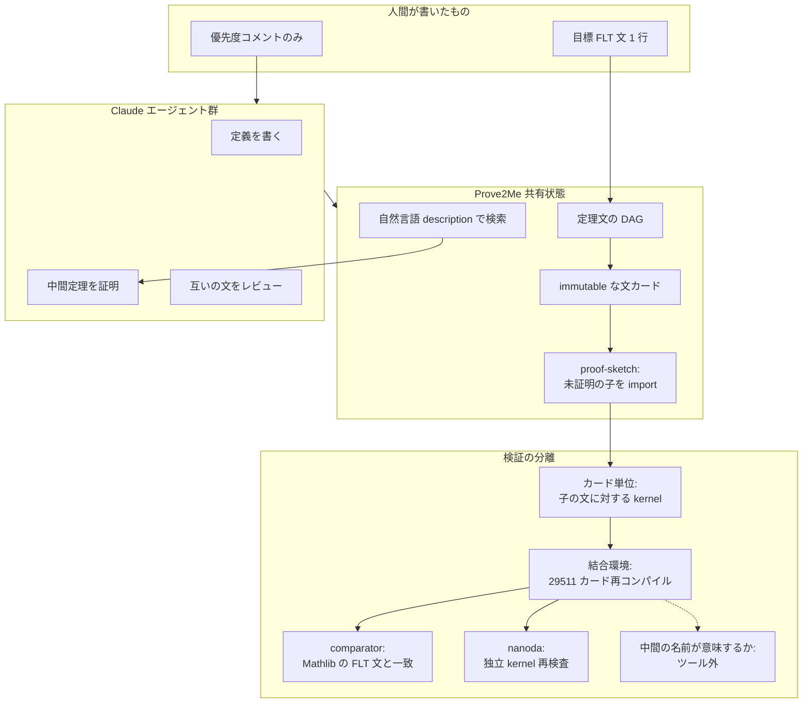

2026-09-04、Anthropic は内部研究モデルの多エージェントが、2026-08-07 から 11 日間おおむね自律で、フェルマー最終定理（FLT）を Lean 4 へ形式化したと報告しました。
能力は Claude Fable 5.1 とおおむね同等だと、公式が述べています。
新規性は新しい数学ではありません。
既存の Wiles–Taylor–Wiles 経路を、Lean の 3 標準公理だけに頼るコンピュータ検査可能な形へ落とした検証です。

初期の会話ベース協調は、状態喪失で止まりました。
Columbia の Prove2Me（定理文の DAG、文と証明の分離、自然言語検索）へ切り替えたあとに完遂しています。
頂点の FLT 文は Lean kernel、leanprover/comparator、nanoda で検査されています。
中間定理の名前が古典結果の一般形を意味するか、成果が Mathlib に載るか、同じ手法がカーネル神託のないコーディングへそのまま移るかは、一次資料が否定または限定しています。

この記事では、公式投稿、タイムライン PDF、公開リポジトリ、Kevin Buzzard の Xena 記事を突き合わせて、次の 4 点を整理します。

- 頂点 FLT 文について、何が検査され、何が検査の外に残るか
- 会話履歴だけでは 11 日走らず、定理文 DAG へ切り替えた理由
- 29,511 定理、約 1,300 万行、約 60 億 output トークンという規模の再現コスト
- 長期エージェントへ移すときに先に置く設計と、逆転条件

対象は、長時間エージェントの実行基盤を設計する立場の方です。
FLT の新しい証明を追う記事ではありません。

:::message
公開は 2026-09-04、本稿の参照は 2026-09-06 時点です。公開から 2 日であり、errata は尚早です。成果物リポジトリは Apache-2.0 で、公式 README は **not maintained** と書いています。
:::

*この記事の全体像。以下、順に解説します。*

## 11日間で何が完了したのか

目標は、正の自然数 \(n \ge 3\) について \(a^n + b^n \neq c^n\) を、Mathlib の `FermatLastTheorem` から導ける形にすることでした。
頂点文は `Theorems/Thm_fermat_last_theorem.lean` にあり、`FinalCheck.lean` が Mathlib 文を導出します。
`#print axioms` が `propext` / `Classical.choice` / `Quot.sound` 以外なら、ビルドは失敗します。
sorry、追加 axiom、`native_decide` はありません。

経路は 1995 年の Darmon–Diamond–Taylor 解説です。
Kevin Buzzard が進めている EPSRC の現代経路（Khare–Taylor 系）ではありません。
Mazur 側の本体は Frey 曲線の \(p \ge 17\) です。
小さい素数は flt-regular と降下で埋め、ImperialCollegeLondon/FLT と leanprover-community/flt-regular から 106 ファイルを適応しています。
Buzzard は、最小の非正則素数が 37 なので隙間は埋まると述べます。

追加実験として、個人の Claude Max 3 プランで Vinogradov の三素数定理を 3 日で形式化した記録があります。
これは FLT 本体ではありません。
FLT ランの内部モデルと約 60 億 output トークンを、消費者プランへ一般化する根拠にはなりません。

## 検査された層と、検査の外に残るもの

検査対象と、人間が読む意味は別物です。
kernel は「証明がその文を inhabit する」ことを見ます。
文が人間の意図した命題かは、mission コアの監査と PROOF-PATH の開示に残ります。

| 層 | 内容 | 一次 |
|---|---|---|
| 頂点 FLT | `Theorems/Thm_fermat_last_theorem.lean` の不等式。`FinalCheck.lean` が Mathlib 文を導出 | GitHub README, FinalCheck.lean |
| 公理 | 3 標準公理のみ。sorry / 追加 axiom / native_decide なし | README, PDF §4 |
| 文の一致 | comparator が Mathlib のみの Challenge 文と同一と判定。Verdict は `Your solution is okay!`。Buzzard も comparator 通過を確認 | README, [Xena 2026-09-04](https://xenaproject.wordpress.com/2026/09/04/flt-anthropic-has-beaten-me-to-it/) |
| 第二 kernel | nanoda が 1,052,234 宣言を受理。速度パッチ 4 本。typing 不変は README 自己申告 | README |
| 名前付き古典結果 | Mazur / Langlands–Tunnell / Wiles モジュラリティ / Ribet は必要な特殊ケース。一般定理としては PROOF-PATH が "Not proved" | PROOF-PATH.md |
| 中間 29,511 | ページと依存グラフはある。名前と文が食い違うときは文が正。英語要約は自動生成 | README |

Buzzard の制限は一次資料です。

- 現代証明ではない
- 数学的にはほぼ何も足していない。価値は autoformalization の可能性
- EPSRC の Mathlib PR と、人間が探索できる現代証明の文書は残る

公式も Riemann 仮説の仕事と対比し、今回の新規性は検証だと書いています。
「FLT の新しい証明」や「Mathlib が 5 倍になった」と配信すると、公式脚注 3 と Buzzard の制限に反します。

カードが Proved であることと、結合環境で通ることは同じではありません。
PDF §4 は、サイトがカードを個別検査すると書きます。
結合環境と公理 3 つの確認は、オフサイト再コンパイルです。
Claude 自身、re-check 前は "FLT is formalized" と言うなと書いています。

独立 kernel も絶対ではありません。
nanoda 0.4.13 はフォークに速度パッチ 4 本が入っています。
Lean 4 は 2026-07 に、axiom-free の `False` を通す kernel バグ（[leanprover/lean4#14576](https://github.com/leanprover/lean4/issues/14576)、closed）を公開しています。
FLT 成果物がこれを踏んだ報告はありません。
使用 toolchain は 4.33.1 で、README は 2026 の kernel soundness 修正込みと述べます。

中間 29,511 命題の独立な忠実性サンプリングは、公開時点で未実施です。
名前と文が食い違うときは、文が正です。

## 会話ベースは状態を見失い、Prove2Meへ切り替えた

公式は、初期エージェントが初期成功のあと「プロジェクト状態を見失い、協調が止まった」と書いています。
Prove2Me 切替後に完遂しています。

Prove2Me が公式に挙げた 3 点は、次のとおりです。

1. 定理文 DAG で次の証明対象を決める（記憶劣化の緩和と並列）
2. 文と証明を別ファイルにしてコンパイルを速くする
3. 自然言語説明で検索し再利用する

論文（[arXiv:2608.28433v2](https://doi.org/10.48550/arXiv.2608.28433)）側の対応物は、次です。

- naive な sorry 埋めは、再コンパイル連鎖と編集干渉でスケールしない
- proof-sketch と immutability で、局所正しさを大域へ合成する
- mission は人間監査を目標、定義、マイルストーンに限定する
- kernel は文の忠実度を保証しない。論文は Bourigault et al. 2026 の Lean-as-judge 約 43% を引用する（FLT 成果物の測定ではない）

FLT ランでは、Prove2Me 切替と内部フロンティアモデル投入が同時です。
公式投稿からは因果を分離できません。
Prove2Me 論文が「ケーススタディは統制実験ではない」と書く対象は、Table 1 の別ミッション（2026-06〜07）であり、FLT 11 日ランそのものではありません。
失敗の主因を共有状態だけに還元することは、一次ではできません。
モデル能力との交絡が残ります。

検査対象と協調の単位は別物です。
Prove2Me はカード（文）単位で閉じ、リリース後に単一 Lean 環境へ結合します。

文が証明の型になります（Curry–Howard）。
kernel は、証明がその文を inhabit することを見ます。
中間の名前が古典結果を意味するかは、ツールの外です。

リポジトリ構造は `Theorems/` と `P2M/Sol/` に分かれます。
PROOF-PATH は import を引用関係として説明します。
comparator は「証明した文」と「意図した Mathlib の FLT 文」を分けて検査します。
エージェント同士が誤った文を指摘した記録が PDF にあり、協調の痕跡は一次で確認できます。

## 規模と再現コスト

最終依存木は 29,511 定理です。
プラットフォーム累計は約 30,300（最終木の外を含む）です。
Lean は約 1,300 万行、生成 boilerplate を除くと約 1,050 万行です。
Claude の事後自己評価は 13.5M、Buzzard は 1,340 万行超と書いており、行数は資料間で数 10 万行ずれます。
リポジトリは 60,475 モジュール、定義モジュールは 1,450 です。
出力トークンは約 60 億です。
失敗した初期試行は、最終の非 boilerplate 行の約 7% に残ります。
2026-09-06 時点で約 680 stars です。

| 項目 | 値 | 時点 |
|---|---|---|
| ラン | 2026-08-07 開始、08-17 完了。FLT root は 02:00:57Z Aug-18 | PDF |
| 行数 | 約 13M（boilerplate 除き約 10.5M） | PDF p.2 / PDF §5 / Xena |
| `lake build` | 96 job で 5 h 32 min、ピーク RAM 153 GB。一部モジュール 36 GB。`.lake/` 約 67 GB + C 約 220 GB | README |
| comparator | 14 h 46 min、ピーク 230 GB、余裕 300 GB 推奨 | README |
| nanoda export | 37.8 GB | README |
| html | 約 390 MB、オフライン閲覧 | README |
| Windows | パス長で不可 | README |
| トークン | 約 60 億 output。内部原価は非公開 | 公式投稿 |

Day 7 の定理数グラフの落ち込みは、最終依存木の再配線であり作業消失ではありません（PDF Figure 1）。
入力トークンと内部原価は非公開です。

可読性と再利用の自己評価は厳しいです。
PDF §5 は、数学として読めない、一般でない、証明ファイル内文の約 2/5 が逐語重複、1 補題が 300 超ファイルで再宣言、simp preamble がバイトの 31%、Mathlib 参入規則のほとんどに落ちると書いています。
現代証明でも Mathlib ライブラリでもありません。
頂点の検査と、人間が import できる粒度は、別の成功条件です。

## コーディングエージェントへ移す条件

頂点 FLT 文のコンピュータ検査は、公開資料と Buzzard の再コンパイルの範囲で成立しています。
長期タスクでは、会話履歴に加え、依存関係、未完了、検証済み成果を外部の機械可読な単位で持つことが、この事例の成功条件でした。

それは「DAG を置けばコーディングエージェントの長期タスクが解ける」ことではありません。
「13M 行が人間の数学資産になった」ことでもありません。

現場で検討してよい最小セットは、次です。

| 要素 | FLT での実体 | コーディングへ移す条件 |
|---|---|---|
| 目標文の固定 | Mathlib の FLT 文 + comparator | 受け入れテストまたは仕様を先に immutable にする |
| 作業単位の DAG | 定理カードと依存辺 | 未完了、依存、担当を会話外に置く |
| 文と実装の分離 | Theorems vs P2M/Sol | インタフェースと本体を別成果物にし、再コンパイル範囲を狭める |
| 検索可能な説明 | 必須の自然言語 description | 再利用前に検索を強制する。名前は権威にしない |
| 検証オラクル | Lean kernel | 同等の決定的検査が無い仕事では、DAG は進捗装置にしかならない |
| 結合検査 | カード後の e2e re-check | 部分緑と全体緑を分けて表示する |

逆転条件は、次です。

- 検証オラクルが弱い（テストが仕様の代理になっていない）
- ノードが編集可能で履歴が消える（Prove2Me は immutable）
- 成功指標が「カーネル通過」だけで、保守、上流化、人間の理解が不要とされる
- モデル切替とハーネス切替が交絡したまま因果を断定する

テストと型は Lean の `Prop` 相当ではありません。
誤った仕様を大規模実装する装置にもなります。
外部状態は記憶の緩和であり、正しさの代替ではありません。

再利用可能条件は「検索できる」だけでは足りません。
結合環境で再検査でき、意図した文と一致し、他者が import できる粒度であることが必要です。
このリポジトリは、前二者の頂点については満たします。
第三者 import と Mathlib 粒度については、公式自己評価で満たしていません。

判断として先に置くのは、次の 5 点です。

1. 長時間エージェントに、会話ログ以外の依存 DAG、未完了、検証済み成果を外部化する
2. 部分検査と結合検査を分ける。「ノードが緑」を「システムが完了」と書かない
3. 頂点の受け入れ文を先に固定し、名前を権威にしない。comparator 相当を先に置く
4. コーディングへ移植するなら、決定的オラクルの有無を先に書く。無いなら DAG は進捗装置であり正しさの証明ではない
5. この成果を「FLT の新しい証明」や「Mathlib が 5 倍になった」と配信しない

Lean Zulip の数学者スレ本文は未取得です。
Day 7 再配線の数学内容は、図キャプション以上にありません。
Wiedijk 100 リスト HTML の更新行は未照合です。
Buzzard が「最後の 1 件」と述べたことは一次です。

## まとめ

Anthropic の FLT 形式化は、11 日の多エージェント実行で頂点文を 3 標準公理の範囲で検査可能にした報告です。
新しい数学の提出ではありません。
会話ベースは状態喪失で止まり、定理文 DAG、文と証明の分離、自然言語検索へ切り替えたあとに完遂しています。
カード単位の緑と結合環境の緑は別であり、名前付き古典結果の一般形は PROOF-PATH 上 "Not proved" です。
長期エージェントへ移すなら、受け入れ文の固定、会話外の依存 DAG、部分検査と結合検査の分離、決定的オラクルの有無を先に設計します。
DAG 単体は正しさの証明ではありません。

この記事が少しでも参考になった、あるいは改善点などがあれば、ぜひリアクションやコメント、SNSでのシェアをいただけると励みになります！

## 参考リンク

1. [Anthropic. Formalizing Fermat's Last Theorem（2026-09-04）](https://www.anthropic.com/research/formalizing-fermats-last-theorem)
2. [Anthropic. Formalizing Fermat's Last Theorem in Lean（タイムライン PDF）](https://www-cdn.anthropic.com/9e431dff043da6538d99d6c2d231b670aa3da263.pdf)
3. [anthropics/fermats-last-theorem（README, FinalCheck.lean, PROOF-PATH.md）](https://github.com/anthropics/fermats-last-theorem)
4. [Chen, S., Marwaha, K., Lu, X., Yuen, H., & Peng, T. Prove2Me. arXiv:2608.28433v2](https://doi.org/10.48550/arXiv.2608.28433)
5. [Buzzard, K. FLT: Anthropic has beaten me to it. Xena（2026-09-04）](https://xenaproject.wordpress.com/2026/09/04/flt-anthropic-has-beaten-me-to-it/)
6. [ImperialCollegeLondon/FLT](https://github.com/ImperialCollegeLondon/FLT)
7. [leanprover-community/flt-regular](https://github.com/leanprover-community/flt-regular)
8. [leanprover/comparator](https://github.com/leanprover/comparator)
9. [ammkrn/nanoda_lib](https://github.com/ammkrn/nanoda_lib)
10. Darmon, H., Diamond, F., & Taylor, R. Fermat's Last Theorem. *Current Developments in Mathematics, 1995*.
11. [Lean 公式ユースケース. Formalizing Fermat's Last Theorem in Lean](https://lean-lang.org/use-cases/flt/)
12. [leanprover/lean4#14576（closed, 2026-07-28）](https://github.com/leanprover/lean4/issues/14576)
