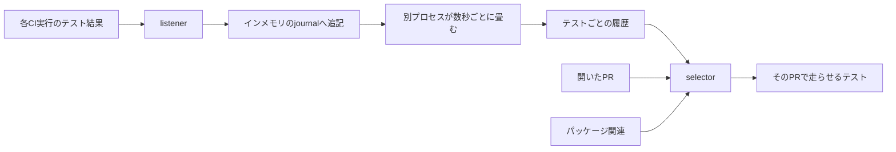

2026-09-14、Claude Blog に [Agentic coding is straining CI. Here’s how we scaled test impact analysis at Anthropic](https://claude.com/blog/agentic-coding-is-straining-ci-heres-how-we-scaled-test-impact-analysis-at-anthropic) が公開されました。
著者は Sachin Malhotra 氏です。
対象読者は、エージェントが PR とテストを増やすチームです。
記事は社内システムの自己申告であり、公開 API の仕様書ではありません。

Anthropic の CI チームは、変更ごとにどのテストを走らせるかを決める社内サービスを運用しています。
listener が各 CI 実行のテスト結果を記録し、selector がその履歴とパッケージ関連から、開いた PR で走らせるテストを決めます。
記事は、この結果取り込みが 6 ヶ月で 25 倍になった CI ジョブの下で繰り返し遅れた経緯と、状態をプロセスの外へ出して載せ直した経緯を書いています。

読者が得るものは、選択サービスの部品、応急処置と再設計の違い、倍率の単位、採用側が分けておく判断です。

:::message
本稿の参照は 2026-09-23 時点です。数値の出典は Claude Blog（2026-09-14）と、Anthropic Institute の [When AI builds itself](https://www.anthropic.com/institute/recursive-self-improvement)（ページに Update 9/18/2026）です。
:::

*この記事の全体像。以下、順に解説します。*

## テスト影響分析サービスとは

選択サービスは、CI の結果を履歴にし、その履歴で次の PR のテスト集合を決めます。

### 2つの部品

listener は、各 CI 実行のテスト結果を記録します。
selector は、開いた PR に対して、どのテストを走らせるかを決めます。
選択の根拠は、過去のテスト結果（past performance）と、パッケージとの関連（package relevance）です。
本文が名指しするのはこの 2 つです。

### 単一 writer から始めた履歴

v0 は、テストごとの履歴を単一プロセスの単一 writer が更新していました。
この形は水平に分割できませんでした。

応急処置は 3 つです。
導入文は、持続を 70 日、29 日、1 日未満の順に割り当てています。

| 順 | 内容 | 記事が割り当てる持続 | 時期の書き方 |
| --- | --- | --- | --- |
| 1 | サービスを動かしているコアを 2 倍にした | 70 日 | 導入文がこの順で持続を割り当てる |
| 2 | パッケージごとに状態と worker を分けた | 29 日 | 本文は "In February" と書く。年は本文に無い |
| 3 | 平日午後のメモリ上限へ、日次再起動で対処した | 1 日未満 | 本文は "In March" と書く。年の明示は無い |

パッチ 2 の年は、公開日が 2026-09-14 で、回顧が 2025 年 10 月であることから、2026 年 2 月と推定できます。
パッチ 3 は、パッチ 2 の 29 日後に続く叙述なので、2026 年 3 月と推定できます。
どちらも本文が年を書いてはいません。

パッチ 3 のメモリ調査では、バグが 4 件見つかりました。
メモリアロケータの交換は効果がありませんでした。
負荷の高い単一プロセスのメモリプロファイルは避けた、と記事は書きます。

### 再設計後の流れ

再設計は、インメモリのデータストアに journal を追記します。
listener の worker は状態を持ちません。
どの listener worker も、任意の結果を journal に足して次へ進みます。
別の consumer が数秒ごとに、テストごとの履歴へ畳みます。
selector が読むのは、consumer が畳んだ履歴です。

再設計はエンジニア 1 人で 3 週間でした。
著者は、1 年前なら四半期に近かったと書きます。
この構成は実行費用が上がる、と本文が書きます。
メモリプロファイルは、揺れる単一プロセスよりしやすい、とも書きます。
調整（journal の大きさと worker 数）は Claude がほぼ自律で行い、その後サービスは安定している、と書きます。
安定の終了日は、記事の公開日 2026-09-14 より先には書かれていません。

再設計後の図のキャプションは、未処理のジョブ結果イベントの hourly max について、以前はほとんどの日にバックログが積み、週ごとに増えた、と書きます。
cutover と tuning のあとは flat だと書きます。

著者の助言は 3 つです。
状態を最初からプロセスの外に置くこと。
入ってくる CI ジョブと出ていく CI ジョブの数が一致するよう計ること。
2 四半期で 25 倍の負荷を見込むこと。
別の箇所では、v0 で 10 倍から 20 倍を見込む、とも書きます。

## 注意点

ここまでの倍率と期間は、社内の自己申告です。
再現手順は記事にありません。
追加の公式仕様は、2026-09-23 の検索では確認できませんでした。
このサービスを実装として公開する Anthropic のリポジトリ、論文、API ドキュメントは見つかっていません。

### 25倍と10倍の単位

25 倍の単位は CI ジョブ数です。
デッキは "Our CI job volume increased 25x over 6 months." と書きます。
本文は "a 25x increase in CI jobs over a six month period" と書きます。
分数でも、コストでも、欠陥の流出件数でもありません。

6 ヶ月の始点と終点は本文にありません。
ジョブが workflow なのか shard なのかもありません。

テストの量は "grew 10x" とあります。
期間と、件数・行数・時間のどれかはありません。
エンジニアは "a nominal amount" とあります。
人数はありません。

図の軸の数値は HTML 本文にありません。
キャプションから読めるのは、hourly max、ほとんどの日の積み上がり、week over week の増加、cutover と tuning のあとの flat です。

"in case you are trying to do the math, not every test runs on every PR" は、倍率を掛けて 25 倍を検算できない、という注釈です。
記事は 8×10 という式を書いていません。
8 倍は出荷の話で、10 倍はテストの量であり、単位も期間も違います。
25 倍のあとで全件実行をやめた、という日付はありません。

70 日、29 日、1 日未満、3 週間も、分母と再現手順が無い自己申告です。
3 週間と「1 年前は四半期」が同じ完了定義かは、記事から分かりません。

### 8倍が落としている留保

8 倍は、CI 記事が研究所記事の見出し側の文を写しています。
研究所のリードは、エンジニアが四半期あたりに出すコードが 2021 年から 2025 年と比べて平均 8 倍、と書きます。

同じページの計測文は別です。
2026 年第 2 四半期の typical engineer は、2024 年と比べて 1 日あたり 8 倍のコードをマージしていた、と書きます。
図の次の段落は、行数は量であり質ではない、と書きます。
そのうえで、2026 年第 2 四半期の lines of code/engineer/day の 8 倍は、生産性の過大評価であることがほぼ確実だ、と書きます。

CI 記事は、四半期と 2021 年から 2025 年という書き方だけを残しています。
1 日あたり、2024 年比、行数は過大、の 3 点は落としています。

### 80%が落としている母集団

研究所本文は、2026 年 5 月時点で、コードベースへマージするコードの 80% 超を Claude が書いた、と書きます。
脚注 3 は、これは本番へマージされた行のうち Claude に帰属できた割合だと書きます。
同じ脚注は、経営の公の見積もりは 90% 以上で、scripts と実験コードを含む、と書きます。
80% 超のほうが狭い理由は、帰属パイプラインに隙間があることと、Claude に帰属しない行にも自動生成物が含まれることです。

CI 記事の "80% of that code" は、直前の 8 倍の出荷を指す書き方です。
時点と母集団と 90% との差は含みません。

### 予想と、隣の数値

「水平にスケールするテスト選択が業界標準になる」は、"I anticipate" という予想です。
他社名、採用件数、ベンダー製品名は記事にありません。
ベンダーのカテゴリがある、とだけ書きます。

Hacker News の当該スレッド（[item 49702815](https://news.ycombinator.com/item?id=49702815)）は、2026-09-23 の取得時点でコメント 1 件でした。
そのコメントは 25 倍を驚異とし、単位は疑っていません。
裏付けにはなりません。

`deterministic` は、テスト影響分析サービスと、同期すべき 2 部品につけた語です。
LLM を選択判定に使わない、とも、理論上偽陰性がゼロである、とも書いていません。
Claude が登場するのは、遅れの監視、shard 分割のコード生成、journal と worker 数の調整です。

同じ著者の別の話と混ぜません。
AI Engineer World's Fair 2026 の講演 [Give the Agent a Budget, Not a Token](https://ai.engineer/talks/rbjWzZK2LU0-give-agent-budget-not-token) で、本人は担当を test quarantining、merge automation、CI autoscaling、merge queue と並べます。
quarantine は、オンコールがインシデントで skip したテストのリストです。
エージェントは再有効化できます。
誤りなら CI が赤くなり、人は安く戻せる、と話します。
skip は break glass で、人と監査証跡が要ります。
誤りなら緑のまま欠陥が本番へ入りうる、と話します。
この講演のトランスクリプトに、test impact analysis、listener、25 倍、journal はありません。
TIA の記事に、quarantine、skip、unskip はありません。
同じ CI チームの別機構です。

2026-07-21 の SDLC 記事（Jason Clinton、[How Anthropic secures its AI-native software development lifecycle](https://claude.com/blog/how-anthropic-secures-its-ai-native-software-development-lifecycle)）も別です。
そこの Test (CI) は、agentic なレビューと deterministic なレビューを自動で組み合わせ、人のレビューは regulated または truly critical なコードに残す、と書きます。
selector も listener も出てきません。
レビューコメントが実質的に付く PR の割合が 16% から 54% になった、という数値は、テスト選択の精度ではありません。

## 負荷で先に遅れたのは結果の取り込み

記事は、すべてのテストをすべての変更で走らせる運用が、ある規模までしか持たないと書きます。
ゲートが長くなり、高くなり、信用できなくなる、という理由です。
自社は、その前から選択サービスを持っていました。
少なくとも 2025 年 10 月には選択サービスがあり、負荷でページが鳴っていました。

負荷の形も書いています。
Claude はより小さく細かい PR を好みます。
1 日の CI ジョブは増えます。
夜間と週末の床は上がります。
一方で、人のエンジニアが依然としてかなりの PR を駆動し承認するので、バーストは残ります。
この段落に、PR 件数や承認比率の数値はありません。

listener が遅れると、selector の履歴が古くなります。
本文の例は、20 分の遅れで数万件のテスト更新が selector に乗らない、というものです。
遅れが 50,000 ジョブを超えると、社内版 Claude Tag の長いセッションが著者に通知しました。
このセッションは何か月も続いた、と書きます。
Claude は作り直しを主張し、人は次のパッチで手を打つことが多かった、と書きます。
会話のスクリーンショットは "Verbatim" と "recreated" が混在し、本文には対話の全文がありません。

成功指標として記事が置いているのは、未処理イベントのキューです。
選択の適合率、再現率、見逃した欠陥の件数は、再設計の前後ともありません。
再設計の図が示しているのは取り込みキューであり、見逃し率ではありません。

## 履歴が遅れたときの3つの帰結

本文が選択の入力として名指しするのは、過去の成績とパッケージ関連です。
package relevance の定義は記事にありません。
import なのか、ディレクトリなのか、ビルド対象なのかは書かれていません。
実装の diff、カバレッジ地図、変更ファイル一覧を selector が読む、という文もありません。
テストファイルの変更を地図の入力にする、という文もありません。
影響地図を、実装の変更とテストの変更のどちらから作るかは、この記事の手順としては書かれていません。

listener の遅れについて、本文は 3 つの帰結を並べます。

| 条件 | 本文の帰結 | 読み |
| --- | --- | --- |
| 悪い変更がマージされる | テストが他の人でも落ち始め、不要な調査が増える | 失敗の情報が履歴に遅れる |
| 依存が flake し始める | flake の赤がマージを止める | 新しい不安定さが履歴に遅れる |
| テストが直る、または新しいテストが増える | listener が追いつくまでそのテストは走らず、回帰のリスクがある | 走るべきテストが履歴に載るまで選ばれない |

3 行目が、選択漏れに一番近い記述です。
記事は、その漏れをどの手順で回収するかを書きません。

偽陰性という語も、その率もありません。
選択から漏れたテストを受け止める仕組みとして、定期の全件実行、カバレッジ下限、隔離、人間承認は、この記事にありません。
無いことは、社内にそれらの仕組みが無い証明ではありません。
記事が書いていない、という限度です。

日次再起動のあとにも、別の限定があります。
再起動のたびに遅れが積み、1 時間を超えたことが何度かありました。
そのとき listener は一部のジョブ結果を記録しませんでした。
本文は、だからといって該当 PR で CI が走らなかったわけではなく、未テストのコードが本番へ出たわけでもない、と書きます。
観察された主効果は、すでに非常に flaky なテストや、全体で落ちているテストを、古い履歴のまま余分に走らせたことです。
これは過実行の話です。
3 行目の「走らない」リスクを、測定で閉じた文ではありません。

パッチ 3 で見つかったメモリのバグ 4 件は、選択アルゴリズムの結果としては書かれていません。

## 採用側が分ける3つの判断

現在の読みは次のとおりです。
エージェントで PR とテストが増えると、全件実行のゲートは長くなりやすい。
Anthropic の一次が実際にスケールさせたと書いているのは、既にあった選択サービスの結果取り込みです。
選択規則の精度を上げた証拠は、この記事にありません。

判断は 3 つに分けます。

1. 全件実行を、エージェントの PR 速度に合わせて延命しません。記事が一般論として置く限界は、ゲートが長く、高く、信用できなくなることです。すべてのテストをすべての PR で走らせるのをやめた日付は無く、25 倍の 6 ヶ月の端点もありません。
2. 先に見る対象は、選択アルゴリズムの宣伝より、結果履歴が PR の速度に追いつくことです。この一次で持続したと書かれている変更は、listener をステートレスにし、journal と数秒ごとの畳み込みに移したことです。コア倍増、パッケージ shard、日次再起動は、著者自身が持ち帰る洞察から外しています。パッケージ単位の shard は、単一 writer を「パッケージごとに単一 writer」へ弱めただけで、29 日で尽きたと本文が書きます。分散構成は "more expensive to run" です。実行基盤の費用を削った話ではありません。
3. 影響地図の入力を、実装変更とテスト変更のどちらにするかは、この記事からは決められません。決めるなら別の設計作業です。決めたあとも、新しいテストと直ったテストが履歴に載るまでの空白を、記事は安全網で閉じていません。定期全件や、漏れの計測を置くかどうかは、採用側が別に決めます。

「2 四半期で 25 倍を見込め」「v0 で 10 倍から 20 倍を見込め」は助言です。
今回の測定窓ではありません。
業界標準化は予想形です。

コードを書く時間がボトルネックでなくなったあと、作り直しの所要が 3 週間だった、という対比は著者の経験として書かれています。
1 年前の「四半期に近い」に計測手順はありません。

直近で守ることは、記事の倍率をコスト削減や欠陥削減の実績として引用しないことです。
引用するなら、CI ジョブ数が 6 ヶ月で 25 倍という自己申告、単位の端点は未記載、とセットにします。
8 倍と 80% を使うなら、研究所記事の本文と脚注 3 の留保を残します。

読みが変わる条件は 3 つです。

- 公式が、25 倍の測定クエリとジョブ定義を出したら、母数の読みをその定義に合わせます。
- 公式が、再設計の前後で見逃し率が下がったと出したら、精度は書いていない、という読みを更新します。
- 公式が、package relevance の入力（カバレッジ、import、テスト diff）を出したら、影響地図の読みをその入力に合わせます。

まだ記事が閉じていない問いは、次です。

- 25 倍の 6 ヶ月は、暦のいつからいつまでか。CI ジョブの 1 件は何か。
- テスト 10 倍は、件数か、行数か、実行時間か。いつの比か。
- package relevance は、どのグラフで計算しているか。
- 再設計の前後で、選択述語は同じか。
- 社内に、選択から漏れたテストを受ける定期全件やカバレッジ下限があるか。
- キューが横ばいになったあとも、新しいテストが載るまでの回帰は起きたか。率は記事に無い。

## まとめ

Anthropic の選択サービスは、listener がテスト結果を履歴にし、selector が過去の成績とパッケージ関連から、開いた PR のテスト集合を決めます。
v0 の履歴は単一プロセスの単一 writer でした。
コア倍増、パッケージ shard、日次再起動のあと、worker は journal へ追記するだけにし、別プロセスが数秒ごとに履歴へ畳む形へ移しています。

25 倍は CI ジョブ数の自己申告です。
コスト削減でも、見逃し率の改善でもありません。
8 倍と 80% は研究所記事側に、期間・母集団・過大評価の留保があります。
採用側が先に見るのは、選択の宣伝より、結果履歴が PR の速度に追いついているかです。

この記事が少しでも参考になった、あるいは改善点などがあれば、ぜひリアクションやコメント、SNSでのシェアをいただけると励みになります！

## 参考リンク

- Sachin Malhotra, "Agentic coding is straining CI. Here’s how we scaled test impact analysis at Anthropic", Claude Blog, 2026-09-14. https://claude.com/blog/agentic-coding-is-straining-ci-heres-how-we-scaled-test-impact-analysis-at-anthropic
- Anthropic Institute, "When AI builds itself". 8 倍と 80% の定義、脚注 3、Update 9/18/2026. https://www.anthropic.com/institute/recursive-self-improvement
- Jason Clinton, "How Anthropic secures its AI-native software development lifecycle", Claude Blog, 2026-07-21. https://claude.com/blog/how-anthropic-secures-its-ai-native-software-development-lifecycle
- Sachin Malhotra, "Give the Agent a Budget, Not a Token", AI Engineer World's Fair 2026. https://ai.engineer/talks/rbjWzZK2LU0-give-agent-budget-not-token
- Hacker News item 49702815. 2026-09-23 取得時点でコメント 1 件. https://news.ycombinator.com/item?id=49702815
