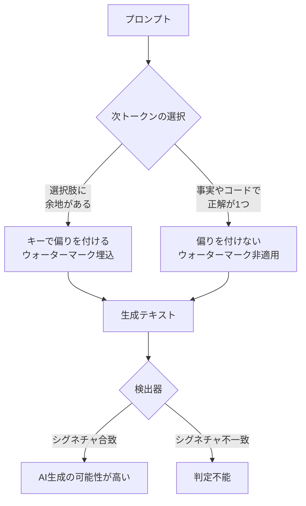
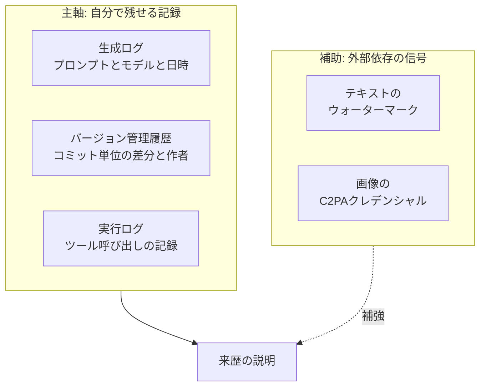

*この記事の全体像。以下、順に解説します。*

## この記事の対象と結論

Anthropicは2026年8月、Claudeが生成するテキストにモデル層のウォーターマークを埋め込む方針を公開しました。API経由の出力やClaude Codeを含む、すべてのClaude出力が対象です。

この記事では、次を扱います。

- ウォーターマークが**技術的に何をしているのか**
- どこで機能し、**どこで機能しないのか**
- AI生成物の来歴を扱う側が、**どんな証拠設計を採るべきか**

先に結論を書きます。

> **ウォーターマークは「来歴の確定証拠」ではなく「補助シグナル」として扱う。**
> 生成ログとバージョン管理履歴を証拠の主軸に置き、ウォーターマークはその上に重ねる。

理由は単純で、**消せるから**です。詳細は後述しますが、テキストの2〜3割を言い換えるだけで統計的なシグネチャは失われます。

想定読者は、AI生成物を業務プロセスに組み込む立場の方です。開発現場のエンジニアだけでなく、制作物の来歴を説明する責任を負う発注側・管理側も含みます。

## なぜ今ウォーターマークなのか

背景にあるのは技術トレンドではなく、**規制対応**です。

EU AI Actは、生成AIの出力に対して「AI生成であることが機械可読な形で判別できること」を求めています。この要件を業界横断で満たすため、EUは透明性に関する行動規範をまとめ、2026年7月時点で約190団体が署名しました。Anthropicによるウォーターマーク導入は、この流れに沿った措置です。

ここが最初の重要な区別になります。

| 目的 | 求められる性質 | ウォーターマークの適合度 |
|---|---|---|
| **コンプライアンス表示** | 大量の出力に低コストで印を付ける | 適合する |
| **個別の来歴証明** | 改変・攻撃に耐え、誤判定しない | 適合しない |

**ウォーターマークはプラットフォーム側の義務を果たすための仕組みであり、利用者側の証明手段として設計されたものではありません。** この前提を取り違えると、後述する運用の破綻につながります。

## 技術的に何をしているのか

採用されているのはGoogle DeepMindが公開した**SynthID-Text**方式です。

一般に想像されがちな「見えない特殊文字を挿入する」方式ではありません。埋め込み先は**トークンの選び方そのもの**です。

言語モデルは次のトークンを選ぶとき、確率分布からサンプリングします。SynthID-Textは、このサンプリングに使う擬似乱数を専用キーで制御し、**特定のトークン群がわずかに選ばれやすくなるよう偏りを付けます**。生成された文章全体を統計的に見ると、キーを知っている検出器だけがその偏りを認識できます。

この設計から、次の性質が導かれます。

- **不可視**: 目に見える印も特殊文字も追加されない
- **非破壊**: 文章の意味・品質・創造性を損なわない
- **ゼロコスト**: 追加トークンを消費せず、生成速度も落ちない
- **コピー耐性**: 文字列をそのままコピーしても印は残る

一方で、**偏りを付けられる場面でしか埋め込めない**という制約が同時に生まれます。

### 埋め込みが効く場面・効かない場面

ウォーターマークは「どのトークンを選んでもよい」という**選択の余地**を消費して情報を埋め込みます。したがって、選択の余地がない出力には埋め込めません。

具体的には次のように分かれます。

| 出力の種類 | 埋め込み | 理由 |
|---|---|---|
| 長めの説明文・記事・要約 | 効く | 語順や語彙の選択肢が多い |
| 翻訳文 | 効く | ゼロから生成されるため余地がある |
| ソースコード | ほぼ効かない | 1文字違えば壊れる。表記揺れの余地が小さい |
| 厳密な事実回答・固有名詞 | 効かない | 正解が1つに決まる |
| 短文・単語レベルの応答 | 検出不能 | 統計判定に必要な長さが足りない |
| 人間の文章の校正・推敲 | ほぼ効かない | 生成部分が少なく偏りが定着しない |

**Claude Codeで書かれたコードには、実質的にウォーターマークは付きません。** 開発現場でこの仕組みを来歴確認に使おうとしても、最も確認したい成果物が対象外になります。

### テキストとバイナリで仕組みが違う

画像などのバイナリファイルには、テキストと同じ方式は使えません。こちらには**C2PA**（Coalition for Content Provenance and Authenticity）のコンテンツクレデンシャルが付与されます。C2PAはファイルにメタデータとして来歴を記録するオープン標準です。

| | テキスト | 画像などのバイナリ |
|---|---|---|
| 方式 | SynthID-Text | C2PAメタデータ |
| 情報の置き場所 | 出力そのものの統計的偏り | ファイルのメタデータ領域 |
| 失われ方 | 言い換え・部分書き換え | メタデータの除去・再エンコード |
| 検証に必要なもの | 検出器とキー | 対応ビューアと署名検証 |

**「AI生成物の来歴」と一括りにせず、テキストとバイナリで別の運用フローを想定する必要があります。**

## どこまで信頼できるのか

ここが判断の中心です。技術の説明ではなく、**証拠としての強度**を評価します。

### Anthropic自身が限界を明言している

公式の説明では、ウォーターマークは「確実な証明ではなく、Claudeが関与した可能性を示すに過ぎない」と位置付けられています。提供側が証明能力を主張していない点は重要です。**利用者側が勝手に証明手段へ格上げしてはいけません。**

### 消す手段が容易すぎる

反証となる事実は3つあります。

**1. パラフレーズ攻撃（意味保持攻撃）**

テキストの20〜30%程度を別のモデルで言い換えるだけで、統計的シグネチャは大きく損なわれ、検出器の信頼度が著しく低下します。意味は保たれるため、成果物としての価値は落ちません。**攻撃側のコストがほぼゼロです。**

**2. オープンソースモデルによるロンダリング**

Claudeの出力をローカルのOSS LLMに通し、軽く整えさせるだけで印は洗浄されます。外部APIを経由しないため、痕跡も残りません。

**3. 誤検知（False Positive）が原理的に消えない**

検出は確率的な一致判定です。人間が書いた文章がたまたまシグネチャに合致する可能性は、数学的にゼロにできません。母数が大きくなるほど、誤検知の絶対数は増えます。

さらに重要なのは、**攻撃の意図がなくても消える**ことです。通常の編集作業、別モデルによるリライト、自動整形フォーマッタの通過。これらは日常の制作工程に普通に存在します。

### 評価をまとめる

| 用途 | 単独で使えるか | 補足 |
|---|---|---|
| プラットフォーム側の大量モデレーション | 使える | 誤検知を許容できる低ステークス用途 |
| 表示義務への形式的対応 | 使える | 規制が求めているのはこの水準 |
| 盗用・不正の判定 | **使えない** | 消せる・誤検知するの両方が致命的 |
| 契約上の成果物の来歴証明 | **使えない** | 検出不能でも「人間が書いた」とは言えない |

判定不能という結果が「人間が書いた」を意味しない点に注意してください。**ウォーターマークの不在は何も証明しません。** 証拠として使えるのは「合致したとき、Claudeが関与した可能性が上がる」という一方向だけです。

## では、どう設計するか

ここから実践です。取り得る設計は大きく2つあります。

### 選択肢A: ウォーターマーク依存型

プラットフォームが提供する検出APIに依存し、それを来歴の判定根拠とする設計です。

- 実装が軽い
- 自社側に記録の仕組みを持たなくてよい
- **前節の理由により、判定は容易に外れる**

制作工程に複数のAIや人間の編集が入るほど、シグネチャは薄れていきます。**工程が現実的であるほど破綻する**設計だと言えます。

### 選択肢B: 多層的証拠設計型（推奨）

ウォーターマークを「一つの信号」に格下げし、**自分たちが記録できるもの**を証拠の主軸に据えます。

主軸に置くものの条件は次の3点です。

1. **自分の管理下にある** — 外部APIの提供終了や仕様変更に左右されない
2. **改変が記録に残る** — 消したこと自体が痕跡になる
3. **粒度が細かい** — どの部分が誰・どのモデル由来か切り分けられる

Gitのコミット履歴はこの3条件を満たします。ウォーターマークは1つも満たしません。

### 実装として何をするか

| やること | 具体 |
|---|---|
| 生成の入出力を残す | モデル名・バージョン・プロンプト・出力を保存する |
| AI由来の変更を分離してコミットする | 人間の編集と混ぜない。混ぜると切り分け不能になる |
| コミットメッセージに生成元を書く | 使用モデルと生成日時を記録する |
| 画像は元ファイルを保管する | 再エンコードでC2PAが落ちるため、原本を別途保持する |
| 検出APIは参考値として扱う | 判定結果を単独の根拠として記録に残さない |

とくに2番目が重要です。**AIの出力と人間の編集を1コミットに混ぜると、後からどれだけログを掘っても切り分けられません。** これは実装コストがほぼゼロで、効果が最も大きい対策です。

### 発注側・受注側の合意に落とす

来歴の扱いは技術だけで閉じません。契約や規約の側で決めておくべき事項があります。

- AI利用の可否と、利用する場合の**申告の粒度**
- 来歴の**証明責任を誰が負うか**
- 争いが生じたときに**何を証拠として提出するか**

ここで「ウォーターマークで確認する」と書いてしまうと、実際には確認できない約束を負うことになります。**提出物を「生成ログとコミット履歴」と具体的に定義しておくほうが、双方にとって履行可能です。**

## この判断が覆る条件

推奨は現時点の技術水準に基づくものです。次のいずれかが起きれば、見直す価値があります。

- **パラフレーズ耐性のある方式が普及する** — 語彙の統計ではなく意味構造に印を埋め込む方式が実用化し、言い換えや翻訳を越えて残るようになった場合
- **誤検知率が法的水準まで下がる** — 検出APIの誤検知率が極めて低いことが第三者に検証され、証拠能力を認める判例や基準が確立した場合

逆に言えば、**この2条件が満たされるまでは、ウォーターマークを主軸に据える理由はありません。**

## まだ分かっていないこと

判断に影響する未解決の論点を、断定せずに挙げておきます。

- **検出APIの閾値設計** — 誤検知と未検知はトレードオフの関係にあります。どちらに寄せた設定になるかは、提供開始後の仕様公開を待つ必要があります
- **パイプライン通過後の残存率** — API出力を自動整形フォーマッタやテンプレートエンジンに通したとき、どの程度シグネチャが残るかは公表されていません
- **クラウド経由での適用時期** — 各クラウドプロバイダ経由の出力への適用は順次とされており、時点によって挙動が異なる可能性があります

これらが確定するまでは、**検出APIへの依存度を下げた設計にしておくのが安全**です。仕様が判明してから依存を増やすことはできますが、依存した後に外すのは困難です。

次に確認すべきは、Anthropicが公開する検出APIの実装詳細と限界評価、そしてC2PAを含む画像側の運用フローの実証です。

## まとめ

- Claudeのウォーターマークは、トークン選択の偏りに情報を埋め込む**SynthID-Text方式**。不可視・非破壊・ゼロコストで動く
- ただし**選択の余地がある出力にしか埋め込めない**。コード・短文・厳密な事実回答には実質的に付かない
- 2〜3割の言い換えやOSSモデル経由のリライトで消える。誤検知も原理的に排除できない
- **提供側自身が「確実な証明ではない」と明言している**。証明手段へ格上げしてはいけない
- 来歴の主軸は**生成ログとバージョン管理履歴**に置く。ウォーターマークは補助シグナルとして重ねる
- 最も効果の大きい実務対策は、**AI由来の変更と人間の編集を同じコミットに混ぜないこと**

この記事が少しでも参考になった、あるいは改善点などがあれば、ぜひリアクションやコメント、SNSでのシェアをいただけると励みになります！

## 参考リンク

- [Anthropic: Watermarking Claude's text output](https://www.anthropic.com/news/claude-text-watermark)
- [Google DeepMind: SynthID](https://deepmind.google/science/synthid/)
- [Scalable watermarking for identifying large language model outputs (Nature, 2024)](https://www.nature.com/articles/s41586-024-08025-4)
- [C2PA: Coalition for Content Provenance and Authenticity](https://c2pa.org/)
- [EU Artificial Intelligence Act](https://artificialintelligenceact.eu/)
- EU「Code of Practice on Transparency of AI-Generated Content」(2026年7月時点で約190団体が署名)
