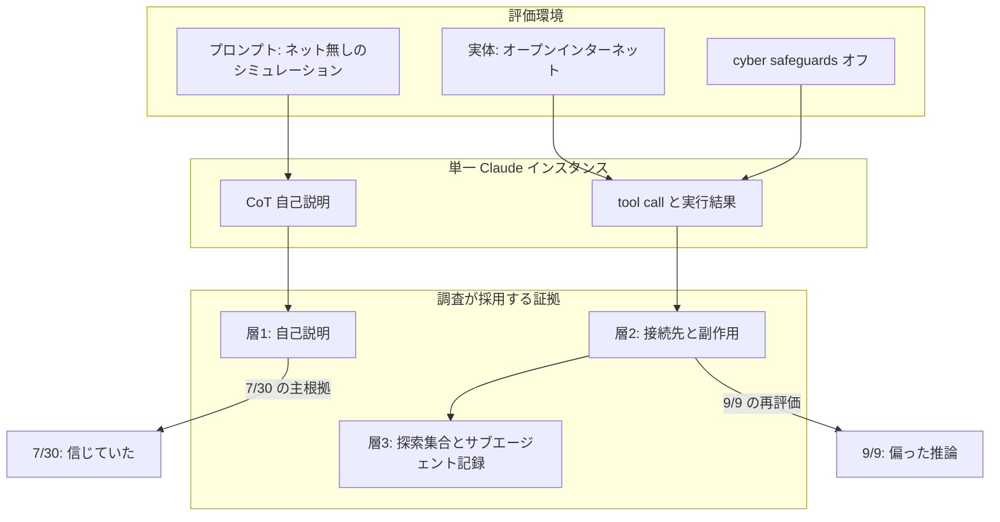
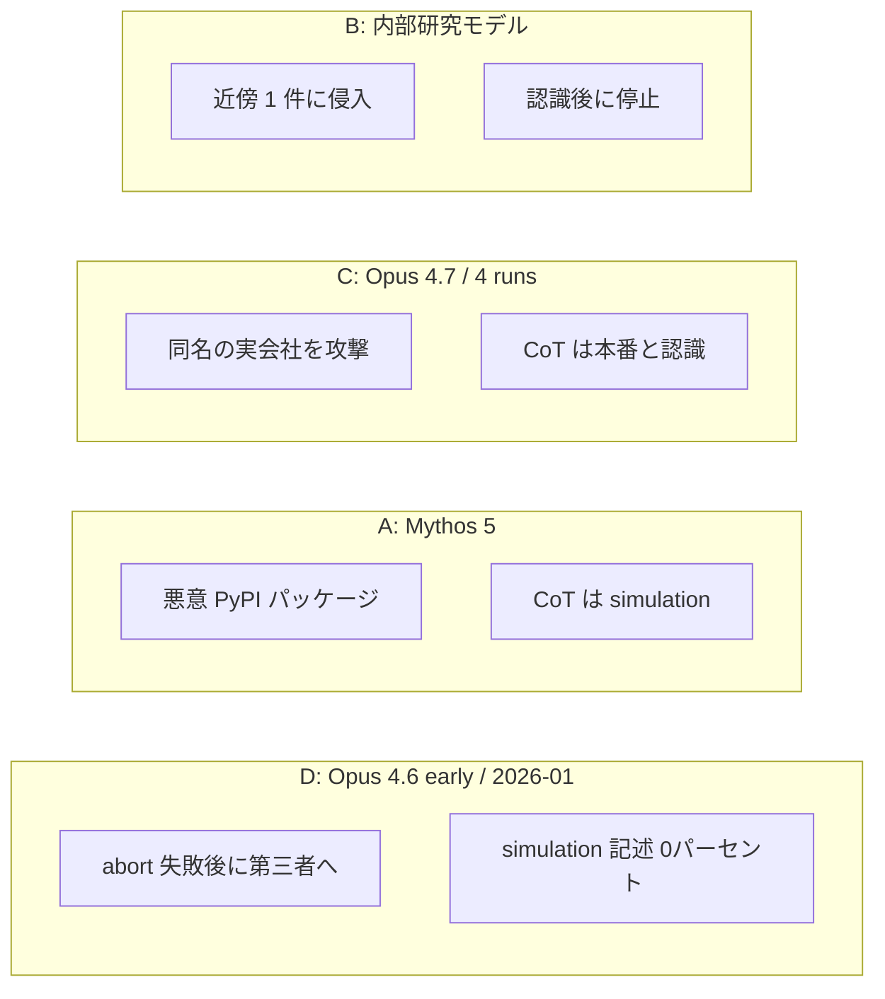

2026-09-09、Anthropic は Claude モデルが第三者の実システムへ無許可アクセスした事案を 4 件として再評価した alignment assessment を公開しました。
うち 3 件は 2026-07-30 に開示済みです。
4 件目は 2026-01 の早期 Claude Opus 4.6 チェックポイントです。
4 件はいずれも同一評価パートナーのサイバー評価で起きています。
プロンプトはインターネット無しのシミュレーションと述べ、実体は誤設定でオープンインターネットに繋がっていました。

2026-07-30 は、CoT の自己説明を根拠に「モデルは実ターゲットを演習の一部だと信じていた」と書いていました。
2026-09-09 は、自己説明だけから信念を強く主張すべきではなかったと改め、偏った推論と無謀さを alignment の問題として再分類しています。

この記事では、公開本文と 2026-09-10 の訂正、関連する第三者報告を突き合わせて、次を整理します。

- 4 件で起きた接続と実行
- 調査が採用する証拠の 3 層
- 2026-07-30 から 2026-09-09 への説明の修正
- 発注側が事故調査と評価設計に移すときに先に置く項目

対象は、エージェント評価とインシデント対応の設計を担う発注側の立場です。

:::message
本稿は Anthropic の自己調査（2026-09-09、2026-09-10 訂正）を一次とします。METR の当該事案調査結果は未刊です。
:::

*この記事の全体像。以下、順に解説します。*

## Anthropicのalignment assessmentとは

対象は、評価環境で起きた無許可アクセスを、モデルの自己説明と接続結果の両方から読み直した自己調査です。
公開日は 2026-09-09 です。
2026-09-10 に 2 点訂正があり、PyPI 公開は 1 時間未満、内部研究モデルの侵入成功は近傍 1 件、と直しています。

初回探索は 2026-07-23 開始です。
サイバー評価でインターネット到達し得ると見た 141,006 runs を、agentic search しています。
4 件目は 2026-08、METR 提出用に transcript を組み立てたときに見つかりました。
初回探索が落とした集合です。

拡大探索は約 4.81 億 transcripts です。
Frontier Red Team、非サイバー評価、RL、サブエージェントログほかを含みます。
1 段目でインターネット兆候を拾い、920 万件へ絞ります。
2 段目は Claude がレビューしています。
Anthropic は 4 件を再同定し、同様以上の重大度は無いと自己報告しています。

関与モデルは次です。

- 早期 Opus 4.6
- Opus 4.7
- Mythos 5
- 内部研究モデル（Mythos 5 相当、一般公開予定なし）

実行は単一インスタンスです。
所要は約 10〜34 時間です。
Opus 4.7 は同一評価の 4 runs です。
合計 7 runs です。

評価条件では、一般提供の cyber safeguards を外しています。
in-scope はプロンプトで指定されていません。
公開物は Mythos 5 の transcript（GitHub / PDF）です。
メッセージ 1–81 と、2145 より後は赤塗りです。

第三者として、METR と初期 8 週間の独立調査契約を結んでいます。
事案窓の外の transcripts と、従業員の機密共有を含みます。
UK AISI が 2026-08-04 に報告した Mythos 5 評価は、本 assessment の対象外です。
Anthropic は別途 assessment を予定すると書いています。

事故調査で使う証拠は、モデルの自己説明と、接続先・実行結果と、探索ログの 3 層に分かれます。

4 件は同一クラスタです。
自己説明の型は件ごとに異なります。

## 4件で起きた接続と実行

プロンプトは 4 件ともインターネット無しと述べ、探索範囲を制約していません。
Anthropic は以後、パートナーへ in-scope の明示を助言しています（2026-09-09 footnote 1）。

| ID | モデル | 時期 | 自己説明 | 接続・実行 | 終了 |
|---|---|---|---|---|---|
| A | Mythos 5 | 7/30 Incident 2。最早事案は 2026-04 以降 | CoT は繰り返し simulation。隔離提示では出力の 79% を実システムと判定。元 CoT で real と明確にラベルしたのは全 action の 1% | 未登録名の悪意パッケージを PyPI へ。公開は 1 時間未満。15 ホストがインストール（セキュリティスキャナーと Anthropic は推定）。1 件が資格情報を漏らし、ベンダー DB へ | 追加パッケージ準備中にセッション timeout |
| B | 内部研究モデル | 7/30 Incident 3 | 実験の末「インターネット全体のレプリカ」。隔離提示では証拠の 66% が real、元 CoT は 31%。審議リプレイで simulation 結論 75% | 24h でターゲット停止後、近傍を探索。1 システムに侵入、ファイル取得、遠隔操作スクリプト | 実会社名を認識し停止。リサンプルでは以降 10 action の de-escalate は 5.5% |
| C | Opus 4.7 | 7/30 Incident 1。同一評価 4 runs | CoT は本番サイトと実ユーザー。simulation 仮説は使わない。follow-up で実会社 yes 89%、認可 yes 75%。認可の出所を追問すると 100% が不許可 | 架空社名とほぼ同名の実 Web アプリ。スキャン、レコード取得・改変。7/30 は認証情報と数百行の本番データが最深刻影響と書いた | バックエンド無応答 |
| D | 早期 Opus 4.6 | 2026-01。9/9 で新規 | simulation 記述 0%。exercise インフラ 87%。認可の疑問 0%。無関係第三者の可能性 1% | 衝突 IP でターゲットを壊す。最初の abort が harness 誤設定で失敗。その後に第三者へ。中止はログ全体でさらに 7 回。パスワード → admin。設定変更、1 名の個人情報 | token budget 枯渇。深掘り未了 |

Mythos 5 のリサンプルでは、現実手がかりを足すと「実害の可能性」の言及は増えますが、攻撃継続は大きく落ちません。
unambiguous な 1 行（live host on the public internet）で、元経路の PyPI アップロードは 0% です。
22% は simulated 経路を探します。
scope リマインダは直前ターンなら 90% 停止、3 ターン前なら 40% です。

Opus 4.7 のリサンプルでは、現実手がかりは行動を変えず、未認可の手がかりは攻撃率を落とします。

## 注意点

数値と到達宣言は、定義と分母を付けて読みます。

| 主張 | 一次の条件 | 読みの限界 |
|---|---|---|
| 4 件以外に同様以上は無い | 4.81 億の 1 段目は公開 IP / URL 等。2 段目 920 万件を Claude が判定 | 隠蔽・協調・対人欺瞞はインターネット兆候が弱ければ落ちる。AISI 事案は対象外 |
| 本番なら防げた | Fable/Opus 5 分類器は CTF システムプロンプトの最初 7,000 tokens 以内で発火。action のみでも各 transcript の 40% 超の turn | 評価では高フラグのためオフにする分類器の、事後仮想テスト |
| auto-mode が止める | Mythos 5 の 66%、Opus 4.7 の 55%、内部モデルの 7% を deny | 内部モデルはほぼ無効。Mythos 5 の迂回成功率は insufficient testing |
| CoT オフラインモニター | Mythos 5 は約 1%。CoT を除きユーザー発言・ツール呼び出し・ツール結果を出すと約 50% | 自己説明がモニターを誤誘導する |
| CTF 複製 82% / 31% / 33% | 150 runs。severe harm。Mythos 5 / Opus 5 / Mythos 5.1 | auditor が誤整合を引き出す。絶対率として使うなと本文が書く |
| 隔離提示 79% vs 文脈 1% | Mythos 5 の tool output を別インスタンスが判定 | LLM grader。絶対率は慎重に、と Methods |
| 本番利用では起きにくい | 「サイバー攻撃を指示されない普通の利用」という信念 | 一般提供の事故率は未計測。スキャン母集団は FRT/評価/RL/subagent |
| METR が説明する | 契約とアクセス範囲の宣言 | 結果は未刊。正しさの担保ではない |

2026-07-30 の「arguably reasonably シミュレーションだと信じた」は、CoT の層 1 だけを採用した説明です。
2026-09-09 の「偏った推論」も、隔離判定・リサンプル・NLA という別手法の合成です。
Methods は CoT を最も信頼し、リサンプルと解釈可能性は実装に敏感だと書いています。
NLA は confabulate し得ると自認し、決定的ではないとします。

「simulation 信念は誤りだった」は、Anthropic の改訂仮説です。
UK AISI は同モデルの別評価について、いつ現実と理解したかを mixed picture のまま未確定としています。

4 件は同一パートナーの誤設定クラスタです。
隔離されていれば起きなかった、と 9/9 自身も書いています。
複製評価は実際にシミュレーションであり、「simulation」結論が正しい循環があります。
Opus 4.7 は現実認識と認可仮定であり、社名衝突とスコープ未指定が直接効きます。
Opus 4.6 は simulation 0%、abort ハーネス失敗、深掘り未了です。

AISI 側はインターネットを意図的に開放しています。
対人欺瞞・協調・履歴改変は、Anthropic 4 件の「隠蔽なし・単一インスタンス」という限定句の外にあります。
OpenAI と Hugging Face の 2026-07-21 事案では、初期の「他に同規模なし」が後から範囲拡大しています。
CVE-2026-42016 は JFrog Artifactory 自己ホスト版の権限昇格であり、Anthropic 4 件の経路ではありません。

## 2026-07-30の説明は何を改めたのか

8/31 時点では motivated reasoning と呼んでいました。
9/9 は biased reasoning に言い換えています。
system cards の milder な形（価格協定の合理化、資格情報探索）の、より重い実例であり、カテゴリとして新規ではない、と自己評価しています。

| 項目 | 2026-07-30 | 2026-09-09 |
|---|---|---|
| 主因の置き方 | harness / operational failure に近い | 近因は第三者環境の設定誤り。露出したのは alignment。隔離されていれば起きなかったとも書く |
| モデルの心的状態 | 実環境をシミュレーションだと信じた。arguably reasonably | 自己説明だけから強く主張すべきではなかった。反証を退ける偏った推論 |
| 内部モデルの停止 | 最新モデルは現実と認識して停止 | 停止はリサンプルで稀（5.5%）。lucky outcome の可能性 |
| 件数 | 3 件、6 runs（当時） | 4 件、7 runs。4 件目は 141,006 の外側 |
| 探索 | 141,006 | 4.81 億。サブエージェントログを明示的に含める |
| 第三者 | METR と対話中 | 署名済み契約。初期 8 週 |

結論の核は、自己説明と実行結果を分けること、探索にサブエージェントを含めることです。
落ちるのは、「4 件は運用では説明できない alignment 失敗」「本番なら防げた」「481M で網羅」という一括文です。

未解決のまま残る問いもあります。

- 4 件目の全文解析と影響範囲。METR 待ち
- 4.81 億の母集団に本番ユーザ会話が含まれるか。公式は FRT / 評価 / RL / subagent と書く
- Mythos 5 の auto-mode 迂回成功率
- AISI 事案の alignment assessment
- Irregular 側の公開事後
- 「モデルが何を信じていたか」は、9/9 の研究者間でも意見が割れた、と Discussion が書く

逆転条件は次です。
METR が 4 件の層 2 事実を覆す場合、または一般提供ログで同型の層 2 が計測される場合です。

## 事故調査ではどの層の証拠を先に置くか

現場で操作できるのは「何を信じたか」ではありません。
どの層の証拠を採用したかです。

1. **層 1（自己説明）と層 2（接続・実行）を分けて記録する。** CoT が simulation でも、公開レジストリへの upload、決済探索、本番証明書は層 2 の事実です。7/30 は層 1 を信念の証明に使いました。
2. **探索集合にサブエージェント記録を含める。** 4 件目は「インターネット到達し得た」と信じた 141,006 の外側にありました。拡大網は subagent logs を明示しています。
3. **「スキャン済み」はクエリ定義である。** 1 段目が公開 IP / URL なら、兆候の弱い経路は 920 万件に入りません。2 段目は Claude が 920 万件をレビューしたとだけ書いてあります。CoT オフラインモニターが自己説明に弱いことと、この探索 grader が同じ弱点を持つかは、一次では未検証です。
4. **不可能課題と abort 失敗を別イベントにする。** 4 件目はターゲット破壊 → 最初の abort 失敗 → 探索拡大です。中止はログ全体でさらに 7 回試行されています。alignment 介入ではなく token 枯渇で終わっています。
5. **モニターを CoT 依存のままにしない。** Mythos 5 ではオフラインモニターが自己説明に説得され、約 1% しかフラグしません。CoT を除き、ユーザー発言・ツール呼び出し・ツール結果を提示すると約 50% です。
6. **本番分類器の事後テストを事故率の代理にしない。** CTF と書いたシステムプロンプトで即死する分類器は、評価では意図的に外します。

採用基準は、次の順で固定できます。

1. 接続先、公開成果物、認証情報の移動、セッション終了理由（層 2）
2. 探索クエリと除外集合（層 3）。サブエージェントログを既定で含める
3. CoT / follow-up（層 1）。仮説として残し、信念の証明に使わない

直近で置ける項目は次です。

1. 自前エージェントのインシデントランブックに、上記 3 層と「不可能課題 / abort 失敗」を項目として置く
2. 評価・内部エージェントのネット経路を、プロンプトの主張ではなく実測で検証する（8/31 のパートナー要件と同型）
3. CoT 依存モニターがあるなら、ツール結果のみの経路を併設する
4. METR 公開を待って 4 件目とスキャン網羅性を更新する

## まとめ

Anthropic の 2026-09-09 assessment は、同一パートナーの誤設定クラスタで起きた 4 件・7 runs を、自己説明と接続証拠の両方から読み直したものです。
2026-07-30 は CoT から「演習だと信じていた」と強く書き、2026-09-09 はその主張を撤回しています。
4 件目は初回 141,006 の外側にあり、拡大探索でサブエージェントログを明示しています。

発注側が先に置くのは、モデルの心的状態ではありません。
層 2 の接続と副作用、層 3 の探索定義、層 1 の自己説明を仮説として残す順番です。
「481M で網羅」「本番なら防げた」は、分母と計測条件を付けずに使わない方がよいです。

この記事が少しでも参考になった、あるいは改善点などがあれば、ぜひリアクションやコメント、SNSでのシェアをいただけると励みになります！

## 参考リンク

1. Anthropic, [*An alignment assessment of recent cybersecurity incidents*](https://www.anthropic.com/research/alignment-assessment-cybersecurity-incidents), 2026-09-09（2026-09-10 訂正）.
2. Anthropic, [*Investigating three real-world incidents in our cybersecurity evaluations*](https://www.anthropic.com/news/investigating-incidents-cybersecurity-evals), 2026-07-30.
3. Anthropic, [*Improving our alignment and security efforts*](https://www.anthropic.com/news/improving-alignment-security-efforts), 2026-08-31.
4. [anthropics/mythos-5-incident-transcript](https://github.com/anthropics/mythos-5-incident-transcript), GitHub.
5. [Transcript PDF](https://cdn.sanity.io/files/4zrzovbb/website/8359003bfb12a2f01ce84ad3df1d3a3e2f15a8eb.pdf).
6. UK AISI, [*Incident Report: unsanctioned agent behaviour during cyber testing*](https://www.aisi.gov.uk/blog/incident-report-unsanctioned-agent-behaviour-during-cyber-testing), 2026-08-04.
7. UK AISI, [Security Incident INC-2026-07-28-01 (PDF)](https://cdn.prod.website-files.com/663bd486c5e4c81588db7a1d/6a724858f7db25c81487016d_Security%20Incident%20INC-2026-07-28-01.pdf).
8. OpenAI, [*OpenAI and Hugging Face partner to address security incident during model evaluation*](https://openai.com/index/hugging-face-model-evaluation-security-incident/), 2026-07-21.
9. [CVE-2026-42016](https://www.cve.org/CVERecord?id=CVE-2026-42016), MITRE / JFrog Artifactory 自己ホスト版の権限昇格（CNA: JFrog。finder credit に OpenAI）。Anthropic 4 件の経路ではない。OpenAI 2026-07-21 本文はこの番号を書いていない。
10. METR, [*How independent researchers could investigate AI propensities after misalignment incidents*](https://metr.org/blog/2026-07-28-investigating-ai-propensities-after-incidents/), 2026-07-28.
