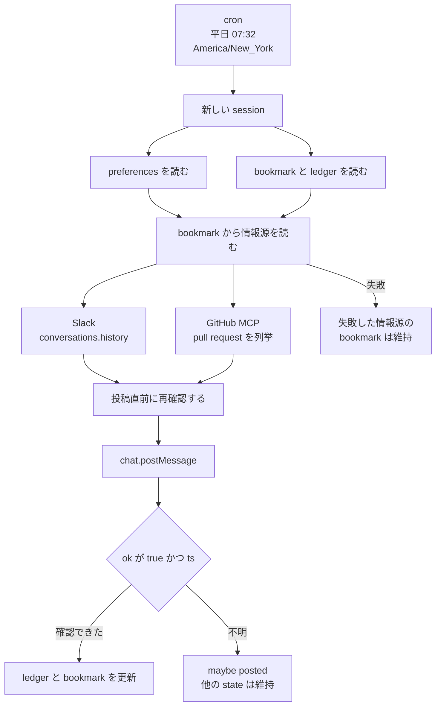

2026年10月8日、Lance Martin と CJ Avilla が開発者ブログ [Building effective agent automations](https://claude.dev/blog/building-effective-agent-automations/) で、定期実行するエージェントの参照実装を公開しました。
実装は Claude Managed Agents（beta）の上にあり、平日の朝に Slack のチャネルと GitHub の pull request を読み、1つの Slack チャネルへ短いブリーフを投稿します。
認証は vault、読む規則と実行の記録は別々の memory store、起動は cron の scheduled deployment が担います。
コードは [anthropics/claude-quickstarts](https://github.com/anthropics/claude-quickstarts/tree/main/managed-agents/daily-brief) の `managed-agents/daily-brief` にあります。

この記事では、その daily brief が取得位置、投稿の完了判定、認証の置き場をどのファイルとどの API に書いているかを追います。
無人の定期実行で、同じ3点を自分の worker に落とすときの材料になります。
記述の照合時点は 2026年10月10日です。

*この記事の全体像。以下、順に解説します。*

## daily brief とは

daily brief は、平日の朝に情報源を読み、1つの Slack チャネルへ短いブリーフを投稿する参照実装です。
毎回の run は新しい session です。
session は preferences と state をマウントし、情報源を読み、1チャネルへ投稿し、確認のあと台帳を書きます。
想定する読者は、無人の定期実行で取得位置、投稿の完了判定、認証の置き場を自分の worker に落とす人です。

### 6つの要素

開発者ブログが挙げる要素は、Sources、Destination、Agent、Schedule、Memory、Guardrails の6つです。
エージェント定義と、毎回新しい session を起こす scheduled deployment は分かれています。

| 要素 | daily brief での置き場 |
|---|---|
| Sources | Slack チャネルと GitHub の pull request |
| Destination | 投稿先の Slack チャネル 1つ |
| Agent | `agent.md`。モデル、ツール、実行手順。本文が system prompt になる |
| Schedule | `deployment.md` の cron。本文が毎回の最初のメッセージになる |
| Memory | `preferences`（読み取り専用）と `state`（読み書き） |
| Guardrails | 予算、ネットワーク許可、無効化した web ツール、vault |

### モデル、接続、時刻、予算

モデルは `claude-sonnet-5-5` です。
`agent.md` の先端コミット `2eb101988877bb363081d4b7657c8813b97fd31c`（2026-10-06T19:25:52Z）は、モデルを Sonnet 5.5 にする変更です。
対応する pull request [anthropics/claude-quickstarts#507](https://github.com/anthropics/claude-quickstarts/pull/507) は closed です。

GitHub は MCP（`https://api.githubcopilot.com/mcp/`）で読みます。
Slack は sandbox 内の `curl` です。
`web_search` と `web_fetch` は agent 定義で無効です。

cron は `32 7 * * 1-5`、timezone は `America/New_York` です。
平日 7:32（ニューヨーク）に起動します。
1 run の予算は `amount: "500"` です。
値はセントの文字列で、コメント上は 5.00 ドルです。

同梱 Slack アプリの bot scope は `channels:history` と `chat:write` です。

リポジトリ `anthropics/claude-quickstarts` の状態は、2026-10-10 時点で次のとおりです。

| 項目 | 値 |
|---|---|
| star | API の実数 17844（約 17.8k） |
| `isArchived` | false |
| default branch | main |
| `pushedAt` | 2026-10-08T17:34:23Z |
| main の先端 | 2026-10-07T18:17:41Z（`9ec32b91df50b0d4906cae64b13c6298055ff40d`） |

### 取得位置と投稿

情報源ごとの bookmark を `state` に持ちます。
初回だけ直近 24 時間を読みます。
以降は bookmark から読みます。

投稿は Slack の `chat.postMessage` です。
手順は、応答本体の `"ok": true` かつ `ts` のときだけ posted とし、その後に ledger と bookmark を更新します。
`ts` はメッセージ ID です。
情報源の取得に失敗したときは、その情報源の bookmark を維持します。
結果が不明なときは `maybe posted` とし、state の他は変えません。

preferences は読み取り専用マウント、state は読み書きマウントです。
preferences には読む規則を置き、state には bookmark、ledger、notes、run 記録を置きます。

### 1回の session

### ファイルの役割

開発者ブログのファイルツリーは `daily-brief/agent.md` のように平坦です。
リポジトリ上の実体は `managed-agents/daily-brief/agents/daily-brief/` 配下です。
名前は一致します。

| ファイル | 役割 |
|---|---|
| `agent.md` | モデル、ツール、実行手順。本文が system prompt になる |
| `deployment.md` | cron、timezone、vault ID、memory の access、予算。本文が毎回の最初のメッセージになる |
| `environment.yaml` | cloud sandbox。networking は limited。`allowed_hosts` は `slack.com`。`allow_mcp_servers: true` |
| `memory_store_preferences.yaml` | store 名 `preferences`。deployment では `read_only` |
| `memory_store_state.yaml` | store 名 `state`。bookmark、ledger、notes、run 記録 |
| `vault.yaml` と `setup.sh` | 資格情報の入れ物。Slack と GitHub を別 credential として作る |
| `slack/manifest.yaml` | bot scope 2つ |

`setup.sh` が作る credential は2つです。
Slack は `environment_variable` で、`secret_name` は `SLACK_BOT_TOKEN`、`allowed_hosts` は `slack.com`、注入は header です。
GitHub は `static_bearer` で、`mcp_server_url` は `https://api.githubcopilot.com/mcp/`、表示名は "GitHub (read-only)" です。
トークン本体は環境変数から渡します。
vault は実トークンを sandbox の外に置きます。

## 注意点

開発者ブログの6つの書き方（bookmark、失敗源の明示、投稿直前の再確認、Slack 確認後の台帳更新、preferences の再読、読み取り専用と予算）には、`agent.md` と `deployment.md` に対応する文があります。
対応の強さは項目で違います。
ここからは、手順の文と、プラットフォームの文書が強制する範囲の差をまとめます。

### コストの数字と図の範囲

README は繁忙日の自己計測を書いています。
2チャネルと2リポジトリ、メッセージ約140、pull request 約25の日に、Opus 5 が約1.50ドル、Sonnet 5 が約1.00ドルです。
全ソース失敗は 0.15 から 0.30 ドルです。
ソース倍増の増分は約3分の1です。
測定は、既定モデルが Sonnet 5.5 になる前です。
開発者ブログ本文にこの段落はありません。

Guardrails の図の alt は、turns、time、spend と heartbeat に触れます。
`deployment.md` にある上限は `budget` だけです。
turn cap と heartbeat のフィールドは、同梱の deployment にはありません。

公式モデルページは、`claude-sonnet-5-5` の公開を 2026-09-28、引退を 2027-09-28 より前にはしない、入力 2 ドル/MTok、出力 10 ドル/MTok、コンテキスト 1M、最大出力 128K と書いています。
出典は [Sonnet 5.5](https://platform.claude.com/docs/en/models/sonnet-5-5/overview) です。

### 取りこぼさない、という文

README は次のように書いています。

> Each source has a bookmark, so a late or skipped run loses nothing.

手順 3 は、Slack に `conversations.history` と `oldest`（Unix timestamp）だけを指定します。
`cursor`、`has_more`、`limit` は要求しません。
GitHub は "list pull requests through the MCP tools" だけです。

Slack 公式は、`oldest` と `latest` の間でも配列は最大 100 件で、新しい順が先だと書いています。
100 件を超えると `has_more` は true です。
出典は [conversations.history](https://docs.slack.dev/reference/methods/conversations.history) の Pagination by time で、2026-10-10 に本文を確認しました。

1ページだけ読んで bookmark をその中の最新へ進めると、ページに入らなかった古い未取得は、次 run の `oldest` より前になります。
開発者ブログは `notes.md` に "returns only the newest 50 items" と書き残す例を出し、切り捨てをモデルのメモに委ねています。

手順 3 は、情報源を bookmark の 10 分前から読む、と書き、同じ段落で Slack の `oldest` を bookmark そのものの Unix timestamp にする、とも書いています。
10 分の重ね読みが Slack の `oldest` に反映されるかは、この2文だけでは決まりません。
ページングの穴は、10 分を `oldest` から引いても埋まりません。

開発者ブログの bookmark 例は `"slack": "2026-09-14T13:02:11Z"` という ISO 文字列です。
`agent.md` は Slack の `oldest` に Unix timestamp を指定します。
同じ timestamp のメッセージは、`inclusive` を true にしないと結果に入らない、と Slack 公式が書いています。
`agent.md` に `inclusive` の指定はありません。

GitHub MCP の list pull requests の既定ページサイズは、参照した公開文書の範囲では特定できません。

### 投稿確認が指す範囲

`agent.md` は、Slack が HTTP 200 を成否と無関係に返すので、本体の `"ok": true` だけを数える、と書いています。
posted の条件は `"ok": true` かつ `ts` です。
既読や画面表示の完了を、参照した Slack 文書は `ts` の定義にしていません。

応答の message は送信引数と異なりえます。
公式は次のように書いています。

> Your message may mutate.

出典は [chat.postMessage](https://docs.slack.dev/reference/methods/chat.postMessage) です。

`fatal_error` と `internal_error` は `ok: false` 側です。
公式は次のようにも書いています。

> It's possible some aspect of the operation succeeded before the error was raised.

手順 7 は、結果が不明なら `maybe posted` とし、state の他を変えません。
投稿済みだった場合、bookmark は進まないので次 run が再投稿しえます。
重複防止は、投稿前に当日タイトルを destination の recent history で探す手順です。
pagination の指示はありません。
bot は search を使えない、と `agent.md` が書いています。

同一チャネルへの投稿は概ね 1 件/秒、ワークスペース全体は数百件/分、と `chat.postMessage` の Rate limiting が書いています。

`"ok": true` かつ `ts` がありながらメッセージが保存されない、という単発事例は、公式文書としては特定できません。
確認できるのは、本文の変化、エラー時の部分成功、ページング不足です。

### 認証の絞り込みが届く範囲

vault は実トークンを sandbox の外に置きます。
README は、投稿先の限定について "that is a prompt rule" と書いています。
同梱 manifest は、1つのアプリに `channels:history` と `chat:write` を同時に付けます。
2アプリに分ける案は、README の任意の強化です。
非公開チャネルには `groups:history` が別途要る、と README が書いています。

GitHub の読み取り専用は、利用者が fine-grained PAT に Contents: read と Pull requests: read を付けることに依存します。
MCP toolset は `always_allow` です。
`agent.md` は次のように書いています。

> The read-only GitHub token is what keeps this safe

プラットフォームが MCP ツールを read-only に固定する記述は、同ファイルにはありません。

未マージの [anthropics/claude-quickstarts#509](https://github.com/anthropics/claude-quickstarts/pull/509)（2026-10-10 時点で open）は、秘密の入れ方を `.env` から隠しプロンプトへ変えます。
著者の Out of scope は次のとおりです。

> The script cannot see a fine-grained token's permissions, so read-only still rests on what the user grants.

main の README は、この照合時点では `.env` 手順のままです。

公式は、vault と credential が workspace スコープだと書いています。
同じ workspace の API キーは、session 作成時にそれらを参照できます。
出典は [Vaults](https://platform.claude.com/docs/en/managed-agents/vaults) です。
`environment_variable` は self-hosted sandbox では未対応、と同ページが書いています。
この quickstart の `environment.yaml` は `type: cloud` です。

### beta と記憶の残り方

[Managed Agents の overview](https://platform.claude.com/docs/en/managed-agents/overview) は、Managed Agents が beta であり、挙動はリリース間で変わりうると書いています。
必須ヘッダは `managed-agents-2026-04-01` です。
同ページは、Zero Data Retention と HIPAA BAA の対象外だと書いています。

memory は別 beta ヘッダ `agent-memory-2026-07-22` を持ちます。
出典は [Memory](https://platform.claude.com/docs/en/managed-agents/memory) です。
公式は、read_write store への prompt injection が次 session の記憶になると警告しています。
開発者ブログも、植え付け指示が brief と notes を変えうると書いています。
GitHub へは書けず、preferences は編集できない、とも書いています。
`agent.md` の "state files never contain instructions" は、手順の文です。

memory の beta 契約が、台帳の永続性としてどこまで残るかは、ヘッダが本体と別であることまでは確認できます。
廃止日は、参照した文書にはありません。
公開 SLA の数値も、読んだ Managed Agents のページ群にはありません。

### プロンプト規則と強制の境界

| 振る舞い | どこに書いてあるか | プラットフォームが強制するか |
|---|---|---|
| 失敗した情報源の bookmark を動かさない | `agent.md` 手順 3 と 8 | 参照した文書では、原子的な禁止はない |
| `"ok": true` かつ `ts` のあとだけ ledger と bookmark を更新する | `agent.md` 手順 7 と 8 | 参照した文書では、投稿 API とファイル更新のトランザクションはない |
| 投稿先を destination だけにする | `agent.md` と README の "prompt rule" | 強制しない。token が参加しているチャネルへは投稿できる |
| preferences を毎 run 読み、エージェントは編集しない | `agent.md` 手順 1。deployment の `access: read_only` | cloud ではファイルシステムが書き込みを拒む、と memory 文書が書く |
| トークン実体を sandbox に置かない | vault の egress 置換 | Slack は許可ホストへの header 置換。GitHub は URL 一致の MCP proxy |
| 到達先を slack.com と GitHub MCP に限る | `environment.yaml` の allowlist | limited networking の到達許可。`web_search` / `web_fetch` は sandbox 外なので、agent 定義で無効にしている |
| 予算到達で止める | `deployment.md` の budget | idle になる。`stop_reason` は `budget_reached`。終了ではない。飛行中の 1 リクエスト分は上限を超えうる |
| MCP 障害を session 作成で落とす | なし | session は開始する。`session.error` を出す、と MCP connector 文書が書く |

予算の文書は [Budgets](https://platform.claude.com/docs/en/managed-agents/budgets)、MCP の文書は [MCP connector](https://platform.claude.com/docs/en/managed-agents/mcp-connector) です。

予算到達、scheduled deployment の rate limit（`session_rate_limited_error`、再試行なし）、pause 中の欠番（unpause は次回から、backfill しない）は、チャネルからは無音に見えます。
README は、予算到達について Console の run を見よ、と書いています。

実行時刻には jitter があります。
公式は間隔の 15%、最短 5 秒、最長 9 分と書いています。
春の存在しない壁時計は発火せず、秋の重複する壁時計は 2 回発火します。
07:32 は 1 時から 3 時の窓の外です。
2本目の排他は、参照した scheduled deployment 文書にはありませんでした。
組織あたりの scheduled deployment 上限は 1,000 です。
出典は [Scheduled deployments](https://platform.claude.com/docs/en/managed-agents/scheduled-deployments) です。

## 無人の定期実行に写す3つの規則

無人の定期実行では、次の3つを設計規則として採れます。

1. 情報源ごとの取得位置を、失敗した情報源では進めません。失敗と空結果を分けます。
2. 外部投稿は、API が受理 ID を返してから取得位置と既報台帳を更新します。不明は別状態にし、位置を進めません。
3. 認証情報は用途ごとに分け、実体は実行環境の外に置きます。権限の狭さはトークンと招待範囲で決めます。

この3つは、daily brief がプラットフォームのトランザクションとして保証する動作ではありません。
quickstart が手順として書き、一部をマウントと vault とネットワーク許可で支えています。

### 手順が名指ししていること

開発者ブログと `agent.md` は、固定 24 時間窓の穴と、失敗を「新着なし」と書く事故を名指しし、bookmark 維持と未読の明示を手順にしています。
同じ2つは、未達の投稿を記録すると欠番になり、不明のまま再送すると重複する、と書き、確認後だけ台帳を更新します。

preferences の `read_only`、vault のホスト限定注入、environment の allowlist、web ツールの無効化は、設定ファイルと公式の仕組みに対応があります。
この3点を名指しで否定する、番号を確認できた Issue は見つかりませんでした。
この quickstart に紐づく CVE も、NVD、MITRE、ベンダー advisory では確認できませんでした。
未確認の ID は書きません。

### 採用条件を狭める事実

ページングを要求していません。
規則 1 を守って bookmark を最新へ進めても、1ページに入らなかった中間件は次から範囲外になりえます。

`"ok": true` と `ts` は API 受理です。
`ok: false` の `internal_error` と `fatal_error` でも、一部成功の余地を Slack が書いています。

投稿と台帳更新のあいだにロックはありません。
予算到達は pause であり、次の cron は別 session を起こせます。
先の run が投稿のあと台帳の前で止まると、次 run は同じ state を読みます。

state は read_write です。
公式は、注入が次 session の記憶になると書いています。
手順 8 は、次 run がその store を信用します。

vault は秘密の所在と注入先の限定です。
Slack の読み書き分離も、GitHub の read-only も、vault は検証しません。
PR 509 の著者がその限界を Out of scope と書いています。
PR は未マージです。

Managed Agents は ZDR と HIPAA BAA の対象外です。
self-hosted では、この Slack の `environment_variable` 方式はそのまま使えません。

写す単位は、「プロンプトの希望」と「失敗時にカーソルを進めないコード」と「受理 ID まで台帳を進めないコード」です。
daily brief を、取得と投稿が一体で確定する基盤としては扱いません。

## 自分の worker へ落とす手順

次は、上の3規則を自分の定期実行へ落とすときの手順です。
daily brief のファイルをそのまま本番の基盤にする手順ではありません。

1. 情報源ごとの取得位置を worker の外に持ちます。固定の過去 24 時間を本線にしません。初回だけ窓を切ります。
2. 取得失敗と空結果を別ステータスにします。失敗した情報源の位置は維持し、通知に情報源名を出します。
3. 外部書き込みは、受理 ID が返ってから取得位置と既報台帳を更新します。部分成功の余地がある API は不明状態を分けます。受理 ID が手元にある再送は、その ID で既存メッセージを探します。結果不明で ID が無い再送は、送信前に自分で付けた識別子を本文へ入れ、投稿先の履歴からその識別子を探します。タイトル一致だけにはしません。
4. ページングを手順に書きます。1ページの最新まで位置を進めると、ページに入らなかった古い未取得が次から範囲外になります。
5. 読み取り資格と書き込み資格は、トークン権限と招待範囲で分けます。vault の有無は秘密の所在であり、権限分離そのものではありません。
6. 予算の idle、rate limit による session 未作成、休止を、チャネルの無音と区別する監視を別に持ちます。
7. 規則ファイルは、実行主体が書き換えできない場所に置きます。実行主体が書くメモは、次 run の命令として扱いません。

やめる条件は3つです。

- 取得位置の更新と投稿が、同じトランザクションで確定する基盤を使うときは、手順 2 と 3 の「不明のまま止める」を、その基盤の意味に合わせます。
- ZDR または HIPAA BAA が必須のときは、Managed Agents のこの beta を使いません。
- sandbox を self-hosted だけにするときは、Slack の `environment_variable` 方式を、公式の未対応のままでは使いません。

## まとめ

daily brief は、平日の朝に Slack と GitHub を読み、1つの Slack チャネルへ短いブリーフを投稿する参照実装です。
取得位置は情報源ごとの bookmark、読む規則は読み取り専用の preferences、実行の記録は読み書きの state、トークン実体は vault に分かれています。
投稿を posted と数える条件は、Slack 応答の `"ok": true` かつ `ts` です。

無人の run に写す中心は3文です。
カーソルは失敗で進めません。
外部投稿の台帳は受理 ID まで進めません。
秘密の保管と権限の狭さは別問題です。

この3文は手順と、マウント、vault、ネットワーク許可が支える範囲までです。
ページング、部分成功、投稿と台帳のあいだのロック、read_write な state への注入は、手順の外に残ります。

この記事が少しでも参考になった、あるいは改善点などがあれば、ぜひリアクションやコメント、SNSでのシェアをいただけると励みになります！

## 参考リンク

- Lance Martin、CJ Avilla。「Building effective agent automations」。claude.dev Blog。2026-10-08。[https://claude.dev/blog/building-effective-agent-automations/](https://claude.dev/blog/building-effective-agent-automations/)
- 参照実装。[managed-agents/daily-brief](https://github.com/anthropics/claude-quickstarts/tree/main/managed-agents/daily-brief)
- [Claude Managed Agents overview](https://platform.claude.com/docs/en/managed-agents/overview)
- [Vaults](https://platform.claude.com/docs/en/managed-agents/vaults)
- [Memory](https://platform.claude.com/docs/en/managed-agents/memory)
- [Budgets](https://platform.claude.com/docs/en/managed-agents/budgets)
- [Scheduled deployments](https://platform.claude.com/docs/en/managed-agents/scheduled-deployments)
- [MCP connector](https://platform.claude.com/docs/en/managed-agents/mcp-connector)
- [Sonnet 5.5](https://platform.claude.com/docs/en/models/sonnet-5-5/overview)
- [Slack chat.postMessage](https://docs.slack.dev/reference/methods/chat.postMessage)
- [Slack conversations.history](https://docs.slack.dev/reference/methods/conversations.history)
- [anthropics/claude-quickstarts#507](https://github.com/anthropics/claude-quickstarts/pull/507)。closed。モデルを Sonnet 5.5 にする。
- [anthropics/claude-quickstarts#509](https://github.com/anthropics/claude-quickstarts/pull/509)。open（2026-10-10）。秘密の投入方法。read-only は利用者の付与。
