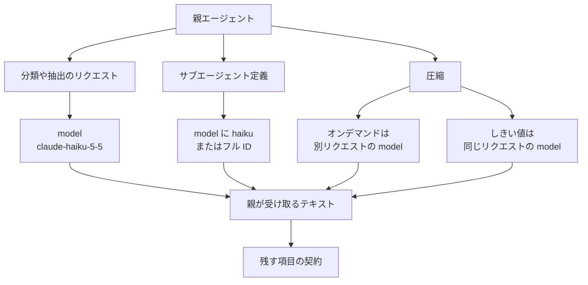

Claude Haiku 5.5 は、Anthropic が 2026-10-07 に公開した Claude ファミリーのモデルです。この記事では、モデル ID、100,000 トークンを境にした価格、圧縮とサブエージェントへの置き方を、公開されている一次の文に沿って整理します。価格と評価条件はベンダーの公表値で、照合日は 2026-10-08 です。

想定する読者は、仕事の規模でモデルを分ける運用者です。短い分類、圧縮、サブエージェントに置くときの ID、単価、effort、拒否の扱いを追えます。


*この記事の全体像。以下、順に解説します。*

## Claude Haiku 5.5とは

公式の位置づけは、要約、文脈の compaction、分類、データベース問い合わせ、コーディング時のサブエージェントなど、件数の多い処理を上位モデルと分けて置くことです。出典は [Claude Haiku 5.5 の発表](https://www.anthropic.com/claude-haiku-5-5) と [モデル概要](https://platform.claude.com/docs/en/models/haiku-5-5/overview) です。価格、能力評価、顧客事例は、発表と [system card（2026-10-07）](https://www-cdn.anthropic.com/e1080d6bf5ae2018ea3c2f414064be03232f5be5/Claude%20Haiku%205.5%20System%20Card.pdf) に載ります。

### 公開された範囲

Status は Active です。公開日は 2026-10-07 です。Retirement は 2027-10-07 より前にはしない、とモデル概要が書いています。

知識カットオフは Jun 2026 です。reliable と training data の両方がこの月です。

effort を持つ最初の Haiku です。段階は `low`、`medium`、`high`、`xhigh`、`max` です。Claude API と Claude Code の既定は `medium` です。

Adaptive thinking は既定でオンです。`thinking` を切る指定は、`low`、`medium`、`high` で使えます。

```json
{"thinking": {"type": "disabled"}}
```

コンテキスト窓は 1M トークンが既定です。同期の最大出力は 128K トークンです。同じ本文は Haiku 4.5 より約 30% 多くトークンになる、とモデル概要が書いています。1M トークンは、現行トークナイザで約 555,000 語です。

モデル ID は呼び先で分かれます。

| 呼び先 | モデル ID |
| --- | --- |
| Claude API | `claude-haiku-5-5` |
| Google Cloud | `claude-haiku-5-5` |
| Microsoft Foundry | `claude-haiku-5-5` |
| Claude Platform on AWS | `claude-haiku-5-5` |
| Amazon Bedrock | `anthropic.claude-haiku-5-5` |
| Vercel AI Gateway | `anthropic/claude-haiku-5.5` |

Vercel の文字列はドット区切りです。これは [Vercel changelog（2026-10-07）](https://vercel.com/changelog/claude-haiku-5-5-now-available-on-ai-gateway) の表記です。

Messages API のレート制限は Haiku 4.5 と別枠です。2026-10-08 に読んだ [rate limits](https://platform.claude.com/docs/en/api/rate-limits) では、次のとおりです。

| プラン | RPM | ITPM | OTPM |
| --- | --- | --- | --- |
| Start | 1,000 | 2,000,000 | 400,000 |
| Build | 5,000 | 5,000,000 | 1,000,000 |
| Scale | 10,000 | 10,000,000 | 2,000,000 |

Batch API は、入力と出力が 50% 引きです。同期の 128K を超える出力は、beta header `output-300k-2026-03-24` で 300K までです。

サーバ側 compaction の対応モデル一覧に `claude-haiku-5-5` があります。オンデマンドは beta `compact-2026-09-04` です。しきい値は beta `compact-2026-01-12` です。

Agent SDK のサブエージェント `model` は、`'haiku'` またはフル ID を受け付けます。出典は [Agent SDK の subagents](https://code.claude.com/docs/en/agent-sdk/subagents) です。

### 公表された単価の境目

入力価格は、プロンプト 100,000 トークンまでと、それを超える側で分かれます。2026-10-08 に読んだ発表表では、100 万トークンあたりの単価は次のとおりです。左が 100,000 トークンまで、右が超えです。

| 項目 | 100,000 トークンまで | 100,000 トークン超 |
| --- | --- | --- |
| Input | $0.10 | $0.50 |
| Output | $0.50 | $2.50 |
| Cache reads | $0.01 | $0.05 |
| Cache writes（5 分。発表表） | $0.125 | $0.625 |
| Cache writes（1 時間。概要ページ） | $0.20 | $1 |

単位は 100 万トークンあたりです。1 時間の cache write は概要ページの値です。5 分の cache write は発表表の値です。

### モデルを置く三箇所

呼び出し側がモデル ID を置く場所は三つあります。分類リクエスト、サブエージェント定義、圧縮リクエストです。

しきい値圧縮は、そのリクエスト自身のモデルが要約します。オンデマンド圧縮は要約だけの別リクエストなので、そのリクエストの model を Haiku にできます。



契約に載せる項目は、次のとおりです。

- 引用した根拠
- 未決
- すでに行った外部操作と、禁止した外部操作
- 継続のための state、next steps、learnings

`instructions` を書くと、公式の既定要約プロンプトは残らず、この契約文が要約指示の全体になります。

## 注意点

発表の平均、能力表の運転点、顧客の自己申告、拒否の指標は、前節の仕様とは別の条件で読んでください。

### 約75%という平均

発表の「around 75% less expensive」は、リスト価格の比そのものではありません。脚注は、100,000 トークン以下のリクエストが Haiku 4.5 比で 90% 安く、超える側は 50% 安く、Haiku 4.5 ではリクエストの 90% が前者だった、と書いています。トークン数がやや増える分もその平均に入る、と発表は述べています。圧縮のような長い入力で測った値とは書いていません。

100,000 を 1 トークンでも超えると、入力も出力も単価は 5 倍です。$0.10 が $0.50 になり、出力は $0.50 が $2.50 になります。

### 能力表の条件

能力表の多くは、安い運転点の点数ではありません。system card Table 8.1.A は、特記が無い Haiku 5.5 の結果を、adaptive thinking、max effort、サンプリング既定、5 試行平均としています。API の既定 effort は `medium` です。

| 評価 | Haiku 5.5 | Haiku 4.5 | Sonnet 5.5 | GPT-6 Luna |
| --- | --- | --- | --- | --- |
| SWE-bench Pro | 64.8% | — | 81.3% | — |
| SWE-bench Multilingual | 83.7% | 67.4% | 90.3% | — |
| SWE-bench Multimodal | 30.7% | 19.8% | 54.3% | — |
| FrontierCode 1.1 Main | 46.4%（max）、45.8%（xhigh） | — | 46.2%（max）、52.1%（xhigh） | 42.4 |
| HLE、ツールなし | 45.9% | 10.2% | 56.9% | — |
| HLE、ツールあり | 57.4% | 18.7% | 64.5% | — |
| OSWorld 2.1 offline subset | 72.4% | 15.7% | 83.9% | 48.9 |
| HealthBench Professional（length-adjusted） | 64.8% | 32.2% | 69.2% | — |
| GDPval-AA v2.1 | 1620 | 735 | 1840 | 1437 |
| AA-Briefcase v1.1 | 1578 | 614 | 1824 | 1336 |

FrontierCode の発表表が Sonnet に付ける 52.1% Xhigh は、max 同士の比較ではありません。max では Sonnet Main 46.2%、Haiku 46.4% と、system card §8.3 が書いています。競合の数字は各開発者の system card またはリーダーボードから、と Table 8.1.A の注があります。OSWorld の GPT-6 Luna は、Anthropic が同じ 82 タスクを OpenAI API と OpenAI の context compaction で走らせた、と脚注 11 が書いています。

Terminal-Bench 4.0 は §8.4 の別条件です。Haiku 5.5 は 39.2%（標準誤差 ±1.9）です。66 タスク、10 試行で 660 です。Claude Code `--bare`、max effort、セーフガード有効、フォールバック無し、インターネット出禁です。セーフガード停止は 12/660（1.8%）で、うち 10 は単一タスクです。停止した試行はすべて失敗です。出禁の効果は厳密には測っていませんが、カードは最終スコアをノイズ幅の外へは変えていないと考えている、と書いています。

同じ節の他モデルは、試行数と effort が揃っていません。

| モデル | スコア | 条件 |
| --- | --- | --- |
| Sonnet 5.5 | 70.6%（±2.5） | 5 試行、330。セーフガード該当の 1.2% のリクエストはフォールバックが答え、試行の 1.5% に影響する |
| Opus 5.5 | 66.4% | xhigh。フラグはリクエストの 2.5%、試行の 10% に影響する |
| Haiku 4.5 | 0.0% | 固定の thinking budget 63,999 トークン（effort 以前） |
| GPT-6 Luna | 16.4% ±2.7 | 公開リーダーボード。Codex CLI の max、とカードが書く |

発表の表には effort 列がありません。Sonnet の FrontierCode だけ Xhigh と付きます。

### 顧客数値

顧客数値は早期テストの自己申告です。発表は「independent に検証した」とは書いていません。分母が無いものが多いです。

- Asana は、レイテンシ 30% 超の削減、ターンあたり最大 2.5 倍です。件数はありません。
- HubSpot は、CRM スイート 92.8%、3 回の平均です。スイートのサイズはありません。
- AlphaSense は、週約 800 万コール、400 クエリ、0.84 対 0.76 です。0.84 の指標定義は発表文にありません。
- Box は、Haiku 4.5 比で 11 ポイント高く、レイテンシは約半分です。母数と基準点はありません。
- Rogo は、短い参照、サブエージェント、要約に Haiku を置きます。デッキは大きいモデル、10-K のセグメント売上は Haiku、という役割分担の記述です。
- Cognition の FrontierCode 66.2 は、Haiku 5.5 を sidekick、Opus 5.5 を lead にした Fusion の点数です。Haiku 単体ではありません。

### 過拒否と生物学の分類器

過拒否は二つの指標です。片方にまとめません。

単発の良性 API（システムプロンプト無し）は、Haiku 5.5 が 0.17%（±0.03）、Haiku 4.5 が 0.44%（±0.05）です。自動行動監査 §6.2.2 では、試したモデルのうち Haiku 5.5 の過拒否が最多で、Haiku 4.5 より多い、と本文が書いています。図のスコアは 0–10 で、本文に整数パーセントはありません。漏れた解答を黙って使った率は本文で 17%、Haiku 4.5 は 2% です。図は 95% CI です。

生物学のセーフガードは、発表と system card で言い方が揃っていません。発表は Sonnet 5、Sonnet 5.5、Opus 5 と同じ、と書いています。system card §1.5 は、Opus 5 と Sonnet 5 と同じ有害 CB 分類器であり、Opus 5.5 の広い研究用生物学分類器ではない、と書いています。分類器にフォールバックモデルは無い、とも書いています。この記事では両方を残し、どちらかに寄せません。

### 二次情報

[Simon Willison（2026-10-07）](https://simonwillison.net/2026/Oct/7/claude-haiku-5-5/) は案内として有用です。数値は二次情報です。同記事の「reasoning を無効にできない」は、公式の `thinking: {"type":"disabled"}` と合いません。`xhigh` と `max` で thinking を切ると 400 になる、という公式の条件とは別です。プロンプト文で「直接答えよ」と書いても思考は止まらない、と [プロンプトガイド](https://platform.claude.com/docs/en/build-with-claude/prompt-engineering/prompting-claude-haiku-5-5) が書いています。

Simon は Luna の値上げを、272,000 トークンで $0.20 / $0.75 と書いています。この価格と閾値は、OpenAI 一次では未確認です。トークナイザが自分のツールで約 1.25 倍、という記述は、公式の「約 30%」と並べるときの二次情報です。ペリカンの所要時間とセント額は逸話です。

Vercel の「推論マークアップは無く、BYOK を含めてプラットフォーム料は取らない」は、Vercel の告知です。

## 公式が名指しする呼び出し先

用途の文は発表ページとモデル概要にあります。そこには、API が要約モデルを Haiku にするパラメータはありません。呼び出し側が model を書きます。

| 仕事 | 公式が名指しする場所 | 呼び出し側が置くもの |
| --- | --- | --- |
| 分類、抽出、ルーティング、サブエージェント | モデル概要の一行定義。プロンプトガイドは短い大量処理に `low` | リクエストの `model` を `claude-haiku-5-5`。既定 effort は `medium` |
| オンデマンド圧縮 | [compaction on demand](https://platform.claude.com/docs/en/build-with-claude/compaction-on-demand) | beta `compact-2026-09-04`。要約は別リクエスト。その model を Haiku にできる。Amazon Bedrock は not available |
| しきい値圧縮 | [compaction threshold](https://platform.claude.com/docs/en/build-with-claude/compaction-threshold) | beta `compact-2026-01-12`。Bedrock は beta。パラメータは type、trigger、pause_after_compaction、instructions。model は無い |
| クライアント SDK の自動圧縮 | [Cookbook の automatic context compaction](https://platform.claude.com/cookbook/tool-use-automatic-context-compaction) | `compaction_control.model` は任意。既定はメインモデル。読んだページは Haiku 5.5 を名指ししない |
| サブエージェント | [Agent SDK の subagents](https://code.claude.com/docs/en/agent-sdk/subagents) | `model` に `'haiku'` またはフル ID。省略は Claude Code の subagent model order であり、Haiku ではない |

### 圧縮のパラメータ

しきい値の既定トリガーは次です。最小は 50,000 トークンです。

```json
{"type": "input_tokens", "value": 150000}
```

150,000 は、5 倍単価の側で発火します。コード例の model は `claude-opus-5-5` です。

`instructions` は既定プロンプトを補足しません。完全に置換します。各モデルの既定は、継続に必要な情報を summary タグに書きます。例示には state、next steps、learnings が含まれます。Haiku 5.5 の既定がこの全文だとは、読んだページは書いていません。

Claude 5.1 以降では、独自 instructions の要約入力は見える会話だけです。それ以前の thinking ブロックは、要約入力に入りません。圧縮後に戻すターンへ thinking を再挿入すると、条件を外れた kept thinking は後続リクエストで 400 になるか、`drop_block` で捨てられます。

`block_binding` が Haiku 5.5 で有効なのは、adaptive thinking のときです。出典は preserved thinking のページです。thinking を `disabled` にして `block_binding` を送ると 400 になります。呼び出し側が thinking ブロックを除きます。圧縮レスポンスは、残した thinking が保持されるかを述べません。

エイリアス `haiku` が 2026-10-08 時点で `claude-haiku-5-5` へ解決するかは、エイリアス専用ページでは確認していません。フル ID を書くと、この未確認は決定をブロックしません。親が haiku 族のとき、族エイリアスはメイン会話の正確なモデルになる、と [Claude Code の sub-agents](https://code.claude.com/docs/en/sub-agents) が書いています。

### サブエージェントの解決順

Claude Code のモデル解決順は、次です。

1. 呼び出し時の model
2. 定義の frontmatter
3. `CLAUDE_CODE_SUBAGENT_MODEL`
4. メイン会話のモデル

`CLAUDE_CODE_SUBAGENT_MODEL_FORCE` がオンだと、定義の model は無視されます。`CLAUDE_CODE_SUBAGENT_MODEL` だけでは、組み込みの Explore と Plan は変わりません。

Explore は、メイン会話が Fable で、Claude のサブスクリプション、Console、または `ANTHROPIC_BASE_URL` の LLM gateway のときだけ、`opus` エイリアスの解決先になります。それ以外はメイン会話のモデルを使います。

サブエージェントの effort は、定義より `CLAUDE_CODE_EFFORT_LEVEL` が強いです。サブエージェント単位の thinking 設定はありません。

`tools` を省略すると、サブエージェントに使えるツールを継承します。バックグラウンドの既定でも、Bash、Edit、Write、WebFetch、WebSearch が残る、と Claude Code のページが書いています。親の許可ルールも継承します。Fork は両方のフィルタを飛ばし、メイン会話のツール集合を受け取ります。

### 親が受け取るもの

親はサブエージェントの最終報告を受け取ります。自分の応答の中で、その報告を要約することがあります。レート制限のような API エラーは、結果としては渡りません。

fork 以外では、親の会話履歴は渡りません。渡るのは Agent ツールのプロンプト文字列です。fork は親の履歴を受け取ります。

## 価格、レート制限、拒否

2026-10-08 に読んだ公式表です。単位は 100 万トークンあたりです。Haiku 5.5 の左はプロンプト 100,000 トークンまで、右は超えです。Haiku 4.5 はフラットです。Sonnet 5.5 の cache read は、発表と同時に $0.20 から $0.10 へ下がった、と発表が書いています。

| 項目 | Haiku 5.5 | Haiku 4.5 | Sonnet 5.5 |
| --- | --- | --- | --- |
| Cache reads | $0.01 / $0.05 | $0.10 | $0.10 |
| Cache writes（5 分。発表表） | $0.125 / $0.625 | $1.25 | $2.50 |
| Cache writes（1 時間。概要ページ） | $0.20 / $1 | 発表の比較表には無い | この比較表には無い |
| Input | $0.10 / $0.50 | $1.00 | $2.00 |
| Output | $0.50 / $2.50 | $5.00 | $10.00 |

思考トークンは出力として課金され、`max_tokens` に数えます。Haiku 5.5 では、前ターンの thinking ブロックを既定で残し、後続リクエストの入力として課金する、と [context windows](https://platform.claude.com/docs/en/build-with-claude/context-windows) が書いています。Haiku 5.5 には、残トークン予算の注入タグは付きません。

キャッシュ読みは ITPM に算入しません。算入する例外は Haiku 3.5 です。レート制限は `inference_geo` をまたいで同一プールです。

top-level の effort をリクエスト間で変えると、プロンプトキャッシュは無効になります。`low` から `medium` にすると、Anthropic のテストでは早期停止がおおよそ半分になり、試行あたりの出力トークンが 2 倍を超えました。試行数 n は書いていません。出典はプロンプトガイドです。

### 429 と支出上限

429 のレート制限には `retry-after` があります。月次支出上限の 429 には `retry-after` が無く、`error_code` は `enforced_spend_limit_reached` です。同じページの支出上限は、Start が月 $500、Build が月 $1,000、Scale が月 $200,000 です。再開は翌月 1 日 00:00 UTC です。

利用者が置いた支出上限は、HTTP 400 の `invalid_request_error` です。出典は rate limits ページで、2026-10-08 に再照合しています。

### 拒否

拒否は HTTP エラーではありません。`stop_reason: "refusal"` です。区分は cyber、frontier_llm、bio、general_harms です。サーバ側フォールバックはありません。同じモデルへの再送は、通常また拒否になります。Haiku 4.5 からの移行では、この refusal は新しいです。

cyber は、ソースコード内の脆弱性発見は許可し、高リスクの両用サイバーは許可しません。良性のサイバー作業も、この区分に入ることがあります。ペネトレーションテストは止まります。発表は、Sonnet 5.5 のセーフガードより広い防御作業を許す、と書いています。他プラットフォームでは挙動が違いうる、と system card が書いています。

分類コーパスでのサイバー偽陽性率は、参照した公式ページには数値がありません。単発 API の 0.17% を、その率として使いません。

公開の可用性パーセントは、読んだページにはありませんでした。API の Free tier を Haiku 5.5 個別には確認していません。公式 Colab は、モデルページの Resources にありません。

`temperature` を送るなら 1、`top_p` を送るなら 0.99 だけが、単体で受理されます。両方を併記すると 400 になります。`top_k` はどの値でも 400 になります。これは migration guide の範囲で、モデル概要の「非既定は 400」より狭いです。`budget_tokens` と assistant prefill はエラーになります。

思考ブロックは、それを生成したアカウントか、リンクしたアカウントでだけ使えます。別アカウント、またはリンクしていないアカウントへ送ると、thinking ブロックは捨てられ、リクエストは成功します。400 になる既定は、`system`、`tools`、それより前の `messages` の prefix 不一致です。対象は 2026-08-31 00:00 UTC 以降に作られたアカウントで、`drop_block` を選ばないときです。

## 受け皿にする判断

大量の短い分類と、呼び出し側がモデルを指定する圧縮・サブエージェントには、`claude-haiku-5-5` を受け皿にできます。API がそれを自動で選ぶわけではありません。複雑なエージェントコーディングの親には置きません。親へ戻すテキストには、根拠、未決、外部操作、state、next steps、learnings を契約として書きます。

### 仕様が支えている点

- 発表と概要が、その用途を名指ししています。
- 100,000 トークン以下のリスト価格は、Haiku 4.5 の入力 $1.00 / 出力 $5.00 に対し、$0.10 / $0.50 です。
- オンデマンド圧縮は別リクエストなので、model を Haiku にできます。
- Agent SDK は `model` と `tools` を定義できます。
- レート制限が別枠なので、親の枠と子の枠を分けて観測できます。
- Terminal-Bench では、max effort でも Haiku 39.2% に対し Sonnet 70.6% です。発表自身が、複雑なエージェントコーディングは Sonnet 5.5 と Opus 5.5、と書いています。

### 運転点を狭める点

- 100,000 を超えると単価は 5 倍です。既定の圧縮トリガー 150,000 はその側にあります。約 30% 多いトークン数と、残る thinking の入力課金が、境目を早めます。
- 「約 75%」は、旧 Haiku のリクエスト分布に乗せた計算です。圧縮ワークロードの実測ではありません。
- `instructions` は既定を消します。思考にしか無い根拠は、要約入力にも圧縮後の文脈にも残りません。
- `tools` の省略は、狭い権限になりません。Bash、Edit、Write がバックグラウンド既定に残ります。
- フロントマターの model と effort は、呼び出し時パラメータと環境変数に負けます。
- 親は子の報告を要約しえます。レート制限エラーは結果になりません。
- `low` の長いエージェントプロンプトでは、検索スキップ、早期停止、検証スキップが増える、と公式が書いています。`medium` でも、コード変更を未検証のまま完了と報告することがあります。
- 発表表の点数は max effort が中心です。推奨する `low` / `medium` の動作点ではありません。
- 顧客数値は自己申告です。Cognition 66.2 は Fusion です。
- refusal にサーバ側フォールバックは無く、良性サイバーでも止まりえます。

受け皿にする結論は残ります。確信度を下げるのは、自動ルーティングではなく呼び出し側の固定であること、100,000 トークン未満であること、ツールを許可リストで絞ること、要約契約が既定プロンプトの置換であること、です。能力表と 75% と顧客引用は、その運転点の証拠にはしません。

## 呼び出し側が固定する条件

分類と抽出は、プロンプトが 100,000 トークン未満で、仕事が短いときに、`claude-haiku-5-5` と effort `low` を呼び出し側が固定します。根拠を残す要約は effort `medium` とし、`instructions` に次を全部書きます。既定は消えます。

- 引用した根拠（ソース ID または引用）
- 未決
- すでに行った外部操作と、禁止した外部操作
- state、next steps、learnings

同じキャッシュ接頭辞で `low` と `medium` を往復しません。effort の変更はキャッシュを無効にします。

しきい値圧縮を Haiku 自身のリクエストで使うなら、trigger を 50,000 以上かつ 100,000 未満にします。既定の 150,000 は 5 倍単価側です。オンデマンドで要約モデルだけを Haiku にするなら、別リクエストの model を `claude-haiku-5-5` にします。Bedrock ではオンデマンドは使えません。

サブエージェントは、`model` を `'haiku'` または `claude-haiku-5-5` と書き、`tools` を許可リストで書きます。省略は Haiku を選ばず、ツールは継承されます。Explore と Plan を、`CLAUDE_CODE_SUBAGENT_MODEL` だけでは Haiku にしません。

`CLAUDE_CODE_SUBAGENT_MODEL=haiku` と `CLAUDE_CODE_SUBAGENT_MODEL_FORCE` を両方置くと、定義の model は無視され、general-purpose も Haiku になります。`FORCE` だけでは、メイン会話のモデルのままです。fork と `model: inherit` の skill は、両方を置いてもメイン会話のモデルです。

複雑なエージェントコーディングの親は、Sonnet 5.5 または Opus 5.5 のままにします。Haiku の拒否や、検証を飛ばした完了報告を、親は成功として扱いません。`stop_reason: "refusal"` は、同じモデルへ再送しません。Haiku の消費は、別のレート制限枠で見ます。コストの基準線を引く前に、現行トークナイザで数え直します。

次に測るなら、自前の分類コーパスで、100,000 トークン未満・effort `low` の拒否率と、根拠が契約どおり残る割合です。発表表の max effort 点数は、その測定の代わりにしません。

## まだ公式で閉じていない点

2026-10-08 時点で、次は公式の一次では閉じていません。

- エイリアス `haiku` の解決先。
- Free tier の Haiku 5.5 個別上限と、公開 SLA の可用性パーセント。
- 分類ジョブでの cyber 偽陽性率。
- GPT-6 Luna の 100,000 トークン超の価格。Simon Willison の 272,000 トークンと $0.20 / $0.75 は二次情報のままです。
- 月次 API クレジットの繰越と、Claude.ai 上でプランごとに Haiku 5.5 を選べるか。
- 英語 SDK 例の `compaction_control.model` が将来 Haiku 5.5 を既定にするか。2026-10-08 の Cookbook では、既定はメインモデルのままです。

## まとめ

Claude Haiku 5.5 のモデル ID は `claude-haiku-5-5` です。Bedrock は `anthropic.claude-haiku-5-5`、Vercel AI Gateway は `anthropic/claude-haiku-5.5` です。コンテキストは 1M、同期の最大出力は 128K、既定 effort は `medium` です。

100,000 トークンまでの入力は 100 万トークンあたり $0.10、出力は $0.50 です。1 トークンでも超えると、入力も出力も 5 倍です。発表の「around 75% less expensive」は、Haiku 4.5 のリクエスト分布に乗せた平均です。能力表の多くは max effort です。

短い分類は、100,000 トークン未満で effort `low` を呼び出し側が固定します。根拠を残す要約は `medium` とし、`instructions` で既定プロンプトを契約文に置き換えます。しきい値圧縮を Haiku 自身で使うなら、trigger は 100,000 未満です。サブエージェントは model と tools の許可リストを書きます。複雑なエージェントコーディングの親は Sonnet 5.5 か Opus 5.5 のままにします。

この記事が少しでも参考になった、あるいは改善点などがあれば、ぜひリアクションやコメント、SNSでのシェアをいただけると励みになります！

## 参考リンク

- [Claude Haiku 5.5 の発表](https://www.anthropic.com/claude-haiku-5-5)（2026-10-07）
- [モデル概要](https://platform.claude.com/docs/en/models/haiku-5-5/overview)
- [プロンプトガイド](https://platform.claude.com/docs/en/build-with-claude/prompt-engineering/prompting-claude-haiku-5-5)
- [Context windows](https://platform.claude.com/docs/en/build-with-claude/context-windows)
- [レート制限](https://platform.claude.com/docs/en/api/rate-limits)
- [しきい値圧縮](https://platform.claude.com/docs/en/build-with-claude/compaction-threshold)
- [オンデマンド圧縮](https://platform.claude.com/docs/en/build-with-claude/compaction-on-demand)
- [Agent SDK の subagents](https://code.claude.com/docs/en/agent-sdk/subagents)
- [Claude Code の sub-agents](https://code.claude.com/docs/en/sub-agents)
- [System card（2026-10-07）](https://www-cdn.anthropic.com/e1080d6bf5ae2018ea3c2f414064be03232f5be5/Claude%20Haiku%205.5%20System%20Card.pdf)
- [Cookbook: automatic context compaction](https://platform.claude.com/cookbook/tool-use-automatic-context-compaction)
- [Vercel changelog](https://vercel.com/changelog/claude-haiku-5-5-now-available-on-ai-gateway)
- [Simon Willison（二次情報）](https://simonwillison.net/2026/Oct/7/claude-haiku-5-5/)
