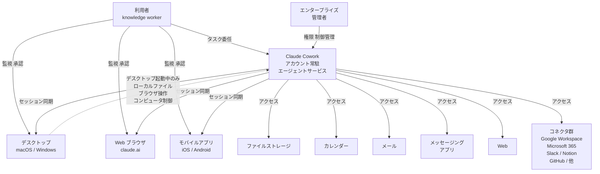
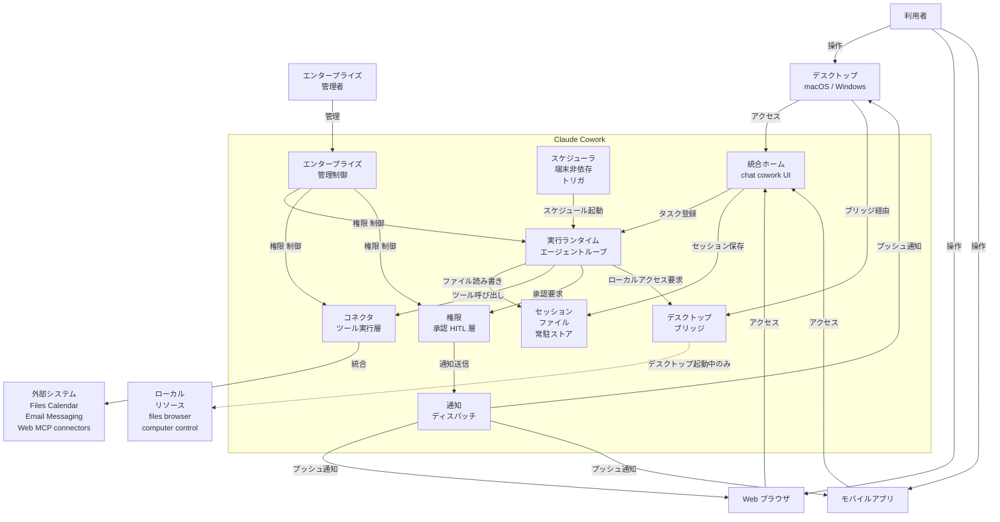
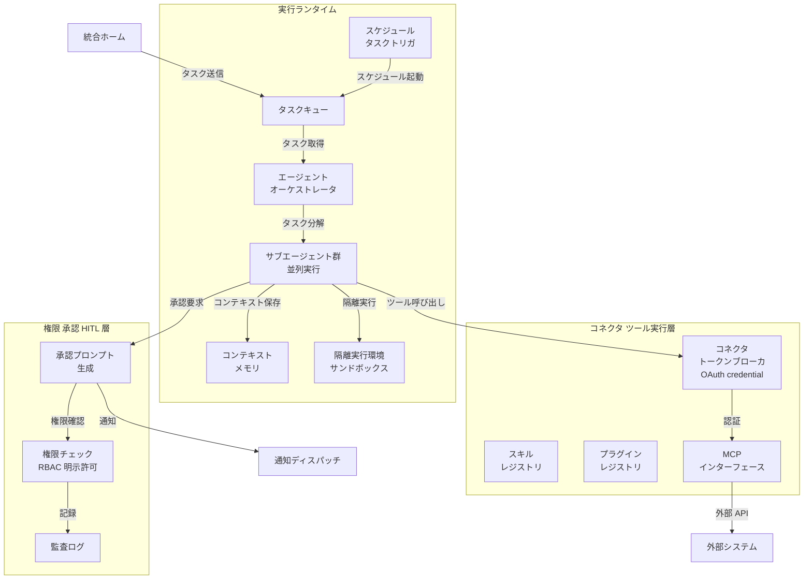
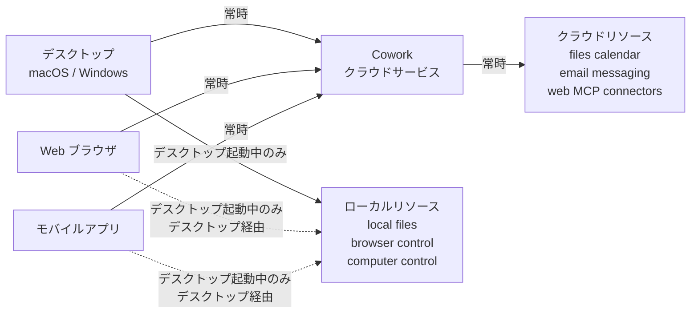
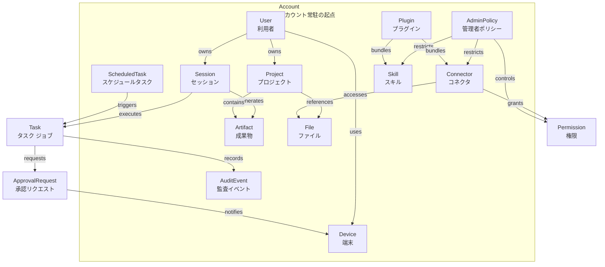
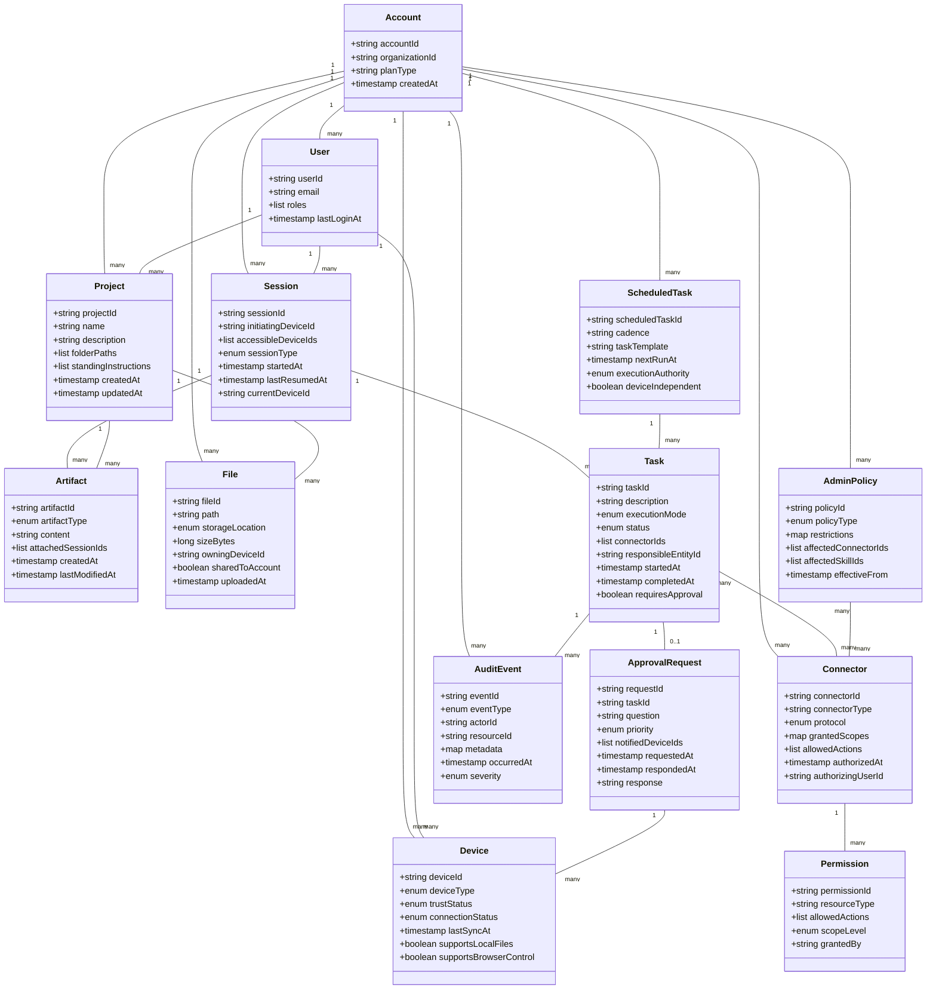
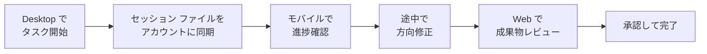
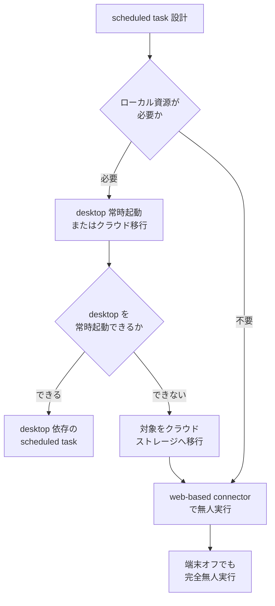

> 2026-07-09 時点の公開情報（公式ブログ / Help Center）に基づく技術調査です。

本記事は Claude Help Center「Release notes」(2026-07-07) を起点に、Anthropic が委任型エージェント **Claude Cowork** を web / mobile へ beta 拡張し、セッションとファイルを端末常駐からアカウント常駐へ寄せた変更を調査します。端末を開いている間だけ動く作業者から、アカウントに紐づいて継続的に働く作業者へ移行することで、「CLI / デスクトップ常駐だったエージェントがアカウント常駐の作業者になるとき、何を管理対象にすべきか」を構造・データ・運用設計の観点で整理します。

> **前提（重要）**: Claude Cowork はプロプライエタリな SaaS であり、内部実装の詳細は非公開です。本記事の「構造」「データ」は、公式が説明する挙動から導いた**論理アーキテクチャ / 概念モデル**です。推測要素には「（挙動から推定）」と注記し、断定しません。捏造した内部コンポーネント名・API パス・設定キーは含めません。

## ■概要

Claude Cowork は、タスクを Claude に委任すると files・calendar・email・messaging app・web・その他の接続ツールを横断して「完了するまで」働く委任型エージェント機能です。2026 年 1 月にデスクトップ専用でリリースされて以降、ユーザーは Claude にタスクを手渡し、接続したアプリケーション群を通じて目標達成まで自律的に作業させてきました。


2026 年 7 月 7 日、Anthropic は Cowork を **web と mobile（iOS / Android, claude.ai）へ beta 拡張**する変更を発表しました。この拡張の本質は、従来デスクトップに常駐していた実行環境が**アカウント常駐型のリモート実行**へ転換した点です。セッションとファイルがクラウド上で同期され、どの端末からでも再開・受け取りが可能になり、scheduled task は端末が 1 台もオンラインでなくても実行されます。ロールアウトは Max プラン先行で、数週間かけて他プランへ展開されます。

### Anthropic 製品ラインでの位置づけ

Claude は複数の利用形態を提供しており、Cowork はその 1 つです。

| 形態 | 対象 | 特徴 |
|---|---|---|
| Claude chat（web / mobile / desktop） | 一般ユーザー | 対話型アシスタント。質問と回答を繰り返す従来型の AI チャット |
| Claude Code | 開発者 | ターミナル上で動作するコーディング特化型エージェント |
| Claude Cowork | ナレッジワーカー | 非コーディングの委任型タスクを、複数ツールを横断して完了まで実行するエージェント |

Cowork は、ターミナルを開かずにエージェント的な自律性を得たいユーザー向けに設計されました。chat の対話インターフェースを保ちながら、委任型のマルチツール横断タスクを処理します。

### Cowork の系譜

| 時期 | マイルストーン | 概要 |
|---|---|---|
| 2026 年 1 月 | Cowork 初回リリース（desktop） | desktop app 専用。advanced file editing。当初は上位プラン中心 |
| 2026 年 2〜4 月 | connector 拡充・desktop control・Dispatch | Google Workspace / DocuSign 等の connector 追加、computer use（アプリ起動・ブラウザ操作）、スマホ起点でデスクトップ実行する Dispatch を順次追加 |
| 2026-07-07 | web / mobile 拡張（アカウント常駐リモート実行） | web / mobile で Cowork を利用可能に。セッション・ファイルがアカウント常駐となり、端末オフでも scheduled task が走る |

> **2026-07-07 以外の日付は二次情報に基づく概算です。** 初回リリース・connector 拡充・desktop control / Dispatch の正確な日付と件数は公式リリースノートで確認してください（二次情報間でも日付が数日ぶれます）。

### 従来（desktop 常駐）と今回（アカウント常駐リモート実行）の対比

| 比較項目 | 従来（desktop 常駐） | 今回（アカウント常駐リモート実行） |
|---|---|---|
| 実行の持続性 | ラップトップを閉じると作業停止 | 端末オフでも継続。scheduled task はデバイス 0 台でも実行 |
| クロスデバイス | desktop 専用。他デバイスからアクセス不可 | desktop・web・mobile でセッション・ファイルが同期。どこでも再開可能 |
| オフライン継続 | 不可 | 可能。scheduled task は端末なしで走る |
| 監督モデル | desktop 起動中のみタスク進行 | 判断が要る箇所で Claude が問い合わせ、質問がスマホに届く。承認するまで何も送信しない |
| サーフェス別能力 | desktop のみ | start / steer / review / resume は全サーフェス対応。local files・browser・computer control は desktop 限定（web / mobile は desktop 起動中のみ経由） |

### 類似の常駐型エージェント / 自動化との違い

| カテゴリ | 代表例 | 主な違い |
|---|---|---|
| スケジュール実行型チャット | ChatGPT scheduled tasks 等 | 定期実行・通知・レポート生成に特化。マルチツール横断の委任型ワークフローは限定的 |
| オープンソースエージェント | Auto-GPT / CrewAI 等 | 完全カスタム可能だが技術的セットアップが必要。Cowork はクラウド統合・低摩擦が強み |
| CLI エージェント | Claude Code 等 | ターミナル上でコーディング特化。Cowork は非コーディングのナレッジワーク特化 |

### 利用実態の数値が示す重要性

Anthropic は 2026 年 5 月 11 日〜 5 月 31 日に **約 120 万（1.2M）の匿名・集計セッション**を、**60 万超（600,000+）の組織**からサンプリングし、利用実態を分析しました。


- **90% 超が非コーディング**です。Cowork が選ばれる理由は、日常のナレッジワークへの適合にあります。
- 最大カテゴリは **business operations と content creation** で、合計で全体の約半分を占めます。「四半期スペンドの照合と差異メモ」「契約フォルダからリスク付き更新トラッカーへの変換」「通話トランスクリプトとパイプラインデータからのクライアントデッキ作成」が代表例です。
- Anthropic はこれを「仕事の周辺作業（the work around the work）」と表現します。誰の職務記述書にも載っていないが、全員の週の大半を占める作業です。

この数値は、リモート実行拡張が単なる利便性向上ではなく、日常的なナレッジワークの自動化が既に大規模に進行している現実を裏付けます。端末常駐からアカウント常駐への移行は、この「周辺作業の委任」をさらに広範囲・高頻度で実行可能にする基盤変更です。

## ■特徴

### クロスデバイス継続

セッションとファイルがクラウド上で同期され、デスクで開始したタスクをスマホで確認し、別の端末で成果物を受け取れます。「Your work follows you（作業があなたに追従する）」というコンセプトのもと、デバイスの境界を越えた継続的な作業が可能になりました。

### 端末オフのバックグラウンド実行

ラップトップを閉じても、Claude はタスクを継続します。scheduled task の場合、**端末が 1 台もオンラインでなくても実行される**点が重要です。公式が挙げる「月曜 6am のクライアント準備」では、email threads・transcripts・recent news を処理し、briefing doc を作成し、follow-up email を「下書きのまま未送信」で残す一連の処理が無人で走ります。

### Human-in-the-loop 承認

判断が要る箇所で Claude が問い合わせ、質問が**スマホに届く**仕組みです。作業の途中で draft を軌道修正することもできます。**承認するまで何も送信しない**（原文: "Nothing ships until you've reviewed and approved it."）という設計により、無人実行でも最終決定権はユーザーに残ります。

### Unified home（chat + Cowork の統合）

web と desktop で **chat と Cowork が単一ホーム / サイドバーに統合**されました。projects と artifacts は両者で共有され、「委任するのは質問するのと同じくらい簡単」という UX が実現されています。

### サーフェス別の能力差

全サーフェス（desktop / web / mobile）で **start・steer・review・resume** が可能です。一方、以下の機能は desktop 専用です。

- **local files**: ローカルファイルシステムへの直接アクセス
- **Browser use（ブラウザ操作）**
- **Computer use（コンピュータ制御・デスクトップアプリの起動）**

web / mobile は、デスクトップアプリを導入できない層と、監視・ステアリング・レビュー・再開の用途に最適化されています。web / mobile からでも、desktop app が起動している間は上記機能を経由利用できます。全サーフェスで利用可能な機能は **Connectors / Skills / Plugins / Scheduled tasks / Projects / File previews** です。

### エンタープライズ管理統制

Enterprise プラン（一部は Team も対象）では、管理者が capability / spend / model を制御し、connector 権限を絞り込み、監査証跡を確認できます。可用プランは機能ごとに異なります（詳細は「運用」で扱います）。

### Usage 倍増プロモーション（〜 2026-08-05）

リモート実行拡張のローンチに合わせ、Anthropic は倍増した Cowork 利用上限を **2026 年 8 月 5 日まで延長**しています。大きなタスクを試す余地を提供する施策です。

## ■構造

Cowork の内部実装は非公開のため、公式が説明する挙動から導いた**論理アーキテクチャ**として C4 モデルを 3 段階で示します。

### ●システムコンテキスト図



#### アクター

| 要素名 | 説明 |
|---|---|
| 利用者（knowledge worker） | タスクを Cowork に委任し、進捗を監視・承認する知識労働者 |
| エンタープライズ管理者 | 組織全体の権限・制御・予算・監査ポリシーを管理する管理者 |

#### システム

| 要素名 | 説明 |
|---|---|
| Claude Cowork | タスクをアカウントに常駐させ、デバイス非依存でスケジュール実行し、複数デバイス間でセッション同期を行うエージェント基盤 |

#### 利用者のデバイス群

| 要素名 | 説明 |
|---|---|
| デスクトップ（macOS / Windows） | フル機能を提供。ローカルファイル・ブラウザ操作・コンピュータ制御を desktop 起動中のみ橋渡し |
| Web ブラウザ（claude.ai） | セッション開始・監視・承認・再開を提供。デスクトップ非導入層にも対応 |
| モバイルアプリ（iOS / Android） | セッション監視・承認・再開をスマートフォンから実行。移動中の問い合わせ応答に対応 |

#### 接続先（外部システム）

| 要素名 | 説明 |
|---|---|
| ファイルストレージ | クラウドファイル（Google Drive / OneDrive 等）へのアクセス |
| カレンダー | スケジュール読み取り・予定作成 |
| メール | メールスレッド読み取り・下書き作成（送信は承認待ち） |
| メッセージングアプリ | Slack / Teams 等のメッセージ読み取り・投稿 |
| Web | ニュース・企業情報等の Web 検索・取得 |
| コネクタ群 | 外部 SaaS（Google Workspace / Microsoft 365 / Slack / Notion / GitHub / DocuSign 等）への接続。多くは Model Context Protocol（MCP）ベース。local MCP server を含む connector / plugin は desktop app 経由でのみ動作 |

### ●コンテナ図



#### 統合 UI

| 要素名 | 説明 |
|---|---|
| 統合ホーム | chat と Cowork を単一ホーム・サイドバーに統合。projects と artifacts を両者で共有 |

#### 常駐ストレージ

| 要素名 | 説明 |
|---|---|
| セッション・ファイル常駐ストア | セッション・ファイル・成果物をアカウントに常駐させ、複数デバイス間で同期（挙動から推定） |

#### 実行層

| 要素名 | 説明 |
|---|---|
| 実行ランタイム | タスクを分解し、完了まで自律的に進めるエージェントループ（挙動から推定） |
| スケジューラ | スケジュールされたタスクをデバイス非依存で起動（例: 月曜 6am のクライアント準備） |

#### 統合・制御層

| 要素名 | 説明 |
|---|---|
| コネクタ・ツール実行層 | MCP コネクタ・skills・plugins を実行し、外部システムと OAuth / API 統合（挙動から推定） |
| 権限・承認（HITL）層 | 判断が必要な箇所で問い合わせ、承認されるまで何も送信しない |
| 通知ディスパッチ | 問い合わせ・完了通知をデバイスへプッシュ（挙動から推定） |

#### デスクトップ専用ブリッジ

| 要素名 | 説明 |
|---|---|
| デスクトップブリッジ | ローカルファイル・ブラウザ操作・コンピュータ制御を desktop 起動中のみ橋渡し。web / mobile は desktop 経由でのみアクセス可能 |

#### エンタープライズ管理

| 要素名 | 説明 |
|---|---|
| エンタープライズ管理制御 | RBAC、予算・利用制限、監査ログ、connector / plugin ガバナンス、SSO 統合 |

### ●コンポーネント図

主要コンテナである**実行ランタイム**・**権限承認層**・**コネクタ層**をドリルダウンします。



#### 実行ランタイム

| 要素名 | 説明 |
|---|---|
| タスクキュー | 手動・スケジュールからのタスクをキューイング（挙動から推定） |
| エージェントオーケストレータ | タスクを分解し、サブエージェントに割り当て（挙動から推定） |
| サブエージェント群 | 複数のサブタスクを並列実行（ファイル管理・ブラウジング・ドキュメント作成等）（挙動から推定） |
| コンテキストメモリ | セッション間でタスクコンテキスト・成果物を保持し、長期実行に対応（挙動から推定） |
| スケジュールタスクトリガ | 時刻ベース・繰り返しタスクをデバイス非依存で起動 |
| 隔離実行環境（サンドボックス） | タスク実行を隔離環境で行い、ファイル変更・ネットワークアクセスを制御（挙動から推定） |

#### 権限・承認（HITL）層

| 要素名 | 説明 |
|---|---|
| 承認プロンプト生成 | 判断が必要な箇所で問い合わせメッセージを生成 |
| 権限チェック | RBAC・明示的なファイル / フォルダ選択で権限を確認（削除等は確認を伴う） |
| 監査ログ | ツール・connector 呼び出し、ファイルアクセス、承認アクションを記録（挙動から推定） |

#### コネクタ・ツール実行層

| 要素名 | 説明 |
|---|---|
| コネクタトークンブローカ | 外部システムへの OAuth 認証・トークン管理（挙動から推定） |
| スキルレジストリ | 再利用可能なワークフローレシピ・カスタム指示を管理 |
| プラグインレジストリ | スキル・connector・ワークフローをバンドルした共有可能なユニット |
| MCP インターフェース | Model Context Protocol 経由で外部システムと安全にデータ連携 |

### ●サーフェス別能力の到達経路



| サーフェス | クラウドリソースへの到達 | ローカルリソースへの到達 |
|---|---|---|
| デスクトップ（macOS / Windows） | 常時可能 | desktop 起動中のみ直接アクセス可能 |
| Web ブラウザ（claude.ai） | 常時可能 | desktop 起動中のみ、ブリッジ経由でアクセス可能 |
| モバイルアプリ（iOS / Android） | 常時可能 | desktop 起動中のみ、ブリッジ経由でアクセス可能 |

デスクトップアプリが閉じている場合、web / mobile からローカルファイル・ブラウザ操作・コンピュータ制御は利用できません。ローカルリソースを必要とする scheduled task は、desktop の起動を前提とします。

## ■データ

内部スキーマは非公開のため、公式が説明する挙動から抽出した**概念モデル**として記述します。属性のうち公式未明示のものには「（推定）」を付します。

### ●概念モデル



| エンティティ名 | 説明 |
|---|---|
| Account | アカウント常駐型実行の起点となる論理境界。User / Device / Session / Project / File / Connector / Policy 等を束ねる |
| User | アカウントの利用者。複数 Device を所有し Session を開始する |
| Device | desktop / web / mobile の端末。信頼状態と接続状態を持つ。desktop のみローカルリソースへ直接アクセス可能 |
| Session | クロスデバイスで継続するセッション。端末をまたいで再開・受け取りが可能。chat と cowork で共有 |
| Project | Artifact と File を束ね、chat と cowork の両方で参照されるプロジェクト |
| Artifact | 成果物（ダッシュボード・トラッカー・ドキュメント等）。chat と cowork で共有 |
| File | ファイル。アカウント常駐（クラウド）と desktop ローカルの 2 種類の保存先を持つ |
| Task | 実行単位。Session または ScheduledTask から起動され、Connector を経由してツールにアクセスする |
| ScheduledTask | スケジュールされたタスク。端末がオフラインでもサーバー上で実行される |
| Connector | 外部ツールへの接続（多くは MCP ベース。local MCP server を含むものは desktop 経由）。付与権限スコープを持つ |
| Skill | 再利用可能な手順・ワークフロー |
| Plugin | スキル・connector・ワークフローをバンドルした拡張ユニット。1 つの Plugin が複数の Skill / Connector を包含し、共有・配布の単位となる |
| ApprovalRequest | HITL のポイント。判断が必要な箇所（例: メール送信・ファイル削除・外部公開前レビュー・高額支出の承認）で Claude が問い合わせ、Device に通知される |
| Permission | Connector が付与するアクセススコープ。read / write / execute 等の粒度 |
| AdminPolicy | 管理者ポリシー。Enterprise 中心（一部は Team も対象）で capability / spend / model を統制し、Connector と Skill を制限 |
| AuditEvent | 監査イベント。Task 実行・Connector アクセス・承認の記録を証跡として保存 |

### ●情報モデル

> 以下の classDiagram の属性名は、挙動から起こした**説明用の仮称**です（公式スキーマ・設定キーではありません）。実在するフィールド名を表すものではなく、管理対象を整理するためのモデルです。



#### 主要属性（抜粋）

| エンティティ | 属性 | 説明 |
|---|---|---|
| Device | deviceType / trustStatus / connectionStatus / supportsLocalFiles | 端末種別・信頼状態・接続状態・ローカルアクセス可否（多くは推定） |
| Session | initiatingDeviceId / accessibleDeviceIds / currentDeviceId | クロスデバイス継続を支える端末参照（推定） |
| File | storageLocation / owningDeviceId / sharedToAccount | 保存先（account_cloud / device_local）と所有端末。運用設計の要 |
| Task | executionMode / responsibleEntityId / requiresApproval | 実行モード・責任主体・承認要否（推定を含む） |
| ScheduledTask | deviceIndependent / executionAuthority | 端末非依存フラグ（公式挙動から true）と実行権限主体 |
| Connector | protocol / grantedScopes / allowedActions | MCP / OAuth と付与スコープ。無人実行の攻撃面管理の中核（推定を含む） |
| ApprovalRequest | notifiedDeviceIds | 通知先端末（公式より mobile を含む） |
| AuditEvent | eventType / occurredAt / severity | 証跡の粒度（task_execution / connector_access / approval_granted 等、推定を含む） |

### ●運用設計上の重要属性

Pick の観点（実行基盤 / 運用設計）から、特に管理対象として重視すべき属性を整理します。

| エンティティ | 重要属性 | 運用上の意義 |
|---|---|---|
| File | storageLocation | ローカルとアカウント / クラウドの保存先を区別。常駐化でクラウド保存が増える |
| Connector | grantedScopes | 付与権限スコープを明示。無人・監督外実行で攻撃面が増えるため粒度管理が必須 |
| ScheduledTask | deviceIndependent / executionAuthority | 端末非依存実行の責任主体を明確化し、無人実行の責任境界を定義 |
| Task | responsibleEntityId / requiresApproval | 責任主体と承認要否。HITL ポイントの設計基盤 |
| ApprovalRequest | notifiedDeviceIds | 承認リクエストの通知先。クロスデバイス通知の基盤 |
| Device | trustStatus / supportsLocalFiles | 端末信頼と device 承認経路。desktop のみローカル直接アクセス可能 |
| AdminPolicy | affectedConnectorIds / affectedSkillIds | Enterprise admin による capability / spend / model 統制の対象 |
| AuditEvent | eventType / occurredAt | 証跡・監査の粒度 |

## ■構築方法

Cowork は SaaS / アプリ製品で、CLI や IaC は提供されません。構築は「有効化・接続・UI 操作」を中心に行います。

### 前提条件

| 要件 | 詳細 |
|---|---|
| 対象プラン | Max プラン先行で beta 展開。数週間かけて他の有料プランへ順次拡大（2026-07-07 時点） |
| ロールアウト段階 | beta。全ユーザーには未展開で、段階的に提供 |
| usage promotion | 2026-08-05 まで Cowork 利用上限が倍増（プロモ延長済み） |

### 対応サーフェスと入手先

| サーフェス | 入手先 |
|---|---|
| Web | claude.ai（home 画面から Cowork セッション開始） |
| iOS | Claude app（App Store）。サイドバーから Cowork |
| Android | Claude app（Google Play）。サイドバーから Cowork |
| Desktop | claude.com/download（フル体験。local files / browser / computer control 対応） |

> Desktop app の詳細な OS 要件（対応バージョン・仮想化要件等）は、導入前に公式ダウンロードページと Help Center で確認してください。本記事では推測値を記載しません。

### 有効化・入手手順

#### Web（claude.ai）

1. claude.ai にログインします。
2. home 画面から Cowork セッションを開始します（chat と Cowork は単一ホームに統合され、同じサイドバーから選べます）。
3. connectors や projects を接続して利用を開始します。

#### Mobile（iOS / Android）

1. App Store または Google Play から Claude app をインストールします。
2. アプリを起動してログインします。
3. サイドバーから Cowork を選択し、セッションを開始します。

#### Desktop app

1. claude.com/download から OS に応じたインストーラを取得します。
2. インストール後、Claude アカウントでサインインします。
3. local files / browser / computer control を含むフル体験が利用できます。

### サーフェス別機能マトリクス

2026-07-07 時点の公式情報（support.claude.com の Cowork サーフェス記事）に基づきます。

| 機能 | Desktop | Web | Mobile |
|---|---|---|---|
| start / steer / review / resume | 対応 | 対応 | 対応（beta） |
| Connectors | 対応 | 対応 | 対応 |
| Skills | 対応 | 対応 | 対応 |
| Plugins | 対応 | 対応 | 対応 |
| Scheduled tasks | 対応 | 対応 | 対応 |
| Projects | 対応 | 対応 | 対応 |
| File previews | 対応 | 対応 | 対応 |
| Local files | 対応 | desktop 起動時のみ | desktop 起動時のみ |
| Browser use（ブラウザ操作） | 対応 | desktop 起動時のみ | desktop 起動時のみ |
| Computer use（コンピュータ制御） | 対応 | desktop 起動時のみ | desktop 起動時のみ |

- **desktop 起動時のみ**: web / mobile でも利用できますが、desktop app が同時に起動している必要があります。
- **scheduled task の注意**: 作成・監視・レビューは全サーフェスで可能ですが、local files・Browser use・Computer use を必要とするタスクの**実行**は desktop の起動が前提です。端末オフでの完全無人実行は、desktop に依存しない connectors / skills / plugins と、アカウント常駐ファイルだけで完結するタスクに限られます（例: Google Drive / Gmail などの web-based connector）。
- **Live artifacts の注意**: 公式サーフェス表では Live artifacts は desktop 限定として扱われます。
- **local connectors / local MCP server を含む plugin の注意**: これらは desktop app 経由でのみ動作します。全サーフェスで使える（クラウド側の）connectors / plugins とは区別されます。

### Connectors / Skills / Plugins の接続

Cowork は connectors（外部サービス接続）を接続して機能を拡張します。多くは Model Context Protocol（MCP）ベースです。接続の一般的な流れは以下です（実際の UI は claude.ai / desktop app の設定画面で提供されます）。

1. Cowork の設定 / Integrations セクションにアクセスします。
2. 接続したい connector を選択します（例: Google Drive）。
3. OAuth 2.0 認証フローを実施し、権限スコープ（read / write、フォルダ単位等）を確認・承認します。
4. 接続を確認し、有効化します。

connector の権限は最小権限で設定し、必要に応じて後から拡張します。次の擬似設定は、権限スコープの考え方を示す**実装案 / 例**です（実際の設定は GUI で行います）。

```yaml
# 実装案 / 例: connector 権限スコープの考え方（実際の設定は GUI）
connectors:
  - name: google-drive
    auth:
      method: oauth2
      scopes:
        - drive.readonly        # 全書き込みではなく必要最小限
        - drive.file            # アプリが作成したファイルのみ
    enabled: true
```

## ■利用方法

### 操作別の前提

| 操作 | 必須 | 推奨 |
|---|---|---|
| タスク委任 | タスクの「done の定義」を明確化 | フォルダ / スレッド / ファイルを明示的に指定 |
| Scheduled task 作成 | 実行日時・タスク内容・出力先 | recurring 設定・承認フローの明示 |
| クロスデバイス再開 | Claude アカウントでログイン済み | Projects / artifacts に紐づけて保存 |
| Connector 利用 | connector の接続・認証完了 | 権限スコープの最小化 |

### タスク委任の基本

Cowork の核心は「タスクを Claude に委任し、完了まで Claude が実行する」ことです。

1. 対象を明示します（例: 「この Drive フォルダ内の契約書」「Slack の #sales スレッド」）。
2. 「done の定義」を伝えます（例: 「契約更新日をリスト化し、リスクフラグ付きトラッカーを作成」）。
3. Claude が files / calendar / email / messaging / web を横断して作業します。判断が必要な箇所では問い合わせが入ります。
4. 完成物をレビューします。

```text
# タスク委任の記述例（実際は対話で指示）
marketing/Q2-campaign フォルダの通話トランスクリプトと
パイプラインデータ（pipeline.xlsx）を元に、
明日のクライアント向けプレゼンデッキを作成して。
スライドは 10 枚以内、主要メトリクスとネクストステップを含めて。
```

### Scheduled task の作成と実行

scheduled task は「端末が 1 台もオンラインでなくても実行される」点が特徴です。

1. Cowork で新規 scheduled task を作成します。
2. 実行タイミングを指定します（例: 毎週月曜 6:00）。
3. タスク内容を記述します（例: email threads / transcripts / recent news を処理し briefing doc を作成、follow-up email を下書きのまま残す）。
4. 出力先と承認フローを設定します（例: 完了時にモバイル通知、送信は承認まで保留）。
5. 保存・有効化します。

次は scheduled task 設定の考え方を示す**実装案 / 例**です（実際の設定は GUI）。

```json
{
  "name": "Monday Client Prep",
  "schedule": { "cadence": "weekly", "day": "monday", "time": "06:00", "timezone": "America/New_York" },
  "task": "Process email threads, transcripts, and recent news. Create a briefing doc and draft (do not send) a follow-up email.",
  "outputs": [
    { "type": "document", "destination": "google-drive:/Briefs" },
    { "type": "email_draft", "destination": "gmail" }
  ],
  "approval": { "auto_ship": false, "notify": "mobile_push" },
  "enabled": true
}
```

端末オフラインでも走るのは、scheduled task が**クラウドで実行**され、web-based connector（Google Drive / Gmail 等）を用いる場合です。desktop の local files / browser を必要とするタスクは、desktop の起動が前提になります。

### クロスデバイスでの継続・再開・レビュー・承認



1. desktop でタスクを開始します。
2. セッションとファイルがアカウントに同期されます（Projects / artifacts として保存）。
3. 移動中にモバイルで進捗を確認します。
4. Claude が判断を求めると、質問がスマホに届きます。回答すると、正しい方向で継続します。
5. web で成果物をレビューします。
6. 承認して完了します。承認するまで email 送信やファイル公開は実行されません。

### Unified home での Projects / Artifacts 共有

web と desktop で chat と Cowork が単一ホームに統合され、projects と artifacts を両者で共有します。

| 項目 | 説明 |
|---|---|
| 単一インターフェース | chat（質問応答）と Cowork（タスク委任）を同じサイドバーから切り替え |
| Projects 共有 | プロジェクトに紐づけたタスク・対話・ファイルをまとめて管理 |
| Artifacts 共有 | 生成したドキュメント / データを一元保存し、検索・再利用 |

## ■運用

### タスクの起動・監視・中断・再開・承認

Cowork のタスクはアカウントに紐付いてクラウド上で実行され、desktop / web / mobile のすべてで次の操作ができます。

- **起動**: desktop / web は home、mobile はサイドバーから Cowork セッションを開始します。
- **監視**: どの端末からでも進行中タスクを確認します。判断が要る場合はスマホに通知が届きます。
- **再開**: ラップトップで始めたタスクを、外出先でスマホやブラウザから引き継ぎます。
- **引き継ぎ**: 進行中のタスクを別の端末から引き継いで続行します。
- **承認**: 下書きを作成した時点で自動送信せず、明示的な承認を待ちます（「承認するまで送信しない」原則）。承認はスマホでも web でも実施できます。

会議中にスマホから draft を確認し、方向修正の指示を送ると、Claude はその場で軌道を変えて続行します。

### scheduled task の運用

- **cadence 指定**: 1 回・daily・weekly・weekdays 等の頻度を設定します。
- **クラウド実行**: 2026-07-07 の拡張により、端末が 1 台もオンラインでなくても実行されます。
- **失敗時の扱い**: connector の認証期限切れ、desktop app の終了（local file 依存タスク）、ネットワーク障害、connector 権限変更が主な失敗要因です。自動リトライの有無・回数や失敗通知のタイミングは公式未明示のため（合理的には認証エラーは即時失敗、一時的なネットワーク障害は短時間リトライ後にタイムアウトと推測されますが確定情報ではありません）、失敗が続く場合はログと connector 権限を確認します。
- **成果物のレビュー導線**: 完了時に通知が届きます。承認が必要な成果物はレビュー後に初めて送信されます。

### enterprise admin による運用統制

管理者は次を統制できます。**可用プランは機能ごとに異なります**（各 Help 記事によれば 2026-07 時点で、RBAC / groups・spend limits / model access / audit logs / Compliance API は Enterprise、OpenTelemetry は Team および Enterprise が対象）。確認できない粒度は「公式未明示」として扱ってください。

| 統制 | 内容 |
|---|---|
| RBAC | ユーザーをグループに編成し、Cowork / Claude Code / connectors 等の利用可否をロールで制御 |
| spend 管理 | organization / group / user レベルで利用上限を設定し、閾値でアラート。usage を group / user / model 別に可視化 |
| model entitlement | chat / Cowork / Claude Code ごとのデフォルトモデル設定、ロール別の利用可能モデル・effort 上限 |
| connector 制御 | 各 connector に read のみ許可・write 無効化などアクションレベルの制限（公式明示）。scheduled task の作成をロールで制限する運用は公式未明示の推奨策 |
| 監査 | 監査ログのエクスポート、OpenTelemetry での活動監視、Compliance API 連携 |

> 監査ログは **過去 180 日分**を export 可能です（公式 Help 記事に明示、2026-07 時点）。一方、spend アラートの具体的な閾値（%）や OpenTelemetry の設定手順などバージョンで変わる値は、対応する Help Center 記事で最新値を確認してください。

### usage 上限の扱い

倍増した Cowork 利用上限のプロモーションが **2026-08-05 まで延長**されています。web / mobile 拡張に伴い、より大規模なタスクを試せる期間限定措置です。

## ■ベストプラクティス

運用設計（Pick の中核角度）の観点で、端末上の道具からアカウント常駐の作業者へ移るときに再設計すべき管理対象を整理します。

### ファイル保存先の再設計

- desktop の local files には、desktop app が開いている間のみアクセスできます。web / mobile からは desktop 起動中に限り経由アクセスできます。
- 無人実行やクロスデバイスで継続的に扱うファイルは、connector 対応のクラウドストレージ（Google Drive / OneDrive 等）に置くことを推奨します。
- 機密（PHI / PCI / 高機微 PII 等）を扱うワークロードは、監査・compliance のカバレッジを確認し、対応が不十分な場合は Cowork の対象から除外します。

### connector / token 権限の最小化・scoping

無人実行では、ユーザーが直接監視しない状態で connector が動作します。

- **最小権限**: connector には必要最小限のリソースのみを許可します（Drive 全体でなく特定フォルダ、全メールでなく特定ラベル）。
- **同意ゲート**: OAuth / OIDC / SSO を用い、ユーザー同意を必須にします。machine-to-machine の client-credentials は原則避けます。
- **トークンの安全な扱い**: token を平文で config に置かず、admin portal / secrets manager で管理し、定期ローテーションします。

### email / calendar / messaging の persistent permission 棚卸し

- 接続済み connector と付与スコープを定期的に確認し、不要なものは削除、過剰なものは再認証で絞り込みます。
- 新規 connector / plugin 導入時は、提供元・許可ドメイン・権限を review します（supply chain 対策）。
- scheduled task には、安全性を確認した connector のみを許可します。

### 端末信頼と device 承認

- 高セキュリティ運用では、新デバイスからのアクセス・制御前に device verification（enrollment / 2FA / admin 承認等）を求める運用が推奨されます（Anthropic-hosted Cowork 固有機能としては公式未明示。3rd-party デプロイ文脈では言及あり）。
- Cowork は外部ツール操作・ファイルアクセス・scheduled task 実行が可能なため、新デバイスの trust 確認は重要です。
- 高セキュリティ環境では、managed device（MDM 登録済み）からのみアクセスを許可する運用が有効です（MDM 限定は 3rd-party Cowork デプロイ文脈での言及）。

### 無人スケジュール実行の責任境界・承認ゲート

- scheduled task が生成した成果物は、承認を経るまで自動送信しない原則を運用ポリシーに明記します（「承認するまで送信しない」のルール化）。
- 完了通知が届いたら成果物を確認し、必要に応じて修正・承認します。
- scheduled task の設定と承認はユーザー（または担当者）が担い、Claude は「作業者」と位置づけ、最終的な送信・公開判断は人間が保持します。

### 監査証跡と attack surface への対策

- **証跡**: 誰が / いつ / どの connector で / 何を実行したかを、OpenTelemetry や監査ログ / Compliance API で記録・監視します（利用可否はプランと最新仕様を確認）。
- **credential 露出**: token / API キーを secrets manager で管理し、平文保存を避けます。
- **unauthorized task injection**: scheduled task の作成・変更に承認ワークフローを設けるか、admin のみ設定可能にロール制限します。
- **prompt injection**: 外部データ（メール本文・ファイル名・API レスポンス）を扱う際は、connector の scope を厳格化し、出力を検証します。

### desktop 依存の切り分け

- 大量ファイル編集・browser 操作・ローカル連携は desktop で実行します。
- 監視・ステアリング・レビュー・再開は web / mobile で行います。
- local files を使う scheduled task は、desktop を常時起動するか、対象をクラウドストレージへ移行します。

次の判断フローで、scheduled task を「完全無人（クラウド実行）」にできるか、「desktop 依存」になるかを切り分けます。



### 機密ワークロードの受け入れ判定チェックリスト

機密（PHI / PCI / 高機微 PII 等）を扱う前に、次を確認します（各項目の対応可否は公式ドキュメント / セールス窓口で最新値を取得してください）。

- コンプライアンス認証の対応状況（SOC 2 等）
- 規制対応契約の締結可否（例: HIPAA BAA など、プランにより異なる）
- データレジデンシー / リージョン制御の有無
- 監査ログの保持期間と Compliance API のカバレッジ
- connector 経由でアクセスするデータ範囲の最小化可否

対応が不十分な場合は、Cowork の対象から当該ワークロードを除外します。

## ■トラブルシューティング

| 症状 | 原因 | 対処 |
|---|---|---|
| scheduled task が実行されない | connector の認証期限切れ / desktop app 終了（local file 依存）/ ネットワーク障害 / connector 権限変更 | connector を再認証、local file 依存タスクは desktop 常時起動またはクラウド移行、ログでエラー確認、scope と権限を再設定 |
| web / mobile で local file にアクセスできない | desktop app が閉じている | desktop app を起動し該当フォルダを選択してから web / mobile でアクセス |
| 承認通知が届かない | 通知設定が無効 / 新デバイスが未登録 | OS・アプリの通知設定を確認、新デバイスは登録・信頼設定を確認（組織で device 検証を運用している場合） |
| device が offline 表示 | session の停滞 / ネットワーク・firewall 遮断 | app を再起動、ネットワーク安定性を確認、firewall / VPN が Claude / MCP 接続を遮断していないか確認 |
| connector / folder が動作しない | フォルダ未選択 / 認証期限切れ | 設定でフォルダを再選択、connector を再認証 |
| beta が提供されないプラン | Max 先行ロールアウト中（数週間かけて拡大） | 対象プランへアップグレード、またはロールアウト完了を待機 |

### 一般的な対処手順

1. アプリを最新版に更新します。
2. connector / フォルダの設定変更後は desktop app を再起動します。
3. scheduled task はログでエラー詳細を確認します。
4. 解決しない場合は support.claude.com の Help Center で既知の問題を検索します。

## ■まとめ

Claude Cowork の 2026-07-07 拡張は、委任型エージェントを「端末上の道具」から「アカウント常駐の作業者」へ移す転換点です。セッション・ファイルのアカウント常駐、端末オフでのスケジュール実行、スマホに届く承認は利便性を高める一方で、ファイルの保存先・connector 権限・無人実行の責任境界・監査証跡という管理対象の再設計を迫ります。導入時は、サーフェス別の能力差（ローカル資源は desktop 依存）と、最小権限・承認ゲート・監査を組み合わせた運用設計をセットで固めることが要点です。

この記事が少しでも参考になった、あるいは改善点などがあれば、ぜひリアクションやコメント、SNSでのシェアをいただけると励みになります！

## ■参考リンク

### 概要 / 特徴

- [Cowork is rolling out to mobile and web（公式ローンチブログ）](https://claude.com/blog/cowork-web-mobile/)
- [Claude Cowork（製品ページ）](https://claude.com/product/cowork)
- [How people are using Claude Cowork（利用実態分析）](https://claude.com/blog/how-people-are-using-claude-cowork)

### 構造 / データ

- [Use Claude Cowork on web, desktop, and mobile（Help Center・サーフェス別対応）](https://support.claude.com/en/articles/15520349-use-claude-cowork-on-web-desktop-and-mobile)
- [Release notes（Claude Help Center）](https://support.claude.com/en/articles/12138966-release-notes)

### 構築方法 / 利用方法

- [Claude desktop app のダウンロード](https://claude.com/download)
- [Schedule recurring tasks in Claude Cowork（Help Center）](https://support.claude.com/en/articles/13854387-schedule-recurring-tasks-in-claude-cowork)

### 運用 / ベストプラクティス

- [Manage model access for your organization（Help Center）](https://support.claude.com/en/articles/15694740-manage-model-access-for-your-organization)
- [Manage groups and group spend limits on Enterprise plans（Help Center）](https://support.claude.com/en/articles/13799932-manage-groups-and-group-spend-limits-on-enterprise-plans)
- [Manage custom roles on Enterprise plans（Help Center）](https://support.claude.com/en/articles/13930452-manage-custom-roles-on-enterprise-plans)
- [Monitor Claude Cowork activity with OpenTelemetry（Help Center）](https://support.claude.com/en/articles/14477985-monitor-claude-cowork-activity-with-opentelemetry)
- [Access audit logs（Help Center）](https://support.claude.com/en/articles/9970975-access-audit-logs)
- [Access the Compliance API（Help Center）](https://support.claude.com/en/articles/13015708-access-the-compliance-api)
- [June–August 2026 usage promotion（Help Center）](https://support.claude.com/en/articles/15400594-claude-cowork-june-2026-usage-promotion)

### 参考（二次情報）

- [Anthropic expanding Claude Cowork to mobile and web（9to5mac）](https://9to5mac.com/2026/07/07/anthropic-expanding-claude-cowork-to-mobile-and-web-details-here/)
- [Claude Cowork Expands to Web and Mobile（cyberpress）](https://cyberpress.org/claude-cowork-expands-web-mobile/)
- [Anthropic Opens Claude Cowork Beta to Mobile and Web（WinBuzzer）](https://winbuzzer.com/2026/07/08/anthropic-opens-claude-cowork-beta-to-mobile-and-web-xcxwbn/)
