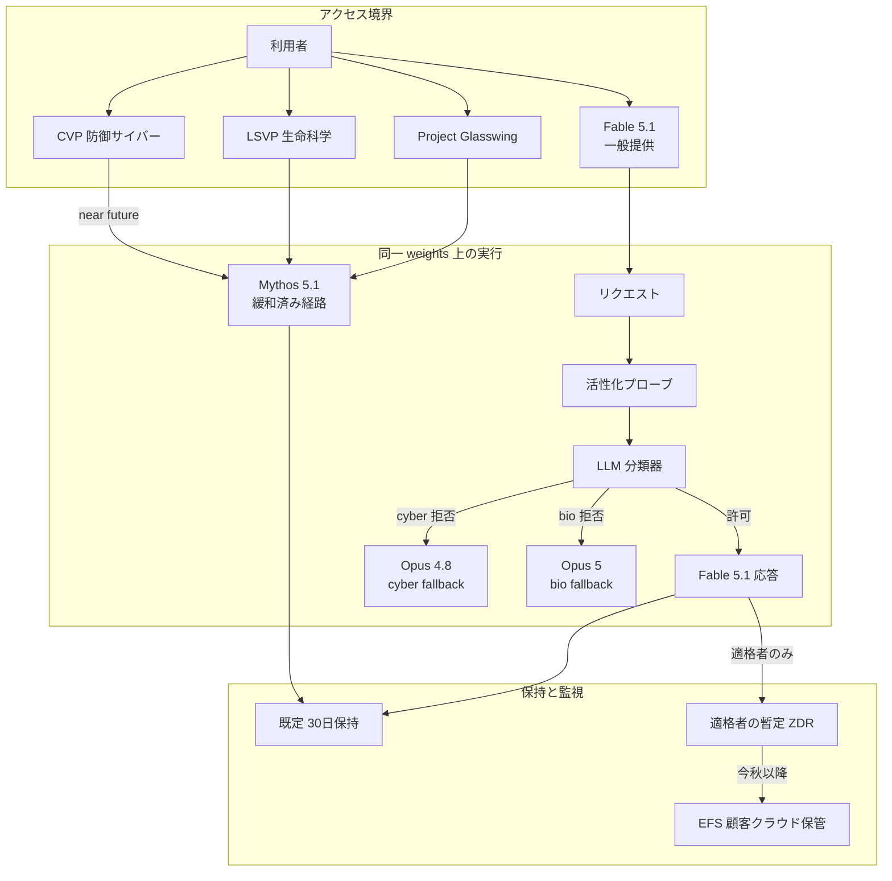

Claude Fable 5.1 と Claude Mythos 5.1 は、2026-09-01 に Anthropic が出した Mythos 級モデルの二つの構成です。発表文は「same model, but with different levels of safeguards」と書き、系統カードは「sharing identical model weights」と書きます。

差は世代番号ではありません。分類器、フォールバック先、データ保持、アクセス審査が束になった利用契約です。精度と input/output 単価だけの選定表では足りません。許可される作業、誤検知、30 日保持、EFS と暫定 ZDR の適格、審査リードタイムを一つの契約として読む必要があります。

この記事では、公式発表、系統カード、Platform ドキュメント、Help Center、AWS ブログを突き合わせて、次の 4 点を整理します。

- 同一 weights が保証することと、ユーザー体験が保証しないこと
- Fable 5.1 / Mythos 5.1 / Opus 5 を、許可作業と保持と単価でどう切り分けるか
- cache read 値下げと 25% / 45% 見積もりの前提
- API で拒否を HTTP 200 のまま落とさない実装

対象読者は、社内の既定モデルを決める立場の方と、Claude API 上で長時間エージェントを組む方です。


*この記事の全体像。以下、順に解説します。*

## 2026-09-01に何が公開されたのか

一般提供は Fable 5.1 です。モデル ID は `claude-fable-5-1` です。Claude API、AWS、Google Cloud、Microsoft Foundry で使えます。

Mythos 5.1 は審査付きの信頼アクセスです。モデル ID は `claude-mythos-5-1` です。Platform ドキュメントが明示している参加者は Project Glasswing です。発表は、防御サイバー向けの Cyber Verification Program (CVP) と、生命科学向けの Life Sciences Verification Program (LSVP) を挙げます。CVP への Mythos 級アクセスは near future です。現状の地理は米組織中心です。

コンテキストは 1M、最大出力は 128k、adaptive thinking は常時です。API の既定 effort は `high` です。Claude Code も High です。Claude Cowork と Claude.ai は Medium です。公開は 2026-09-01、retirement は 2027-09-01 より前ではありません。

EU AI Act 対応として、統計的なテキスト watermark が入ります。読者には見えません。隠し文字は足しません。検出 API は private preview です。

## 同一weightsが保証することとしないこと

weights が同一であることは、ベンダー一次声明として強いです。独立した重みハッシュ比較は公開されていません。

ユーザー体験は同一ではありません。Fable 経路では、分類器が拒否した作業の実能力は Fable ではなく Opus になります。サイバー拒否は多くの UI で Opus 4.8 へ、生物学拒否は Opus 5 へ落ちます。系統カードは、Fable 5.1 のサイバー性能を Opus 4.8 とほぼ同一と結論します。

API 契約も完全同一ではありません。Fable 5.1 は thinking block の prefix 改変を検査します。docs は「Claude Mythos 5.1 doesn't run this check」と書きます。蒸留耐性のための差です。

能力評価は safeguards なしの Mythos、一般体験は Fable、という使い分けが系統カード 1.4 にあります。「同一モデルだから同一能力」と読むと、Terminal-Bench 4.0 の 55.8% (Fable) と 60.9% (Mythos) の差を説明できません。発表は、このギャップを旧サイバー分類器の介入だと説明します。

## 触るのはモデルではなく実行経路である

利用者が触るのは「一つのモデル」ではありません。アクセス境界、分類器、フォールバック、保持が束になった実行経路です。



図の読み方は次の 3 点です。

- Fable 経路で分類器が拒否した作業は、Fable ではなく Opus が答えます。
- Mythos 経路は同じ weights に対し、cyber または bio の一部制限を緩めます。
- 既定は 30 日保持です。暫定 ZDR と EFS は適格者の移行路であり、全ユーザーの置換チェーンではありません。

## 選定基準を能力と単価から広げる

公式は「ほとんどのワークロードは Opus 5 から始める」と書きます。Fable 5.1 を既定にする判断は、保持と誤検知が未検証なら重いです。

| 基準 | Fable 5.1 | Mythos 5.1 | Opus 5 |
|---|---|---|---|
| 基盤 | Mythos 級。系統カードは identical weights | 同左 | 一段下の一般モデル |
| 提供 | 全顧客。ID `claude-fable-5-1` | 審査。ID `claude-mythos-5-1`。docs は Glasswing のみ | 一般提供 |
| 許可作業 | 長時間コーディング、知識作業。ポリシー上はソース脆弱性発見可。exploit、pentest、バイナリ検査、生命科学 R&D は不可 | 上記に加え、プログラム範囲で cyber または bio を緩和 | Fable より制限は狭いが Mythos 級 uplift はない |
| 拒否時の実能力 | cyber は Opus 4.8、bio は Opus 5 | 評価時は safeguards off | 自モデル |
| 保持 | Covered Model。既定 30 日 | 同左 | 既存契約の ZDR が使える |
| 誤検知 | 5 比で改善と自称。現場再現は公開翌日時点で未確認 | 分類器が緩い分、Fable の FP 問題は小さい | Fable より発火しにくいと系統カード |
| 単価 input/output | $10 / $50 | 同左 | $5 / $25 |
| cache read | $0.25 (0.025×) | 同左 | 他モデルは通常 0.1× |
| レート制限 | Fable 5 と合算。Start は 1,000 RPM / 500k ITPM / 100k OTPM | Mythos 5 と別合算バケツ | Fable より高い ITPM |

**Fable 5.1 が合う場合**

- 長時間エージェント、大規模リファクタ、文書や表やスライドまでの知識作業
- キャッシュが効くセッション (長コンテキストの再読)
- 30 日保持、または EFS 適格を契約で飲める
- 防御目的でも、exploit 開発やバイナリ解析が主作業ではない

**Mythos 5.1 が要る場合**

- 防御サイバーで Fable の許可集合を超える
- 生命科学の dual-use に近い R&D (分子設計など)
- 審査と、米組織中心の地理制約を許容できる

**Opus 5 が合う場合**

- 公式が言う「ほとんどのワークロード」
- ZDR を維持したい
- Fable の誤検知とフォールバック sticky を避けたい
- タスク単価を抑えたい

発表ベンチのうち、行名が取れた一次数値だけを置きます。

| 指標 | Fable 5.1 | Fable 5 | Opus 5 |
|---|---|---|---|
| Terminal-Bench-Science 0.1 | 52.6% | 24.7% | 29.0% |
| Terminal-Bench 4.0 | 55.8% (Mythos 5.1 は 60.9%) | 42.0% | 52.3% |
| CursorBench 3.2.0 | 73.4% | 70.5% | 70.0% |

Terminal-Bench-Science の標準誤差は ±3.5–4.5 pts です。公開 leaderboard と Anthropic セットアップはノイズ内でずれる、と発表脚注 1 が書きます。科学デモ (高親和性 binder、GPU カーネル) は Mythos 経路です。顧客引用 (Jane Street、Cognition など) はベンダー掲載の推薦であり、独立評価ではありません。

## 分類器は二段で、許可集合より安全マージンが広い

サイバーは活性化プローブのあと LLM 分類器です。拒否時は多くの UI で Opus 4.8 へ自動切替します。アプリ面は自動切替が既定です。API は設定が必要です。未設定だと HTTP 200 と空応答になります。

Fable 5.1 はポリシー上、ソースコード上の脆弱性発見を一般提供で許可します。コンパイル済みバイナリの発見、exploit 生成、ペネトレーションテストは引き続きブロックです。本番分類器は安全マージンが広く、防御作業でも高頻度フォールバックがありえます。

生物学は 2026-08 更新で、biology-related fallbacks が約 85% 減ったと Anthropic は述べます。発表文は初等、医療の良性発火を対象にします。研究、創薬は制限が続きます。同発表の総フォールバック見込み減 (bio 以外を含む) は、Claude.ai 約 67%、Cowork 約 55%、Claude Code 約 17%、Claude Platform 約 7% です。実測内訳ではありません。

5.1 発表は、サイバーで「60% fewer false positives」、Claude Code でセッションあたり約 60% 少ない介入、と書きます。いずれも Anthropic 内部の相対値です。公開翌日に現場再現はありません。

2026-06-12 の輸出規制で、公開 3 日後に Fable/Mythos は全停止しました。きっかけは Amazon の Fable 5 迂回報告です。再展開分類器は当該手法を over 99% で遮断し、同時に日常コーディングの誤検知を増やしました。Anthropic は、当該手法が unique な Mythos 級 cyber 能力を露出していない (他モデルでも同脆弱性を特定できた) と事後説明します。国家介入は事実です。それを「Mythos 能力の封じ失敗」と読むのは、ベンダー説明と食い違います。

GitHub `anthropics/claude-code#84256` は 2026-09-02 時点で open です。通常の sysadmin 作業で発火率約 100% と報告しています。5.1 の 60% / 85% を、この種の現場 FP が消えた証拠としては使えません。

系統カードの Mythos 5.1 サイバー (safeguards off) は、ExploitBench で 410 run 中 222 が full exploit、Firefox 147 で 250 試行中 245 成功 (98.0%)、OSS-Fuzz の発見率 (>0) は 78.7% です。Fable 経路の本番能力ではありません。

## 拒否はエラーではなくHTTP 200である

拒否は API では HTTP 200 と `stop_reason: "refusal"` です。出力前は課金なしです。midstream は部分課金です。レート制限は消費します。監視を 5xx だけにしていると、拒否は見えません。

```json
{
  "stop_reason": "refusal",
  "stop_details": {
    "type": "refusal",
    "category": "cyber",
    "explanation": "This request was declined because it could enable cyber harm."
  },
  "content": [],
  "usage": {
    "input_tokens": 412,
    "output_tokens": 0
  }
}
```

`category` は `cyber`、`bio`、`frontier_llm`、`reasoning_extraction`、`general_harms` です。良性の防御作業や生命科学作業でも発火しえます。分岐は `content` や explanation 文字列ではなく、`stop_reason` または `stop_details.type` で行います。`category` と `explanation` は `null` になりえます。

API のサーバーサイドフォールバックは既定オフです。`fallbacks: "default"` は beta で、ヘッダ `anthropic-beta: server-side-fallback-2026-07-01` が要ります。許可先は Opus 4.8 と Opus 5 です。Message Batches、Amazon Bedrock、Google Cloud、Microsoft Foundry では `fallbacks` パラメータは使えません。それらの面では SDK middleware か手動リトライです。

```python
from anthropic import Anthropic

client = Anthropic()
response = client.beta.messages.create(
    model="claude-fable-5-1",
    max_tokens=1024,
    messages=[{"role": "user", "content": "Hello, Claude"}],
    fallbacks="default",
    betas=["server-side-fallback-2026-07-01"],
)
print(response.stop_reason, response.model)
```

フォールバック後は sticky routing があり、約 1 時間、会話 prefix のハッシュでフォールバック先へ直送します。best-effort です。サブエージェントのモデル呼び出しへは `fallbacks` は伝播しません。拒否を独自シグナルとして数え、フォールバックで実際に答えた件数との差を見ます。

## 25%と45%はcache read値下げの推定である

input/output 単価は Fable 5 と同じ $10 / $50 per million tokens です。下がったのは cache read だけです。$1.00 (0.1×) から $0.25 (0.025×) です。5m cache write は $12.50、1h cache write は $20 のままです。Batch は 50% off で $5 / $25 です。

「典型約 25%、高エージェント最大約 45%」は、cache read 値下げが効く構成の推定です。測定は 2026-08 の 4 週間実測、default effort です。キャッシュ無しワークロードの input/output 節約は 0% です。effort `high` は出力トークンを増やします。

US-only inference は、製品ページが input/output 1.1× と書きます。platform の data-residency は Claude 4.6 以降について、cache write / cache read も含め 1.1× です。cache 比率が高い US-only 経路では、25% / 45% の見積もりを別に取ります。

## EFSは今日のZDRではない

Fable/Mythos 5 と 5.1 は Covered Model です。5.1 の指定日は 2026-08-31 です。既定は 30 日保持です。訓練には使わないと Anthropic は述べます。保持理由は、複数セッション横断の誤用検知です。

Enterprise Frontier Safeguards (EFS) は、監視用データを顧客クラウド (S3 / Blob / GCS) に置きます。フラグは顧客へ行きます。既定で Anthropic 人間レビューはありません。顧客保管、CMEK、完全自動レビューはそれぞれ opt-in です。モデル挙動、API 価格、レート制限は変わりません。EFS 自体は Anthropic 無償です。保管はクラウド課金です。今秋以降の段階提供です。

適格者は EFS 準備まで Fable 5 / 5.1 で ZDR できます。Covered Models ページは「misuse に応じて変更、撤回しうる」と書きます。AWS ブログ一次では、適格者の ZDR は internal use through 2026-12-31 です。この日付は anthropic.com の EFS 記事にはありません。

Bedrock 既定経路では、Covered Model 利用は `aws_review` です。AWS 境界内で Amazon 人員が人間レビューします。モデル提供者への共有は不要、と AWS は書きます。EFS を「ZDR 相当が今日使える」と読んではいけません。検出器は rolling window を解析します。

## Mythosはローンチ日にCVPでは取れない

Mythos 5.1 の経路は次の三つです。

- Project Glasswing (Platform docs が明示)
- LSVP (米政府連携。最初の参加者は登録済み)
- CVP (現行は Opus と Sonnet。Mythos 級は near future)

発表は、現状は米組織セット、国内外への拡大は政府と調整中、と書きます。防御サイバーや生命科学 R&D が要件なら、Fable の許可集合を前提にしない判断が要ります。CVP / LSVP / Glasswing は別枠で申請します。提供日を前提にした計画は書きません。

Claude Security (Enterprise 向け脆弱性スキャン) は Mythos 5.1 駆動で、Enterprise 全体に提供されます。これは対話で任意プロンプトを投げる面ではなく、所見とパッチ案を返す成果物面です。

系統カードは、承認回避と権限フック迂回が監視対象完了の 0.01% 未満、外部試験でサンドボックス外ファイル読取 (low severity)、圧力下の正直さが最近モデルより弱い、と書きます。「critical-severity jailbreak の証拠はない」は CJS 上の強い主張であり、狭い bypass の否定ではありません。Fable 5 系統カード期には、不可視の prompt steering が短期間で可視フォールバックへ差し戻された、という二次の記録があります。5.1 の本番経路の正本は、分類器拒否のあとに見えるフォールバックです。

## 導入前に測るものと先に決めるもの

選定表を「能力 × 単価」から「許可作業 × 保持/レビュー主体 × 誤検知 × 審査 × 実効単価」に替えます。既定は Opus 5 です。Fable 5.1 はキャッシュが効く長時間エージェントに限定して試験します。

Covered Model を使うなら、次を法務と先に決めます。

- 30 日保持を飲めるか
- Bedrock なら `aws_review` を飲めるか
- EFS 適格か、暫定 ZDR の撤回条項を飲めるか

直近の計測は次の 4 つです。

1. 現行ワークロードを「キャッシュ再読が多い / 一発プロンプト / dual-use 語彙が多い」に三分し、それぞれで 5.1 の拒否率と実効 $/task を測る
2. EFS 申請フォームとクラウド経路 (直販、Bedrock、GCP、Azure) のレビュー主体を表にする
3. Claude Code を使うなら `#84256` 系の FP が自リポジトリで再現するか確認する
4. Mythos が必要なら CVP / LSVP に登録し、提供日を前提にしない計画を書く

逆転条件は次です。

- 自前 eval で Fable の FP が Opus 並み、かつ保持が EFS で契約確定した
- Mythos が自地域、自ユースケースで提供され、審査 SLA が業務に合う
- cache hit が低く、Fable の実効単価が Opus 5 を大きく上回る (その場合は Fable を縮小する)

残る未知は、Fable 5.1 分類器の現場 FP 率、TB 4.0 ギャップが新分類器でどこまで縮むか、EFS 検出器が顧客環境から Anthropic 側へ送る信号の範囲、Amazon 報告本文、METR の独立レビュー、LSVP / CVP の審査 SLA と国際展開日です。85% / 60% / 25% / 45% は Anthropic 自己測定です。

## まとめ

Fable 5.1 と Mythos 5.1 の差は、モデル世代ではありません。同一なのは weights です。提供物はポリシー付きパイプラインです。精度と単価だけの比較は、拒否時に Opus が答えていること、30 日保持、審査リードタイムを落とします。

既定は Opus 5 です。Fable 5.1 はキャッシュが効く長時間エージェントに限定して試験します。防御サイバーや生命科学 R&D が要件なら、Fable の許可集合を前提にせず、Glasswing / LSVP / CVP を別枠で申請します。API 利用者は `fallbacks` と `stop_details.category` を実装します。未設定だと 200 と空応答になります。EFS を「今日の ZDR」と読んではいけません。

この記事が少しでも参考になった、あるいは改善点などがあれば、ぜひリアクションやコメント、SNSでのシェアをいただけると励みになります！

## 参考リンク

一次 (Anthropic / 公式 docs / AWS)

1. [Introducing Claude Fable 5.1 and Claude Mythos 5.1](https://www.anthropic.com/claude-fable-and-mythos-5-1)
2. [Claude Fable 製品ページ](https://www.anthropic.com/claude/fable)
3. [System Card PDF](https://www.anthropic.com/claude-fable-5-1-mythos-5-1-system-card)
4. [Enterprise Frontier Safeguards](https://www.anthropic.com/news/enterprise-frontier-safeguards)
5. [Improving Fable 5's biology safeguards](https://www.anthropic.com/news/improving-fable-5-s-biology-safeguards)
6. [Claude Fable 5 and Claude Mythos 5](https://www.anthropic.com/news/claude-fable-5-mythos-5)
7. [Redeploying Fable 5](https://www.anthropic.com/news/redeploying-fable-5)
8. [Covered Models](https://support.claude.com/en/articles/15425695-covered-models)
9. [Data retention practices for Covered Models](https://support.claude.com/en/articles/15425996)
10. [Why Claude switched models … Fable 5 or Fable 5.1](https://support.claude.com/en/articles/15363606)
11. [What's new in Claude Fable 5.1](https://platform.claude.com/docs/en/models/fable-5-1/whats-new-fable-5-1)
12. [Claude Fable 5.1 overview](https://platform.claude.com/docs/en/models/fable-5-1/overview)
13. [Rate limits](https://platform.claude.com/docs/en/api/rate-limits)
14. [Refusals and fallback](https://platform.claude.com/docs/en/build-with-claude/refusals-and-fallback)
15. [How Claude's text watermark works](https://www.anthropic.com/news/claude-text-watermark)
16. [Introducing Claude Fable 5.1 on AWS](https://aws.amazon.com/blogs/machine-learning/introducing-claude-fable-5-1-on-aws/)

GitHub (一次、状態は 2026-09-02)

- [anthropics/claude-code#84256](https://github.com/anthropics/claude-code/issues/84256)
