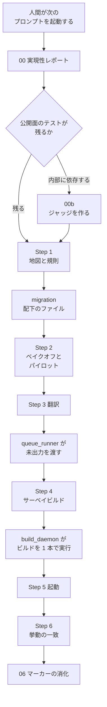

Claude Code Migration Kit は、大規模な言語の全面移行を Claude Code で進めるためのプロンプト、テンプレート、スクリプトの一式です。公開元は Anthropic の GitHub リポジトリ [anthropics/code-migration-kit-with-claude-code](https://github.com/anthropics/code-migration-kit-with-claude-code) です。既定ブランチの初回コミットは 2026-07-08 です。リポジトリ自身は、プロンプトを本番移行の写しではなく、一般化した再構成だと書いています。この記事では、手順の流れ、ディスクに残る成果物、スクリプトが落とす条件を順に整理します。

*この記事の全体像。以下、順に解説します。*

## Claude Code Migration Kitとは

既定の姿勢は、アーキテクチャとデータ構造とファイル境界を保ち、言語だけを替える移行です。対象は、すべてのファイルが移り、古い言語が消える全面移行です。途中の増分的な JavaScript から TypeScript への移行は、README が対象外と書いています。

ライセンスファイルの条文は Apache License 2.0 です。

手順は 6 段です。

1. 地図と規則
2. 規則のストレステスト
3. 翻訳
4. コンパイル
5. 起動
6. 挙動の一致

各段の終わりは人間のサインオフです。次のプロンプトを起動するのも人間です。再設計のときは、ルールブックは設計文書になります。2 段目のベイクオフは使いません。README がそう書いています。

貼り付け用プロンプトは 8 本です。役割は、実現性、ジャッジ作成、依存マップ、ギャップ一覧、ストレステスト、翻訳開始、サーベイビルド、パリティ後のマーカー消化です。ファイルと役割が本文の記述で結び付くものは、次のとおりです。

| ファイル | 結び付いている役割 |
|---|---|
| `prompts/00` | 実現性。3 つの call と Model plan を含む |
| `prompts/00b` | ジャッジの作成 |
| `prompts/01` | 依存マップ。懐疑レビューは 2 名 |
| `prompts/02` | ギャップ一覧 |
| `prompts/03` | パイロット |
| `prompts/04` | レビュー 2 名 |
| `prompts/05` | fixer。`TODO(port)` の件数を `grep` と一致させる |
| `prompts/06` | マーカーの消化 |

同梱スクリプトは 6 本です。

| スクリプト | 役割 |
|---|---|
| `depmap_python.py` | Python の依存マップ。`ast` で辺を取る |
| `depmap_ts.mjs` | JavaScript / TypeScript の依存マップ。相対 specifier を見る |
| `depmap_c.py` | C の依存マップ。`"..."` の include と同名ヘッダを見る |
| `make_manifest.py` | マニフェスト生成 |
| `queue_runner.mjs` | 未出力のファイルをキューに渡す |
| `build_daemon.sh` | ビルドを 1 本で実行する |

テンプレートは、ルールブック、ギャップ一覧の列定義、Claude Code の `permissions.deny`（`templates/settings.json`）です。

完了の単位は、ルールブックの命名どおりの出力ファイルがディスクにあることです。キューは会話の記憶を持ちません。

キットが置いている流れは、次のとおりです。

公開面のテストが残るときは、実現性レポートの次が Step 1 です。テストが内部実装に依存するときは、先に `prompts/00b` でジャッジを作ります。翻訳のあとは `queue_runner` が、まだ出力の無いファイルを渡します。サーベイビルドのあとは `build_daemon` がビルドを 1 本だけ実行します。

ディスクに残る主な成果物は、`migration/RULEBOOK.md`、`migration/depmap/`（`edges.tsv`、`order.txt`、`cycles.txt`）、`migration/inventory.tsv`、`migration/manifest.tsv`、翻訳先ファイル、`migration/build-output-rN.txt`、`migration/cost-log.tsv` です。

## スクリプトが固定する制約

保存に関する制約は、スクリプトまたは設定が終了条件にしているものと、プロンプトがモデルへ命じるものに分かれます。2026-09-24 に、`scripts/` の 6 本は同梱フィクスチャとの `diff -q` が一致しました。

### スクリプトまたは設定が落とすもの

| 制約 | 実装 | 落ちる条件 |
|---|---|---|
| ファイル間の依存と、ファイル粒度の循環 | 上表の 3 本の depmap | 出力は辺、バッチ順、大きさ 2 以上の強連結成分。中身の正しさは見ない |
| 複数ファイルなのに辺が 0 | 3 本とも stderr に警告 | 終了コードは 0 のまま。空の `edges.tsv` は書かれる |
| 変換先パスが元パスのまま | `make_manifest.py` | `target == source` で exit 1。見るのはパス文字列であり、構造の一致ではない |
| 翻訳が終わったか | `queue_runner.mjs` | 出力ファイルが存在する。`verify` が落とすのは 0 バイトだけ |
| ループ中の代表的なビルドと、破壊的な git | `templates/settings.json` の deny | パターンに一致した Bash。`settings.README.md` は、決定的なラッパーでパターンを回避できることと、「セキュリティ境界ではない」ことを書く |
| ビルドの実行が 1 本に集まる | `build_daemon.sh` | ツリーのハッシュが変わると `--cmd` を 1 回実行し、標準出力と標準エラーを `migration/build-output-rN.txt` に保存する。診断の表への分解も、テストの再実行も、スクリプトには無い |

### プロンプトが命じ、スクリプトが落とさないもの

| 制約 | 命令の場所 | スクリプトが持たないもの |
|---|---|---|
| 構造を保つか、再設計か | `prompts/00` の 3 つの call。ルールブック §0 | 姿勢は文章。差し替えを検出するスクリプトは無い |
| 同じアーキテクチャ、同じデータ構造、同じファイル境界 | ルールブック §0 | 型、フィールド、ファイル分割の一致を比較するスクリプトは無い |
| パッケージやクレート境界の循環 | `prompts/01` が「スクリプトの中で凝縮せよ」と書く | 同梱 depmap は、ファイルパスの強連結成分だけを出す |
| 依存マップの過不足 | `prompts/01` の懐疑レビュー 2 名 | `file:line` の付き合わせはモデルが行う |
| ギャップ一覧の網羅と行の正しさ | `prompts/02` | `wc -l` は行数の領収書。全サイトに行があることの検査器は無い |
| ルールブックをループ中に編集しない | CLAUDE.md と各プロンプト | `settings.README.md` は、この区別を permission では書けない、と書く。見つけるのはレビュー |
| 翻訳が規則に従ったか | `prompts/03` のパイロット、`prompts/04` のレビュー 2 名 | 指摘は規則かソース行を引用する、という契約。引用の実在を見るスクリプトは無い |
| `PORT STATUS` の `todos=` | `prompts/05` が fixer に `grep -c 'TODO(port)'` と一致させよ、と書く | 実行者はモデル。`queue_runner` は見ない。数える対象は `TODO(port)` だけで、`BUG(port)` と `PERF(port)` は等式に入らない |
| 挙動が一致したか | Step 6 と `prompts/00b` | ジャッジは利用側のテストか、その場で作るハーネス。成否の記録は RUN-NOTES の自己申告 |
| モデルの階層 | `prompts/00` の Model plan。未指定は手順違反 | 層の検査は、モデル選定を不要にしない |

## 注意点

公式ブログとキットは、到達の規模と、このリポジトリが何を実行したかを分けて読む必要があります。

| 読み | どこまでが一次か |
|---|---|
| Bun の Zig から Rust へ、約 2 週間で 100 万行。マージ前に既存スイートがすべて通り、マージ後の回帰は 19 件でいずれも修正済み | [自己申告: AI によるコード移行](https://claude.com/blog/ai-code-migration)（ページ日付 July 16, 2026）と [Bun in Rust](https://bun.com/blog/bun-in-rust)。キットの RUN-NOTES の実行ではない |
| 同じ移行の未キャッシュ入力が 5.9 billion トークン、出力が 690 million、API 価格で約 $165,000 | 上記 2 本の自己申告。キットに価格表は無い |
| Mike Krieger が Python を 165,000 行の TypeScript に、週末で移した。主部分は 27 million トークン | [自己申告: 公式ブログ](https://claude.com/blog/ai-code-migration) |
| 循環を直したあとにコンパイラエラーが約 16,000 件。Zig の 1 コンパイル単位を約 100 crate に割ろうとした | [自己申告: Bun in Rust](https://bun.com/blog/bun-in-rust)。キット README の「~16K」は同じ自己申告の要約 |
| キットのドッグフードは完了している | 自己申告: 同リポジトリの RUN-NOTES。規模は toml 0.10.2 の 5 ファイル 1,425 行、tinyexpr 約 730 行、再翻訳 7 ファイル 2,513 行。本番の Bun 規模ではない |
| プロンプトは、このリポジトリの上で Bun と Krieger が使ったものだ | 公式ブログは二度、スターターキットは一般化したテンプレであり、これらのポートが走ったものではない、と書く。README は再構成であり写しではない、と書く |

行数は数え方で 1 ずれます。README とルールブック雛形は、Bun のルールブックを 576 行と書きます。キットが指すコミット `46d3bc29` の [`docs/PORTING.md`](https://github.com/oven-sh/bun/blob/46d3bc29f270fa881dd5730ef1549e88407701a5/docs/PORTING.md) は、最終行の末尾に改行がありません。`wc -l` は改行の数として 575 を返します。GitHub の表示行数と README の 576 は、その最終行を含めた数と一致します。確認日は 2026-09-24 です。

その `PORTING.md` は、キットの「同じファイル境界」とも違います。Don't translate は、ファイル末尾の `@import` を 1 対 1 で写すな、alias は消せ、生成ファイルは 3 行の stub にせよ、と書いています。トレイラもキットの 1 行形式とは別で、`source`、`confidence`、`todos`、`notes` の複数行です。

2026-09-24 時点のスター数は約 680、フォークは 59 です。`pushedAt` は 2026-07-08 で、既定ブランチのコミットはこの日の 1 件だけです。README は Issue と PR を見ていない、と書きます。Issue 機能自体は有効です。同じ時点で、開いている欠陥報告はありません。[#1](https://github.com/anthropics/code-migration-kit-with-claude-code/issues/1) は誤投稿として閉じられています。[PR #2](https://github.com/anthropics/code-migration-kit-with-claude-code/pull/2) は本文が空のまま閉じられ、マージされていません。差分は Java と .NET の depmap 追加案であり、main には入っていません。

GitHub の license API は、同じ日の時点で `spdx_id` が `NOASSERTION` でした。ライセンスファイルの条文が Apache License 2.0 であることとは、表示が分かれています。

RUN-NOTES のトークン数とテスト件数は、キットの自己申告のままです。Run 1 は、比較器のバグで 12/12 が偽の差分だった、と自己申告しています。`prompts/00b` は未 dogfood と書いています。Run 2 は、settings が最後まで入らず完走した、と自己申告しています。Run 2 と Run 3 は、既定モデルのまま走った、と自己申告しています。

Claude Code の deny が、ラッパー以外の経路でどこまで守られるかは、公開資料の範囲では決まっていません。キット自身が、決定的なラッパーによるパターン回避を書いています。Bun の PR 30224 が事前の crate 分割をどこまで入れたかは、ブログの「不十分だった」という自己申告までが、ここで扱える範囲です。

## 発注側が土台にする範囲

このキットは、全面移行を制約付きバッチにする雛形です。機械的に固定しているのは、ファイルグラフ、パス置換の空振り、出力ファイルの存在と非空、コマンドパターンの deny、ビルド標準出力の保存です。アーキテクチャとデータ構造の保存は、ルールブックの文章とレビュー契約に残ります。モデルの階層は、同じ実現性ゲートで後続手順を縛ります。

発注側がエージェントのモダナイゼーションを制約付きバッチにするなら、キュー、人間のゲート、ビルドの単一実行を土台にしてよい範囲は、次の一致です。

- キューがディスク上のファイル有無で再開できる、という契約は `queue_runner.mjs` と CLAUDE.md にあります。
- コンパイラをループの中に置かない理由は、設定の README が「エージェントがコンパイラに合わせて翻訳を控える」と書く点にあります。安い型検査では Step 4 を Step 3 に溶かす、とも README が書いています。
- フィクスチャは、依存マップとマニフェストの決定性をリポジトリ内で再現できました（2026-09-24）。
- [公式ブログ](https://claude.com/blog/ai-code-migration)のベストプラクティスは、レビューを敵対的に、検証を機械的に、完了は出力ファイルの存在に、と書いています。キットのキューはその文と一致します。検証役としてブログが挙げるのはコンパイラ、差分、テストスイートであり、キットの 6 スクリプトそのものではありません。

次の読みは、公開資料からは強く言えません。

- 成否が、モデル選定より先に層の検査だけで決まる、は強すぎます。Model plan は手順の一部です。Bun ブログは、pre-release の Claude Fable 5 を 11 日の条件として自己申告しています。
- 構造保存が、このキットの成否条件として本番で固定された、は持てません。公式ブログは、このリポジトリ上でそれらのポートは走っていない、と書きます。Bun ブログは、crate 境界を動かす別ワークフローを自己申告しています。公式ブログは、循環 import のあとで依存を消す、移す、境界を組み替える、と書きます。
- Krieger のポートは、キットがベイクオフ無効とする再設計側だと公式ブログが分類しています。ギャップ一覧は翻訳のあとだった、とも書きます。
- deny が無い実行を、スクリプトは止めていません。`prompts/03` と `prompts/04` は、欠如を deviation log の明示的な waiver で通過できる、と書きます。

保存したい層は、ルールブックに書いた時点では検査されていません。落とすなら、自分のスクリプトの失敗条件に足します。先に足す検査として、次の 4 つが挙がります。この 4 つで十分であることの測定は、キットの公開範囲には含まれていません。

1. ファイルグラフに加え、対象言語のパッケージ境界でも循環を落とします。0 辺は exit 1 にします。
2. `queue_runner` の `verify` に、トレイラ件数と `TODO(port)` / `BUG(port)` / `PERF(port)` の一致を入れます。プロンプトの命令のままにはしません。
3. fan-out の前に、`.claude/settings.json` の deny が存在することをスクリプトが検査します。エージェントに「見ろ」とは書きません。
4. 挙動のジャッジは、翻訳の前に、壊した入力で失敗することを 1 回実行して残します。`prompts/00b` はその手順を書きますが、RUN-NOTES は未実行と書いています。

モデルの階層は残します。ルールを書く段とレビューは大きいモデル、大量の翻訳は小さいモデル、という枠は CLAUDE.md にあります。層の検査は、この選択を消しません。

このリポジトリの完了宣言を、100 万行規模の実証としては使いません。実証として読めるのは、著者ブログが自分の実行について書いた範囲と、キットが自分で走らせたと書く小さな 3 実行までです。

次の条件では、この雛形の機械部分は出口を固定しません。

- 再設計であるとき。ベイクオフは無効、と README が書きます。
- 古い言語を消さない増分移行であるとき。README は JavaScript から TypeScript をこの例にしています。
- 公開面のテストも、第三言語のスイートも無いとき。出口条件が無い、と README とキットの skill が書きます。
- 型検査が安く、deny を外して Step 4 を溶かすとき。サーベイビルドは使われません。settings を入れ忘れると、ガードが無いまま溶ける、と README が書きます。

## まとめ

Claude Code Migration Kit は、言語の全面移行を、人間が段ごとに次のプロンプトを起動するバッチへ落とす一式です。スクリプトが終了条件にしているのは、ファイル間の依存、パス文字列の空振り、出力ファイルの存在と非空、Bash パターンの deny、ビルドログの保存です。アーキテクチャとデータ構造を保つかは、ルールブックとレビューの契約に残ります。規模の数字は、ブログの自己申告と、キット自身が走らせたと書く小さな実行とに分けて読んでください。保存したい層は、自分の失敗条件として足します。

この記事が少しでも参考になった、あるいは改善点などがあれば、ぜひリアクションやコメント、SNSでのシェアをいただけると励みになります！

## 参考リンク

- [anthropics/code-migration-kit-with-claude-code](https://github.com/anthropics/code-migration-kit-with-claude-code)（main `cf91c9d`、2026-07-08）
- [AI によるコード移行（公式ブログ、ページ日付 July 16, 2026）](https://claude.com/blog/ai-code-migration)
- [Bun in Rust](https://bun.com/blog/bun-in-rust)
- [oven-sh/bun の docs/PORTING.md（`46d3bc29`）](https://github.com/oven-sh/bun/blob/46d3bc29f270fa881dd5730ef1549e88407701a5/docs/PORTING.md)
- [Issue #1](https://github.com/anthropics/code-migration-kit-with-claude-code/issues/1)
- [PR #2](https://github.com/anthropics/code-migration-kit-with-claude-code/pull/2)
