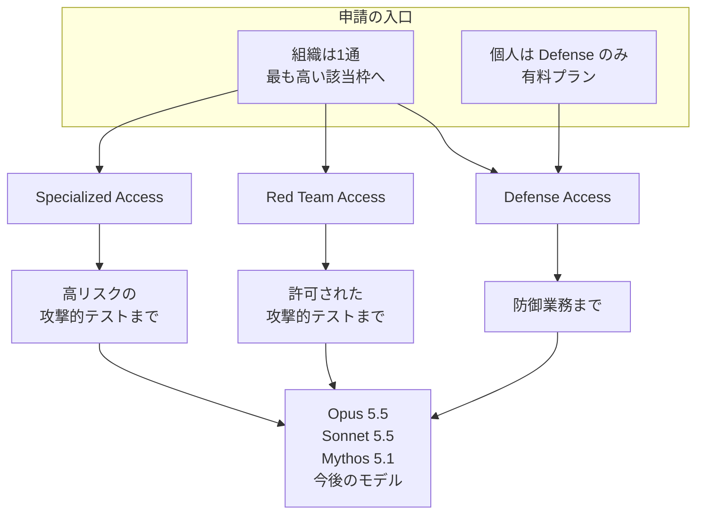
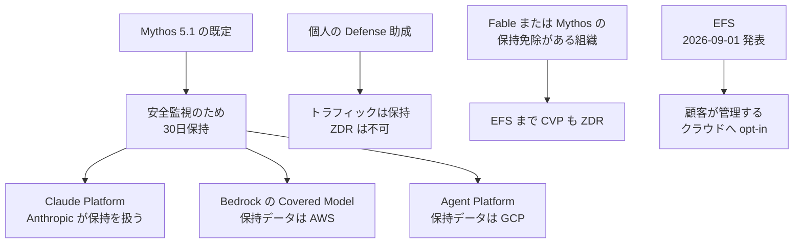

2026年10月6日、Anthropic は Cyber Verification Program（以下、CVP）を3つのアクセス枠へ広げました。枠の名前は Defense Access、Red Team Access、Specialized Access です。対象は Claude Opus 5.5、Claude Sonnet 5.5、Claude Mythos 5.1 と、今後出るモデルです。

申請者が選ぶのは、防御業務、許可された攻撃的テスト、安全上重要なシステムに対する高リスクのテストの、どこまで分類器のブロックを狭めるかです。この記事では、公式発表、Help Center、セキュリティ要件に沿って、枠の境界、申請できる主体、付与後の管理策、ログの保管者を整理します。

数値と境界の記述は、2026年10月6日の公式投稿、Help Center、セキュリティ要件の各本文に基づきます。

*この記事の全体像。以下、順に解説します。*

## Cyber Verification Programとは

3つの枠は、同じモデル集合に対するアクセスの分け方です。通す作業の行、申請できる主体、セキュリティ管理策が分かれます。

### 2本立てが1つのプログラムになった

直近6か月は2本立てでした。Project Glasswing は、重要なソフトウェアを守る組織に Claude Mythos を出していました。旧 CVP は、審査済みのセキュリティチームに、Claude Opus と Claude Sonnet の安全対策を緩めて出していました。2026年10月6日の投稿は、この2本を1つの CVP に統合した、と書いています。

2026年5月22日の Glasswing 更新は、CVP をすでに始めている、と書いています。当時の説明は、脆弱性調査、ペネトレーションテスト、レッドチーミングを例にする単一の水準です。Help Center は、以前の CVP が Opus と Sonnet の単一アクセスだった、と書いています。

初期パートナーは、2026年4月上旬時点で約50組織です。2026年6月2日の拡張は、15か国超の約150組織を追加した、と書いています。

### 一般提供のまま使える作業

次の作業は、CVP を申請しなくても一般提供のまま使えます。

- コードレビュー
- 既知問題の修正
- 自組織のソースコードにある脆弱性の発見
- セキュリティアラートのトリアージ

Help Center は、脅威モデリングもこちらに置きます。マルウェア解析や exploit validation は、一般提供では分類器に中断され得る、と Help Center は書いています。

### 通す作業の行

モデル集合は3枠で同じです。違うのは、通す作業の行と、審査と、セキュリティ管理策です。公式の枠画像が示すチェック位置は、2026年10月6日のブログ画像と Help Center 画像で一致しています。

| 作業行 | 一般提供 | Defense | Red Team | Specialized |
|---|---|---|---|---|
| セキュアコーディング | 可 | 可 | 可 | 可 |
| 防御業務（SOC、インシデント対応、マルウェア解析、検知エンジニアリング、脆弱性のトリアージと検証） | 不可 | 可 | 可 | 可 |
| 攻撃的テスト（許可された敵対的エミュレーション、ペネトレーションテスト、レッドチーミング、攻撃的ツールの開発、exploit validation） | 不可 | 不可 | 可 | 可 |
| 高リスクの攻撃的テスト | 不可 | 不可 | 不可 | 可 |

Defense は防御業務の行で止まります。Red Team は許可された攻撃的テストの行まで開きます。高リスク行のチェックは Specialized だけです。

ブログ本文が Red Team に残すブロックの例は、ランサムウェアの配備、物理系の損傷、高リスク安全システムのペンテストです。

### 申請の入口

申請は組織につき1通です。組織内の個人は別に申請しません。独立した研究者、メンテナ、バグバウンティは個人として申請します。個人に開くのは Defense Access だけです。個人は有料プランを要します。組織は、該当する最も高い枠へ置かれます。

Claude Fable 5.1 は、Claude Mythos 5.1 と同一の基盤モデルに、サイバーとバイオの安全対策を足したものです。Mythos 5.1 の価格は、入力100万トークンあたり10ドル、出力100万トークンあたり50ドルから、と製品ページは書いています。

### 提供面と、付与後も残る規律

提供面は Claude Platform、Google Cloud の Vertex AI、Microsoft Foundry です。Amazon Bedrock には別の門があります。サードパーティのプラットフォーム経由では Defense と Red Team だけで、Specialized は付きません。

Usage Policy は付与後も全面適用です。助成は見直し、縮小、撤回があり得ます。顧客向け製品は Cyber Productization Policy が別規律です。その申請は CVP 利用者へまもなく開く、と Help Center は書いています。

### 保持の経路は枠のチェックとは別である

データの扱いは、枠のチェック表に畳まれません。Mythos 級の既定、個人の Defense、既存のゼロデータ保持（ZDR）免除、Enterprise Frontier Safeguards（EFS）は、別の経路です。

## 注意点

枠の正式名と、作業行のチェック位置は、ブログ、Help Center、両方の画像で一致します。件数、審査日数、既存会員の動詞、Bedrock の門は、一次資料の中で言い方が揃っていません。枠の名前を、本番の権限が広がった証拠としては使えません。

### 第3枠の名前

一次の枠名は Specialized Access です。重要インフラの運用者は、Defense Access の適格例に入ります。ブログは、地域の病院や自治体のユーティリティのように、規模を問わない、と例示します。両方の画像の Defense の「Who it's for」にも、operators of critical infrastructure があります。

Specialized は、人命や市場に影響し得る安全システムをテストする権限を持つ、限られた組織です。ブログの例は、航空機の運航システム、電力網、通信網、銀行間送金、政府の行政ネットワークです。審査は米国政府との協働です。Glasswing の既存会員はこの枠へ移り、現行モデルについて再承認は要らない、と Specialized の段落は書いています。

Help Center の画像だけが、Specialized の対象と高リスク行に critical infrastructure という語を使います。ブログ画像の同じセルは critical safety systems です。申請文では、枠名を Specialized Access と書き、対象システムはブログ本文の例で列挙します。

Red Team の本文は、重要産業の IT システムを、許可されたテストの対象に含めます。同時に、高リスク安全システムのペンテストはリアルタイムでブロックされる、と書いています。重要産業の IT と、高リスクの安全システムは、同じ段の別の文です。

2026年5月22日の時点で、旧 CVP はペネトレーションテストとレッドチーミングを含む単一の水準として説明されています。2026年10月の変更は、その単一水準を3枠に分けたものです。

### ブロック実験の読み方

効果の測定は Claude Opus 5.5 と CyScenarioBench です。課題10件を各枠で5試行、合計50試行、と本文は書いています。

| 条件 | 本文の結果 |
|---|---|
| CVP なし | 全タスクが最初のプロンプトでブロック |
| Defense | 50試行のうち46が途中でブロック。4試行は成功 |
| Red Team | ブロックは起きず、50タスクのうち34を完了 |
| 安全対策なし | 成功率 67.6%。Specialized の代表、と本文は書く |

34/50 は 68% です。67.6% は 50試行あたり 33.8 件に相当します。本文は "effectively equivalent" と書き、件数の一致とは書いていません。同じ投稿の棒グラフは、Red Team と Specialized を同じ高さで描きます。目盛りに 67.6 も 34 も印刷されていません。Specialized の独立した試行数は本文にありません。

CyScenarioBench は Irregular のベンチマークです。Irregular は 2026年9月22日の記事で、緩和を外した10課題サブセットの Opus 5.5 の平均解決率を 67.6% と書き、課題セットは非公開である、と書いています。この 67.6% は、10月6日の枠ごとのブロック実験の独立採点ではありません。同じ記事は、緩和なしで Mythos 5.1 が 61.7% だった、とも書いています。これは CVP の枠比較ではありません。

2026年9月28日付の検索結果が示していた「禁止用途はセルフサービスの CVP では調整されない」という二分は、2026年10月8日に同じ記事を取得すると3枠版に置き換わっています。現行の本文としては確認できません。

### 脆弱性件数は本文と図で一対一に落ちない

本文は次の順で書いています。パートナーが 2026年4月から7月に少なくとも 129,000 件の検証済み脆弱性を見つけた。Anthropic 自身のオープンソーススキャンが 2026年4月から10月に追加で 5,500 件を見つけた。これらの検証済み脆弱性のうち 33,000 超が critical または high である。一部パートナーの調査に基づく過小計上なので、真の影響は少なくとも5倍と見込む。

同じ投稿の図は「33パートナーの調査と、Anthropic がスキャンしたオープンソース」です。2026年10月8日に図を読み取ったセルは次のとおりです。

| 行 | パートナーの自社コード | パートナーのオープンソース | Anthropic のオープンソース | 合計 |
|---|---:|---:|---:|---:|
| 真陽性 | 126,923 | 3,013 | 5,674 | 135,610 |
| High | 24,709 | 266 | 3,014 | 27,989 |
| Critical | 4,088 | 70 | 1,522 | 5,680 |

パートナー真陽性の和は 129,936 です。本文の「少なくとも 129,000」は、この和の切り下げとして読めます。Anthropic 列の 5,674 は、本文の「追加 5,500」と一致しません。High と Critical の合計は 33,669 であり、本文の「33,000 超」と桁が合います。パートナー列だけの High と Critical の和は 29,133 であり、33,000 を超えません。33,000 超を 129,000 の内数として引用すると、図とずれます。

5倍は "we expect" です。図に5倍の列はありません。キャプションは、トリアージの方法が組織ごとに違い、パッチ数を開示したパートナーは 50% 未満なので、パッチ率は大きく過小である、と書いています。2026年6月2日の Glasswing 拡張は、5月更新時点の high または critical を 10,000 超と書いています。10,000 と 33,000 は時点が違います。

### 審査の日数と、既存会員の動詞

| 出典 | 言い方 |
|---|---|
| ブログ、Defense | 数日以内の応答を目指す |
| ブログ、Red Team | 数週間。審査中は Defense に入れる。組織のみ |
| Help Center、申請全般 | 7営業日以内に、決定か追加情報の依頼をメールする。枠では分けない |
| Specialized | 米国政府と一件ずつ精査。日数は無い |

既存会員の動詞も3つあります。

- Specialized の段落は、Glasswing 既存会員はこの枠へ移り、現行モデルの再承認は要らない、と書きます
- 申請の節は、既存 CVP 会員は以前のモデルの設定を維持し、Opus 5.5、Sonnet 5.5、Mythos 5.1 については更新プログラムを通じて自動的に評価される、と書きます
- Help Center は、Glasswing か CVP の既存会員は再申請不要であり、今使っているモデルは現行条件のまま動き、上記3モデルについては該当する新しい枠へ移行する、と書きます

「再承認不要」「自動評価」「移行」は同じ文ではありません。新モデルが枠の対象リストに入っていることと、既存会員がすでにそのモデルを持っていることは、別の事実です。

Help Center は、既存の CVP 顧客について、現行のアクセスとそれに対応するセキュリティ要件は影響を受けず、現行条件のまま残る、と書いています。後述の 2026年12月15日は、要件記事と Help Center の Defense 段落が新しい助成に置く期限です。既存会員の現行助成へ、その期限をそのまま写しません。

### Bedrock の門と EFS

ブログは、Bedrock 上の CVP は EFS の対象顧客だけ、と書いています。Help Center の提供表も同じ見出しです。同じ Help Center の FAQ は、Bedrock が自動安全フラグの人手レビューに未対応なので、Fable 5.1 のデータ保持免除を持つ組織だけが CVP を ZDR で使え、EFS が使えるようになればその対象になる、と書いています。表は EFS を現在の門にし、FAQ は Fable 5.1 の免除を現在の門にして EFS を将来にします。

EFS は 2026年9月1日に発表されました。データは顧客が管理するクラウドに置きます。広く使えるようにするのは秋後半が目標です。10月6日の CVP 投稿も "later this fall" と書いています。2026年10月7日時点のニュースルームで、EFS の一般提供を告げる項目は、確認した範囲では見当たりませんでした。非公開の段階提供が始まっていない、とまでは言えません。

### 付与済みでも、モデル単位の政府措置で止まり得る

2026年6月12日、米国政府の輸出管理指示により、Anthropic は Fable 5 と Mythos 5 を全顧客で停止しました。他のモデルは対象外です。2026年6月30日に規制は解除されました。Fable 5 は翌7月1日からファーストパーティで戻ります。Mythos 5 は、政府の承認を経た米国組織の一部へ戻りました。Glasswing のより広い国内外パートナーへの拡大は、その時点では政府との調整が続いていました。

これは CVP の3枠の訂正ではありません。付与済みの枠が、モデル単位の政府措置の外で持続する、という読みを弱める先例です。

### 一次資料が分かれたままの点

申請条項では、次を未確定として残します。

- Help Center 画像の critical infrastructure が、ブログの safety systems の言い換えか、対象の拡大か
- Glasswing 既存会員の Mythos 5.1 が、再承認なしの移行か、自動評価の結果待ちか
- Bedrock で今通る条件が、EFS 対象か、Fable 5.1 の保持免除か
- 本文の 5,500 と図の 5,674 が、丸めか、期間の違う集計か
- Cyber Productization Policy の本文と、顧客向け製品の申請開始日
- EFS の非公開ロールアウトが、特定顧客で始まっているか
- Red Team と Specialized で、Usage Policy の「許可なく脆弱性を悪用しない」「マルウェアを作らない」が、枠の作業行とどう同時に適用されるか。2025年9月15日発効とラベルされた Usage Policy を 2026年10月8日に取得した範囲では、3枠による免除は書かれていませんでした。Help Center は、Usage Policy が全面適用である、と書いています

## 誰がどの枠を申請できるか

不承認の要因として Help Center が挙げるものは、防御が主業務でないこと、本人確認ができないこと、法域や転用や強制開示のリスク、最終顧客が軍事、情報機関、法執行で能力が転用されやすいこと、申請した枠に対して要件が足りないことです。

| 枠 | 申請主体 | 口座の種類 |
|---|---|---|
| Defense | 自組織が所有または保守するシステムを守る企業、非営利、大学、政府のセキュリティチーム。規模を問わない重要インフラ運用者。小規模のセキュリティ企業。オープンソースのメンテナ。報告実績のある個人研究者。画像はバグバウンティも含む | Consumer（Pro、Max）、Team、Enterprise、API |
| Red Team | 内製レッドチーム、政府レッドチーム、セキュリティ企業、ペネトレーション企業。個人は不可。画像は、本業が攻撃的テストであるペネトレーション企業と企業内レッドチーム、と要約する | Team、Enterprise、API |
| Specialized | 安全システムをテストする権限を持つ限られた組織。米国政府と精査。画像は、重要インフラまたは安全システムのペンテストを行う企業、システム上重要な金融機関と企業、同盟国政府、選ばれたセキュリティ企業、と書く。名詞は画像間で割れる | Team、Enterprise、API |

重要インフラの運用者が自組織のシステムを守る申請は、Defense です。航空機の運航、電力網、通信網、銀行間送金、政府の行政ネットワークのように、人命や市場に影響し得る安全システムをテストする権限を要する申請は、Specialized です。個人の研究者、メンテナ、バグバウンティは Defense だけを選べます。

## 付与時から要る管理策

画像の「Security controls」は要約です。運用の条文はセキュリティ要件の記事の方が細かいです。申請に書く期限は、要件記事の方を使います。次の期限は、要件記事が新しい助成に書く条文です。既存の CVP 顧客のセキュリティ要件が現行条件のまま残る、という Help Center の記述は、前節のとおりです。

全枠に共通する義務は次のとおりです。

- 名前付きのセキュリティ連絡先を置く
- 助成に関わる侵害または悪用の疑いを、72時間以内に報告する
- セキュリティインシデントは24時間以内に扱う
- Anthropic が特定した悪用を、48時間以内に調べる
- 悪用の照会に、7日以内に答える
- 利用者ごとのサインインにする
- リクエストを、名前付きの利用者またはワークロードへ帰属できるようにする
- セキュリティ態勢、所有、本拠、連絡先の重要な変更を、30日以内に通知する

| 項目 | Defense（組織） | Red Team | Specialized |
|---|---|---|---|
| MFA | 付与時から何らかの MFA。2026-12-15 までにフィッシング耐性 MFA | 付与時からフィッシング耐性 MFA | 同左 |
| 長寿命の API キー | 2026-12-15 まで、秘密情報マネージャに置き、1人または1ワークロードに紐づけ、7日ごとに交換。Anthropic は寿命を7日に制限し得る。期日後は不可 | 付与時から不可。短寿命の、その基盤の資格情報 | 同左。加えて SSO |
| 承認ユーザー | 既定の上限なし | 25人。ワークロード ID は数に入らない。書面で追加可 | 同左 |
| 端末と通信 | 要件記事の Defense 節には、管理端末と外向き許可リストは無い | 管理端末。攻撃的またはエージェント的な作業の外向き通信は、ホスト外の許可リストとログ | 管理端末に、アプリの許可または拒否の強制か、ブロックまたは防止モードの EDR。外向き許可リストは Red Team と同じ |
| 身元 | 記事の Defense 節に犯罪歴確認は無い | 身元確認と、合法な範囲の犯罪歴確認。政府の審査またはクリアランスで足りる場合がある | 同左 |
| 顧客が発行する資格情報 | 要件記事では、この12時間を Red Team と Specialized の条文として書く | 発行から12時間以内に失効させる。侵害された資格情報を24時間以内に失効できることとは別の期限 | 同左 |

フィッシング耐性 MFA の定義は、FIDO2 または WebAuthn のセキュリティキー、パスキー、スマートカードまたは PIV です。SMS、音声、メールのコード、認証アプリのコード、プッシュ承認は該当しない、と要件記事は書いています。

個人の Defense は別条項です。サインインは Google または同等の ID プロバイダ経由です。2026年12月15日までにフィッシング耐性 MFA へ移ります。期日までは API キーを1本だけ、7日ごとに交換する条件で持てます。使うのはその個人だけです。トラフィックは保持され、ZDR は不可です。

Red Team 以上では、承認ユーザーの上限 25人に加え、退出後3営業日、侵害された資格情報の失効24時間を、同じ条項に入れます。顧客自身のシステムが発行する資格情報の12時間と、侵害された資格情報の24時間は、別の期限です。

## ログの保管者

保管者は経路で書きます。一つの「Anthropic が持つ」にも、一つの「顧客が持つ」にもまとめません。

1. Mythos 5.1 の製品ページは、既定で安全監視のための30日データ保持を受諾する、と書いています。Covered Models の記事は、プロンプトと出力を、提供する全プラットフォームで30日保持する、と書いています。施行は 2026年6月9日です。既定では Anthropic の職員は読めません。自動の信頼安全システムがフラグしたときなど、制御された経路で少人数が人間レビューします。30日後に自動削除します。フラグされた場合と、法的な保管義務は例外です。
2. 同じ記事は、Bedrock では保持データが AWS に残り、Google Cloud Agent Platform では GCP に残る、と書いています。Claude Platform と Claude Platform on AWS は、Anthropic が同じ管理下で扱う、と書いています。
3. CVP に入った組織には、サイバー悪用の監視のためのデータ保持が要る、とブログと Help Center は書いています。EFS が使えるようになれば、対象組織は自社が管理するクラウドへ保存できます。それまでは、Fable 5.1 または Mythos 5.1 を ZDR で使っている組織は、CVP も ZDR で使える、とブログは書いています。Help Center は、Fable または Mythos の保持免除がある組織は、対応する全モデルで CVP を ZDR にできる、と書いています。Fable 5.1 に限る FAQ の文より広いです。
4. 個人の Defense は、トラフィックが保持され、ZDR は不可です。
5. EFS の設計は、顧客のクラウドアカウントに活動データを置き、顧客管理の鍵を選べ、フラグを顧客へ送り、Anthropic 職員の人間レビューを必須にしない、というものです。顧客管理ストレージ、顧客管理鍵、完全自動のレビューは、それぞれ opt-in です。Anthropic は EFS 自体に課金しません。保管料はクラウド事業者が請求します。2026年10月6日時点では、この経路は予告です。

EFS が契約に入るまでは、顧客が保管者である、とは書きません。

## 承認後に利用者が使えるまで

Help Center は、助成があっても止まったときの確認先を、管理者の割当と、ワークスペースと、作業がその枠の中か、に置きます。

| 面 | 承認後に要る操作 |
|---|---|
| Claude Console / API | 所有者がプログラムをワークスペースへ割り当てる |
| Claude Enterprise | 所有者がカスタムロールへ割り当てる |
| Claude Team / Max / Pro | 追加の割当操作は無い。プログラムは組織に付く。Pro の Mythos 5.1 は usage credits のみで、プラン内利用を消費しない。Max では Mythos 5.1 と Fable が週次上限の最大 50% を共有する |
| サードパーティ | 連携したプロファイルで、承認された水準をオンにする。Specialized は不可 |
| クラウドの Mythos | 承認から約5営業日 |

Team、Max、Pro 以外では、枠が付いたことと、そのワークスペースの利用者が使えることは一致しません。クラウド上の Mythos は、承認から約5営業日遅れます。

## 申請文と社内決裁を分ける

利用申請と、社内で本番権限を広げる決裁は、別の文書にします。申請に先に書く条項は次のとおりです。

1. 枠の正式名を書きます。Defense Access、Red Team Access、Specialized Access のいずれか一つです。重要インフラの運用者が Defense を申請するときは、運用者であることを書き、Specialized の安全システムテストとは分けて書きます。
2. 通してよい作業を、公式画像の行の名前で書きます。セキュアコーディング、防御業務、許可された攻撃的テスト、高リスクの攻撃的テストの、どこまでかです。Red Team を選ぶときは、ブログが残すブロックも同じ条項に書きます。残る例は、ランサムウェアの配備、物理系の損傷、高リスク安全システムのペンテストです。高リスク行を必要とするなら、枠は Specialized であり、米国政府との精査が付く、と書きます。
3. 対象モデルを、Opus 5.5、Sonnet 5.5、Mythos 5.1、今後のモデル、と書きます。CyScenarioBench の 46/50 と 34/50 は Opus 5.5 の自社実験である、と注記します。Mythos 5.1 の枠ごとのブロック率としては引用しません。
4. 期限を、新規の助成と既存会員で分けて書きます。新規の組織 Defense は、2026年12月15日までにフィッシング耐性 MFA へ移り、長寿命の API キーをやめます。それまでは API キーを7日ごとに交換します。Red Team と Specialized は、付与時からフィッシング耐性 MFA と短寿命資格情報です。
5. ログの保管者を経路別に書きます。既定は Mythos 級の30日保持です。Claude Platform では Anthropic が保持を扱います。Bedrock の Covered Model は AWS、Agent Platform は GCP、と Covered Models の記事は書いています。個人の Defense は ZDR 不可です。組織が CVP を ZDR で使う条件は、既存の Fable または Mythos の保持免除があること、と Help Center は書いています。EFS による顧客クラウド保管は、2026年10月6日時点では秋後半の予定です。
6. Usage Policy が残ること、助成が縮小または撤回され得ること、顧客向け製品は別ポリシーで申請が未開であること、を書きます。
7. 付与後の割当を書きます。Console はワークスペース、Enterprise はカスタムロールです。Team、Max、Pro は追加の割当操作が無く、組織に付きます。Pro の Mythos 5.1 は usage credits のみです。Max では Mythos 5.1 と Fable が週次上限の最大 50% を共有します。サードパーティ経由に Specialized は付きません。クラウドの Mythos は約5営業日遅れます。
8. 社内の本番権限は、枠の名前では広げません。広げる単位は、どのワークスペースの、どの名前付き利用者に、どの作業行まで、どの日まで、どの保管経路で、です。

エージェントが止める位置は、モデルが Mythos か Fable かだけでは決まりません。Fable 5.1 は Mythos 5.1 と同一基盤で、安全対策の有無が違います。止める位置の契約文は、どの枠のどの作業行か、どの面に割り当てたか、保持の例外がどの経路か、です。

次の条件が揃ったら、該当条項だけを差し替えます。

- EFS が対象組織で有効になり、保管が顧客クラウドへ移る契約が結ばれたら、保管者の条項をその契約へ差し替える
- Anthropic が二つの画像の名詞差をどちらかへ訂正したら、高リスク行の語を訂正後の語へ合わせる
- 既存会員向けに、Mythos 5.1 の付与有無を口座単位で確認できたら、「対象リストに入る」と「この口座で有効」を分けたまま、後者だけを有効と書く

## まとめ

2026年10月6日の拡充は、Defense Access、Red Team Access、Specialized Access の3枠です。重要インフラは第3枠の名前ではありません。緩和されるのは、分類器が通す作業行です。Usage Policy、Red Team に残るリアルタイムのブロック、助成の撤回は残ります。

Mythos 5.1 は3枠の対象リストに入ります。既存会員がそのモデルをすでに持つかは、再承認不要、自動評価、移行の3つの動詞が分かれたままです。ログの保管者は、30日の既定、個人の保持、組織の ZDR 免除、未提供の EFS に分かれます。

社内で広げる単位は、枠の名前ではありません。ワークスペース、名前付き利用者、作業行、期限、保管経路です。

この記事が少しでも参考になった、あるいは改善点などがあれば、ぜひリアクションやコメント、SNSでのシェアをいただけると励みになります！

## 参考リンク

- [Expanding the Cyber Verification Program](https://www.anthropic.com/news/cyber-verification-program)（Anthropic、2026-10-06）
- [枠画像](https://www-cdn.anthropic.com/images/4zrzovbb/website/2b1d3817fe9aa732e1be4ed18446a1b1367379e7-1920x2322.png)（同投稿、2026-10-08 取得）
- [Glasswing 調査図](https://www-cdn.anthropic.com/images/4zrzovbb/website/172894c37182d28628eb922929f134400c3ef1b5-1920x862.png)（同投稿、2026-10-08 取得）
- [CyScenarioBench 図](https://www-cdn.anthropic.com/images/4zrzovbb/website/bdb05797e26ba2d096ebda6df1c762518da39db2-1920x1080.png)（同投稿、2026-10-08 取得）
- [Cyber Verification Program](https://support.claude.com/en/articles/14604842-cyber-verification-program)（Claude Help Center、Updated October 2026）
- [Help Center の枠画像](https://downloads.intercomcdn.com/i/o/lupk8zyo/2716457392/33c90f9ccfbd33fee02840fd2efa/267bc7d1-baeb-4302-a1d9-4491b4110775)（2026-10-08 取得）
- [Cyber Verification Program Security Requirements](https://support.claude.com/en/articles/17202708-cyber-verification-program-security-requirements)（Claude Help Center）
- [Claude Mythos](https://www.anthropic.com/claude/mythos)（Anthropic）
- [Data retention practices for Covered Models](https://support.claude.com/en/articles/15425996-data-retention-practices-for-covered-models)（Claude Help Center）
- [Developing Enterprise Frontier Safeguards with our customers](https://www.anthropic.com/news/enterprise-frontier-safeguards)（Anthropic、2026-09-01）
- [Project Glasswing: An initial update](https://www.anthropic.com/research/glasswing-initial-update)（Anthropic、2026-05-22）
- [Expanding Project Glasswing](https://www.anthropic.com/news/expanding-project-glasswing)（Anthropic、2026-06-02）
- [Statement on the US government directive to suspend access to Fable 5 and Mythos 5](https://www.anthropic.com/news/fable-mythos-access)（Anthropic、2026-06-12）
- [Redeploying Fable 5](https://www.anthropic.com/news/redeploying-fable-5)（Anthropic、2026-06-30）
- [Usage Policy](https://www.anthropic.com/legal/aup)（Anthropic、effective September 15, 2025）
- [Assessing Claude Opus 5.5 Against Offensive Security Benchmarks](https://www.irregular.com/research/assessing-claude-opus-5.5-against-offensive-security-benchmarks)（Irregular、September 22, 2026）
- [ITmedia NEWS](https://www.itmedia.co.jp/news/article/2610/07/2000002084/)（2026-10-07）
