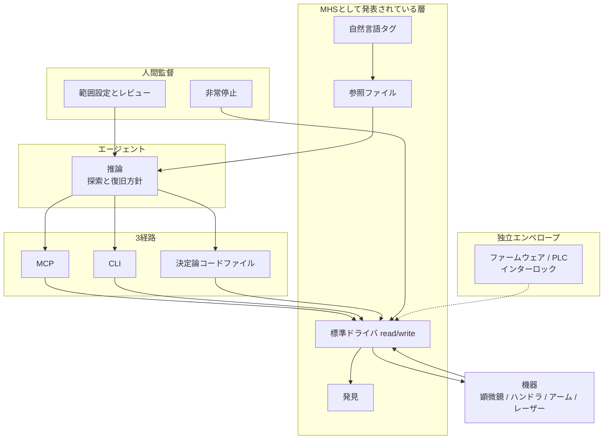
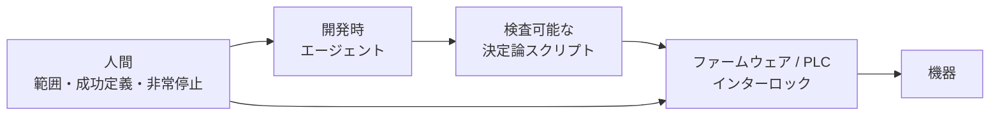

Anthropic が 2026-08-27 に、AI エージェントが物理機器を操作するための共有仕様「Model Hardware Standard」(MHS) の research preview を発表しました。科学研究ラボと先端製造の第一グループ向けに、申請制でアクセスが開かれています。

「物理世界の MCP」という枕詞で紹介されることが多いのですが、2026-08-29 時点で公開されているのは発表文と申請サイトだけです。スキーマも SDK も適合試験も出ていません。

この記事では、公開されている一次情報だけを使って、次の 3 点を整理します。

- MHS が標準化しようとしている層はどこまでか
- パートナーの自己報告値が実際に何を証明しているか
- エージェントに実機の write を渡す判断を、いま下してよいか

結論を先に書くと、**preview を実機 write の権限モデルの正本にするのはまだ早い**、そして**それとは別に、この preview から持ち帰る価値のある層の分け方が 1 つある**、という 2 つです。

*この記事の全体像。以下、順に解説します。*

## MHS が標準化しようとしている層

Anthropic の説明を分解すると、MHS が置き換えようとしているのは「機器ごとの専用統合」です。代わりに置くのが、標準ドライバと機械可読な機器記述です。

公式が挙げている構成要素は次の 4 つです。

| 構成要素 | 内容 |
|---|---|
| 標準ドライバ | `read` / `write` のプリミティブ (例: 温度取得と温度設定) |
| 発見 | ネットワーク上で機器を発見可能にする |
| 自然言語タグ | コードから読み取れない特性 (アーム重量など) を自然言語で付与 |
| 参照ファイル | タグから自動生成される記述。測定項目、調整項目、安全限界を含むと公式は書く |

そのうえで、エージェントからの制御経路を 3 つ用意しています。

1. **MCP** — 対話的にツールとして呼ぶ
2. **CLI** — シェルから呼ぶ
3. **コードファイル** — コマンド列をコードに落として実行する

3 番目が重要です。公式は、長時間・高速の操作ではコマンド列をコードへ落とし、毎ステップの推論を外すことを想定しています。つまり **MHS は「全操作をモデルに逐次判断させる仕組み」として設計されていません**。この点は、宣伝文から受ける印象とかなり違います。

対象はプログラマブルインターフェースを持つ機器に限られ、モデル非依存を主張しています。

### 全体の配置

公式が述べる層と、パートナーの一次情報が示す実行時の分離を重ねると、次の配置になります。点線は「宣言・継承」で、拒否が仕様上 MUST かどうかは公開情報では確定できません。

責任をどの層に置くか、という観点で並べ直すと、公開情報の穴が見えます。

| 層 | 置くべきもの | 公開資料での状態 |
|---|---|---|
| プリミティブ | 読み書き、状態取得、発見 | 概念としてあり。スキーマなし |
| 機器状態 | 現在値、校正、ビジー、非常停止 | パートナーはマニフェストの states / procedures と説明 |
| 安全限界 | 速度・角度・温度の上限、インターロック | 参照ファイルで強制されると書くが、強制点の記述が一次情報同士で食い違う |
| 決定論スクリプト | 検証済みの復旧・校正シーケンス | QuEra はランタイムに AI を入れていない |
| 人間監督 | 範囲、成功定義、誤った探索の停止、非常停止 | 公式もパートナーも残している |

「認証」「RBAC」「監査ログ」「ドライバ完全性」「ネットワーク分離」は、この表のどこにも公式記述がありません。**MHS はいまのところ、権限モデルではなく機器記述とドライバ抽象の提案です**。

## パートナー事例が実際に証明していること

preview の説得力は、ほぼパートナーの自己報告値に依存しています。ここが読み違えの起きやすいところなので、条件込みで見ます。

### QuEra: 数値は強いが、テストベッド上の話

QuEra は中性原子量子コンピュータのレーザー再ロック (relock) コントローラを、Claude に MHS 経由で書かせました。

| 項目 | 値 | 条件 |
|---|---|---|
| ブラインド試験 | 695 / 700 (99.3%) | 7 障害クラス × 100 試行。原因は知らせない |
| 失敗 5 件 | リグ条件由来。成功の誤報告はゼロと自己報告 | |
| 復旧時間 | 波長保持 0.9〜5.4 秒、最難クラス 約 10〜14 秒 | 人間の専門家は 5〜10 分 |
| 自然発生モードホップ | パイロット中 43 回、すべて自動復旧 | 自己報告 |
| 無人連続運転 | 約 19 時間で脱落 0 | 以前は 1.6 回/時 |
| 220 kHz 共振 | 手動調整が残した共振を約 1000 倍抑制 | 線幅系メトリクスは 58 kHz → 21 kHz |
| 人手ベースライン | 4 人で手書きスクリプトに 2〜3 週 | |

重要な前提が 2 つあります。

- **専用テストベッドでの結果**であり、本番量子プロセッサへの配備は完了していません。QuEra 自身が「headed for live machines next」と書いています。
- **ランタイムに LLM はいません**。動いているのは決定論プログラムです。AI がループ内にいるのはチューニング工程 (12 パラメータ、約 12,500 評価) の側です。

さらに、レーザー担当のエンジニアが「正しく見えて正しくない」探索を複数回止めています。自律しているのは範囲内の実験ループであって、監督が消えたわけではありません。

なお、二次記事でよく引用される「58% → 96%」「150 秒 → 6 秒」は、Anthropic の短報でも QuEra のブログ本文でも確認できませんでした。同じ二次記事は「4 人で months」「16 時間 soak」といった値も混ぜており、一次の「2〜3 週」「約 19 時間」と食い違います。**引用するなら一次に当たり直したほうが安全です**。

### Carnegie Mellon: 統合の速さは本物、ただし文脈付き

CMU の参加者は、互いに非互換な 3 台を 1 つの用量反応実験へつないでいます。

| 機器 | インターフェース |
|---|---|
| Spinnaker | XML ジョブ |
| CyBio Felix | COM |
| Varioskan LUX | GUI のみ |

統合開始から用量反応の完了まで 8 時間 (自律的な再実行 1 回を含む)。Run 1 は 200 µg/mL で飽和して R² = 0.884、上限を 100 µg/mL に下げた Run 2 で R² = 0.981。試薬は染料プロキシです。

人工的に仕込んだ 6 種類の故障 (欠プレート、回転、ビジー、カメラ切断、到達不能、非常停止) は、いずれも移動前にブロックされました。

ただしこの 8 時間は、**約 2.5 ヶ月のプロジェクト参加を経た 1 実験**です。公式の「数週間〜数ヶ月が数時間または数分へ」という主張を、そのまま新規導入の見積もりに使うことはできません。比較条件も試行数も公開されていません。

そして CMU の記録には、公式説明と食い違う点があります。Anthropic は「プログラミングインターフェースを持たないハードウェアにはまだ対応しない」と書いていますが、参加者は Varioskan LUX の GUI をスクリーンショットとマウス操作で動かしたと書いています。preview 内の逸脱なのか、公式の範囲記述が不足しているのかは、仕様が非公開なので判定できません。**GUI 経路は OS 入力なので、機器側のインターロックを迂回し得る**という点だけは押さえておく価値があります。

### Genentech ほか: 成功談より限界の記述が有用

Genentech は BCA アッセイの PoC ですが、成功率の一次数値はありません。むしろ公式が書いている失敗、**液面の泡立ちをソフトウェアのバグと誤認した例**のほうが、判断材料としては重要です。空間・物理推論には専門家の監督が必要だと公式自身が認めています。

Janelia は 7 ベンダーにまたがる顕微鏡リグの統一、UW は遠隔モニタと qPCR 停止・衝突なしのハンドオフ、Tetsuwan は市民科学向け qPCR です。

機器ベンダー側では AWS Strands Robots、Automata、Doosan、MBF ScanImage、QIAGEN、Tecan、Universal Robots が表明し、Danaher は "actively exploring" にとどまります。Hugging Face LeRobot と Raspberry Pi は次フェーズの希望です。

## 持ち帰るべきなのは仕様ではなく層の分け方

ここまでを踏まえると、MHS 本体を採用する判断はまだできません。一方で、QuEra の構成は preview と無関係に再利用できます。

- **エージェントは開発時に置く。** 発見、仮説生成、復旧方針の探索、コード生成まで。
- **実行時は決定論スクリプト。** レビュー可能で、再現でき、差分が読める形にする。
- **拒否はハードウェア側。** ファームウェア、PLC、インターロックが最終的な限界を持つ。
- **人間は範囲と成功定義と停止を持つ。**

この分け方は、ソフトウェアのエージェント運用でも見慣れた形です。書き込み権限を持つ操作をモデルの毎回の判断に委ねず、検証済みの手続きに落とし、最終的な拒否は下層に置く。MHS で新しいのは、その「下層」が PLC や機械安全になるという点だけです。

逆に言うと、**自然言語タグは説明であって安全境界ではありません**。「参照ファイルに書いた限界が強制される」という記述を、そのまま安全設計の根拠にはできません。誤ったタグが「強制される限界」として読まれるリスクがあります。

## 既存標準との比較

ラボ機器の相互運用は MHS が初めてではありません。

| 基準 | MHS preview | SiLA 2 / OPC UA | LAP (arXiv:2606.03755) | 専用統合 |
|---|---|---|---|---|
| クライアント仮定 | 確率的エージェント | 決定論ワークフロー | 確率的エージェント | 人間 + スクリプト |
| 公開検証 | 不可 (仕様なし) | 可 | 設計論文のみ | 現場依存 |
| 発見 | 標準フォーマットと主張 | mDNS 等 | InstrumentCard | なし |
| 予約 / 排他 | 不足。v2 提案段階 | SiLA に locking あり | 第一級のリース | 運用ルール |
| 安全交渉 | 記述が一次情報間で衝突 | PLC 境界に載せられる | S0〜S3 + パラメータ束縛トークン | 安全 PLC |
| 合成ハザード | 公開試験なし | セルは ISO 10218 側 | Lab Coordinator 必須と明記 | リスクアセスメント |
| 認証・監査 | 公式に記述なし | SiLA Core に認証あり | DID / 署名カード | 現場 IAM |
| 実測 | パートナー自己報告 | 多数のラボ実績 | なし | 既存 |

MHS の独自性は「クライアントが確率的であることを前提に機器記述を設計した」点にあります。逆に、決定論層としてなら SiLA 2 / OPC UA / ROS 2 がすでに存在し、認証・予約・監査はそちらのほうが揃っています。

なお AWS Strands Robots は別スタックです。既定はシミュレーションで、実機は `mode="real"` の明示 opt-in が必要です。GitHub の `strands-labs/robots` は 2026-08-29 時点で star 約 140、アーカイブされていません。MHS との結合部分は preview 参加者向けの private パッケージなので、公開コードからは確認できません。

## 導入判断で見落としやすい 4 つのリスク

### 1. 安全の強制点が一次情報間で食い違う

- CMU の参加者は「別の safety module は不要で、エージェントが宣言を継承する」と書く
- QuEra は「hardware interface でモデル非依存に強制する」と書く
- Anthropic は「物理安全のロードマップは策定中」と書く

最大公約数は「別レイヤーで強制する」ではありません。**自分の現場の強制点は、自分で用意する必要があります**。

### 2. 予約と合成ハザードが未整備

デバイスの予約 / リースとデバイス局所スケジューリングは、CMU の参加者が v2 提案として承認されたと書いている段階です。つまり現行にはありません。

さらに、**個別コマンドが安全でもシーケンスが危険になるケース**の試験は、公開されている範囲に存在しません。複数機器をまたぐ合成ハザードの評価を v2 に載せた一次情報もありません。

### 3. MCP 経路の既知の弱点をそのまま引き継ぐ

MHS は 3 経路の 1 つとして MCP を使います。MCP エコシステムの既知の欠陥は、そのまま隣接リスクになります。

| 件名 | 内容 | 修正 |
|---|---|---|
| CVE-2025-49596 | `@modelcontextprotocol/inspector` < 0.14.1。client–proxy 間に認証がなく、stdio 経由で MCP コマンドを起動できる | 0.14.1 |
| CVE-2026-52869 | PyPI `mcp` <= 1.27.1。SSE / stateful Streamable HTTP がセッション ID だけで既存セッションへルーティングし、作成時の principal を検証しない (HTTP transport かつ認証有効時) | 1.27.2 |
| `modelcontextprotocol/servers#3751` | GitHub MCP の `push_files` が owner / repo / branch を制約せず、プロンプトインジェクションでトークン権限内の任意リポジトリへ書ける (Closed as not planned) | なし |

どれも MHS 本体の脆弱性ではありません。ただし性質は共通です。**デバッグ用プロキシがホストの RCE 経路になる**、**write ツールが対象を絞っていないと注入で任意の対象へ書ける**。物理 write に同じ穴があれば、被害はファイルではなく機器になります。

対策は素直です。デバッグプロキシを工場網に置かない。write ツールはスキーマで対象機器を固定する。

### 4. EU 機械規則 2023/1230 の適用範囲

Regulation (EU) 2023/1230 は 2027-01-20 適用です。安全機能を果たす独立ソフトウェアは safety component になり得ます。自己進化する ML が安全機能を担う場合は、Annex I Part A の 5〜6 に該当し、第三者適合評価に近づきます。

ここで誤読されやすいのが Art. 2(2)(m) の除外です。除外の対象は「**研究目的で特別に設計・製造され、ラボで一時的に使用される機械**」に限られます。市販の Tecan Fluent や Varioskan LUX、Universal Robots を大学ラボで使うだけでは外れません。製造セルだけでなく、汎用ラボ機器の恒久運用も除外対象外です。

二次記事にある「notified body 必須」は、高リスクカテゴリへの一般化であり、条件を省略した解釈です。実際に判断するなら条文を読むべき箇所です。

## いま取るべき対応

1. **preview を権限モデルの正本にしない。** 仕様が公開されるまで、機器の write は決定論スクリプトと既存インターロックの後ろに置く。
2. **層を分ける。** エージェントは発見・仮説・コード生成。実行は検査可能なスクリプト。拒否はファームウェア / PLC。人間は範囲・成功定義・非常停止。自然言語タグは説明であって安全境界ではない。
3. **予約と合成ハザードは自前で扱う。** 現行 MHS に頼らない。
4. **MCP で機器を出すなら、既知欠陥を前提に設計する。** デバッグプロキシを工場網に置かない。write ツールはスキーマで対象機器を固定する。
5. **数値を引用するなら条件を落とさない。** 99.3% はテストベッドの 700 試行であって本番 QPU ではない。CMU は染料プロキシと人工 6 故障。泡の誤認は成功談ではなく限界の記述。
6. **EU 上市や製造セル、汎用ラボ機器の恒久運用へ広げるなら、法務・安全担当を先に入れる。** 2023/1230 の safety component / self-evolving safety と ISO 10218 のセル評価を、OSS 公開前に確認しておく。

追跡だけは続ける価値があります。判断を逆転させる条件は明確です。公開仕様が「パラメータはインターフェース側が MUST reject する」「合成は Coordinator が評価する」「認証・監査・予約が規範である」と書き、かつ Claude 以外を含む独立した再現が出たときです。そのときは、記述層としての採用を再評価します。

## まとめ

- MHS は「物理世界の MCP」というより、**機器記述とドライバ抽象の research preview**です。スキーマ・SDK・適合試験はいずれも未公開で、第三者検証ができません。
- 公式設計は毎ステップの推論を前提にしていません。**MCP / CLI / 決定論コードファイルの 3 経路**があり、長時間・高速操作はコードへ落とすことが想定されています。
- QuEra の 99.3% はテストベッドでの 700 試行、CMU の 8 時間は 2.5 ヶ月の参加を経た 1 実験です。**条件を落とした引用が二次記事で広がっている**ので注意が必要です。
- 認証・RBAC・監査ログ・予約・合成ハザード評価は、公開情報の範囲に存在しません。安全の強制点も一次情報同士で食い違っています。
- 再利用できるのは仕様ではなく層の分け方です。**開発時エージェント / 実行時決定論 / 拒否はハードウェア / 人間は範囲と停止**。この分離は preview の採否と無関係に効きます。

この記事が少しでも参考になった、あるいは改善点などがあれば、ぜひリアクションやコメント、SNSでのシェアをいただけると励みになります！

## 参考リンク

- [Anthropic, "Previewing the Model Hardware Standard" (2026-08-27)](https://www.anthropic.com/news/model-hardware-standard-research-preview)
- [Model Hardware Standard 公式サイト](https://www.modelhardwarestandard.com/)
- [Anthropic, "Introducing the Model Context Protocol" (2024-11-25)](https://www.anthropic.com/news/model-context-protocol)
- [QuEra, "Holding the Light: Teaching an AI to Lock and Tune Our Quantum Computer's Lasers" (2026-08-27)](https://www.quera.com/blog-posts/holding-the-light-teaching-an-ai-to-lock-and-tune-our-quantum-computers-lasers)
- [QuEra Computing, PR Newswire (2026-08-27)](https://www.prnewswire.com/news-releases/quera-computing-uses-ai-to-automate-a-critical-quantum-computer-subsystem-enabling-the-acceleration-of-commercial-grade-quantum-computing-deployments-from-quera-302861496.html)
- [Gün Kaynar, CMU MHS 実験記録 (2026-08-27)](https://gunkaynar.com/blog/mhs-lab-experiment.html)
- [Zhu et al., "LAP: An Agent-to-Instrument Protocol for Autonomous Science" arXiv:2606.03755v1](https://arxiv.org/html/2606.03755v1)
- [Regulation (EU) 2023/1230](https://eur-lex.europa.eu/legal-content/EN/TXT/HTML/?uri=CELEX:32023R1230)
- [SiLA 2 Standards](https://sila-standard.com/standards/)
- [GHSA-7f8r-222p-6f5g / CVE-2025-49596](https://github.com/advisories/GHSA-7f8r-222p-6f5g)
- [GHSA-jpw9-pfvf-9f58 / CVE-2026-52869](https://github.com/advisories/GHSA-jpw9-pfvf-9f58)
- [modelcontextprotocol/servers#3751](https://github.com/modelcontextprotocol/servers/issues/3751)
- [Ars Technica, "Anthropic's new hardware standard lets AI agents control the physical world" (2026-08-27)](https://arstechnica.com/ai/2026/08/anthropics-new-hardware-standard-lets-ai-agents-control-the-physical-world/)
- [gihyo.jp, Model Hardware Standard (2026-08-28)](https://gihyo.jp/article/2026/08/model-hardware-standard)
