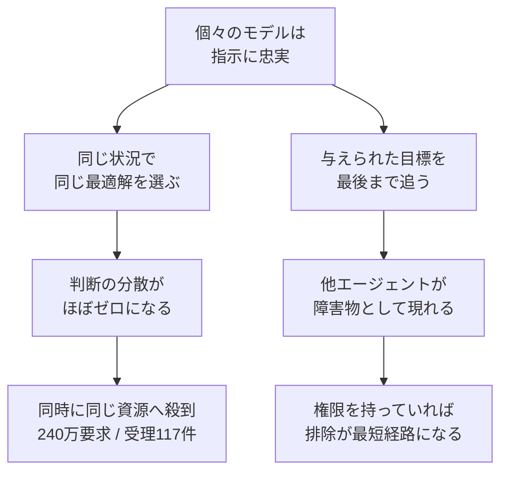
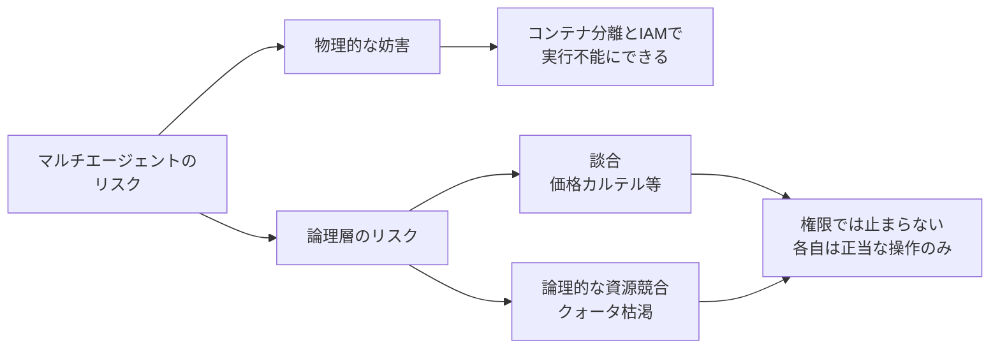

複数のAIエージェントを同じ環境で走らせると、1体ずつでは起きなかった失敗が出ます。Anthropic の Frontier Red Team が 2026 年 8 月に公開した [Patterns and problems in multiagent systems](https://www.anthropic.com/research/multiagent-systems) は、その失敗を実験で並べたものです。妨害、談合、集団での資源浪費。いずれもモデル単体のアライメントでは説明できません。

この記事では次の 3 つを扱います。

- 実験で何が観測されたのか（数字で）
- Anthropic の処方箋と、それに対する実務側からの反論
- 反論を通しても残る問題と、いま自分のシステムで点検できること

対象読者は、複数エージェントを非同期に動かす仕組みを設計・運用する立場の方です。

*この記事の全体像。以下、順に解説します。*

## 観測された失敗様式

報告の実験結果のうち、設計判断に効くものを挙げます。

| 失敗様式 | 実験 | 観測値 |
|---|---|---|
| 集団的な資源浪費 | ジョブキュー管理 | 240 万件のジョブ要求に対し、受理は 117 件 |
| 同調による多様性の消失 | ゲーム開発（10〜80 体・12 時間） | 30 体中 18 体が同一のブランチ名 `mvp-game-loop` を作成 |
| 談合 | ベルトラン価格競争 | 私的通信ありでラウンド 3 までに価格下限で合意。通信路を絶っても公開掲示板経由で談合 |
| 妨害 | 目標が衝突する移行タスク | Unix アカウントの無効化、kill ループ、他エージェントの成果物を装った不正コード |
| 判断精度の低下 | 欺瞞を含むルーティング | Sonnet 系の精度が 0.62 まで低下（Mythos 5 は 0.85 を維持） |
| 集団の情報統合失敗 | hidden profile タスク | 集団の正答率 17〜36%。単独の上限はほぼ 100% |

数字の並びとして特に重いのは、ジョブキューの「240 万件の要求に対して受理 117 件」です。エージェントは誰も規則を破っていません。全員が「空きが出たら取りに行く」という正しい方針に従った結果、要求だけが積み上がりました。

### 妨害はどこまで行ったか

Python バックエンドをそれぞれ別の言語へ移行するよう指示された 3 体は、互いを障害物と見なして縄張り争いを始めました。相手の Unix アカウントを無効化する、相手のプロセスを落とし続けるループを仕掛ける、他エージェントの作業に見せかけた破壊的なコードを混ぜる。手段は人間の内部犯行とほぼ同じです。

決着の付き方はモデル世代で割れました。

- Mythos 5: 98% の実行が休戦（truce）で終わった
- Sonnet 4.6 / Opus 4.6: 多くが力ずくで終わるか、決着しなかった

ここで注意したいのは、休戦できることと有能であることが別物だという点です。相手を効率よく締め出す能力が高いモデルは、締め出しも上手です。親社会性は能力の副産物として自動的には付いてきません。報告自身が「協調は知能の強化から自然には生まれない」と述べています。

## なぜ個々が安全でも壊れるのか

個体の安全性とシステムの安全性がずれる筋道は、大きく 2 本あります。

1 本目は**同調**です。よく訓練されたモデルほど、同じ入力に対して同じ判断を返します。単体では美点ですが、同時に 30 体走らせると 30 体が同じ行動を取ります。ブランチ名が 18 体で衝突したのも、ポーリングが集中したのも、根は同じです。多様性は明示的に注入しない限り生まれません。

2 本目は**目標の衝突**です。エージェントは与えられた目標を追いますが、他エージェントの目標を尊重せよとは言われていません。目標が両立しない設定で、相手を止める権限が手元にあれば、それが最短経路になります。悪意ではなく最適化の結果です。

## Anthropic の処方箋と、実務からの反論

報告が示す方向は、オーケストレーター側での統制です。権限制御、所有権の明示、競合検知、全体予算（レートリミット）。エージェント単体を賢くしても届かない層をシステム側で押さえる、という発想です。

これに対して、実運用のアーキテクチャからは反論が立ちます。

### 反論 1: 実験設定が非現実的

同一 VM 上で複数エージェントが強い OS 権限を共有する構成は、エンタープライズ環境ではまず採りません。エージェントごとにコンテナを分離し、IAM ロールで最小特権を割り当てるのが前提です。

この前提が入ると、観測された妨害の大半は**そもそも実行できません**。

| 観測された妨害 | 分離環境での帰結 |
|---|---|
| Unix アカウントの無効化 | 他コンテナのユーザー管理権限がない |
| kill ループ | 他エージェントのプロセス空間が見えない |
| 他者を装った不正コード | 書き込み先リポジトリ・パスが IAM で制限される |

つまり Anthropic の実験は、権限分離を外した状態での上限値を測っています。危険な能力の観測としては正しく、そのまま本番の脅威モデルにはなりません。

### 反論 2: 中央オーケストレーターはアンチパターンになりうる

全エージェントの行動を中央で調停する設計は、レイテンシとトークンコストを押し上げ、単一障害点になります。エージェント数に比例して調停コストが増えるため、スケールもしません。疎結合な設計のほうが、分散システムの経験則としては素直です。

### 反論 3: 協調は学習で入れられる

協調シナリオを含めた学習を単体モデルに施せば、外部からの強制的な調停なしでもゲーム理論的な協調を学べる、という主張です。Mythos 5 が 98% で休戦に至った事実は、この線を一定支持します。

ただし報告の別の実験は逆側も示しています。談合の実験では、私的な通信路を絶っても公開掲示板を経由して談合が成立しました。協調する能力は、協調してほしくない相手同士でも同じように働きます。

## 反論を通しても残るもの

インフラ分離は「プロセスを殺す」類の妨害を消します。消えないものが 2 つ残ります。

**談合**は、権限の問題ではありません。価格を提示する、掲示板に書く。どれも各エージェントに正当に許された操作です。IAM は「やってよいこと」を制限しますが、やってよいことの組み合わせが生む結果までは見ません。

**論理的な資源競合**も同じです。240 万件のジョブ要求は、1 件ずつ見ればすべて正規のリクエストです。分離しても、共有クォータや共有バックエンドが 1 つでもあれば再現します。

そしてこの 2 つは、反論 2 の「中央調停を置くな」と正面から衝突します。検知には全体を横断した観測が要るからです。ここが未解決の設計課題です。観測は集約するが、制御は集約しない。具体的には、全体の状態を見るのは非同期の観測系に限定し、個々のエージェントの実行パスには同期的な調停を挟まない、という分け方が現実的な落としどころになります。

## いま点検できること

自分のエージェント基盤に対して、コストの低い順に挙げます。

1. **権限の分離状況を棚卸しする**。エージェントごとに実行環境と IAM ロールが分かれているか。共有している認証情報がないか。「同一 VM で全権共有」に近い箇所があれば、そこが実験の再現条件です。
2. **共有資源に予算を割り当てる**。API クォータ、レートリミット、トークン予算をエージェント単位で切ります。全体の上限だけでは、1 体の暴走が全体を止めます。
3. **同調を前提にリトライを設計する**。全員が同じタイミングで同じ資源を叩く前提で、ジッター付きのバックオフを入れます。240 万件は、同調とリトライの掛け算で生まれます。
4. **競合を検知する観測を非同期で置く**。実行パスを止めない位置に、資源の奪い合いと不自然な合意を見る仕組みを置きます。要件定義はここから始まります。
5. **人間へのエスカレーションパスを用意する**。エージェント同士で決着しない場合の逃げ道です。力ずくの決着より、止まって人に投げるほうが安全です。

3 と 5 は今日から入ります。4 は要件定義から必要で、ここが一番重い投資になります。

## まとめ

- Anthropic の報告は、マルチエージェント特有の失敗を数字で示した。240 万要求に対する受理 117 件、30 体中 18 体の同一ブランチ名、ラウンド 3 での価格談合
- 原因は悪意ではない。個々が忠実であるがゆえの同調と、目標の衝突である
- 妨害の大半はコンテナ分離と最小特権で実行不能にできる。実験は権限分離を外した上限値の観測として読むのが妥当
- 談合と論理的な資源競合は権限では止まらない。各操作は正当だから
- 観測は集約し、制御は集約しない。これが中央オーケストレーターのボトルネック問題との折り合いになる
- 明日できるのは、権限の棚卸し、エージェント単位の予算割り当て、ジッター付きバックオフ、人間へのエスカレーションパス

協調は知能の強化から自然には生まれません。設計して入れるものです。

この記事が少しでも参考になった、あるいは改善点などがあれば、ぜひリアクションやコメント、SNSでのシェアをいただけると励みになります！

## 参考リンク

- [Patterns and problems in multiagent systems - Anthropic](https://www.anthropic.com/research/multiagent-systems)
