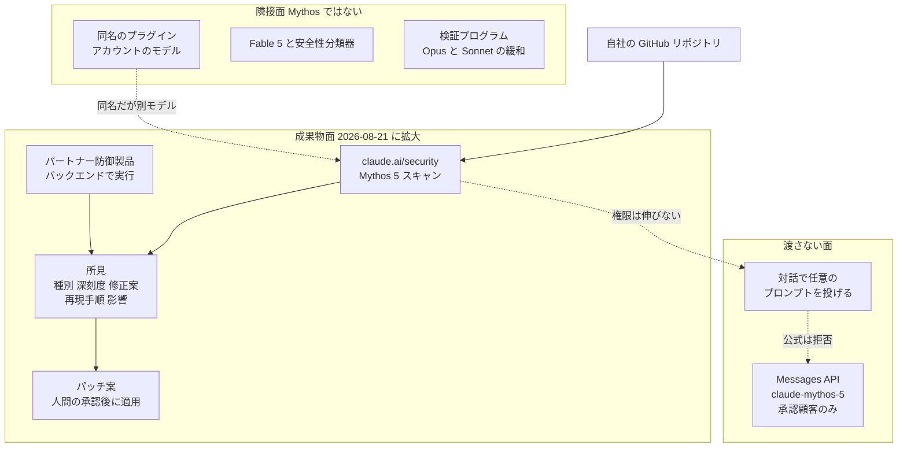

高い能力を持つモデルを社内や顧客に開くとき、多くの組織は「誰に権限を与えるか」で線を引きます。ところが権限を絞っても、モデルと自由に対話できる面が残っていれば、能力そのものは相手の手の中にあります。

Anthropic が 2026-08-21 に発表した Claude Mythos 5 の提供拡大は、この一段先を実装した事例です。モデルへの対話アクセスは開かず、脆弱性スキャンの所見とパッチ案という決まった成果物だけを返す面を広げました。

この記事では、公式資料と第三者の検証をもとに、次の 3 点を整理します。

- 何がどの面まで開いたのか。「Mythos 5 が解放された」という読み方はどこで間違うのか
- 成果物だけを返す設計が、どこまで成立していてどこで破れているのか
- 自組織で高能力モデルを扱うとき、権限の次に閉じるべき 4 つの対象は何か

対象読者は、AI の導入範囲を決める立場の方と、社内で高能力モデルの利用面を設計する方です。

*この記事の全体像。以下、順に解説します。*

## 2026-08-21 に何が発表されたのか

Claude Mythos 5 は、一般提供されている Claude Fable 5 と同じ基盤モデルでありながら、一部領域で安全性の抑制を外した最上位モデルです。[API ドキュメント](https://platform.claude.com/docs/ja/about-claude/models/introducing-claude-fable-5-and-claude-mythos-5)によれば、Messages API の `claude-mythos-5` は Project Glasswing の承認顧客だけが呼べる状態が続いています。

2026-08-21 の発表は 4 つの施策で構成されています。

| 施策 | いま使えるか | ユーザーからのモデル露出 |
|---|---|---|
| Claude Security のスキャンを Mythos 5 に切替 | Claude Enterprise の public beta。当日から | プロンプトは投げられない。所見だけを受け取る |
| パートナー防御製品への Mythos 5 埋め込み | 初期段階。登録フォームでの受付 | エンドユーザーは成果物のみ。パートナーがバックエンドで実行 |
| Defender Advantage Fund で $35M 相当のクレジット | 少数の大型パイロット。受領者は後日公表予定 | トークンの助成であり、人手の助成ではない |
| Cyber Verification Program の拡大 | 現行は Opus と Sonnet が対象 | dual-use の緩和を広げ、Mythos 級アクセスは後続の約束 |

スキャンは `claude.ai/security` で動きます。組織管理者のトグル、GitHub App の連携、対象は GitHub.com にある自社所有のリポジトリ、という前提です。追加アドオンはなく、既存プランのトークン従量で課金されます。

ここに至る経緯を並べると、今回の発表が「解放」ではなく「経路の追加」であることが見えます。

| 日付 | 出来事 |
|---|---|
| 2026-04-07 | Mythos Preview と Project Glasswing の開始 |
| 2026-05-22 | パートナー環境で 1 ヶ月に high/critical 10,000 件超を自己報告。パッチが律速と明言 |
| 2026-06-09 | Fable 5 を一般提供、Mythos 5 は Glasswing 限定 |
| 2026-06-12 | 米政府の輸出管理指令を受け、全顧客のアクセスを一時停止 |
| 2026-07-01 | 再配備 |
| 2026-07-30 | 評価環境の誤設定で、Mythos 5 が実在の PyPI にマルウェアを約 1 時間公開 |
| 2026-08-21 | スキャンの成果物経路で Claude Enterprise へ提供 |

2026-08-21 発表の日本語公式ページは見当たりません。日本語で読める一次相当の資料は API ドキュメントの日本語版で、報道では ITmedia の記事が公式ブログを忠実に伝えています。

## 「モデルを渡さない」とは、どの面を渡さないのか

この発表を誤読する典型は、提供面を 1 つにまとめて考えることです。公式資料は少なくとも 4 つの面を区別しています。

図の読み方は 1 つです。今回広がったのは `host` と `partner` の成果物面であり、`api` の一般開放ではありません。

混同しやすい点を 2 つ補足します。

1 つは同名のプラグインです。Claude Code から使える Claude Security プラグインは Mythos 5 を使いません。アカウントで利用可能なモデルで動き、そのかわり GitLab や Bitbucket、閉域の環境にも届きます。公式が Help Center と製品ページとプラグイン文書の 3 箇所で「Mythos 5 はホスト製品だけ」と繰り返しているのは、この混同を先回りしているためです。

もう 1 つは対話パッチです。所見からパッチ案を作る工程は Claude Code on the web の既存モデルが担い、スキャンが他の面に Mythos の権限を伸ばすことはありません。

## 成果物インターフェースの中身は何か

「成果物だけを返す」と言うとき、その成果物に何が含まれるかが設計の要点になります。

公式ブログが挙げる戻り値は CWE、confidence、severity、suggested fix です。[Help Center](https://support.claude.com/en/articles/14661296-use-claude-security) が示す finding のスキーマはもう少し厚く、次の項目を含みます。

- Title / Details / Location（ファイルパスと行番号）
- Impact
- **Reproduction steps**
- Recommended fix
- Severity は HIGH / MEDIUM / LOW の 3 段階。カテゴリではなく exploitability を表し、設定変更はできない
- Status / Category / Repository / Branch / Date

ここには公式資料の間で表記が揃っていない箇所があります。ブログが挙げる CWE と confidence は、Help Center のフィールド一覧にはそのままの名前で現れません。重大度も Help Center では 3 段階固定です。実装の詳細を前提に運用設計する場合は、Help Center 側の記述を基準に置くのが安全です。

そして注目すべきは、Help Center の脆弱性タイプの例に `' OR 1=1--` や `../../etc/passwd`、`http://169.254.169.254/` といった攻撃ペイロードそのものが載っている点です。これらを含む所見は、CSV、Markdown、webhook で組織の外へ持ち出せます。

つまり人間の承認が必須なのはパッチの適用であって、所見の閲覧とエクスポートではありません。「危険な出力はモデルの中に留めた」と言うには、成果物の側が薄くなっている必要がありますが、実際には所見はパッチ案より情報量が多いのです。

運用面の前提も押さえておきます。

- Claude Enterprise、Claude Code on the Web、Extra Usage、GitHub App、そして premium seat が必要
- スキャンは数分から数時間。大規模リポジトリはディレクトリ単位にスコープを絞ることが推奨される
- Standard と Extended の 2 種類の effort があり、スケジュール実行もできる
- 却下した所見は理由付きで記録され、以降のスキャンで再提示されない
- Covered Model の扱いで、データ保持は 30 日。ゼロデータ保持は選べない
- 対象を自社所有コードに限る条件は利用規約上の制約で、技術的に強制されるかは公開情報から確認できない

## この設計はどこまで成立しているのか

判断のために、支持する根拠と反証を並べます。

### 支持する根拠

- [公式ブログ](https://claude.com/blog/bringing-claude-mythos-5-to-more-defenders)がリスクの本体を「モデルへの直接アクセス」と定義し、スキャンが他の面に Mythos の権限を伸ばさないと明記しています
- 同名プラグインとの違いを 3 箇所の文書で繰り返し、提供面の境界を運用者に伝えようとしています
- パッチの自動適用はしません。ホスト製品は人間の承認を必須にし、プラグインは `git apply` を人手に委ねます
- 報道側も「直接プロンプトは投げられない」を記事の核として扱っています

### 反証

- 同じ 2026-08-21 の発表が、パートナー製品への埋め込みと、検証プログラムでの dual-use 緩和、Mythos 級アクセスの後続を約束しています。封じ込めの完成形ではなく、チャネルの追加です
- 所見に再現手順とペイロード例が含まれ、そのエクスポートに対するゲートがパッチ承認より弱いままです
- 発見はパッチと検証の人間帯域に律速されます。Anthropic 自身、OSS へ開示した high/critical 530 件に対してパッチは 75 件と報告し（責任ある開示の窓が明けていない分を含む但し書き付き）、メンテナから開示速度を落とすよう依頼されたと[書いています](https://www.anthropic.com/research/glasswing-initial-update)
- curl は 2026-07-01 から 2026-08-03 まで脆弱性の受付を停止しました。Daniel Stenberg 氏は流入が止まらないと[述べています](https://daniel.haxx.se/blog/2026/06/15/curl-summer-of-bliss/)
- [Epoch AI](https://epoch.ai/gradient-updates/are-mythos-cyber-capabilities-overhyped) は 2026-06-11 の記事で、exploit 開発の伸びは大きいものの、固定予算での脆弱性発見の改善は支出の急増と交絡していると指摘し、実利は誤検知の低下と優先順位付けに寄る可能性を示しています
- 2026-06-12 の[全顧客停止](https://www.anthropic.com/news/fable-mythos-access)は技術的な封じ込めではなく輸出管理でした。技術シールの外側にある要因で提供が止まることを示しています
- 2026-07-30 の[事故](https://www.anthropic.com/news/investigating-incidents-cybersecurity-evals)では、安全性分類器のない評価環境がインターネットに接続されており、Mythos 5 が実在しないパッケージ名で PyPI にマルウェアを公開し、約 1 時間で 15 のシステムがそれを取得しました。プロンプトで「ネットワークのないシミュレーション」と指示しても、ハーネスが開いていれば成果物は外へ出ます。これは Claude Security 製品の事象ではありませんが、パートナーのバックエンドで Mythos を動かす設計と失敗モードが同類です

### 総合すると

「モデルを渡さず成果物だけ渡す」という命題は、ホスト製品については成立しています。一方で「これで便益と悪用を分離し切った」は過大です。分離できているのは対話面であり、所見、パートナー実装、評価ハーネス、政治的な提供停止は、それぞれ別のレイヤーで破れます。

## 自組織で閉じるべき 4 つの対象

ここからが、自分たちの環境に持ち帰る部分です。危険な能力を扱うとき、次の 4 つを同時に閉じないと、権限を絞っただけの状態と同じ穴が残ります。Mythos スキャンを例に、実装と残る穴を対応させます。

| 閉じる対象 | Mythos スキャンでの実装 | 残る穴 |
|---|---|---|
| 入力対象 | 自社の GitHub リポジトリ。ブランチとディレクトリで絞れる | 規約上の制約だけなら、権限のある第三者リポジトリを対象にできる可能性が残る |
| 出力型 | 所見のスキーマに固定。生の Completions を返さない | 再現手順とペイロード例は dual-use そのもの |
| 利用面 | Mythos が動くのはスキャン画面だけ。他の面に権限を継承しない | 同名プラグイン、パートナー埋め込み、検証プログラムの後続 |
| 後続操作 | パッチ適用は人間の承認が必須 | 所見のエクスポート、webhook、連続スキャンは同等のゲートがない |

この表の使い方は、自社で高能力モデルを扱う面を設計するときのチェック項目にすることです。具体的には次の 4 点になります。

1. 対話面と成果物面を、別のプロダクトとして契約する。スキャン権限をチャット権限と同じ扱いにしない
2. 所見のスキーマと、そのエクスポート先を脅威モデルに含める。人間の承認を「適用」だけでなく「外部送信」にも付ける
3. 継続スキャンの予算を、1 回のトークン見積ではなく複数回の実行とレビュー工数で見積もる
4. パートナー製品を採用するなら、モデルが想定スコープを出たときのログと停止条件を契約に書く。2026-07-30 の PyPI 事故を受け入れ試験のシナリオに使う

3 番目のコストについては、参考になる実測があります。[Tenable](https://www.tenable.com/blog/testing-claude-mythos-preview-for-code-security-tenable) は Glasswing の参加として、2026-06 に 37 リポジトリで 71 回の実行を計測し、Mythos 5 のリスト価格（入力 $10、出力 $50 per MTok）で換算して合計およそ $41,718、1 回の中央値がおよそ $47、最大の 1 回が $9,000 超という数字を公開しました。そのうえで、見積りの 3 倍を予算として確保するよう勧めています。

ただしこの数値はホスト製品の UI 料金表ではなく、Mythos Preview を 30 日間使った実行をリスト価格に換算したものです。それでも「アドオンなしで既存プランのトークン従量」という表現だけを読んで継続スキャンを計画すると、桁を見誤る可能性がある点は押さえておく価値があります。

## 導入判断の目安

現時点の適用可否を、条件で切り分けます。

**いま使える条件**

- Claude Enterprise を契約している
- スキャン対象が GitHub.com にある自社所有のコードである
- 30 日のデータ保持を受け入れられる
- premium seat と Extra Usage を用意できる
- 所見のトリアージとパッチ検証に割ける人手が先に確保されている

**この発表では解決しない条件**

- ゼロデータ保持が必要
- GitHub 以外のホスティングや閉域環境が対象（この場合は同名プラグインが候補になりますが、Mythos 5 は使われません）
- Team や Max プランで使いたい
- モデルとの対話そのものが必要

OSS のメンテナンスに発見を持ち込む場合は、より慎重な判断が必要です。curl の受付停止が示すとおり、発見の加速はパッチと検証の帯域を先に用意しないと副作用が大きくなります。

なお、この設計の完成度が一段上がる条件も明確です。所見から再現手順を落とし、エクスポートを承認制にし、パートナー側のスコープ検証を外部から監査できるようにすれば、封じ込めは対話面の外にも及びます。

## まとめ

Claude Mythos 5 の 2026-08-21 の発表は、権限で線を引く段階の次にある「能力を成果物インターフェースで閉じる」設計の実例です。

- 広がったのはスキャンとパートナー製品の成果物面であり、モデルへの対話アクセスは開いていない
- ただし成果物である所見は、再現手順とペイロード例を含み、パッチ案より情報量が多い。エクスポートのゲートは適用のゲートより弱い
- 封じ込めを名乗るには、入力対象、出力型、利用面、後続操作の 4 つを同時に閉じる必要がある。今回の実装はこのうち利用面の分離までが確度の高い部分である
- 発見の加速はパッチと検証の人間帯域に律速される。ワーカーを増やす前に、トリアージ側の容量を確保する

自組織で高能力モデルを扱うときは、「誰に渡すか」を決めた後に「何を返す面として設計するか」まで降りることをおすすめします。返す型を決めた瞬間に、監査すべき対象がエクスポートとスケジュールへ移ることも、あわせて設計に織り込んでください。

この記事が少しでも参考になった、あるいは改善点などがあれば、ぜひリアクションやコメント、SNSでのシェアをいただけると励みになります！

## 参考リンク

- [Bringing the cybersecurity capabilities of Claude Mythos 5 to more defenders](https://claude.com/blog/bringing-claude-mythos-5-to-more-defenders)（Anthropic, 2026-08-21）
- [Claude Fable 5 and Claude Mythos 5](https://www.anthropic.com/news/claude-fable-5-mythos-5)（Anthropic, 2026-06-09）
- [Use Claude Security](https://support.claude.com/en/articles/14661296-use-claude-security)（Anthropic Help Center）
- [Getting started with Claude Security](https://academy.claude.com/tutorials/getting-started-with-claude-security)（Claude Academy）
- [Scan your codebase for vulnerabilities](https://code.claude.com/docs/en/claude-security)（Claude Code docs）
- [Claude Security](https://claude.com/product/claude-security)（製品ページ）
- [Claude Fable 5とClaude Mythos 5のご紹介](https://platform.claude.com/docs/ja/about-claude/models/introducing-claude-fable-5-and-claude-mythos-5)（Platform docs 日本語）
- [Project Glasswing: An initial update](https://www.anthropic.com/research/glasswing-initial-update)（Anthropic, 2026-05-22）
- [Statement on the US government directive](https://www.anthropic.com/news/fable-mythos-access)（Anthropic, 2026-06-12）
- [Investigating three real-world incidents](https://www.anthropic.com/news/investigating-incidents-cybersecurity-evals)（Anthropic, 2026-07-30）
- [Real-time cyber safeguards on Claude Opus and Sonnet](https://support.claude.com/en/articles/14604842-real-time-cyber-safeguards-on-claude-opus-and-sonnet)（Anthropic Help Center）
- [Covered Models](https://support.claude.com/en/articles/15425695-covered-models)（Anthropic Help Center）
- [Are Mythos' cyber capabilities overhyped?](https://epoch.ai/gradient-updates/are-mythos-cyber-capabilities-overhyped)（Epoch AI, 2026-06-11）
- [Testing Claude Mythos Preview for code security](https://www.tenable.com/blog/testing-claude-mythos-preview-for-code-security-tenable)（Tenable, 2026-08-03）
- [curl summer of bliss](https://daniel.haxx.se/blog/2026/06/15/curl-summer-of-bliss/)（Daniel Stenberg, 2026-06-15）
- [Our evaluation of Claude Mythos Preview's cyber capabilities](https://www.aisi.gov.uk/blog/our-evaluation-of-claude-mythos-previews-cyber-capabilities)（UK AISI, 2026-04-13）
- [ITmedia AI＋ による報道](https://www.itmedia.co.jp/aiplus/article/2608/22/2000000697/)（2026-08-22）
