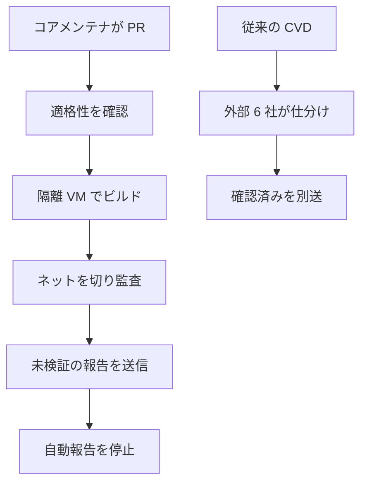

Anthropic は 2026-10-08 に、オープンソース向けのオプトイン脆弱性スキャン OSS Scanner を公開しました。参加したプロジェクトには、モデルが生成した検出結果が届きます。この記事では、何が届くか、登録の形、人手の coordinated vulnerability disclosure（CVD）との違い、参加前に書いておく判断をまとめます。

*この記事の全体像。以下、順に解説します。*

## OSS Scannerとは

OSS Scanner は、参加を選んだオープンソースプロジェクトへ、Anthropic のモデルによるスキャン結果を届けるサービスです。料金はゼロです。届く報告は、モデルが生成したままです。送付前の人手確認は、この経路の手順に含まれません。

対象として書かれているのは、インフラと利用者の安全に効く、確立したオープンソースプロジェクトです。リモート攻撃への露出と、利用者や依存プロジェクトの数が考慮されます。登録は、コアメンテナが GitHub の `anthropics/oss-scanner` へ設定ファイルの pull request を出すことです。採否は、Google の OSS-Fuzz に近い基準で、案件ごとに決まります。

人が確認した報告は、従来の CVD として別経路で続きます。OSS Scanner に参加したあとも、人手の CVD は残ります。参加をやめると、未検証の自動報告は止まり、人手の CVD だけに戻ります。

初回スキャンのあと、前回以降に入った欠陥と、前回見逃した欠陥を繰り返し探します。間隔の数値は公開されていません。FAQ は、間隔が参加プロジェクトの数とパイプラインの混み具合で変わり得る、と書いています。

1 件の報告には、自己完結の再現手順と説明が入ります。可能なときは、欠陥が入った時点を二分法でたどります。候補パッチがあるときは、それも付きます。FAQ は、パイプラインに欠陥の再確認、パッチ案、原因分析をするエージェントが含まれる、と書いています。この再確認は人手ではありません。

未検証の所見には、90 日の開示期限は付きません。FAQ は、偽陽性が混ざり得るため、自分たちがまだ読んでいない所見を、保守者へ注意深く読むよう強制するのは妥当でない、と書いています。README は、これらの所見を公開しない、と書いています。あとから人手で確認した報告は、その確認を通知した日から、既存 CVD の 90 日に乗り得ます。将来、一部の高重大度に開示期限を付けるときは、予告があり、プロジェクトは離脱できます。

保守者は `threat_model.md` で、敵対的な入力、対象外、重大度の表、報告とパッチの形、重複の粒度を指示できます。必須の節はありません。FAQ は、省略時の既定パスを対象リポジトリの `.oss-scanner/threat_model.md` と書いています。ファイルが無いとき、スキャナは隅の扱いを推測する、とも書いています。検証スクリプトは、そのキーも隣のファイルも無くても受理します。

連絡先メールは、公開リポジトリに残ります。README は、公開されてよいアドレスを使え、と書いています。OpenPGP 公開鍵を置くと、報告は暗号化され、宛先は主連絡先だけになります。暗号化と CC の併用はできません。

ビルドは、隔離した VM の中で、ネットワーク付きで行います。その後の監査は、インターネットを切った状態で行います。依存とテストに要るものは、ビルドの段階で取り込み終えます。

条項は、報告を現状有姿とし、参加者が確認する前に変更しない責任を参加者へ置いています。パッチは不完全であったり、機能を壊したりし得ます。責任の上限は 1,000 米ドルです。Anthropic は承認を撤回でき、サービスをいつでも終えられます。

隣の製品として、企業向けの Claude Security、脆弱性対応向けの Claude for OSS（Claude Max 20x の無償枠）、資格を満たす専門家向けの Cyber Verification Program があります。FAQ は、OSS Scanner を、オープンソースの監査を無償で行い、実験的でトークンを多く使うハーネスも使うもの、として対比しています。

登録から未検証の報告までの経路と、人手の CVD は別です。

外部 6 社は、台帳の About（2026-10-02）が Ada Logics、Anvil、Calif.io、Doyensec、Ophion Security、Trail of Bits と書いています。上の図で、この 6 社は OSS Scanner の自動報告の途中には入りません。人手の CVD の側です。

## 登録ファイルに書けること

`projects/<name>/` に置けるのは、リポジトリ URL、主連絡先、Dockerfile の位置、任意の脅威モデル、CC、ホームページ、公開鍵、停止フラグです。`cadence`、`budget`、`schedule`、`priority` などは運営側のキーで、`tools/validate.py` が拒否します。重大度や対象外の指示は、脅威モデルの自由文へ書きます。

ディレクトリ名は、先頭が英小文字か数字で、以降は英小文字、数字、`.`、`_`、`-` だけ、長さは 63 文字までです。`repo` は https の Git URL を 1 件だけ受け、`#` 以降にブランチかタグを 1 つ付けられます。`project.yaml` は 128 KiB までです。隣に置く Dockerfile、脅威モデル、公開鍵の本文は、それぞれ 64 KiB までです。秘密鍵のブロックは拒否されます。公開鍵と CC は同時に書けません。

2026-10-10 に GitHub API で見た main の `projects/` は 9 ディレクトリでした。bitcoin-core、botan、homebrew、libheif、nestjs、nss、nuclei、nvm、zmap です。同じ時点の PR 検索は、合計約 285、open 約 249、merged 10 でした。star は約 365 でした。リポジトリの作成は 2026-10-08、main の先端コミットは 2026-10-09 の libheif 登録マージでした。申請の多くは、この時点ではまだマージされていません。

## 三つの経路の違い

OSS Scanner、人手の CVD、OSS-Fuzz は、始まりも、送る前の確認も、開示の時計も違います。

| | OSS Scanner | 人手の CVD | OSS-Fuzz |
|---|---|---|---|
| 始まり | コアメンテナの PR | Anthropic が報告先を選ぶ | プロジェクトの PR |
| 中身 | モデルの出力 | 外部企業が再現した報告 | サニタイザが再現したクラッシュ |
| 送る前の人 | いない | 方針上は、原則としてセキュリティ研究者が確認する | クラッシュの再現は機械が行う |
| 開示 | 未検証には 90 日を付けない。あとから人が確認したら、通知日から 90 日 | 方針（2026-03-06）は原則 90 日。パッチ後は詳細公開まで原則 45 日 | 修正の確認か 90 日の早いほうで公開 |
| 量の調整 | 受け手が `disabled: true` かディレクトリ削除で止める | 方針は、大量提出の前にペースを合意する。活発に悪用されているものは例外 | 見つかったクラッシュを起票する |
| 費用 | 無償 | 受け手の費用は無い | 無償 |

CVD 方針（2026-03-06）は、送る報告は原則として人が確認したものである、と書いています。OSS Scanner は、オプトインしたプロジェクトに限って、この原則の外へ未検証の束を出します。参加は、ペース合意の代わりに、自分で止める操作を受け入れることになります。

OSS-Fuzz FAQ は、1 入力が約 25 秒、または 2.5 GB の RAM を超えると、timeout か OOM の不具合として扱う、と書いています。これはファジング対象の上限です。OSS Scanner の実行上限として、開いた公式面に同じ数値はありません。

## 注意点

発表文（2026-10-08）は、過去 6 か月で候補が 29,000 件を超え、人手で仕分けられたのは約 6,000 件、求めに応じて未検証のまま送った報告は 5,000 件近い、と書いています。リンク先の台帳は、最終更新が 2026-10-02 19:47 UTC で、表示中の発見日は 2025-11-01 から 2026-10-02 です。この窓は 6 か月より長いです。29,439 件を、ちょうど 6 か月の件数とは読みません。スナップショットは発表日の 6 日前です。

件数は、次の四つの見出しに分けて読みます。候補、人が見た真陽性、報告、パッチです。92.7% と 88% は、この四つの精度としては使いません。

| 段 | 件数（2026-10-02） | 読み方 |
|---|---:|---|
| 候補 | 29,439 | トリアージ前のクラッシュや仮説。Mythos Preview 以外の Claude も含む |
| 外部企業がレビュー | 6,123 | 発表の「人手で約 6,000」に最も近い段 |
| 真陽性 | 5,674 | レビュー済み 6,123 の 92.7%。重複と won't fix を含む |
| 企業経由で保守者へ報告 | 1,333 | 確認済みのうち、まだ送っていないものがあると本文が書く |
| 直接報告 | 4,824 | 独立チェックなし。偽陽性を含み得る。発表の「約 5,000」に最も近い段 |
| 報告の合計 | 6,157 | 1,333 と 4,824 の和。591 プロジェクト |
| 保守者が応答 | 5,103 | 応答であって、修正約束ではない |
| upstream のパッチ | 516 | 報告のあとに修正が入った数。配布まで広まったことは含まない |
| 識別子 | 584 | CVE 219 と GHSA 365 の和。1 件の発見が両方を持つことがあり、発見件数ではない |

92.7% は、台帳自身が表示している割合です。人が見た集合の中の「実在」の割合であり、候補 29,439 件の精度ではありません。won't fix は、脅威モデルの外や、通常は到達しないコードでも、実在なら分子に入ります。保守者が直す割合ではありません。

OSS Scanner 自身の初期サンプルは、別の数です。発表は、CVD を見るペンテスト担当が、初期スキャナの重大と高を 48 プロジェクトから 97 件見た、と書いています。85 件が CVD の基準を満たしました。発表はこの 85/97 を 88% と書いています。残り 12 件のうち 11 件は実在ですが、既知かスキャン内の重複でした。無効は 1 件でした。母集団は重大と高だけで、確認者は自社の CVD 担当です。全件の偽陽性率ではありません。発表は続けて、重大度が過大なことと、脅威モデルの取り違えを、保守者から言われたと書いています。

wolfSSL の「74 件中、無効は 2 件、CVE になったのは 5 件」は、発表文が掲載した Todd Ouska の引用です。台帳の集計とは別です。PostgreSQL、OpenSSL、HotCRP、curl の文も、同じ発表が選んで載せた引用です。原発言の独立確認はしていません。

CyberGym の「昨年初は 20% 未満、今年は 85% 超」は、発表文の文です。引用された論文 arXiv:2506.02548 の v3 アブストラクト（2026-03-24）は、1,507 件、188 プロジェクト、当時の最高でも約 20%、と書いています。課題は、脆弱性の説明文とコードから、その脆弱性を再現する PoC を作ることです。未知の欠陥を、説明なしで見つける課題ではありません。Glasswing のページは、同じ CyberGym で Mythos Preview 83.1%、Claude Opus 4.6 66.6% と書いています。85% 超の内訳（モデル、難易度、日付）は、発表文にはありません。論文の実験表までは、アブストラクトと該当段落以外は照合していません。

AInformation は 2026-10-09 14:21 時点で、申請 PR 57 件、マージ 0 件、と書きました。2026-10-10 の GitHub API では main に 9 プロジェクトがあり、merged の検索結果は 10 件でした。初日の観測として残り、現在の受理数ではありません。

公開資料の範囲では、次は一次情報として見つかっていません。候補パッチをそのままマージして本番が壊れた、という保守者の事故報告。OSS Scanner の公開後に、参加を断ったプロジェクトの公式声明。スキャン間隔の実測値。

ほかに、公開資料だけでは閉じていない問いがあります。

- 再スキャンの実間隔と、1 回のメールに入る件数。公式の数値はありません。
- 脅威モデルのキーを省略したとき、実行時に対象リポジトリの `.oss-scanner/threat_model.md` を読むか。FAQ は既定パスと書いています。`validate.py` はそのパスの有無を検査しません。
- 2026-10-08 以降に、台帳の 516 件と 6,157 件がどう動いたか。読んだ最終更新は 2026-10-02 です。
- CyberGym の「85% 超」が、どのモデルの、どの難易度の、いつの点数か。
- 参加 9 プロジェクトが、脅威モデルをリポジトリ側に置いたか。公開の `projects/` だけでは、置いていないことと、非公開リポジトリに置いたことを区別できません。
- CVE-2026-92392 の出所。詳細公開は 2026-10-14 と curl プロジェクトが書いています。それより前に中身を推測しません。

## 参加前に決める四つのこと

FAQ は、検証済みの高と重大をすでに処理できていて、さらに守りを厚くしたいプロジェクト向け、と書いています。その条件を満たすときに、脅威モデルへ次を書いてから参加します。

1. 再現の場。どのブランチをビルドし、どの入力を敵対的と見るか。README は、オフラインのイメージの中でテストが通ることを勧めています。`tools/check` はその確認用で、イメージへ Claude Code を入れます。`--qemu` は Linux の x86-64 向けです。
2. 重複の粒度。既知の issue、同じ束の中の繰り返し、既存のファザー報告を、どこまで同一とみなすか。97 件のサンプルでも、実在した 11 件は既知かスキャン内の重複でした。
3. 重大度の表。認証後の欠陥、メモリ破壊、サービス停止を、自プロジェクトではどの段にするか。モデルの critical や high は仮のラベルとして受け、表で引き直します。
4. 担当。誰が一次判定をし、誰が修正するか。判定が追いつかなくなったら、`disabled: true` で自動報告を止めます。人手の CVD は残ります。

届いた 1 件は、再現、重複、重大度の引き直し、担当、の順に流します。候補パッチは、テストのあとに採ります。条項は、確認前の変更を参加者の責任とし、パッチが機能を壊し得ると書いています。

未検証の再現手順は、公開の issue へそのまま貼りません。README は未検証の所見を公開しないと書き、条項は修正か公開まで合理的な機密を求めています。戻しの感想は、報告メールへの返信が公式の入口です。

主連絡先は公開されます。個人のアドレスではなく、公開されてよい別名を使います。

## 余力があるときだけ参加を検討する

参加を検討してよいのは、余力があるプロジェクトだけです。脅威モデルと、前節の四つの決定を書いてから pull request を出し、モデルの重大度と候補パッチは仮として扱います。余力が無いプロジェクトは参加しません。

この線を支える公式の記述は、次のとおりです。

- FAQ は、報告にすでに追われているプロジェクトには向かない、と書いています。
- 条項は、誤り、重大度の誤判定、壊れるパッチ、確認前の変更を、参加者の負担として書いています。
- 台帳は、報告 6,157 件に対して upstream パッチ 516 件（2026-10-02）です。応答 5,103 件は、修正 516 件より多いです。検出と修正は別の段です。
- 脅威モデルと `disabled` は、受け手側の制御として公式にあります。頻度と予算は受け手のキーではないので、制御は「何を欠陥とみなすか」と「止める」に寄ります。

同じ線を、そのまま期待値にしない材料もあります。

curl の Daniel Stenberg は 2025-07-14 に、2025 年の報告は週におおよそ 2 件、その約 20% が AI のスロップ、7 月上旬の時点で本物の脆弱性は 2025 年の提出の約 5%、と書いています。2026-04-22 には、スロップは主問題ではなくなり、確認される割合は 2024 年の水準である 15〜16% 程度まで戻った、頻度は 2025 年の約 2 倍、2026 年の CVE は 50 件に近づき得る、と書いています。2026-05-26 には、1 日あたり 1 件を超える、品質は高い、リリース周期の半分の時点で確認済みが 12 件、と書いています。同じ記事は、ここ数年の curl の脆弱性は低か中で、高は 2023-10 の CVE-2023-38545 が当時の最新、とも書いています。負荷は「偽物を捨てる作業」から「本物を直す作業」へ移った、という本人の記述です。

同じ保守者は 2026-05-11 に、curl への最初の Mythos スキャンを書いています。モデルは確認済み脆弱性 5 件としました。curl のセキュリティチームは、数時間見たあと 1 件の低重大度だけを残しました。3 件は文書化された API の範囲で偽陽性、1 件は脆弱性ではない不具合、としました。ほかにおおよそ 20 件の不具合があり、偽陽性は少なかった、とも書いています。本人は、この 1 リポジトリについては、危険さの宣伝ほどの段差は見えなかった、と結論しています。硬化済みのコードでは、97 件サンプルの「無効 1 件」をそのまま期待しません。

2026-10-07 の curl 記事は、2026-10-14 の curl 8.23.0 で高の CVE-2026-92392 を公開する、詳細はそれまで出さない、ほかに深刻でない修正が 21 件、と書いています。OSS Scanner 由来とは書いていません。2026-10-08 の Anthropic の引用は、スキャナが curl の近年で最悪級の 1 件を含む複数の問題を見つけた、と Stenberg の言葉として載せています。二つの文章を、同じ 1 件だとは結びません。2026-05-26 の「高は 2023-10 が最新」は、2026-10-07 の予告で本人が更新しています。

注意点で分けた 97 件の 88% と、台帳の 92.7% は、どちらも、人がすでに深刻そうだと見た集合に寄っています。OSS Scanner がこれから送る束は、その選別の前です。直接報告 4,824 件は、偽陽性を含み得る、と台帳がラベルしています。オプトインは、この直接報告を定常化します。

肯定的な引用は、発表が選んだものです。余力の証明にはなりません。curl の 2026-05-26 の記事は、フルタイムで週 50 時間を curl に使っている本人が、報告の処理で生活時間を心配された、と書いています。

検証済みの高と重大を、いまの人員で遅延なく閉じているプロジェクトだけが、参加を検討します。参加するなら、再現の場、重複の粒度、重大度の表、担当を、脅威モデルに書いてから PR します。届いた束は、モデルの重大度と候補パッチを仮として、再現、重複、重大度、担当の順に流します。公開トラッカーへは、直したあとに識別子 `ANT-2026-` をコミットメッセージへ残す、という公式の謝辞の形だけを出します。

次のどれかなら参加しません。検証済みの高と重大だけで遅れている。脅威モデルを文章にできない。公開してよい連絡先が無い。候補パッチをレビューなしでマージする運用しか無い。

止めたくなったら、設定の `disabled: true` か、`projects/<name>/` の削除で自動報告を止めます。人手の CVD は残ります。

## まとめ

OSS Scanner は、コアメンテナが設定を pull request し、採択されたプロジェクトへ、モデルが生成したままの検出結果を届けるオプトインです。未検証の所見に 90 日の開示期限は付かず、人が確認した報告だけが従来の CVD に戻ります。受け手側の制御は、脅威モデルと、`disabled: true` またはディレクトリ削除による停止です。頻度と予算は受け手のキーではありません。

発表の 92.7% と 88% は、人がすでに見た集合の話です。候補 29,439 件の精度でも、これから届く未検証の束の精度でもありません。件数は、候補、人が見た真陽性、報告、パッチに分けて読みます。2026-10-02 の台帳では、報告 6,157 件に対して upstream パッチは 516 件です。

参加を検討するのは、検証済みの高と重大を遅延なく閉じる余力があるプロジェクトだけです。参加する前に、再現の場、重複の粒度、重大度の表、担当を脅威モデルへ書きます。モデルの重大度と候補パッチは仮です。公開の issue には、未検証の再現手順を貼りません。

この記事が少しでも参考になった、あるいは改善点などがあれば、ぜひリアクションやコメント、SNSでのシェアをいただけると励みになります！

## 参考リンク

- [Launching an opt-in vulnerability-finding service for open-source software](https://www.anthropic.com/research/launching-opt-in-vuln-finding-service-for-open-source)（Anthropic、2026-10-08）
- [OSS Scanner FAQ](https://red.anthropic.com/oss-scanner)
- [OSS Scanner Agreement](https://red.anthropic.com/oss-scanner/terms/)
- [Coordinated vulnerability disclosure dashboard](https://red.anthropic.com/2026/cvd/)（最終更新 2026-10-02 19:47 UTC）
- [About this dashboard](https://red.anthropic.com/2026/cvd/about/)
- [Coordinated vulnerability disclosure for Claude-discovered vulnerabilities](https://www.anthropic.com/coordinated-vulnerability-disclosure)（最終更新 2026-03-06）
- [Project Glasswing](https://www.anthropic.com/glasswing)（2026-04-07。ページ先頭に 2026-10-06 の案内）
- [CyberGym](https://arxiv.org/abs/2506.02548)（Wang et al., arXiv:2506.02548v3、改訂 2026-03-24）
- [OSS-Fuzz FAQ](https://google.github.io/oss-fuzz/faq/)
- [OSS-Fuzz architecture](https://google.github.io/oss-fuzz/architecture/)
- [anthropics/oss-scanner](https://github.com/anthropics/oss-scanner)（README、templates、`tools/validate.py`。メタデータは 2026-10-10 の GitHub API）
- [Death by a thousand slops](https://daniel.haxx.se/blog/2025/07/14/death-by-a-thousand-slops/)（Daniel Stenberg、2025-07-14）
- [High-Quality Chaos](https://daniel.haxx.se/blog/2026/04/22/high-quality-chaos/)（Daniel Stenberg、2026-04-22）
- [Mythos finds a curl vulnerability](https://daniel.haxx.se/blog/2026/05/11/mythos-finds-a-curl-vulnerability/)（Daniel Stenberg、2026-05-11）
- [The pressure](https://daniel.haxx.se/blog/2026/05/26/the-pressure/)（Daniel Stenberg、2026-05-26）
- [curl 8.23.0 の予告](https://daniel.haxx.se/blog/2026/10/07/)（Daniel Stenberg、2026-10-07）
