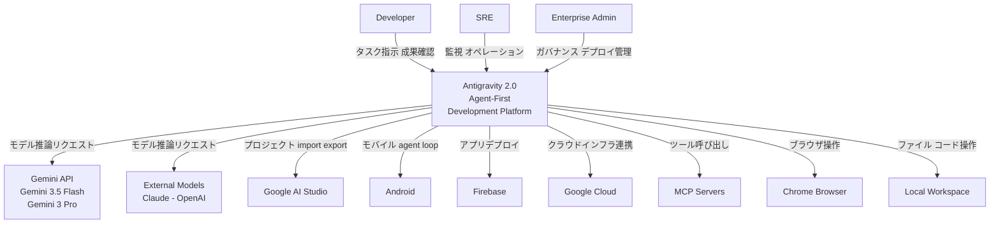
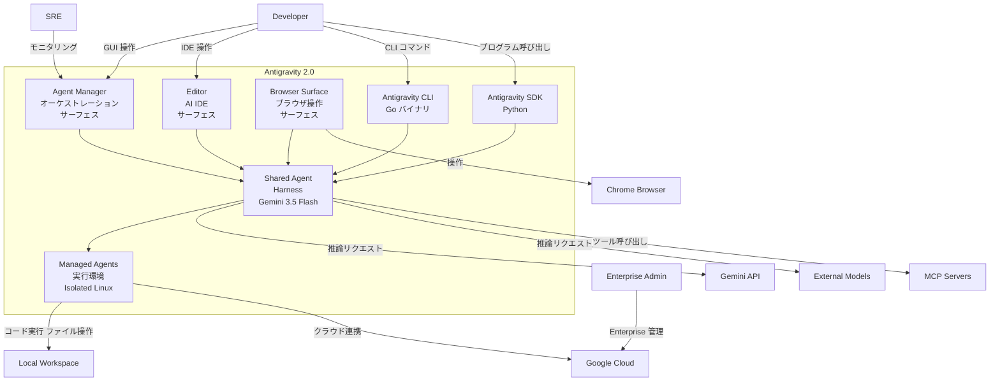
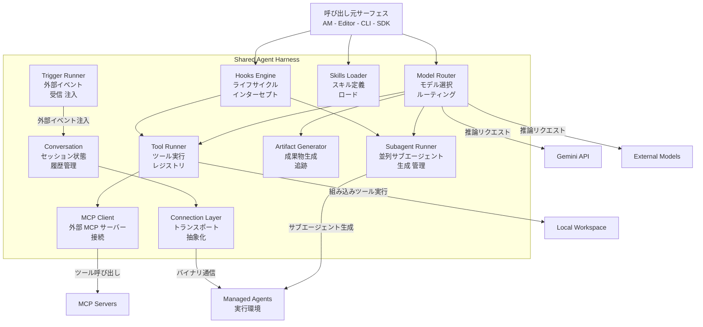
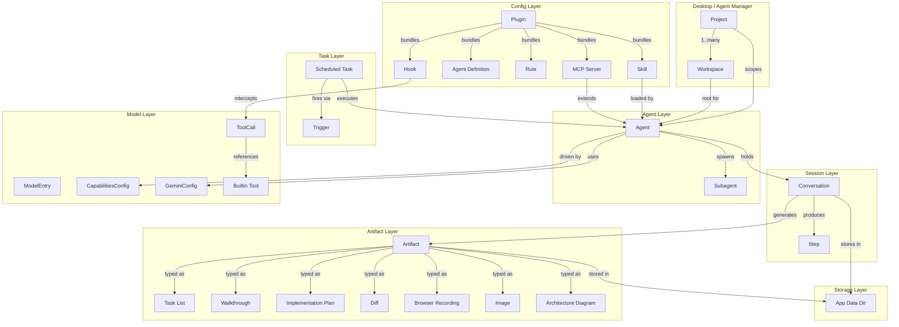
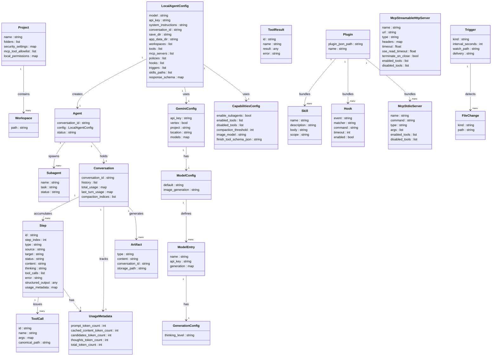

> 本記事は 2026-06-09 時点の調査です。対象は Google I/O 2026（2026-05-19 発表）の Google Antigravity 2.0 です。一次情報は公式ドキュメント（antigravity.google/docs）と Antigravity SDK Python（google-antigravity/antigravity-sdk-python）を中心に参照しています。

## 概要

Google Antigravity 2.0 は、2026年5月19日（Google I/O 2026）に発表された agent-first development platform です。

Antigravity 1.0（2025年11月公開）は、VS Code を基盤とした AI 搭載 IDE として登場しました。エディタに AI 補完とインラインコマンドを統合した、単一タスク実行型の製品です。

2.0 では設計思想が転換しました。IDE 単体から、standalone desktop app + CLI + SDK の三層プラットフォームへ進化しました。複数エージェントの並列オーケストレーション・非同期タスク管理・スケジュール実行を主軸に据えます。エージェントが editor / terminal / browser を横断して自律動作する前提の設計です。

全サーフェスは共有 agent harness で駆動します。デフォルトモデルは Gemini 3.5 Flash です。速度とコンテキスト効率を重視した選択です。

2.0 の設計には一貫した狙いがあります。エージェントの自律性が増すほど、人間にとっては「何をしたかを検証できること」が要になります。Antigravity はこの検証性（trust）を Artifacts（Task List・Implementation Plan・Walkthrough 等）で担保し、常時監視せずに並列エージェントを走らせる前提を成立させます。本記事では、この狙いを軸に構造・データ・運用を読み解きます。

### 1.0 から 2.0 への差分

| 項目 | Antigravity 1.0 | Antigravity 2.0 |
|---|---|---|
| 製品形態 | VS Code 派生 AI IDE（デスクトップ単体） | Desktop app + CLI + SDK の三層プラットフォーム |
| エージェント実行 | 単一・逐次 | 並列 subagent / 非同期タスク / スケジュール実行 |
| オーケストレーション UI | なし | Agent Manager（ノーコード視点のオーケストレーション） |
| CLI | なし（Gemini CLI が別途存在） | Antigravity CLI（Gemini CLI を置き換え。Go 製） |
| SDK | なし | Python SDK（`google.antigravity`） |
| デフォルトモデル | Gemini 3 Pro | Gemini 3.5 Flash |
| 対応モデル | Gemini 系 | Gemini / Claude / OpenAI（マルチモデル） |
| エンタープライズ | なし | Managed Agents（隔離 Linux 環境） |
| モバイル連携 | なし | AI Studio Android アプリ経由でのプロジェクト転送 |

### 関連技術・競合との比較

| 製品 | 製品形態 | エージェント実行 | 対応モデル | オーケストレーション | 料金 |
|---|---|---|---|---|---|
| **Google Antigravity 2.0** | Desktop app + CLI + SDK | 並列 subagent / 非同期 / スケジュール | Gemini 3.5 Flash（デフォルト）/ Claude / OpenAI | Agent Manager（GUI）+ SDK | Free / AI Pro $20/月 / AI Ultra $100/月（5x）/ $200/月（20x） |
| **Claude Code** | CLI（ターミナル起動） | 逐次（subagent は tool call 経由） | Claude 系（Anthropic 専用） | スクリプト・hooks で拡張 | Claude Pro/Max サブスクリプションで利用可。Console/API PAYG も別途 |
| **Cursor** | VS Code 派生 IDE | 逐次（Composer Agent） | GPT / Claude / Gemini 等（選択制） | なし | Hobby 無料 / Pro $20/月 / Ultra $200/月 / Teams $40/user・月 |
| **GitHub Copilot（Coding Agent）** | ブラウザ・IDE（GitHub 統合） | 逐次（タスクベース） | GitHub 管理モデル | PR/Issue 連動 | Copilot プランに包含 |
| **OpenAI Codex（ChatGPT）** | Web / API / CLI | 逐次（Responses API） | GPT 系（OpenAI 専用） | なし | 対象 ChatGPT プランに含まれる（Plus $20/月 等。上限はプラン別） |

競合各社の料金・プラン名は変動が速いため、最新は各公式の料金ページで確認してください。

技術的な比較ポイントは以下のとおりです。

- 並列 subagent: Antigravity 2.0 は単一セッション内で複数 subagent を並列起動します。Claude Code・Cursor・GitHub Copilot は逐次実行が基本です。
- モデル非依存性: Antigravity 2.0 は Gemini / Claude / OpenAI を切り替えます。Claude Code は Claude 専用、OpenAI Codex は GPT 専用です。
- SDK による拡張: Antigravity 2.0 は Python SDK でエージェントをプログラム制御します。他製品は IDE 拡張や API 経由が中心です。
- 料金モデル: 個人向け Free プランを持ちつつ、AI Ultra で高レート制限を提供します（$100/月=5x、$200/月=20x）。Claude Code の API 従量課金や Cursor の定額制と性格が異なります。

## 特徴

### Agent Manager

- ノーコードのオーケストレーションビューです。タスク起動・監視・artifacts 確認に特化したミニマル UI です。
- Editor（フル IDE）と独立したサーフェスとして提供されます。

### 並列 subagent

- 単一セッション内で複数の subagent を非同期に起動します。
- 複雑なタスクを並列委譲して開発速度を高めます。

### 非同期タスク管理

- エージェントが長時間タスクを非同期実行します。
- ユーザーは常時監視せずに artifacts で進捗を確認します。

### スケジュールタスク

- バックグラウンドで自動実行するタスクをスケジュールします。
- カスタム subagent ワークフローのスケジューリングにも対応します。

### Artifacts

- エージェントの出力を可視化する仕組みです。
- markdown / diff view / アーキテクチャ図 / 画像 / ブラウザ録画 / コード差分を含みます。
- 長時間の自律動作中に非同期で作業内容を伝達し、常時監視の必要を減らします。

### 音声転写

- デスクトップアプリで音声コマンドをテキストに変換してエージェントへ渡します。
- AI Studio Android アプリと連携し、モバイルで音声・テキストからプロトタイプを作成します。

### CLI（Antigravity CLI）

- Gemini CLI を置き換える新しいコマンドラインツールです。Go 製で高速です。バイナリ名は `agy` です。
- ターミナルから離れずエージェントを起動します。
- Plugin 構造（`~/.gemini/antigravity-cli/plugins/`）で skills / agents / rules / MCP サーバーを拡張します。
- hooks（PreToolUse / PostToolUse / PreInvocation）でエージェントの実行ループに介入します。

### SDK（`google.antigravity`）

- Python SDK でエージェントをプログラム制御します。
- `LocalAgentConfig` でモデル・ツール・capabilities を設定します。
- subagent 有効化・画像生成・会話の永続化と再開に対応します。

### Managed Agents（エンタープライズ）

- Gemini API が提供する隔離 Linux 環境でエージェントを実行します。
- 状態をターン間で保持する永続環境を備えます。

### Google エコシステム統合

- Google AI Studio・Firebase・Android との統合を標準提供します。
- AI Studio プロジェクトを、コンテキスト保持のままローカルの Antigravity へエクスポートします。

### マルチモデル対応

- デフォルトモデルは Gemini 3.5 Flash です。速度とコスト効率を重視します。
- Claude 系と OpenAI 系のモデルも選択します。

## 構造

### システムコンテキスト図



#### アクター

| 要素名 | 説明 |
|---|---|
| Developer | エージェントを起動し成果物を確認する開発者 |
| SRE | エージェント実行を監視・操作するサイトリライアビリティエンジニア |
| Enterprise Admin | ガバナンス・デプロイポリシーを管理するエンタープライズ管理者 |

#### 外部システム

| 要素名 | 説明 |
|---|---|
| Gemini API | デフォルトモデル Gemini 3.5 Flash と Gemini 3 Pro を提供する推論エンドポイント |
| External Models - Claude - OpenAI | マルチモデル対応のための外部 LLM エンドポイント |
| Google AI Studio | プロジェクトのプロトタイプ化・import/export に使うビジュアル環境 |
| Android | ネイティブモバイル向け agent loop を実行するプラットフォーム |
| Firebase | コンテキストスイッチなしにアプリをデプロイする Google バックエンド |
| Google Cloud | エンタープライズ向けクラウドインフラ・KMS・BigQuery を提供 |
| MCP Servers | Model Context Protocol 経由でツールを公開する外部サーバー群 |
| Chrome Browser | エージェントが操作する GUI ブラウザサーフェス |
| Local Workspace | エージェントが読み書きするローカルファイルシステム・コードベース |

### コンテナ図



#### Antigravity 2.0 内部コンテナ

| 要素名 | 説明 |
|---|---|
| Agent Manager | タスク起動・並列サブエージェント監視・成果物確認を担う no-code オーケストレーション UI |
| Editor | 単一ワークスペース向けのフル機能 AI IDE サーフェス |
| Browser Surface | エージェントが Chrome を操作するための IDE 外ブラウザ capability |
| Antigravity CLI | ターミナル・CI 向けのヘッドレス agent オーケストレーション Go バイナリ |
| Antigravity SDK | Python で agent harness にプログラムアクセスするライブラリ |
| Shared Agent Harness | 全サーフェスが共有する統一エージェントループ。Gemini 3.5 Flash 駆動 |
| Managed Agents 実行環境 | Gemini API 経由で起動される isolated Linux 環境。コード実行・永続化を担う |

### コンポーネント図



#### Harness 中核コンポーネント

| 要素名 | 説明 |
|---|---|
| Model Router | Gemini 3.5 Flash をデフォルトとし、Claude/OpenAI へのルーティングを担う推論ディスパッチャー |
| Subagent Runner | 複雑タスクを並列化するためのサブエージェントを動的に生成・管理するオーケストレーター |
| Tool Runner | Python callable を登録・実行するインプロセスツールレジストリ。sync/async 両対応 |
| Artifact Generator | markdown/diff/画像/ブラウザ録画など成果物を生成・追跡するコンポーネント |
| Hooks Engine | PreToolUse/PostToolUse/PreInvocation 等のライフサイクルイベントをインターセプトするポリシーエンジン |
| Skills Loader | プラグインディレクトリからスキル定義・エージェント定義・ルールをロードするコンポーネント |
| MCP Client | MCP サーバーに接続しツールを公開するアダプター |
| Trigger Runner | タイマー・ファイル変更等の外部イベントを受信し、Conversation にメッセージを注入するランナー。スケジュールタスク・非同期タスクの起動経路を担う |
| Conversation | セッション履歴・ターン追跡・コンテキスト圧縮インデックスを保持する状態管理レイヤー |
| Connection Layer | ハーネスとの通信を抽象化するトランスポートアダプター |

#### SDK 3 層アーキテクチャ

| 要素名 | 説明 |
|---|---|
| Agent（Layer 1） | 設定・フック・ポリシー・ツール・MCP ブリッジのライフサイクルを管理するエントリーポイント |
| Conversation（Layer 2） | 履歴・ターン追跡・使用量を提供するステートフルセッション |
| Connection（Layer 3） | ワイヤープロトコル・バイナリプロセス管理・アイドル管理を担うトランスポート実装 |

## データ

### 概念モデル



| 要素名 | 説明 |
|---|---|
| Project | 複数の Workspace を束ねる作業単位。セキュリティ・パーミッションを保持 |
| Workspace | 単一の作業ディレクトリ。Editor が対象とする |
| Conversation | 永続化されたセッション。conversation_id + save_dir で再開可能 |
| Step | エージェントの軌跡の 1 アクション |
| Task / Scheduled Task | 非同期・スケジュール実行の作業単位 |
| Trigger | Task を起動する外部イベント（cron / ファイル変更 等） |
| Artifact | エージェントが生成する成果物の総称（markdown ベース） |
| Task List | 進捗追跡用 artifact。action item を markdown リストで表現 |
| Walkthrough | 実装完了時に生成される変更要約 artifact |
| Implementation Plan | 計画モードで生成される技術設計 artifact |
| Diff | コード差分 artifact |
| Browser Recording | ブラウザ操作のスクリーンショット・録画 artifact |
| Image | 画像生成 artifact |
| Architecture Diagram | アーキテクチャ図 artifact |
| Agent | harness 駆動の AI 実行主体 |
| Subagent | enable_subagents=True で生成される並列委譲エージェント |
| Plugin | Skill / AgentDef / Rule / Hook / McpServer を束ねる配布単位 |
| Skill | SKILL.md を核とする再利用可能な手順書パッケージ |
| Agent Definition | CLI Plugin 内のサブエージェント定義 |
| Rule | エージェント行動を常時制約するガードレール |
| Hook | 実行ループの特定ポイントを傍受するスクリプト |
| MCP Server | Model Context Protocol サーバー設定 |
| ModelEntry | モデル名 + per-model API キー + 生成パラメータ |
| CapabilitiesConfig | ツール有効化・無効化・subagent フラグ等の能力設定 |
| GeminiConfig | API キー・Vertex 設定・モデル選択 |
| ToolCall | エージェントが発行するツール呼び出し |
| Builtin Tool | harness が提供する組み込みツール |
| App Data Dir | artifact / scratch / uploaded media の保存先ディレクトリ |

### 情報モデル



| 要素名 | 説明 |
|---|---|
| Project | フォルダ群・セキュリティ設定・MCP allowlist を持つ作業環境 |
| Workspace | Agent が操作するルートディレクトリパス |
| Agent | LocalAgentConfig から生成される実行主体。Conversation を保持し Subagent を spawn する |
| Subagent | Agent が並列委譲のために起動する子エージェント。name / task / status を持つ |
| LocalAgentConfig | SDK の Agent 設定エントリポイント。会話永続化・ストレージ・能力を包括 |
| GeminiConfig | API 認証・Vertex AI / Gemini Developer API 切替・モデル設定 |
| ModelConfig | デフォルトモデルと画像生成モデルのペア |
| ModelEntry | モデル名・per-model API キー・thinking_level 設定 |
| GenerationConfig | thinking_level（MINIMAL / LOW / MEDIUM / HIGH） |
| CapabilitiesConfig | enable_subagents / enabled_tools / disabled_tools / compaction_threshold |
| Conversation | history・turn 追跡・compaction 追跡を持つセッション管理オブジェクト |
| Step | エージェント軌跡の 1 ステップ。型・ソース・ステータス・tool_calls を持つ |
| UsageMetadata | prompt / cached / candidates / thoughts / total の各トークン数 |
| ToolCall | name（`BuiltinTools` enum or 任意文字列）+ args + canonical_path |
| ToolResult | ToolCall 対応の実行結果。result / error を持つ |
| Artifact | 生成物の総称。type が Task List / Walkthrough / Implementation Plan 等 |
| Skill | name + description（YAML frontmatter）+ 本文（指示・例・制約） |
| Plugin | plugin.json を必須マーカーとして持つ配布単位 |
| Hook | event（PreToolUse / PostToolUse / PreInvocation）+ matcher + command |
| McpStdioServer | stdio 接続の MCP サーバー。command + args + tool フィルタ |
| McpStreamableHttpServer | HTTP 接続の MCP サーバー。url + headers + timeout 設定 |
| Trigger | 外部イベント起動。interval / file_watch の種別を持つ |
| FileChange | ファイル変更イベント。kind（ADDED / MODIFIED / DELETED）+ path |

`Step.type` の取りうる値は user / model / tool_call / tool_result / error 等です。

#### 補足: BuiltinTools 一覧

| enum | tool_name | 用途 |
|---|---|---|
| LIST_DIR | list_directory | ディレクトリ一覧 |
| SEARCH_DIR | search_directory | ディレクトリ内検索（grep） |
| FIND_FILE | find_file | ファイル名検索 |
| VIEW_FILE | view_file | ファイル内容参照 |
| CREATE_FILE | create_file | ファイル作成 |
| EDIT_FILE | edit_file | ファイル編集 |
| RUN_COMMAND | run_command | シェルコマンド実行 |
| ASK_QUESTION | ask_question | ユーザーへの質問 |
| START_SUBAGENT | start_subagent | サブエージェント起動 |
| GENERATE_IMAGE | generate_image | 画像生成・編集 |
| FINISH | finish | 会話終了・構造化出力返却 |

#### 補足: Artifact ストレージパス

- デフォルトの app data ディレクトリ: `~/.gemini/antigravity/`（SDK の `DEFAULT_APP_DATA_DIR`）
- 配下の `brain/<conversation_id>/` は、ハーネスが内部利用するサブディレクトリです（SDK 公開コードには明記されないため実装依存）
- 上書き: `LocalAgentConfig(app_data_dir="/absolute/path")` で変更（絶対パス必須）

## 構築方法

### Desktop App の前提条件

| OS | 要件 |
|---|---|
| macOS | 12 (Monterey) 以降。Apple Silicon 推奨 |
| Windows | Windows 10 64bit 以降 |
| Linux | glibc 2.28 以降（Ubuntu 20 / Debian 10 / Fedora 36 / RHEL 8 等） |

追加要件は以下のとおりです。

- Chrome ブラウザ（ブラウザ自動化機能を使う場合）
- Google アカウント（Google Workspace またはパーソナル Gmail）

### Desktop App のインストール

1. `https://antigravity.google/download` から OS 版インストーラーをダウンロードします。
2. インストーラーを実行し、Google アカウントで認証します。
3. セキュリティとデータ利用ポリシーに同意します。
4. テーマを選択し、オプションの Google Developer Tools プラグインを確認します。
5. **Finish** をクリックしてセットアップを完了します。

インストール後、Antigravity アプリと Antigravity IDE が独立した Dock アイコンとして表示されます。

### CLI のインストール

Antigravity CLI は Go 製バイナリです。バイナリ名は `agy` です。Gemini CLI からの移行先として位置づけられています。

インストールスクリプトを実行します。

```bash
curl -fsSL https://antigravity.google/cli/install.sh | bash
```

バイナリは Unix 系で `~/.local/bin/agy`、Windows で `%LOCALAPPDATA%` 配下の `agy` ディレクトリに配置されます。バージョン確認は以下のとおりです。

```bash
agy --version
```

### SDK のインストール（Python: google.antigravity）

SDK は PyPI 公開の platform-specific wheel に実行バイナリを同梱します。

```bash
pip install google-antigravity
```

API キーを環境変数に設定します。

```bash
export GEMINI_API_KEY="your_api_key_here"
```

API キーは Google AI Studio（`https://aistudio.google.com`）から取得します。

```bash
python -c "import google.antigravity; print(google.antigravity.__version__)"
```

## 利用方法

### 必須パラメータ一覧

| パラメータ | 対象 | 必須 | 説明 |
|---|---|---|---|
| `GEMINI_API_KEY` | SDK | 必須 | Gemini API キー。環境変数または `api_key=` で指定 |
| `app_data_dir` | SDK | 任意 | artifacts / scratch files の保存先。**絶対パス必須**（相対パス・`~` 展開は validation error） |
| `save_dir` | SDK | 任意 | 会話状態の保存ディレクトリ。`conversation_id` と組み合わせて再開に使う |
| `conversation_id` | SDK | 任意 | 再開する会話の ID。`agent.conversation_id` で取得した値を渡す |

### Desktop: Project 作成

1. プロジェクト用ディレクトリを作成します。

```bash
mkdir -p $HOME/agy2-projects/my-first-project
```

2. Antigravity を起動し、**Project → New Project → Add Folder** でディレクトリを選択します。
3. **Create** をクリックしてプロジェクトを作成します。

プロジェクト設定は、左ナビゲーションのプロジェクト名横の歯車アイコンから変更します。

### Desktop: Start Conversation

チャット入力欄に質問や指示を入力して **Enter** を押すと、会話が開始されます。

グローバルルールは `~/.gemini/GEMINI.md` に記述します。ワークスペース固有ルールは `.agents/rules/` 以下に配置します。

### Desktop: Plan モードと Fast モード

| モード | 用途 |
|---|---|
| **Planning Mode** | 深いリサーチ・複雑なタスク・共同作業。実装計画（artifacts）を生成してから実行 |
| **Fast Mode** | 単純なタスクを素早く完了。実装計画なしで即実行 |

会話開始前にモードをドロップダウンで切り替えます。

### Desktop: @filename でファイル添付

チャット入力欄で `@` に続けてファイル名を入力すると、ファイルをコンテキストに添付します。

```
@src/main.py このコードをレビューして
```

### Desktop: Agent Manager で artifacts 確認・承認

- Agent Manager で、実行中タスクの Task List・Walkthrough・差分・スクリーンショット等の artifacts をリアルタイムで確認します。
- Tool 実行のセキュリティゲートが有効な場合、承認ダイアログが表示されます。
- MCP サーバーの追加は **Settings → Customizations → Add MCP+** から行います。

### CLI: 基本コマンド

```bash
# チャット起動（インタラクティブ）
agy

# ワンショット実行
agy "コードをレビューして"

# バージョン確認
agy --version
```

### CLI: Plugin 構造

プラグインは `~/.gemini/antigravity-cli/plugins/<name>/` 以下に配置します。

```
~/.gemini/antigravity-cli/
├── plugins/
│   └── <plugin_name>/
│       ├── plugin.json         # 必須: プラグインマーカーファイル
│       ├── mcp_config.json     # 任意: MCP サーバー定義
│       ├── hooks.json          # 任意: イベントフック定義
│       ├── skills/             # 任意: スキル
│       ├── agents/             # 任意: サブエージェント定義
│       └── rules/              # 任意: ルール
└── import_manifest.json        # トラッキングマニフェスト
```

`hooks.json` の例は以下のとおりです。

```json
{
  "my-linter-hook": {
    "PostToolUse": [
      {
        "matcher": "run_command",
        "hooks": [
          { "type": "command", "command": "./scripts/lint.sh", "timeout": 10 }
        ]
      }
    ]
  },
  "reminder": {
    "PreInvocation": [
      { "type": "command", "command": "./scripts/reminder.sh" }
    ]
  }
}
```

主要なフックイベントは `PreToolUse` / `PostToolUse` / `PreInvocation` です。このほかのイベント（`PostInvocation` / `Stop` 等）も提供されます。最新の一覧は公式 hooks ドキュメントを確認してください。

### SDK: LocalAgentConfig 最小例

```python
import asyncio
from google.antigravity import Agent, LocalAgentConfig

async def main():
    config = LocalAgentConfig()
    async with Agent(config) as agent:
        response = await agent.chat("量子コンピューティングを一文で説明して。")
        print(await response.text())

asyncio.run(main())
```

`GEMINI_API_KEY` 環境変数が設定されていれば、`api_key=` の明示は不要です。

以降のコード例は要点を示す抜粋です。`async with` / `await` を含むため、上記の `async def main()` のように非同期関数で包み、`asyncio.run(main())` で実行してください。

### SDK: model 指定

```python
from google.antigravity import Agent, LocalAgentConfig

config = LocalAgentConfig(model="gemini-3.5-flash")
```

### SDK: custom tool 登録

関数の docstring と型ヒントで、エージェントがツールの用途を判断します。

```python
from google.antigravity import Agent, LocalAgentConfig

def get_current_temperature(location: str) -> str:
    """Gets the current temperature for a given location.

    Args:
        location: The city and state, e.g. "San Francisco, CA".
    """
    return f"The temperature in {location} is 72°F."

config = LocalAgentConfig(tools=[get_current_temperature])

async with Agent(config) as agent:
    response = await agent.chat("Mountain View の気温は？")
    async for chunk in response:
        print(chunk, end="", flush=True)
```

### SDK: subagent 有効化

`enable_subagents` は `CapabilitiesConfig` のデフォルトで `True` です。明示的に制御する場合は以下のように指定します。

```python
from google.antigravity import Agent, LocalAgentConfig, types

config = LocalAgentConfig(
    capabilities=types.CapabilitiesConfig(enable_subagents=True)
)

async with Agent(config) as agent:
    response = await agent.chat("サブエージェントを使って自然についての短い詩を書いて。")
    print(await response.text())
```

### SDK: 会話の永続化と再開

同じ `save_dir` と `conversation_id` を渡すと、前回の会話を再開します。

```python
import tempfile
from google.antigravity import Agent, LocalAgentConfig

save_dir = tempfile.mkdtemp()

# セッション 1: 会話を保存
config1 = LocalAgentConfig(save_dir=save_dir)
async with Agent(config1) as agent:
    await agent.chat("覚えておいて: 私の好きな色は青です。")
    conversation_id = agent.conversation_id

# セッション 2: 会話を再開
config2 = LocalAgentConfig(conversation_id=conversation_id, save_dir=save_dir)
async with Agent(config2) as agent:
    response = await agent.chat("私の好きな色は何ですか？")
    print(await response.text())
```

### SDK: app_data_dir 指定

artifacts・scratch files・アップロードメディアのデフォルト保存先は `~/.gemini/antigravity/` です。変更する場合は絶対パスを指定します。

```python
config = LocalAgentConfig(app_data_dir="/absolute/path/to/custom/storage")
```

相対パスや `~` を含むパスは validation error になります。

### SDK: MCP サーバー接続

```python
from google.antigravity import Agent, LocalAgentConfig
from google.antigravity.types import McpStdioServer

config = LocalAgentConfig(
    mcp_servers=[McpStdioServer(command="npx", args=["my-mcp-server"])],
)
async with Agent(config) as agent:
    response = await agent.chat("MCP ツールを使って助けて。")
```

## 運用

### 複数エージェントの並列実行監視

Agent Manager は、複数ワークスペースを横断して稼働中エージェントを監視するオーケストレーション UI です。

- Agent Manager は全ワークスペースのエージェント状態を一覧表示します。
- **Inbox** はエージェントからの非同期通知を集約します。承認待ちのツール実行、提案された変更、完了報告がここに届きます。
- 同一ワークスペースに複数エージェントを配置すると、文脈汚染が起きます。**1 ワークスペース = 1 エージェント**が原則です。
- エージェントは Artifacts を通じて進捗を伝えます。常時監視は不要です。

**Settings > Advanced Settings** で実行境界を設定します。

| 設定項目 | 選択肢 | 効果 |
|---|---|---|
| Terminal Command Auto Execution | Always Proceed | すべてのシェルコマンドを自動承認 |
| Terminal Command Auto Execution | Request Review | コマンドごとに Inbox で確認 |
| Artifact Review Policy | 任意 | エージェントが一時停止して確認を求めるタイミングを制御 |
| JavaScript Execution Policy | 任意 | ブラウザサブエージェントのスクリプト実行権限を制御 |

Artifacts への Google Docs スタイルのインラインコメントで、エージェントを再起動せずに軌道修正します。

### Scheduled Tasks の管理

Scheduled Tasks は、エージェントを cron 的に自動実行する機能です。

- `/schedule` スラッシュコマンドで、1 回限りの将来実行または定期実行を登録します。
- 自然言語でスケジュールを記述します（例: "every day at 9am"）。
- タスクは冪等に設計します。スケジュールのずれによる二重実行を前提に作ります。
- Inbox にスケジュール実行の完了通知と Artifacts が届きます。

### Async Task の状態確認

非同期タスクは、メインエージェントや UI をブロックせずにバックグラウンドで走ります。

- サブエージェントの進捗はステータス表示でリアルタイムに確認します。
- 1 つのサブエージェントが失敗しても、他のサブエージェントの完了済み作業はロールバックされません。
- 失敗時は計画段階に戻り、計画を詰めてから再実行します。

### Artifacts レビュー・承認フロー

エージェントは作業フェーズごとに以下の Artifacts を生成します。

| Artifact 種別 | 生成タイミング | 内容 | 検証可能性（trust） |
|---|---|---|---|
| Task List | 実行前 | アクションアイテムの markdown リスト | 計画の全体像を一目で確認できる。実装との対応は別途確認する |
| Implementation Plan | 実行前 | 変更するファイルと手順の技術的設計書 | 実装前に方針をレビューできる。コメントで軌道修正する |
| Code Diff | 実行中 | 行単位の差分 | エージェントが生成するため、適用後の実ファイルとの乖離を確認する |
| Walkthrough | 実行後 | 変更の要約（スクリーンショット・録画を含むことあり） | 結果を素早く把握できる。録画は実行の証跡として確認する |

Artifacts は、エージェントが長時間自律動作する間に、人間が論理や成果を一目で検証できるよう設計されています。これにより常時監視の必要を減らします。

- Walkthrough に inline コメントを付けると、エージェントが修正を組み込みます。
- 承認は Inbox から個別に行います。

### モデル切り替え

デフォルトは Gemini 3.5 Flash（速度・コストが最適化）です。

```python
from google.antigravity import Agent, LocalAgentConfig
config = LocalAgentConfig(model="gemini-3.5-flash")
```

| モデル | 特性 |
|---|---|
| Gemini 3.5 Flash | デフォルト。速度・コストが最優先。並列エージェントに最適。SDK 既定値は `gemini-3.5-flash` |
| Gemini 3 Pro（high / low） | 高精度が必要なタスク向け |
| Claude Sonnet / Opus 系 | Claude 系タスクへの最適化 |
| GPT-OSS | OpenAI 系タスク向け |

モデルピッカーの表示名と SDK が受け付けるモデル文字列は、世代更新で変わります。確定値はデフォルトの `gemini-3.5-flash` のみ一次情報で確認済みです。その他の正確な ID とバージョンは、公式のモデルピッカー・最新ドキュメントで確認してください。

503 エラーや Pro モデル障害時は、Flash にフォールバックします。

### CLI Hooks による自動 lint / safety gate

Hooks は `~/.gemini/antigravity-cli/plugins/<plugin>/hooks.json` または `.agents/hooks.json` に定義します。

Hook スクリプトは JSON を stdin で受け取り、許可・拒否を表す構造化 JSON を stdout に返します。

| イベント | 発火タイミング |
|---|---|
| PreToolUse | ツール呼び出し前 |
| PostToolUse | ツール呼び出し後 |
| PreInvocation | エージェントセッション開始前 |

### SDK エージェントの自前インフラホスト

SDK（`pip install google-antigravity`）を使うと、任意のインフラでエージェントをホストします。

- `LocalAgentConfig` はローカル実行向けの設定です。書き込み系ツールの実行は、デフォルトの policies（コマンド実行前の確認等）でガードされます。
- ベースの `AgentConfig` は deny-by-default です。書き込み系ツール・MCP サーバーの有効化には、`CapabilitiesConfig` や policies の明示が必要です。
- AWS・GCP・オンプレを問わず任意のインフラで稼働します。

### Enterprise 統合

Gemini Enterprise Agent Platform は、Google Cloud 上に Antigravity エージェントをデプロイする企業向け経路です。

| 機能 | 詳細 |
|---|---|
| SSO | Google Workspace / Okta / Azure AD との連携 |
| 監査ログ | エージェントの全アクションを Cloud Audit Logs に記録 |
| VPC Service Controls | サービス境界でコードが外部に出ないよう制限 |
| BigQuery 連携 | 実行パフォーマンスの分析 |
| Cloud KMS | 認証情報の暗号化保管 |
| Google Cloud プロジェクト直結 | Android / Firebase / Workspace API とのネイティブ統合 |

エージェント定義（agents / skills）は、SDK とエンタープライズプラットフォームの両方で再利用できます。

## ベストプラクティス

### Tool Approval Gate と Safe Defaults

- 自動承認をオフにした状態から始めます。稼働が安定してから段階的に緩めます。
- Allow List と Deny List で特定コマンドを明示制御します（Settings > Advanced Settings）。
- エンタープライズ環境では `AgentConfig`（deny-by-default）を起点にし、必要な権限だけを追加します。

### Hooks による PreToolUse Safety-Check

`git push --force` などの破壊的オペレーションを hook でブロックします。

```bash
#!/bin/bash
# ./hooks/block-destructive-ops.sh
INPUT=$(cat)
COMMAND=$(echo "$INPUT" | python3 -c "import sys,json; d=json.load(sys.stdin); print(d.get('toolCall',{}).get('args',{}).get('CommandLine',''))")

BLOCKED_PATTERNS=("rm -rf" "git push --force" "DROP TABLE" "kubectl delete")
for pattern in "${BLOCKED_PATTERNS[@]}"; do
    if echo "$COMMAND" | grep -q "$pattern"; then
        echo '{"decision":"deny"}'
        exit 0
    fi
done
echo '{"decision":"allow"}'
```

- hook スクリプトは JSON stdin を前提に実装します（Gemini CLI の exit code 方式とは異なります）。
- `enabled: false` で hook を一時無効化できます。

### 並列サブエージェントのタスク分割

- **1 エージェント = 1 ドメイン** にします（例: Frontend / Backend / DevOps）。
- 同一ファイルを複数エージェントが同時編集すると競合します。ファイルオーナーシップを事前に割り当てます。
- 並列エージェントはクォータを並列で消費します。使用量をモニタリングします。
- アイドル状態のエージェントは速やかにクローズします。

### Skills / Rules によるコンテキスト管理

- 再利用可能なプロンプトは skill として保存します。
- プロジェクト固有のルールは `.agents/rules/` に配置します。
- skill を共有スコープに置くと、全 Antigravity 製品で共有されます。

### MCP Server 統合

設定ファイルは以下に配置します。

| スコープ | パス |
|---|---|
| グローバル | `~/.gemini/antigravity-cli/mcp_config.json` |
| ワークスペースローカル | `.agents/mcp_config.json` |
| プラグイン同梱 | `~/.gemini/antigravity-cli/plugins/<plugin>/mcp_config.json` |

- ローカルサーバーは `command` フィールドを使います。
- リモートサーバーは URL フィールドを使います。
- JSON ファイルにインラインコメントは記述できません。

### 料金プランとレート制限の使い分け

| プラン | 月額 | 使用量上限 | 適用場面 |
|---|---|---|---|
| Free | $0 | ベースライン（プレビュー期間は寛大） | 個人・評価用 |
| AI Pro | $20 | ベースライン（通常枠） | 個人開発・小規模チーム |
| AI Ultra（新） | $100 | Pro の 5 倍 | 並列エージェントを多用するチーム |
| AI Ultra（既存上位枠） | $200 | Pro の 20 倍 | 大規模自動化・エンタープライズ |

2.0 で新設された $100 の AI Ultra は、Pro の 5 倍のレート制限です。既存の $200 AI Ultra は 20 倍枠です。「AI Ultra Premium」という独立した正式プラン名は、公式には登場しません。

- 並列サブエージェントはクォータを並列消費します。使用量を定期確認します。
- 高価なモデル（Gemini 3 Pro）はクォータ消費が大きいため、Flash で先にプロトタイプします。

### Verification 重視

- 自動承認の前に、Walkthrough Artifact で変更内容を確認します。
- 重要な変更は、Implementation Plan の段階でコメントして軌道修正します。

## トラブルシューティング

| 症状 | 原因 | 対処 |
|---|---|---|
| Gemini CLI が 2026-06-18 以降に動作しない | Gemini CLI の提供停止（AI Pro / AI Ultra および無料の Gemini Code Assist for individuals 向け）。Antigravity CLI へ移行 | Antigravity CLI（`agy`）へ移行する。Agent Skills / Hooks / Subagents / Extensions（Antigravity plugins）は引き継がれる。Gemini Code Assist Standard / Enterprise ライセンス保有者と Google Cloud 経由の利用は継続可能 |
| `app_data_dir` 設定で validation error | 相対パスまたは `~` を使用している | 絶対パスを明示する（例: `/absolute/path/to/storage`） |
| サブエージェントが動かない | `enable_subagents` を明示的に `False` にしている、または `disabled_tools` に `START_SUBAGENT` が含まれる（`enable_subagents` のデフォルトは `True`） | `CapabilitiesConfig` の `enable_subagents` と `disabled_tools` を確認する |
| 429 Rate Limit に到達 | リクエスト頻度がプランの上限を超過 | クォータ残量を確認し Gemini Flash に切り替える。即時リトライは避ける |
| 503 Service Unavailable | Google サーバー側の過負荷・メンテナンス | 待機してから 1 回リトライする。継続する場合は Flash に切り替える |
| クォータ枯渇 | リクエスト過多 | AI Ultra（$100/月、5 倍）または AI Ultra（$200/月、20 倍）へアップグレードを検討する |
| MCP サーバーに接続できない | 設定キーの誤り、JSON へのコメント記述 | URL フィールドを正しく設定する。JSON からコメントを削除する |
| Hooks が動かない | hooks.json の場所違い、ロード漏れ | ロード済み hooks を確認する。配置パスを確認する |
| Gemini CLI から移行後に hook が効かない | 旧イベント名・旧ツール名のまま | イベント名を `PreToolUse`、ツール名を `run_command` に変更する。入出力を exit code から JSON stdin/stdout 形式に書き換える |

## まとめ

Google Antigravity 2.0 は、VS Code 派生 IDE だった 1.0 から、共有 agent harness を中核に据えた desktop app + CLI（`agy`）+ SDK（`google.antigravity`）の三層プラットフォームへ進化しました。Agent Manager による並列 subagent オーケストレーション・Artifacts による検証・hooks による安全ゲートが、エージェントを「逐次アシスタント」から「並列で自律稼働する開発基盤」へ押し上げています。

本記事の構造図・データモデル・コード例は、公式ドキュメントと SDK の型定義を一次情報として照合しています。モデル ID や料金プラン名は世代更新で変わるため、導入時は公式の最新ドキュメントで確認してください。

この記事が少しでも参考になった、あるいは改善点などがあれば、ぜひリアクションやコメント、SNSでのシェアをいただけると励みになります！

## 参考リンク

- 公式（一次情報）
  - [Welcome to Google Antigravity（docs/home）](https://antigravity.google/docs/home)
  - [Antigravity 2.0 Overview（docs/overview）](https://antigravity.google/docs/overview)
  - [Core Surfaces（docs/ide-overview）](https://antigravity.google/docs/ide-overview)
  - [Artifacts（docs/artifacts）](https://antigravity.google/docs/artifacts)
  - [Task List（docs/task-list）](https://antigravity.google/docs/task-list)
  - [Walkthrough（docs/walkthrough）](https://antigravity.google/docs/walkthrough)
  - [CLI features（docs/cli-features）](https://antigravity.google/docs/cli-features)
  - [Hooks（docs/hooks）](https://antigravity.google/docs/hooks)
  - [Antigravity ダウンロード](https://antigravity.google/download)
  - [Antigravity SDK Python（GitHub）](https://github.com/google-antigravity/antigravity-sdk-python)
  - [google-antigravity（PyPI）](https://pypi.org/project/google-antigravity/)
  - [Build with Google Antigravity（Google Developers Blog）](https://developers.googleblog.com/build-with-google-antigravity-our-new-agentic-development-platform/)
  - [Transitioning Gemini CLI to Antigravity CLI（Google Developers Blog）](https://developers.googleblog.com/an-important-update-transitioning-gemini-cli-to-antigravity-cli/)
- 構築・利用
  - [Getting Started with Google Antigravity（Google Codelabs）](https://codelabs.developers.google.com/getting-started-google-antigravity)
  - [Getting Started with Antigravity Skills（Google Codelabs）](https://codelabs.developers.google.com/getting-started-with-antigravity-skills)
  - [Google Workspace MCP servers in Antigravity（Google Codelabs）](https://codelabs.developers.google.com/google-workspace-mcp-antigravity)
  - [Getting Started with Antigravity 2.0（Medium / Google Cloud）](https://medium.com/google-cloud/getting-started-with-antigravity-2-0-updated-8a953f079f97)
- 運用・解説
  - [Configuring MCP Servers and Skills for Antigravity（Medium / Google Cloud）](https://medium.com/google-cloud/configuring-mcp-servers-and-skills-for-antigravity-cli-and-ide-a938c7eebb78)
  - [Parallel agents in Antigravity（Medium / Google Cloud）](https://medium.com/google-cloud/parallel-agents-in-antigravity-64237120161d)
  - [io26 news for agent developers on Google Cloud（Google Cloud Blog）](https://cloud.google.com/blog/topics/developers-practitioners/io26-news-for-agent-developers-on-google-cloud)
- 報道（I/O 2026 発表）
  - [Google launches Antigravity 2.0（TechCrunch）](https://techcrunch.com/2026/05/19/google-launches-antigravity-2-0-with-an-updated-desktop-app-and-cli-tool-at-io-2026/)
  - [Google Antigravity 2.0 becoming full agentic development suite（9to5Google）](https://9to5google.com/2026/05/19/google-antigravity-agentic-developer-suite/)
  - [Antigravity turns into a full agentic development platform（The Next Web）](https://thenextweb.com/news/google-antigravity-2-desktop-cli-sdk-io-2026)
  - [Google Launches Antigravity 2.0 at I/O 2026（MarkTechPost）](https://www.marktechpost.com/2026/05/19/google-launches-antigravity-2-0-at-i-o-2026-a-standalone-agent-first-platform-with-cli-sdk-managed-execution-and-enterprise-support/)
  - [Google Antigravity 2.0: The Full Developer Guide（Analytics Vidhya）](https://www.analyticsvidhya.com/blog/2026/05/google-antigravity-2-0/)
