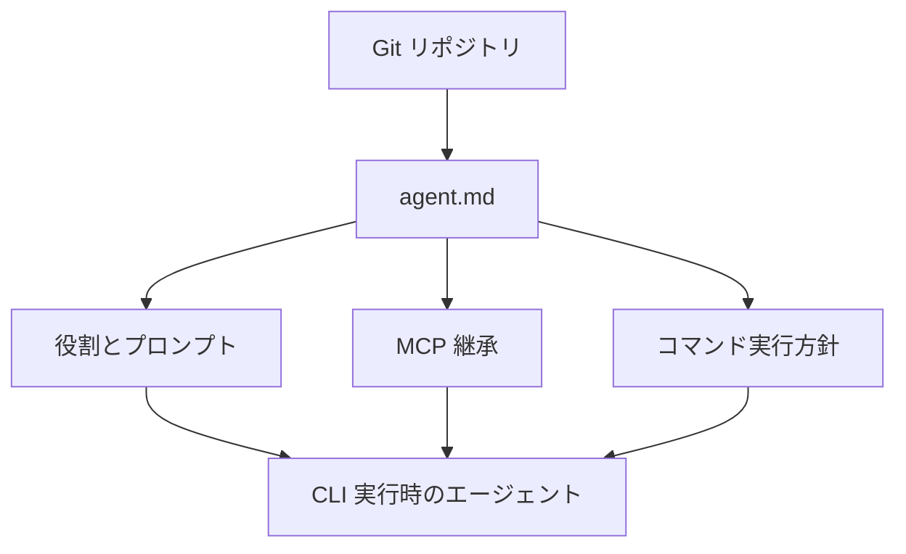
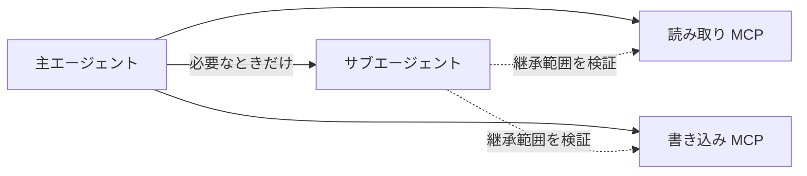
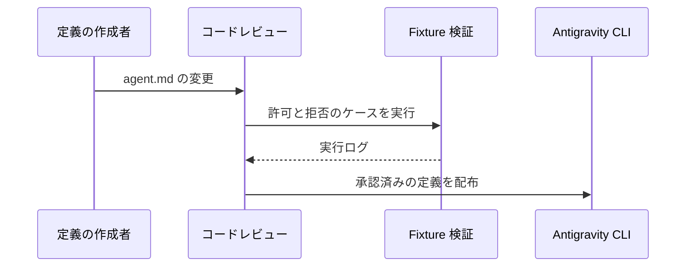

コーディングエージェントの権限は、実行時に承認ダイアログで判断するだけでは管理しきれません。誰がどの役割を担い、どの外部ツールを引き継ぎ、どこまでコマンドを実行できるかを、変更差分としてレビューできる形にする必要があります。

Google Antigravity CLI の 1.1.6 は、Custom Agent を `agent.md` という Markdown ファイルで定義できるようにしました。YAML front matter には、`mainAgent`、`subagent`、`hidden`、`inheritMcp`、`commandExecutionPolicy` が用意されています。リリースノートから確認できるのはフィールド名と用途の概要までです。本稿では、未公開の既定値や競合解決を推測せず、この変更を安全な運用へつなげる設計を整理します。

## 何が変わるのか

`agent.md` は、YAML front matter と H1 見出しで区切られたシステムプロンプトから成ります。つまり役割の文章だけでなく、MCP 継承とコマンド実行方針を近接した構成ファイルとして扱えます。



この変更の価値は Markdown そのものではありません。エージェント定義をソースコードと同じ変更管理の面に載せられることです。たとえば MCP を引き継ぐ変更は、接続可能な外部システムを増やす変更として PR で読めます。コマンド実行方針の変更も、プロンプトの一文ではなく、明示的な権限差分として扱えます。

## フィールドを「役割」と「境界」に分けて読む

公開されたリリースノートで確認できるフィールドは次の五つです。

| フィールド | 位置付け | レビューで問うこと |
|---|---|---|
| `mainAgent` | 主エージェントの役割 | 何を直接実行する責任を持つか |
| `subagent` | 委譲される役割 | 親から渡すコンテキストと権限は最小か |
| `hidden` | UI 上の露出 | 非表示を監査除外と混同していないか |
| `inheritMcp` | 外部ツールの継承 | 子に必要な MCP だけか |
| `commandExecutionPolicy` | コマンド実行方針 | 許可範囲が目的に対して広すぎないか |

ここで大切なのは、`hidden` と権限を混同しないことです。UI に出ないエージェントでも、MCP と shell が使えれば影響範囲はあります。見えなくするほど、定義ファイル、実行ログ、コード所有者のレビューを強くするべきです。

## まずは「読み取り専用の調査担当」から始める

本番を変更するエージェントから始めるより、調査・要約・テスト結果の分類など、書き込み権限を必要としない役割を一つ定義する方が安全です。

```markdown
---
subagent: true
inheritMcp: false
commandExecutionPolicy: <導入バージョンの公式仕様に沿った最小権限>
---

# 依存関係レビュー担当

変更対象と lockfile を確認し、影響範囲と検証すべき点を報告する。
```

これは値の具体例ではありません。`commandExecutionPolicy` の許可語彙、既定値、親子での優先順位は、1.1.6 の公開リリースノートだけでは確定しません。導入するバージョンの公式ドキュメントと、安全な fixture で必ず確かめてください。

## MCP の継承は便利さではなく到達可能性の設計

MCP を親から継承できると、サブエージェントをすぐ動かせます。しかし同時に、親が持つ外部システムへの到達可能性を子にも渡す可能性があります。



運用では、次の順番が扱いやすいです。

1. 子エージェントの成果物を一文で定義する。
2. その成果物に必要な MCP を列挙する。
3. 継承あり・継承なしの fixture を実行し、実際の到達範囲をログで比較する。
4. 接続先やコマンドの追加は、エージェント本文とは別に「権限拡張」としてレビューする。

## `commandExecutionPolicy` を変更管理にする

コマンド実行は、エージェントが副作用を起こす主要な経路です。したがってポリシーは「失敗したときに承認する」ためだけでなく、「変更前に妥当性を説明する」ために置きます。



レビューでは少なくとも次を確認します。

- 新たに実行できるコマンドは何か
- シェル展開、作業ディレクトリ、子プロセスはどう扱われるか
- 拒否された操作がログに残るか
- 動的なサブエージェントにも同じ境界が適用されるか

リリースノートは、サンドボックス権限でコマンドがブロックされたときのクラッシュを修正し、ブロック操作を記録する改善にも触れています。これは、拒否の観測をテストに含めるべき理由でもあります。

## 決定的な探索順は地味だが重要

1.1.6 では rules と発見されたパスの順序を決定的にソートし、プロンプト順の不安定さと不要なキャッシュミスを減らしました。設定が同じなのに毎回異なるエージェントが選ばれる、という問題を避けるには、発見順を暗黙の環境差に任せないことが前提です。

```bash
# 定義変更と、検証に使ったバージョンを同じ PR に残す
agy --version
git diff -- agents/
```

動的な `define_subagent` で定義された子エージェントも Markdown として書き出されるようになりました。これにより、外部ビルドでの解決を一貫させる意図が見えます。動的生成を使う場合も、生成後のファイルを成果物として保存し、静的定義と同じレビュー・テスト経路に入れるのがよいでしょう。

## 導入時のチェックリスト

- `agent.md` を Git 管理し、役割・MCP・コマンド方針の差分を PR で読めるようにする。
- 役割ごとに最小権限から始め、読み取り専用の担当でポリシー検証を先に行う。
- `inheritMcp` の具体的な継承範囲を、導入バージョンの実行ログで確認する。
- `commandExecutionPolicy` の許可・拒否・境界ケースを fixture として CI に残す。
- `hidden` を監査の省略理由にせず、むしろ変更履歴とコード所有者を明確にする。
- CLI バージョンを固定し、ルール発見順が再現することを継続的に確認する。

## まとめ

Markdown Custom Agents は、エージェント運用を「会話の設定」から「レビュー可能な構成資産」へ寄せる変更です。価値が出るのは、役割の分離、MCP の最小化、コマンド実行方針のテスト、そして差分レビューを一つの運用として接続したときです。

公開情報で未確認な仕様は、都合よく補わない方が安全です。まずは小さな fixture で継承と拒否を観測し、その結果を基に権限を増やしてください。

## 参考リンク

- [Antigravity CLI 1.1.6 リリースノート](https://github.com/google-antigravity/antigravity-cli/releases/tag/1.1.6)
- [Antigravity CLI リポジトリ](https://github.com/google-antigravity/antigravity-cli)
- [Antigravity CLI の公式ドキュメント](https://antigravity.google/docs/cli/overview)
