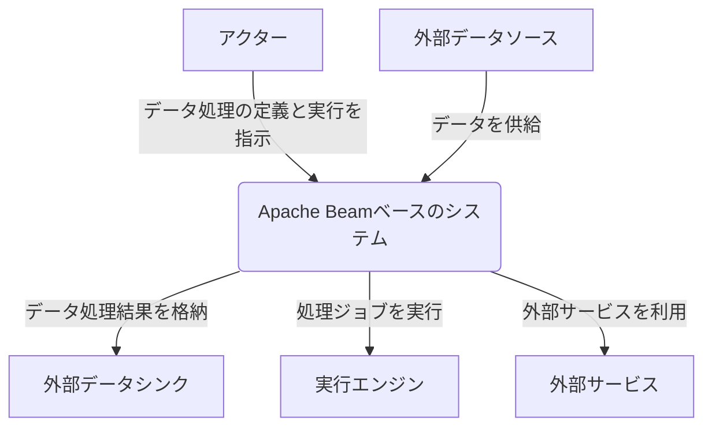
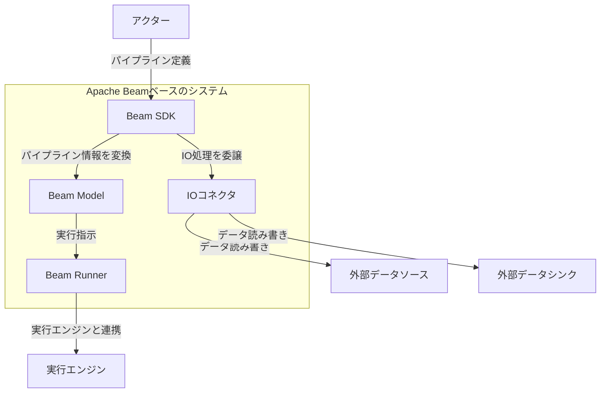
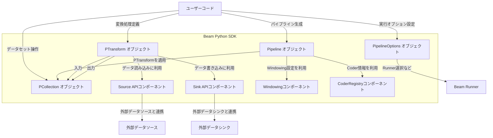
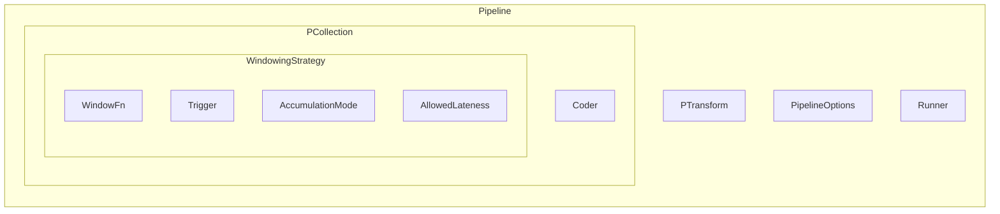
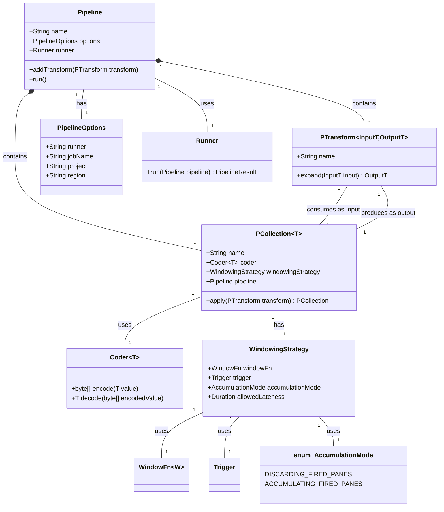

## ■概要

Apache Beamは、バッチ処理およびストリーム処理のデータパイプラインを定義し、実行するためのオープンソースの統合プログラミングモデルです。Beamのパイプラインは、様々な分散処理バックエンド（実行エンジン、Runnerとも呼ばれる）上で実行可能です。これにより、ユーザーはデータ処理ロジックの記述に集中でき、実行環境の差異を意識する必要が少なくなります。主要な概念には、パイプライン (Pipeline)、PCollection (分散データセット)、PTransform (データ処理操作)、Runner (実行エンジンへのアダプタ) があります。

## ■構造

### ●システムコンテキスト図

| 要素名                      | 説明                                                                     |
| :-------------------------- | :----------------------------------------------------------------------- |
| アクター                    | データ処理パイプラインを定義、実行、監視するユーザーまたはシステムです。 |
| Apache Beamベースのシステム | Apache Beam SDKとRunnerを利用して構築されたデータ処理システムです。      |
| 外部データソース            | パイプラインが処理する元データを提供するシステムやストレージです。       |
| 外部データシンク            | パイプラインの処理結果を格納するシステムやストレージです。               |
| 実行エンジン                | Apache Beamパイプラインを実際に実行する分散処理基盤です。                |
| 外部サービス                | データ処理中に連携する可能性のある外部のAPIやサービスです。              |

### ●コンテナ図

| 要素名           | 説明                                                                                                         |
| :--------------- | :----------------------------------------------------------------------------------------------------------- |
| Beam SDK         | データ処理パイプラインを定義するためのAPIとライブラリ群です (例: Java SDK, Python SDK, Go SDK)。             |
| Beam Model       | SDKによって定義されたパイプラインの、実行エンジンに依存しない中間表現です。有向非巡回グラフ (DAG) 形式です。 |
| Beam Runner      | Beam Modelを実行エンジン固有のジョブに変換し、実行エンジン上でパイプラインを実行するコンポーネントです。     |
| IOコネクタ       | 様々な外部データソースやシンクとの間でデータを読み書きするためのコンポーネント群です。                       |
| アクター         | データ処理パイプラインを定義、実行、監視するユーザーまたはシステムです。                                     |
| 実行エンジン     | Apache Beamパイプラインを実際に実行する分散処理基盤です。                                                    |
| 外部データソース | パイプラインが処理する元データを提供するシステムやストレージです。                                           |
| 外部データシンク | パイプラインの処理結果を格納するシステムやストレージです。                                                   |

### ●コンポーネント図

Beam SDK (例: Python SDK) の主要コンポーネントを詳細化します。

| 要素名                       | 説明                                                                                                        |
| :--------------------------- | :---------------------------------------------------------------------------------------------------------- |
| Pipeline オブジェクト        | データ処理パイプライン全体の定義と実行の起点となるオブジェクトです。例: `apache_beam.Pipeline()`            |
| PCollection オブジェクト     | パイプライン内の分散データセットを表す不変のコレクションです。例: `pipeline.apply(Create([1, 2, 3]))`       |
| PTransform オブジェクト      | PCollectionに対するデータ処理操作を表します。例: `beam.Map()`, `beam.Filter()`, `beam.GroupByKey()`         |
| Source APIコンポーネント     | 外部データソースからデータを読み込むためのPTransform群です。例: `beam.io.ReadFromText()`                    |
| Sink APIコンポーネント       | 処理結果を外部データシンクに書き込むためのPTransform群です。例: `beam.io.WriteToText()`                     |
| PipelineOptions オブジェクト | パイプラインの実行時設定（Runnerの種類、実行環境固有のパラメータなど）を管理します。例: `PipelineOptions()` |
| Windowingコンポーネント      | ストリーム処理における時間ベースや要素数ベースのウィンドウ設定を扱います。                                  |
| CoderRegistryコンポーネント  | PCollection内の要素をシリアライズ・デシリアライズする方法 (Coder) を管理します。                            |
| ユーザーコード               | 開発者が記述する、Beam SDKの各コンポーネントを利用したパイプライン定義コードです。                          |
| 外部データソース             | テキストファイル、データベース、メッセージキューなど。                                                      |
| 外部データシンク             | テキストファイル、データベース、メッセージキューなど。                                                      |
| Beam Runner                  | パイプラインを実行エンジンに渡すコンポーネントです。                                                        |

## ■情報

Apache Beamが内部で扱う主要なデータの概念モデルと情報モデルを説明します。

### ●概念モデル

| 要素名            | 説明                                                                   |
| :---------------- | :--------------------------------------------------------------------- |
| Pipeline          | データ処理パイプライン全体を表す概念です。                             |
| PCollection       | パイプライン内の分散データセットを表す概念です。                       |
| PTransform        | データ処理操作を表す概念です。                                         |
| PipelineOptions   | パイプラインの実行時設定を表す概念です。                               |
| Runner            | パイプラインを実行するバックエンドを表す概念です。                     |
| Coder             | PCollection内の要素のエンコード・デコード方法を表す概念です。          |
| WindowingStrategy | PCollectionのウィンドウ分割戦略を表す概念です。                        |
| WindowFn          | ウィンドウを割り当てる関数を表す概念です。                             |
| Trigger           | ウィンドウの結果をいつ出力するかを決定する条件を表す概念です。         |
| AccumulationMode  | 複数回トリガーされた場合にペインをどのように集約するかを表す概念です。 |
| AllowedLateness   | 遅延データが許容される期間を表す概念です。                             |

### ●情報モデル

| クラス名 (エンティティ名)    | 主要な属性/メソッド                                          | 説明                                                                                                                                          |
| :--------------------------- | :----------------------------------------------------------- | :-------------------------------------------------------------------------------------------------------------------------------------------- |
| Pipeline                     | `name`, `options`, `runner`, `addTransform()`, `run()`       | データ処理パイプライン全体。PTransformの集合を保持し、実行を管理します。                                                                      |
| PCollection\<T\>             | `name`, `coder`, `windowingStrategy`, `pipeline`, `apply()`  | 型 `T` の要素からなる不変の分散データセット。パイプライン内のデータフローを表します。                                                         |
| PTransform\<InputT,OutputT\> | `name`, `expand()`                                           | `InputT` 型のPCollectionを入力とし、`OutputT` 型のPCollectionを出力するデータ処理操作。`expand()`メソッドに具体的な処理ロジックを実装します。 |
| PipelineOptions              | `runner`, `jobName`, `project`, `region`                     | パイプラインの実行時設定（実行Runner、ジョブ名、クラウドプロジェクトIDなど）を保持します。                                                    |
| Runner                       | `run()`                                                      | パイプラインを特定の実行環境（例: DirectRunner, FlinkRunner, DataflowRunner）で実行する役割を担います。                                       |
| Coder\<T\>                   | `encode()`, `decode()`                                       | PCollection内の型 `T` の要素をバイト列にシリアライズ/デシリアライズする方法を定義します。                                                     |
| WindowingStrategy            | `windowFn`, `trigger`, `accumulationMode`, `allowedLateness` | PCollection（特に unbounded な PCollection）をウィンドウに分割し、結果をどのように集計・出力するかを定義します。                              |
| WindowFn                     |                                                              | 要素を特定のウィンドウに割り当てるロジックを定義します (例: 固定時間ウィンドウ、スライディングウィンドウ)。                                   |
| Trigger                      |                                                              | ウィンドウ内のデータが集まった後、いつそのウィンドウの結果を処理・出力するかの条件を定義します。                                              |
| AccumulationMode             | `DISCARDING_FIRED_PANES`, `ACCUMULATING_FIRED_PANES`         | ウィンドウが複数回発火 (fire) した場合に、以前に発火したペイン (pane) のデータを破棄するか、蓄積するかを指定します。                          |

## ■構築方法

Apache Beamパイプラインを構築するための一般的なステップです。

### ●開発環境のセットアップ

  * **SDKのインストール**:
      * 使用する言語 (Java, Python, Go) に応じたBeam SDKをインストールします。
      * 例えばPythonの場合: `pip install apache-beam[gcp,aws,azure]` (必要なIOやRunnerに応じて追加)
  * **実行環境の準備**:
      * ローカルテスト用のDirectRunnerはSDKに含まれます。
      * 分散処理を行う場合は、Apache Flink, Apache Spark, Google Cloud Dataflowなどの実行エンジンをセットアップするか、クラウドサービスを利用できるように準備します。
  * **依存関係の管理**:
      * Javaの場合はMavenやGradle、Pythonの場合はpipやPoetryなどで、Beam SDKと必要なライブラリのバージョンを管理します。

### ●パイプラインの作成

  * **Pipelineオブジェクトの生成**:
      * `PipelineOptions` を設定し、`Pipeline` オブジェクトを作成します。
  * **データソースからの読み込み**:
      * Beam SDKが提供するIOコネクタ (例: `TextIO.Read`, `BigQueryIO.Read`) を使用して、外部データソースからデータを読み込み、最初のPCollectionを生成します。
  * **データ変換処理の適用**:
      * `Map`, `Filter`, `GroupByKey`, `Combine` などのPTransformをPCollectionに適用して、データを処理・変換します。カスタムPTransformを作成することも可能です。
  * **データシンクへの書き込み**:
      * IOコネクタ (例: `TextIO.Write`, `BigQueryIO.Write`) を使用して、最終的なPCollectionを外部データシンクに書き込みます。
  * **パイプラインの実行**:
      * `Pipeline` オブジェクトの `run()` メソッドを呼び出してパイプラインを実行します。

## ■利用方法

Apache Beamパイプラインを利用する際の一般的な手順です。

### ●パイプラインの定義

  * **プログラミング言語の選択**: Java, Python, Go のいずれかを選択してパイプラインを記述します。
  * **処理ロジックの実装**:
      * データの入力 (Source)、一連の変換処理 (Transforms)、データの出力 (Sink) を定義します。
      * 必要に応じて、ウィンドウ処理、トリガー、カスタムデータ型のためのCoderなどを設定します。

### ●ローカルでの実行とテスト

  * **DirectRunnerの利用**:
      * `PipelineOptions` で `DirectRunner` を指定し、ローカルマシン上でパイプラインを実行します。
      * 小規模なデータセットでの動作確認や単体テストに適しています。
  * **テストユーティリティ**:
      * Beam SDKが提供するテストユーティリティ (例: Pythonの `apache_beam.testing.test_pipeline.TestPipeline`, `apache_beam.testing.util.assert_that`) を活用して、PTransformやパイプライン全体のテストを作成します。

### ●分散環境での実行

  * **Runnerの選択と設定**:
      * `PipelineOptions` でターゲットとする分散処理エンジンに対応するRunner (例: `FlinkRunner`, `SparkRunner`, `DataflowRunner`) を指定します。
      * 実行エンジン固有の設定 (例: ワーカー数、メモリサイズ、クラスタエンドポイント) も `PipelineOptions` を通じて行います。
  * **ジョブのサブミット**:
      * 定義したパイプラインをパッケージ化し、選択した実行エンジンにジョブとしてサブミットします。
      * 実行方法はRunnerや実行エンジンによって異なります (例: コマンドラインツール、API)。

## ■運用

Apache Beamパイプラインを運用する際の考慮事項です。

### ●デプロイメント

  * **パッケージング**:
      * パイプラインのコードと依存ライブラリをJARファイル (Java) やPythonパッケージとしてまとめます。
      * Runnerによっては、コンテナイメージ (Dockerなど) としてデプロイする場合もあります。
  * **実行環境へのデプロイ**:
      * パッケージ化されたパイプラインを、選択した実行エンジン (Flinkクラスタ、Sparkクラスタ、Google Cloud Dataflowなど) にデプロイします。
      * CI/CDパイプラインを構築して、デプロイメントを自動化することを推奨します。

### ●モニタリングとロギング

  * **メトリクスの収集**:
      * Beamパイプラインは実行中に様々なメトリクス (例: 要素数、処理時間、エラー数) を公開します。
      * 実行エンジンやクラウドプロバイダーが提供するモニタリングツール (例: Flink Web UI, Spark UI, Google Cloud Monitoring) を利用して、これらのメトリクスを監視します。
      * Beamの `Metrics` API を利用してカスタムメトリクスを収集することも可能です。
  * **ログの管理**:
      * パイプラインの実行ログは、実行エンジンやクラウドプロバイダーのロギングサービス (例: Google Cloud Logging) に集約されます。
      * ログレベルを設定し、エラーや警告を適切に監視します。

### ●スケーリングとパフォーマンスチューニング

  * **リソース割り当て**:
      * 実行エンジンのワーカー数、CPU、メモリなどのリソースを、処理するデータ量やパイプラインの特性に応じて調整します。
      * 多くのRunnerは自動スケーリング機能を提供しています。
  * **パイプラインの最適化**:
      * データフュージョン、シャーディング、適切なCoderの選択など、Beamの最適化機能を活用します。
      * パフォーマンスボトルネックを特定し、PTransformのロジックや並列度を調整します。

### ●エラーハンドリングとデバッグ

  * **デッドレターキュー (DLQ)**:
      * 処理中にエラーが発生した要素を、別のPCollectionや外部ストレージ (DLQ) に送るように設定できます。これにより、エラー要素を後で分析したり再処理したりできます。
  * **再試行ポリシー**:
      * 一時的なエラーに対して、処理の再試行ポリシーを設定できます。
  * **デバッグ**:
      * ローカルでのデバッグに加え、実行エンジンが提供するデバッグツールやログを活用します。

## ■参考リンク

### 概要

  * [What is Apache Beam?](https://beam.apache.org/get-started/beam-overview/)
  * [Basics of the Beam model](https://beam.apache.org/documentation/basics/)
  * [Beam Programming Guide](https://beam.apache.org/documentation/programming-guide/)

### 構造

  * [Apache Beam capability matrix (Runners)](https://beam.apache.org/documentation/runners/capability-matrix/)
  * [Apache Beam Programming Guide](https://beam.apache.org/documentation/programming-guide/)
  * [DeepWiki apache/beam](hthttps://deepwiki.com/apache/beam)

### 情報

  * [PCollection - Beam Programming Guide](https://beam.apache.org/documentation/programming-guide/#pcollections)
  * [Transforms - Beam Programming Guide](https://beam.apache.org/documentation/programming-guide/#transforms)
  * [Pipeline I/O - Beam Programming Guide](https://beam.apache.org/documentation/programming-guide/#pipeline-io)
  * [Windowing - Beam Programming Guide](https://beam.apache.org/documentation/programming-guide/#windowing)
  * [Coders - Beam Programming Guide](https://beam.apache.org/documentation/programming-guide/#data-encoding-and-type-safety)

### 構築方法

  * [Apache Beam Quickstart (Java)](https://beam.apache.org/get-started/quickstart-java/)
  * [Apache Beam Quickstart (Python)](https://beam.apache.org/get-started/quickstart-py/)
  * [Apache Beam Quickstart (Go)](https://beam.apache.org/get-started/quickstart-go/)
  * [Pipeline options - Beam Programming Guide](https://beam.apache.org/documentation/patterns/pipeline-options/)

### 利用方法

  * [Triggers - Beam Programming Guide](https://beam.apache.org/documentation/programming-guide/#triggers)
  * [Testing pipelines - Beam Programming Guide](https://beam.apache.org/documentation/pipelines/test-your-pipeline/)
  * [Runners - Beam Documentation](https://beam.apache.org/documentation/runners/capability-matrix/)

### 運用

  * [Running jobs on Dataflow - Google Cloud](https://cloud.google.com/dataflow/docs/guides/deploying-a-pipeline) (Dataflow Runnerの例)
  * [Monitoring your Dataflow jobs - Google Cloud](https://cloud.google.com/dataflow/docs/guides/using-cloud-monitoring) (Dataflow Runnerの例)
