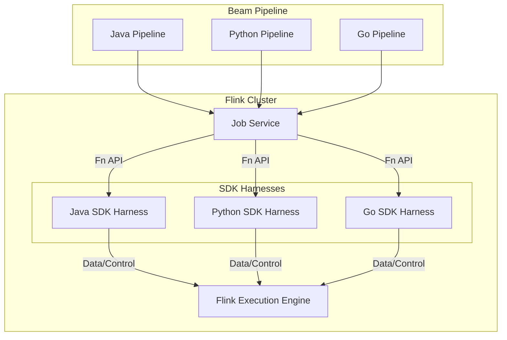

## ■概要

Apache BeamとApache Flinkの組み合わせは、データ処理の強力な解決策です。Beamは統一プログラミングモデルと移植性を提供し、Flinkは高性能な分散処理、特にステートフルなストリーム処理に強みがあります。この連携により、開発者はBeamの単一APIで生産性を高めつつ、Flinkの高度な機能を活用できます。バージョン互換性の管理や、BeamからFlinkジョブへの変換詳細の理解が、パフォーマンス最適化には重要です。この組み合わせは、エンジン選択の柔軟性をもたらし、組織がビジネスロジックに集中できるよう支援します。

**Apache Beam：データ処理のための統一モデル**

https://zenn.dev/suwash/articles/apache_beam_20250522

**Apache Flink：強力なストリーム処理エンジン**

https://zenn.dev/suwash/articles/apache_flink_20250522

**Beamの抽象化とFlinkの実行力の融合**

| 特性                 | Apache Beam                                              | Apache Flink                                                               | 連携による価値                                                                                  |
| :------------------- | :------------------------------------------------------- | :------------------------------------------------------------------------- | :--------------------------------------------------------------------------------------------------------------- |
| プログラミングモデル | 統一バッチ/ストリームAPI、宣言的                         | DataStream API, Table API/SQL, ProcessFunction                             | Beamの統一APIで記述し、Flinkの多様な実行能力を活用                                                               |
| 実行焦点             | ポータブルなパイプライン定義                             | 高性能なストリーム処理、ステートフル計算                                   | Flinkの強力な実行エンジン上で、移植可能なパイプラインを実行                                                      |
| 移植性               | 高（複数ランナー対応）                                   | 低（Flinkエンジン専用）                                                    | Flinkのパワーを活用しつつ、将来的に他のランナーへの移行可能性を保持                                              |
| 主要な強み           | API統一性、エンジン非依存性                              | リアルタイムストリーム処理、大規模ステート管理、Exactly-onceセマンティクス | 開発の容易さと、Flinkの高度なストリーミング機能および信頼性の両立                                                |
| データ処理           | 有界（バッチ）および無界（ストリーム）データの統一的扱い | 主に無界データ、バッチはストリームの特殊ケースとしてサポート               | Beamの統一モデルとFlinkのストリームファーストアーキテクチャにより、混合ワークロードを自然に処理                  |
| ステート管理         | 抽象化されたステートAPI（ValueState等）                  | 高度なステート管理（RocksDB、増分チェックポイント等）、Exactly-once保証    | BeamのステートAPIで記述したロジックを、Flinkの堅牢なステート管理基盤上で実行                                     |
| エコシステム         | 複数のSDK（Java, Python, Go）、多様なI/Oコネクタ         | 豊富なコネクタ群、Flink固有ライブラリ（FlinkML等）                         | Beamの多様なSDKと言語サポート、およびFlinkの広範なコネクタエコシステムへのアクセス（ランナー経由または補完的に） |

## ■Flinkランナー

Flinkランナーは、Apache BeamパイプラインをApache Flinkジョブに変換し、Flinkクラスタ上で実行可能にするコンポーネントです。この変換プロセスとランナーの内部構造の理解は、Beam on Flinkを効果的に利用する上で重要です。

Flinkランナーには、主に二つの種類が存在します。

* **クラシックFlinkランナー (Classic Flink Runner)**: Javaおよびその他のJVMベース言語のみをサポートします。BeamパイプラインをFlinkのDataSet API（バッチ処理用）またはDataStream API（ストリーミング処理用）の呼び出しに直接変換します。
* **ポータブルFlinkランナー (Portable Flink Runner)**: Java、Python、Goといった多言語パイプラインをサポートします。BeamのFn API（Function API）という言語間通信プロトコルを利用し、Job Serviceと各言語用のSDKハーネス（SDK Harnesses）を介してパイプラインを実行します。将来的にクラシックFlinkランナーを置き換える予定です。

### ●Flinkランナーの構成

| 要素名                 | 説明                                                                                                      |
| :--------------------- | :-------------------------------------------------------------------------------------------------------- |
| Beam Pipeline          | Java, Python, Goなどで記述されたBeamデータ処理ロジック                                                    |
| Job Service            | Beamパイプラインを受け取り、Flinkクラスタでの実行を調整するサービス                                       |
| SDK Harnesses          | 各言語 (Java, Python, Go) のユーザー定義関数 (UDF) を実行する環境。Fn API を介して Job Service と通信する |
| Fn API                 | Job Service と SDK Harnesses 間の言語非依存プロトコル                                                     |
| Flink Execution Engine | 実際にデータ処理を実行するFlinkのコアエンジン                                                             |

### ●BeamプリミティブからFlinkへのマッピング

Flinkランナーは、Beamのコアな抽象化をFlinkの実行モデルにマッピングする役割を担います。この変換プロセスは、単純な一対一のマッピングではなく、Beamの機能をFlink上で実現するためにラッパーパターンを用いたり、エミュレーションを行ったりすることがあります。この抽象化レイヤーの存在は、Beamの移植性実現に不可欠ですが、ネイティブFlinkと比較した場合に若干のパフォーマンスオーバーヘッドやセマンティクスの違いが生じる可能性があります。

| Beam抽象化         | Flinkランナーによるマッピング                                                                                                                                                                  |
| :----------------- | :--------------------------------------------------------------------------------------------------------------------------------------------------------------------------------------------- |
| PCollection        | FlinkのDataSet（バッチ）またはDataStream（ストリーミング）へのマッピング                                                                                                                       |
| Read (Source)      | バッチ処理用のSourceInputFormat、ストリーム処理用のUnboundedSourceWrapperといったラッパーを介したFlinkソースとしての機能                                                                       |
| ParDo              | FlinkのRichFlatMapFunctionに似た構造（FlinkDoFnFunction, FlinkStatefulDoFnFunction, DoFnOperator）への変換、Beam固有機能（SideInputs, State, Timers）のサポート                                |
| GroupByKey         | FlinkのkeyBy()操作とそれに続くウィンドウ処理ロジックへのマッピング。Beamのウィンドウ情報は要素と共に運ばれ、GroupByKeyで利用                                                                   |
| AssignWindows      | Beamではパイプラインの任意の時点でウィンドウ割り当て可能。Flinkのウィンドウ処理は通常keyBy後に適用されるが、Flinkランナーがこの違いを調整。要素はWindowedValueでラップされウィンドウ情報を保持 |
| Coder (Serializer) | Beam CoderをラップしFlink内で利用可能にするCoderTypeInformationとCoderTypeSerializerの使用                                                                                                     |
| SideInput          | Flinkにはネイティブに存在しないBeamの概念。Flinkランナーによるブロードキャスト変数やJoinなどを利用したFlink上でのエミュレート（追加実装）                                                      |
| Flatten            | 複数のPCollectionを単一のPCollectionに結合。Flinkのunion()操作への相当                                                                                                                         |

この変換レイヤーの理解は、Beam on Flink環境でパフォーマンス問題のデバッグや予期せぬ動作の根本原因特定に役立ちます。抽象化は強力ですが、その内部動作を知ることで、より効果的に利用できます。

## ■連携でできるようになること

### ●バッチ・ストリーミング処理の統一

Apache Beamの統一APIは、バッチ処理とストリーミング処理のロジックを一度定義するだけで、Flinkランナー上でシームレスに実行できる点が特徴です。これにより、コードの再利用性が向上し、混合ワークロードの開発が簡素化され、処理モード間の移行も容易になります。

Flinkはストリーム処理を基本とし、バッチ処理をその特殊なケースとして扱うため、Beamの統一モデルと非常に相性が良いです。この整合性により、開発者は概念的な障壁を感じることなく、バッチジョブをストリーミングジョブに進化させたり、ハイブリッドな処理を実現できます。

### ●高度なデータ処理

Beamの高度なウィンドウ処理やトリガーは、ストリームデータの時間に応じた集計方法を定義し、Flinkの堅牢なイベントタイム処理と状態管理がこれを正確かつ効率的に実行します。この連携により、順不同データや遅延データを含む複雑なストリームも、Beamで定義した通りにFlinkが確実に処理します。

* **ウィンドウ処理 (Windowing)**: 固定ウィンドウ（タンブリングウィンドウ）、スライディングウィンドウ（ホッピングウィンドウ）、セッションウィンドウなど、様々な種類のウィンドウが提供され、PCollectionを論理的な部分集合に分割します。
* **ウォーターマーク (Watermarks)**: Beamにおけるウォーターマークは、イベント時間の完全性に関する「推測」であり、順序が乱れたデータを扱う上で極めて重要です。特定のウィンドウ内の全データが到着したと期待される時点を示します。
* **トリガー (Triggers)**: ウィンドウの結果をいつ出力するかを決定します。イベント時間、処理時間、データ駆動型（例：要素数）、またはこれらの組み合わせ（複合トリガー）に基づいて発火条件を設定できます。

### ●ステートフル処理

Beamはステートフルな処理を定義するためのAPIを提供し、Flinkはそのステートを堅牢かつスケーラブルに管理します。これにより、ユーザーはBeamの抽象化されたAPIを使いつつ、Flinkの高性能なステート管理能力を活用して、複雑なステートフルアプリケーションを効率的に構築・運用できます。

### ●多言語パイプライン

BeamのポータブルFlinkランナーは、PythonやGoといったJVM以外の言語で書かれたパイプラインもFlink上で実行可能にします。これにより、Flinkの言語サポートが広がり、Pythonの豊富な機械学習ライブラリなどを活用したデータ処理パイプラインを、より多くの開発者がFlink上で容易に構築・実行できるようになります。

### ●外部システムアクセス

Beamは移植性の高い独自のI/Oコネクタを提供しますが、より高いパフォーマンスや機能が求められる場合は、Flinkのネイティブコネクタを直接利用する選択肢もあります。この場合、移植性と特定システムへの最適化との間でバランスを考慮する必要があります。

## ■具体的なユースケース

BeamとFlinkの組み合わせは、データの適時性、状態の一貫性、そして運用のスケーラビリティが不可欠な領域で特に強力です。履歴データ（バッチ的）とリアルタイムデータ（ストリーム的）の両方の要素が関わってきます。

* **高スループットETLとデータ統合**: 
  * Apache BeamとFlinkの組み合わせは、大量のデータを多様なソースから処理・変換し、データウェアハウスやデータレイクにロードするETL処理に最適です。Beamの統一モデルが複雑なETLロジックの記述を簡素化し、Flinkがその処理をスケーラブルに実行します。例えば、日々生成される大量のログデータを集約・整形し、分析用にDWHへ格納するパイプラインなどが典型的なユースケースです。
* **リアルタイム分析と複合イベント処理（CEP）**:
  * ストリーミングデータをリアルタイムに分析し、洞察を得たりアクションをトリガーしたりするアプリケーションは、Apache BeamとFlinkの重要なユースケースです。例えば、金融の不正検知、IoTデータの異常検知、クリックストリーム分析などが挙げられます。これらの処理では、Flinkの高度なイベントタイム処理、ウィンドウ処理、ステート管理機能が核となり、Beamの宣言的なAPIによってこれらの複雑なロジックを比較的容易に記述できます。
* **スケーラブルな機械学習（ML）パイプライン**: 
  * データの前処理、特徴量エンジニアリング、そして場合によってはモデルのサービングに至るまで、MLパイプラインの各ステージにこの組み合わせを利用できます。例えば、Langchain-Beamを用いてLLMによる感情分析を行うパイプラインをBeamで定義し、Flink上で実行するといった、最新のAI技術を組み込んだリアルタイムアプリケーションが構築可能です。

## ■パフォーマンスエンジニアリング

### ●データシリアライゼーションの最適化：Beam CoderとFlink Serializer

Apache BeamパイプラインをFlink上で高性能に実行するには、データシリアライゼーションの最適化が不可欠です。BeamのCoderとFlinkのシリアライザが連携するため、効率的なCoderを選択・定義することがFlinkでのパフォーマンスに直接影響します。開発者は、使用するデータ型やCoderを明示的に指定し、シリアライズ対象のデータ量を減らすなどの工夫でオーバーヘッドを削減する必要があります。

### ●効果的な並列処理とリソース割り当て

並列度はスループットとリソース利用効率に直結する重要な調整項目です。Beamパイプラインの並列度設定はFlinkジョブのタスク並列度に変換されます。Flinkがどのようにリソースを管理し、オペレータにタスクを割り当てるかを理解することが重要です。Beam PTransformがFlinkオペレータへどうマッピングされ、作業がどう分散されるかを把握することで、より適切な並列度を設定でき、リソースの非効率な使用やボトルネックを防げます。

### ●チェックポイントとフォールトトレランスの習熟：信頼性と効率の両立

Flinkのチェックポイント機構は、BeamパイプラインにフォールトトレランスとExactly-onceセマンティクスをもたらします。チェックポイント間隔やモードなどの関連オプションを適切に設定することが、信頼性の確保とパフォーマンス維持のバランスを取る鍵となります。設定次第で、パフォーマンスへの影響や障害回復時間が変わるため、これらのオプションの理解と適切な設定が重要です。

### ●モニタリング、プロファイリング、デバッグ戦略

BeamパイプラインをFlink上で実行する際のモニタリングとデバッグには、Flinkレベルのメトリクスとツールの理解が求められます。FlinkのWeb UIは基本的な実行状況の把握に役立ちますが、詳細なプロファイリングにはJVMプロファイリングツールなどが有効です。Beamの抽象化に隠されたFlinkのランタイム挙動を調査することで、効果的な問題解決ができます。

### ●一般的なボトルネックへの対処：バックプレッシャーとデータスキュー

分散データ処理では、バックプレッシャー（処理遅延によるデータ滞留）やデータスキュー（データ分散の偏り）が一般的なパフォーマンス低下の原因です。これらはFlinkの実行時に顕在化するため、FlinkのUIなどで状況を把握し対処する必要があります。データの再パーティショニング、並列度の調整、関連オペレータの最適化などが対処法として考えられます。開発者はこれらの現象を認識し、適切に対応する必要があります。

## ■デプロイメントと運用のベストプラクティス

### ●バージョン互換性の管理

| Flinkバージョン | 互換性のある `beam-runners-flink-{version}` アーティファクトID | サポートされるBeam SDKバージョン範囲 |
| :-------------- | :------------------------------------------------------------- | :----------------------------------- |
| 1.19.x          | beam-runners-flink-1.19                                        | ≥ 2.61.0                             |
| 1.18.x          | beam-runners-flink-1.18                                        | ≥ 2.57.0                             |
| 1.17.x          | beam-runners-flink-1.17                                        | ≥ 2.56.0                             |
| 1.16.x          | beam-runners-flink-1.16                                        | 2.47.0 - 2.60.0                      |
| 1.15.x          | beam-runners-flink-1.15                                        | 2.40.0 - 2.60.0                      |

公式ドキュメントで最新情報を確認してください。

### ●デプロイメントアーキテクチャ

Apache Flinkクラスタは、スタンドアロン、YARN、Kubernetesなど多様な環境にデプロイできます。Beamパイプラインはこれらの環境で実行しますが、Beam自体はFlinkのデプロイ方法に依存しません。これにより、パイプラインロジックの記述（Beam）と実行環境の管理（Flinkデプロイメント）を分離できます。チームは運用要件に最適なFlinkデプロイメントモデルを、Beamパイプラインの開発に影響なく選択できます。Flinkランナーを使う際には、`flinkMaster`パイプラインオプションなどで接続先のFlinkクラスタを指定します。

### ●依存関係とパイプラインライフサイクルの管理

BeamパイプラインをFlinkにデプロイする際の依存関係管理は、パイプラインの言語によって異なります。JVMベースのパイプラインでは、通常「ファットJAR」に必要なライブラリをまとめてパッケージングします。一方、PythonやGoなどの非JVM言語でポータブルランナーを使う場合、依存関係はDockerイメージなどで管理し、より複雑になります。多言語パイプラインでは、信頼性の高いデプロイのために、Dockerイメージ管理やバージョン整合性確保を含む堅牢なCI/CDプラクティスが重要です。

**Beam向けの主要なFlinkパイプラインオプション**

| パイプラインオプション (Java名 / Python名)                      | 説明                                                                                                                 | デフォルト値    | 主要な影響                                     |
| :-------------------------------------------------------------- | :------------------------------------------------------------------------------------------------------------------- | :-------------- | :--------------------------------------------- |
| `flinkMaster` / `flink_master`                                  | 接続するFlinkマスターのアドレス（例：`host:port`）。`[auto]`はローカル実行を試みる。                                 | `[auto]`        | 実行環境                                       |
| `parallelism` / `parallelism`                                   | パイプライン全体のデフォルト並列度。-1の場合、Flinkクラスタ設定に依存。                                              | -1              | パフォーマンス、リソース使用量                 |
| `checkpointingInterval` / `checkpointing_interval`              | チェックポイントを実行する間隔（ミリ秒）。-1の場合、チェックポイントは無効。ストリーミングパイプラインでは通常必須。 | -1              | フォールトトレランス、パフォーマンス           |
| `checkpointingMode` / `checkpointing_mode`                      | チェックポイントモード（例：`EXACTLY_ONCE`, `AT_LEAST_ONCE`）。                                                      | `EXACTLY_ONCE`  | データ整合性保証レベル                         |
| `objectReuse` / `object_reuse`                                  | Flinkがオブジェクトを再利用してパフォーマンスを向上させることを許可するかどうか。                                    | `false`         | パフォーマンス（潜在的な副作用あり）           |
| `executionModeForBatch` / `execution_mode_for_batch`            | バッチパイプラインのデータ交換モード（例：`PIPELINED`, `BATCH_FORCED`）。                                            | `PIPELINED`     | パフォーマンス、リソース使用パターン（バッチ） |
| `shutdownSourcesAfterIdleMs` / `shutdown_sources_after_idle_ms` | アイドル状態のソースを指定時間後にシャットダウンするかどうか（ミリ秒）。-1で無効。                                   | -1              | リソース管理、チェックポイント動作             |
| `stateBackend` / `state_backend`                                | Beamのステートを保存するためのステートバックエンド（例：`rocksdb`, `filesystem`）。                                  | (Flink設定依存) | ステート管理、パフォーマンス                   |

完全なリストと詳細は、Apache Beamの公式ドキュメントを参照してください。

## ■課題への対処

### ●Flinkランナーの制限事項と回避策の理解

Flinkランナーは便利ですが、基盤となるFlinkの全機能を常に最適に利用できるわけではなく、制限事項が存在する可能性があります。過去には特定の機能サポートの遅れや、マネージド環境でのカスタマイズ制限がBeamの機能利用に影響した例がありました。Apache Beam公式ドキュメントの「Capability Matrix」でFlinkランナーのサポート状況や制限を事前に確認することが重要です。特に高度な機能利用時や制約のある環境では、十分なテストと、抽象化が万能ではないことの認識が必要です。

### ●ストリーミングパイプラインにおけるスキーマ進化戦略

長期間稼働するステートフルなストリーミング処理では、データスキーマの変更への対応が課題となります。BeamパイプラインをFlink上で実行する場合、Beamのスキーマ概念だけでなく、Flinkが永続化するステートのスキーマ進化も考慮する必要があります。Flinkのステートマイグレーション能力や制限を理解し、前方・後方互換性のあるスキーマ設計や、Flink固有のマイグレーション戦略を計画することが求められます。Flink固有のステートマイグレーション戦略の採用や、Beamスキーマを前方/後方互換性を持つように慎重に設計することが含まれる場合があります。

### ●堅牢なエラー処理とトラブルシューティング技術

Beam on Flinkパイプラインで問題が発生した場合、Beamの抽象化の背後にあるFlinkレベルのエラーやデプロイメント環境との関連性を理解する必要があります。エラーは複数のレイヤーで発生しうるため特定が難しいことがあります。効果的な対策として、Beamの例外処理に加え、Flinkランタイムの問題も考慮したエラー処理戦略を立てることが重要です。明確なロギング、エラー伝播の理解、Flinkの診断ツールの活用など、開発者と運用チームが全体的な視点を持つことが求められます。Beamのパイプラインロジックだけでなく、Flinkランタイムエラー、コネクタの問題、インフラストラクチャの問題など、全体的な視点を持つ必要があります。

## ■Beam on Flink vs. ネイティブFlink API

### ●Beamの抽象化を選択する場合

Beamの選択は、将来の実行エンジン変更の可能性や、開発スキルの統一といった長期的な戦略的目標がある場合に有利です。ただし、Flink固有の最新機能や最適化を最大限に活用できない可能性がある点は考慮が必要です。高レベルな設計や開発体験、将来の柔軟性を優先するアーキテクチャ判断と言えます。

* **移植性の要件**: 同じパイプラインを複数の実行エンジンで実行する必要がある場合です。例えばFlink、Spark、Dataflowなどです。あるいは将来的にFlink以外のエンジンへ移行する可能性を保持したい場合も該当します。Beamの「一度書けば、どこでも実行できる」という特性が活かせます。
* **統一されたバッチ/ストリーミングAPI**: 混合ワークロードの開発を簡素化したい場合に該当します。あるいはチームに単一のデータ処理パラダイムを提供したい場合です。開発者はバッチとストリームで異なるAPIを学ぶ必要がありません。
* **多言語ニーズ**: PythonやGoといったSDKを使ってパイプラインを開発したい場合に該当します。FlinkのネイティブAPIは主にJavaやScalaです。しかしBeamのポータブルランナーを介すると、これらの言語で記述したロジックをFlink上で実行できます。
* **既存のBeam専門知識/コードベースの活用**: チームが既にBeamに習熟している場合に該当します。あるいは既存のBeamパイプラインをFlinkに移行したい場合です。
* **エンジン固有仕様からの抽象化**: チームが高レベルな抽象化を好む場合に該当します。一般的なタスクに対してFlinkのより詳細なAPIよりも、ビジネスロジックに集中できる抽象化です。

### ●FlinkネイティブAPIの直接利用を選択する場合

FlinkのネイティブAPIを直接使用する方が有利なのは、Flink固有の最適化や低レベル操作を最大限に活用し最高のパフォーマンスや制御を求める場合です。Beamの移植性やAPI統一性よりも、Flinkの能力を最大限に引き出すことを優先する場合に正当化されます。

* **最大限のパフォーマンス/制御**: 機能を最大限に活用する必要がある場合に該当します。Flink固有の最適化や低レベル操作、例えばProcessFunctionです。あるいはBeam Flinkランナーがまだ完全に公開していない機能や、最適に変換しない機能も含まれます。
* **Flinkエコシステムとの深い統合**: 固有のライブラリや機能を利用したい場合に該当します。例えばFlinkMLやGellyなどです。ただし、一部はBeamとの相互運用性があるか、Beamにも同等のものが存在する場合があります。また、Beamではまだ利用できない非常に新しいコネクタや機能も該当します。
* **既存のFlink専門知識/コードベースの活用**: チームが既にFlinkに高度に習熟している場合に該当します。また、ネイティブFlinkアプリケーションへ多大な投資がある場合もです。
* **移植性の要件がない**: コミットメントがFlinkエンジンだけの場合に該当します。Flinkはエンジン非依存ではありません。そのため、Flinkアプリケーションは基本的にFlink上でしか動作しません。
* **複雑で要求の厳しいタスク**: Flinkはその能力を最大限に引き出す必要がある場合にネイティブでの使用が適しています。ただし、Flinkは「学習が難しい」「多くの計算機パワーを必要とする」と指摘されています。

## ■まとめ

Apache BeamとApache Flinkの組み合わせは、Beamの統一された開発モデルや移植性、多言語サポートと、Flinkの高性能なストリーム処理エンジンという強みを融合させます。これにより、開発者は生産性を高めつつ、複雑で要求の厳しいデータ処理パイプラインを構築できます。この連携は、開発の容易さと実行性能の両立を実現します。今後のFlinkランナーの改善や両コミュニティの進化により、この組み合わせはさらに強化されると期待されます。成功のためには、両技術を深く理解し、プロジェクト要件に応じた最適な設計と運用戦略を選択することが不可欠です。

この記事が少しでも参考になった、あるいは改善点などがあれば、ぜひリアクションやコメント、SNSでのシェアをいただけると励みになります！
