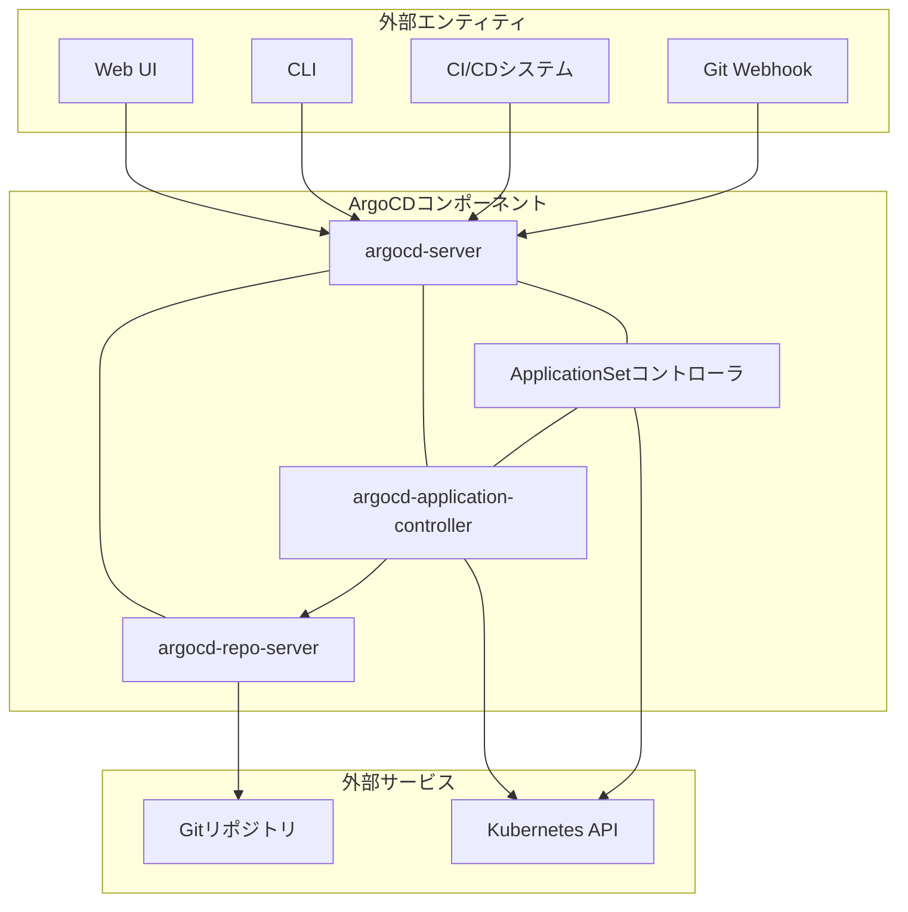
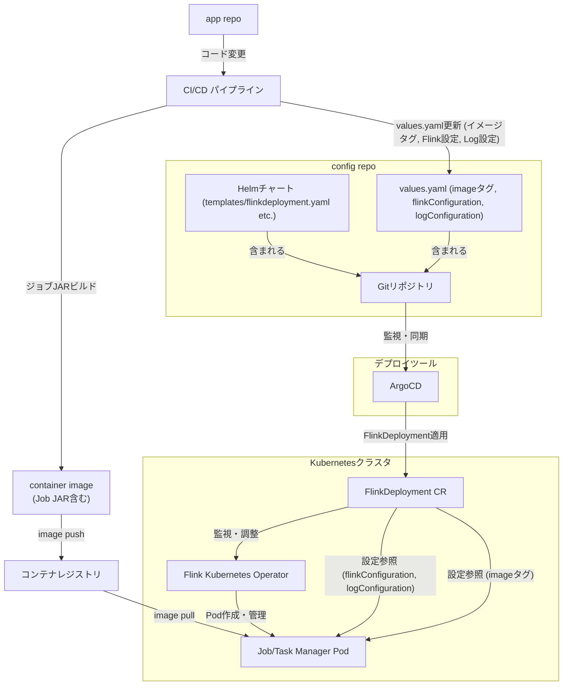

## ■はじめに

現代のデータ処理環境では、リアルタイム性とスケーラビリティへの要求がますます高まっています。Apache Beam、Apache Flink、Kubernetes (k8s)、そしてArgoCDは、各技術領域で強力な機能を提供します。

  * データ処理パイプライン定義: Apache Beam
  * 分散ストリーム処理: Apache Flink
  * コンテナオーケストレーション: Kubernetes
  * GitOpsによる継続的デリバリー: ArgoCD

これらの技術、特にApache Flink Kubernetes OperatorとArgoCDを連携させると、データ処理基盤の構築と運用を大きく変革できます。


### ●コアテクノロジーの概要

  * **Apache Beam**: バッチ処理とストリーム処理の統一プログラミングモデル
  * **Apache Flink**: 高スループット、低レイテンシなステートフルコンピューティングを実現する分散処理エンジン
  * **Kubernetes (k8s)**: コンテナ化アプリケーションのデプロイ、スケーリング、管理を自動化するシステム
  * **ArgoCD**: Kubernetesネイティブな宣言型のGitOps継続的デリバリーツール

### ●Flink Kubernetes OperatorとArgoCDの連携によるシナジー

Apache Flink Kubernetes Operatorは、Kubernetes上でFlinkアプリケーションのライフサイクル管理を自動化するツールです。一方、ArgoCDはGitリポジトリを信頼できる唯一の情報源 (Single Source of Truth) とし、Kubernetesクラスタの状態をGitリポジトリの記述と同期させるGitOpsを実現します。

これらの連携は、Flinkアプリケーションの定義（FlinkDeploymentカスタムリソース）、設定、バージョン管理をGitで行い、ArgoCDを通じてKubernetesクラスタへ自動的にデプロイ・更新することを可能にします。この組み合わせは、データパイプラインの運用に大きな利点をもたらします。

  * **宣言的な設定管理**: Flinkアプリケーションの望ましい状態をGitで宣言的に管理
  * **自動化されたデプロイメント**: Gitへの変更をトリガーに、ArgoCDが自動的にデプロイし同期
  * **バージョン管理と監査証跡**: Gitの履歴で全ての変更を追跡し監査
  * **ロールバックの容易性**: Gitのコミットを戻すことで迅速にロールバック
  * **開発者エクスペリエンスの向上**: 開発者はインフラ詳細を意識せず、アプリケーションロジックとGitワークフローに集中可能

## ■コアテクノロジーの詳細

### ●Apache Beam

https://zenn.dev/suwash/articles/apache_beam_20250522

### ●Apache Flink

https://zenn.dev/suwash/articles/apache_flink_20250522

https://zenn.dev/suwash/articles/apache_beam_flink_20250523

### ●Kubernetes (k8s)

https://zenn.dev/suwash/articles/apache_beam_flink_k8s_20250526

### ●ArgoCD

ArgoCDは、Kubernetesネイティブな宣言型のGitOps継続的デリバリー（CD）ツールです。Gitリポジトリを信頼できる唯一の情報源（Single Source of Truth）として使用し、Kubernetesリソースの望ましい状態を定義します。ArgoCDは、アプリケーションの定義、設定、環境を宣言的かつバージョン管理された状態に保ちます。また、アプリケーションのデプロイとライフサイクル管理を自動化し、監査できる理解しやすいものにします。

**主要な機能とコンポーネント**

  * **GitOpsワークフロー**: Gitリポジトリ内のマニフェスト（プレーンなYAML/JSON、Helmチャート、Kustomizeなど）に基づきアプリケーションをデプロイ・同期
  * **自動同期**: Gitリポジトリの変更を検知し、クラスタの状態を自動的に同期。手動同期も可能
  * **状態の可視化とドリフト検出**: Web UIとCLIを通じて、アプリケーションのデプロイ状況、同期状態、設定のドリフト（Gitの状態とライブ状態の差異）を可視化
  * **ロールバック**: Gitのコミット履歴を利用して、以前の安定したバージョンへ簡単にロールバック
  * **マルチクラスタ管理**: 複数のKubernetesクラスタへのアプリケーションデプロイを管理
  * **カスタムリソース定義 (CRD)**: ArgoCD自体がKubernetesコントローラとして動作し、ApplicationやAppProjectといったCRDを使用して設定を管理

**コンポーネントの構成**



| 要素名                                                       | 説明                                                                                                                                                                                                              |
| :----------------------------------------------------------- | :---------------------------------------------------------------------------------------------------------------------------------------------------------------------------------------------------------------- |
| Web UI                                                       | ArgoCDのWebインターフェース                                                                                                                                                                                       |
| CLI                                                          | ArgoCDのコマンドラインインターフェース                                                                                                                                                                            |
| CI/CDシステム                                                | 継続的インテグレーション/継続的デリバリーシステム                                                                                                                                                                 |
| Git Webhook                                                  | Gitリポジトリからのイベント通知 (例: pushイベント)                                                                                                                                                                |
| APIサーバー (argocd-server)                                  | Web UI、CLI、CI/CDシステムからのAPIリクエストを処理するgRPC/RESTサーバー。アプリケーション管理、状態報告、操作の呼び出し、リポジトリとクラスタの認証情報管理、認証・認可、Git Webhookイベントのリスナーなどを担当 |
| リポジトリサーバー (argocd-repo-server)                      | Gitリポジトリのローカルキャッシュを維持し、マニフェストを生成する内部サービス                                                                                                                                     |
| アプリケーションコントローラ (argocd-application-controller) | 実行中のアプリケーションを継続的に監視し、現在のライブ状態とGitリポジトリで指定された望ましいターゲット状態を比較。OutOfSync状態を検出し、必要に応じて修正措置を実行                                              |
| ApplicationSetコントローラ                                   | `ApplicationSet` CRDを調整し、複数のArgoCD `Application`を自動生成・管理                                                                                                                                          |
| Gitリポジトリ                                                | アプリケーションのマニフェストや設定が保存されるバージョン管理システム                                                                                                                                            |
| Kubernetes API                                               | Kubernetesクラスタを操作するためのAPI                                                                                                                                                                             |


## ■Flink Kubernetes Operator

Apache Flink Kubernetes Operatorは、Kubernetes上でApache Flinkアプリケーションのデプロイとライフサイクル全体を管理するコントロールプレーンとして機能します。このOperatorはJavaで実装されており、kubectlのようなネイティブなKubernetesツールを通じてFlinkアプリケーションとそのライフサイクルを管理できます。

### ●役割と機能

Flink Kubernetes Operatorの主な責務は、Flinkアプリケーションの完全な本番ライフサイクルを管理することです。これには以下の機能が含まれます。

  * **アプリケーションの操作**: Flinkアプリケーションの実行、一時停止、削除
  * **アプリケーションのアップグレード**: ステートフルおよびステートレスなアプリケーションのアップグレード
  * **セーブポイントの管理**: セーブポイントのトリガーと管理。アップグレードやバックアップに不可欠
  * **エラー処理とロールバック**: 障害発生時のエラー処理や、問題のあるアップグレードからの自動ロールバック

Operatorは、人間のオペレーターがFlinkデプロイメントを管理する際の知識と責任をコード化したものです。これにより、Flinkクラスタの起動、ジョブのデプロイ、アップグレード、問題発生時の対応といった運用タスクを自動化します。

### ●アーキテクチャと主要コンポーネント

Flink Kubernetes Operatorは、KubernetesのOperatorパターンに従って構築されています。Operatorは、Kubernetes APIを拡張するカスタムリソース（CR）を定義し、これらのCRの状態を監視・調整するコントローラを実行します。

**主要コンポーネントと概念**

  * **カスタムリソース (CR)**: Operatorは主に2種類のCRを定義します。
      * `FlinkDeployment`: Flinkアプリケーションクラスタ（ジョブごとに独立したクラスタ）またはFlinkセッションクラスタ（複数のジョブをホストする共有クラスタ）のデプロイメントを定義
      * `FlinkSessionJob`: 既存のFlinkセッションクラスタ上で実行される個々のFlinkジョブを定義
  * **コントローラ**: Operatorの中心的なコンポーネント。`FlinkDeployment`や`FlinkSessionJob` CRの変更を監視。ユーザーがCRを送信すると、Operatorは現在のクラスタ状態を観測し、CRで定義された望ましい状態と一致するように必要なKubernetesリソース（JobManager Pod、TaskManager Pod、ConfigMap、Serviceなど）を作成・更新・削除。このプロセスは**リコンサイルループ**と呼ばれる
  * **デプロイメントモード**:
      * **Nativeモード**: FlinkがKubernetes APIと直接通信し、TaskManager Podなどのリソースを自身で調整。高度なユーザーや既存の管理システムとの統合に適している
      * **Standaloneモード**: Kubernetesを単なるオーケストレーションプラットフォームとして使用し、FlinkはKubernetesを意識しない。Operatorが全てのリソースを管理
  * **Java Operator SDK**: OperatorはJava Operator SDKで構築

ユーザーが`FlinkDeployment` CRを`kubectl apply`で送信すると、Operatorは以下のステップで動作します。

1.  OperatorがCRの変更を検知します。
2.  Operatorは（以前にデプロイされていれば）Flinkリソースの現在の状態を観測します。
3.  Operatorは送信されたリソース変更を検証します。
4.  Operatorは必要な変更を調整し、アップグレードなどを実行します。

### ●FlinkDeploymentとFlinkSessionJob

`FlinkDeployment` CRは、Flinkアプリケーションのデプロイメント全体を定義します。`spec`セクションには、使用するFlinkイメージ、Flinkバージョン、Flink設定（`flinkConfiguration`）、JobManagerとTaskManagerのリソース要求、そしてアプリケーションモードの場合はジョブ固有の設定（JAR URI、並列度、アップグレードモードなど）が含まれます。

`FlinkSessionJob` CRは、事前に`FlinkDeployment`で作成されたセッションクラスタ上で動作するジョブを定義します。これにはジョブのJAR URIや並列度などが含まれます。

**Flink Kubernetes Operatorの特徴**

| 特徴                                         | 説明                                                                                                                                  |
| :------------------------------------------- | :------------------------------------------------------------------------------------------------------------------------------------ |
| **完全自動化されたジョブライフサイクル管理** | アプリケーションの実行、一時停止、削除、ステートフル/ステートレスアップグレード、セーブポイント管理、エラー処理、ロールバックを自動化 |
| **多様なデプロイメントモード**               | アプリケーションクラスタ、セッションクラスタ、セッションジョブをサポート                                                              |
| **複数Flinkバージョンサポート**              | 異なるFlinkバージョンに対応（例: v1.16～v1.20、プレビュー版のv2.0もサポート）                                                         |
| **設定管理の柔軟性**                         | デフォルト設定、ジョブごとの設定、環境変数、PodテンプレートによるPodのカスタマイズ                                                    |
| **ジョブオートスケーラー**                   | ラグや使用率メトリクスに基づいてジョブの並列度を動的に調整                                                                            |
| **スナップショット管理**                     | Kubernetes CRを介したセーブポイント/チェックポイントの管理                                                                            |
| **監視とロギングの統合**                     | Flinkメトリックシステムとの連携、プラガブルなメトリクスレポーター、カスタマイズ可能なロギング                                         |
| **Helmによるインストール**                   | Helmチャートを使用した容易なOperatorのインストールと設定                                                                              |

Flink Kubernetes Operatorは、FlinkアプリケーションをKubernetes上で実行するための標準的かつ強力な方法を提供します。これにより、Flinkの運用を大幅に簡素化し、開発者がアプリケーションロジックの開発に集中できるようにします。このOperatorの存在は、ArgoCDのようなGitOpsツールとの連携を自然なものにしてくれます。

## ■Flink on Kubernetes と ArgoCD での GitOps

GitOpsは、インフラストラクチャとアプリケーションのデプロイメントをGitを通じて管理・自動化する手法です。バージョン管理されたGitリポジトリを信頼できる唯一の情報源（Single Source of Truth）として扱います。ArgoCDは、このGitOpsパターンをKubernetes環境で実現するための主要なツールの一つです。Flink Kubernetes Operatorによって管理されるFlinkアプリケーションも、ArgoCDを用いることでGitOpsワークフローに統合できます。

### ●FlinkDeploymentカスタムリソース定義（CRD）の管理

Flink Kubernetes Operatorは、`FlinkDeployment`というカスタムリソース定義（CRD）を導入します。これを通じてFlinkアプリケーションクラスタやセッションクラスタを宣言的に定義します。GitOpsアプローチでは、この`FlinkDeployment`のYAMLマニフェストをGitリポジトリで管理します。

**主要な`spec`フィールドとそのGitOps管理**

`FlinkDeployment` CRDの`spec`セクションには、Flinkクラスタとジョブの望ましい状態を定義するための多数のフィールドが含まれています。これらはGitでバージョン管理され、ArgoCDによってクラスタに適用されます。

| フィールドパス              | 説明・目的                                     | GitOps管理値の例                                                                               |
| :-------------------------- | :--------------------------------------------- | :--------------------------------------------------------------------------------------------- |
| `spec.image`                | Flinkコンテナイメージ                          | `app.image.repository: my-repo/my-flink-app`, `app.image.tag: 1.2.3`                           |
| `spec.flinkVersion`         | Flinkバージョン                                | `app.flinkVersion: v1_20`                                                                      |
| `spec.flinkConfiguration`   | Flink設定 (`flink-conf.yaml`) のオーバーライド | `app.flinkConfiguration: { "taskmanager.numberOfTaskSlots": "4", "state.backend": "rocksdb" }` |
| `spec.jobManager.resource`  | JobManagerのリソース要求/制限                  | `app.jobManager.resources: { "memory": "4096m", "cpu": 2 }`                                    |
| `spec.taskManager.resource` | TaskManagerのリソース要求/制限                 | `app.taskManager.resources: { "memory": "8192m", "cpu": 4 }`                                   |
| `spec.job.jarURI`           | ジョブJARのURI                                 | `app.job.jarURI: local:///opt/flink/usrlib/my-job.jar`                                         |
| `spec.job.parallelism`      | ジョブの並列度                                 | `app.job.parallelism: 8`                                                                       |
| `spec.job.entryClass`       | ジョブのエントリークラス                       | `app.job.entryClass: com.example.MyFlinkJob`                                                   |
| `spec.job.args`             | ジョブ引数                                     | `app.job.args: []`                                                                             |
| `spec.job.state`            | ジョブの望ましい状態                           | `app.job.state: running`                                                                       |
| `spec.job.upgradeMode`      | アップグレードモード                           | `app.job.upgradeMode: savepoint`                                                               |
| `spec.podTemplate`          | JobManager/TaskManagerのPodテンプレート        | `app.podTemplate:` (YAML構造でボリュームマウント等を定義)                                      |

これらのフィールドをGitで管理することにより、Flinkアプリケーションのデプロイメントを宣言的かつ再現可能にします。ArgoCDはGitリポジトリの変更を監視し、クラスタの状態を自動的に同期するため、運用負荷を大幅に軽減します。

### ●FlinkアプリケーションのためのHelmチャート

HelmはKubernetesアプリケーションのパッケージ管理ツールです。Flinkアプリケーション（`FlinkDeployment` CRDを含む）をHelmチャートとしてパッケージ化することは、GitOpsワークフローでの一般的なベストプラクティスです。

**Helmチャートの構造**

一般的なFlinkアプリケーションのHelmチャートは以下の構造を持ちます。

  * `Chart.yaml`: チャート名、バージョン、説明などのメタデータ
  * `values.yaml`: デフォルトの設定値。`FlinkDeployment`の`spec`フィールド（イメージ、リソース、Flink設定、ジョブ設定など）の多くをここでパラメータ化
  * `templates/`: Kubernetesマニフェストのテンプレートファイル群
      * `flinkdeployment.yaml`: `FlinkDeployment` CRDのテンプレート。`values.yaml`の値を使用して動的に生成
      * その他、必要に応じてConfigMap（例: カスタム`log4j.properties`用）、ServiceAccountなどのテンプレート
  * `crds/`: （Operator自体のチャートの場合）`FlinkDeployment`などのCRD定義ファイル。アプリケーションチャートの場合は通常不要で、CRDはクラスタに別途インストールされている前提

**FlinkDeploymentのテンプレート化**

`templates/flinkdeployment.yaml`内では、Goテンプレート言語を使用して`FlinkDeployment`リソースを定義します。`values.yaml`からの値は`.Values`オブジェクトを通じてアクセスされます。

例 (`templates/flinkdeployment.yaml`の抜粋):

```yaml
apiVersion: flink.apache.org/v1beta1
kind: FlinkDeployment
metadata:
  name: {{ .Release.Name }}
  namespace: {{ .Release.Namespace }}
spec:
  image: {{ .Values.app.image.repository }}:{{ .Values.app.image.tag }}
  flinkVersion: {{ .Values.app.flinkVersion }}
  flinkConfiguration:
    {{- toYaml .Values.app.flinkConfiguration | nindent 4 }}
  jobManager:
    resource:
      memory: {{ .Values.app.jobManager.resources.memory }}
      cpu: {{ .Values.app.jobManager.resources.cpu }}
  taskManager:
    resource:
      memory: {{ .Values.app.taskManager.resources.memory }}
      cpu: {{ .Values.app.taskManager.resources.cpu }}
  job:
    jarURI: {{ .Values.app.job.jarURI }}
    parallelism: {{ .Values.app.job.parallelism }}
    entryClass: {{ .Values.app.job.entryClass }}
    args:
      {{- toYaml .Values.app.job.args | nindent 6 }}
    upgradeMode: {{ .Values.app.job.upgradeMode }}
    state: {{ .Values.app.job.state }}
  {{- if .Values.app.job.pythonEntryPoint }}
    pythonEntryPoint: {{ .Values.app.job.pythonEntryPoint }}
  {{- end }}
  #...その他の設定...
```

Wikimediaが提供する`flink-app` Helmチャートは、`flink-kubernetes-operator`の`FlinkDeployment` CRDを使用してFlink Native Kubernetes Applicationクラスタをデプロイします。このチャートでは、`values.yaml`を通じてイメージ、ジョブ仕様（`jarURI`、`entryClass`、`args`、Pythonジョブ用の`pythonEntryPoint`など）、リソース、Flink設定、さらにはアプリケーション設定ファイルをConfigMapとしてマウントする方法などを設定できます。例えば、`app.config_files`セクションで定義された設定は、コンテナ内の指定されたパスにファイルとしてマウントされます。

Helmチャートを利用することで、Flinkアプリケーションの構成を標準化し、異なる環境（開発、ステージング、本番）へのデプロイを容易にし、設定の再利用性を高めることができます。これはGitOpsの原則とよくマッチします。

### ●ArgoCD Applicationマニフェスト

ArgoCDは、`Application`というCRDを通じて、デプロイするアプリケーションを定義します。このマニフェストは、Gitリポジトリの場所、追跡するリビジョン（ブランチ、タグ、コミットSHA）、マニフェストのパス、デプロイ先のクラスタと名前空間、同期ポリシーなどを指定します。

**HelmチャートをGitリポジトリからデプロイする場合のArgoCD Applicationマニフェスト例**

Gitリポジトリに格納されたHelmチャート（Flinkアプリケーションを定義）をArgoCDでデプロイする場合

```yaml
apiVersion: argoproj.io/v1alpha1
kind: Application
metadata:
  name: my-flink-app
  namespace: argocd # ArgoCDがインストールされている名前空間
spec:
  project: default # ArgoCDプロジェクト
  source:
    repoURL: 'https://github.com/my-org/my-flink-app-config.git' # FlinkアプリのHelmチャートを含むGitリポジトリ
    path: 'charts/my-flink-job' # Gitリポジトリ内のHelmチャートへのパス
    targetRevision: 'main' # 追跡するブランチ、タグ、またはコミットSHA
    helm:
      valueFiles: # Helmチャートのvalues.yamlファイルを指定
        - 'values.yaml' # チャートのデフォルト値
        - 'envs/prod-values.yaml' # 環境固有のオーバーライド値 (例: 本番環境用)
      parameters: # 個別のHelmパラメータを直接オーバーライド
        - name: 'image.tag'
          value: '1.2.3' # 特定のイメージタグを指定
        - name: 'job.parallelism'
          value: '4' # ジョブの並列度をオーバーライド
      # releaseName: my-flink-release # 必要に応じてHelmリリース名を指定 (デフォルトはArgoCDアプリ名)
  destination:
    server: 'https://kubernetes.default.svc' # デプロイ先のKubernetes APIサーバー (同一クラスタの場合)
    namespace: 'flink-production' # デプロイ先の名前空間
  syncPolicy:
    automated: # 自動同期を有効化
      prune: true # Gitに存在しないリソースをクラスタから削除
      selfHeal: true # クラスタでの手動変更をGitの状態に自動修正
    syncOptions:
      - CreateNamespace=true # ターゲット名前空間が存在しない場合に自動作成
```

**ArgoCD Applicationマニフェスト**

| `spec`フィールド          | 説明                                                                    | 例                                                  |
| :------------------------ | :---------------------------------------------------------------------- | :-------------------------------------------------- |
| `project`                 | アプリケーションが属するArgoCDプロジェクト                              | `default`                                           |
| `source.repoURL`          | マニフェスト（Helmチャート）が格納されているGitリポジトリのURL          | `https://github.com/my-org/my-flink-app-config.git` |
| `source.path`             | `repoURL`内のHelmチャートディレクトリへのパス                           | `charts/my-flink-job`                               |
| `source.targetRevision`   | 同期するGitリビジョン（ブランチ、タグ、コミットSHA）                    | `main` または `v1.0.0`                              |
| `source.helm.valueFiles`  | Helmチャートに適用する値ファイルのリスト（`path`からの相対パス）        | `['values.yaml', 'envs/prod-values.yaml']`          |
| `source.helm.parameters`  | Helm値を直接オーバーライドするためのパラメータリスト                    | `[{name: 'image.tag', value: '1.2.3'}]`             |
| `source.helm.releaseName` | Helmリリース名（オプション、デフォルトはArgoCDアプリ名）                | `my-flink-release`                                  |
| `destination.server`      | デプロイ先のKubernetesクラスタAPIサーバーURL                            | `https://kubernetes.default.svc` (同一クラスタ)     |
| `destination.namespace`   | デプロイ先の名前空間                                                    | `flink-production`                                  |
| `syncPolicy.automated`    | 自動同期設定。`prune`で不要リソース削除、`selfHeal`で手動変更の自動修正 | `{prune: true, selfHeal: true}`                     |
| `syncPolicy.syncOptions`  | 同期時の追加オプション                                                  | `['CreateNamespace=true']`                          |

ArgoCDがプレーンな`FlinkDeployment` YAMLファイルを直接デプロイする場合（Helmを使用しない場合）、`spec.source.path`は`FlinkDeployment` CRDを含むYAMLマニフェストが置かれたディレクトリを指し、`spec.source.directory`フィールドを使用して再帰的な検索などを設定できます。

### ●FlinkジョブJARと設定の管理

**JARファイルの管理戦略**

1.  **カスタムDockerイメージへの焼き付け（推奨）**:
      * FlinkジョブのJARファイルをカスタムDockerイメージに含め、そのイメージをコンテナレジストリにプッシュします。
      * `FlinkDeployment`の`spec.image`でこのカスタムイメージを指定し、`spec.job.jarURI`では`local:///path/to/job.jar`のようにコンテナ内のパスを指定します。
      * イメージのタグはGit（例: Helm `values.yaml`やArgoCD Applicationパラメータ）でバージョン管理されます。
      * このアプローチは、不変性とバージョン管理の観点から最も堅牢です。ジョブコードと依存関係をイメージ内にカプセル化するため、実行環境の一貫性を保証し、ロールバックもイメージタグの変更とArgoCDの同期によって容易に行えます。
2.  **リモートURI（S3、GCSなど）の参照**:
      * `spec.job.jarURI`に`s3://...`や`gs://...`のようなリモートストレージ上のJARファイルのURIを指定します。
      * Flinkイメージには適切なファイルシステムコネクタが含まれている必要があり、IAMロールなどでアクセス権限を付与する必要があります。
      * URI自体をGitでバージョン管理します。
      * リモートストレージの可用性や、URIが指すアーティファクトの変更可能性といった点で、イメージ焼き付け方式に比べて複雑さが増す可能性があります。
3.  **InitContainerによるJARダウンロード**:
      * Podテンプレートを使用してInitContainerを定義し、ジョブ実行前にJARファイルをダウンロードして共有ボリュームに配置する方法も考えられます（主にFlinkジョブクラスタ向け）。

**`flink-conf.yaml`設定の管理**

  * **`FlinkDeployment` `spec`内での直接指定**: `spec.flinkConfiguration`マップに必要な設定キーと値を記述します。
  * **Helm `values.yaml`経由**: `values.yaml`でパラメータ化し、Helmテンプレートを通じて`spec.flinkConfiguration`に注入します。これが最も一般的で柔軟な方法です。
  * **ConfigMapマウント**: Flink Kubernetes Operatorは、標準的なFlinkのConfigMapの場所（例: `/opt/flink/conf`）にマウントされた`flink-conf.yaml`を認識できます。PodテンプレートでConfigMapをボリュームとしてマウントし、`flinkConfiguration`でそのパスを指定するか、Operatorが自動的に検出するようにします。Wikimediaの`flink-app`チャートでは、`app.config_files`を通じてアプリケーション設定ファイルをConfigMapとしてマウントし、コンテナ内で利用可能にする例があります。

**Log4j / ロギング設定の管理**

  * `FlinkDeployment`の`spec.logConfiguration`フィールドを使用して、`log4j-operator.properties`や`logback-operator.xml`などのロギング設定ファイルの内容を直接指定できます。
  * これもHelm `values.yaml`を通じてテンプレート化できます。

**バージョン管理とロールバック**

イメージタグ、JAR URI、Flink設定（`flinkConfiguration`や`logConfiguration`の内容）は全てGitリポジトリ（通常はHelm `values.yaml`内、またはHelmを使用しない場合は`FlinkDeployment` YAML内）に保存されます。ArgoCDはこれらのバージョン管理された設定をクラスタに適用します。ロールバックが必要な場合は、Gitのコミットを元に戻し、ArgoCDに同期させることで実現されます。

ジョブJARをカスタムDockerイメージに焼き付け、そのイメージをバージョン管理し、Git（ArgoCDによって管理されるHelm values経由）でイメージタグを参照する方法は、Flinkジョブアーティファクトを管理するための最も堅牢でGitOpsに適したアプローチです。これにより、Flinkジョブコードを他のアプリケーションアーティファクトと同様に扱い、ビルドの再現性とデプロイメントの信頼性を向上させます。これは本番システムにとって不可欠です。テキストベースであるFlinkの設定は、自然にGitのバージョン管理に適合します。

**Helmチャートを利用した場合の構成イメージ**



## ■デプロイメントワークフローとケーススタディ

### ●FlinkアプリケーションのステップバイステップGitOpsワークフロー

1.  **開発者ワークフロー**:
    1.  Apache BeamまたはFlinkジョブのコードを開発・更新します。
    2.  ジョブJARファイルをビルドします。
    3.  （JARをイメージに焼き付ける場合）JARファイルを含む新しいDockerイメージをビルドし、コンテナレジストリにプッシュします。
    4.  Gitリポジトリを更新します:
          * `FlinkDeployment`のYAMLマニフェスト、またはそれを生成するHelmチャートの`values.yaml`を修正します（例: 新しいイメージタグ、更新された`jarURI`、並列度、Flink設定など）。
          * 変更を指定されたGitリポジトリのブランチにコミットします。
          * レビューと承認のためにプルリクエスト（またはマージリクエスト）を作成します（GitOpsのベストプラクティス）。
2.  **ArgoCDワークフロー**:
    1.  ArgoCDがGitリポジトリの変更を（Webhookまたはポーリングにより）検出します。
    2.  ArgoCDはGitリポジトリの望ましい状態とKubernetesクラスタの現在のライブ状態を比較します。
    3.  状態が同期していない場合、ArgoCDは`syncPolicy`に基づいて以下を実行します:
          * 変更を自動的に同期します。
          * 「OutOfSync」状態を表示し、手動同期を待ちます。
    4.  ArgoCDは更新された`FlinkDeployment` CRD（またはそれをレンダリングするHelmチャート）をKubernetesクラスタに適用します。
3.  **Flink Kubernetes Operatorワークフロー**:
    1.  Flink Kubernetes Operatorが`FlinkDeployment` CRDの作成または変更を検出します。
    2.  Operatorは新しい仕様に基づいてFlinkアプリケーションを調整（リコンサイル）します:
          * ステートフルアップグレードの場合、セーブポイントをトリガーすることがあります。
          * 新しいイメージや設定でJobManager/TaskManager Podをロールアウトします。
          * ジョブをサブミットします。
4.  **検証**:
      * Flink UI、Kubernetesのログ（JobManager、TaskManager、OperatorのPodログ）、ArgoCD UIを通じてFlinkジョブのステータスを監視します。

このワークフローにより、Flinkアプリケーションの変更からデプロイまでを一貫して自動化し、人的ミスを削減し、デプロイ速度を向上させます。

### ●ケーススタディ: Segment社の移行とアーキテクチャ

Twilio Segment社は、リアルタイム計算プラットフォームを従来のAmazon EMRベースのFlinkセットアップから、Kubernetesベースのアーキテクチャに移行しました。この移行は、運用上の課題解決と開発者エクスペリエンス向上を目的としていました。

https://segment.com/blog/revamping-segments-flink-real-time-compute-platform/

**EMRでの課題**

  * FlinkバージョンがEMRバージョンに束縛され、カスタムFlinkバージョンのネイティブサポートがない
  * EMRノードのハードウェア障害時にアプリケーションの自動回復がない
  * アプリケーションのライフサイクル更新（停止/再起動）やJAR更新が手動で複雑（EMRノードへのSSH、YARNコマンド実行、手動ファイルコピーなど）
  * EMRサーチャージによる追加コスト（年間約25万ドル）

**Flink on Kubernetes with ArgoCDでの構成**

  * **インフラストラクチャ**: Terraformを使用してAWS EKSクラスタ、EC2ノードプール、Flinkステート用S3バケット、IAMロールなどをセットアップ
  * **デプロイメント**: ArgoCDとHelmを使用してFlink Kubernetes OperatorおよびFlinkアプリケーションをEKSにデプロイ。ユーザーがカスタマイズ可能なHelmテンプレートを提供
  * **分離**: 各Flinkアプリケーションは専用のEKSノードプール、名前空間、サービスアカウントで実行され、分離性を向上
  * **管理**: 単一のFlink Kubernetes Operatorが単一EKSクラスタ内の複数アプリケーションを管理
  * **可観測性**: Flink TaskManager、JobManager、Operator PodをGrafana Loki（ログ）およびDataDog（メトリクス）と統合

**達成されたメリット**

  * **運用オーバーヘッドの削減**: 高可用で信頼性の高いセットアップにより、Flinkアプリケーションの維持に必要な運用作業が大幅に削減
  * **開発者エクスペリエンスの向上**: 開発者は数行のYAML記述と自動化により、数分で新しいFlinkアプリケーションをシームレスにカスタマイズ・デプロイ可能に
  * **コスト削減**: AWS EMRサーチャージの排除により、インフラコストが年間約25万ドル削減

**移行中の課題と対応**

  * Segment EKSインフラのGravitonインスタンス対応
  * Flink Kubernetes Operatorに関するArgoCDヘルスチェックの更新
  * Flinkチェックポイント性能の改善
    * S3ファイルシステムプラグインを`flink-s3-fs-hadoop`から`flink-s3-fs-presto`へ切り替え
    * S3バケットのパーティショニング など
  * Flinkクエリアブルステートサービスを公開するためのKubernetes Ingressサポート追加


## ■運用のベストプラクティスと考慮事項

Flink Kubernetes OperatorとArgoCDを組み合わせたシステムを効果的に運用するためには、いくつかのベストプラクティスと考慮事項があります。

### ●ヘルスチェック: FlinkDeploymentのためのカスタムArgoCDヘルスチェックの設定

**課題**
ArgoCDのデフォルトのヘルスチェックは、`FlinkDeployment` CRの状態を正確に反映しない場合があります。Flinkジョブが正常に実行されていても、ArgoCD UIでは「Progressing（進行中）」と表示され続けることがあります。これは、ArgoCDがOperatorによって管理されるFlinkジョブの複雑なライフサイクル状態を本質的に理解していないためです。

**解決策**
`argocd-cm` ConfigMapにカスタムLuaヘルスチェックスクリプトを定義することで、ArgoCDが`FlinkDeployment`のヘルスステータスをより正確に判断できるようにします。

**Luaスクリプトのロジック**
スクリプトは、`FlinkDeployment`オブジェクトの`status.lifecycleState`（例: `STABLE`, `SUSPENDED`, `FAILED`, `DEPLOYED`）と`status.jobStatus.state`（例: `RUNNING`, `FINISHED`）を検査します。これらの状態に基づいて、ArgoCDのヘルスステータス（`Healthy`, `Progressing`, `Degraded`, `Suspended`）と適切なメッセージを返します。

**カスタムヘルスチェックLuaスクリプトの例**:

```lua
hs = {} -- ヘルスステータスを格納するテーブルを初期化
-- status または jobStatus フィールドが存在しない場合、Operatorがまだ処理中である可能性がある
if obj.status == nil or obj.status.jobStatus == nil then
  hs.status = "Progressing"
  hs.message = "Waiting for Flink operator"
  return hs
end

-- 安定しており、ジョブが実行中の場合、Healthy
if obj.status.lifecycleState == "STABLE" and obj.status.jobStatus.state == "RUNNING" then
  hs.status = "Healthy"
  hs.message = "Flink deployment is running"
  return hs
end

-- 一時停止しており、ジョブが終了した場合、Suspended
if obj.status.lifecycleState == "SUSPENDED" and obj.status.jobStatus.state == "FINISHED" then
  hs.status = "Suspended"
  hs.message = "Flink deployment has been suspended or all jobs have finished running"
  return hs
end

-- ライフサイクル状態が FAILED の場合、Degraded
if obj.status.lifecycleState == "FAILED" then
  hs.status = "Degraded"
  hs.message = obj.status.error -- エラーメッセージをステータスから取得
  return hs
end

-- Flink Operator 1.5.0 の場合
-- reconciliationStatus.state が存在し、DEPLOYED の場合に Healthy とする
if obj.status.reconciliationStatus ~= nil and obj.status.reconciliationStatus.state == "DEPLOYED" then
    hs.status = "Healthy"
    hs.message = "Flink deployment is deployed and reconciled"
    return hs
end

-- 上記のいずれにも該当しない場合は Progressing とし、現在の状態を表示
hs.status = "Progressing"
hs.message = "Current state: lifecycleState=".. obj.status.lifecycleState.. ", jobStatus.state=".. obj.status.jobStatus.state
if obj.status.reconciliationStatus ~= nil and obj.status.reconciliationStatus.state ~= nil then
    hs.message = hs.message.. ", reconciliationState=".. obj.status.reconciliationStatus.state
end
return hs
```

**表5: ArgoCDカスタムヘルスチェック (`FlinkDeployment`用) - Luaスクリプトのロジック**

| FlinkDeploymentステータス条件                                                              | ArgoCDヘルスステータス | ArgoCDメッセージ                                                        |
| :----------------------------------------------------------------------------------------- | :--------------------- | :---------------------------------------------------------------------- |
| `obj.status == nil` または `obj.status.jobStatus == nil`                                   | `Progressing`          | `Waiting for Flink operator`                                            |
| `obj.status.lifecycleState == "STABLE"` かつ `obj.status.jobStatus.state == "RUNNING"`     | `Healthy`              | `Flink deployment is running`                                           |
| `obj.status.lifecycleState == "SUSPENDED"` かつ `obj.status.jobStatus.state == "FINISHED"` | `Suspended`            | `Flink deployment has been suspended or all jobs have finished running` |
| `obj.status.lifecycleState == "FAILED"`                                                    | `Degraded`             | `obj.status.error` からのエラーメッセージ                               |
| `obj.status.reconciliationStatus.state == "DEPLOYED"` (Flink Operator 1.5.0向け)           | `Healthy`              | `Flink deployment is deployed and reconciled`                           |
| 上記以外                                                                                   | `Progressing`          | 現在の`lifecycleState`と`jobStatus.state`を示すメッセージ               |

**影響**
このカスタムヘルスチェックにより、ArgoCD UIでFlinkアプリケーションのヘルスステータスが正確に表示され、信頼性の高い自動化アクションとオペレーターによる状況把握が可能になります。これは、GitOpsループを効果的に機能させる上で非常に重要です。なぜなら、ArgoCDがFlinkアプリケーションが正常に目的の状態に達したかどうかを正確に判断できなければ、自動化されたプロセスやオペレーターの信頼性が損なわれるからです。

### ●監視とロギング

  * **Flinkメトリクス**: JobManager、TaskManager、ジョブ固有のメトリクスなど、Flink自身のメトリックシステムを活用
  * **Operatorメトリクス**: Flink Kubernetes Operatorも独自の運用メトリクスを公開
  * **Kubernetesメトリクス**: Podやコンテナのリソース使用状況、Kubeletメトリクスなどを監視
  * **統合**: Prometheusでメトリクスを収集し、Grafanaでダッシュボードを構築するのが一般的。Segment社はDataDogとGrafana Lokiを統合
  * **ロギング**: FlinkのLog4j設定をカスタマイズし、FluentdやFluent Bitのようなサイドカーコンテナを使用してログを一元的なロギングシステム（例: Elasticsearch、Loki）に転送

### ●セキュリティ

  * **Kubernetes RBAC**: 以下のエンティティに対してRole、ClusterRole、RoleBinding、ClusterRoleBindingを適切に定義します。
      * **Flink Kubernetes Operator**: Kubernetesリソース（Deployment、Service、ConfigMap、CRDなど）を管理するための権限。通常、OperatorのHelmチャートがこれらをセットアップします。
      * **Flink JobManager/TaskManager Pod**: サービスアカウント（例: `flink`サービスアカウント）。Native Kubernetesモードを使用する場合、TaskManager Podを作成・削除する権限などが必要です。
      * **ArgoCD**: ターゲット名前空間のリソースを管理するための権限。設定によってはクラスタ全体への権限が必要になる場合もあります。
  * **ArgoCDセキュリティ**:
      * リポジトリ認証情報（SSHキー、HTTPSトークンなど）をKubernetes Secretとして安全に管理します。
      * ArgoCD内のRBAC（`policy.csv`）を使用して、ユーザーやプロジェクトのアプリケーションおよびクラスタへのアクセスを制御します。
      * SSO（シングルサインオン）連携。
  * **シークレット管理**: Flinkジョブが外部システム（Kafka認証情報、データベースパスワードなど）にアクセスするために必要なシークレットは、Kubernetes Secretとして保存し、Podテンプレート経由でFlink Podにマウントします。ArgoCDはGitで定義されたこれらのSecretを管理できますが、Gitフレンドリーなシークレット管理のためにはSealed SecretsやExternalSecrets Operatorのようなツールの利用を検討します。

### ●スケーラビリティ

  * **Flinkジョブ並列度**: `FlinkDeployment.spec.job.parallelism`で設定
  * **TaskManagerスケーリング**: Flink Operatorは、ジョブの並列度と`taskmanager.numberOfTaskSlots`に基づいてTaskManagerのレプリカ数を調整
  * **Flinkジョブオートスケーラー**: Flink Kubernetes Operatorは、ラグや使用率などのメトリクスに基づいてジョブの並列度を動的に調整するオートスケーラーモジュールを装備。これはリソース使用量とパフォーマンスを最適化するための重要な機能であり、`job.autoscaler.*`プロパティを通じて設定
  * **Kubernetes Horizontal Pod Autoscaler (HPA)**: 必要に応じてステートレスなコンポーネント（Operator自体など）に使用可能。ただし、FlinkジョブのTaskManagerはFlink自身のオートスケーラーで管理するのが望ましい。ArgoCDのベストプラクティスとして、HPAがレプリカ数を管理する場合はGitで`replicas`を追跡しないようにする

### ●FlinkデプロイメントのためのGitOpsベストプラクティス

| ベストプラクティス領域                  | 推奨事項                                                                                                                                                | 根拠・利点                                                             |
| :-------------------------------------- | :------------------------------------------------------------------------------------------------------------------------------------------------------ | :--------------------------------------------------------------------- |
| **リポジトリ構造**                      | 設定リポジトリとソースコードリポジトリを分離                                                                                                            | 監査ログのクリーン化、関心事の分離、CIループ回避                       |
| **マニフェストの不変性**                | ベースHelmチャート、Dockerイメージ、リモートKustomizeベースのバージョンを特定のタグやコミットSHAに固定。`latest`タグや可変ブランチの使用を回避          | デプロイの再現性と安定性を保証。予期せぬ変更を防止                     |
| **CRD管理**                             | Flink Kubernetes OperatorのCRDは、オペレーターインストールの一環としてクラスタワイドにインストールし、各アプリケーションチャートに含めない              | CRDのバージョン管理を一元化し、競合を回避                              |
| **ArgoCD ApplicationSet**               | 多数の類似した`FlinkDeployment`インスタンス（例: チーム別、環境別）を管理するためにApplicationSetを使用                                                 | テンプレートから複数のArgoCD Applicationを効率的に生成・管理できる     |
| **Flinkアプリケーション用Helmチャート** | 主要な`FlinkDeployment`フィールドを`values.yaml`で公開。デフォルトFlink設定を含めつつ、オーバーライドを可能にする。必要なサービスアカウント定義を含める | 設定の標準化、再利用性向上、環境ごとのカスタマイズ容易化               |
| **シークレット管理**                    | Gitに平文のシークレットを保存しない。Bitnami Sealed Secrets、HashiCorp Vault連携、Kubernetes External Secrets Operatorなどのツールを使用                | セキュリティリスクの低減。GitOpsと親和性の高い方法でシークレットを管理 |
| **JARファイル管理**                     | ジョブJARをバージョン管理されたカスタムDockerイメージに焼き付ける                                                                                       | 不変性、バージョン管理、ロールバックの容易性、依存関係のカプセル化     |

## ■課題への対応と解決策

Flink Kubernetes OperatorとArgoCDを組み合わせたシステムは強力ですが、運用上いくつかの課題が生じる可能性があります。ここでは、一般的な課題とその解決策について説明します。

### ●マルチクラスタ/マルチテナントArgoCDセットアップの複雑性

多数のKubernetesクラスタや複数の開発チームに対してFlinkデプロイメントを管理する場合、ArgoCDのセットアップが複雑になることがあります。

  * **課題**: 単一のArgoCDインスタンスで多数のクラスタを管理すると、そのインスタンスが単一障害点になったり、パフォーマンスのボトルネックになったりする可能性があります。また、各クラスタにArgoCDインスタンスをデプロイすると、運用オーバーヘッドが増加します。
  * **解決策**:
      * **ArgoCD ApplicationSet**: テンプレートに基づいて複数のクラスタやリポジトリパスに対してArgoCD Applicationリソースを自動生成できます。これにより、多数の類似したFlinkデプロイメントの管理を簡素化します。
      * **ArgoCDインスタンスアーキテクチャの選択**:
          * **単一インスタンス**: 全てのクラスタを単一のArgoCDで管理。管理は集中化されますが、スケーラビリティと障害分離に課題があります。
          * **クラスタごとのインスタンス**: 各クラスタに専用のArgoCDを配置。分離性は高いですが、運用コストが増加します。
          * **ハブアンドスポークモデル（管理クラスタ）**: 中央の管理クラスタでArgoCDを実行し、そこから複数のワークロードクラスタを管理。バランスの取れたアプローチです。

### ●プログレッシブデリバリー

ArgoCD自体は基本的な同期機能を提供しますが、Flinkジョブのようなステートフルアプリケーションに対する高度なプログレッシブデリバリー（カナリアリリース、ブルー/グリーンデプロイメント）は複雑です。

  * **課題**: Flinkジョブの状態（ステート）を維持しながら安全に新しいバージョンに移行するには、単純なPodの置き換え以上の制御が必要です。
  * **解決策/アプローチ**:
      * **Flinkのアップグレードメカニズムの活用**: `FlinkDeployment.spec.job.upgradeMode`（`savepoint`や`last-state`）をGitOpsで制御し、Flink Operatorにアップグレード処理を実行させます。
      * **Argo Rolloutsとの連携**: Argo Rolloutsは高度なデプロイメント戦略を提供しますが、Flinkのステートフルな特性との連携にはカスタムロジックやフックが必要になります。
      * **手動介入を伴う段階的ロールアウト**: ArgoCDの同期ポリシーを`Manual`に設定し、新しいバージョンをデプロイ後、トラフィックを徐々に移行し、問題がなければ古いバージョンを削除する、といった手順をGitOpsの枠組みの中で計画的に実行します。

### ●セキュリティとコンプライアンスのギャップ

ArgoCDはGitにあるものを同期しますが、デフォルトではイメージの脆弱性スキャンや、RBACを超える詳細なポリシー適用を行いません。

  * **課題**: セキュリティ脆弱性のあるイメージや、コンプライアンスに違反する設定がデプロイされるリスクがあります。
  * **解決策**:
      * **CIパイプラインでのセキュリティスキャン**: マニフェストやイメージタグがGitにコミットされる前に、CIパイプラインでイメージスキャン（例: Trivy、Clair）や静的解析を実施します。
      * **ポリシーエンジンとの連携**: Open Policy Agent (OPA) GatekeeperのようなアドミッションコントローラをArgoCDと連携させ、デプロイ前にポリシー違反をチェック・強制します。

### ●ArgoCDの同期とヘルスステータスの不一致のトラブルシューティング

`FlinkDeployment`のヘルスステータスがArgoCDで正しく表示できない問題は、前述のカスタムヘルスチェックで対応できます。

  * **一般的なArgoCDの「OutOfSync」の原因**:
      * マニフェストのバグ（Kubernetes仕様外のフィールドなど）
      * `prune`が無効な状態での同期後に残存するリソース
      * ミューテーティングWebhookや他のコントローラによるライブ状態の変更
      * Helmチャートでの`randAlphaNum`のような毎回異なる値を生成する関数の使用
  * **デバッグ方法**:
      * `argocd app diff <APPNAME>`で差分を確認
      * `argocd app manifests <APPNAME>`でArgoCDが生成するマニフェストを確認
  * **差分の無視**: 正当な理由でコントローラによって変更されるフィールド（一部のステータスフィールドなど）は、ArgoCDの`ignoreDifferences`設定で無視できます。

### ●Flinkジョブでのスキーマ進化の管理

データストリームのスキーマ変更は、実行中のFlinkジョブを破壊する可能性があります。

  * **課題**: スキーマの変更とFlinkジョブの更新を協調させる必要があります。
  * **GitOpsアプローチ**:
      * スキーマ定義（例: スキーマレジストリ内のAvroスキーマ）もバージョン管理し、Gitで管理します。
      * スキーマの更新は、Flinkジョブコードの更新（新しいJAR/イメージのビルド）、場合によってはFlinkステートのマイグレーションやジョブの再起動を伴う可能性があります。これら全ての変更をGitコミットとArgoCDの同期を通じて調整します。
      * Flinkが提供するスキーマ進化の機能（利用可能な場合）の活用も検討します。

### ●Flink on Kubernetes特有の課題

  * **リソース管理とチューニング**: JobManager/TaskManagerのCPU、メモリ割り当ての最適化
  * **チェックポイントとセーブポイントの設定とパフォーマンス**: 特に大規模なステートを持つ場合の性能問題。参考)Segment社のS3ファイルシステムプラグイン
  * **エラー処理とデバッグ**: Kubernetes、Flinkエンジン、コネクタなど、複数のレイヤーで発生しうるエラーの切り分け

Flink OperatorとArgoCDを組み合わせたシステムは高度な自動化を実現しますが **「設定して終わり」というわけではありません**。特に、ステートフルで複雑なFlinkアプリケーションのヘルスチェック、ステート管理、スキーマ進化といった運用上の課題には、**継続的な注意とカスタム対応が不可欠**です。

## ■まとめ

Flink Kubernetes OperatorとArgoCDを連携させるメリット

  * 開発者のアジリティ向上（迅速なデプロイとイテレーション）
  * 運用効率の改善（自動化による手作業の削減）
  * スケーラビリティ（KubernetesとFlinkの能力活用）
  * レジリエンス（自己修復と容易なロールバック）
  * 一貫性（Gitによる宣言的管理）
  * 監査可能性（Git履歴による変更追跡）

**導入と運用の成功に向けて気をつけるポイント**

1.  **Operatorの専門知識への投資**: Flink Kubernetes Operatorの機能とCRD（特に`FlinkDeployment`）を深く理解することが不可欠です。公式ドキュメントやコミュニティリソースを活用します。
2.  **アプリケーションパッケージングの標準化**: Flinkアプリケーションのデプロイには、Helmチャート（例: Wikimediaの`flink-app`チャート）をベストプラクティスとして採用し、`FlinkDeployment`の定義をパラメータ化します。
3.  **GitOpsの完全な採用**: 全てのFlinkアプリケーション設定（コード、設定ファイル、デプロイメントマニフェスト）について、Gitを信頼できる唯一の情報源とし、ArgoCDによる自動同期を徹底します。
4.  **カスタムヘルスチェックの優先**: `FlinkDeployment`リソースに対する堅牢なArgoCDカスタムヘルスチェック（Luaスクリプト）を早期に実装します。これは運用安定性の鍵となります。
5.  **明確なJAR管理戦略の策定**: ジョブJARはバージョン管理されたDockerイメージに焼き付けることを優先します。
6.  **堅牢な監視とロギング**: Kubernetes、Flink Operator、Flinkアプリケーション、ArgoCDの各レイヤーにわたる包括的な可観測性を実装します。
7.  **反復的な導入**: まずは単純なFlinkジョブから始め、徐々により複雑なワークロードを移行し、経験を蓄積します。
8.  **セキュリティバイデザイン**: RBAC設定、シークレット管理、ネットワークポリシーなど、セキュリティに関する考慮事項を設計初期から統合します。

この統合スタックの導入には初期投資と学習コストが伴いますが、ステートフルなデータ処理において、**運用安定性の向上、開発速度の加速、管理の容易化といった長期的なメリットが非常に大きい**です。

Kubernetesでデータワークロードを運用する組織にとって、Flink Kubernetes OperatorとArgoCDの組み合わせは、もはや単なる選択肢ではなく、**Flinkを効率的かつ大規模に管理するための戦略的必須事項**と言えます。OperatorがFlink特有の複雑な運用を抽象化し、ArgoCDによるGitOpsが自動化、監査可能性、一貫性のあるデプロイを実現することで、Flinkを現代的なクラウドネイティブの運用に適応させます。

このスタックは、Kubernetes上でのステートフルストリーム処理の**ベストプラクティスアーキテクチャ**です。これを採用することで、組織は特注の運用ツール開発の負担から解放され、**Flinkの能力を最大限に活用してビジネス価値の創出に集中できる**ようになります。

#### ●参考リンク

* GitHub
  * [apache/flink-kubernetes-operator - GitHub](https://github.com/apache/flink-kubernetes-operator)
  * [https://github.com/argoproj/argo-cd - GitHub](https://github.com/argoproj/argo-cd)
    * [FlinkDeployment stuck in Progressing state · Issue \#12862 · argoproj/argo-cd - GitHub](https://github.com/argoproj/argo-cd/issues/12862)
  * [digitalocean/Kubernetes-Starter-Kit-Developers - 14-continuous-delivery-using-gitops/argocd.md at main](https://github.com/digitalocean/Kubernetes-Starter-Kit-Developers/blob/main/14-continuous-delivery-using-gitops/argocd.md)
* Flink Docs
  * [Apache Flink Kubernetes Operator 1.11.0 Release Announcement](https://flink.apache.org/2025/03/03/apache-flink-kubernetes-operator-1.11.0-release-announcement/)
  * [Architecture | Apache Flink](https://flink.apache.org/what-is-flink/flink-architecture/)
* Argo CD readthedocs
  * [Argo CD - Declarative GitOps CD for Kubernetes](https://argo-cd.readthedocs.io/)
  * [Architectural Overview - Argo CD - Declarative GitOps CD for Kubernetes - Read the Docs](https://argo-cd.readthedocs.io/en/stable/operator-manual/architecture/)
  * [Component Architecture - Argo CD - Declarative GitOps CD for Kubernetes - Read the Docs](https://argo-cd.readthedocs.io/en/stable/developer-guide/architecture/components/)
  * [Application Specification Reference - Argo CD - Declarative GitOps CD for Kubernetes](https://argo-cd.readthedocs.io/en/latest/user-guide/application-specification/)
  * [Best Practices - Argo CD - Declarative GitOps CD for Kubernetes - Read the Docs](https://argo-cd.readthedocs.io/en/stable/user-guide/best_practices/)
  * [Declarative Setup - Argo CD - Read the Docs](https://argo-cd.readthedocs.io/en/release-2.6/operator-manual/declarative-setup/)
  * [Diff Customization - Argo CD - Declarative GitOps CD for Kubernetes - Read the Docs](https://argo-cd.readthedocs.io/en/stable/user-guide/diffing/)
  * [Helm - Argo CD - Declarative GitOps CD for Kubernetes - Read the Docs](https://argo-cd.readthedocs.io/en/latest/user-guide/helm/)
  * [Introduction to ApplicationSet controller - Argo CD - Read the Docs](https://argo-cd.readthedocs.io/en/stable/operator-manual/applicationset/)
  * [Resource Health - Argo CD - Declarative GitOps CD for Kubernetes](https://argo-cd.readthedocs.io/en/latest/operator-manual/health/)
* ArtifactHub
  * [flink-app 0.4.24 · joaquinito2051/wikimedia - Artifact Hub](https://artifacthub.io/packages/helm/wikimedia/flink-app)
  * [flink-kubernetes-operator-crds 2.3.0 · joaquinito2051/wikimedia - Artifact Hub](https://artifacthub.io/packages/helm/wikimedia/flink-kubernetes-operator-crds)
* DockerHub
  * [apache/flink-kubernetes-operator - DockerHub](https://hub.docker.com/r/apache/flink-kubernetes-operator)
* AWS Docs
  * [Flink Operator on EKS | Data on EKS - Open Source at AWS](https://awslabs.github.io/data-on-eks/docs/blueprints/streaming-platforms/flink)
* 記事
  * [The 3 Most Common Argo CD Architectures Explained](https://akuity.io/blog/argo-cd-architectures-explained)
  * [Best Practices for Running Flink on Kubernetes - BigData Boutique Blog](https://bigdataboutique.com/blog/best-practices-for-running-flink-on-kubernetes-b10336)
  * [Understanding Argo CD: Kubernetes GitOps Made Simple - Codefresh](https://codefresh.io/learn/argo-cd/)
  * [Using Helm with GitOps - Codefresh](https://codefresh.io/blog/using-helm-with-gitops/)
  * [GitOps Configuration with ArgoCD - Develeap](https://www.develeap.com/GitOps-Configuration-with-ArgoCD/)
  * [Common Challenges and Limitations of ArgoCD - Devtron](https://devtron.ai/blog/common-challenges-and-limitations-of-argocd/)
  * [Operational Challenges with ArgoCD - Devtron](https://devtron.ai/blog/operational-challenges-with-argocd/)
  * [Flink resource management - Cloudera Documentation](https://docs.cloudera.com/csa-operator/1.1/flink-resource-management/topics/csa-op-flink-resource-overview.html)
  * [Argo CD custom resource and component properties - OpenShift Documentation](https://docs.openshift.com/gitops/1.11/argocd_instance/argo-cd-cr-component-properties.html)
  * [Tutorial: Using ArgoCD with Helm Charts - Env0](https://www.env0.com/blog/argocd-with-helm-charts)
  * [Kubernetes Deployment - My Flink Studies - Jerome Boyer's Personal Site](https://jbcodeforce.github.io/flink-studies/coding/k8s-deploy/)
  * [Running Apache Flink on Kubernetes - Data Engineering Works - GitHub Pages](https://karlchris.github.io/data-engineering/projects/flink-k8s/)
  * [Argo CD Deploying an Application - Kube by Example](https://kubebyexample.com/learning-paths/argo-cd/argo-cd-deploying-application)
  * [Argo CD Working With Helm | Kube by Example](https://kubebyexample.com/learning-paths/argo-cd/argo-cd-working-helm)
  * [Application Custom Health Check - KodeKloud Notes](https://notes.kodekloud.com/docs/GitOps-with-ArgoCD/ArgoCD-Intermediate/Application-Custom-Health-Check)
  * [Kubernetes RBAC Authorization: Best Practices & Examples - Plural.sh](https://www.plural.sh/blog/kubernetes-rbac-guide/)
  * [How to Deploy Helm Charts with Argo CD Tutorial - Spacelift](https://spacelift.io/blog/argocd-helm-chart)

この記事が少しでも参考になった、あるいは改善点などがあれば、ぜひリアクションやコメント、SNSでのシェアをいただけると励みになります！
