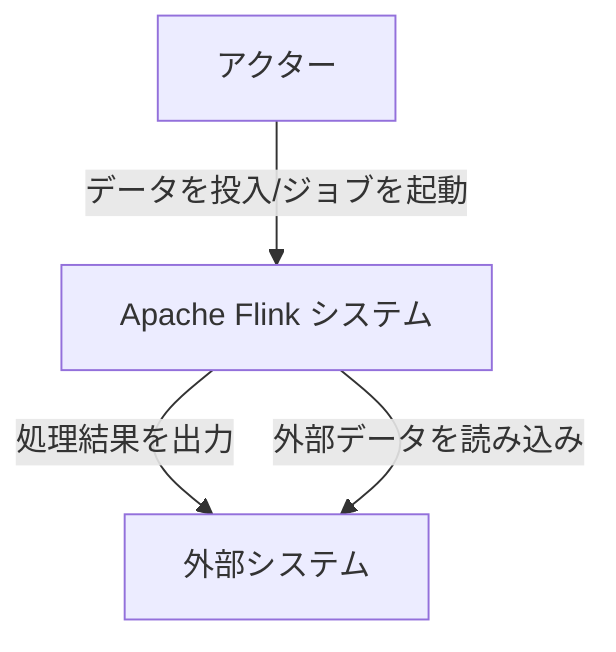
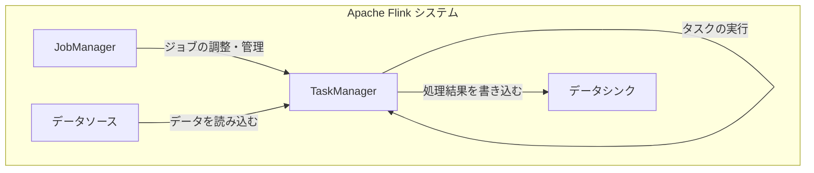
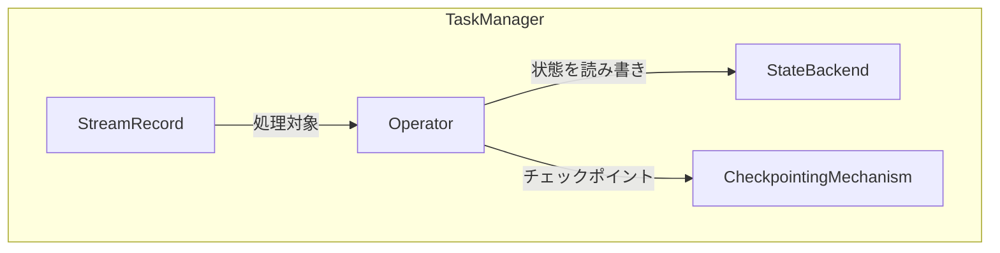
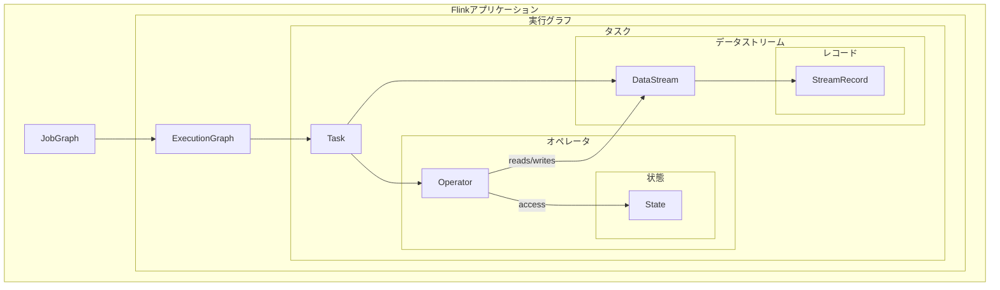
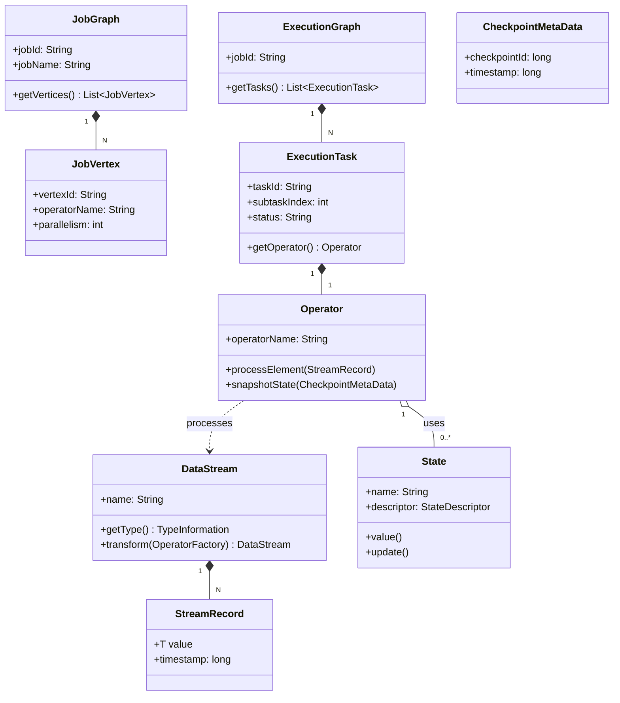

## ■概要

Apache Flinkは、バッチ処理とストリーム処理の両方をサポートするオープンソースの分散処理フレームワークです。高いパフォーマンス、スケーラビリティ、耐障害性を持ち、大規模データ処理に適しています。イベントドリブンなアプリケーションやリアルタイム分析など、幅広いユースケースで利用されています。

## ■構造

### ●システムコンテキスト図

| 要素名                | 説明                                                                                                                                       |
| --------------------- | ------------------------------------------------------------------------------------------------------------------------------------------ |
| アクター              | Flinkシステムにデータを投入したり、処理ジョブを起動したりするユーザーや他のシステムです。                                                  |
| Apache Flink システム | データ処理を実行する中心的なシステムです。                                                                                                 |
| 外部システム          | Flinkシステムが処理結果を出力したり、外部データを読み込んだりする先のシステムです。 (例: データベース, メッセージキュー, ファイルシステム) |

### ●コンテナ図

| 要素名       | 説明                                                                                                                                              |
| ------------ | ------------------------------------------------------------------------------------------------------------------------------------------------- |
| JobManager   | Flinkクラスタ全体のリソース管理、ジョブのスケジューリング、調整、障害回復などを担当するマスターノードです。高可用性構成を取ることが可能です。     |
| TaskManager  | 実際にデータ処理タスクを実行するワーカーノードです。複数のタスクスロットを持ち、並列処理を実行します。                                            |
| データソース | Flinkジョブが処理する元データを提供するコンポーネントです。ファイルシステム、メッセージキュー、データベースなど、様々な外部システムが該当します。 |
| データシンク | Flinkジョブが処理した結果を書き出す先のコンポーネントです。ファイルシステム、メッセージキュー、データベースなど、様々な外部システムが該当します。 |

### ●コンポーネント図

ここでは、TaskManager内で実行される代表的なコンポーネントの例を示します。

| 要素名                 | 説明                                                                                                                                                                            |
| ---------------------- | ------------------------------------------------------------------------------------------------------------------------------------------------------------------------------- |
| Operator               | データストリームに対して具体的な変換処理（例: Map, Filter, Window, Join）を実行するコンポーネントです。ユーザーが定義した処理ロジックが含まれます。                             |
| StreamRecord           | TaskManager内でオペレータ間を流れるデータの基本単位です。実際のデータ要素とタイムスタンプなどのメタ情報を含みます。                                                             |
| StateBackend           | オペレータが持つ状態情報（例: ウィンドウ処理の中間結果、機械学習モデルのパラメータ）を永続化・管理するコンポーネントです。メモリ、ファイルシステム、RocksDBなどが利用可能です。 |
| CheckpointingMechanism | 定期的にジョブの状態のスナップショット（チェックポイント）を作成し、障害発生時の迅速な回復を可能にするコンポーネントです。                                                      |

## ■情報

### ●概念モデル

| 要素名                | 説明                                                                                      |
| --------------------- | ----------------------------------------------------------------------------------------- |
| Flinkアプリケーション | ユーザーが定義したデータ処理ロジック全体です。                                            |
| JobGraph              | Flinkアプリケーションをクラスタで実行可能な形式に変換した論理的なデータフローグラフです。 |
| 実行グラフ            | JobGraphを物理的な実行計画に変換したもので、並列度やリソース割り当てなどが考慮されます。  |
| ExecutionGraph        | JobGraphを並列実行可能な形に展開した物理的な実行グラフです。                              |
| タスク                | TaskManager上で実行される処理の最小単位です。                                             |
| Operator              | 個々のデータ変換処理（Map、Filterなど）を表します。                                       |
| 状態                  | オペレータが処理中に保持する情報です。                                                    |
| データストリーム      | 連続的に流れるデータのシーケンスです。                                                    |
| レコード              | データストリームを構成する個々のデータ要素です。                                          |
| StreamRecord          | データストリーム内の個々のデータ要素です。                                                |

### ●情報モデル

| クラス名           | 属性/メソッド例 (主要なもの)                                                        | 説明                                                                                                               |
| ------------------ | ----------------------------------------------------------------------------------- | ------------------------------------------------------------------------------------------------------------------ |
| JobGraph           | `jobId`, `jobName`, `getVertices()`                                                 | Flinkジョブの論理的な表現です。オペレータとその接続関係を定義します。                                              |
| JobVertex          | `vertexId`, `operatorName`, `parallelism`                                           | JobGraph内の個々のオペレータまたはデータソース/シンクを表す頂点です。                                              |
| ExecutionGraph     | `jobId`, `getTasks()`                                                               | JobGraphをクラスタ上で実行可能な物理的な実行計画に変換したものです。並列インスタンスなどが具体化されます。         |
| ExecutionTask      | `taskId`, `subtaskIndex`, `status`, `getOperator()`                                 | TaskManager上で実際に実行されるタスクのインスタンスです。                                                          |
| Operator           | `operatorName`, `processElement(StreamRecord)`, `snapshotState(CheckpointMetaData)` | データの変換処理を行うコアコンポーネントです。MapFunction, FilterFunctionなどが具体例です。                        |
| DataStream         | `name`, `getType()`, `transform(OperatorFactory)`                                   | Flinkが扱う主要なデータ抽象であり、不変なレコードのシーケンスです。                                                |
| StreamRecord       | `value`, `timestamp`                                                                | データストリーム内を流れる個々のデータ要素です。実際の値と、イベント時間や処理時間などのタイムスタンプを持ちます。 |
| State              | `name`, `descriptor`, `value()`, `update()`                                         | ステートフルなオペレータが計算の途中で保持する状態情報です。キーで分割され、ローカルに保存されます。               |
| CheckpointMetaData | `checkpointId`, `timestamp`                                                         | チェックポイント処理に関するメタ情報です。IDやタイムスタンプを含み、耐障害性のために使用されます。                 |

## ■構築方法

### ●ローカル環境でのセットアップ

  * **前提条件**:
      * Java 8 以上がインストールされていること。
      * `JAVA_HOME` 環境変数が設定されていること。
  * **ダウンロード**:
      * Apache Flinkの公式サイトから最新の安定版バイナリをダウンロードします。
      * ダウンロードしたアーカイブファイルを任意のディレクトリに展開します。
  * **起動**:
      * 展開したディレクトリ内の `bin` フォルダに移動します。
      * ローカルクラスタを起動するには、`./start-cluster.sh` (Linux/macOS) または `start-cluster.bat` (Windows) を実行します。
  * **確認**:
      * Webブラウザで `http://localhost:8081` にアクセスし、Flink Web UIが表示されることを確認します。

### ●クラスタ環境でのデプロイ

  * **Standalone Cluster**:
      * 複数のマシンにFlinkをインストールし、設定ファイル (`flink-conf.yaml`) でJobManagerとTaskManagerを設定します。
      * `masters` ファイルにJobManagerのホスト名を指定します。
      * `workers` ファイルにTaskManagerのホスト名を指定します。
      * 各マシンに必要なファイルをコピーし、`./start-cluster.sh` をJobManagerノードで実行します。
  * **YARN (Yet Another Resource Negotiator)**:
      * Hadoop YARNクラスタ上でFlinkを実行する方法です。
      * YARNクライアントからFlinkジョブをサブミットするか、YARN上でFlinkセッションクラスタを起動します。
      * `flink-conf.yaml` でYARN関連の設定を行います。
  * **Kubernetes**:
      * Kubernetesクラスタ上でFlinkを実行する方法です。
      * ネイティブKubernetesインテグレーションまたはFlink Kubernetes Operatorを利用します。
      * JobManagerとTaskManagerのPodをデプロイし、サービス経由でアクセスします。
  * **クラウド環境**:
      * AWS (EMR, Kinesis Data Analytics), Azure (HDInsight), Google Cloud (Dataflow, Dataproc) などのマネージドサービスや、各クラウドプロバイダーの仮想マシン上に手動でデプロイする方法があります。

### ●設定

  * **`flink-conf.yaml`**:
      * Flinkクラスタの主要な設定ファイルです。
      * JobManagerのRPCアドレス、TaskManagerの数、各TaskManagerのスロット数、メモリ設定、チェックポイント設定、高可用性設定などを記述します。
  * **メモリ管理**:
      * JobManagerとTaskManagerのJVMヒープサイズ、オフヒープメモリ（ネットワークバッファ、マネージドメモリ）のサイズを適切に設定します。
  * **高可用性 (HA)**:
      * JobManagerの単一障害点をなくすために、ZooKeeperを利用した高可用性構成を設定します。
      * 複数のJobManagerインスタンスを起動し、1つがアクティブ、他がスタンバイとなります。

-----

## ■利用方法

### ●アプリケーション開発

  * **APIの選択**:
      * **DataStream API**: 有界または無限のデータストリームに対する処理を記述します。イベント時間処理やウィンドウ処理など、ストリーム処理特有の機能が豊富です。
      * **Table API / SQL**: リレーショナルなテーブル操作やSQLクエリライクな記述でデータ処理を定義します。DataStream APIとの相互変換も可能です。
      * **DataSet API (レガシー)**: 有界データセットに対するバッチ処理を記述します。新規プロジェクトではDataStream APIの利用が推奨されます。
  * **プログラミング言語**:
      * Java, Scala, Pythonが主要なサポート言語です。
  * **データソースとシンク**:
      * ファイルシステム (HDFS, S3, ローカルファイルシステムなど)
      * メッセージキュー (Apache Kafka, RabbitMQ, Amazon Kinesisなど)
      * データベース (JDBC経由での各種RDBMS, NoSQLデータベースなど)
      * カスタムコネクタを開発することも可能です。
  * **トランスフォーメーション**:
      * `Map`, `FlatMap`, `Filter`, `KeyBy`, `Window`, `Join`, `Aggregate` など、豊富な変換オペレータが提供されています。
  * **状態管理**:
      * ステートフルな処理（例: ウィンドウ集計、機械学習モデルの更新）では、Flinkの提供する状態管理機能を利用します。
      * 状態の永続化先として、メモリ、ファイルシステム、RocksDBなどを選択できます。
  * **イベント時間とウォーターマーク**:
      * イベント時間セマンティクスに基づいた処理が可能です。
      * 遅延データや順序不正データを扱うためにウォーターマークを利用します。

### ●ジョブのサブミット

  * **CLI (Command Line Interface)**:
      * `flink run` コマンドを使用して、パッケージ化されたFlinkアプリケーション（JARファイル）をクラスタにサブミットします。
      * 実行パラメータ（並列度、クラスパスなど）を指定できます。
  * **Web UI**:
      * Flink Web UIからJARファイルをアップロードし、ジョブをサブミットすることも可能です。
  * **REST API**:
      * FlinkはREST APIを提供しており、プログラム経由でジョブのサブミットや管理が可能です。

### ●ライブラリと拡張

  * **コネクタ**: 各種外部システムとの接続を容易にするためのライブラリです。
  * **フォーマット**: CSV, JSON, Avro, Parquetなど、様々なデータフォーマットを扱うためのライブラリです。
  * **CEP (Complex Event Processing)**: 複雑なイベントパターンの検知を行うためのライブラリです。
  * **Gelly**: グラフ処理を行うためのライブラリです。
  * **FlinkML**: 機械学習アルゴリズムを実装するためのライブラリです。

-----

## ■運用

### ●モニタリング

  * **Flink Web UI**:
      * 実行中のジョブの状況、各タスクのステータス、スループット、レイテンシなどのメトリクスを視覚的に確認できます。
      * JobManagerやTaskManagerのログも参照可能です。
      * チェックポイントの履歴や状態サイズも確認できます。
  * **メトリクスシステム**:
      * Flinkは詳細なメトリクスを収集し、JMX, Prometheus, Graphite, InfluxDBなどの外部モニタリングシステムに連携できます。
      * CPU使用率、メモリ使用量、GCアクティビティ、ネットワークI/O、レコード処理数などのメトリクスを監視します。
  * **ロギング**:
      * JobManagerとTaskManagerのログ出力を設定し、集約・分析することで問題の早期発見に繋げます。
      * Log4j 2 がデフォルトのロギングフレームワークとして使用されます。

### ●スケーリング

  * **並列度の調整**:
      * ジョブ全体の並列度や、個々のオペレータの並列度を実行時または再サブミット時に調整できます。
      * 処理負荷やリソース状況に応じてスケールアウト・スケールインを行います。
  * **TaskManagerの増減**:
      * クラスタ内のTaskManagerの数を増減させることで、処理能力を調整します。
      * YARNやKubernetes環境では、リソースマネージャと連携して動的にスケーリングすることも可能です。

### ●耐障害性とリカバリ

  * **チェックポイント**:
      * 定期的にアプリケーションの状態のスナップショット（チェックポイント）を永続ストレージ（HDFS, S3など）に保存します。
      * タスク障害やTaskManager障害が発生した場合、最新の成功したチェックポイントから処理を再開します。
      * チェックポイントの間隔やタイムアウトを設定します。
  * **セーブポイント**:
      * ユーザーが手動でトリガーする、アプリケーションの状態のスナップショットです。
      * アプリケーションのバージョンアップ、設定変更、クラスタ移行などの際に利用します。
  * **JobManagerの高可用性 (HA)**:
      * ZooKeeperと連携してJobManagerのフェイルオーバーを実現します。
      * アクティブなJobManagerに障害が発生すると、スタンバイJobManagerが処理を引き継ぎます。

### ●アップグレードとメンテナンス

  * **Flinkバージョンのアップグレード**:
      * 公式ドキュメントの手順に従い、Flinkクラスタのバージョンをアップグレードします。
      * セーブポイントを利用して、ジョブの状態を維持しながらアップグレードを行うことが推奨されます。
  * **アプリケーションの更新**:
      * 新しいバージョンのアプリケーションコードをデプロイします。
      * ダウンタイムを最小限に抑えるために、セーブポイントを利用したジョブの再起動や、Blue/Greenデプロイメントのような戦略を検討します。
  * **設定変更**:
      * `flink-conf.yaml` などの設定ファイルを変更し、クラスタを再起動します。
      * 動的に変更可能な設定もあります。

### ●セキュリティ

  * **認証**:
      * Kerberosなどを利用して、Flinkクラスタへのアクセスや内部コンポーネント間の通信を認証します。
  * **認可**:
      * Apache Rangerなどの外部ツールと連携して、ジョブのサブミットやデータアクセスに関する権限管理を行います。
  * **暗号化**:
      * 内部通信 (RPC, データ転送) やチェックポイント/セーブポイントのデータをSSL/TLSで暗号化します。
      * 機密データ（パスワードなど）をセキュアに管理します。

-----

## ■参考リンク

### 概要

  * [Apache Flink® — Stateful Computations over Data Streams](https://flink.apache.org/)
  * [What is Apache Flink? | Apache Flink](https://flink.apache.org/what-is-flink/flink-architecture/)
  * [Use Cases | Apache Flink](https://flink.apache.org/what-is-flink/use-cases/)
  * [Concepts - Apache Flink 2.0 Documentation](https://nightlies.apache.org/flink/flink-docs-release-2.0/docs/concepts/overview/)

### 構造

  * [Flink Architecture - Apache Flink 2.0 Documentation](https://nightlies.apache.org/flink/flink-docs-release-2.0/docs/concepts/flink-architecture/)

### 構築方法

  * [Installation | Apache Flink](https://flink.apache.org/downloads/) (ダウンロードとインストール)
  * [Local Mode Setup - Apache Flink 2.0 Documentation](https://nightlies.apache.org/flink/flink-docs-release-2.0/docs/try-flink/local_installation/)
  * [Deployment - Apache Flink 2.0 Documentation](https://nightlies.apache.org/flink/flink-docs-release-2.0/docs/deployment/overview/)
  * [Configuration - Apache Flink 2.0 Documentation](https://nightlies.apache.org/flink/flink-docs-release-2.0/docs/deployment/config/)
  * [High Availability (HA) - Apache Flink 2.0 Documentation](https://nightlies.apache.org/flink/flink-docs-release-2.0/docs/deployment/ha/overview/)

### 利用方法

  * [DataStream API - Apache Flink 2.0 Documentation](https://nightlies.apache.org/flink/flink-docs-release-2.0/docs/dev/datastream/overview/)
  * [Table API & SQL - Apache Flink 2.0 Documentation](https://nightlies.apache.org/flink/flink-docs-release-2.0/docs/dev/table/overview/)
  * [DataStream Connectors - Apache Flink 2.0 Documentation](https://nightlies.apache.org/flink/flink-docs-release-2.0/docs/connectors/datastream/overview/)
  * [State - Apache Flink 2.0 Documentation](https://nightlies.apache.org/flink/flink-docs-release-2.0/docs/dev/datastream/fault-tolerance/state/)

### 運用

  * [Metrics - Apache Flink 2.0 Documentation](https://nightlies.apache.org/flink/flink-docs-release-2.0/docs/ops/metrics/)
  * [Logging - Apache Flink 2.0 Documentation](https://nightlies.apache.org/flink/flink-docs-release-2.0/docs/deployment/advanced/logging/)
  * [Traces - Apache Flink 2.0 Documentation](https://nightlies.apache.org/flink/flink-docs-release-2.0/docs/ops/traces/)
  * [Scaling - Apache Flink 2.0 Documentation](https://nightlies.apache.org/flink/flink-docs-release-2.0/docs/deployment/elastic_scaling/)
  * [Fault Tolerance - Apache Flink 2.0 Documentation](https://nightlies.apache.org/flink/flink-docs-release-2.0/docs/learn-flink/fault_tolerance/)
  * [Checkpoints - Apache Flink 2.0 Documentation](https://nightlies.apache.org/flink/flink-docs-release-2.0/docs/ops/state/checkpoints/)
  * [Savepoints - Apache Flink 2.0 Documentation](https://nightlies.apache.org/flink/flink-docs-release-2.0/docs/ops/state/savepoints/)
  * [Upgrading Applications and Flink Versions - Apache Flink 2.0 Documentation](https://nightlies.apache.org/flink/flink-docs-release-2.0/docs/ops/upgrading/)
