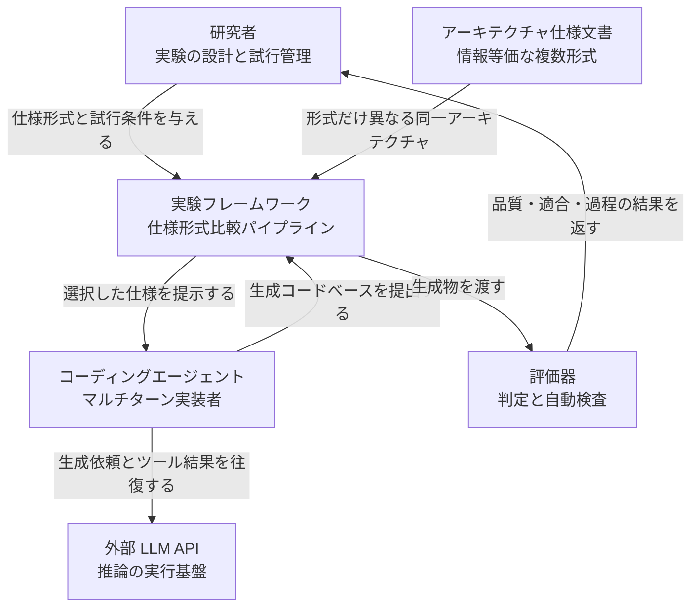
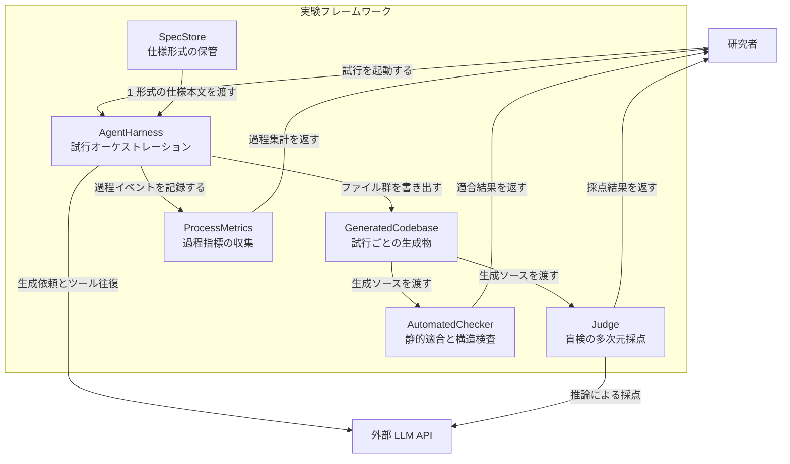
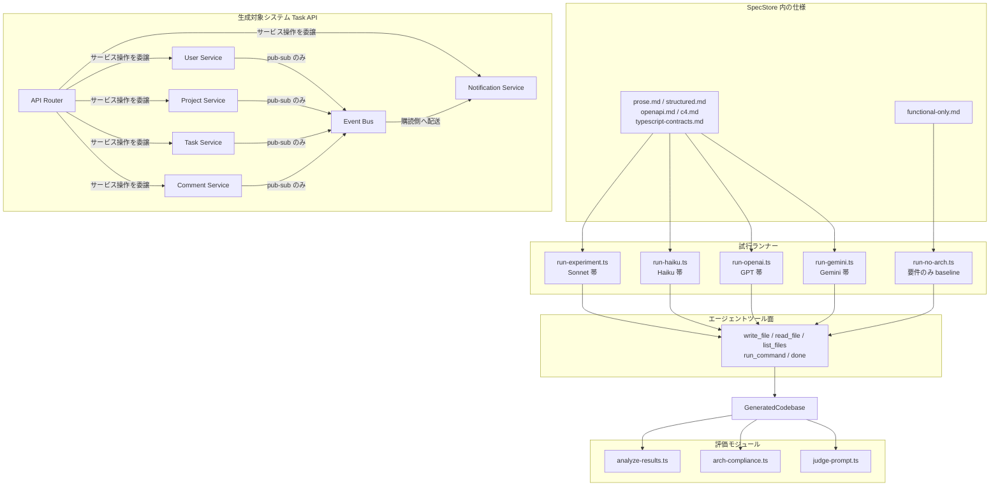
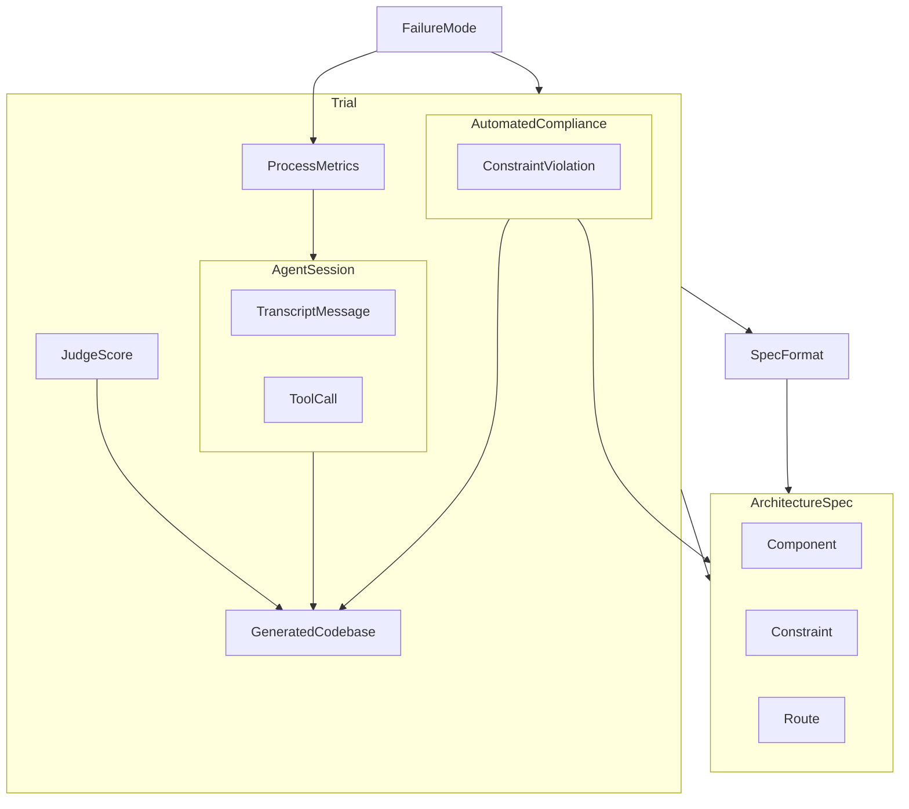
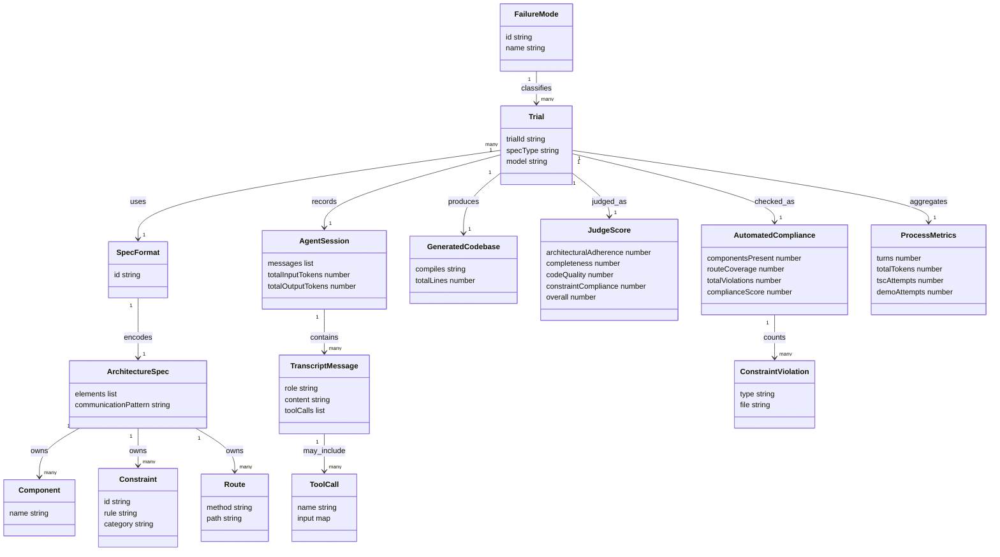

コーディングエージェントに「同じ設計情報」を渡すとき、散文で書くか、Mermaid で書くか、OpenAPI で書くか、TypeScript の型で書くかで、出来上がるコードは変わるのでしょうか。

Siemens Digital Industries Software の Arquimedes Canedo 氏による論文 [Architecture as Capability Equalizer for Coding Agents](https://arxiv.org/abs/2608.21747)（arXiv:2608.21747v1、2026-08-22 提出）は、この問いを 5 形式 × 6 モデル × 3 反復の factorial 実験で測っています。93 trial 分の transcript・生成コード・judge 結果・harness が [GitHub](https://github.com/arquicanedo/architecture-as-equalizer) で公開されています。

この記事では、実験の設計と公開データの構造、実際に手元で再現・再分析する手順、そして「自社のエージェント運用で仕様形式をどう選ぶか」までを整理します。読み終えると、モデル帯ごとにどの仕様形式を渡すべきか、そして何をデプロイゲートに置くべきかを判断できます。


*この記事の全体像。以下、順に解説します。*

## 概要

論文が立てる問いは 2 つです。

1. アーキテクチャ仕様の表現形式は、コーディングエージェントの生成品質に効くか
2. その効果はモデル能力と交互作用するか（format × model）

前提として「案内があること自体の効果」は別条件で確認済みです。Sonnet 4.6 で要件のみ（no-architecture、3 trials）と prose 条件を比べると、総合 judge スコアは 5.08 から 8.42 へ上がります（Δ +3.34）。本編はその上で「同じ内容をどの形式で渡すか」だけに絞っています。

対象システム（SUT）は Task Management API です。コンポーネントは 7 個（API Router、User / Project / Task / Comment / Notification Service、Event Bus）、HTTP ルートは 25 本、記憶はインメモリのみです。サービス間通信は Event Bus の pub/sub に限定されます。

実験規模は 5 形式 × 6 モデル × 3 反復 = 90 trials に、no-architecture baseline 3 trials を加えた 93 本です。

| 軸 | 水準 |
|---|---|
| 仕様形式 | Prose / Mermaid+Constraints+ADRs / OpenAPI+Mermaid+Constraints / C4・Structurizr DSL / TypeScript Contracts+ArchUnit-style rules |
| モデル | Sonnet 4.6, Haiku 4.5, GPT-5, GPT-5-mini, Gemini 2.5 Pro, Gemini 2.5 Flash |
| ベンダー | Anthropic / OpenAI / Google |
| 評価 | LLM judge 4 次元、自動 route coverage / compliance、プロセス指標 |
| 公開資産 | 93 trial + `arquicanedo/architecture-as-equalizer` |

中心主張は **capability equalizer** です。構造化された仕様は、主に弱いモデルの能力ギャップを埋めます。つまり価値はモデル強度と逆相関し、コスト最適化のためにあえて小さいモデルを使うデプロイほど回収が大きくなります。

## 特徴

- format × model の交互作用を 5×6 factorial で測る
- frontier（Sonnet 4.6 / GPT-5）では形式差が小さい（spread 0.17 / 0.92）
- 非 frontier では spread が広がる（論文掲載値で 0.83〜2.42、judge のパース失敗を除くと 0.83〜1.67）
- コード近接形式（OpenAPI、TypeScript contracts）が能力ギャップの大半を回収する
- TypeScript contracts は最弱モデルの API ルート網羅を 33% から 100% にする（情報内容は同一で形式のみ差分）
- inverted cost: Haiku 4.5 は平均 735K tokens で総合 6.50、Sonnet 4.6 は 640K で 8.42
- 失敗を 3 型に分類する（compilation death spiral / premature termination / perfectionist iteration）
- self-validation の demo 実行率が Sonnet 100% から Gemini Flash 0% まで単調に下がる
- 静的適合（自動検証範囲は約 80%）と LLM-as-judge が相補的（constraint 次元の相関 r=0.21）

### format × model の総合スコア

論文 Table V の値です。公開 CSV `all-trials-stats.csv` のセル平均と一致します。

| Format | Sonnet 4.6 | Haiku 4.5 | GPT-5 | GPT-5-mini | Gemini 2.5 Pro | Gemini 2.5 Flash |
|---|---:|---:|---:|---:|---:|---:|
| Prose | 8.42 | 5.58 | 7.33 | 6.08 | 5.83 | 5.75 |
| Mermaid + Constr. + ADRs | 8.50 | 6.42 | 7.17 | 6.92 | 6.42 | 6.00 |
| OpenAPI + Mermaid + Constr. | 8.42 | 7.25 | 6.58 | 6.83 | 6.92 | 6.50 |
| C4 / Structurizr DSL | 8.33 | 6.42 | 6.83 | 6.75 | 6.67 | 6.83 |
| TS Contracts + ArchUnit Rules | 8.42 | 7.08 | 7.50 | 6.83 | 4.50 | 6.67 |
| Average | 8.42 | 6.55 | 7.08 | 6.68 | 6.07 | 6.35 |
| Format spread | 0.17 | 1.67 | 0.92 | 0.83 | 2.42 | 1.08 |

Sonnet 4.6 の行はほぼ平坦です。形式を変えても 8.33〜8.50 の範囲に収まります。一方 Haiku 4.5 は prose の 5.58 から OpenAPI の 7.25 まで 1.67 動きます。これが equalizer の中身です。

ただし Gemini 2.5 Pro × TS Contracts の 4.50 は、そのまま性能として読めません。公開データの `trials-gemini-25-pro/typescript-contracts-3/judge-score.json` は 4 次元すべてと overall が 0 で、`notes` に `Parse error:` が記録されています。切り捨てられた応答本文には `architecturalAdherence: 5` / `completeness: 7` / `codeQuality: 6` / `constraintCompliance: 5` が残っており、judge 自体は採点していました。judge の定義域は 1〜10 なので、この 0 は採点結果ではなくパース失敗の sentinel です。

この 1 件を欠損として除くと、同じ列の見え方が変わります。残る 2 trial は `typescript-contracts-1` が (6+8+7+6)/4 = 6.75、`typescript-contracts-2` が (6+8+8+5)/4 = 6.75 です。

| Gemini 2.5 Pro | 論文掲載値 | パース失敗を除いた値 |
|---|---:|---:|
| TS Contracts | 4.50 | 6.75 |
| Format spread | 2.42 | 1.09 |
| Average | 6.07 | 6.50 |

つまり「Gemini 2.5 Pro は形式差が最も激しい（spread 2.42）」という見え方は、集計事故に由来します。補正後の spread 1.09 は Gemini 2.5 Flash の 1.08 とほぼ同じで、非 frontier の spread は 0.83〜1.67 の範囲に収まります。以降で「非 frontier ほど形式が効く」と述べるときは、この補正後の範囲を指します。

なお、公開 CSV の `judgeOverall` 全 trial 平均は Haiku 6.55 / GPT-5-mini 6.68 ですが、論文 Table IX はそれぞれ 6.50 / 6.72 です。CSV 側に 6.72 という値は存在せず、論文表と CSV は一致しません。以降のトークン関連の数値は CSV を正とします。

### Gemini 2.5 Flash の自動検証

論文 Table VIII の値です。最弱モデルで形式差が最も鮮明に出ます。

| Format | Route coverage | Compliance |
|---|---:|---:|
| Prose | 33% | 71% |
| Mermaid + Constr. | 33% | 73% |
| OpenAPI + Mermaid + Constraints | 33% | 72% |
| C4 | 67% | 85% |
| TS Contracts | 100% | 100% |

散文でも図でも OpenAPI でも 33% にとどまり、TypeScript の型定義を渡した瞬間に 100% になります。TS Contracts は 6 モデルすべてで route coverage 100% かつ compliance 100% を達成する唯一の形式です。

### 関連研究との位置づけ

| 項目 | SWE-bench | BaxBench | Constraint Decay | CodeSpec | ConCodeEval | 本論文 |
|---|---|---|---|---|---|---|
| 粒度 | 実 GitHub issue 修復 | API 機能 | 制約密度 | 実行可能仕様 | データスキーマ形式 | システム級アーキテクチャ |
| ターン | エージェント | 単一 | エージェント | 複数 | 形式比較タスク | 複数（最大 50） |
| 測るもの | 機能修正の正否 | 機能テスト | 制約積層の減衰 | 生成チェッカー | スキーマ表記 | 建築品質・route・過程 |
| 固定するもの | リポジトリ課題 | prose vs OpenAPI | OpenAPI + 制約量 | 生成チェッカー | スキーマ表記 | 内容固定・形式のみ変化 |
| 公開物 | ベンチマーク | ベンチマーク | 論文 | 手法 | ベンチマーク | 93 trials + harness |

SWE-bench は機能正しさの系譜です。本論文は同一設計の仕様形式比較であり、issue 修復ベンチではありません。本論文が引用する [BaxBench](https://arxiv.org/abs/2502.11844) は OpenAPI で pass@1 が +5.8%〜+9.6% と報告しています（後続版では数値が更新されています）。[Constraint Decay](https://arxiv.org/abs/2605.06445) は L0 の A% が 50% を超える 8 構成で、L0 から L3 へ assertion pass rate が平均 30 ポイント下がると報告します。[CodeSpec](https://arxiv.org/abs/2607.26777) は FeatureBench Lite の指示長 3,000〜5,000 語群で、実行可能仕様 71.8% 対テキスト 43.8% です。

用語の注意が 2 点あります。C4 / Structurizr は入力形式の一つであり、本研究は C4 準拠度そのもののベンチマークではありません。ArchUnit も本番の Java テストランナーではなく、仕様中の `RULE` 擬似宣言と自前の静的チェッカーです。

## 構造

ここで示す C4 相当の図は、論文が提案する実験フレームワークの論理構造です。物理デプロイや単一バイナリの存在を意味しません。生成対象の Task API はコンポーネント図の別 subgraph として分けて示します。

### システムコンテキスト図

研究者は情報等価な仕様をパイプラインへ渡し、コーディングエージェントは外部 LLM API と往復してコードを生成します。評価器は品質・適合・過程の結果を研究者へ返します。



| 要素名 | 説明 |
|---|---|
| 研究者 | 仕様形式・モデル条件・反復を設計し、評価結果を解釈する主体 |
| コーディングエージェント | 仕様を読み、ファイル操作とコマンド実行を繰り返して実装する論理アクター |
| アーキテクチャ仕様文書 | 同一アーキテクチャを異なる表現で書いた入力群。形式だけが実験因子 |
| 評価器 | 盲検採点と静的適合と過程指標を取る論理アクター |
| 外部 LLM API | エージェントと判定が依存する推論基盤。ベンダー実装は役割名に抽象化 |
| 実験フレームワーク | 仕様投入・試行実行・評価集約を束ねる論理システム境界 |

### コンテナ図

実験フレームワークを、仕様保管・実行・生成物・3 系統の評価に分解します。



| 要素名 | 説明 |
|---|---|
| SpecStore | 情報等価な仕様形式群を保持し、試行ごとに 1 本文を供給する |
| AgentHarness | 清浄ディレクトリ上でマルチターン試行を回し、ツール結果を返す |
| GeneratedCodebase | 1 試行の出力ソースツリー。以降の評価入力 |
| Judge | 仕様形式を知らずに 4 次元を採点する |
| AutomatedChecker | インポート解析・経路被覆・構造完全性を測る |
| ProcessMetrics | トークン・ターン・コンパイル・自己検証を集める |

Judge は全ラウンドで Claude Sonnet 4.6 に固定されています。仕様形式は伏せられるため、judge は「どの形式から生まれたコードか」を知りません。

### コンポーネント図

公開 harness のランナー・5 ツール・評価モジュール・仕様セットと、生成対象の Task API を分けて示します。



試行ランナーはベンダーごとに分かれています。

| 要素名 | 説明 |
|---|---|
| `run-experiment.ts` | Sonnet 向け本流ランナー。仕様読込・ツールループ・事後評価 |
| `run-haiku.ts` | Haiku 向け。形式 × 能力の対をつくる |
| `run-openai.ts` | GPT-5 / GPT-5-mini。`OPENAI_MODEL` で切替 |
| `run-gemini.ts` | Gemini Pro / Flash。`GEMINI_MODEL` で切替 |
| `run-no-arch.ts` | `functional-only.md` を使う baseline |

エージェントに与えられるツールは 5 つだけです。

| 要素名 | 説明 |
|---|---|
| `write_file` | 生成ディレクトリへソースを書く |
| `read_file` | 既に書いたファイルを読む |
| `list_files` | 生成ツリーを列挙する（`node_modules` 除外） |
| `run_command` | `tsc` や `npx tsx src/demo.ts` を実行する。タイムアウト 15 秒 |
| `done` | 完了シグナル |

評価モジュールと集計スクリプトは次のとおりです。

| 要素名 | 説明 |
|---|---|
| `analyze-results.ts` | 構造完全性・制約違反・コード量・転写メトリクスを試行単位で集計する |
| `arch-compliance.ts` | コンポーネント存在・通信・制約・経路・所有・配置を加重した適合スコアを出す |
| `judge-prompt.ts` | 仕様形式を伏せたまま 4 次元採点を外部 LLM 判定に依頼する |
| `crunch-numbers.ts` | `all-trials-stats.csv` を生成する集計。CSV 正本の書き手 |
| `analyze-no-arch.ts` | `trials-no-arch` 専用の再分析 |
| `run-remaining.ts` | Sonnet の残り trial を concurrency=3 で埋める補助 runner |

SpecStore に置かれる仕様は 6 本です。うち 5 本が実験因子、1 本が baseline です。

| 要素名 | 説明 |
|---|---|
| `prose.md` | 自然言語の設計書。対照条件 |
| `structured.md` | Mermaid・番号付き制約・ADR |
| `openapi.md` | OpenAPI 3.0.3 YAML を含む |
| `c4.md` | C4 / Structurizr DSL |
| `typescript-contracts.md` | 型インタフェースと ArchUnit 風 `RULE` |
| `functional-only.md` | 機能要件のみの baseline |

生成対象の Task API は、サービス間の直接呼び出しを禁じた構成です。

| 要素名 | 説明 |
|---|---|
| API Router | HTTP 入口。サービス間の直接呼出しは持たない |
| User Service | ユーザ CRUD と自ストア所有 |
| Project Service | プロジェクト CRUD とメンバ管理 |
| Task Service | タスク CRUD と前方のみの状態遷移 |
| Comment Service | タスクへのコメント |
| Notification Service | イベント駆動の通知生成 |
| Event Bus | サービス間通信の唯一の仲介 |

## データ

以下のフィールド名は `harness/types.ts` と trial JSON、`results/arch-compliance.csv`、`results/all-trials-stats.csv` を正とします。論文に記載がなく実装から補った属性には注記を付けます。

### 概念モデル

所有関係を subgraph、利用関係を矢印で示します。エンティティ名のみです。



| 要素名 | 説明 |
|---|---|
| SpecFormat | 情報内容は同一で表現だけが異なる。実装 `SpecType` は `prose` / `structured` / `openapi` / `c4` / `typescript-contracts` |
| ArchitectureSpec | 論文 §III-B の 7 要素。Component / Constraint / Route を所有する |
| Component | 論文では 7 論理要素。静的検査は main entry と demo を加えた 9 presence check |
| Constraint | 論文の 6 hard rules。静的側は `ConstraintAnalysis` の違反カテゴリ |
| Route | API surface。論文・検査とも 25 HTTP routes |
| Trial | 形式 × モデルのセル内で行われる 1 反復。セルは 30 個（5 形式 × 6 モデル）で、各セル n=3 |
| AgentSession | 実装型 `TrialTranscript` |
| GeneratedCodebase | `code/` 配下の生成ソースツリー |
| JudgeScore | 4 次元 1〜10 と overall |
| AutomatedCompliance | 加重 `complianceScore` と route coverage |
| ProcessMetrics | トークン・TSC・demo・rewrite |
| FailureMode | death spiral / premature termination / perfectionist iteration |

### 情報モデル

主要な属性を型付きで示します。型は概念的な `string` / `number` / `list` / `map` です。



主要属性の出典と意味は次のとおりです。

| 属性 | 出典 | 説明 |
|---|---|---|
| `SpecFormat.id` | `SpecType` | `prose` / `structured` / `openapi` / `c4` / `typescript-contracts` |
| Component 9 checks | `arch-compliance.ts` | 7 論理要素 + `hasMainEntry` + `hasDemoScript` |
| `Constraint.category` | `ConstraintAnalysis` | `directServiceCalls` / `sharedDataAccess` / `httpInServices` / `invalidStatusTransitions` / `externalDependencies` |
| `Route.path` | `openapi-validator.ts` | 検査定数。合計 25 |
| `JudgeScore.*` | `judge-score.json` | 各次元の有効値は 1〜10。`overall` は平均。0 は採点値ではなく judge 応答のパース失敗を表す sentinel |
| `AutomatedCompliance.complianceScore` | `ArchCompliance` | 0〜100。重みは Components 20 / Communication 20 / Constraints 20 / Routes 20 / Data 10 / Structure 10 |
| `ProcessMetrics.turns` | `all-trials-stats.csv` | エージェントターン数 |
| `FailureMode` | 論文 §VI-G | `types.ts` に対応する型はない |
| `ToolCall.error` / `compiles` / `servicePerFile` | 実装 boolean | classDiagram の制約上ここでは `string`。JSON では true/false |
| `rewriteRate` / `demoRunRate` / `scorePer100K` | 論文派生 | CSV の生列は `fileRewrites` / `demoAttempts` / `totalTokens`。率は集計後 |

読むときの注意点が 3 つあります。

- `functional-only.md` は `SpecType` ユニオンの外にあります。baseline の成果は `trials-no-arch/` に置かれます
- モデル能力は独立クラスではなく `Trial.model`（CSV の `model` 列）として保持されます。vendor / modelId / tier（frontier / mid / small）は論文記述からの補完です
- `RouteCoverage` と `ComplianceScore` も独立型ではなく `AutomatedCompliance` の属性です。`ExperimentSummary` は初期 2 形式比較用のレガシ型で、現行 5×6 の正本は CSV です

## 構築方法

### 前提条件

- Node.js と npm（`npx tsx` を使用）
- ベンダー API キー（必要な組み合わせは後述の必須パラメータ表）
- `specs/` と `harness/` が同一 clone にあること（runner は `path.resolve(ROOT, "..")` で `specs/` を読む）

論文 §IV の共有パラメータは次のとおりです。

- Max output tokens / turn: 16,384
- Max turns / trial: 50
- Temperature: デフォルト
- Tools: `write_file`, `read_file`, `list_files`, `run_command`, `done`
- Judge: Claude Sonnet 4.6（全ラウンド共通）

### クローンと依存関係

```bash
git clone https://github.com/arquicanedo/architecture-as-equalizer.git
cd architecture-as-equalizer/harness
npm install
```

`harness/package.json` の name は `architecture-experiment-harness`、`"type": "module"` です。

| 種別 | パッケージ | 用途 |
|---|---|---|
| dependencies | `@anthropic-ai/sdk` ^0.39.0 | Sonnet / Haiku と全 judge |
| dependencies | `openai` ^7.5.0 | GPT runner / rejudge |
| dependencies | `@google/genai` ^2.17.1 | Gemini runner |
| devDependencies | `tsx` ^4.19.0 | `npx tsx` |
| devDependencies | `@types/node` ^26.2.0 | 型定義 |
| devDependencies | `typescript` ^5.7.0 | 型チェック |
| scripts | `experiment` | `npx tsx run-experiment.ts` |
| scripts | `analyze-only` | `npx tsx analyze-only.ts` |

### ベンダー別 runner の起動

CLI フラグは提供されていません。モデル切替は環境変数です。ソースに `requiredOption` 系の引数パーサはありません。

```bash
cd harness

ANTHROPIC_API_KEY=your-key npx tsx run-experiment.ts

ANTHROPIC_API_KEY=your-key npx tsx run-haiku.ts

OPENAI_API_KEY=your-key ANTHROPIC_API_KEY=your-key OPENAI_MODEL=gpt-5 npx tsx run-openai.ts

GOOGLE_API_KEY=your-key ANTHROPIC_API_KEY=your-key GEMINI_MODEL=gemini-2.5-pro npx tsx run-gemini.ts

ANTHROPIC_API_KEY=your-key npx tsx run-no-arch.ts
```

ソース定数として埋め込まれているモデル ID は次のとおりです。

| Runner | Agent model | Judge |
|---|---|---|
| `run-experiment.ts` | `claude-sonnet-4-6@default` | 同左 |
| `run-haiku.ts` | `claude-haiku-4-5@20251001` | `claude-sonnet-4-6@default` |
| `run-openai.ts` | `process.env.OPENAI_MODEL`（既定 `gpt-5-mini`） | `claude-sonnet-4-6@default` |
| `run-gemini.ts` | `process.env.GEMINI_MODEL`（既定 `gemini-2.5-flash`） | `claude-sonnet-4-6@default` |
| `run-no-arch.ts` | `claude-sonnet-4-6@default` | 同左 |

ここは再現時にそのままでは通らない箇所です。runner は `import Anthropic from "@anthropic-ai/sdk"` と `new Anthropic({ apiKey: process.env.ANTHROPIC_API_KEY })` で Claude API を直接叩きますが、埋め込まれたモデル ID は `claude-haiku-4-5@20251001` / `claude-sonnet-4-6@default` という Google Cloud（Vertex AI）形式の表記です。Claude API の ID は `claude-haiku-4-5-20251001` のようにハイフン区切りで、`@` は付きません。

`claude-sonnet-4-6@default` は全 runner の judge に使われるため、影響は Haiku に限りません。前掲の 5 コマンドはいずれも、公開コードのモデル定数を Claude API 用 ID（`claude-sonnet-4-6` など）へ直してから実行する必要があります。Vertex 経由で動かすなら、`@anthropic-ai/vertex-sdk` と Application Default Credentials へ差し替えてください。

### API キーなしで既存 trial を検証する

公開データセットの数値を確かめるだけなら、フル再実行は不要です。

```bash
cd architecture-as-equalizer/harness
npx tsx arch-compliance.ts
# 出力: ../results/arch-compliance.csv
# 入力: 各 trials*/<spec>-<n>/{analysis.json,code/}
```

25 ルートの検査定数は `harness/openapi-validator.ts` の `SpecRoute` 配列です。生成を回さずに被覆を再計算できます。

### 再分析コマンド

```bash
cd harness
npx tsx analyze-only.ts
npx tsx arch-compliance.ts
npx tsx rejudge-gpt5.ts
npx tsx crunch-numbers.ts
```

- `analyze-only.ts` は `TRIALS_DIR=trials` 固定のため **Sonnet の trial のみ** を対象にします
- `arch-compliance.ts` は `trials*` と `trials-no-arch` を走査し `results/arch-compliance.csv` を書きます
- `rejudge-gpt5.ts` は `OPENAI_API_KEY` が必須です。各形式の第 1 trial を GPT-5 で再採点します

### スキップ挙動は runner ごとに違う

README の「Skips already-completed trials」は全 runner への一般化としては過大です。実際の挙動はソースごとに異なります。再実行時の課金に直結するため、事前に確認してください。

| Runner | スキップ条件 | 再実行時の挙動 |
|---|---|---|
| `run-experiment.ts` | なし | 毎回 `code/` を削除して再生成 |
| `run-haiku.ts` | なし | 同上 |
| `run-openai.ts` | `judge-score.json` が存在 | Skip |
| `run-gemini.ts` | 同上 | Skip |
| `run-no-arch.ts` | 同上 | Skip |
| `rejudge-gpt5.ts` | `judge-score-gpt5.json` が存在 | Skip |

ターン上限は定数で固定されています。

```typescript
const MAX_TOKENS = 16384;
const MAX_TURNS = 50;
```

ループは `for (let turn = 0; turn < MAX_TURNS && !finished; turn++)` です。終了条件は `done` の呼び出し、stop / `end_turn`、または max turns 到達です。

## 利用方法

エージェントへ仕様を渡すときの要点は 3 つです。

- 仕様本文は `specs/*.md` の全文をユーザーメッセージへ埋め込む
- 契約ファイルを別アセットとしてマウントする経路はない
- 単一形式だけ回す公式フラグはない。harness は 5 形式を自動巡回する

### 必須パラメータ

| パラメータ | 必須条件 | 役割 / 既定 |
|---|---|---|
| `ANTHROPIC_API_KEY` | 常時 | Sonnet 4.6 judge。OpenAI / Gemini runner でも必須 |
| `OPENAI_API_KEY` | `run-openai.ts` / `rejudge-gpt5.ts` | GPT エージェントまたは再 judge |
| `OPENAI_MODEL` | 任意 | 既定 `gpt-5-mini`。例: `gpt-5` |
| `GOOGLE_API_KEY` | `run-gemini.ts` | Gemini エージェント |
| `GEMINI_MODEL` | 任意 | 既定 `gemini-2.5-flash`。例: `gemini-2.5-pro` |
| CLI フラグ | なし | 公式のオプションパーサは存在しない |

### エージェントに与える 5 ツール

| ツール | 入力 | 動作 |
|---|---|---|
| `write_file` | `path`, `content` | 相対パスへ書き込み |
| `read_file` | `path` | 既存ファイル読取 |
| `list_files` | なし | 再帰一覧（`node_modules` 除外） |
| `run_command` | `command` | `cwd=projectDir`、15 秒タイムアウト |
| `done` | `summary` | ループ終了 |

ツール結果は transcript 記録時に 4000 文字で truncate されます。

### 仕様ファイルの選び方

| ファイル | 形式 | 向いている用途 |
|---|---|---|
| `specs/prose.md` | Prose | frontier のコスト効率対照 |
| `specs/structured.md` | Mermaid + 制約 + ADR | 図と番号付き制約 |
| `specs/openapi.md` | OpenAPI 3.0.3 | mid-tier 向けコード近接 |
| `specs/c4.md` | Structurizr DSL | 階層分解 |
| `specs/typescript-contracts.md` | 型 + `RULE` | small モデルのルート網羅 |
| `specs/functional-only.md` | 要件のみ | `run-no-arch.ts` 専用 |

### TypeScript contracts の渡し方

runner は契約ファイルを別アセットとして渡しません。`specs/typescript-contracts.md` の全文をユーザーメッセージへ埋め込みます。

```text
# Architecture Specification

<specs/typescript-contracts.md の全文>

---

Implement this system now. Write each file using the write_file tool.
```

`RULE` の実文は次のような擬似宣言です。

```text
RULE 1: NO_CROSS_SERVICE_IMPORTS
  Files matching "services/*-service.ts"
    MUST NOT import from other files matching "services/*-service.ts"
  EXCEPT: importing shared type definitions is allowed
  REASON: Services communicate only through the Event Bus

RULE 3: HTTP_ONLY_IN_ROUTER
  Files matching "services/*-service.ts" MUST NOT import "http" or "node:http"
  Only "router.ts" and "main.ts" may handle HTTP

RULE 5: NO_EXTERNAL_PACKAGES
  No file MUST import from packages not in Node.js built-in modules
```

ArchUnit 本体は harness では実行されません。静的検証を担うのは `analyze-results.ts` と `arch-compliance.ts` です。

### OpenAPI YAML の置き方

`specs/openapi.md` の中に fenced YAML として置かれます。先頭は `openapi: 3.0.3` です。

```yaml
openapi: 3.0.3
info:
  title: Task Management API
  version: 1.0.0
  description: Multi-service task management system with event-driven architecture
paths:
  /users:
    get:
      summary: List all users
      responses:
        '200':
          description: Array of users
          content:
            application/json:
              schema:
                type: array
                items:
                  $ref: "#/components/schemas/User"
```

[OpenAPI 3.0.3](https://spec.openapis.org/oas/v3.0.3.html) では `openapi` / `info` / `paths` が必須です。path キーは `/` 始まりで Server URL に append されます。`components` は参照されなければ効果を持ちません。

### 生成物ディレクトリ

ルートディレクトリは 3 形あります。Sonnet は `trials/`、baseline は `trials-no-arch/`、それ以外は `trials-haiku/` `trials-gpt-5/` `trials-gpt-5-mini/` `trials-gemini-25-pro/` `trials-gemini-25-flash/` です（Gemini はハイフン付きの `25` 表記である点に注意してください）。

```text
trials/<specType>-<n>/               # Sonnet
trials-<model>/<specType>-<n>/       # Haiku / GPT / Gemini
trials-no-arch/functional-only-<n>/  # baseline
  code/
  transcript.json
  analysis.json
  judge-score.json        # 必須
  judge-score-gpt5.json   # 任意: GPT-5 で再採点した trial のみ
```

`judge-score-gpt5.json` は全 trial にはありません。`rejudge-gpt5.ts` が各モデル × 各形式の第 1 trial だけを再採点するため、`<specType>-1` にのみ存在します。

`code/` の期待レイアウトは `src/event-bus.ts`、`src/services/*-service.ts`、`src/router.ts`、`src/main.ts`、`src/demo.ts`、`tsconfig.json` です。検証コマンドは次の 2 本です。

```bash
npx tsc --noEmit
npx tsx src/demo.ts
```

### 実装例: 自社エージェントへ型契約を渡す

論文 §VII-I と公開 `typescript-contracts.md` を踏まえた実装例です。公開 harness の CLI ではなく、自分のエージェント基盤に組み込む場合の書き方を示します。

```typescript
// サービス境界をコンパイル可能な契約として渡す
export type TaskStatus = "todo" | "in-progress" | "done";

export interface ITaskService {
  create(input: CreateTaskInput): Task;
  assign(taskId: string, assigneeId: string): Task;
  changeStatus(taskId: string, newStatus: TaskStatus): Task;
}
```

ただし、この抜粋だけでは 25 ルートは復元できません。公開仕様を読むと、`specs/typescript-contracts.md` は型に加えて**ルートとサービスメソッドの対応表を平文で持っています**。

```text
GET    /users                    → UserService.getAll()
POST   /users                    → UserService.create(body)
GET    /users/:id                → UserService.getById(id)
PUT    /users/:id                → UserService.update(id, body)
DELETE /users/:id                → UserService.delete(id)
...
PUT    /tasks/:id/status         → TaskService.changeStatus(id, body.status)
PUT    /tasks/:id/assign         → TaskService.assign(id, body.assigneeId)
GET    /notifications?userId=X   → NotificationService.getByUser(userId)
PUT    /notifications/:id/read   → NotificationService.markAsRead(id)
```

25 行が method・path・呼び出し先メソッドの 1 対 1 対応として並ぶため、実装漏れがそのままチェックリストの未消化として見えます。ほかの 4 形式も同じ 25 ルートを含みますが、散文・図・DSL では「内部境界ごとに残タスクを数える」形にはなっていません。

ここは因果として確定していない点に注意してください。TypeScript 条件は、型定義・サービス契約・イベント型・ルート対応表・ArchUnit 風規則をまとめて変えた複合条件です。論文はこの条件内でルート表だけを外す ablation を行っていないため、「数え上げ可能な対応表が効いた」は公開仕様から読める**仮説**であり、実験が示した結論ではありません。自分の環境へ持ち込むなら、ルート表の有無を分けた小さな比較を自分で回してください。

## 運用

### 公開 harness の再実行フロー

- フル trial はベンダー別の `run-*.ts`
- 仕様やチェッカーだけ変えたときは `analyze-only.ts` / `arch-compliance.ts` を先に回す
- `arch-compliance.ts` は `analysis.json` と `code/` が揃う trial だけを読む。欠損は黙って skip されるため、レポート行数と期待 trial 数を突き合わせる

```bash
cd harness
npx tsx analyze-only.ts
npx tsx arch-compliance.ts
```

### デプロイゲートとしての demo run rate

論文 §VI-A / §VII-E の過程指標です。エージェントが自分の生成物を実行して確かめた割合を示します。

| Model | Demo run rate |
|---|---:|
| Sonnet 4.6 | 100% |
| Haiku 4.5 | 80% |
| GPT-5 | 53% |
| GPT-5-mini | 40% |
| Gemini 2.5 Pro | 20% |
| Gemini 2.5 Flash | 0% |

運用上の含意は次のとおりです。

- 自己検証していない出力を、外部検証なしでデプロイしない
- CI のゲート候補は `demo_run_rate` AND `route_coverage` AND `compliance_score` の組み合わせ
- judge の constraint compliance と自動 compliance の相関は r=0.21。総合点の相関ではないが、軸がずれる以上、静的検査と併用する

### トークン谷の監視

| モデル | Tokens K（CSV） | Overall（CSV） | Score/100K（CSV） | 論文 Table IX Overall |
|---|---:|---:|---:|---:|
| Sonnet 4.6 | 640 | 8.42 | 1.32 | 8.42 |
| Haiku 4.5 | 735 | 6.55 | 0.89 | 6.50 |
| GPT-5-mini | 225 | 6.68 | 2.97 | 6.72 |
| Gemini 2.5 Flash | 223 | 6.35 | 2.85 | 6.35 |

Haiku 4.5 は Sonnet 4.6 より約 15% 多いトークンを使い、CSV 平均では約 1.87 点低い結果になります（論文 Table IX の 1.9 点差は Overall 6.50 基準）。「安いモデル」は単価だけでなく、単価 × 総トークンで再評価する必要があります。

### 実装例: デプロイゲート関数

公開 repo には存在しない補完です。`arch-compliance.ts` の重みと論文の demo 指標から組み立てています。

```typescript
type TrialGate = {
  trialId: string;
  demoRan: boolean;
  routeCoverage: number;
  complianceScore: number;
};

function deployGate(trials: TrialGate[]) {
  const demoRate = trials.filter((t) => t.demoRan).length / trials.length;
  const routeOk = trials.every((t) => t.routeCoverage >= 95);
  const compOk = trials.every((t) => t.complianceScore >= 97);
  return { pass: demoRate >= 0.8 && routeOk && compOk, demoRate, routeOk, compOk };
}
```

### 自動検証でカバーされる範囲

```text
Automatically verified:
  component existence (9 file presence checks)
  one service per file (folder score)
  no direct service-to-service imports
  no HTTP in services
  no external npm dependencies
  no exported data stores
  route coverage (25 routes)
  TypeScript compilation (tsc --noEmit)

Not automatically verified:
  design rationale
  full forward-only status machine
  genuine pub/sub versus constructor injection
  semantic data leaks via return values
```

推定される architecture coverage は約 80% です。残りは judge か人手のレビューに委ねられます。

## ベストプラクティス

### 限界と Caveat

結論を運用へ持ち込む前に、次の制約を確認してください。

- 各セルは n=3 です。有意差検定は報告されていません。探索的 factorial であり、セル順位を本番ゲートに固定するのは早計です
- SUT は Task Management API 1 本（7 コンポーネント、インメモリ、Event Bus のみ）です。大規模・永続化あり・他ドメインへの外挿は未検証です
- 評価対象は Anthropic / OpenAI / Google の proprietary 6 モデルです。Llama / Mistral 等の OSS コーディングモデルは未実施です
- judge の constraint スコアと加重 compliance の相関は r=0.21 です。静的ゲートと judge を併用してください
- Gemini 2.5 Pro × TypeScript contracts の 4.50 は、judge 応答のパース失敗（全次元 0）を平均に含んだ値です。性能差として読まず、欠損として扱ってください

### モデル帯別の仕様形式

- **Frontier（Sonnet 4.6, GPT-5）**: prose で十分です。spread は 0.17〜0.92 にとどまり、構造化はトークンを増やします（Sonnet の Mermaid 条件は平均 1,060K）
- **Mid（Haiku 4.5, GPT-5-mini, Gemini 2.5 Pro）**: OpenAPI または TypeScript contracts
- **Small（Gemini 2.5 Flash）**: TypeScript contracts。prose / Mermaid / OpenAPI はいずれも route 33% にとどまります
- **全帯共通**: 番号付き制約リストを添え、demo 実行率を監視します

### 制約密度と表現形式を分けて考える

- [Constraint Decay](https://arxiv.org/abs/2605.06445) は OpenAPI を固定し、L0 の A% が 50% を超える 8 構成で L0 から L3 へ assertion pass rate が平均 30 ポイント下がると報告します
- 本論文は逆に、内容を固定して形式だけを変えています
- 制約を増やす前に、まず同じ情報を TypeScript / OpenAPI へ寄せる余地がないかを見てください

### 工程テンプレと仕様形式を混同しない

[Shafin et al.](https://arxiv.org/abs/2511.09794) は Waterfall 型プロセスが 3 モデル中 2 で正しさを下げると報告しています。本論文が効くと言っているのは「同じ設計情報の表示形式」であり、開発プロセスのテンプレートではありません。

### 分散をゲートに入れる

Sonnet × Mermaid の 3 反復では、prose 条件より高い最大値（9.50）と広い range（9.50〜7.25）が観測されています。n=3 かつ検定なしなので、「構造化形式が品質の天井を上げる」「分散を大きくする」と一般化することはできません。それでも運用上は、mean だけでなく worst trial を見る根拠にはなります。

### open questions の読み替え

- UML / SysML / Terraform での equalizer 効果は未検証です。社内表記はパイロット測定してから標準化してください
- サービス数が増えると形式 × 能力の相互作用が強まるという仮説があります。mid 以下のモデルでは仕様予算を上げてください
- リアルタイム制約フィードバック（CodeSpec 系）は、静的な仕様より効果が見込みやすいと位置づけられています

## トラブルシューティング

観測された失敗は 3 型に集約されます。

- **compilation death spiral**: 修復は続くが収束しない
- **premature termination**: 未検証のまま `done` する
- **perfectionist iteration**: 品質の天井を追ってトークンが膨らむ

### 失敗モードと対処

| 症状 | 原因 | 対処 |
|---|---|---|
| TSC を何度も回し、直すたびに別エラーが増える。トークンが frontier を超える | Compilation death spiral（Haiku, GPT-5-mini） | 仕様を OpenAPI / TypeScript へ寄せる。tsc 失敗回数でゲートする。frontier へエスカレーション |
| 十数ターンで `done`。compile も demo もなし。route が 33% | Premature termination（Gemini Flash + prose 等） | TS contracts に切替。demo 未実行なら外部 E2E を必須にする |
| 早期にコンパイル成功したのに 38 ターン超・1000K トークン超 | Perfectionist iteration（Sonnet + 構造化仕様） | frontier では prose に戻す。`done` 条件を demo green + compliance に固定する |
| 同一情報なのにルートが欠ける | 表現変換コスト。図・DSL・OpenAPI は内部境界の checklist になりにくい | small モデルにはすでにコードである interface を渡す |
| Gemini Pro で TS 形式だけ 4.50 | `typescript-contracts-3` の judge 応答がパース失敗し、全次元 0 として保存された | `judge-score.json` の `notes` に `Parse error:` がないか確認する。該当 trial は欠損扱いで再集計する |
| Judge は高得点だが compliance が低い、またはその逆 | r=0.21 の軸ずれ。90 trial 中 11 件で、自動検査の違反が 0 件なのに judge の constraint スコアが 5 以下 | ハイブリッド評価を必須にする。不一致は人手トリアージ |

### harness 運用のインシデント

| 症状 | 原因 | 対処 |
|---|---|---|
| 再実行なのに API 課金が乗る | Sonnet / Haiku runner はスキップしない。または完了判定ファイルが欠損 | スキップ条件表を確認する。`judge-score.json` の有無を見る |
| `arch-compliance` の行数が期待より少ない | `analysis.json` または `code/` が欠落 | 先に `analyze-only.ts` を回す。欠損 trial をログ照合する |
| `analyze-only` が他モデルを見ない | `TRIALS_DIR=trials` 固定 | `arch-compliance.ts` は複数 `trials-*` を走査する。他モデルの analyze-only は自前実装が必要 |
| `run_command` が途中で切れる | 15 秒タイムアウト | 重い demo を分割する。エージェント側で長時間コマンドを避ける |

## まとめ

- アーキテクチャ仕様の**表現形式**は、モデル能力が低いほど強く効きます。frontier では spread 0.17〜0.92 なのに対し、非 frontier では 0.83〜1.67 に広がります（論文掲載の 2.42 は judge のパース失敗を含んだ見かけ上の値です）
- 効く形式は**コードに近い形式**です。Gemini 2.5 Flash では prose / Mermaid / OpenAPI がいずれも route coverage 33% にとどまるのに対し、TypeScript contracts は 100% を達成します
- 効いているのは「型」そのものよりも、25 ルートが method・path・呼び出し先メソッドの対応表として数え上げられる形で渡ることだと考えられます。ただし ablation はされておらず、仮説の域を出ません
- TS Contracts は 6 モデルすべてで route coverage 100% かつ compliance 100% を出す唯一の形式です。Gemini 2.5 Pro のセルが 4.50 に沈んで見えるのは judge のパース失敗が混ざった集計上の値なので、性能差と読み違えないでください
- 「安いモデル」は単価では判断できません。Haiku 4.5 は Sonnet 4.6 より約 15% 多いトークンを使い、スコアは約 1.87 点低く出ています
- デプロイゲートには demo 実行率・route coverage・compliance score を組み合わせてください。judge の constraint スコアと自動 compliance の相関は r=0.21 しかなく、片方だけでは軸がずれます
- 各セル n=3、SUT 1 本、proprietary 6 モデルという範囲の探索的実験です。社内表記へ持ち込むときは、まずパイロット測定してから標準化してください

この記事が少しでも参考になった、あるいは改善点などがあれば、ぜひリアクションやコメント、SNSでのシェアをいただけると励みになります！

## 参考リンク

### 一次論文とデータセット

- [arXiv abs 2608.21747](https://arxiv.org/abs/2608.21747)
- [arXiv HTML 全文](https://arxiv.org/html/2608.21747v1)
- [PDF](https://arxiv.org/pdf/2608.21747)
- [DOI 10.48550/arXiv.2608.21747](https://doi.org/10.48550/arXiv.2608.21747)
- [GitHub arquicanedo/architecture-as-equalizer](https://github.com/arquicanedo/architecture-as-equalizer)
- [README](https://github.com/arquicanedo/architecture-as-equalizer/blob/main/README.md)
- [trials/（Sonnet の成果）](https://github.com/arquicanedo/architecture-as-equalizer/tree/main/trials)
- [specs/](https://github.com/arquicanedo/architecture-as-equalizer/tree/main/specs)
- [harness/openapi-validator.ts（25 routes）](https://raw.githubusercontent.com/arquicanedo/architecture-as-equalizer/main/harness/openapi-validator.ts)
- [harness/types.ts](https://raw.githubusercontent.com/arquicanedo/architecture-as-equalizer/main/harness/types.ts)
- [harness/arch-compliance.ts](https://raw.githubusercontent.com/arquicanedo/architecture-as-equalizer/main/harness/arch-compliance.ts)
- [results/all-trials-stats.csv](https://raw.githubusercontent.com/arquicanedo/architecture-as-equalizer/main/results/all-trials-stats.csv)

### 系譜・比較対象

- [SWE-bench](https://www.swebench.com/)
- [SWE-bench 論文（ICLR 2024）](https://arxiv.org/abs/2310.06770)
- [BaxBench arXiv:2502.11844](https://arxiv.org/abs/2502.11844)
- [Constraint Decay arXiv:2605.06445](https://arxiv.org/abs/2605.06445)
- [CodeSpec arXiv:2607.26777](https://arxiv.org/abs/2607.26777)
- [ConCodeEval arXiv:2407.03387](https://arxiv.org/abs/2407.03387)
- [Shafin et al. arXiv:2511.09794](https://arxiv.org/abs/2511.09794)
- [Vasilevski et al. architectural LLM-as-judge arXiv:2606.14948](https://arxiv.org/abs/2606.14948)

### 関連ツール公式

- [OpenAPI Specification 3.0.3](https://spec.openapis.org/oas/v3.0.3.html)
- [C4 model](https://c4model.com/)
- [Structurizr DSL](https://docs.structurizr.com/dsl)
- [Mermaid](https://mermaid.js.org/)
- [ArchUnit](https://www.archunit.org/)
