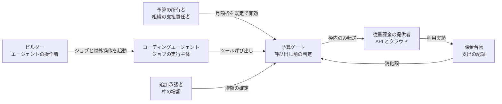
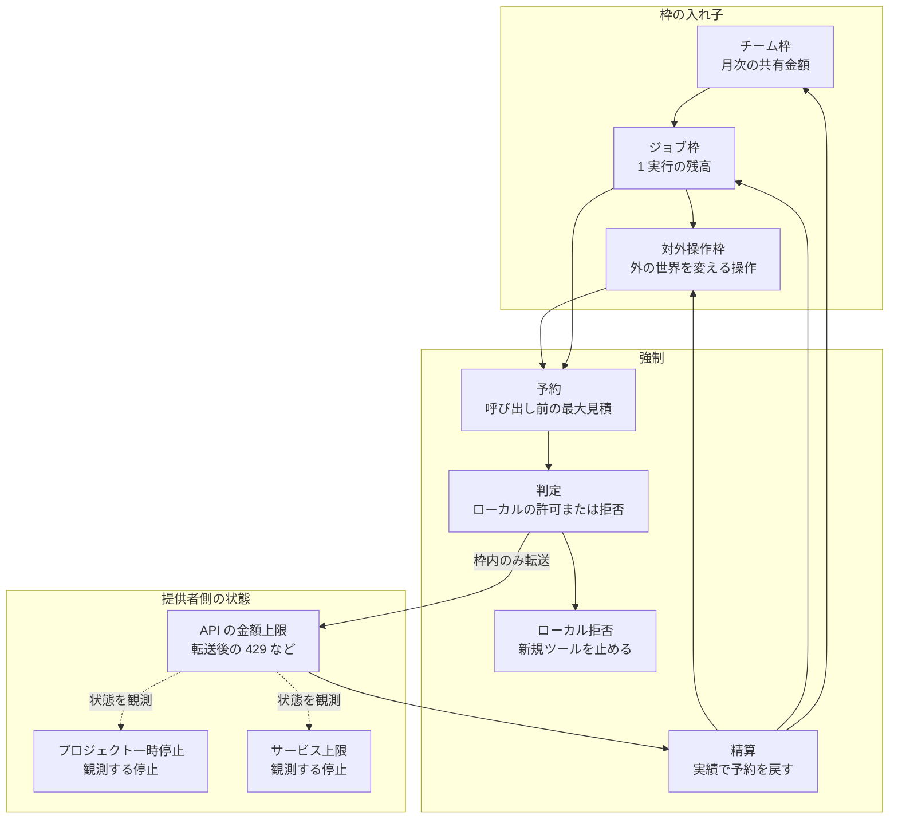
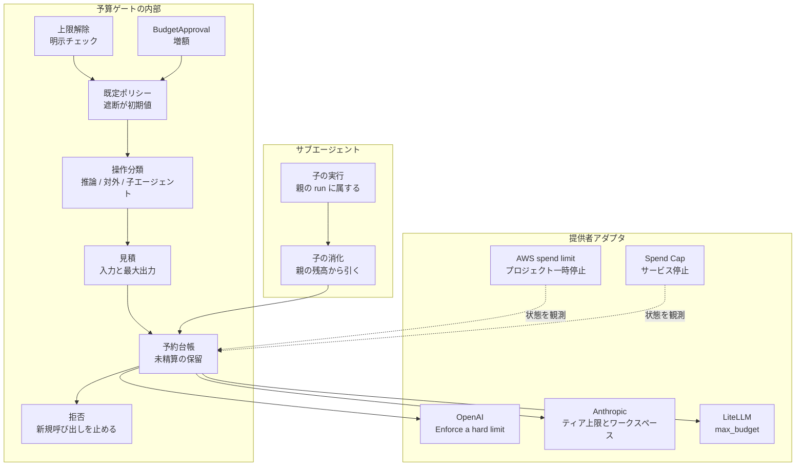
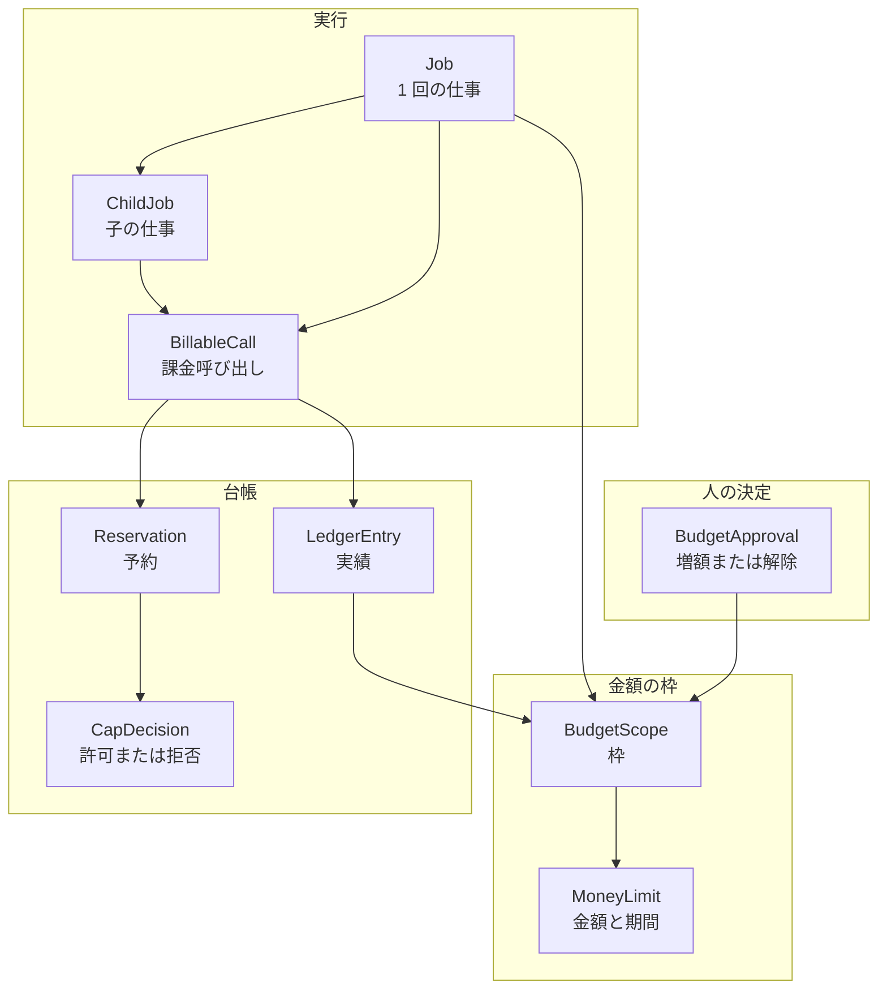
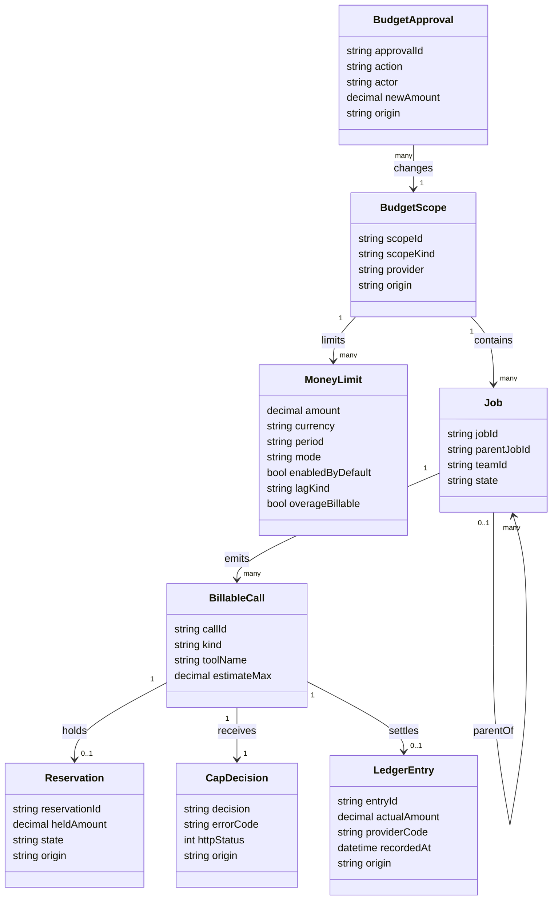
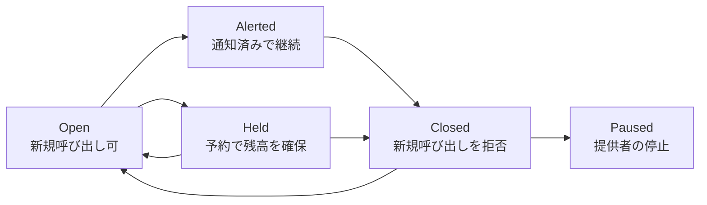

従量課金の API とクラウドに、設定した金額へ達した時点で新規の課金操作を止める仕組みを、製品の初期値として置く要求があります。この記事では、その上限の構造、台帳の持ち方、提供者ごとの有効化、エージェントのツール呼び出し前に置く予約までを説明します。手順と応答コードは、2026-10-05 時点の公開ドキュメントに基づきます。Simon Willison の 2026-10-03 の記事は各社の実装一覧ではなく、この停止を既定にする要求です。


*この記事の全体像。以下、順に解説します。*

## 既定ハード予算上限とは

既定ハード予算上限は、従量課金の API とクラウドに対する製品要求です。設定した金額に達した時点で、新規の課金操作をエラーで止めます。通知メールだけを送って呼び出しを続けるソフト上限とは、停止の有無が違います。

Simon Willison は 2026-10-03 の記事で、この停止を製品の既定に置くよう求めています。上限を外して課金を続ける選択は、目立つチェックボックスによるオプトインにします。記事が挙げる文面は次のとおりです。

> Remove the budget cap. My application will not be shut down if I exceed the configured budget limit, and I will be responsible for subsequent charges.

動機は、コーディングエージェントとパーソナルエージェントが、有料 API、ホストされたアプリ、ストレージと計算の追加課金を、短い操作で起動できるようになったことです。真夜中の警告メールのあと、睡眠中に数百ドルから数千ドルが追加で消化される状況を、記事は避けたい失敗として置いています。ホストされたアプリがエラーになる不便と、想定外の 10,000 ドル超の請求を比べ、多くの事業者と個人はエラーを選ぶ、という期待を記事は述べています。

記事が名指しする実装の芽は 2 つです。AWS は 2026-09-16 の新しいビルダー体験で、有料プランのプロジェクトに月額の spend limit を置けるようにし、上限に達したプロジェクトをその月は一時停止すると告知しています。Google Cloud は 2026-07-29 のブログで Spend Caps を公開し、プロジェクト内の特定サービスに月額の金額上限を置き、到達後はそのサービスの課金利用を制限すると説明しています。

この要求は、見積もりの行分けと早期アラートの次の段です。行分けは「何にいくら使うか」を事前に分けます。早期アラートは「いつ気づくか」を早めます。既定のハード上限は「気づいたあと、誰の追加承認が無い限り新規呼び出しを拒むか」を製品の初期値にします。

レート制限（RPM / TPM）は速度の公平性です。月額の利用枠はプロバイダが組織に割り当てる上限です。利用者が金額で置くハード上限は、そのどちらとも別の制御です。OpenAI の現行ガイドは、この 3 つを別物として書いています。

チーム、ジョブ、対外操作へ枠を分け、超過時に新規ツール呼び出しを拒み、再開を予算の追加承認へ戻し、サブエージェントの消費を親の上限の内側に置く振る舞いは、エージェント実行系へ落とす実装案です。契約画面の表示は、公開ドキュメントのあとで各自が確認します。

## 特徴

停止の単位は金額です。呼び出し回数やトークン速度の上限とは別のレバーです。

- 既定は遮断です。上限の撤去は、課金継続の責任を明示したオプトインです。
- ソフト上限は通知を残し、トラフィックは継続します。ハード上限は対象の新規課金操作を拒否するか、対象リソースを止めます。
- 強制には伝播遅延があります。OpenAI は、記録上の支出が設定額を少し超える余地をガイドに書いています。
- 停止の形はプロバイダで分かれます。API の 429、ゲートウェイの 422、プロジェクト単位の一時停止、単一サービスの利用停止が並びます。
- スコープは入れ子にできます。組織、プロジェクト、ワークスペース、チーム、ジョブ、対外操作は、同じ 1 つの金額には収まりません。
- 子の実行は親の台帳に足します。別キーの別枠に出すと、親の上限は子の消化を見ません。
- 再開は新しい予算の確定です。リトライだけでは枠は戻りません。
- エージェントは、ハード上限を持つ提供者を推奨し、上限の無い従量へ初心者を乗せる前に警告する、という使い方を記事は理想として置いています。

| 制御 | 設定額に達したときの公開されている振る舞い | 主な粒度 | 位置づけ |
|---|---|---|---|
| 支出アラート | 通知を送り、API トラフィックは継続する | 組織、プロジェクト、請求予算 | ソフト |
| OpenAI のハード支出上限 | 対象リクエストが 429。コードは `organization_spend_limit_exceeded` または `project_spend_limit_exceeded` | 組織、プロジェクト。月次。強制はオプトイン | ハード（利用者が Enforce を有効にしたとき） |
| OpenAI の承認済み月次利用枠 | ティアごとの別上限。支出上限とは別 | 組織 | プロバイダ割当 |
| Anthropic のティア月次支出上限 | Start 500 米ドル、Build 1,000 米ドル、Scale 200,000 米ドル。到達で HTTP 429。`error.details.error_code` は `enforced_spend_limit_reached`。`retry-after` は付かない | 組織。カレンダー月。Custom ティアは月次支出上限なし | プロバイダ割当。既定の利用者オプトインではない |
| Anthropic の利用者 spend limit | Billing の Spend limits で、ティア上限以下を Adjust limit または Set limit する。到達で HTTP 400、`invalid_request_error`。メッセージは `You have reached your specified API usage limits` で始まる | 組織。ワークスペース上限は `specified workspace API usage limits` | 利用者が置くハード。初期状態で有効な遮断ではない |
| Anthropic ワークスペース上限 | 組織上限以下の支出上限とレート上限をワークスペースへ置ける。Default Workspace には別上限を置けない。Claude Code ワークスペースの上限超過は、`retry-after` 付きの 429 になり得る | ワークスペース | 利用者が狭める枠。ティア上限の 429 とは応答が違う |
| AWS spend limit | プロジェクトの税引前コストが上限に達すると、そのプロジェクトを一時停止しリソースを止める | 新しいビルダー体験のプロジェクト。最大 10 | ハード（対象アカウントに体験が開いているとき） |
| Google Cloud Spend Cap | 単一プロジェクトの単一対象サービスで、月額上限の到達後にそのサービスの課金利用を制限する | プロジェクト × サービス。月次 | ハード（対象サービスを選んだ予算） |
| LiteLLM の max_budget | デプロイメントは 429。チームは既定 422（`budget_exceeded_status_code` で 429 に変更可）。ユーザーのモデル予算は 429。タグは 422 | モデル、チーム、ユーザー、タグ | ゲートウェイのハード |
| クラシックなクラウド予算アラート | しきい値で通知や Pub/Sub を発火する。それだけでは API を止めない | 請求アカウント、プロジェクト、ラベル | ソフト |

場面ごとに向く制御は分かれます。

| 場面 | 向く制御 | 理由 |
|---|---|---|
| 個人の実験と学習用クラウド | プロジェクト一時停止型の spend limit | 想定外請求の恐怖が利用自体を止めている、と記事が AWS に期待する層 |
| 本番 API で短時間の拒否を許容できる経路 | 組織またはプロジェクトのハード支出上限 | エラーで止め、データ削除を伴う広域停止を避ける |
| 1 回のエージェント実行 | ジョブ予算と呼び出し前の予約 | 月次のプロジェクト上限は、その実行が次の 1 回を払えるかを知らない。OpenAI の per-run spending controller がこの隙間を説明している |
| メール送信、資源作成、決済などの対外操作 | 対外操作だけの小さい枠 | モデル呼び出しと、外の世界を変える操作は被害の形が違う |
| 複数サブエージェント | 親の残枠から子の予約を引く | 子を親の外のキーに出すと、親の上限は空振りする |
| 速度だけを公平に分けたい | RPM / TPM | 金額の暴走は速度枠の内側でも起きる |

## 構造

金額の上限は、人とエージェントの前にゲートを置き、提供者の停止はゲートの出力ではなく観測する状態として分けます。

### システムコンテキスト図

予算の所有者は月額枠をゲートへ既定で有効にします。ビルダーはエージェントを起動し、エージェントのツール呼び出しはゲートを通ります。枠内の呼び出しだけが従量課金の提供者へ転送され、利用実績は課金台帳からゲートへ戻ります。超過後の増額は、追加承認者が確定します。



| 要素名 | 説明 |
|---|---|
| 予算の所有者 | 月額の金額と、上限を外すオプトインの責任を持つ |
| ビルダー | エージェントに作業を頼む人。上限の存在を意識せずに起動できることが、記事の問題設定 |
| コーディングエージェント | 有料 API、ホストアプリ、追加の計算とストレージを起動する主体 |
| 予算ゲート | 新規の課金操作を通すか拒否する。通知装置とは別 |
| 従量課金の提供者 | API プラットフォーム、クラウドプロジェクト、ゲートウェイの背後のモデル |
| 課金台帳 | 消化額の正。強制のタイミングはこの更新遅延に従う |
| 追加承認者 | 超過後に枠を増やす人。リトライループそのものではない |

### コンテナ図

枠はチーム、ジョブ、対外操作の入れ子です。ジョブ枠と対外操作枠は、呼び出し前に最大見積を予約し、ローカルで許可または拒否します。枠内の転送だけが提供者の API 金額上限へ進みます。AWS のプロジェクト一時停止と Google Cloud のサービス上限は、ゲートが選ぶ停止モードではなく、転送後に観測する状態です。実績が予約より小さいときは、予約時に引いた全階層へ同じ差分を戻します。



| 要素名 | 説明 |
|---|---|
| チーム枠 | 複数のジョブが共有する月次金額。LiteLLM の team budget が公開実装の対応物 |
| ジョブ枠 | 1 回のエージェント実行の残高。月次上限より細い |
| 対外操作枠 | 送信、資源作成、決済など、モデル推論以外の課金と副作用 |
| 予約 | 応答の最大コストを先に残高から抑える。OpenAI cookbook の per-run controller と同じ考え方 |
| 判定 | ローカルゲートの許可か拒否。提供者の停止モードをここで選ばない |
| ローカル拒否 | 残額が予約に満たないとき、新規ツール呼び出しを止める |
| 精算 | 実績が予約より小さいとき、予約した全階層へ同じ差分を戻す |
| API の金額上限 | 転送後に提供者またはゲートウェイが返す金額上限。OpenAI の 429、Anthropic の 429 または 400、LiteLLM の 422 など |
| プロジェクト一時停止 | AWS spend limit が上限到達時に行う停止。ゲートの出力ではなく、観測する状態 |
| サービス上限 | Google Cloud Spend Cap。単一プロジェクトの単一サービス。ゲートの出力ではなく、観測する状態 |

### コンポーネント図

予算ゲートの内部は、操作の分類、見積、予約台帳、既定で遮断するポリシー、上限解除の明示チェックに分かれます。サブエージェントの消化は親の予約台帳へ足します。OpenAI、Anthropic、LiteLLM へは予約のあと転送します。AWS spend limit と Spend Cap は、状態を予約台帳側から観測します。



| 要素名 | 説明 |
|---|---|
| 操作分類 | 推論、対外操作、子エージェント起動を別の枠へ振り分ける |
| 見積 | 入力トークンと、応答の最大長から、その呼び出しの上限金額を出す |
| 予約台帳 | 進行中の呼び出しが同時に枠を超えないように保留する |
| 既定ポリシー | 未設定の新規ワークロードは遮断側で始まる、という記事の要求 |
| 上限解除 | 課金継続の責任文を表示したうえでのオプトイン |
| 拒否 | 予約できない新規ツール呼び出しを、提供者へ転送する前に止める |
| BudgetApproval | 増額または解除の確定。ポリシーへ戻り、拒否を解く条件になる |
| 子の実行 | 親ジョブの識別子を引き継ぐ。別組織の別キーに切り替えない |
| 子の消化 | 親の予約台帳に加算する |
| OpenAI | 組織とプロジェクトの両方にハード上限を置ける。到達コードが分かれる |
| Anthropic | ティア上限は 429。利用者が置いた spend limit は 400。Custom ティアに月次支出上限は無い |
| AWS spend limit | 新しい体験のプロジェクト向け。到達でリソース停止。早期制御は任意 |
| Spend Cap | 対象サービスを選び、到達後は手作業で解除するまで利用ブロックが残る |
| LiteLLM | プロキシの設定とキーで、チーム、ユーザー、タグ、モデルの予算を拒否に変える |

## データ

公開ドキュメントに名前がある属性はその名前を使い、チーム、ジョブ、対外操作、予約、承認は実装案の属性として分けます。

### 概念モデル

金額の枠は BudgetScope と MoneyLimit です。1 回の仕事は Job で、課金呼び出し BillableCall を出します。子の仕事 ChildJob も同じ呼び出しに繋がります。呼び出しは Reservation を抑え、CapDecision を受け、実績は LedgerEntry として枠へ戻ります。増額または解除は BudgetApproval が枠を変えます。



| 要素名 | 説明 |
|---|---|
| BudgetScope | チーム、ジョブ、対外操作、提供者の組織、プロジェクト、サービスのどれか 1 つの枠 |
| MoneyLimit | 金額、通貨、期間、ハードかソフトか、既定で有効か |
| Job | エージェントの 1 実行。複数の課金呼び出しを含む |
| ChildJob | 親 Job に属するサブエージェント。消化は親の枠に入る |
| BillableCall | モデル呼び出し、資源作成、送信、決済などの 1 回 |
| Reservation | 呼び出し前に抑える最大金額 |
| LedgerEntry | 提供者またはゲートウェイが記録した実績 |
| CapDecision | その呼び出しを転送したか、拒否したか |
| BudgetApproval | 枠の増額、上限解除、停止の解除。誰がいつ確定したか |

### 情報モデル

`origin` が `implementation` の列は、公開リソース名ではない実装案です。`official` は公開仕様の写像です。



| 要素名 | 説明 |
|---|---|
| scopeKind | `org` / `project` / `workspace` / `service` / `team` / `job` / `external`。後ろの 3 つは実装案 |
| mode | `alert` または `hard`。同一スコープに両方を置ける。OpenAI は月額金額に対し、spend alert と Enforce a hard limit を共存させる |
| enabledByDefault | 記事が要求する初期値。2026-10-05 時点の公開仕様では、提供者ごとに初期値が違う |
| lagKind | `propagation` または `up_to_one_hour`。遅延は真偽値ではなく、反映の遅れと復帰までの時間 |
| overageBillable | 強制が即時でないあいだの超過分を請求するか。OpenAI と Google Cloud の現行ドキュメントは、請求されると書く |
| origin | `official` は公開仕様の写像。`implementation` は公開リソース名ではない実装案。Reservation、LedgerEntry のローカル列、BudgetApproval は implementation |
| kind | `inference` または `external`。実装案の分類 |
| errorCode | OpenAI の `error.code` は `organization_spend_limit_exceeded` か `project_spend_limit_exceeded`。LiteLLM の `budget_exceeded` は `error.type`。チーム例の `error.code` は `"422"` で、設定変更後は `"429"` |
| httpStatus | OpenAI のハード上限は 429。LiteLLM のチーム予算の例は 422。デプロイメント予算の例は 429 |
| action | `raise` / `remove_cap` / `lift_pause`。再開の種類 |

公開仕様の語と、実装案の境界は次のとおりです。

| モデル | origin | 一次資料の語 |
|---|---|---|
| MoneyLimit.mode=hard（OpenAI） | official の写像 | Enforce a hard limit。到達コードは `organization_spend_limit_exceeded` または `project_spend_limit_exceeded`。HTTP 429 |
| MoneyLimit.mode=alert（OpenAI） | official の写像 | spend alert。トラフィックは継続する |
| CapDecision（Anthropic ティア） | official の写像 | HTTP 429。`error.details.error_code` は `enforced_spend_limit_reached`。`retry-after` は無い |
| CapDecision（Anthropic 利用者上限） | official の写像 | HTTP 400。`invalid_request_error`。メッセージは `You have reached your specified API usage limits` で始まる |
| Reservation と BudgetApproval | implementation | 公開のリソース名ではない。cookbook の per-run controller と同じ考え方 |

## 構築方法

ゲートウェイより前に提供者の停止を置き、その内側にチーム、ジョブ、対外操作の枠を宣言します。金額は説明用の例であり、公式の既定値ではありません。

### 枠の単位を先に宣言する

金額の器を 1 つにまとめると、チームの月次、1 ジョブ、対外操作のどれが溢れたのかが戻り値から読めません。実装案では、次の 3 つを別レコードにします。数値は例です。提供者の請求通貨に合わせます。

- `team` はカレンダー月の共有枠です。
- `job` は 1 実行の枠です。チーム枠の内側にあります。
- `external` は対外操作だけの枠です。ジョブ枠より小さくします。

```yaml
# 実装案。金額は説明用の例であり、公式の既定値ではない。
budget_scopes:
  - id: team-research
    kind: team
    period: calendar_month
    currency: USD
    amount: 300
    mode: hard
    enabled_by_default: true
  - id: job-default
    kind: job
    period: per_run
    currency: USD
    amount: 8
    mode: hard
    parent: team-research
  - id: external-default
    kind: external
    period: per_run
    currency: USD
    amount: 1
    mode: hard
    parent: job-default
opt_in_remove_cap:
  required_ack: "Remove the budget cap. Subsequent charges remain the owner's responsibility."
```

`required_ack` は、Willison の記事が挙げる責任文を短くした実装例です。画面に出す文面そのものではありません。

### 提供者側のハード上限を有効にする

公開手順はコンソール操作が中心です。

OpenAI の組織向け手順は次のとおりです。

1. Organization limits を開きます。
2. Spend で Edit spend limit を選びます。
3. Monthly spend limit を入力します。
4. 上限到達後に API を失敗させる場合、Enforce a hard limit を有効にします。
5. Save します。

プロジェクトも同じ並びで、Project settings の Limits から編集します。Enforce a hard limit を有効にしても、spend alert は残ります。金額欄そのものが通知専用になるわけではありません。

Anthropic の利用者 spend limit は、次の公式手順です。金額はティアの月次支出上限を超えられません。

1. Settings の Billing を開きます。
2. Spend limits で、Adjust limit、または未設定なら Set limit を開きます。
3. ティア上限以下の金額を保存します。

到達時の読み分けは、公式ページの応答に対する実装例です。ティア上限は 429、利用者上限は 400 です。

```python
# platform.claude.com の Rate limits が区別している応答に対する実装例。
def classify_anthropic_spend(status, error):
    code = (error.get("details") or {}).get("error_code")
    if status == 429 and code == "enforced_spend_limit_reached":
        return "raise_tier_or_wait_utc_month"
    message = error.get("message") or ""
    if status == 400 and message.startswith("You have reached your specified"):
        return "raise_user_spend_limit"
    if status == 429:
        return "rate_limit_or_claude_code_workspace"
    return "other"
```

AWS の spend limit は、体験が開いているアカウントで [AWS Settings](https://settings.aws.com) の Billing、Cost by project から Set limit します。推奨額か、カスタム額を選びます。任意の早期制御として、新規リソース起動の停止、アイドル資源の一時停止、高コスト資源の一時停止を保存できます。下限は 20 米ドルと、当月の活動と稼働資源と前月の活動から出す保守的見積のうち、大きい方です。クレジットは対象外で、税引前料金に適用されます。

Google Cloud の Spend Cap は、請求アカウントの予算で、単一プロジェクトと単一の対象サービスを月次範囲に固定して目標額を置きます。2026-10-05 に確認した公式ドキュメントの対象サービスは、Gemini API、Agent Platform（旧 Vertex AI）、Cloud Run、Cloud Run functions です。


### ゲートウェイにチーム予算を置く

LiteLLM のチーム予算は、公式の手順が 3 段です。チュートリアルの金額は `max_budget: 0.000000001` と `budget_duration: "1d"` です。下のコマンドは手順の形だけを借り、金額は読みやすい例です。チーム予算の表は `budget_duration="30d"` を every 1 month と書きます。users ページは、毎月 1 日に戻るカレンダー月に `1mo` を使うと書きます。この記事のチーム枠はカレンダー月なので、例は `1mo` にします。`30d` を、毎月 1 日のリセットと同一視しません。

```bash
# 公式手順の形。金額と期間は読みやすい例。チュートリアル値ではない。
curl -X POST "http://127.0.0.1:4000/team/new" \
  -H "Authorization: Bearer $LITELLM_API_KEY" \
  -H "Content-Type: application/json" \
  -d '{"team_alias":"research","max_budget":100,"budget_duration":"1mo"}'
```

```bash
# 公式: POST /key/generate。team_id は /team/new の応答から渡す。
curl -X POST "http://127.0.0.1:4000/key/generate" \
  -H "Authorization: Bearer $LITELLM_API_KEY" \
  -H "Content-Type: application/json" \
  -d '{"team_id":"team-id-from-team-new"}'
```

チーム予算を超えた `/chat/completions` は、ドキュメントの例では HTTP 422 と `type: budget_exceeded` を返します。`litellm_settings` の `budget_exceeded_status_code: 429` は任意です。チーム管理者は `max_budget` を現状以下にしか変えられず、引き上げは proxy admin です。

`soft_budget` は通知のしきい値です。リクエストは成功したままです。チームのメール通知ページは、メール送信に enterprise license が要ると書いています。`soft_budget` は `max_budget` の代わりにしません。

チーム、キー、ユーザーの予算は Postgres などのデータベースが前提です。データベースが無い配置では、これらの予算は解決できず、`litellm_settings.max_budget` は fail open で、上限を超えてもリクエストが通ります。

モデルデプロイメントの `max_budget` は、チーム予算とは別の公式例です。モデル ID は配置先の ID に置き換えます。

```yaml
# 公式ドキュメントの model budget 例に合わせた実装例。チーム手順ではない。
model_list:
  - model_name: primary
    litellm_params:
      model: openai/your-model-id
      api_key: os.environ/OPENAI_API_KEY
      max_budget: 100
      budget_duration: 30d
```

デプロイメント予算の超過例は 429 で、メッセージに crossed budget を含みます。

### ジョブ予算の予約を構築する

OpenAI の cookbook “Build a per-run spending controller with the Responses API” は、組織とプロジェクトの支出上限だけでは 1 タスクの次のリクエスト可否が分からない、と説明しています。呼び出し前に入力を数え、応答の最大コストを予約し、応答後に未使用分を戻し、残額を超えるリクエストの前で止めます。

実装案の予約関数は、提供者の価格表を引数で受けます。価格の数値は呼び出し側が公式価格から渡します。この関数自体は価格を知りません。残高の読み取りと減算は、1 台帳の直列操作の中でだけ呼びます。

```python
# 実装案。価格は公式の価格表から呼び出し側が渡す。
# 残高の読み取りと減算は、1 台帳の直列操作の中でだけ呼ぶ。
def reserve(balance, input_tokens, max_output_tokens, prices):
    worst = input_tokens * prices.input_per_token
    worst += max_output_tokens * prices.output_per_token
    if balance < worst:
        return None
    return {"held": worst, "remaining": balance - worst}
```

cookbook は、この予算がストレージ、既定以外の処理ティア、リージョン価格、長コンテキスト料金、ストリーミング、バックグラウンド、サーバ管理のエージェント実行、アカウント固有料金を含まない、と限界を書いています。実装案でも、見積の対象外はジョブ枠とは別のチェックに残します。

### 対外操作の枠を推論枠から分ける

資源の作成、メールや投稿の送信、決済は、トークン単価では見積もれません。実装案では `kind: external` のツール名リストをゲートが持ち、その呼び出しは `external` 枠を追加で見ます。ジョブ枠とチーム枠も、同じ見積額を同時に予約します。AWS の任意制御「新規リソース起動の停止」は、上限の約 7 日前に SCP で新規作成を止める提供者側の近い仕組みです。金額の別枠そのものではありません。

```yaml
# 実装案。ツール名はエージェント実装の名前に合わせる。
external_tools:
  - cloud.resource_create
  - mail.send
  - payments.capture
external_limit:
  parent: job-default
  amount_usd: 1
  on_exceed: reject_new_call
```

## 利用方法

超過後に通してよいのは、進行中の後始末と、予算の追加承認です。同じエラーへの自動リトライは、枠が戻ったことにはなりません。

### 呼び出し前に新規ツールを拒否する

超過後の正しい動作は、進行中の後始末を除き、新しいツール呼び出しを拒否することです。OpenAI のヘルプは、請求、支出、クォータのエラーをリトライしてもアクセスは戻らない、と書いています。

枠が同時に溢れたとき、実装案は次の順で不足を集めます。再開には、不足した全階層の残額か承認が要ります。先頭の 1 枠だけを増額しても、祖先が不足したままなら次の呼び出しは拒否されます。

| 順 | 判定 | 拒否時の resume |
|---|---|---|
| 1 | 対外操作なら external の残額 | `budget_approval`（external） |
| 2 | ジョブ残額。子は親の jobId から予約する | `budget_approval`（job） |
| 3 | チーム月次残額 | `budget_approval`（team） |
| 4 | 転送後の提供者コード | OpenAI は増額か月次リセット。Anthropic の 429 はティア引き上げか、翌月 1 日 00:00 UTC まで待つ。400 は利用者上限の引き上げ。AWS は spend limit の引き上げと手動再起動 |

実装案のゲートは次の順です。残高の減算は、上の表の 1 枠につき 1 台帳の直列操作にします。

1. ツール種別を推論か対外操作かに分けます。
2. 子エージェントなら `is_child` を立て、親の `jobId` と一致する `parent_job_id` を必須にします。欠落や不一致は拒否します。
3. 最大見積を予約します。対外操作は `estimate_usd`、推論はトークン単価の最悪額です。同じ額を、対象枠と祖先枠から同時に引きます。
4. 見積が有限の正数でないとき、残高を変えずに拒否します。
5. 予約できないとき、不足した全階層を返します。増額が要るのはその全部です。
6. 予約できたときだけ提供者へ転送します。
7. 実績で予約を精算します。予約 ID に引いた階層を残し、実績との差分をその全階層へ同じ額だけ、1 台帳の直列操作で戻します。

```python
# 実装案。拒否は例外ではなく、再開に必要な承認種別を含む結果にする。
# 残高の読み取りと減算は、この関数全体を 1 台帳の直列操作の中で呼ぶ。
def usable(amount):
    if isinstance(amount, bool):
        return False
    try:
        value = float(amount)
    except (TypeError, ValueError):
        return False
    return value > 0 and value != float("inf")


def before_tool(state, call):
    if call.is_child and call.parent_job_id != state.job.job_id:
        return {
            "allow": False,
            "reason": "child_outside_parent",
            "resume": "budget_approval",
            "scope": "job",
            "scopes": ["job"],
        }
    chain = []
    if call.kind == "external":
        chain.append(("external", state.external))
        worst = call.estimate_usd
    else:
        worst = (
            call.input_tokens * call.prices.input_per_token
            + call.max_output_tokens * call.prices.output_per_token
        )
    chain.append(("job", state.job))
    chain.append(("team", state.team))
    if not usable(worst):
        return {
            "allow": False,
            "reason": "invalid_estimate",
            "resume": "fix_estimate",
            "scope": chain[0][0],
            "scopes": [name for name, _ in chain],
        }
    short = [name for name, scope in chain if scope.balance < worst]
    if short:
        return {
            "allow": False,
            "reason": "budget_exceeded",
            "resume": "budget_approval",
            "scope": short[0],
            "scopes": short,
        }
    held = {"held": worst, "scopes": [name for name, _ in chain]}
    for _, scope in chain:
        scope.balance -= worst
        scope.holds.append(held)
    return {"allow": True, "reservation": held}
```

### エラーコードを制御の種類で読み分ける

OpenAI のハード上限に達したリクエストは 429 です。コードは次のどちらかです。

- 組織上限: `organization_spend_limit_exceeded`
- プロジェクト上限: `project_spend_limit_exceeded`

同じ 429 でも、`organization_usage_limit_exceeded` は OpenAI が割り当てた利用枠、`credit_balance_exhausted` は前払い残高、レート制限は RPM / TPM です。支出上限の増額では、レート制限もクレジット枯渇も解けません。

```python
# OpenAI の公開ガイドが区別している code 値に対する実装例。
SPEND_CODES = {
    "organization_spend_limit_exceeded",
    "project_spend_limit_exceeded",
}

def classify_openai_429(code):
    if code in SPEND_CODES:
        return "raise_or_wait_monthly_reset"
    if code == "organization_usage_limit_exceeded":
        return "request_higher_assigned_limit"
    if code == "credit_balance_exhausted":
        return "add_credits"
    return "rate_limit_or_other"
```

LiteLLM のチーム予算の例は HTTP 422 で、`error.type` が `budget_exceeded`、`error.code` が `"422"` です。`budget_exceeded_status_code: 429` にするとステータスは 429 になります。そのときも種別は `error.type` で読み、`error.code` の数字を OpenAI の code と混ぜません。デプロイメント予算の例は 429 で、メッセージに crossed budget を含みます。クライアントは `error.type == budget_exceeded` と crossed budget の両方を「枠の超過」として扱い、レート制限のバックオフに落としません。

### サブエージェントの消費を親の上限へ入れる

子のプロセスが自分の API キーと自分の月次枠を持つと、親のジョブ枠は子の消化を見ません。実装案では、子の起動メタデータに親の `jobId` と予約 ID を必須にします。ゲートは子の見積を親の残高から引いてから子を起動します。LiteLLM を使う場合、親子は同じチームキーの配下に置き、チームの `max_budget` が共通の外側になります。

```json
{
  "parent_job_id": "job_01",
  "child_job_id": "job_01.child_2",
  "scope_id": "job-default",
  "reservation_id": "rsv_18",
  "max_child_usd": 1.5
}
```

### 再開は予算の追加承認に戻す

超過後に通る操作は、枠の増額、上限の明示解除、提供者側の停止解除です。OpenAI は、到達した上限を上げるか外すと、更新の伝播後にトラフィックが再開し、それ以外は次の月次サイクルで戻る、と書いています。Google Cloud の Spend Cap は、Budgets の UI で手動解除するまでブロックが残り、解除後の完全復帰に最大 1 時間と予算ドキュメントが書いています。AWS は、AWS Settings で spend limit を上げてプロジェクトを再有効化し、一部リソースは手動再起動です。

```json
{
  "approval_id": "apr_44",
  "actor": "budget-owner",
  "action": "raise",
  "scope_id": "job-default",
  "new_amount_usd": 16,
  "ack": "owner accepts charges up to the new amount"
}
```

承認レコードが台帳に載るまで、ゲートは同じジョブの新規ツール呼び出しを拒否したままにします。

### 見積もりの行と早期アラートの次に遮断を置く

見積もりの行分けは、チーム、ジョブ、対外操作の `amount` の初期値になります。早期アラートは、50% や 80% の通知を、その行の金額に対して先に出します。製品の既定値としての遮断は、100% で新規呼び出しを拒む段です。通知しきい値だけを入れて Enforce を外したままにすると、OpenAI の言葉では spend alert であり、トラフィックは継続します。

| 段 | 入力 | 出力 |
|---|---|---|
| 行分け | 作業種ごとの見積 | team / job / external の金額 |
| 早期アラート | 行の金額に対する割合 | 50% と 80% の通知。呼び出しは継続 |
| 既定の遮断 | 行の 100% | 新規ツール呼び出しの拒否、または提供者の停止 |
| 再開 | 追加承認 | 新しい金額か、上限解除の明示 |

## 運用

通知は停止の前触れとして置き、月次の戻り方と、到達後に見る面を制御の種類ごとに分けます。

### 通知しきい値を停止とセットで置く

通知は停止の代わりにはなりません。

- AWS spend limit は、実績が上限の 50%、75%、90% に達したとき、または今後 10 日で上限へ到達もしくは超過する見通しのときに通知します。
- Google Cloud の Spend Cap は、予算の 50%、80%、100% で請求管理者とプロジェクト所有者へメールします。100% は停止と通知が同時です。
- OpenAI は、ハード上限の前に spend alert を重ねられます。アラートだけでは API は止まりません。

```yaml
# 実装案。0.50 と 0.80 は Google Cloud Spend Cap の通知割合。AWS の通知は 50%、75%、90% で、この配列とは別。
alerts:
  - scope: team-research
    at_ratio: [0.50, 0.80]
    action: notify
    continues_traffic: true
  - scope: team-research
    at_ratio: [1.00]
    action: reject_new_tool_calls
    continues_traffic: false
```

### 月次の境界をリセットとして扱う

OpenAI のハード上限と Anthropic のティア支出上限は、月次の区切りで戻る前提を公開ドキュメントが持っています。Anthropic のティア上限は、引き上げが無いとき翌月 1 日 00:00 UTC まで止まります。月の途中で枠を上げた場合は、その更新の伝播が再開条件です。Google Cloud の Spend Cap の期間は毎月 1 日始まりの月次に固定され、利用者が期間を変えられません。AWS の spend limit は月額ですが、到達後の再開は翌月の自動解除として書かれていません。AWS Settings で上限を上げて再有効化します。

ジョブ枠は月次リセットを待ちません。実行の終了で破棄し、次の実行は新しい残高で始まります。月次のチーム枠だけがカレンダーに従います。

### 上限到達後の状態を確認する

停止の形ごとに、確認する面が違います。

- API ハード上限: エラーの `code` と、コンソールの当月利用額と設定額を突き合わせます。
- AWS: プロジェクトが paused か、早期制御（新規起動停止、アイドル停止、高コスト停止）のどれかを見ます。
- Google Cloud: 予算一覧の Spend cap status が Enforced か Lifted かを見ます。
- ゲートウェイ: `budget_exceeded` と、チームまたはタグの current cost / max budget を見ます。

ローカルゲートの状態と、提供者の停止は別の面です。Alerted は通知済みでトラフィックが続き、Closed は新規ツール呼び出しの拒否、Paused は AWS の一時停止または Spend Cap の Enforced です。



| 要素名 | 説明 |
|---|---|
| Open | 残額が次の最大見積以上ある |
| Alerted | 割合しきい値の通知済み。トラフィックは継続する |
| Held | 進行中呼び出しの予約が残高を抑えている |
| Closed | ゲートが新規ツール呼び出しを拒否している。承認で Open に戻る |
| Paused | AWS のプロジェクト一時停止、または Spend Cap の Enforced |

### 早期制御と本停止を分けて監視する

AWS の任意早期制御は、上限そのものより前に動きます。

- 到達の約 7 日前: 新規リソースの起動を、AWS 管理の SCP で止めます。稼働中のものは動き続けます。オートスケールの追加起動はここで止まります。
- 約 5 日前: アイドル資源を止めます。対象は EC2、RDS、SageMaker エンドポイントです。EC2 のアイドル判定は、過去 14 日でピーク CPU が 5% 未満かつネットワーク I/O が 1 日 5 MB 未満、など条件がサービスごとに違います。
- 約 4 日前: 高コストの稼働資源を止めます。選択対象は EC2、RDS、Lambda、Bedrock、SageMaker です。暴走した Lambda や想定外の Bedrock に対する任意の制御としてドキュメントが説明しています。
- 上限到達: プロジェクトを一時停止し、全リソースを止め、データは保持します。

```python
# 実装案。提供者ステータスを、ゲートの Closed と混ぜずに記録する。
def observe(provider_status):
    if provider_status in {"enforced", "project_paused"}:
        return "paused"
    if provider_status in {"stop_new_resources", "pause_idle", "pause_top_cost"}:
        return "early_control"
    return "provider_open"
```

### 増額と解除を監査する

再開のたびに、操作者、旧金額、新金額、提供者側のステータス、時刻を残します。上限解除のオプトインは、記事の責任文に相当する ack を同じレコードに含めます。Google Cloud で Lift したあとは、サービス復帰に最大 1 時間を見てからトラフィックを戻します。同じ月に Lift した上限は、目標額を上げない限りその月は再発動しません。同じ上限のまま再開したつもりにしないため、再開承認は `action=raise` とセットにします。AWS で再有効化したあとは、手動再起動が要るリソースを一覧します。

```json
{
  "at": "2026-10-05T07:30:00Z",
  "scope_id": "team-research",
  "from_usd": 300,
  "to_usd": 450,
  "provider_status_before": "project_paused",
  "provider_status_after": "open",
  "actor": "budget-owner",
  "ack": "raise within the new amount"
}
```

### 台帳と請求の差分を月次で突合する

ゲートの合計と、提供者の請求は一致しません。遅延、クレジット、税、処理中リクエスト、対象外の固定料金が間に入ります。2026-07-29 の Google Cloud ブログは、Spend Cap のあとでも Committed Use Discounts や Provisioned Throughput の契約料金が続くように読めます。2026-10-05 の Manage spend cap budgets は、コミットメントで覆われた利用も新規分を止め、処理中リクエストは完了して課金され、サブスクリプション料金と永続資源の継続利用は対象外だと書いています。突合は、どちらの資料を採用したかを列に残します。AWS の spend limit はクレジットを除き、税引前です。

突合の実装案は、日次で次の 3 列を残します。

```text
date, scope_id, gate_actual_usd, provider_reported_usd, gap_usd, gap_reason
2026-10-05, team-research, 42.10, 42.80, 0.70, enforcement_lag
```

`gap_reason` は `enforcement_lag`、`credits_excluded`、`tax`、`in_flight`、`subscription_or_persistent`、`untracked_child` のいずれかにします。採用した資料名は別列に残します。`commitment_fee` は、ブログと現行ドキュメントが食い違うため、単独の理由にしません。`untracked_child` が出たら、子が親の外のキーを使っています。

## ベストプラクティス

新規のキーとプロジェクトは遮断側で始め、実験と本番で停止の形を分けます。

### 既定は遮断にし、解除はオプトインにする

新規のワークロード、新規の API キー、新規のクラウドプロジェクトは、ハード上限が有効な状態で始めます。上限を外す操作は、課金が続くことと、その責任が所有者にあることを、Willison の記事のチェックボックスに相当する文面で残します。通知チャンネルの追加は、この既定の代わりにはしません。

- 新しいキーと新しいプロジェクトは、ハード上限が有効な状態で発行する。
- 上限を外す操作は、課金が続くことと所有者の責任を残す文面を必須にする。
- 通知チャンネルの追加は、遮断の代わりにしない。

### 実験と本番で停止の形を分ける

実験と学習は、プロジェクト一時停止を許容できる spend limit 向きです。AWS のドキュメントは、spend limit を実験、学習、サンドボックス向けとし、想定外コストのときに短い一時停止を許容できる本番でも使える、と書いています。短時間の 429 が許容できる本番 API は、組織とプロジェクトのハード支出上限を先に置きます。データ削除を伴いうる広域停止を、本番の唯一の弁にはしません。

- 実験、学習、サンドボックスは、プロジェクト一時停止を許容できる spend limit を使う。
- 短時間の 429 を許容できる本番 API は、組織とプロジェクトのハード支出上限を先に置く。
- 90 日後にデータを削除しうる広域停止を、本番の唯一の弁にしない。

### 子エージェントを親のキー体系の外へ出さない

サブエージェント、バックグラウンド実行、別ハーネスの呼び出しは、親の `jobId` と同じチーム予算に紐づけます。cookbook が予算の対象外だと書くサーバ管理のエージェント実行は、別の予約規則を用意してから有効にします。対象外のまま起動すると、ジョブ枠の精算から漏れます。

- サブエージェントと別ハーネスは、親の `jobId` と同じチーム予算に紐づける。
- サーバ管理のエージェント実行は、予算の対象外と分かってから別の予約規則を用意する。
- 対象外のまま起動した費用は、ジョブ枠の精算に足さない。

### 行分けの金額を、そのまま遮断額の初期値にする

見積もりの行がチーム、ジョブ、対外操作に分かれているなら、その金額を各スコープの `amount` に写します。早期アラートは 50% と 80% の通知として、その金額の手前に置きます。100% は拒否です。割合だけを通知に使い、100% の拒否を別の担当者の手作業に残すと、エージェントの長時間実行は通知のあいだも進みます。

- 見積もりの行を、チーム、ジョブ、対外操作の `amount` に写す。
- 50% と 80% は通知にし、100% は新規ツール呼び出しの拒否にする。
- 100% の拒否を、別担当者の手作業だけに残さない。

### 遅延分の余裕を枠の内側に取る

即時強制ではない提供者では、設定額を「絶対に請求されてよい最大」と同一視しません。OpenAI は設定額を少し超える記録があり得ると書き、Google Cloud の支出上限ドキュメントは、レポートより速くても即時ではなく、超過分は通常どおり請求されると説明しています。運用上の拒否線は、許容請求額より手前に置きます。

- 運用上の拒否線は、許容請求額より手前に置く。
- OpenAI のハード上限は、設定額を少し超えてから記録され得る前提で余裕を取る。
- Google Cloud Spend Cap は即時ではなく、超過分が請求される前提で余裕を取る。

## 注意点

公開ドキュメント同士、および告知と現行ドキュメントのあいだで、読み手が止め方を取り違えやすい点をまとめます。確認日は 2026-10-05 です。

| 対象 | 資料の記載 | 2026-10-05 に一次へ当たった範囲 | 読者への影響 |
|---|---|---|---|
| 記事の位置づけ | Willison の記事は要求の提示であり、各社の実装一覧ではない | 記事本文は AWS と Google Cloud を例に、既定のハード上限を求めている。全 API の現行カタログではない | 契約画面の表示を、この記事の代用にしない |
| AWS の提供範囲 | 記事は既存アカウントへの一般提供を期待している | spend limit のドキュメントは「新しい体験を限られた顧客へ公開中」と警告している | コンソールに項目が無いアカウントは、この停止を持っていると扱わない |
| AWS のクレジット額 | What's New（2026-09-16）は最大 200 米ドル、同日の News Blog は 100 米ドルの Free Tier クレジットと書く | 現行の Free Tier ドキュメントは、アカウント作成時に 100 米ドル、アクティビティ完了で追加最大 100 米ドル、合計最大 200 米ドルと書く | 100 と 200 を矛盾として扱わない。初期付与と上限総額を分け、契約画面の表示を正にする |
| AWS の停止の副作用 | 記事の理想はエラーを返して止めること | spend limit はプロジェクトを一時停止しリソースを止める。操作が無い状態が 90 日続くと、プロジェクトデータを完全に削除する | 429 と同じ障害モードとして扱わない。90 日の期限を監視する |
| Google Cloud の対象サービス | 2026-04-22 のブログは Maps などを私的プレビューの対象に含めていた | 2026-07-29 のブログと現行の Spend Cap ドキュメントは、Gemini API、Agent Platform、Cloud Run、Cloud Run functions を公開プレビューの対象として書く | サービス名は現行ドキュメントの一覧を正にする |
| Spend Cap の速度 | 2026-07-29 のブログは、AI サービスの Spend Cap がしきい値の数分以内に作動する、と書く | 支出上限ドキュメントは、レポートより速くても即時ではなく、超過分は通常どおり請求されると書く | ブログの「数分」と、ドキュメントの超過請求を併記する |
| OpenAI の月次金額 | 2026 年前半の二次記事には、月次予算は通知だけで切断しない、と書かれたものがある | 2026-10-05 の公式 Spend limits は、通知（spend alert）と、Enforce a hard limit を有効にしたときの 429 を併記している | 二次記事の「切断しない」は、Enforce を外した経路の説明として読む |
| Anthropic の応答 | 二次記事も `enforced_spend_limit_reached` を例示していた | 2026-10-05 の Rate limits ページは、ティア上限を HTTP 429 と `error.details.error_code=enforced_spend_limit_reached`（`retry-after` なし）と書く。利用者が置いた spend limit は HTTP 400 の `invalid_request_error`。Claude Code ワークスペース上限は `retry-after` 付き 429 になり得る | 429 をすべてティア上限と読まない。400 の利用者上限と、Claude Code ワークスペースを分ける |
| CUD と Provisioned Throughput | 2026-07-29 のブログは、上限後も契約料金が請求されると読める | 現行の Manage spend cap budgets は、コミットメントで覆われた利用も新規分を停止すると書く。サブスクリプション料金は対象外。永続資源の継続利用は止まらない。処理中リクエストは完了して課金される | 固定料金が残る前提だけで突合しない。資料名を gap の列に残す |
| 同一月の Lift | 予算ドキュメントは、解除後の完全復帰に最大 1 時間と書いている | 同じドキュメントは、同一月に Lift すると目標額を上げない限りその月は再発動しない、とも書く。前月に Enforced だった上限は当月にリセットされる | 解除を「同じ上限での再開」と扱わない。再開承認の `action=raise` とセットにする |
| Claude の製品面 | Claude のブログは Enterprise のハード支出上限がすぐに効く、と書く | これは Claude 製品の管理機能の説明。Claude API のティア上限やワークスペース上限とは別サーフェス | チャットの上限設定を、API キーの停止と同一視しない |
| FT のインタラクティブ | Willison の記事は https://ig.ft.com/ai-tokens/ を、高性能化で請求制御が難しくなり、フロンティア企業の IPO を前に価格見直しが進む報道として示す | 2026-10-05 の取得では www.ft.com の購読導線へリダイレクトされ、図の数値は未読。同日に本文へ当たれた別記事は参考リンクに置く | 未読の図から数値を引用しない |
| LiteLLM のステータス | 予算超過は常に 429、とまとめがち | チームの例と Setting Tag Budgets のタグ例は 422 と `budget_exceeded`。チームは設定で 429 にできる。デプロイメント予算の例は 429 で本文に crossed budget を含む。キーに付けたタグは、リクエストごとの `metadata.tags` が無くても予算にかかる | 422 と 429 の両方を枠超過として扱う。タグはキー付与を先にし、毎リクエスト付与を必須にしない |
| LiteLLM のデータベース | プロキシの設定だけでチーム予算が止まると読みがち | Budgets, Rate Limits は Postgres などを必須とし、データベースが無いと key / team / user の予算は使えず、`litellm_settings.max_budget` は fail open だと書く | データベースの無い配置を、ハード上限の実装と見なさない |
| per-run の見積範囲 | ジョブ枠があればエージェント実行の全費用が収まる、と読みがち | cookbook は、ストレージ、既定外ティア、リージョン価格、長コンテキスト、ストリーミング、バックグラウンド、サーバ管理エージェントなどを予算の対象外と書く | 対象外の費用は別枠にする |

## トラブルシューティング

読者が上限を有効にしたあとに見る症状だけを扱います。対処は、通知と停止、伝播遅延、エラーコード、プロジェクト停止、子のキー、Spend Cap の解除に分かれます。

### 通知のあとでも請求が増える

症状は、上限の警告メールまたはアラートのあとにも利用額が伸びることです。

| 症状 | 原因 | 対処 |
|---|---|---|
| メール後も API が成功する | その設定が spend alert で、Enforce a hard limit が無効 | 公式の Spend limits で Enforce を有効にし、次のリクエストの `code` が支出上限系になることを確認する |
| 予算の Pub/Sub だけが飛ぶ | クラシックな予算アラートで、Spend Cap ではない | 対象が単一プロジェクトかつ対象サービスなら Spend Cap 予算を別に作る |
| ゲートのログに拒否が無い | アプリケーション側が通知を受けても新規ツールを止めていない | 100% で `before_tool` が `allow: false` を返すことを、通知とは別のテストで確認する |

アラートのチャンネル開通は、停止のテストと別です。停止のテストは、小さいハード上限のテスト用プロジェクトで行います。

### 設定額を少し超えてから止まる

症状は、上限 100 に対して記録が 100 を少し超えてから 429 になることです。

| 症状 | 原因 | 対処 |
|---|---|---|
| OpenAI の記録が設定額を超過 | ガイドが、強制は即時ではなく伝播中に少量の追加利用があり得ると書いている | 許容請求額より手前にゲートの拒否線を置く |
| Spend Cap の請求が目標額を超える | 支出上限ドキュメントが、超過分は通常どおり請求されると書いている | 同じ手前拒否を使い、請求書の超過を遅延として突合する |
| 同時の子エージェントが同時に予約する | 予約が原子的でなく、両方が残高を読んで両方とも通る | 予約の減算を 1 つの台帳の直列操作にする |

超過分の事後削除は、提供者の仕様の範囲外です。テストでは、並行の子を 2 つ以上にして予約の直列性を確認します。

### 429 の原因を取り違えてリトライする

症状は、支出上限の 429 に対してバックオフ付きリトライが続き、月が変わるまで失敗し続けることです。

| 症状 | 原因 | 対処 |
|---|---|---|
| `organization_spend_limit_exceeded` | 組織のハード上限 | 上限を上げるか、月次リセットを待つ。レートの間隔変更では戻らない |
| `project_spend_limit_exceeded` | プロジェクトのハード上限 | そのプロジェクトの上限を上げる。組織上限の残額とは独立に見る |
| `organization_usage_limit_exceeded` | ティアの承認済み利用枠 | 利用枠の引き上げを申請する。Enforce の操作とは別 |
| `credit_balance_exhausted` | 前払い残高が無い | クレジットを追加する |
| LiteLLM `budget_exceeded` の 422 | チーム、またはタグの max_budget | そのチームまたはタグの予算を増やす。モデルの RPM とは別 |

```python
# 実装案。支出上限系はバックオフ対象から外す。
# OpenAI の error.code、LiteLLM の error.type、
# Anthropic の error.details.error_code は別引数にする。
def retryable(status, code, message="", error_type="", detail_code=""):
    if error_type == "budget_exceeded":
        return False
    if detail_code == "enforced_spend_limit_reached":
        return False
    if code in {
        "organization_spend_limit_exceeded",
        "project_spend_limit_exceeded",
        "organization_usage_limit_exceeded",
        "credit_balance_exhausted",
    }:
        return False
    if "crossed budget" in message:
        return False
    return status in {408, 409, 429, 500, 503}
```

Anthropic のティア上限は、`error.type` が `rate_limit_error` でも `error.details.error_code` が `enforced_spend_limit_reached` です。この値は `code` ではなく `detail_code` に渡します。`detail_code` を空のままにすると、速度制限の 429 と同じリトライ判定になります。

### プロジェクト停止のあとデータが消える

症状は、AWS のプロジェクトが停止したあと、しばらくしてデータが無いことです。

| 症状 | 原因 | 対処 |
|---|---|---|
| リソースが止まり、データはまだある | spend limit 到達による一時停止 | Settings で上限を上げて再有効化し、手動再起動が要る資源を戻す |
| 停止から 90 日、操作が無い | ドキュメントが、90 日操作が無いとプロジェクトデータを完全削除すると書いている | 一時停止を放置しない。90 日より前に再有効化するか、データを退避する |
| ドメイン購入だけ失敗する | Route 53 は 24 時間に 1 ドメインで、上限内に費用が収まらないと購入できない | 購入前に spend limit を上げる |

一時停止はエラー応答とは別の障害です。本番データがこの削除期限の対象に入る構成は避けます。

### 子エージェントだけが枠の外で課金する

症状は、親のジョブ枠が残っているのに、請求だけが増えることです。

| 症状 | 原因 | 対処 |
|---|---|---|
| 子が別組織のキーを使う | 親の台帳に子の予約が無い | 子の起動条件を、親 jobId と同じチームキーに固定する |
| バックグラウンドの応答が後から確定する | cookbook が、バックグラウンドは最初 `queued` や `in_progress` を返し、最終利用量の別規則が要ると書いている | 確定前は最大見積を予約したままにし、確定後に精算する |
| タグ予算がキーに乗っていない | キー作成時の tags が無いと、リクエストの `metadata.tags` か `x-litellm-tags` が要る。キーにタグがあれば毎リクエストの metadata は不要 | 公式の推奨どおり、仮想キーへタグを付ける。付けていないキーだけ、リクエストでタグを渡す |

突合の `untracked_child` は、この症状の検出列です。子の単体テストで、親の残高が子の最大見積の分だけ減ることを確認します。

### Spend Cap を解除したのにすぐ戻らない

症状は、Google Cloud で Lift spend cap のあと、しばらく対象 API が失敗することです。

| 症状 | 原因 | 対処 |
|---|---|---|
| 解除後も最大 1 時間ほど失敗が残る | 予算ドキュメントが、解除後の完全復帰に最大 1 時間と書いている | その窓のあいだは失敗を別インシデントとして増やさない |
| 同じ月に、同じ目標額でもう一度止めたい | 同一月の Lift は、目標額を上げない限りその月は再発動しない | 同じ目標額の再武装は同月中はできない。翌月のリセットを待つか、より高い目標額を設定する |
| 他サービスの請求は止まっていない | Spend Cap は選んだ 1 サービスだけを止める | 止まってほしいサービスが予算の対象かを確認する |
| サブスクリプションや永続資源の請求が残る | 現行ドキュメントは、サブスクリプション料金と永続資源の継続利用を停止対象の外に置く | その請求を Spend Cap の失敗と見なさない |
| 処理中のリクエストだけ課金された | 現行ドキュメントは、in-flight を完了させ、その分を課金すると書く | 到達直後の差分を、設定漏れと分けて記録する |

解除操作と、トラフィックを戻す操作の間に、復帰窓を置きます。対象外サービスの予算アラートは、別のソフト上限として残します。

## まとめ

既定ハード予算上限は、金額に達した新規の課金操作を拒む初期値です。通知だけのソフト上限、速度のレート制限、プロバイダが割り当てる月次利用枠とは別の制御です。

エージェント実行では、チーム、ジョブ、対外操作を別枠にし、呼び出し前の最大見積を予約し、予約できない新規ツールは提供者へ転送しません。子の消化は親の残高から引きます。再開はリトライではなく、増額か上限解除の承認に戻します。

提供者側では、OpenAI は Enforce a hard limit で 429、Anthropic のティア上限は 429、利用者が置いた spend limit は 400、AWS の新しい体験はプロジェクト一時停止、Google Cloud Spend Cap は選んだ 1 サービスの利用制限、LiteLLM はチームで 422、デプロイメントで 429 が公開されている止め方です。設定額の少し先まで請求され得る遅延は、拒否線を許容額の手前に置くことで吸収します。

この記事が少しでも参考になった、あるいは改善点などがあれば、ぜひリアクションやコメント、SNSでのシェアをいただけると励みになります！

## 参考リンク

### 起点

- [We’re going to need default hard budget caps on pretty much everything](https://simonwillison.net/2026/Oct/3/default-hard-budget-caps/)（2026-10-03 23:34 投稿。本文を 2026-10-05 に取得）

### プロバイダ公式

- [New AWS experience helps builders get started and ship faster](https://aws.amazon.com/about-aws/whats-new/2026/09/New-AWS-Builder-Experience/)（2026-09-16）
- [AWS reimagines the getting started experience](https://aws.amazon.com/blogs/aws/aws-reimagines-the-getting-started-experience/)（2026-09-16）
- [Create a spend limit in AWS Settings](https://docs.aws.amazon.com/accounts/latest/reference/create-spend-limit.html)
- [AWS Free Tier](https://docs.aws.amazon.com/awsaccountbilling/latest/aboutv2/free-tier.html)（アカウント作成時 100 米ドル、追加最大 100 米ドル、合計最大 200 米ドル）
- [New early anomalies and spend caps on Google Cloud Budgets](https://cloud.google.com/blog/topics/cost-management/new-early-anomalies-and-spend-caps-on-google-cloud-budgets)（2026-07-29）
- [Manage spend cap budgets](https://docs.cloud.google.com/billing/docs/how-to/budgets-spend-caps)
- [Create, edit, or delete budgets and budget alerts](https://docs.cloud.google.com/billing/docs/how-to/budgets)
- [OpenAI Spend limits](https://developers.openai.com/api/docs/guides/spend-limits)
- [OpenAI Rate limits](https://developers.openai.com/api/docs/guides/rate-limits)
- [Build a per-run spending controller with the Responses API](https://developers.openai.com/cookbook/articles/per_run_spending_controller_responses_api)
- [Claude Platform rate limits](https://platform.claude.com/docs/en/api/rate-limits)
- [Claude Platform workspaces](https://platform.claude.com/docs/en/manage-claude/workspaces)

### ゲートウェイと隣接する公式

- [LiteLLM team budgets](https://docs.litellm.ai/docs/proxy/team_budgets)
- [LiteLLM provider budget routing](https://docs.litellm.ai/docs/proxy/provider_budget_routing)
- [LiteLLM users](https://docs.litellm.ai/docs/proxy/users)
- [LiteLLM tag budgets](https://docs.litellm.ai/docs/proxy/tag_budgets)
- [LiteLLM team soft budget alerts](https://docs.litellm.ai/docs/proxy/ui_team_soft_budget_alerts)
- [LiteLLM access control](https://docs.litellm.ai/docs/proxy/access_control)
- [A guide to cost visibility and control in Claude](https://claude.com/blog/a-guide-to-cost-visibility-and-control-in-claude)（2026-08-04。Claude 製品側の上限。API とは別サーフェス）

### 同時期の報道

- [The clock’s ticking on the AI boom](https://www.ft.com/content/23c7eab5-32e6-4069-9989-e8c5af57558c)（FT, 2026-09-24。トークン利用の伸び、売上、IPO 時期、価格競争のリスクに本文スニペットで当たった）
- [‘We created a monster’: companies rein in AI usage as costs strain budgets](https://www.ft.com/content/1d37cc08-e0aa-45a4-a45d-4ad282529314)（FT, 2026-06-19。企業側の利用上限と、トークン課金への切替に本文スニペットで当たった）
- [ig.ft.com/ai-tokens](https://ig.ft.com/ai-tokens/)（Willison の記事が示す URL。2026-10-05 の取得は購読導線へリダイレクトされ、図の数値は未読）

### 画像

- [Spend Cap 作成画面（Google Cloud ブログの画像）](https://storage.googleapis.com/gweb-cloudblog-publish/images/Jul22_SpendCapsCreate_Image2.max-2200x2200.png)
- [Lift spend cap（Google Cloud ブログの画像）](https://storage.googleapis.com/gweb-cloudblog-publish/images/Aug19_spendcapedit.max-2200x2200.png)
