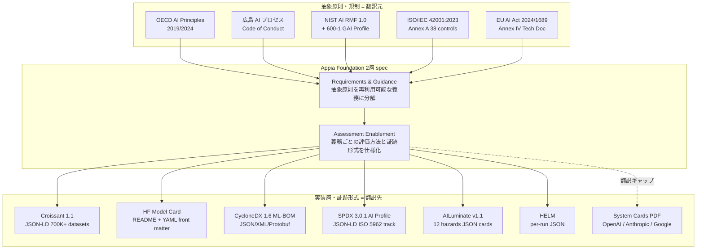
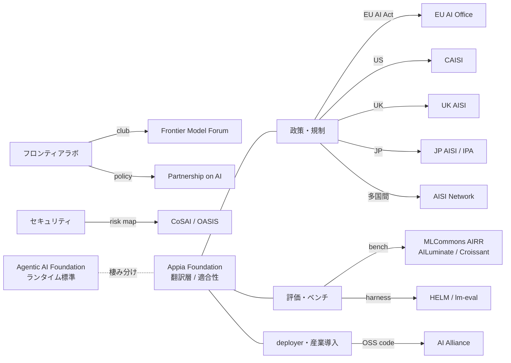

2026-06-17、Linux Foundation の Joint Development Foundation (JDF) 配下に **Appia Foundation** という新しい AI 標準化団体が立ち上がりました。OpenAI / Google / Microsoft / Siemens / Omron / 三菱電機 など 13 社が創設メンバーとして名を連ねています。

ガバナンス系のニュースは流し読みになりがちですが、Appia は「**抽象的な AI ガバナンス原則と、機械可読な実装証跡との間の翻訳層を埋める**」という、現場の AI ガバナンス整備に直接効く設計を打ち出しています。本記事では実装エンジニアの視点から、Appia の設計意図と、仕様確定前から取れる準備を整理します。

## 概要

Appia Foundation は、抽象的な AI ガバナンス原則と機械可読な実装証跡の間に欠けていた「翻訳層」を埋めることを目的に発足しました。翻訳の橋渡し対象は次のとおりです。

**翻訳元 (抽象原則・規制)**
- NIST AI RMF 1.0 + Generative AI Profile (NIST AI 600-1)
- ISO/IEC 42001 (AI マネジメントシステム)
- EU AI Act (Regulation 2024/1689)
- 広島 AI プロセス Code of Conduct
- OECD AI Principles

**翻訳先 (機械可読な証跡形式)**
- CycloneDX 1.6 ML-BOM
- SPDX 3.0.1 AI Profile
- Croissant 1.1 (dataset metadata)
- Hugging Face Model Card YAML
- MLCommons AILuminate (safety benchmark)

### 設立情報

| 項目 | 内容 |
|---|---|
| 設立日 | 2026-06-17 |
| 配下組織 | Linux Foundation / Joint Development Foundation |
| Executive Director | Craig Shank |
| 創設メンバー数 | 13 社 (3 層構成) |
| 公式 URL | https://appiafoundation.org/ |
| GitHub Organization | `appia-foundation` (作成日 2026-03-30、執筆時点で public repo 0 件) |

### メンバー構成 (3 層)

- **モデル供給層 (Steering Tier)**: OpenAI / Google / Microsoft 等
- **産業導入層**: Siemens / Omron / Schneider Electric / 三菱電機 等
- **第三者アセサー層**: Nemko / Armilla AI 等

OpenAI 公式ブログでは Appia と並行して、フロンティア評価の「**開示 5 項目**」commitment (system tested / tool access & eval harness / methods / resources / validation checks) を表明しています。これは Appia の "Assessment Enablement layer" と直接対応する設計です。

:::message
**重要な留保**: 設立 8 日目 (2026-06-25) 時点でフル White Paper は未公開、GitHub に公開 spec ドラフトもありません。公開技術文書は 7 ページの Executive Summary PDF のみです。仕様の実体は今後フル WP 公開 (二次情報では 2026 年 8 月予定、要再検証) で判明します。本記事は「設計意図」と「現存するピース」の整理に留まります。
:::

## 特徴

### 1. 2 層 spec 構造

Appia の仕様は二層で設計されます。

| 層 | 役割 | 翻訳元 | 翻訳先の例 |
|---|---|---|---|
| Requirements & Guidance | 抽象原則を再利用可能な「義務」「推奨」項目に分解 | NIST AI RMF Govern function / EU AI Act Annex IV / ISO 42001 Annex A 38 controls / 広島 11 行動 | 機械可読 JSON-LD obligations カタログ (想定) |
| Assessment Enablement | 各義務を満たすために、どの評価ハーネスで何を出力するかを仕様化 | OpenAI 開示 5 項目 / AILuminate / HELM Safety / Frontier Safety Frameworks | per-obligation evidence schema、CycloneDX / SPDX への field mapping |

この 2 層構造は、日本の **AI 事業者ガイドライン v1.1 (経産省・総務省、2025-03)** が「本編 (why/what)」と「別添 (how)」を分けている構造と同型です。日本企業にとって理解しやすい設計になっています。

### 2. 設計の肝 — Evidence Pass-Through

最も特徴的な設計原則は、**上流で済ませた conformity 評価結果を、下流が再利用可能な形式で受け取る**ことです。

現状の問題点は次のとおりです。

- モデルベンダーが System Card PDF を発行 → 銀行・公共部門が再度 ISO 42001 監査に向けて読み直し
- AILuminate でハザード採点済 → EU AI Act Annex IV に向けて再フォーマット
- Hugging Face Model Card YAML / CycloneDX ML-BOM / SPDX AI Profile が併存し、同じ情報を異なる形で再記述

Appia は「同じ証跡を一度作れば、上流から下流まですべての規制・標準に流せる」状態を目標にしています。これが機能すれば、多重評価コストの相当部分を削減できます。

### 3. 初期 4 つのワーキンググループ

- **Architecture WG** — 2 層 spec の全体構造、format/schema 設計
- **Policy WG** — 翻訳元 (NIST / ISO / EU AI Act / 広島) のスコープ確定
- **Obligation-Mapping WG** — 抽象原則 → 義務項目への分解
- **Regulatory-Connection WG** — EU AI Act を最初の具体規制ターゲットに設定 (Exec Summary 明文化)

JDF の PAS Submitter 資格を継承しているため、Appia spec を **ISO/IEC JTC 1 に PAS (Publicly Available Specification) として提出する動線が設計済み**です。「民間コンソーシアム標準で終わらず、ISO 規格として制度化する」意図が読み取れます。

### 4. 既存ガバナンス団体との棲み分け

| 団体 | 主要出荷物 | Appia との関係 |
|---|---|---|
| MLCommons (AILuminate / Croissant / MLPerf) | ベンチマーク + leaderboard | Assessment Enablement の評価ハーネス供給元 |
| AI Alliance (IBM/Meta 主導) | OSS コード / レシピ | 実装パターン提供、層が異なる |
| Partnership on AI (PAI) | ポリシーフレームワーク | Requirements & Guidance の翻訳元の一つ |
| Frontier Model Forum (FMF) | フロンティアラボ issue briefs | 一部メンバー重複、Appia は open membership で差別化 |
| AI Safety Institutes (UK / CAISI / JP) | 政府評価 / 国別ガイドブック | 政府ラボ間の評価、Appia は民間下流に flow |
| CoSAI (OASIS, Google SAIF 寄贈) | セキュリティリスクマップ | Security 軸で並走、AI Profile では補完関係 |
| AAIF (Agentic AI Foundation、同時期発足) | MCP / goose / AGENTS.md 等の agentic runtime 標準 | Appia は適合性、AAIF は実装ランタイム、棲み分け明示が必要 |

Appia 独自の差別化点は「ポリシー → 実装 → 証跡 の縦串を、open membership + ISO 接続動線で通そうとする」点にあります。

## 概念構造

### 全体像

### 既存標準の証跡到達度マップ

抽象原則から機械可読スキーマまで、各標準がどこまで降りているかを整理します。

| 翻訳元 | 抽象原則 | 管理策チェックリスト | 文書化された証跡 | 機械可読スキーマ |
|---|---|---|---|---|
| OECD AI Principles | あり | なし | なし | なし |
| 広島 Code | あり | 部分 | なし (任意自己報告) | なし |
| NIST AI RMF + 600-1 | あり | あり (Suggested actions, ID 付) | なし (組織定義) | 部分 (actions の CSV/JSON のみ) |
| ISO/IEC 23894 / 5338 | あり | なし (guidance のみ) | なし | なし |
| ISO/IEC 42001 | あり | あり (Annex A, 38 controls) | 部分 (audit trail、形は組織定義) | なし |
| EU AI Act 高リスク | あり | あり (Annex IV 章立) | **あり** (Tech Doc / DoC / インシデント報告) | **なし** (Appia がここを埋める) |

EU AI Act Annex IV はアーティファクトレベル最深部ですが「内容」を規定するに留まり、機械可読・組織横断のスキーマには到達していません。これが Appia 設計の出発点です。

### Appia 周辺団体マップ

## 想定通り機能しない 3 つのシナリオ (反証)

設立 8 日目時点で長文の批判は Hacker News / Reddit / Stratechery 等に出ていませんが、構造的に予想される失敗モードは存在します。

### 1. 翻訳層の前提崩壊 — フォーマット重複が解決していない (HIGH)

CycloneDX 1.6 ML-BOM と SPDX 3.0.1 AI Profile はカバレッジが非対称で、両者を統合する方法が業界で確立していません (AIRS の指摘、arXiv:2511.12668)。Appia がこの両者を「翻訳先」として持つと、**統合するつもりが第 3 の準標準を増やす**アンチパターンに陥り、暫定結論の中核 (実効的な証跡形式への翻訳) を直接損なう可能性があります。

Hugging Face Model Card YAML が既に de facto で、追加標準が採用されない可能性もあります。

### 2. global 標準の前提崩壊 — 規制環境の三極化と中国不在 (HIGH)

次の 3 つで規制環境が三極化しています。

- Trump 政権下の deregulation + CAISI の "safety" 名称除去 (2025-06-03 リネーム)
- EU strict (2025-08 GPAI 義務発動、2026-08 高リスク義務発動)
- 中国 sovereign (CAIA / MIIT 系標準)

Appia 創設 13 社に中国系 AI 企業は不在です。「global AI value chain 標準」が**西側 supplier 内に縮退する**蓋然性が高いと言えます。Fortune / Bloomberg Law (2026) / ITIF (2026-05) / East Asia Forum (2025-12) の分析が一致してこの三極化を指摘しています。

### 3. 構造的利益相反 — Regulatory Capture の構図継承 (HIGH)

Appia 創設メンバーには EU AI Act の規制対象企業 (OpenAI / Google / Microsoft / Arm) が並びます。これは Frontier Model Forum が "regulatory capture vehicle" と批判された構図 (Fortune 2023-07 / Reworked / Tech Monitor) と同型です。「中立な実装層」の正当性を弱める可能性があります。

Appia は third-party assessor (Nemko / Armilla AI) を含む点で FMF より open ですが、Steering Tier がモデル供給側に集中している事実は変わりません。

### 確信度を低める観察

- 設立 8 日目時点で長文批判が観測できていない事実は、観測期間不足によるものです。「批判の不在」を結論の頑健性根拠にはできません
- Slashdot コメントに「LLM の非決定性 vs policy 標準化の根本矛盾」型の懐疑が出ています (severity LOW)

## 日本企業が今取れる 3 アクション (推奨)

Appia の仕様は未確定ですが、**仕様が固まる前から取り組める preparation はあります**。「翻訳層が来る前提で証跡を機械可読化しておく」のが軸です。

### A. Model Card / Dataset Card の機械可読化を先取りする (1 週間)

- 自社モデルやファインチューニング済みモデルに Hugging Face Model Card YAML を付与する (`language` / `license` / `library_name` / `tags` / `datasets` / `metrics` / `model-index`)
- 訓練・評価データには Croissant 1.1 メタデータ (JSON-LD) を付ける (Hugging Face が自動生成可)
- これで Appia の Assessment Enablement が来たときに、既存証跡をそのままマッピング可能になる

### B. CycloneDX ML-BOM / SPDX AI Profile の両方併用パイロット (2-4 週間)

- 1 つの社内モデルで両フォーマットを生成し、フィールド重複と差分を実測する
- CycloneDX は `quantitativeAnalysis` (性能メトリクス + confidence intervals) と `considerations` (limitations / ethical / fairness / environmental) が強い
- SPDX 3 AI Profile は `safetyRiskAssessment` / `standardCompliance` / `energyConsumption` (training / inference / finetuning 分割) が強い
- 重複部分は社内マッピング表を作る。Appia spec 公開後に差分だけ修正すれば移行可能

### C. AILuminate DEMO + IPA AISI 評価ツールで内部ベンチを 1 サイクル (1-2 週間)

- AILuminate **DEMO subset 1,200 プロンプト** (CC-BY、`mlcommons/ailuminate`) を社内モデルで実行
- 日本 AISI が Apache-2.0 で公開している評価ツールを fork して、JP 文脈での fine-grained 評価を追加
- 結果を CycloneDX / SPDX の `quantitativeAnalysis` / `metric` フィールドに格納する CI を組む
- これで EU AI Act Annex IV §4 (性能メトリクス) の準備にもなる

### おまけ — Appia への関与ルート 3 つ

1. **業界貢献ルート**: 三菱電機 / Omron / Siemens 経由で Appia の Architecture / Obligation-Mapping WG にメンバー帯で参加
2. **制度ルート**: 経産省・総務省 AIGA / 広島プロセス報告枠組み経由で公的協調
3. **観察参加ルート**: Linux Foundation JDF の Working Group に直接参加 (個人メンバーで可)

## 未解決の問い

- フル White Paper (2026 年 8 月予定、要再検証) で 2 層 spec の具体スキーマがどう書かれるか
- ISO/IEC JTC 1 PAS submission のタイミングと成功確率
- 中国系 AI 企業が後続メンバーとして加わる可能性
- Trump 政権下の CAISI が Appia とどう協調するか (NIST AI RMF はそのまま Appia 翻訳元に残るか)
- 日本企業の本格関与 (Omron / 三菱電機以外)
- AAIF (Agentic AI Foundation) との明示的な棲み分け文書の公表時期

## まとめ

Appia Foundation は AI 標準の「翻訳層」を埋めるオープン仕様団体です。2 層 spec 構造と evidence pass-through 設計により、機能すれば多重評価コストを大きく削減できます。一方でフォーマット重複の未解決・規制三極化・regulatory capture 構図の継承という 3 つのリスクは無視できません。実装エンジニアは仕様確定を待たず、HF Model Card YAML / CycloneDX / SPDX / AILuminate DEMO で証跡の機械可読化を先取りしておくと、翻訳層が来たときに最短で接続できます。

この記事が少しでも参考になった、あるいは改善点などがあれば、ぜひリアクションやコメント、SNS でのシェアをいただけると励みになります。

## 参考リンク

### 公式ドキュメント・一次ソース
- [OpenAI: Helping build shared standards for advanced AI](https://openai.com/index/helping-build-shared-standards-for-advanced-ai/)
- [Appia Foundation 公式](https://appiafoundation.org/)
- [Linux Foundation Joint Development Foundation](https://www.jointdevelopment.org/)
- [EU AI Act The Act](https://artificialintelligenceact.eu/the-act/)
- [EU AI Act Annex IV](https://artificialintelligenceact.eu/annex/4/)
- [EU AI Act 実装タイムライン](https://artificialintelligenceact.eu/implementation-timeline/)
- [EC GPAI Code of Practice](https://digital-strategy.ec.europa.eu/en/policies/ai-code-practice)
- [NIST AI RMF](https://www.nist.gov/itl/ai-risk-management-framework)
- [NIST AI 600-1 Generative AI Profile (PDF)](https://nvlpubs.nist.gov/nistpubs/ai/NIST.AI.600-1.pdf)
- [NIST AI RMF Playbook](https://airc.nist.gov/airmf-resources/playbook/)
- [ISO/IEC 42001:2023](https://www.iso.org/standard/42001)
- [OECD AI Principles](https://oecd.ai/en/ai-principles)
- [広島 AI プロセス Code of Conduct (EC mirror)](https://digital-strategy.ec.europa.eu/en/library/hiroshima-process-international-code-conduct-advanced-ai-systems)

### 実装層・評価フレームワーク
- [MLCommons AILuminate](https://mlcommons.org/benchmarks/ailuminate/)
- [AILuminate leaderboard](https://ailuminate.mlcommons.org/)
- [MLCommons Croissant 1.1](https://mlcommons.org/2026/02/croissant-1-1-standard/)
- [HELM](https://crfm.stanford.edu/helm/)
- [Hugging Face Model Cards](https://huggingface.co/docs/hub/en/model-cards)
- [CycloneDX ML-BOM](https://cyclonedx.org/capabilities/mlbom/)
- [SPDX 3.0.1 AI Profile](https://spdx.github.io/spdx-spec/v3.0.1/model/AI/AI/)

### Frontier Safety Frameworks
- [Anthropic RSP v3.0](https://www.anthropic.com/news/responsible-scaling-policy-v3)
- [OpenAI Preparedness Framework v2 (PDF)](https://cdn.openai.com/pdf/18a02b5d-6b67-4cec-ab64-68cdfbddebcd/preparedness-framework-v2.pdf)
- [Google DeepMind Frontier Safety Framework](https://deepmind.google/blog/strengthening-our-frontier-safety-framework/)
- [Google SAIF](https://saif.google/)

### 類似ガバナンス団体
- [AI Alliance](https://thealliance.ai/)
- [Partnership on AI](https://partnershiponai.org/)
- [Frontier Model Forum](https://www.frontiermodelforum.org/)
- [UK AI Security Institute](https://www.aisi.gov.uk/)
- [日本 AISI](https://aisi.go.jp/)
- [CAISI rebrand 報道 (FedScoop)](https://fedscoop.com/trump-administration-rebrands-ai-safety-institute-aisi-caisi/)
- [AISI Network 立ち上げ (NIST)](https://www.nist.gov/news-events/news/2024/11/fact-sheet-us-department-commerce-us-department-state-launch-international)

### GitHub リポジトリ
- [mlcommons/ailuminate](https://github.com/mlcommons/ailuminate)
- [mlcommons/croissant](https://github.com/mlcommons/croissant)
- [stanford-crfm/helm](https://github.com/stanford-crfm/helm)
- [EleutherAI/lm-evaluation-harness](https://github.com/EleutherAI/lm-evaluation-harness)
- [CycloneDX/specification](https://github.com/CycloneDX/specification)

### 反証・批判
- [AIRS: CycloneDX vs SPDX 非対称 (arXiv:2511.12668)](https://arxiv.org/abs/2511.12668)
- [Preparedness Framework v2 への批判 (arXiv:2509.24394)](https://arxiv.org/abs/2509.24394)
