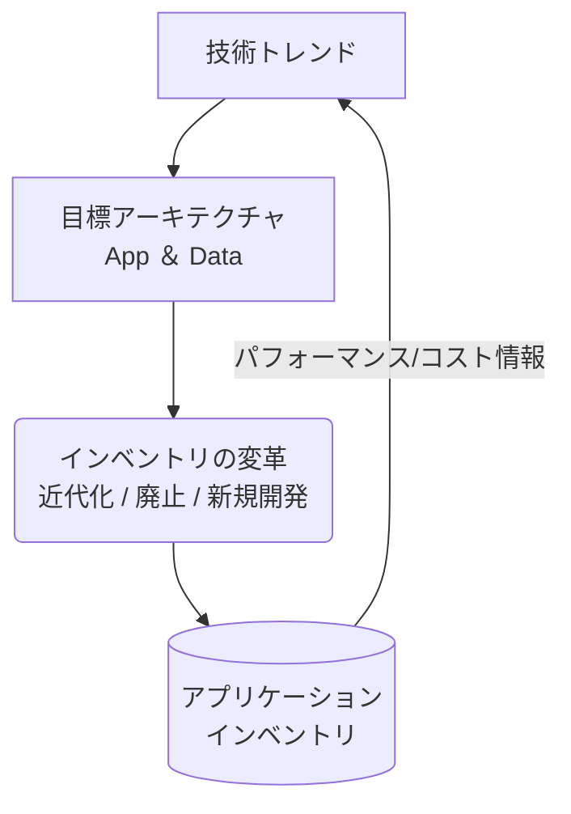
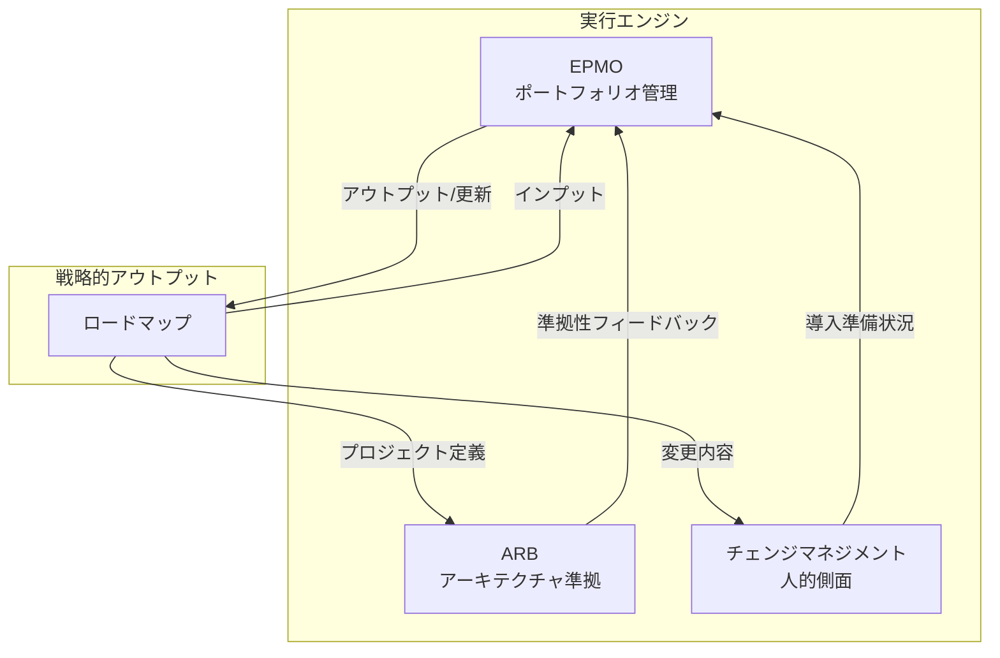

現代のビジネスにおいて、アプリケーション戦略は単なるIT計画ではありません。それは、デジタルトランスフォーメーションを加速させ、事業の俊敏性を高めるための**経営上の羅針盤**です。

しかし、「何から手をつければいいのかわからない」「戦略が絵に描いた餅で終わってしまう」といった悩みも少なくありません。この記事では、最新のアプリケーション戦略を策定し、着実に実行するための体系的なアプローチを、具体的な4つのフェーズに沿って解説します。

### 第1章：戦略の土台を築く - 必須要件の定義

まず、私たちが目指すゴールと、そのために必要な道具を明確にします。本章では、アプリケーション戦略の基本的な考え方と構成要素を定義し、戦略策定の揺るぎない基盤を構築します。

#### 1.1. 最新のアプリケーション戦略とは？

アプリケーション戦略とは、組織のアイデアを価値あるアプリケーションへと転換するための**構造化された計画**です。この戦略は、開発する「モノ（What）」と、それがビジネスにもたらす「価値（Why）」を明確に結びつけます。優れた戦略は、事業戦略、IT戦略、ベンダー戦略の架け橋となり、すべてのアプリケーションが測定可能なビジネス目的を達成するよう導きます。

#### 1.2. 堅牢な戦略を支える「4つの柱」

優れた戦略は、以下の4つの柱を基盤とします。これらは互いに影響し合いながら、戦略全体を形作ります。

  - **アプリケーションインベントリ**: 組織が持つすべてのソフトウェア資産の完全なリスト。現状把握の第一歩です。
  - **アプリケーションポートフォリオアーキテクチャ**: 複数のアプリケーション群がどのように連携し、ビジネス全体を支えているか。性能、拡張性、回復力を決定します。
  - **データアーキテクチャ**: 複数のアプリケーション群を流れる情報の設計図。
  - **技術トレンド**: 競争優位性を生み出すための、未来を見据えた技術の潮流。

これら4つの柱は、以下のように相互に連携し、戦略策定のサイクルを形成します。

| 要素名 | 説明 |
| :--- | :--- |
| **技術トレンド** | 将来の目標アーキテクチャを描くための推進力となります。 |
| **目標アーキテクチャ** | ビジネスプロセスと技術トレンドを基に定義される、組織の「あるべきシステムとデータの構造」です。 |
| **インベントリの変革** | 目標アーキテクチャに基づき、既存アプリの近代化、廃止、新規開発を決定します。 |
| **アプリケーションインベントリ** | 変革の対象となる既存資産。その実績データは、新たな技術トレンドを採用できるか判断する材料にもなります。 |

#### 1.3. 主要な目標と期待される成果

アプリケーション戦略の最終目標は、具体的なビジネス成果の達成です。

  - **主な目標**:
      - 新たな収益源の創出
      - 顧客エンゲージメントの強化
      - 業務の俊敏性の向上
      - IT投資対効果（ROI）の最大化
  - **期待される成果**:
      - IT予算の正当性を明確に説明できる
      - アプリケーションチームの貢献価値が明確になる
      - 事業部門がIT戦略を「自分ごと」として理解する
      - IT部門が単なるコストセンターから、事業価値を生み出す**バリュードライバー**へと変革する

### 第2章：フェーズ I - 現状を直視する (As-Is分析)

このフェーズでは、現在のIT環境を徹底的に調査し、データに基づいた「健康診断書」を作成します。このAs-Is分析が、今後のすべての戦略的意思決定における客観的な土台となります。

#### 2.1. アプリケーションインベントリの構築

まず取り掛かるべきは、組織が保有する全ソフトウェア資産の棚卸しです。これにより、ITランドスケープ全体を俯瞰し、無駄の発見、コスト最適化、リスク管理が可能になります。

  - **データ収集方法**:
      - **手動入力**: スプレッドシートなど。小規模組織向け。
      - **自動検出**: APMツールやSaaS管理ツールを活用。管理外の「シャドーIT」の発見にも有効です。
      - **ハイブリッド型**: ビジネス視点のトップダウン分析と、技術視点のボトムアップ分析を組み合わせる手法が最も効果的です。
  - **収集すべき主な項目**:
    戦略的な分析のためには、多角的なデータが必要です。例えば、以下のような項目を網羅的に集めることが理想です。

| カテゴリ | 属性 | 説明 | 例 |
| :--- | :--- | :--- | :--- |
| **識別情報** | アプリケーション名 | アプリケーションの正式名称 | Salesforce CRM |
| | アプリケーションID | 内部で一意に識別するためのID | APP-00123 |
| | 説明・目的 | 機能と解決するビジネス課題の簡潔な要約 | 顧客のリード、商談、連絡先の管理 |
| **所有権** | ビジネスオーナー | 価値と機能性に責任を持つ事業部門のリーダーまたは部署 | 営業担当副社長 |
| | テクニカルオーナー | 技術的な保守・運用に責任を持つITマネージャーまたはチーム | ITアプリケーションチームリーダー |
| **技術詳細** | 技術スタック | 使用されている主要な言語、フレームワーク、プラットフォーム | Apex, Lightning Web Components |
| | ホスティングモデル | アプリケーションがホストされている場所 | クラウド (SaaS), オンプレミス |
| | ライフサイクルステータス | 現在のライフサイクルの段階 | 稼働中, 縮小中, サポート終了 |
| **ビジネスコンテキスト** | サポートするビジネスケーパビリティ | アプリケーションが支える特定のビジネス能力 | リード管理, 商談追跡 |
| | 利用部署 | アプリケーションを使用する主要な部署やユーザーグループ | 営業, マーケティング, カスタマーサービス |
| | ビジネス上の重要度 | 利用不能になった場合のビジネスへの影響度 | ミッションクリティカル, ビジネスクリティカル |
| **財務情報** | 総所有コスト (TCO) | ライセンス、保守、インフラを含む年間の総コスト | 年間2,500万円 |
| | 契約更新日 | 現在の契約が満了する日付 | 2025-12-31 |
| **リスク・コンプライアンス** | データ機密性 | アプリケーションが扱うデータの分類 | 公開, 社内限定, 機密, 個人情報 |
| | コンプライアンス状況 | 関連する規制への準拠状況 | GDPR準拠, SOX法対象 |

##### アプリケーションインベントリの自動収集に利用できるツールやプラットフォーム

| カテゴリ | 主な目的 | 代表的なツール | 特徴 |
|---|---|---|---|
| **APM & オブザーバビリティツール** | アプリケーションのパフォーマンスや健全性を監視する過程で、稼働中のアプリケーションやその依存関係を自動的に検出する。 | ・Datadog  ・Splunk  ・Elastic | ・稼働中のアプリケーションとその依存関係を自動的にマッピングする。   ・ログ、メトリクス、トレース情報を収集・分析し、利用状況を把握する。   ・GartnerのMagic QuadrantでDatadogやSplunkは「リーダー」として評価されている。 |
| **SaaS管理プラットフォーム (SMP)** | 経費精算システムやネットワークトラフィックを分析し、IT部門が管理していない「シャドーIT」を含むSaaS利用を網羅的に検出・管理する。 | ・Zylo    ・Flexera One    ・Netskope | ・AIを活用して経費データなどを分析し、組織内のSaaSを包括的に発見・分類する。   ・ライセンスの利用状況追跡、コスト最適化、契約更新管理までを一元的に行う 。   ・NetskopeはForrester Waveレポートでリーダーに選出されており、管理外のクラウドアプリ利用を可視化する。 |
| **IT資産管理 (ITAM) / ソフトウェア資産管理 (SAM) ツール** | ソフトウェアライセンスのコンプライアンスとコスト最適化を目的とし、オンプレミスからクラウドまで広範なソフトウェア資産を検出・管理する。 | ・Snow Software    ・Flexera One | ・ハイブリッド環境（オンプレミス、クラウド、モバイル）全体のIT資産を検出し、完全な可視性を提供する 。   ・ハードウェアとソフトウェアのライフサイクル全体を管理する 。 |
| **ITSM/ITOMプラットフォーム** | ITサービス管理（ITSM）やIT運用管理（ITOM）のプロセスと連携し、構成管理データベース（CMDB）を中核としてインベントリを自動構築・維持する。 | ・ServiceNow Application Portfolio Management (APM) | ・Discovery機能などを通じて、インフラからアプリケーションまでの関係性を自動的にマッピングする。   ・アプリケーションの技術的な依存関係やビジネスへの影響度を可視化できる。 |
| **エンタープライズアーキテクチャ (EA) ツール** | 組織全体のIT資産をビジネス戦略の視点から管理し、アプリケーションポートフォリオを可視化・最適化する。 | ・SAP LeanIX    ・Ardoq   ・Planview | ・アプリケーションポートフォリオ管理機能を提供する 。   ・アンケートやワークフローの自動化により、アプリケーションの所有者情報などを効率的に収集・維持できる。   ・アプリケーションとビジネスケーパビリティの連携をマッピングし、戦略的な意思決定を支援する。 |

これらのツールはそれぞれ得意分野が異なるため、インベントリ収集の主目的（コスト削減、リスク管理、パフォーマンス監視など）に応じて、最適なものを選択したり、複数を組み合わせて利用したりすることが一般的です。

#### 2.2. 現在のアーキテクチャを可視化する

インベントリが「部品リスト」だとすれば、アーキテクチャ図は「組立図」です。部品同士がどう繋がり、作用しているかを可視化することで、依存関係の理解や変更計画の策定が容易になります。

  - **システム構成図**: ITシステムの物理的・論理的な構成要素とそれらの相互関係を図示します。
  - **データフロー図 (DFD)**: データがシステム間をどのように入力、処理、保存、出力されるかの流れを可視化します。
  - **ビジネスプロセスマッピング (BPMN)**: ビジネスプロセスを標準化された形式で描き、事業運営とITシステムの間のギャップを特定します。
  - **ビジネスケーパビリティマッピング**: 各アプリケーションを、それが支えるビジネス能力（組織が目的達成のために「何を行うか」）に紐付け、ビジネス価値を評価します。

### 第3章：フェーズ II - あるべき姿を描く (To-Beビジョン)

現状(As-Is)分析を踏まえ、このフェーズでは、事業戦略と最新技術トレンドを反映した、達成可能な「あるべき姿(To-Be)」を定義します。

#### 3.1. 競争優位性を生む技術トレンドの活用

現在の技術環境は、AIを駆使した「インテリジェンス・スーパーサイクル」への移行期にあります。この潮流を前提に戦略を構築することが不可欠です。

  - **2025年以降の主要技術トレンド**:
      - **AIの進化とリスク**: 人間に代わって判断・実行するエージェント型AIの台頭、AIガバナンスの重要性、巧妙化する偽情報への対策。
      - **コンピューティングの新次元**: ポスト量子暗号によるセキュリティ強化、ハイブリッドコンピューティング、環境に配慮したグリーンITの推進。
      - **人間と機械の融合**: IoTを活用したアンビエント・インテリジェンス、AR/VRによる空間コンピューティング、多機能ロボットの活用。

これらのトレンドは、将来のアーキテクチャに対して、堅牢なAPI、イベント駆動型アーキテクチャ、スケーラブルなデータ基盤などを要求します。

#### 3.2. 最新のアプリケーションアーキテクチャ原則

将来像に求められる俊敏性、拡張性、回復力を実現するため、現代的なアーキテクチャパターンを適用します。

  - **クラウドネイティブアーキテクチャ**: 市場投入までの時間短縮、リソース効率の向上、優れた顧客体験を実現する設計思想です。
  - **マイクロサービスアーキテクチャ**: 巨大なアプリケーションを、独立して開発・デプロイ可能な小さなサービスの集合体として構築するアプローチです。
      - **利点**: サービスごとの独立した拡張、障害の影響範囲の限定、技術選択の自由度向上、チームの生産性向上。
      - **欠点**: 分散システム特有の複雑さ（サービス間通信、テスト、監視など）が増大します。
  - **中核となるアーキテクチャ原則**:
      - **関心の分離**: 機能ごとに責務を明確に分け、独立させます。
      - **単一の信頼できる情報源 (SSoT)**: データの一貫性と信頼性を保ちます。
      - **カプセル化**: 内部の複雑な構造を隠蔽し、シンプルに扱えるようにします。
      - **拡張性とセキュリティ**: 設計の初期段階から組み込みます。

#### 3.3. ターゲットアーキテクチャビジョンの策定

ターゲットアーキテクチャの意欲的な姿、すなわち「アーキテクチャビジョン」を策定します。これは、一度作ったら終わりの固定的な計画ではなく、ビジネスの変化に柔軟に対応できる動的な「方針」として機能すべきです。

  - **ビジョン策定プロセス (TOGAF ADMフェーズAの簡略版)**:
    1.  **プロジェクトの確立**: 経営層の支持を得て、スコープを定義します。
    2.  **関係者の特定**: 関係者のニーズや懸念事項を洗い出します。
    3.  **ビジネスゴールの再確認**: 事業戦略との連携を確実にします。
    4.  **ビジョンの具体化**: 最新のアーキテクチャ原則を適用し、ターゲット像を作成します。
    5.  **価値とKPIの定義**: 変革がもたらすビジネス価値と、その成功を測る指標を定義します。
    6.  **合意形成**: 詳細設計に進むためのステークホルダーの承認を得ます。

### 第4章：フェーズ III - ギャップを埋める戦略の策定

このフェーズでは、現状(As-Is)とあるべき姿(To-Be)を比較してギャップを特定し、それを埋めるための具体的な戦略を立てます。

#### 4.1. 多角的な視点でギャップを洗い出す

ギャップ分析とは、現在の状態と望ましい将来の状態との差異（ギャップ）を特定し、課題を明確にするプロセスです。

  - **分析プロセス**:
    1.  **現状の特定**: フェーズIの成果物（インベントリ、アーキテクチャマップ）をインプットとします。
    2.  **将来像の特定**: フェーズIIの成果物（アーキテクチャビジョン）をゴールとします。
    3.  **ギャップの特定と記述**: テクノロジー、プロセス、スキルセットにおける具体的な差異を文書化します。
  - **分析フレームワークの活用**:
      - **SWOT分析**: 自社の強み (Strengths)、弱み (Weaknesses)、機会 (Opportunities)、脅威 (Threats) を整理します。
      - **PESTLE分析**: 政治 (Political)、経済 (Economic)、社会 (Social)、技術 (Technological) といった外部環境要因を分析します。
      - **マッキンゼーの7S**: 戦略、組織構造、システムなど7つの内部組織要素にわたるギャップを分析します。

#### 4.2. アプリケーションポートフォリオの合理化：TIMEフレームワーク

アプリケーション合理化とは、個々のアプリケーションを評価し、その将来（維持、更新、統合、廃止）を決定するプロセスです。ここでは業界標準であるGartnerのTIMEモデルを活用します。

| | 低いビジネス価値 | 高いビジネス価値 |
| :--- | :--- | :--- |
| **高い技術的適合度** | **TOLERATE (許容)**  **基準**: 技術的に健全だが戦略の中核ではない。 **アクション**: 最小限の投資で現状維持。機会を見て段階的に廃止。 **例**: 特定部署でのみ使用されるレガシーなレポートツール。 | **INVEST (投資)**  **基準**: 戦略的に重要かつ技術的に堅牢。 **アクション**: 新機能や拡張に積極的に投資。より広範な採用を促進。 **例**: 企業の主要なEコマースプラットフォーム。 |
| **低い技術的適合度** | **ELIMINATE (廃止)**  **基準**: 陳腐化した技術、高い保守コスト、冗長な機能。 **アクション**: 廃止とサービス停止を計画。リソースを再配分。 **例**: ERPに代替された古いカスタムデータベース。 | **MIGRATE (移行)**  **基準**: 事業に不可欠だが、時代遅れで不安定な技術上に構築。 **アクション**: 近代化の最優先対象。最新プラットフォームへの移行戦略を選択。 **例**: サポート終了したメインフレーム上の基幹ERP。 |

#### 4.3. アプリケーション近代化戦略：「R」戦略の選択

TIMEモデルで「移行（Migrate）」または「投資（Invest）」と分類されたアプリケーションに対し、以下の具体的な近代化戦略から最適なものを選択します。

  - **リホスト (Rehost / Lift and Shift)**: クラウドのIaaS環境へそのまま移行。最も迅速ですが、クラウドの恩恵は限定的です。
  - **リプラットフォーム (Replatform / Lift and Reshape)**: OSやミドルウェアのバージョンアップなど、軽微な修正を加えてクラウドの能力をより活用します。
  - **リファクタリング／リアーキテクト (Refactor / Rearchitect)**: コードを大幅に再構築し、マイクロサービス化などで最新アーキテクチャへ移行します。
  - **リビルド (Rebuild)**: クラウドネイティブプラットフォーム上でゼロから作り直します。
  - **リプレース (Replace)**: 既存アプリを廃止し、SaaSソリューションなどで完全に置き換えます。

### 第5章：フェーズ IV - 戦略を実行し、統制する

最終フェーズでは、策定した戦略を具体的な実行計画に落とし込み、推進するための仕組みとプロセスを確立します。戦略を絵に描いた餅にしないための、最も重要な段階です。

#### 5.1. 戦略的アプリケーションロードマップの構築

ロードマップは、短期的・長期的な計画を視覚化した高レベルの青写真です。これにより、関係者間で共通認識を持ち、進捗を管理することができます。

  - **ロードマップの作成手順**:
    1.  **目標と期間の定義**: 2〜3年スパンで、測定可能な目標を設定します。
    2.  **イニシアチブのリストアップ**: TIME/R戦略から特定されたプロジェクトを洗い出します。
    3.  **イニシアチブの優先順位付け**: 以下のマトリクスなどを活用し、着手すべき順序を決定します。
    4.  **タイムライン上での可視化**: ガントチャートなどを用いて、各プロジェクトを時系列に配置します。
    5.  **KPIの定義**: 進捗と成果を測るための重要業績評価指標（KPI）を定義します（例：アプリケーションTCO削減率、プロジェクトの期日内完了率など）。

##### イニシアチブ優先順位付けマトリクス（インパクト vs. 労力）

| | 低い労力 | 高い労力 |
| :--- | :--- | :--- |
| **高いインパクト** | **第1象限：クイックウィン (Quick Wins)**  **説明**: 価値が高く、実装が容易。 **アクション**: **今すぐ実行**。 | **第2象限：主要プロジェクト (Major Projects)**  **説明**: 大きな価値をもたらすが、多大な投資と時間を要する。 **アクション**: **戦略的に計画**。 |
| **低いインパクト** | **第3象限：補完的改善 (Fill-ins)**  **説明**: 軽微な利益をもたらす簡単なタスク。 **アクション**: **時間があれば実行**。 | **第4象限：時間の浪費 (Thankless Tasks)**  **説明**: わずかな見返りのために多くの労力を要する。 **アクション**: **回避または再評価**。 |

#### 5.2. 戦略を軌道に乗せるガバナンス体制の確立

ガバナンスとは、IT管理を統制し、事業目標との整合性を保つためのルールやプロセスのことです。

  - **主要なガバナンス組織**:
      - **アーキテクチャレビュー委員会 (ARB)**: 新しいソリューションがアーキテクチャ標準に準拠しているかをレビューし、技術的な一貫性を保ちます。
      - **エンタープライズPMO (EPMO)**: プロジェクトポートフォリオ全体を監督し、戦略目標との整合性を確認します。
      - **Center of Excellence (CoE)**: 特定領域（クラウド、AIなど）の専門家集団。ベストプラクティスを確立し、イノベーションを推進します。
  - **ITガバナンスフレームワークの活用 (COBITなど)**:
    COBITのような世界的に認知されたフレームワークを活用することで、ガバナンスプロセスを体系的に構築し、役割と責任を明確にできます。

#### 5.3. 変革の推進力：人的要素のマネジメント

デジタルトランスフォーメーションは、技術だけでなく人々の働き方そのものを変革します。そのため、変化に対する抵抗を乗り越え、組織全体を巻き込む「チェンジマネジメント」が不可欠です。

  - **成功のための主要戦略**:
    1.  **トップダウンでの推進**: 経営幹部からの積極的な支援とコミットメントを確保します。
    2.  **明確なビジョンの共有**: 変革の「なぜ」と「利点」を、繰り返し、双方向のコミュニケーションで伝えます。
    3.  **従業員の巻き込み**: プロセスに従業員を関与させ、必要なトレーニングやサポートを提供して不安を取り除きます。
    4.  **段階的な導入**: まずはパイロットプロジェクトから始め、成功体験を積み重ねながら段階的に展開します。
    5.  **成果の可視化と称賛**: 小さな成功を祝い、継続的にフィードバックを収集して改善に繋げます。

ロードマッピング、ガバナンス、チェンジマネジメントは、個別の活動ではありません。これらを連携させ、戦略を推進する **統合された「実行エンジン」** として機能させることが重要です。

| 要素名 | 説明 |
| :--- | :--- |
| **ロードマップ** | 「何を」「いつ」実行するかを示す戦略計画。実行エンジンのインプットとなります。 |
| **EPMO** | ロードマップに基づきプロジェクトポートフォリオ全体を管理し、優先順位を決定します。 |
| **ARB** | ロードマップ上のプロジェクトが、ターゲットアーキテクチャから逸脱しないよう保証します。 |
| **チェンジマネジメント** | ロードマップがもたらす変化に対し、従業員の準備と適応をサポートします。 |

### まとめ

効果的なアプリケーション戦略の策定と実行は、一度きりのプロジェクトではなく、**継続的な改善サイクルを回す組織的な能力**そのものです。

1.  **As-Is（現状）の厳密な把握**: 正確なデータに基づき、客観的な意思決定の土台を築きましょう。
2.  **To-Be（あるべき姿）の動的な構想**: 固定的な計画ではなく、変化に対応できる原則に基づいた「方針」を定義しましょう。
3.  **ギャップの戦略的分析と合理化**: フレームワークを用いて、客観的なデータに基づきポートフォリオを磨き上げましょう。
4.  **統合された実行**: ロードマップ、ガバナンス、チェンジマネジメントを一つの実行エンジンとして機能させ、戦略を現実のものとしましょう。

この体系的なアプローチを適用することで、IT部門はコストセンターから脱却し、組織の競争優位性を生み出す真の戦略的パートナーへと進化できるはずです。

この記事が少しでも参考になった、あるいは改善点などがあれば、ぜひリアクションやコメント、SNSでのシェアをいただけると励みになります！

---

### 参考リンク

-   **戦略・ポートフォリオ管理**
    -   [Appendix 1 Applications Management Strategy 2018-23 DRAFT - City of London council](https://democracy.cityoflondon.gov.uk/documents/s104066/Appendix%201%20-%20Applications%20Management%20Strategy%20v1_0.pdf)
    -   [Application Portfolio Management Playbook | OpenText](https://www.opentext.com/assets/documents/en-US/pdf/info-tech-application-portfolio-management-playbook-en.pdf)
    -   [Application Strategy Review | Info-Tech Research Group](https://www.infotech.com/concierge-services/application-strategy-review)
    -   [What is Application Portfolio Management? Definition & Tools - Adobe for Business](https://business.adobe.com/blog/basics/application-portfolio-management)
    -   [What is Application Strategy Alignment? - Loggle](https://loggle.io/knowledgebase/application-strategy-alignment)
    -   [IT戦略フレームワークとは？構想策定からIT化を成功に導く手順を解説 - ガートナージャパン](https://www.gartner.co.jp/ja/topics/it-strategic-plan)
    -   [IT投資マネジメントコンサルティング](https://www.hitachiconsulting.co.jp/archive/pdf/it_investmanage.pdf)
    -   [ROI最大化！IT投資効果を可視化する5つの指標 | 特定非営利活動法人ＩＴ整備士協会](https://www.it-seibishi.or.jp/4138/)
    -   [アプリマーケティングの8つの必須戦略 - Adjust](https://www.adjust.com/ja/blog/your-guide-to-app-marketing-strategies/)
    -   [アプリマーケティングとは？基礎知識から具体的な戦略まで徹底紹介！ - エンバーポイント](https://emberpoint.com/blog/column/220128-001.html)
    -   [事業戦略の目的や重要性とは？戦略の立て方やフレームワーク、ポイントを紹介 - Braze](https://www.braze.com/ja/resources/articles/business-strategy)
    -   [優れたアプリ戦略に必要なこと6選｜実践ノウハウ解説 - Repro Journal](https://repro.io/contents/mobile-app-strategy/)
    -   [How to Execute an Application Development Strategy with LCNC Advantage? - Quixy](https://quixy.com/blog/application-development-strategy/)
    -   [Application Portfolio Management: 6 Key Elements for Success - North Highland](https://northhighland.com/insights/guides/application-portfolio-management)
    -   [Application Portfolio Management: Essential Elements and 7 Critical Best Practices](https://faddom.com/application-portfolio-management-essential-elements-and-7-critical-best-practices/)
    -   [マーケティング戦略とは？策定手順3ステップやフレームワーク、成功事例を解説 | Salesforce](https://www.salesforce.com/jp/marketing/how-to-build-marketing-strategy/)

-   **インベントリ・合理化**
    -   [Application and Infrastructure Inventory Template and Instructions - Washington Technology Solutions](https://watech.wa.gov/sites/default/files/2024-06/App%20%26%20Infrastructure%20Inventory%20Template_2024_v2.1.xlsx)
    -   [Gartner's T.I.M.E Chart – One of the most influential charts in Application Portfolio Management - Prolaborate](https://prolaborate.sparxsystems.com/resources/articles/gartners-t-i-m-e-chart-one-of-the-most-influential-charts-in-application-portfolio-management)
    -   [Gartner® TIME Model: Effective Application Portfolio Mgmt | LeanIX](https://www.leanix.net/en/wiki/apm/gartner-time-model)
    -   [The Application Rationalization Playbook - CIO Council](https://www.cio.gov/assets/files/Application-Rationalization-Playbook.pdf)
    -   [What is an Application Inventory? | Loggle](https://loggle.io/knowledgebase/application-inventory)
    -   [アプリケーションの合理化のためのガートナーTIMEフレームワークの活用 - LeanIX](https://www.leanix.net/ja/download/applying-the-gartner-time-framework-for-application-rationalization)
    -   [Application Inventory Template: 4 Examples and Building Your Own - Faddom](https://faddom.com/application-inventory-template-4-examples-and-building-your-own/)
    -   [Application Inventory: How to Build and Understand One | LeanIX](https://www.leanix.net/en/wiki/apm/application-inventory)
    -   [Application Rationalization Step-by-Step Framework - Apptio](https://www.apptio.com/topics/application-rationalization/)
    -   [Application Rationalization: How to Triage Your Software Portfolio for Modernization](https://stratusgrid.com/blog/application-rationalization-process)
    -   [Article - Application Inventory Basics - Team Dynamix Com](https://solutions.teamdynamix.com/TDClient/1965/Portal/KB/ArticleDet?ID=140357)
    -   [Inventory App Templates - Jotform](https://www.jotform.com/app-templates/category/inventory-app-templates)

-   **アーキテクチャ・モダナイゼーション**
    -   [Architectural principles - .NET - Microsoft Learn](https://learn.microsoft.com/en-us/dotnet/architecture/modern-web-apps-azure/architectural-principles)
    -   [Articulating the Architecture Vision - SAP Learning](https://learning.sap.com/learning-journeys/applying-the-sap-enterprise-architecture-framework/articulating-the-architecture-vision)
    -   [Guide to app architecture - Android Developers](https://developer.android.com/topic/architecture)
    -   [Monolith Versus Microservices: Weigh the Pros and Cons of Both Configs | Akamai](https://www.akamai.com/blog/cloud/monolith-versus-microservices-weigh-the-difference)
    -   [What is Application Modernization? - VMware](https://www.vmware.com/topics/application-modernization)
    -   [What is Application Modernization? | IBM](https://www.ibm.com/think/topics/application-modernization)
    -   [What is Application Modernization? | Microsoft Azure](https://azure.microsoft.com/en-us/resources/cloud-computing-dictionary/what-is-application-modernization)
    -   [What is Cloud Native? - Cloud Native Architecture Explained - AWS](https://aws.amazon.com/what-is/cloud-native/)
    -   [モダナイゼーションとは？現代ビジネスに不可欠なシステム最適化を解説｜OPTAGE for Business](https://optage.co.jp/business/contents/article/modernization.html)
    -   [5 Advantages of Microservices [+ Disadvantages] - Atlassian](https://www.atlassian.com/microservices/cloud-computing/advantages-of-microservices)
    -   [5 Key Strategies for Application Modernization - Architech](https://www.architech.ca/articles/5-key-strategies-for-application-modernization)
    -   [6 Application Modernization Strategies to Look Out For - LANSA](https://lansa.com/blog/application-modernization/key-application-modernization-strategies/)
    -   [6 Benefits of Cloud-Native Applications for Business - Architech](https://www.architech.ca/articles/6-benefits-of-cloud-native-applications-for-business)
    -   [Advantages and disadvantages of microservices architecture - QA](https://www.qa.com/en-us/resources/blog/microservices-architecture-challenge-advantage-drawback/)
    -   [Application Architecture Design Principles: A Coordinated, Cross-Cutting Approach - DZone](https://dzone.com/articles/application-architecture-design-principles)
    -   [Architecture Vision - Expert Wannabe](https://salfarisi25.wordpress.com/2024/06/30/architecture-vision/)
    -   [Architecture Vision — A critical ingredient in building well-maintained software - Medium](https://medium.com/@aamirfaried/architecture-vision-a-critical-ingredient-in-building-well-maintained-software-23b75c357bd2)
    -   [Cloud-Native vs. Traditional Apps: Why Modern Businesses are Switching - - Techverx](https://www.techverx.com/cloud-native-vs-traditional-apps-why-modern-businesses-are-switching/)
    -   [Cloud-Native: What Is It and How Will Your Business Benefit? | Informatica](https://www.informatica.com/resources/articles/what-is-cloud-native.html)
    -   [Enterprise Application Architecture: Best Practices & Strategies | Mendix](https://www.mendix.com/blog/best-practices-for-enterprise-application-architecture/)
    -   [Enterprise Application Architecture: Key Principles for Success - Designli](https://designli.co/blog/enterprise-application-architecture)
    -   [IT Architecture Principles](https://www.itarch.info/2020/01/it-architecture-principles.html)
    -   [Phase A: Architecture Vision in TOGAF ADM](https://togaf.visual-paradigm.com/2025/01/20/phase-a-architecture-vision-in-togaf-adm/)
    -   [The Architecture Vision - A Roadmap for Achieving Strategic Objectives - quantum fields](https://quantumfields.co.uk/architecture/the-architecture-vision-a-roadmap-for-achieving-strategic-objectives)
    -   [The Pros and Cons of Microservices: Is It Right for Your Project? | Identio](https://identio.fi/en/blog/the-pros-and-cons-of-microservices-is-it-right-for-your-project/)
    -   [The Ultimate Guide to Application Modernization Strategy - XenonStack](https://www.xenonstack.com/insights/application-modernization)
    -   [TOGAF ADM Phase A - Start at the Beginning with an Architecture Vision - Conexiam](https://conexiam.com/togaf-adm-phase-a-start-at-the-beginning-with-an-architecture-vision/)
    -   [What are the Advantages and Disadvantages of Microservices Architecture?](https://www.geeksforgeeks.org/system-design/what-are-the-advantages-and-disadvantages-of-microservices-architecture/)
    -   [What "cloud native" is really good for? : r/devops - Reddit](https://www.reddit.com/r/devops/comments/lkbx9e/what_cloud_native_is_really_good_for/)

-   **ビジネスケーパビリティ・プロセス分析**
    -   [Business Capability Mapping For Application Rationalization - LeanIX](https://www.leanix.net/en/blog/business-capability-mapping)
    -   [Business Process Modeling Notation (BPMN) | Microsoft Visio](https://www.microsoft.com/ja-jp/microsoft-365/visio/business-process-modeling-notation)
    -   [The Basics of Documenting and Analyzing Your As-Is Process | Lucidchart Blog](https://www.lucidchart.com/blog/as-is-process-analysis)
    -   [What is Business Capability: Definition & Mapping | SAP LeanIX](https://www.leanix.net/en/wiki/ea/business-capability)
    -   [As is / To beとは？分析の完全ガイド：定義、プロセス、そしてビジネスへの応用まで](https://forbesjapan.com/articles/detail/70580)
    -   [BPMNとは？ビジネスプロセスモデリング表記法の完全ガイド - Lucidchart](https://www.lucidchart.com/pages/ja/bpmn)
    -   [Business Capabilities Guide - Everything you need to know - Bizzdesign](https://bizzdesign.com/blog/business-capabilities-a-complete-guide)
    -   [Business Capability Map: Benefits and Best Practices - ValueBlue](https://www.valueblue.com/blog/creating-a-capability-map-benefits-and-best-practices)
    -   [The Ultimate Guide to Business Capability Maps - Orbus Software](https://www.orbussoftware.com/resources/blog/post/the-ultimate-guide-to-business-capability-maps)
    -   [Applications to Business Capabilities – Why Essential models via Process](https://enterprise-architecture.org/about/thought-leadership/applications-to-business-capabilities-why-essential-models-via-process/)
    -   [www.recruit-ms.co.jp](https://www.recruit-ms.co.jp/glossary/dtl/0000000240/#:~:text=%E3%82%B1%E3%82%A4%E3%83%91%E3%83%93%E3%83%AA%E3%83%86%E3%82%A3%EF%BC%88capability%EF%BC%89%E3%81%A8%E3%81%AF%E3%80%81,%E3%81%AA%E3%81%A9%E3%81%8C%E6%8C%99%E3%81%92%E3%82%89%E3%82%8C%E3%81%BE%E3%81%99%E3%80%82)
    -   [ビジネス プロセス モデリング表記法 (BPMN) | Microsoft Visio](https://www.microsoft.com/ja-jp/microsoft-365/visio/business-process-modeling-notation)
    -   [ビジネスプロセスモデリング表記法ーBPMN2.0の完全ガイド - Edraw - Wondershare](https://edraw.wondershare.jp/bpmn/complete-guide-for-bpmn.html)

-   **ガバナンス・組織**
    -   [Architecture Review Board (ARB) - Department of Technology & Information (DTI) - State of Delaware](https://dti.delaware.gov/about-dti/arb-templates/)
    -   [Architecture Review Board (ARB) - University of Ottawa](https://www.uottawa.ca/about-us/sites/g/files/bhrskd336/files/2022-06/arb_terms_of_reference_approved_december_2019.pdf)
    -   [Build and operate an effective architecture review board - AWS](https://aws.amazon.com/blogs/architecture/build-and-operate-an-effective-architecture-review-board/)
    -   [COBITフレームワークとは？ COBITの目標と原則 | フォーティネット - Fortinet](https://www.fortinet.com/jp/resources/cyberglossary/what-is-cobit)
    -   [Digital Transformation Change Management - Prosci](https://www.prosci.com/digital-transformation-change-management)
    -   [What is IT Governance? - IBM](https://www.ibm.com/think/topics/it-governance)
    -   [CoE（Center Of Excellence）とは？戦略人事との関係も解説！ - LaKeel HR - ラキール](https://hr.lakeel.com/blog/center_of_excellence)
    -   [CoE（センターオブエクセレンス）とは？ その意味や役割を簡単に - カオナビ人事用語集](https://www.kaonavi.jp/dictionary/coe/)
    -   [CoE（センターオブエクセレンス）とは？その意味やITや人事分野における役割を解説 - SmartDB](https://hibiki.dreamarts.co.jp/smartdb/learning/le221020/)
    -   [CoE（センターオブエクセレンス）とは？意味や導入事例を解説 | NECソリューションイノベータ](https://www.nec-solutioninnovators.co.jp/sp/contents/column/20230127_coe.html)
    -   [COBIT(コビット)とは？ITガバナンスの成熟度を測るフレームワーク - 武蔵野コンサルティング](https://www.m-keiei.jp/musashinocolumn/cobit)
    -   [COBITはITガバナンスの成熟度を測るフレームワーク](https://www.icfpe.jp/it/cobit.html)
    -   [Change management for digital transformation: The three best strategies | Celonis](https://www.celonis.com/blog/change-management-for-digital-transformation-the-three-best-strategies)
    -   [Change Management in Digital Transformation Strategy](https://digitalleadership.com/glossary/change-management-in-digital-transformation/)
    -   [EPMO Framework: Definition, Structure, Roles and Responsibilities](https://projectmanagementacademy.net/resources/blog/epmo-framework-and-structure/)
    -   [EPMO Ultimate Guide: What It Actually Is & How It Differs From A PMO - The Digital Project Manager](https://thedigitalprojectmanager.com/project-management/enterprise-project-management-office/)
    -   [Enterprise PMO (EPMO) Best Practices - North Highland](https://northhighland.com/insights/guides/enterprise-pmo-epmo-best-practices)
    -   [Enterprise Project Management Office (EPMO): The Key to Strategic Project Success](https://adam.ai/blog/enterprise-project-management-office)
    -   [IT活用の羅針盤！ビジネスとITを繋ぐフレームワーク「COBIT」を知ろう - Zenn](https://zenn.dev/pinemaru/articles/cobit_overview)
    -   [Top 9 IT Governance Frameworks In 2025 - Zluri](https://www.zluri.com/blog/it-governance-frameworks)
    -   [What Is An Enterprise Architecture Review Board? - Conexiam](https://conexiam.com/what-is-an-enterprise-architecture-review-board/)
    -   [What Is Enterprise Project Management Office? (EPMO)](https://project-management.com/goals-of-an-enterprise-project-management-office-pmo/)
    -   [What is IT Governance? Examples, Framework, Process - Metricstream](https://www.metricstream.com/learn/it-governance-guide.html)
    -   [「CoE（Center of Excellence）」とは何か？そのメリットやDXとの関係を解説 - Loglass](https://www.loglass.jp/pal/post/100062)
    -   [チェンジマネジメントとは？成功させるためのプロセス構築方法を解説 - Asana](https://asana.com/ja/resources/change-management-process)
    -   [DX | チェンジマネジメントとは？デジタルトランスフォーメーション成功の秘訣 - One Coding](https://coding.oneterrace.jp/posts/ChangeMangement)
    -   [なぜDXは進まないのか？欧米と日本の違いから読み解く「変革を推進する力」](https://change-management-japan.org/2022/05/13/change-management-for-itproject/)

-   **技術トレンド**
    -   [Forrester's Top 10 Emerging Technologies For 2025: Automation Evolves, Robots Rise, And Synthetic Data Steps Forward](https://www.forrester.com/blogs/forresters-top-10-emerging-technologies-for-2025/)
    -   [Top Trends for Tech Providers in 2025 - Gartner](https://www.gartner.com/en/industries/high-tech/trends/top-trends-for-tech-providers)
    -   [Gartner's Top 10 Strategic Technology Trends for 2025: From AI to the Future of Human-Machine Interaction | by Usable Service Design | Medium](https://medium.com/@usable/gartners-top-10-strategic-technology-trends-for-2025-from-ai-to-the-future-of-human-machine-844df206a855)
    -   [Gartner 2025 Strategic Technology Trends – CIO Roadmap - Prolifics](https://prolifics.com/usa/resource-center/blog/gartner-2025-strategic-technology-trends)
    -   [Top 10 Emerging Technologies for 2025: Automation Evolves, Robots Rise, and Synthetic Data Steps Forward](https://www.forrester.com/blogs/forresters-top-10-emerging-technologies-for-2025/)
    -   [Top 10 Technology Trends in 2025, According to Gartner - Talkspirit](https://www.talkspirit.com/blog/top-10-technology-trends-in-2025-according-to-gartner)

-   **ロードマップ・KPI・優先順位付け**
    -   [プロジェクト ロードマップとは [作成方法] - Atlassian](https://www.atlassian.com/ja/agile/project-management/project-roadmap)
    -   [効果的なITダッシュボードのために押さえておくべき4つのIT運用KPI - Atlassian](https://www.atlassian.com/ja/blog/it-kpis-for-an-effective-it-dashboard)
    -   [6 つの製品優先順位付けフレームワーク [+ 選択方法] - Atlassian](https://www.atlassian.com/ja/agile/product-management/prioritization-framework)
    -   [10 IT KPIs You Should Track (And They're So Important) - Helixstorm](https://www.helixstorm.com/read-all-about-it/important-it-kpis-you-should-track/)
    -   [24 Strategic KPIs for IT Departments | LogMeIn Resolve](https://www.logmein.com/blog/6-strategic-kpis-for-your-it-department)
    -   [Creating an IT strategy roadmap: a guide for CIOs & leaders - Planisware](https://planisware.com/resources/strategic-planning-alignment/creating-it-strategy-roadmap-guide-cios-leaders)
    -   [Free Roadmap Templates - Venngage](https://venngage.com/templates/roadmaps)
    -   [How to Create an IT Strategy Roadmap - ProductPlan](https://www.productplan.com/learn/how-to-it-strategy-roadmap/)
    -   [Information Technology KPI Examples | Spider Strategies](https://www.spiderstrategies.com/kpi/department/information-technology/)
    -   [Prioritization Matrix Best Practices by McKinsey Alum - Stratechi.com](https://www.stratechi.com/prioritization-matrix/)
    -   [Priority Matrix for Project Management - Workamajig](https://www.workamajig.com/blog/priority-matrix)
    -   [Project Prioritization Matrix in Lean Six Sigma. Complete Guide - SixSigma.us](https://www.6sigma.us/project-management/project-prioritization-matrix-lean-six-sigma/)
    -   [Top 10 Essential IT Metrics & KPIs - Apptio](https://www.apptio.com/topics/it-metrics-kpis/)
    -   [ビジネスにおける優先順位の付け方とは？5つのフレームワークをご紹介 - 株式会社 SCENTBOX](https://scentbox.jp/how-to-prioritize-in-business/)
    -   [プロジェクト ポートフォリオ管理テンプレート - Smartsheet](https://jp.smartsheet.com/content/project-portfolio-management-templates)
    -   [プロジェクト成功の鍵！システム開発のロードマップの作り方と注意点を徹底解説 - Sun Asterisk](https://sun-asterisk.com/service/development/topics/systemdev/4276/)
    -   [ロードマップとは？ビジネスでの意味や作成手順を7つのステップで解説 | マネーフォワード クラウド](https://biz.moneyforward.com/work-efficiency/basic/2580/)
    -   [ロードマップとは何か？作成手順や作成イメージをご紹介 - 識学総研](https://souken.shikigaku.jp/34356/)

-   **ギャップ分析**
    -   [10 Gap Analysis Examples to Elevate Your Business Strategy - Miro](https://miro.com/strategic-planning/gap-analysis-examples/)
    -   [Gap Analysis | Improvement Service](https://www.improvementservice.org.uk/business-analysis-framework/analyse-needs/gap-analysis)
    -   [Gap Analysis: A Simple Guide for Strategic Growth | ClearPoint Strategy Blog](https://www.clearpointstrategy.com/blog/gap-analysis-template)
    -   [Gap Analysis: Business Framework - Management Consulted](https://managementconsulted.com/gap-analysis/)
    -   [ギャップ（GAP）分析とは ～やり方やフレームワーク、メリット・デメリット、事例について詳しく解説～](https://www.onoff.ne.jp/blog/?p=4842)
    -   [ギャップ分析のやり方｜重要ポイントを事例付きで解説！ - Freeasy](https://freeasy24.research-plus.net/blog/c325)
    -   [ギャップ分析とは？ 役立つ5つのフレームワークとやり方を解説 - Miro](https://miro.com/ja/strategic-planning/what-is-gap-analysis/)
    -   [ギャップ分析とは？活用のための4つの手順と例 - Lucidchart](https://www.lucidchart.com/blog/ja/what-is-gap-analysis)
    -   [ギャップ分析とは？意味や手順、4つのフレームワークを解説 - GMOリサーチ&AI](https://gmo-research.ai/research-column/gap-analysis)

-   **図法・ツール**
    -   [“理想的な”システム構成図の書き方｜種類・書き方のポイント・おすすめツールなどを現役コンサルタントが徹底解説](https://pro-connect.jp/columns/detail/system-configuration/)
    -   [システム構成図の書き方 - 効果的な設計と可視化のために - Zenn](https://zenn.dev/maman/articles/a797a98ac548e9)
    -   [システム構成図とは？作成目的とわかりやすい作り方を解説 - デジタルトレンドナビ](https://dtnavi.tcdigital.jp/cat_system/method_001/)
    -   [システム構成図とは？構成図の種類や書き方・コツを解説 - Udemy メディア](https://udemy.benesse.co.jp/development/system-diagram.html)
    -   [システム構成図とは？種類や書き方、作成手順を解説 - Jitera](https://jitera.com/ja/insights/2984)
    -   [システム構成図とは？書き方・作成の流れとおすすめのツールを解説](https://glorious-future.co.jp/article/system-configuration-diagram/)
    -   [DFD（データフロー図）ってなに？DFDの概要と書き方をあわせて紹介 - Cacoo](https://cacoo.com/ja/blog/what-is-dfd/)
    -   [DFDとは? SEを目指す人に必修のデータフロー図の書き方を習得しよう! - マイナビ転職](https://tenshoku.mynavi.jp/engineer/guide/articles/YDYO9BAAACIAOhu3)
    -   [データフロー図：情報の流れを視覚化し、ビジネスを理解する - Zenn](https://zenn.dev/voicy/articles/5ebcc766ff6e7b)
    -   [データフロー図を簡単作成！DFDの基本を解説！ - fancyのブログ](https://edrawfancy.hatenablog.com/entry/2024/06/29/115644)