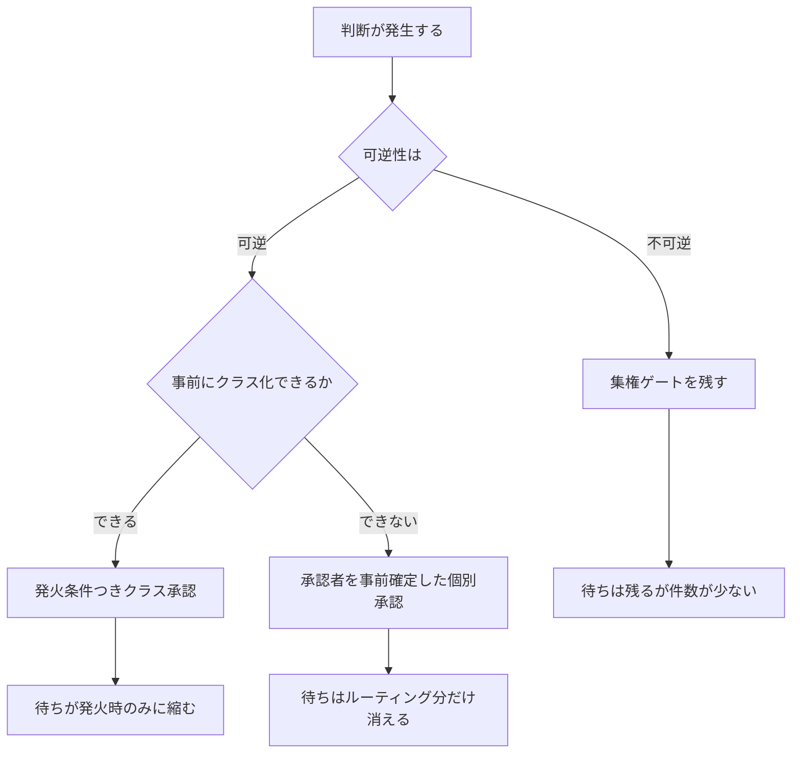
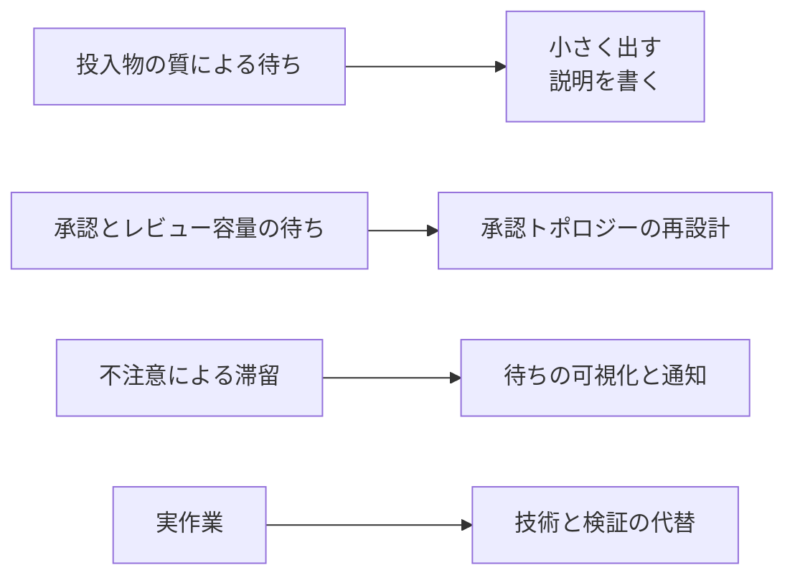
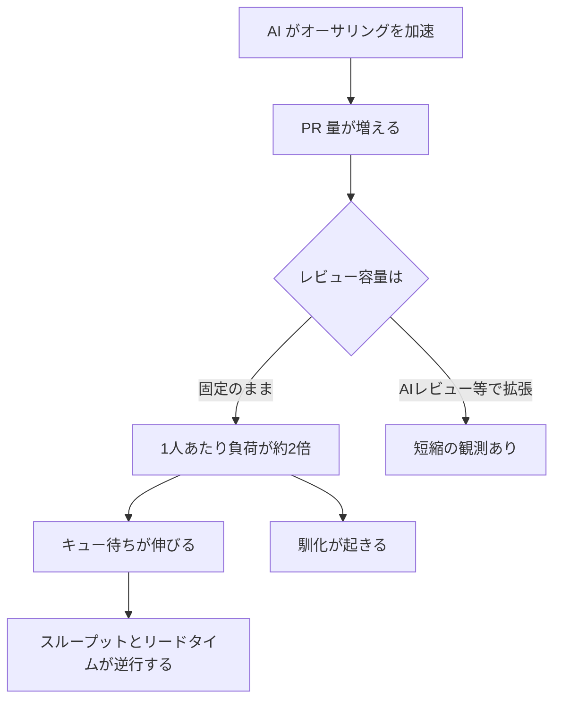

日経クロステックが、東風日産の開発期間短縮を報じました。本社の承認を2回に絞り、中国での車両開発を約2年に縮めたという内容です。

この報道は「開発が遅いのは承認が多いからだ」という直感を強く後押しします。承認回数という単一の変数で開発速度を説明できるなら、打ち手は明快です。

本記事では、この命題を公開されている一次エビデンスで検証した結果をまとめます。対象は自動車開発とソフトウェア開発の両方です。結論として、承認の削減は効きますが、主因とまでは言えません。効いているのは承認の数ではなく、承認の設計です。

想定読者は、開発速度の改善を承認プロセスの見直しから始めようとしている意思決定者と、その提案を受け取る立場のエンジニアリングリーダーです。

## 結論

先に全体像を示します。

| 論点 | 検証結果 |
|---|---|
| 承認削減の効果 | 有効。ただし説明力は部分的 |
| 自動車開発での寄与 | 開発期間差14ヶ月のうち29〜43% |
| ソフトウェアでの寄与 | レビュー遅延の約13%。最大要因は投入物の質で46.3% |
| ゲート削減の副作用 | 重大事故の一次認定原因として複数事例が実在 |
| 効く変数 | ゲートの数より、承認者と発火条件の事前確定 |
| AI 駆動開発への転移 | 符号が不安定。断定できず、計測が必要 |

この記事の主張は次の1文に集約されます。

> 承認は待ち時間の一部であって、待ち時間そのものではありません。

## 承認の寄与は、測ると小さい

### 自動車開発での分解

定義の揃った一次データとして、Roland Berger の2026年3月レポートが利用できます。中国 OEM と伝統的 OEM の車両開発期間を、project start から SOP までという同一定義で比較したものです。

| 項目 | 値 |
|---|---|
| 伝統的 OEM の開発期間 | 52ヶ月 |
| 中国 OEM の開発期間 | 38ヶ月 |
| 差分 | 14ヶ月 |
| うち意思決定・承認プロセスの寄与 | 4〜6ヶ月。全体の29〜43% |

残る57〜71%の内訳も同レポートに示されています。

| 要因 | 短縮幅 |
|---|---|
| 仮想検証による実機検証の代替 | 4ヶ月 |
| ハードウェアとソフトウェアの並行開発 | 2ヶ月 |
| サプライヤ早期巻き込み、ソフト金型、早期認証 | 5〜6ヶ月 |

承認トポロジー以外の技術要因とサプライチェーン要因が過半を占めます。

この構図は、外資 OEM 自身の実績とも整合します。VW は意思決定機能を合肥へ集約してなお短縮幅を最大30%と説明し、かつ validation cycle は変更していないと明言しています。承認の配置だけを触っても、中国系 OEM の水準には届きません。

なお「中国の車両開発は18ヶ月」という流布値には注意が必要です。実体は VW と XPENG の E/E アーキテクチャ開発期間であり、車両開発期間ではありません。数値の取り違えが広く流通しています。

### ソフトウェア開発での分解

ソフトウェア側では、Empirical Software Engineering 誌に掲載された PR 3,347,937 件の分析が参照できます。

| 要因 | レビュー遅延への説明力 |
|---|---|
| PR description の長さ | 46.3% |
| 承認側のキャパシティ | 約13% |

最大の要因は、承認する側の体制ではなく、レビューへ差し出す投入物の質でした。

### 「待ち時間が支配的」という前提は成立する

承認の寄与が小さいことと、待ち時間が大きいことは両立します。リードタイムの大半が付加価値作業でない点は、査読済みの一次研究で支えられます。

| 出典 | 観測 |
|---|---|
| Perry, Staudenmayer, Votta, IEEE Software 1994 | 開発者が特定の課題に取り組んでいた時間は全体の40%。経過時間と実作業時間の比は約2.5 |
| Martin と Osterling の実測 VSM | 活動比0.9〜13.7%。18日待って作業10分という工程を含む |

一方で、実務でよく引用される数値には裏付けの弱いものがあります。

- 「フロー効率は典型的に5〜15%」には追跡可能な一次ソースを確認できませんでした。実際に測った公開データセット (ASOS Tech、63チーム、12ヶ月) では9〜68%、平均35%です
- Reinertsen に帰属される「キュー時間はリードタイムの何%」という数値も、原典から確認できませんでした

Reinertsen から引くべきは数値ではなく原則です。稼働率はキューを指数的に増やし、ばらつきは線形にしか増やしません。この非対称性が、待ち行列を設計する側の出発点になります。

## 逆方向の証拠: ゲート削減が事故要因と認定された事例

「承認を減らせ」への最も強い反証は、減らしたことが原因と公的に認定された事故です。

| 事例 | 認定内容 |
|---|---|
| Boeing 737 MAX | 米下院最終報告が production pressure による安全毀損を認定。認定担当者の39%が undue pressure を認知。回帰試験2,000時間を削減 |
| CrowdStrike 2024 | 是正策の筆頭が deployment ring の追加。ゲートを増やす方向 |
| Knight Capital | second technician review の不在が事故要因 |

分権化が意思決定をむしろ遅くした実証研究も存在します。権限委譲は無条件の善ではありません。

分権化を提唱した側も歯止めを置いています。

- Reinertsen は第9章 D2 で、稀で、大規模で、規模の経済が働く問題は集権せよと明示しています
- Bezos は Type 1 と Type 2 を区別した2015年度株主書簡の脚注で、軽量プロセスで Type 1 の不可逆な決定を扱う企業は大きくなる前に絶滅すると、自ら生存者バイアスを示しています

## 効いているのは「数」ではなく「予測可能性」

### DORA の2つの発見を並べる

DORA 2019 レポート (pp.48-52) には、一見矛盾する2つの発見が併存します。

| 発見 | 効果 |
|---|---|
| 外部承認を要する組織 | low performer になる確率が2.6倍 |
| 外部承認による変更失敗率の改善 | 証拠なし |
| 承認プロセスが明確な組織 | elite になる確率が1.8倍 |

承認を要する組織はパフォーマンスが低く、承認が明確な組織はパフォーマンスが高いという結果です。矛盾に見えますが、効いている変数を「数」ではなく「予測可能性」と読むと整合します。

DORA の処方箋も、CAB の廃止ではありません。ゲートキーパーからプロセス設計者への役割転換であり、公式の capability ページは承認を消すのではなく開発プロセス内へ埋め込むと記述しています。

DORA の統計的限界も併記します。「Change approvals から配信性能」のパスは p<0.05 であり、他の主要パスの p<.001 より弱い水準です。スノーボール標本で n は約1,000、著者自身が DevOps に馴染みのある組織へ偏ると認めています。観察研究であり、因果を示すものではありません。

### Google のコードレビューは「予測可能性」の実装例

Sadowski らの ICSE-SEIP 2018 論文が、900万変更と25,000人規模の実測を報告しています。

| 項目 | Google の実測値 |
|---|---|
| レビュー全体の median latency | 4時間未満 |
| 変更の median 行数 | 24行。10%を超えるのは1行のみ |
| レビュアー数の中央値 | 1人。99%が5人以下 |
| 承認者の決定方法 | OWNERS ファイルによるツリー構造的な事前決定 |

比較対象として、Rigby と Bird の ESEC/FSE 2013 論文では AMD が17.5時間、Microsoft の3プロジェクトが14.7時間、19.8時間、18.9時間です。

Google は承認を減らしたのではありません。誰が承認者かを事前に確定させ、ルーティングの待ちをゼロにしました。

## 承認を残したまま待ちを消す

「規制でゲートを外せない領域はどうするのか」という問いには、規制側の公式文書に答えがあります。3つの領域が同一の構造を採っています。

| 領域 | 仕組み | 一次確認 |
|---|---|---|
| 医療機器 (FDA) | PCCP。事前に変更範囲を承認し、範囲内の個別変更に追加申請を不要とする | final guidance 2024-12-04、Docket FDA-2022-D-2628 |
| 自動車 (UN R156) | SUMS の Certificate of Compliance を3年有効で発行。個別更新は型式認証への影響判定に落ちる。ロールバック能力が規制要件そのもの | UN R156 §6.6、§7.1.1.8、§7.1.1.9、§7.2.2 |
| IT 統制 (SOX) | CAB を廃止せず、CAB の仕事を毎回の変更承認から high risk の定義管理へ移す。standard 判定はコンポーネント、変更種別、変更者の3軸で事前定義 | DevOps Audit Defense Toolkit、IT Revolution 2015 |

3者に共通する操作は1つです。

> 承認の対象を「個々の変更インスタンス」から「発火条件つきの変更クラス」へ引き上げます。

重要な点は、ゲートが消えていないことです。FDA の PCCP は、PCCP 自体を変更するなら新規申請を要します。統制目的である職務分離、可監査性、安全性は維持されたまま、承認が発火する頻度だけが下がっています。

## 承認トポロジーの3つの設計変数

「承認をいくつにするか」は設計変数ではありません。実際に動かせるのは次の3つです。

| 要素名 | 説明 |
|---|---|
| 判断が発生する | 変更、リリース、投資などの意思決定の起点 |
| 可逆性は | 取り消し可能かどうかの分岐 |
| 不可逆 | データ移行、公開 API、スキーマ、価格、セキュリティ境界などの one-way door |
| 可逆 | ロールバックや再実行で戻せる two-way door |
| 集権ゲートを残す | 不可逆な判断に対する中央承認の維持 |
| 事前にクラス化できるか | 変更の種別と範囲を事前定義できるかの分岐 |
| 発火条件つきクラス承認 | FDA PCCP、UN R156 SUMS、standard change 型の運用 |
| 承認者を事前確定した個別承認 | Google OWNERS 型のルーティング事前決定 |
| 待ちは残るが件数が少ない | 集権維持時の帰結 |
| 待ちが発火時のみに縮む | クラス承認時の帰結 |
| 待ちはルーティング分だけ消える | 承認者事前確定時の帰結 |

3つの設計変数を整理します。

| 変数 | 問い | 効き方 | 一次的根拠 |
|---|---|---|---|
| 可逆性による配置 | この判断は取り消せるか | 不可逆な判断だけをゲートに残す | Bezos 2015 の Type 1 と Type 2、Reinertsen D2 |
| 承認対象の粒度 | インスタンスとクラスのどちらを承認しているか | クラスへ引き上げると発火頻度が下がる | FDA PCCP 2024-12-04、UN R156 §6.6、DevOps Audit Defense Toolkit |
| 予測可能性 | 誰が承認者かが事前に決まっているか | ルーティングの待ちが消える | DORA 2019 の明確な承認で elite 1.8倍、Google OWNERS |

## 待ち時間の分解と、着手順序の地図

待ち時間を発生源で分解すると、打ち手の優先順位は直感と逆になります。

| 要素名 | 説明 |
|---|---|
| 投入物の質による待ち | PR description の長さが説明する46.3%の部分 |
| 承認とレビュー容量の待ち | 承認側キャパシティが説明する約13%の部分 |
| 不注意による滞留 | 誰も見ていないまま放置される待ち。Nudge で60.6%削減 |
| 実作業 | 付加価値作業。Perry 1994 では全体の約40% |
| 小さく出す、説明を書く | 投入物の質への打ち手 |
| 承認トポロジーの再設計 | 承認容量と配置への打ち手 |
| 待ちの可視化と通知 | 滞留への打ち手 |
| 技術と検証の代替 | 仮想検証、並行開発、自動テストなどの打ち手 |

### 最も費用対効果が高い一手

Maddila らの TOSEM 2022 論文が、Microsoft の147リポジトリで滞留 PR の当事者へ通知するボットを展開した結果を報告しています。

| 条件 | PR の平均寿命 |
|---|---|
| 通知サービスなし | 197.2時間 |
| Nudge 導入後 | 77.65時間 |
| 変化率 | 60.62%の短縮 |

承認プロセスは一切変えていません。待っている事実を可視化して当事者を促しただけで、リードタイムが6割減りました。この結果は、PR リードタイムの相当部分が意思決定の重さではなく単なる不注意だったことを意味します。

承認トポロジーの再設計は組織的合意を要する重い施策です。着手する前に、待ちを可視化するだけの施策が同等以上の効果を持ちえます。

## AI 駆動開発では何が起きるか

ここが最も慎重に扱うべき領域です。測定方法によって結論の符号が反転します。

| 要素名 | 説明 |
|---|---|
| AI がオーサリングを加速 | 生成側の速度向上 |
| PR 量が増える | He らの観測で3.1倍 |
| レビュー容量は | 人間側の処理能力に関する分岐 |
| 固定のまま | レビュアー母数が1.5倍にとどまる状態 |
| 1人あたり負荷が約2倍 | 供給と処理能力の不均衡 |
| キュー待ちが伸びる | total cycle time で22%増 |
| 馴化が起きる | 承認率上昇と検査量減少の同時発生 |
| AIレビュー等で拡張 | 自動レビュー導入による容量増 |
| 短縮の観測あり | Atlassian の median cycle time 31%減 |
| スループットとリードタイムが逆行する | 処理量が増えても通過時間が悪化する状態 |

### 「待ちが増えた」側の観測

| 出典 | サンプル | 観測 |
|---|---|---|
| He et al., arXiv:2607.01904 | 802開発者、196,212 PR、2024-01〜2026-04 | coding lead time は AI と人間で統計的に区別できない。first human review から merge まで約20%長く、total cycle time は22%長い |
| Faros AI 2026 | 22,000開発者、4,000チーム | 初回レビューまでの中央値が156.6%増、レビュー中の中央値が441.5%増 |
| LinearB 2026 | 810万 PR | AI PR は pickup が4.6倍長い。着手後のレビューはむしろ速く194分対252分 |
| Yu et al., arXiv:2606.22721 | 400レビュアー、11,429レビュー | 承認率が30.1%から36.8%へ上昇、遅延は3.5倍、インラインコメントは22%減 |

He らが示す機序は明快です。AI 由来の PR が全体の約90%に達する一方、レビュアーの母数は1.5倍にとどまり、1人あたり負荷が約2倍になりました。

Yu らの所見はさらに示唆的です。承認率が上がり、コメントが減り、それでも待ち時間は増えました。著者はこれを合理的な信頼較正ではなく反射的な馴化と解釈しています。ゲートは残っていますが、実質的に儀式化しています。

### 「待ちが減った」側の観測

| 出典 | サンプル | 観測 |
|---|---|---|
| Atlassian | 86,614 PR | LLM レビュー導入で median cycle time が31%減。p<.001 |
| Jellyfish | 2,160,981 PR、259社 | 高 AI 利用 PR は平均サイクルタイムが95.5時間から83.8時間へ。レビュー時間も5.1時間短縮 |
| arXiv:2412.18531 | — | 42%の悪化。符号が不安定 |

Jellyfish と Faros の矛盾は分母の違いで説明がつきます。Jellyfish は同一期間内で PR 単位に AI と非 AI を比較し、Faros は採用率が上がる組織の時系列を比較しています。LinearB の分解がこの2つを調停します。混雑はキューにあり、読む行為そのものにはありません。

### 断定を避ける理由

He らの研究は査読前であり、単一の匿名企業を対象とした非ランダム化研究です。著者自身が対象企業を young, AI-forward, and permissive と限定し、legacy monolith では効果が消えたと明記しています。

同じ論文が、事前の再設計なしに per-capita スループット2.09倍を達成したことも報告しています。

> スループットは実際に上がります。上がらないのはリードタイムです。

この2つを混同した議論が多く見られます。経営が「速くなった」と言うとき、どちらを指しているかで打ち手が変わります。

- スループットを上げたい場合、AI 導入は実際に効きます
- リードタイムを縮めたい場合、承認とレビューの容量と配置を同時に触らなければ悪化しえます

## 何から着手するか

エビデンスの強さと着手コストの積で並べます。承認トポロジーの再設計は3番目です。

### 1. 待ちを可視化する

最優先かつ最低コストの施策です。滞留している PR や承認依頼の当事者へ通知するだけで、プロセス変更も組織的合意も要しません。Microsoft の147リポジトリでは平均寿命が197.2時間から77.65時間へ短縮しました。

計測は DORA 4 keys では足りません。SPACE の Efficiency and flow が受け皿になります。handoff 数、チーム越え handoff、wait time を明示的に測ります。最小セットは次の分解です。

| 区間 | 測る対象 |
|---|---|
| 作成から最初のレビュー着手まで | pickup |
| 着手から承認まで | review |
| 承認からマージまたは出荷まで | deploy |

### 2. 投入物を小さくする

PR description の長さがレビュー遅延の46.3%を説明します。説明力が最大の変数です。

| 指標 | 値 |
|---|---|
| Google の median 変更行数 | 24行 |
| Google の median レビュアー数 | 1人 |
| Graphite 観測: 50行前後の PR | publish から merge まで約100分 |
| Graphite 観測: 50行超の PR | 中央値19時間 |

DORA 2024 自身が、AI 時代の悪化仮説として changelists are growing in size を挙げている点とも整合します。

### 3. 承認を「クラス」へ引き上げる

効きますが、合意コストが高い施策です。ゲートを消すのではなく、対象の粒度を上げます。

- 変更種別、コンポーネント、変更者の3軸で事前承認済みクラスを定義する
- 承認者を事前確定する。ルーティングの待ちがゼロになる
- 統制側の仕事を、毎回承認する役割から high risk の定義を管理する役割へ移す
- 規制領域では PCCP や SUMS 型を採り、変更範囲を事前承認して範囲内の個別申請を不要にする

### 4. 不可逆な判断だけをゲートに残す

one-way door にあたる判断は集権を維持します。データ移行、公開 API、スキーマ、価格、セキュリティ境界が該当します。737 MAX、CrowdStrike、Knight Capital は、ここを削った結果として認定された事故です。

### 5. AI を入れるなら、マージ数で評価しない

He らの推奨をそのまま引きます。

> "Do not govern by the merge count alone: Pair the merged-PR count with the latency and quality signals it omits — review wait time, queue depth, and revert or incident rates — because an authoring speedup shifts the binding constraint to the stages paced by human judgment."

スループット指標だけを見ると、リードタイムの悪化と検査の空洞化が見えなくなります。

## 反証と限界

本調査は反証専用の検証を経ており、当初の暫定結論のうち複数を修正しました。

| 当初の主張 | 修正後 |
|---|---|
| 律速は待ち時間であり、承認が主要な発生源 | 待ちは大きいが承認の説明力は約13%。最大要因は投入物の質 |
| AI で生成分がレビュー待ちに積み上がる | 符号が不安定。Atlassian の31%減と Faros の441%増が併存。「そうなりうるので測る」へ格下げ |
| 事前再設計しなければ速度向上はレビュー待ちに変換されるだけ | 誤り。スループットは実際に2.09倍になる。変換されないのはリードタイム |

### 起点事例の扱い

日経クロステックが報じた「本社承認2回」には、一次裏付けを確認できませんでした。日産の公式4文書 (The Arc、Re:Nissan、長期ビジョン、北京モーターショー) を全文確認し、日本語、中国語、英語で追加検索しても、承認回数への言及は発見できませんでした。

一次で確認できたのは次の2点です。

- 日産中国トップ Stephen Ma が上海モーターショー2025 (2025-04-23) で、現地 R&D チームへ完全に権限を委譲し、製品開発サイクルを24ヶ月以内へ短縮したと発言 (China Daily、上海市政府サイト)
- 中国側報道 (毎日経済新聞) は決策権の実質的な下放と、海外総部の冗長な審批プロセスからの解放と説明。ただし回数への言及なし

ベースラインも媒体間で50〜60ヶ月、55ヶ月、約4年とばらつき、開発期間の定義が揃っていません。したがって「半減」という倍率表現は本記事では使用しません。Re:Nissan 公式 (2025-05-13) のグローバル目標であるリード37ヶ月と後続30ヶ月は、中国の24ヶ月とは別レイヤーです。

本記事は、東風日産の事例を論証の荷重をかける証拠として用いていません。問いを立てるきっかけとしてのみ扱います。

### 検証したが成立しなかった反証

「開発期間を短縮した結果、売れていないのではないか」という筋は、日産の一次データで否定されました。FY2025 の中国販売は1.7%増で、3月単月は23.0%増です。対してグローバルは4.2%減です。

「短縮が品質へリスクを移送した」という仮説も、現時点では支持されません。中国の2025年リコールは前年比で件数18.5%減、台数39.1%減です。J.D. Power の NEV-IQS は悪化が続いていますが悪化ペースは鈍化しており、かつ J.D. Power は開発期間に帰属させていません。

ただし規制当局は代償を前提に動いています。2025年2月に MIIT と SAMR が OTA と公開ベータを規制し、2027年1月施行の信頼性走行試験30,000km 化は「即席車」の抑制を明示的な目的としています。

### 明示的な未確認事項

- 開発期間とリコール率を直接回帰した研究は確認できませんでした。因果は主張しません
- フロー効率「5〜15%」の統計的一次ソースは確認できませんでした。本記事では使用していません
- Reinertsen に帰属される「キュー時間はリードタイムの何%」も原典から確認できませんでした
- DORA 2025 は効果量の%を公表していません。本記事で%を用いたのは DORA 2024 の値のみです
- DORA 4 keys では承認トポロジーを測れません。上流の企画承認待ちと下流の段階解放が定義の外にあります
- He et al. (arXiv:2607.01904) は査読前、単一の匿名企業、非ランダム化です。追試は確認できていません
- 使用を見送った数値: AlixPartners の20対40ヶ月 (定義不明)、Bain の相関95% (定義不明)、McKinsey の24対45/48/53ヶ月 (本文到達不可)

## 未解決の問い

- 承認の粒度を上げた組織で、統制の実効性は維持されているか。FDA PCCP や standard change の運用実績を評価した研究は確認できませんでした
- Yu らが観測した馴化は、AI レビューの併用で緩和されるのか、加速するのか
- 「投入物の質46.3%」は AI 生成 PR でも同じ比率か。Faros の「レビューへ届くコードはレビュー可能な状態にないことが多い」という観測はこれと整合しますが、直接測った研究はありません
- 東風日産の意思決定権移譲が、日産全社の Re:Nissan 目標にどう反映されるか

## 自組織で確かめる3つの問い

本記事の分解を自組織へ当てはめるための最小の手順です。承認プロセスの議論を始める前に、この3問へ数値で答えます。

| 問い | 測り方 | 判断の分かれ目 |
|---|---|---|
| 待ちはどこで発生しているか | pickup、review、deploy の3区間で中央値を取る | pickup が最長なら、着手すべきは可視化と投入物の縮小 |
| 承認は何を対象にしているか | 直近の承認案件を、インスタンス単位とクラス単位で分類する | インスタンス単位が大半なら、クラス承認への引き上げが効く |
| 承認者は事前に決まっているか | 承認依頼から承認者確定までの所要時間を測る | 確定まで時間を要するなら、OWNERS 型の事前決定が効く |

3問すべてで承認側に問題が出た場合に限り、承認トポロジーの再設計へ進みます。1問目で pickup が支配的だった場合、承認の議論は後回しにします。

## まとめ

開発速度は承認回数という単一変数では説明できません。自動車では29〜43%、ソフトウェアでは約13%が承認の寄与であり、最大の要因は投入物の質と、待ちを放置する不注意です。

打ち手の順序は、待ちの可視化、投入物の縮小、承認のクラス化、不可逆判断の集権維持となります。承認トポロジーの再設計は3番目に置くべき施策です。

この記事が少しでも参考になった、あるいは改善点などがあれば、ぜひリアクションやコメント、SNSでのシェアをいただけると励みになります！

## 参考リンク

- 公式文書・規制文書
  - [FDA PCCP final guidance 2024-12-04, Docket FDA-2022-D-2628](https://www.federalregister.gov/documents/2024/12/05/2024-28422/marketing-submission-recommendations-for-a-predetermined-change-control-plan-for-artificial)
  - [UN Regulation No. 156 Software Update and SUMS](https://unece.org/transport/documents/2021/03/standards/un-regulation-no-156-software-update-and-software-update)
  - [Amazon 2015 Letter to Shareholders](https://www.sec.gov/Archives/edgar/data/1018724/000119312516530910/d168744dex991.htm)
- DORA
  - [DORA Streamlining change approval](https://dora.dev/capabilities/streamlining-change-approval/)
  - [Accelerate State of DevOps 2019](https://services.google.com/fh/files/misc/state-of-devops-2019.pdf)
  - [DORA State of DevOps 2024](https://services.google.com/fh/files/misc/2024_final_dora_report.pdf)
  - [DORA State of AI-assisted Software Development 2025](https://services.google.com/fh/files/misc/2025_state_of_ai_assisted_software_development.pdf)
- 学術論文
  - [He et al. AI Writes Faster Than Humans Can Review arXiv:2607.01904](https://arxiv.org/abs/2607.01904)
  - [Yu et al. Habituation at the Gate arXiv:2606.22721](https://arxiv.org/abs/2606.22721)
  - [Sadowski et al. Modern Code Review A Case Study at Google ICSE-SEIP 2018](https://sback.it/publications/icse2018seip.pdf)
  - [Rigby and Bird Convergent Contemporary Software Peer Review Practices ESEC/FSE 2013](https://www.microsoft.com/en-us/research/wp-content/uploads/2016/02/rigby2013convergent.pdf)
  - [Maddila et al. Nudge Accelerating Overdue Pull Requests TOSEM 2022](https://arxiv.org/pdf/2011.12468v2)
  - [Czerwonka et al. Code Reviews Do Not Find Bugs ICSE-SEIP 2015](https://www.microsoft.com/en-us/research/wp-content/uploads/2015/05/PID3556473.pdf)
  - [Perry, Staudenmayer, Votta People, Organizations, and Process Improvement IEEE Software 1994](https://interruptions.net/literature/Perry-IEEE_Software94.pdf)
  - [Aghion, Bloom, Sadun, Van Reenen Turbulence, Firm Decentralization, and Growth in Bad Times AEJ 2021](https://www.aeaweb.org/articles?id=10.1257/app.20180752)
  - [METR Measuring the Impact of Early-2025 AI on Experienced Developers arXiv:2507.09089](https://arxiv.org/abs/2507.09089)
- 業界レポート
  - [DevOps Audit Defense Toolkit IT Revolution 2015](https://itrevolution.com/product/devops-audit-defense-toolkit/)
  - [Faros AI Engineering Report 2026](https://pages.faros.ai/hubfs/AI_Engineering_Report_2026_The_Acceleration_Whiplash_Faros.pdf)
  - [LinearB Engineering Benchmarks](https://linearb.io/resources/engineering-benchmarks)
  - [Graphite State of Code Review 2024](https://static.graphite.dev/Graphite_State_of_code_review_2024.pdf)
  - [GitClear AI Copilot Code Quality 2025](https://gitclear-public.s3.us-west-2.amazonaws.com/GitClear-AI-Copilot-Code-Quality-2025.pdf)
  - [Nick Brown Uncovering the real numbers behind flow efficiency](https://www.nicolasbrown.co.uk/blog/2023/07/26/our-survey-saysuncovering-the-real-numbers-behind-flow-efficiency)
- 起点記事
  - [日経クロステック 東風日産トップ「本社承認2回だけ」、開発期間半減](https://xtech.nikkei.com/atcl/nxt/column/18/03565/072200030/)
