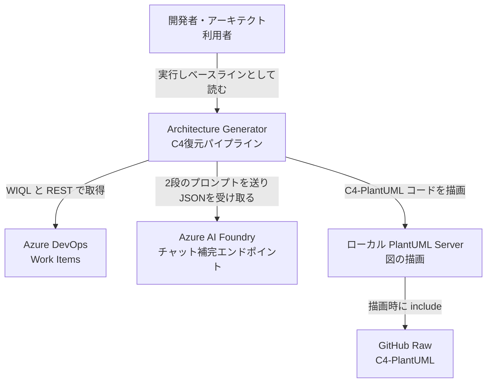
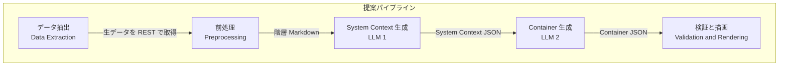
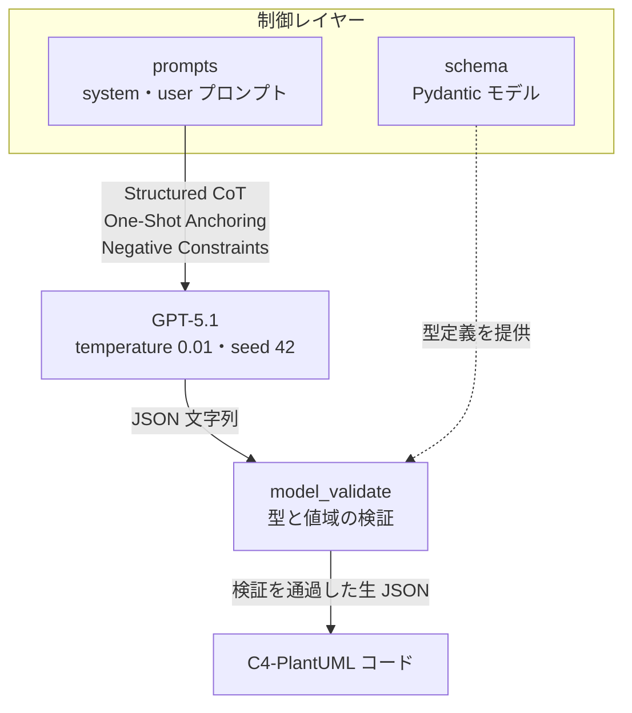
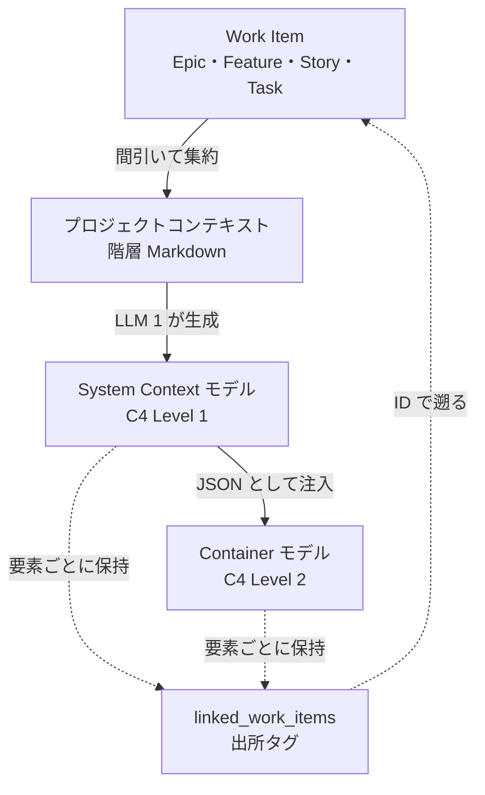
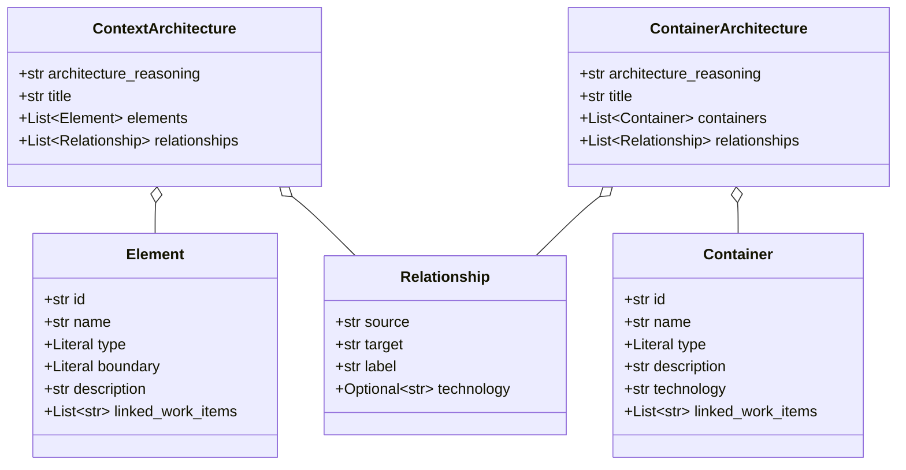

長く動いているシステムのアーキテクチャ図は、たいてい存在しないか、存在しても古びています。そこでソースコードから構造を復元しようとすると、回避策や実装都合まで一緒に抽出され、「劣化した現状」の絵ができあがります。

ミュンヘン工科大学のグループが発表した論文 [Recovering Software Architecture Intent from Historical Work Items using Generative AI](https://arxiv.org/abs/2608.28403) は、この向きを反転させます。コードではなく Azure DevOps に溜まったチケット（Work Items）を入力にして、LLM で C4 モデルを生成する。得られる図は「正しいアーキテクチャ」ではなく「当時チケットに書かれた意図」であり、それを実装と比べることでアーキテクチャドリフトが見える、という組み立てです。

この記事では、パイプラインの5段構成、実際に公開されている実装のスキーマとプロンプト設計、そして「どのくらい同じ図が出るのか」を測った定量結果までを扱います。実装は MIT ライセンスで公開されているので、コード例は論文の記述だけでなく公開実装と突き合わせています。


*この記事の全体像。以下、順に解説します。*

## 概要: コードではなくチケット履歴から設計意図を復元する

従来の Software Architecture Recovery（SAR）はソースコードからシステム境界を再構築しますが、実証研究では成績が良くありません。コードに現れるのは論理的な設計ではなく、侵食された現実と実装上の回避策だからです。一方、断片的なドキュメントから手作業でアーキテクチャモデルを起こす方法は、人間のアーキテクトの暗黙知に強く依存します。

提案されているのは、その中間を自動化するアプローチです。アジャイル開発で日々書かれている Epic / Feature / User Story / Task を入力として、半自動の5ステップで C4 の System Context（Level 1）と Container（Level 2）を生成します。

重要なのは、生成物の位置づけです。この図は「あるべき姿」でも「現在の実装」でもなく、**チケットに書かれた as-planned の意図**を写した鏡として扱われます。要素の有無と境界は入力に強く拘束されます。一方、Container 段の `technology` はチケットに未記載でも Java や PostgreSQL などを推測するようプロンプトが明示しています。技術欄まで as-planned と読むと、LLM の推測を設計意図やドリフトとして誤判定します。技術欄を判定に使う前に、チケットとの照合が必要です。実装（as-built）と並べたときのズレが診断材料になるのは、この限定のもとです。

評価は混合研究法で行われています。産業パートナー企業の実プロジェクト2件を対象に、シニア実務者3名への半構造化インタビュー（定性）と、同一設定で10回ずつ実行して計40枚の図の構造ばらつきを測る安定性分析（定量）を組み合わせています。対象プロジェクトの規模は Work Item 数で89件と193件です。

読者としては、次のような判断に使えます。

- 手元のチケット運用で、この手のアーキテクチャ復元が成立しそうか
- 生成された図をどこまで信用し、どこから人が手を入れるべきか
- 「毎回同じ図が出るのか」という現実的な期待値をどこに置くか

## 特徴: チケットに書かれた意図を鏡にして差分を暴く

- **トップダウン抽出**: 入力はコードではなく Azure DevOps の Work Items。Epic / Feature / User Story / Task を対象に、機能的な文脈が十分に集まるよう取得します。
- **5ステップの半自動パイプライン**: データ抽出 → 前処理 → LLM 1（System Context）→ LLM 2（Container）→ 検証・描画。
- **プロンプトチェーンによる段階分割**: Level 1 の JSON を Level 2 のプロンプトへ文脈として注入し、新規コンテナは Level 1 の境界内に置き、外部要素の ID を再利用するよう要求します。参照整合性はプロンプト上の要求であり、実装側の検証はありません。
- **Structured CoT**: 出力スキーマの先頭キーを `architecture_reasoning` に固定し、要素を並べる前に論理を言語化させます。
- **One-Shot Anchoring**: C4 の公開例「Big Bank plc — Internet Banking System」を JSON 化したものを参照例として注入し、階層のレベル感を揃えます。
- **Negative Constraints**: 「関係を1つも持たない要素は含めない」「レポートを見るだけの受動的な利用者は含めない」といった除外規則を明示し、アーキテクチャ要素以外の過剰な混入を抑えます。
- **双方向トレーサビリティ**: 各要素が根拠チケットの ID 配列 `linked_work_items` を持ちます。描画時には説明文の末尾へ `Ref: 1234, 1235` として焼き込まれるため、図から出所へ戻れます。
- **描画前のスキーマ検証**: Pydantic はフィールドの型と `Literal` の値域を検証します。関係の `source` / `target` が実在する要素 ID かは見ていません。スキーマ違反に起因する一部の失敗は早期検出できますが、参照整合性までは止まりません。
- **安定性の定量化**: ノード数はエッジ数より安定していた。測定対象は個数であり、要素の同一性や意味的正しさは定量評価されていません。目視では高い重複が確認されています。ばらつきはチェーンの後段ほど増幅します。

## 構造

### システムコンテキスト: 誰が何のために使うか

パイプラインは4つの外部依存を持ちます。入力元の Azure DevOps、推論を担う Azure AI Foundry のチャット補完エンドポイント、描画用のローカル PlantUML サーバー、そして描画時に `.puml` が取り込む C4-PlantUML の GitHub Raw です。論文の実験では、企業データを扱うためモデル呼び出しに EU ホストのプライベートな Azure OpenAI インスタンスが使われています。



| 要素 | 役割 |
|---|---|
| 開発者・アーキテクト | 生成された C4 図をベースラインとして読み、システム理解とドリフト特定を行う |
| Architecture Generator | チケットから設計意図を抽出し、C4 Level 1 と Level 2 を生成する本体 |
| Azure DevOps | Epic / Feature / User Story / Task が蓄積されている入力元 |
| Azure AI Foundry | チャット補完モデルを提供する推論エンドポイント |
| ローカル PlantUML Server | C4-PlantUML コードを PNG へ描画する外部プロセス |
| GitHub Raw 上の C4-PlantUML | 生成 `.puml` が `!include` する描画ライブラリ。閉域ではバージョン固定のローカル配置が必要 |

### コンテナ: 5段の処理単位

論文が示す5段は、生成対象システムの C4 Container ではありません。C4 の Container はコード実行またはデータ保存のための実行時境界であり、どのサーバーに載せるかは別関心です。ここで示すのは、単一 Python プロセス内の処理フローです。公開実装では、この5段がモジュールに分かれています。



| 処理段 | 公開実装の置き場所 | 役割 |
|---|---|---|
| データ抽出 | `devops_client` / `work_items_service` | WIQL と REST で Work Item を取得し、フィールド・関連・コメントを正規化する。API バージョンは既定 7.1 |
| 前処理 | `context_service` | 取得結果を LLM 入力向けの階層 Markdown へ変換する |
| System Context 生成 | `flow._execute_llm_chain` の LLM 1 | C4 Level 1 の JSON を生成し、スキーマ検証する |
| Container 生成 | 同関数の LLM 2 | Level 1 の JSON を文脈として注入し、C4 Level 2 の JSON を生成する |
| 検証と描画 | `flow` のコンバータ | JSON を C4-PlantUML へ変換し、ローカルサーバーで描画する |

### コンポーネント: LLM出力を安定させる制御層

LLM の周りには、プロンプト定義（`prompts.py`）とスキーマ定義（`schema.py`）という2つの制御要素が置かれています。前者が生成の作法を縛り、後者が出力形を縛る構造です。



| 要素 | 役割 |
|---|---|
| prompts | 役割設定・包含除外規則・参照例・出力スキーマを持つ system / user プロンプト |
| GPT-5.1 | 構造化推論と情報抽出を担うモデル。論文の実験では version 2025-11-13 |
| schema | Pydantic モデル。`Literal` で型と境界の値域まで固定する |
| model_validate | 生成 JSON の型と値域を検証する。参照整合性は検証しない |
| C4-PlantUML コード | `System_Boundary` でコンテナを囲んだ描画用テキスト。変換には検証後オブジェクトではなく生 JSON が渡る |

プロンプト側の縛りは段ごとに違います。System Context 段では説明文を最大12語、関係ラベルを最大4語とし、関係の技術欄に `HTTPS` や `REST` のようなプロトコルを書かせません。Container 段にはこの語数上限がなく、関係の技術欄にプロトコルを書くよう求めています。抽象度が段ごとに崩れないようにするための分担です。

## データ

### 概念モデル: チケットからC4要素への流れ

Work Item が階層 Markdown に集約され、そこから Level 1 が生成され、その JSON が Level 2 の入力に回ります。両レベルの要素は `linked_work_items` を通じて元の Work Item へ戻れます。



| 要素 | 説明 |
|---|---|
| Work Item | 開発の意図が記録された履歴データ。Epic / Feature / User Story / Task |
| プロジェクトコンテキスト | ノイズを落として LLM 入力に最適化した階層 Markdown |
| C4ContextArchitecture | システム境界と外部要素・アクターを定義する Level 1 の生成結果 |
| C4ContainerArchitecture | 境界内部の実行時境界を定義する Level 2 の生成結果 |
| linked_work_items | 各要素の根拠チケット ID 配列。図の説明文に `Ref:` として焼き込まれる |

### 情報モデル: linked_work_itemsを持つスキーマ

公開実装のスキーマは、共通基底クラスを持つ継承構造ではありません。Level 1 の `C4Element` と Level 2 の `C4Container` がそれぞれ独立に `linked_work_items` を持ち、トップレベルのモデルがそれらを合成します。関係は両レベルで `C4Relationship` を共有します。次の図はクラス名の `C4` 接頭辞を省いて示しています。



| 要素 | 説明 |
|---|---|
| C4ContextArchitecture | Level 1 のトップレベル。`architecture_reasoning` を先頭キーに固定する |
| C4Element | アクターまたはソフトウェアシステム。`type` は `Person` / `Software System`、`boundary` は `Internal` / `External` |
| C4ContainerArchitecture | Level 2 のトップレベル。要素配列のキーは `containers` |
| C4Container | システム内部の実行時境界。`type` は `WebApp` / `MobileApp` / `Api` / `Database` / `Service` / `FileSystem`、`technology` は必須 |
| C4Relationship | 有向の相互作用。`source` / `target` / `label` と、任意の `technology` |

スキーマ定義の該当部分は次のようになっています（抜粋）。`architecture_reasoning` が先頭に置かれているのは、要素配列を作る前に推論を言語化させるためだとコメントで明示されています。

```python
from pydantic import BaseModel, Field
from typing import List, Literal, Optional


class C4Relationship(BaseModel):
    source: str
    target: str
    label: str = Field(..., description="Action performed.")
    technology: Optional[str] = Field(None, description="Protocol, if known.")


class C4Element(BaseModel):
    id: str = Field(..., description="Unique snake_case identifier")
    name: str = Field(..., description="Human readable name")
    type: Literal["Person", "Software System"]
    boundary: Literal["Internal", "External"]
    description: str = Field(..., description="Brief description of responsibilities.")
    linked_work_items: List[str] = Field(
        default=[],
        description="List of Work Item IDs that require this element.",
    )


class C4ContextArchitecture(BaseModel):
    architecture_reasoning: str = Field(..., description="Step-by-step reasoning.")
    title: str
    elements: List[C4Element]
    relationships: List[C4Relationship]
```

生成 JSON はラッパーを持たず、この構造がそのままトップレベルに現れます。`model_validate` は型を見ますが、`source` / `target` が `elements` の `id` に存在するかは見ていません。次の例では関係が要素 ID を参照しています。

```json
{
  "architecture_reasoning": "1. SYSTEM IDENTIFICATION: ... 2. BOUNDARY LOGIC: ... 3. RELATIONSHIP LOGIC: ...",
  "title": "Name of System - System Context",
  "elements": [
    {
      "id": "unique_snake_case_id",
      "name": "Clean Display Name",
      "type": "Person",
      "boundary": "External",
      "description": "Short description, max 12 words.",
      "linked_work_items": ["1234", "1235"]
    }
  ],
  "relationships": [
    {
      "source": "unique_snake_case_id",
      "target": "unique_snake_case_id",
      "label": "Short label",
      "technology": null
    }
  ]
}
```

## 構築方法: パイプラインを動かす

### 前提

- Python 3.10 以上
- Docker（ローカル PlantUML サーバー用）
- Work Item が入っている Azure DevOps の組織・プロジェクト
- チャット補完モデルの Azure AI / Azure OpenAI デプロイ

### PlantUML サーバーを立てる

描画はローカルのサーバーに投げる前提になっており、コードは `http://localhost:8080/png/` を既定で見ます。

```bash
docker pull plantuml/plantuml-server
docker run -d -p 8080:8080 --name plantuml plantuml/plantuml-server
```

### 依存をそろえる

```bash
git clone https://github.com/dmnksto/architecture_generator.git
cd architecture_generator

python -m venv .venv
source .venv/bin/activate

pip install -r requirements.txt
```

### 環境変数を設定する

`.env` に Azure DevOps 側と推論エンドポイント側の資格情報を置きます。Work Item の取得は既定で API バージョン 7.1 です。コメント取得の公開実装の既定値は `7.1-preview` ですが、Microsoft の Comments API は `7.1-preview.4` を指定します。運用では後者に合わせるのが安全です。コメント取得は Work Item ごとに例外を捕捉し、失敗すると空配列へ置き換えます。失敗時はコメントが黙って入力から欠落します。

```env
AZURE_DEVOPS_ORG_URL=https://dev.azure.com/<your-org>
AZURE_DEVOPS_PAT=<your-personal-access-token>

AZURE_DEVOPS_API_VERSION=7.1
AZURE_DEVOPS_API_VERSION_COMMENTS=7.1-preview.4

AZURE_AI_FOUNDRY_ENDPOINT=<your-azure-ai-endpoint>
AZURE_AI_FOUNDRY_KEY=<your-azure-ai-key>
MODEL_NAME=gpt-5.1
```

### 対象プロジェクトを指定して実行する

対象プロジェクトはコマンドライン引数ではなく `app/main.py` の定数で指定します。値は Azure DevOps の `System.TeamProject` と完全一致（大文字小文字を含む）させる必要があります。

```python
PROJECT = "YourProject"


def main():
    run_flow(PROJECT)

    # Azure DevOps を経由せず保存済み Markdown から回す場合
    # run_flow_from_local_file(PROJECT)
```

```bash
python app/main.py
```

生成物は2か所に落ちます。前処理済みのコンテキストが `context_files/<project>_context.md`、各実行の JSON・PlantUML・PNG が `runs/<project>/run X/` です。実行ごとにディレクトリが切られるので、同じ入力で複数回回して差分を見る運用がそのまま取れます。

### 2段のLLM呼び出し

チェーンの本体は次の形です。`temperature` と `seed` はコード側に固定値で書かれています。

```python
def _execute_llm_chain(markdown_result: str) -> None:
    context_response = LLM.complete(
        messages=[
            {"role": "system", "content": CONTEXT_SYSTEM_PROMPT},
            {"role": "user", "content": f"{markdown_result} \n\n {CONTEXT_USER_PROMPT}"},
        ],
        model=MODEL,
        response_format="json_object",
        temperature=0.01,
        seed=42,
    )

    context_json = json.loads(context_response.choices[0].message.content)
    try:
        context_architecture = C4ContextArchitecture.model_validate(context_json)
    except Exception as error:
        print(f"LLM 1 Validation Error: {error}")
        return

    # Level 1 の JSON を Level 2 のユーザープロンプトへ丸ごと注入する
    level_1_context_str = json.dumps(context_json, indent=2)
```

Level 2 のユーザープロンプトには、前処理済み Markdown と `### LEVEL 1 CONTEXT:` に続く Level 1 の JSON が併せて渡されます。外部要素の ID を再利用するよう求めるのは、この注入があってこそ意味を持ちます。実装側で ID の存在確認はしていません。

## 利用方法: ベースラインとしてドリフトを見る

### 差分を4件の事例で読む

生成図はチケットに厳密に縛られるため、実装との食い違いは主に2種類に分かれます。論文のトレーサビリティ分析は、実務者が違和感を指摘した4件を入力コーパスまで遡って分類した targeted な検証です。自動分類器ではありません。

| 要素とプロジェクト | 図 | 実装 | コンテキストの出所 | 分類 |
|---|---|---|---|---|
| Auth Gateway（A） | あり | なし | 明示的に文書化 | 未実行の意図 |
| Cloud Storage（A） | なし | あり | 文書化されていない | 未文書の実装 |
| Cloud Storage（B） | あり | なし | 明示的に文書化 | 未実行の意図 |
| Email Service（B） | あり | なし | 明示的に文書化 | 未実行の意図 |

読み方の候補は次です。**図にあって実装にない**なら、未実行の意図の候補。**実装にあって図にない**なら、未文書の実装か抽出漏れの候補です。どちらもチケット上の明示的根拠を人が確認する前提です。前者は放棄されたレガシー計画の切り分けに使え、後者はアーキテクチャ侵食の実例になり得ます。

ただし、この診断は自動では成立しません。図と自分の理解を能動的に突き合わせる必要があり、暗黙のドメイン知識が依然として前提です。論文もこの点を明示していて、ワークフローはアーキテクトの専門性を置き換えるものではなく、手作業の作図から「露呈した差分の検証」へ認知コストを移すものだと整理しています。

### 出所へ遡る

各要素の `linked_work_items` は描画時に説明文へ `Ref: 1234, 1235` というプレーンテキストとして焼き込まれます。公開実装は URL やハイパーリンクを生成しません。図上の ID を Azure DevOps で検索するか、次の形の URL を手元で組み立てます。PlantUML のリンク記法を足せば直接遷移もできますが、現行コードにはありません。

```text
Element: Auth Gateway
Ref: 1234, 1235
手動で組み立てる URL:
https://dev.azure.com/<org>/<project>/_workitems/edit/1234
```

なお、このトレーサビリティは信頼できる鎖ではあるものの万能ではありません。タグの一部は意味的な裏付けが緩く、論文は「強いが絶対ではない」と評価しています。

### 信頼境界を越えるときは人が整える

実務者の評価では、用途によって必要な手当てが変わります。社内エンジニアリングや知識移転には生の出力がそのまま有効で、ベースライン作成は数時間から数分に短縮されました。一方、社外・プリセールス・顧客向けに出す場合は、描画上の見づらさの解消、欠落の補完、意味的対応の検証という手作業のキュレーションが必須という線引きです。

### 保存済みコンテキストから回し直す

`run_flow_from_local_file` を使うと Azure DevOps の抽出を飛ばし、`context_files/<project>_context.md` を直接読んで LLM 段だけを再実行できます。プロンプトを調整して出力を比べたいときは、この経路が入力を固定できるので便利です。

## 運用: 決定性の固定とエラー伝播の監視

### パラメータを固定しても決定的にはならない

実験では `temperature` を 0.01、`top_p` を既定の 1.0、`seed` を 42 に固定しています。それでも構造は揺れます。ここが実務上いちばん重要な点で、**シードを固定したから同じ図が出る、とは言えません**。論文の定量分析はまさにこの残留ばらつきを測ったものです。

### ばらつきの実測値を期待値として持つ

同一設定で1プロジェクトあたり10回、計40枚を生成した結果が次のとおりです。変動係数（CV）で比べています。

| 段 | 対象 | Project A（89件） | Project B（193件） |
|---|---|---|---|
| System Context（L1） | ノード | CV 6.6%（10回中7回が7ノード） | CV 15.2%（10回中6回が7ノード） |
| System Context（L1） | エッジ | CV 16.8%（多峰的） | CV 33.0%（7〜18本） |
| Container（L2） | ノード | CV 9.6%（5または6の二峰） | CV 15.5%（10回中7回が5コンテナ） |
| Container（L2） | エッジ | CV 26.4% | CV 38.3% |

読み取れる規則性は3つあります。第一に、**ノード数はエッジ数より安定する**。測定は個数であり、同じ要素が毎回同じ ID で出るかは定量評価されていません。第二に、**チェーンの後段でばらつきが増える**。Level 1 の微小な揺れが確定事実として Level 2 に渡るため、相対分散が積み上がります。第三に、Work Item 数の少ない Project A のほうが一貫して安定しており、入力の量や粒度が安定性の水準に影響している可能性があります。

なお絶対値で見ると、ノードの標準偏差は4条件のうち3条件で 1.0 を下回ります。残り1条件は 1.03 です。論文の表現は「典型的には平均から1要素未満しかずれない」です。個々の実行が必ず平均±1未満に収まる保証ではありません。

### CVを監視に組み込む

論文の CV は、同一入力・同一設定で10回独立実行した集合内のばらつきです。定期実行でバックログが更新されると入力も変わるため、LLM の確率的ばらつきと設計意図の変化が混ざります。監視するなら、コンテキストファイルのハッシュなどで入力スナップショットを固定し、そのスナップショットを複数回生成した集合内で CV を計算します。スナップショット間のノード・エッジ変化は、別のドリフト指標として扱います。閾値は論文が定めたものではなく、上表の実測レンジから運用側で決める値です。

```python
import statistics


def coefficient_of_variation(counts: list[int]) -> float:
    return statistics.stdev(counts) / statistics.mean(counts)


# 同一スナップショット（同一 context hash）での複数回実行
edge_counts = [...]
if coefficient_of_variation(edge_counts) > 0.30:
    print("同一入力でもエッジ数のばらつきが大きい。関係の本数を確定値として扱わない")
```

### 検証失敗は即座に打ち切られる

公開実装では、スキーマ検証に失敗すると `LLM 1 Validation Error` を表示して関数を抜けます。自動リトライはありません。定期実行に載せる場合は、呼び出し側で再試行と通知を用意する必要があります。

### 規模の上限を見込む

数千件規模のチケットを持つ大規模システムへのスケールは、LLM のコンテキスト長によって原理的に制限されると論文は明示しています。長い入力で性能が劣化する点が根拠です。分割処理や検索ベースの絞り込みは自然な対策ですが、論文が評価した手法には含まれておらず、実装案の域にとどまります。

### チケット衛生へ戻す

図に欠落や誤りが現れると、それはドキュメント負債の可視化になります。実務者評価では、この「突きつけ」がチケットの書き方を規律づけるフィードバックループとして働くと整理されています。定期的にドリフト監査のタスクを起票する運用が相性が良いところです。

## ベストプラクティス

### コードベースのSARと併用する

チケット由来の抽出を as-planned、コード由来の抽出を as-built として対比させるのが本来の使い方です。どちらか一方では、意図と現実のどちらかを見落とします。

### 組織構造の写り込みを疑う

このパイプラインは理想化された技術アーキテクチャを作らず、バックログの構造的な癖まで写します。論文が挙げている例では、Project A の Container 図がデプロイ単位を担当者の役割ごとに分割していました。元のタスクが技術構造ではなく人的リソースの割り当てで整理されていたため、LLM がその組織的な癖を構造境界として反映したのです。コンウェイの法則が生成過程に現れた形と言えます。**図に出た境界を、そのまま技術的な設計判断として読まないこと。**

### 生成前に論理を書かせ、除外規則を明示する

`architecture_reasoning` を先頭キーに固定して推論を先に出させること、そして「関係を持たない要素を含めない」といったネガティブ制約を置くことが、出力品質を支えています。抽象度の逸脱を防ぐ規則も同じ系統です。説明文の語数上限とプロトコル禁止は System Context 段に限り、Container 段では関係の技術欄へプロトコルを書かせます。

### 継続的に回して鮮度を保つ

手描きの図は活発な開発が始まった直後に陳腐化します。実務者が最大の価値として挙げたのは、精度そのものではなく**ドキュメントの継続的な鮮度**でした。定期実行して常に最新の意図を再構成できる状態を保つことが、この手法の主眼に近いところです。

### 出力は最終成果物ではなく初期ベースラインとして扱う

技術キックオフ、インフラ準備確認、オンボーディングの出発点としては即戦力になります。逆に、検証なしで社外に出す前提では設計しないでください。

## トラブルシューティング

| 症状 | 原因 | 対処 |
|---|---|---|
| エッジの本数が実行ごとに大きく変動する | 往復通信を1本と数えるか2本に分けるかといった方向性の作法が、システムプロンプトで強制されていない | 本数を確定値として扱わず関係の有無に注目する。または粒度規則をプロンプトへ追加する |
| 実装にない機能が図に現れる | 不具合ではなく、チケットに文書化されたが実行されなかった意図を正確に抽出している | 未実行の意図として、意図と実装の差分の分析に利用する |
| 実装にある機能が図に出ない | 抽出がチケットの内容に厳密に縛られており、チケット化されていない作業は抽出できない | ドキュメント負債の兆候と捉え、不足している機能のチケットを起票する |
| 図が読みにくい・見分けがつかない | 認知的な負荷は描画層に起因しており、モデルの意味的な出力ではない | レイアウトや視覚的区別を人手で整える。モデルやプロンプトの調整では解決しない |
| 実行が途中で終わる | スキーマ検証に失敗すると検証エラーを表示して処理を打ち切る。自動リトライはない | 呼び出し側で再試行と通知を実装する。生成 JSON を保存して原因を確認する |

### エッジ数のばらつきが大きい

エッジの CV は最大 38.3% に達します。原因は、ひとつの往復するデータフローを1本のエッジに要約するか複数の粒度に分解するかで実行ごとに揺れることです。システムプロンプトは方向性の作法を厳密に規定していません。関係の本数を仕様として扱わず、「その関係が存在するかどうか」を判断材料にするのが安全です。

### 未実装の機能が図に登場する

これはエラーではありません。Auth Gateway の例のように、チケットに明示的に文書化されていながら実装されなかった機能を正確に抽出した結果です。モダナイゼーションの文脈では、放棄されたレガシー計画を現在のシステム状態から切り分ける材料になります。

### ドキュメントにない実装が図から欠落する

抽出はチケットに厳密に縛られるため、チケット化されていない作業には完全に盲目です。Cloud Storage の例がこれに当たります。設計プロセスの外で足されたコードレベルの追加であり、アーキテクチャ侵食の実例として扱います。対処は不足分のチケットを起こすことです。

### 読みにくさをモデルの問題と誤診する

実務者が報告した認知的な負荷は、視覚的な区別の不足やレイアウトの拙さといった描画層の問題に帰属できるもので、モデルの意味的な推論は一貫して理解しやすいと評価されています。図が読みにくいときにプロンプトを触り始める前に、描画側を疑ってください。

## まとめ

この手法の面白さは、精度の高さではなく**評価軸の置き換え**にあります。生成された C4 図を「正解」として使おうとすると、エッジのばらつきや組織構造の写り込みが欠点に見えます。しかし「チケットに書かれた意図の鏡」として使うなら、それらは仕様どおりの挙動であり、実装と並べたときのズレこそが取り出したい情報になります。技術欄の推測まで意図と同一視しないことが前提です。

実務に持ち込むときの要点は3つです。第一に、シードを固定しても構造は揺れるので、ノード数は概ね信じ、エッジ数は信じないという期待値を最初から持つこと。個数の安定は要素の同一性を保証しません。第二に、図に現れた差分を未実行の意図と未文書の実装の候補として分類し、チケット根拠を人が確認してからチケット起票や設計判断の見直しへ流すこと。第三に、生の出力は社内向けの初期ベースラインに留め、社外に出す前に人のキュレーションを挟むこと。

適用限界も明確です。評価は単一企業の実務者3名と、いずれも開発1年以内の若いプロジェクト2件に依拠しており、モデルも GPT-5.1 単一です。生成物の忠実さは、その組織のチケット運用文化に強く縛られます。裏を返せば、チケットに設計意図が書かれていない組織では、この手法は何も復元できません。まず試すべきは、手元のチケットに読める意図がどれだけ残っているかの確認かもしれません。

この記事が少しでも参考になった、あるいは改善点などがあれば、ぜひリアクションやコメント、SNSでのシェアをいただけると励みになります！

## 参考リンク

### 論文と実装

- [Recovering Software Architecture Intent from Historical Work Items using Generative AI: A Mixed-Methods Industry Case Study（arXiv:2608.28403）](https://arxiv.org/abs/2608.28403)
- [dmnksto/architecture_generator（MIT ライセンスの実装）](https://github.com/dmnksto/architecture_generator)
- [architecture_generator v1.0.0（Zenodo, doi:10.5281/zenodo.22145614）](https://doi.org/10.5281/zenodo.22145614)

### 関連資料

- [The C4 model for visualising software architecture](https://c4model.com/)
- [C4 model: Container](https://c4model.com/abstractions/container)
- [C4-PlantUML](https://github.com/plantuml-stdlib/C4-PlantUML)
- [plantuml/plantuml-server（Docker Hub）](https://hub.docker.com/r/plantuml/plantuml-server)
- [Comments - Get Comments（Azure DevOps REST API 7.1）](https://learn.microsoft.com/en-us/rest/api/azure/devops/wit/comments/get-comments?view=azure-devops-rest-7.1)
- [Chain-of-Thought Prompting Elicits Reasoning in Large Language Models](https://arxiv.org/abs/2201.11903)
- [How Do Committees Invent?（Conway, 1968）](https://www.melconway.com/Home/Committees_Paper.html)
