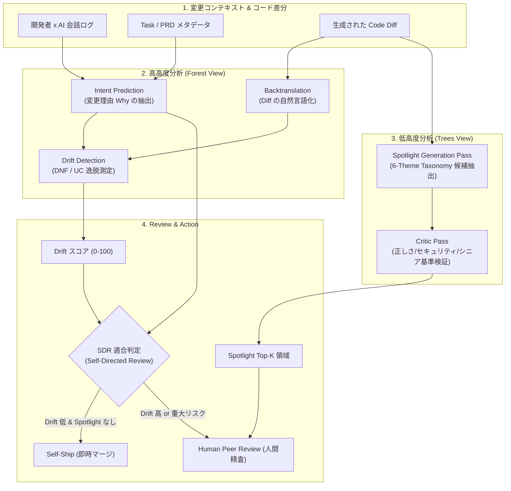

## この記事で扱うこと

AIコーディングエージェントを本格導入すると、コード差分(Diff)の生成量が人間のレビュー能力を超えます。「全行を人間が目視する」という前提が崩れたとき、レビューの設計をどう組み替えるかが問題になります。

この記事では、Meta等の研究チームが発表した **ARCTIC** というシステムを題材に、次の3点を整理します。

- 既存のAIレビューツールが「何を見落としているか」を示すデータ
- ARCTICが採用した **意図(Intent)・逸脱(Drift)・重点箇所(Spotlight)** の3軸構造
- 自分のチームでレビュー配分を組み替えるときの設計指針と、その限界

対象読者は、AI駆動開発のレビュー体制を設計する立場の方(テックリード、開発責任者、発注側の判断者)です。ツールの導入手順書ではなく、**レビューという有限資源をどこへ配分するかの判断材料**として書いています。

一次情報源は [arXiv:2607.29516 *From Code Review to Code Critique: Intent, Drift, and Spotlight for AI-Generated Diffs at Scale*](https://arxiv.org/abs/2607.29516)(Chandra Maddila, M. Rashik, Eunji Khan, J. Saindon, N. Nachi, S. Mukherjee, P. C. Rigby / Meta Inc.・Concordia University)です。


*この記事の全体像。以下、順に解説します。*

## なぜ従来のAIレビューでは足りないのか

### 人間とAIで「気にする対象」がずれている

研究チームは18,000件の人間レビュー(CR2データセット)と、人間の著者に受け入れられたAIレビュー712件を分析し、レビューの関心事を6テーマに分類しました。その分布が、既存AIレビューの問題を数字で示しています。

| テーマ | 人間レビューの割合 | 既存AIレビューの割合 | 相対ギャップ |
|---|---|---|---|
| Correctness & Reliability(正しさ・信頼性) | 44.4% | 25.5% | -42.6% |
| Code Quality & Maintainability(品質・保守性) | 19.2% | 22.9% | +19.3% |
| Security(セキュリティ) | 19.1% | 2.0% | -89.5% |
| Best Practices & Standards(規格・慣習) | 7.2% | 30.8% | +327.8% |
| Performance & Efficiency(性能・効率) | 6.6% | 2.7% | -59.1% |
| Code Design(アーキテクチャ設計) | 3.6% | 16.2% | +350.0% |

読み取れることは2つです。

- **過剰検出**: 既存AIレビューは、慣習(30.8%)と設計論(16.2%)で発言の約半分を使っている。人間が同じテーマに割く割合は合計10.8%にすぎない。
- **見落とし**: セキュリティ指摘は人間の19.1%に対しAIは2.0%。相対で約9割の不足になる。

この乖離が「AI Review Gap」です。

### 人間が実際に受け入れる指摘はどこに集中するか

さらに重要なのは、AIレビューのうち**人間著者が実際に修正に応じたもの**の分布です。

| テーマ | 受容されたAIレビューの割合 |
|---|---|
| Correctness & Reliability | 46.1% |
| Security | 20.1% |
| Code Quality & Maintainability | 19.0% |

受容された指摘の8割強が、正しさ・セキュリティ・保守性に集まります。しかもこの傾向は、コードの著者が人間かAIかに関わらず同じです。

つまり、AIレビューの指摘量を増やしても価値は増えません。**指摘の分布を人間の優先順位へ寄せること**が効きます。ARCTICはここを起点に設計されています。

## ARCTICは何をしているか

ARCTICはレビューを「Code Review(逐行確認)」から「Code Critique(構造的批評)」へ再定義します。差分を上空から見る **Forest View(意図と逸脱)** と、地上で精査する **Trees View(重点箇所)** を組み合わせる構造です。



### 軸1: Intent Prediction(なぜ変えたかを復元する)

差分が「何をしたか(What)」ではなく「なぜ行われたか(Why)」を推論します。

- 入力は、開発者とAIの会話ログ、タスクのメタデータ、AIが立てた計画、設計書(PRD)。
- **コード差分そのものはプロンプトから除外されます**。差分から意図を推定して、その意図で差分を評価すると循環評価になるためです。
- オフライン評価で F1 = 0.860(Agentic Pass)、F1 = 0.844(Zero-shot Pass、トークン量は約1/6.4)。現場導入での開発者承認率は90.2%。

意図の粒度は、変更内容の要約ではなく目的の記述です。「APIに5秒のタイムアウトを追加した」ではなく「外部API停止時にアプリがハングするのを防ぐ」が求める出力になります。

### 軸2: Drift Detection(エージェントの脱線を測る)

意図と実際の差分がどれだけずれたかをスコア化します。

1. コード差分を **逆翻訳(Backtranslation)** して、自然言語の変更サマリを生成する。
2. そのサマリと、軸1で抽出したIntentを比較する。
3. ずれを2種類で測る。**DNF(Did Not Follow: 指示未遵守)** と **UC(Unrequested Changes: 頼んでいない追加変更)**。
4. 0-10「Perfect Alignment」から76-100「Major Drift」までの5段階バケットで評定する。

人間アノテーターとの一致度は QWK(Quadratic Weighted Kappa)= 0.907。Driftスコアを提示することで、コードのミスマッチが5.76ポイント減少しています(p = 0.026)。

UCを独立して測る点が実務的です。エージェントは指示外のリファクタリングを勝手に混ぜがちで、これはレビュー負荷を押し上げる主因になります。

### 軸3: Code Spotlight(どこを読むべきかを順位付けする)

巨大な差分の中から、人間が深く精査すべきTop-K領域を順位付けして提示します。

- **Generation Pass**: 6テーマの分類に沿って候補領域を洗い出す。
- **Critic Pass**: 候補を厳格に検証し、スタイル指摘のような低価値な候補を落とす。

この2段構えにより、従来のAIレビュアーと比較して**トークン量を5分の1に削減しながら、品質推定(Quality Estimation)精度を2.4倍に向上**させています。指摘を増やすのではなく、削る側に検証コストを払う設計です。

### 3軸を束ねた出口: Self-Directed Review

3つのシグナル(Intent・Drift・Spotlight)をすべてクリアした差分には、著者のセルフチェック完了をもってピアレビューをスキップし即時マージできる **Self-Directed Review(SDR)** パスが開きます。

論文によれば、導入以降SDR経由でマージされたコードに起因する障害・欠陥は0件です。ただしこれは導入初期の実績であり、恒久的な保証ではありません(後述)。

## 意図の根拠をどこに求めるか

現場でこの構造を再現しようとすると、最初に詰まるのが「Intentの根拠をどこから取るか」です。3つの論点があります。

### 会話ログが取れないときのフォールバック

CI/CD経由のスクリプト実行やheadless実行では、会話ログが存在しません。この場合は次の優先順位で代替します。

1. 関連するTask / Issueチケットの本文とメタデータ
2. PRのタイトル・概要・テストプラン
3. リンクされた設計書(PRD)や仕様書Markdown

裏を返すと、**チケットとPR本文の記述品質がそのままIntent予測の精度になります**。無人実行の比率が高いチームほど、ここへの投資が効きます。

### 会話ログと確定仕様書が食い違ったら

開発途中の会話ログには、試行錯誤・途中の要件変更・デバッグ指示が混ざります。最終的な仕様と食い違う場面は必ず起きます。ARCTICの設計思想では、優先順位はこう整理されます。

| 情報源 | 役割 |
|---|---|
| 確定仕様書(PRD / Task仕様) | 変更の正当なゴール(Ground-truth)の基準。最優先 |
| 会話ログ | 仕様書に書かれていない実装判断の理由・経緯・制約を補完するグラウンディングデータ |

会話ログだけを信じると、開発者の思いつきやAIの誘導による仕様脱線を「意図どおり」と誤認します。**仕様書を錨(Anchor)に置き、会話ログで意図を具体化する**重み付けが必要です。

### 判断のポイント

自チームに置き換えるなら、次の順で確認できます。

- 変更の目的が、コード外(チケット・PRD)に文章として残っているか
- 残っていないなら、それは会話ログ依存であり、Drift検知は誤発報しやすい状態にある
- 会話ログを保存する運用があるか。無いならまずそこから

## 導入前に押さえる限界

有望な結果が出ている一方で、そのまま信用してはいけない箇所が3つあります。

### 1. 会話ログのノイズによる誤ったDrift検知

会話の途中で議論されたが最終的に不採用となった指示がIntentに混入すると、正常な差分に対して「指示未遵守(DNF)」のアラートが誤発報されます。会話ログをそのまま入力するほど、この誤検知は増えます。

### 2. 中間バケットの識別精度が低い

論文のオフライン評価では、両極端の判定は高精度ですが、中間帯は明確に落ちます。

| バケット | F1 |
|---|---|
| Perfect Alignment | 0.889 |
| Moderate Drift | 0.341 |
| Significant Drift | 0.409 |
| Major Drift | 0.812 |

「まったくずれていない」「大きくずれている」は機械的に判別できます。しかし**中程度の逸脱の識別は依然として難しい**というのが現状です。運用設計では、中間帯を「自動判定できないので人間へ回す」領域として扱うのが安全です。

### 3. SDRの形骸化とオートメーション・バイアス

AIが「Drift低」「Spotlightなし」と示したとき、開発者が確認を省略してマージする行動が起きえます。導入初期のゼロ障害実績に安住せず、SDR経由の差分を定期サンプリングして監査する仕組みを併設すべきです。

## 自チームでレビュー配分を組み替える

ここまでを踏まえた設計指針です。ツールをそのまま導入できなくても、**配分の考え方だけは移植できます**。

```
【従来のレビュー配分】
[全行コード] ─── (均等に目視) ───> [スタイル / バグ / 設計を同時に確認] (レビュー過負荷)

【ARCTIC 型のレビュー再配分】
1. 意図 (Intent)    : 対話ログ・Taskから「なぜ変えたか」を構造化
2. 逸脱 (Drift)     : 逆翻訳サマリと Intent を比較し、指示無視・余計な変更をスコア化
3. リスク (Spotlight): スタイルを無視し、Correctness / Security / Performance の領域のみ精査
   └─ Drift 低 ＆ Spotlight 無し ──> セルフマージ (SDR)
   └─ Drift 高 ＆ Spotlight 有り ──> 人間のシニアレビュアーへ集中配分
```

具体的な着手順は次の3段です。

1. **「全行確認」をやめる**。スタイル・フォーマット・単純な保守性はLinterと静的解析へ委譲し、人間レビューの対象から外す。ここを外さない限り、後続の2つは効きません。
2. **コードを読む前に意図と逸脱を見せる**。PR作成時に、変更の目的と「エージェントが脱線していないか」をレビュアーへ提示する。まずはPRテンプレートに「目的」「指示していないのに変えた箇所」の欄を設けるだけでも近似できます。
3. **リスクでレビュー経路を分岐させる**。低リスク・低Driftの差分はセルフチェックで流し、セキュリティ懸念のある領域にシニアの時間を集中させる。

この3段は、AIレビューツールの精度以前に**レビューという資源配分の問題**です。ツール選定の前に、自チームがどのテーマへ人間の時間を使っているかを一度測ると、判断がぶれにくくなります。

## まとめ

- 既存のAIレビューは慣習・設計論に発言の約半分を使い、人間が最重視する正しさ(-42.6%)とセキュリティ(-89.5%)を大きく取りこぼしている。
- ARCTICは、意図(Intent)・逸脱(Drift)・重点箇所(Spotlight)の3軸で差分を構造化し、トークン量5分の1で品質推定精度2.4倍を達成した。
- 意図の根拠は確定仕様書を錨に置き、会話ログは理由の補完に使う。会話ログ単独では脱線を見逃す。
- 限界は3つ。会話ログのノイズによる誤検知、中間Driftバケットの識別精度(F1 0.341〜0.409)、SDRのオートメーション・バイアス。
- ツール導入以前に、「全行確認をやめる」「読む前に意図と逸脱を見せる」「リスクで経路を分岐させる」の3段は自チームでも実行できる。

この記事が少しでも参考になった、あるいは改善点などがあれば、ぜひリアクションやコメント、SNSでのシェアをいただけると励みになります！

## 参考リンク

- [arXiv:2607.29516 — From Code Review to Code Critique: Intent, Drift, and Spotlight for AI-Generated Diffs at Scale](https://arxiv.org/abs/2607.29516)
