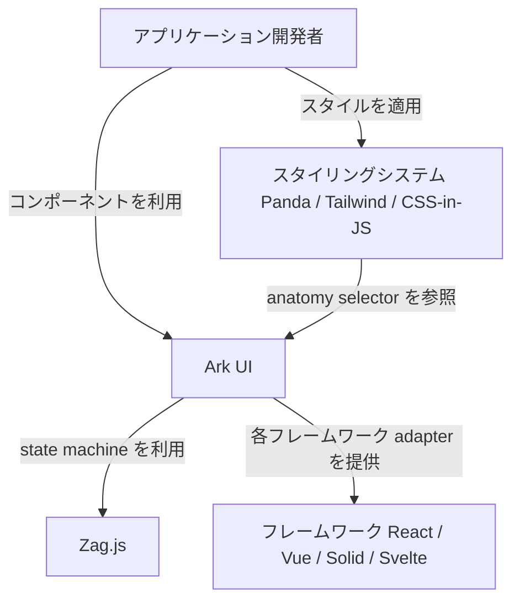
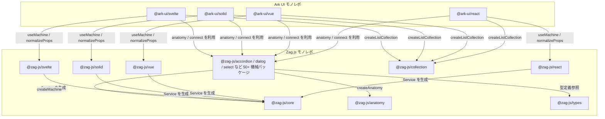
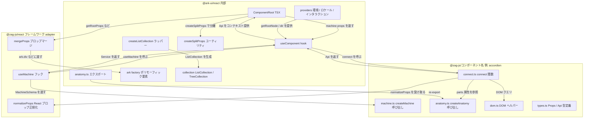
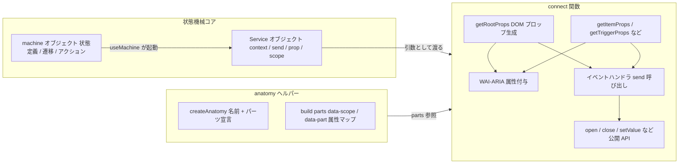
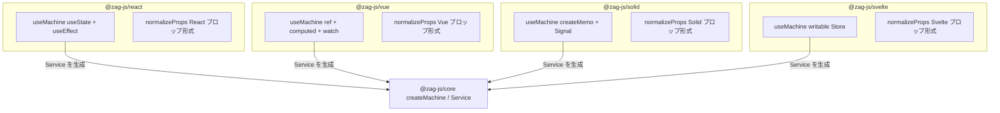
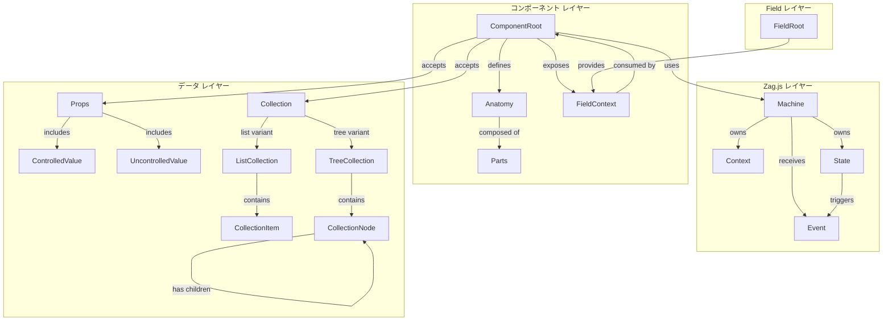
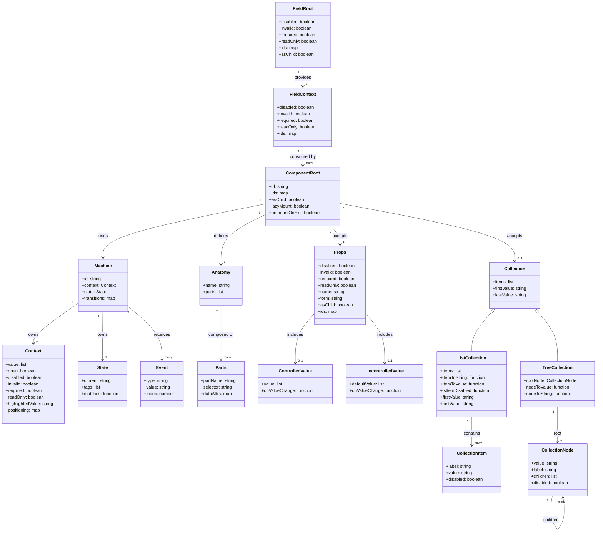

## ■概要

Ark UI は、Chakra UI チームが開発するヘッドレスコンポーネントライブラリです。

- **開発元**: Chakra Systems(Chakra UI の開発チーム)
- **目的**: スタイルを持たない(ヘッドレス)コンポーネントを提供し、開発者が独自のデザインシステムを構築できる基盤を提供する
- **基盤技術**: [Zag.js](https://zagjs.com/) — 有限状態機械(Finite State Machine)ベースのフレームワーク非依存コンポーネントロジックライブラリ
- **対応フレームワーク**: React / Solid / Vue / Svelte(4 フレームワークで API が統一)
- **コンポーネント数**: 45+ の本番対応コンポーネント
- **位置づけ**: Chakra UI v3 の内部基盤。Park UI(Panda CSS スタイル)等のベースライブラリ

### アーキテクチャ概要(4 層構造)

```
アプリケーション層(開発者コード)
        ↓
フレームワーク固有パッケージ層(@ark-ui/react, @ark-ui/vue, @ark-ui/solid, @ark-ui/svelte)
        ↓
フレームワークアダプター層(React hooks / Solid signals / Vue composables / Svelte stores)
        ↓
状態機械層(@zag-js — フレームワーク非依存のインタラクションロジック)
```

このアーキテクチャにより、フレームワーク間でコンポーネントの動作が完全に一致します。公式のアーキテクチャ図は [architecture_light.svg](https://ark-ui.com/images/architecture_light.svg) を参照してください。

### 類似ライブラリとの比較

| 項目               | Ark UI                       | Radix UI             | Headless UI    | Base UI              | React Aria           |
| ------------------ | ---------------------------- | -------------------- | -------------- | -------------------- | -------------------- |
| 実行方式           | 状態機械(Zag.js FSM)         | カスタムフック       | カスタムフック | カスタムフック       | フック + ARIA        |
| スタイル方針       | 完全無スタイル               | 完全無スタイル       | 完全無スタイル | 完全無スタイル       | 完全無スタイル       |
| 対応フレームワーク | React / Vue / Solid / Svelte | React のみ           | React / Vue    | React のみ           | React のみ           |
| 基盤               | Zag.js FSM                   | 独自実装             | 独自実装       | 独自実装(MUI チーム) | Adobe Spectrum       |
| アクセシビリティ   | WAI-ARIA + FSM 内蔵          | WAI-ARIA             | WAI-ARIA       | WAI-ARIA             | WCAG / ARIA 専門特化 |
| TypeScript         | フル対応                     | フル対応             | フル対応       | フル対応             | フル対応             |
| 主な採用           | Chakra UI v3, Park UI        | 多数の UI ライブラリ | Tailwind UI    | MUI X                | Adobe 製品           |

Park UI は Ark UI の上に Panda CSS でスタイルを適用したスタイル済みライブラリで、同チームが管理しています。

## ■特徴

### フレームワーク非依存(Framework-Agnostic)
React / Solid / Vue / Svelte の 4 フレームワークで同一の API を提供します。コンポーネントのロジックは Zag.js の状態機械として実装され、フレームワーク固有のアダプターを通じて各フレームワーク向けに提供されます。

### 完全ヘッドレス(Truly Headless)
デフォルトの CSS クラスやインラインスタイルを一切付与しません。Tailwind CSS / Panda CSS / CSS-in-JS / バニラ CSS のいずれとも組み合わせて使用できます。

### アクセシビリティ内蔵(Accessibility First)
WAI-ARIA パターンを状態機械に組み込んでいます。キーボードナビゲーションとスクリーンリーダーのサポートが、コンポーネント層ではなく FSM 層で保証されます。

### 状態機械による予測可能な動作
Zag.js の有限状態機械により、複雑なインタラクションのエッジケースを網羅します。全フレームワークで同一バージョンの状態機械を使用するため、動作が一致します。

### TypeScript 完全対応
全パッケージで型安全な API を提供します。状態遷移も型で保護されます。

### 本番実績あり
Chakra UI / OVHCloud / PluralSight 等の本番環境で採用されています。

## ■構造

### ●システムコンテキスト図



#### 要素説明

| 要素名                                            | 説明                                                                       |
| ------------------------------------------------- | -------------------------------------------------------------------------- |
| アプリケーション開発者                            | Ark UI を利用してアプリを構築するエンドユーザー                            |
| Ark UI                                            | headless コンポーネントライブラリ本体。4 フレームワーク向け adapter を提供 |
| Zag.js                                            | 有限状態機械ベースのコンポーネントロジックライブラリ。Ark UI のコア        |
| フレームワーク React / Vue / Solid / Svelte       | Ark UI が対応するフロントエンドフレームワーク                              |
| スタイリングシステム Panda / Tailwind / CSS-in-JS | anatomy selector を参照してスタイルを適用するツール群                      |

### ●コンテナ図



#### 要素説明

| 要素名                                   | 説明                                                                                        |
| ---------------------------------------- | ------------------------------------------------------------------------------------------- |
| @ark-ui/react                            | React 向けフレームワーク adapter。複合コンポーネントと React hooks を提供                   |
| @ark-ui/vue                              | Vue 3 向けフレームワーク adapter。コンポーザブルと SFC コンポーネントを提供                 |
| @ark-ui/solid                            | Solid.js 向けフレームワーク adapter。Signal ベースのコンポーネントを提供                    |
| @ark-ui/svelte                           | Svelte 向けフレームワーク adapter。Store ベースのコンポーネントを提供                       |
| @zag-js/core                             | 状態機械エンジン本体。createMachine / Service / Scope を定義                                |
| @zag-js/react                            | React の反応性を状態機械に接続する adapter。useMachine を提供                               |
| @zag-js/vue                              | Vue の ref / computed を状態機械に接続する adapter                                          |
| @zag-js/solid                            | Solid の Signal を状態機械に接続する adapter                                                |
| @zag-js/svelte                           | Svelte の Store を状態機械に接続する adapter                                                |
| @zag-js/anatomy                          | createAnatomy 関数を提供。data-scope / data-part 属性によるパーツ定義                       |
| @zag-js/collection                       | ListCollection / createListCollection を提供。多アイテムコンポーネント向け DOM クエリ抽象化 |
| @zag-js/accordion / dialog / select など | 各 UI コンポーネントの状態機械・connect 関数・anatomy 定義を含む個別パッケージ              |
| @zag-js/types                            | NormalizeProps / PropTypes など共通型定義                                                   |

### ●コンポーネント図

#### 図: @ark-ui/react の内部構造



#### 図: machine.ts と connect.ts の責務



#### 図: フレームワーク adapter 比較



#### 要素説明

| 要素名                        | 説明                                                                                                            |
| ----------------------------- | --------------------------------------------------------------------------------------------------------------- |
| ComponentRoot TSX             | 複合コンポーネントのルート要素。createSplitProps で機械 props と DOM props を分離し Provider でコンテキスト提供 |
| useComponent hook             | 各コンポーネント固有の hooks。useMachine を呼び Service を取得し connect で Api に変換                          |
| anatomy.ts エクスポート       | @zag-js/anatomy の createAnatomy 結果を各フレームワーク adapter から re-export                                  |
| ark factory                   | as プロップによって任意の HTML 要素としてレンダリング可能なポリモーフィックファクトリ                           |
| providers                     | getRootNode / dir / locale などのコンテキストをツリー全体に提供するプロバイダー群                               |
| createSplitProps              | props を機械向けと DOM 向けに型安全に分割するユーティリティ                                                     |
| createListCollection ラッパー | @zag-js/collection の ListCollection を生成するファクトリ                                                       |
| machine.ts                    | createMachine を呼び出し状態定義・遷移・アクション・ガードを宣言                                                |
| connect.ts                    | Service を受け取り getRootProps / getItemProps など DOM プロップ生成関数と公開 API を返す                       |
| anatomy.ts                    | createAnatomy でコンポーネント名とパーツ名を宣言                                                                |
| dom.ts                        | getElementById 等の DOM クエリをカプセル化                                                                      |
| useMachine フック             | フレームワーク固有の反応性システムで状態機械を起動し Service を返す                                             |
| normalizeProps                | フレームワーク固有のプロップ形式へ変換するアダプター関数                                                        |
| mergeProps                    | 複数のプロップオブジェクトをイベントハンドラのマージも含め合成                                                  |
| createAnatomy                 | コンポーネント名とパーツ名配列を受け取り AnatomyInstance を返す                                                 |
| Service オブジェクト          | 状態機械の実行インスタンス。context / send / prop / scope を公開                                                |

## ■データ

### ●概念モデル



### ●情報モデル



## ■構築方法

### 前提条件

- Node.js(LTS 推奨)
- React 18+, Vue 3+, SolidJS 1+, Svelte 4+ のいずれか
- TypeScript 利用時は TypeScript 4.9+ 推奨(`strict: true` 推奨)
- Ark UI はスタイルを一切持たない headless ライブラリのため、スタイリングは完全に利用者側で実装する

### インストール

#### React

```bash
pnpm add @ark-ui/react
# または npm install / yarn add / bun add
```

#### Vue / Solid / Svelte

```bash
pnpm add @ark-ui/vue
pnpm add @ark-ui/solid
pnpm add @ark-ui/svelte
```

### ピア依存

各フレームワークパッケージは内部で `@zag-js/*` ステートマシンを利用します。個別にインストールする必要はありません。

| パッケージ       | 主要ピア依存                     |
| ---------------- | -------------------------------- |
| `@ark-ui/react`  | `react >= 18`, `react-dom >= 18` |
| `@ark-ui/vue`    | `vue >= 3`                       |
| `@ark-ui/solid`  | `solid-js >= 1`                  |
| `@ark-ui/svelte` | `svelte >= 4`                    |

### バージョン確認

```bash
pnpm list @ark-ui/react
```

### TypeScript 設定

推奨 `tsconfig.json`:

```json
{
  "compilerOptions": {
    "strict": true,
    "jsx": "react-jsx",
    "moduleResolution": "bundler",
    "esModuleInterop": true
  }
}
```

コンポーネントの Props 型は名前空間経由でアクセスできます。

```tsx
import type { Select } from '@ark-ui/react/select'
type MyProps = Select.RootProps
```

### スタイリング前提(Unstyled)

Ark UI は完全に unstyled です。スタイリングには `data-scope` / `data-part` / `data-state` 属性を使います。

```css
[data-scope='select'][data-part='trigger'] {
  border: 1px solid #ccc;
  padding: 0.5rem 1rem;
}

[data-scope='select'][data-part='trigger'][data-state='open'] {
  border-color: #0070f3;
}
```

Tailwind CSS / CSS Modules / CSS-in-JS / Panda CSS のいずれとも組合わせ可能です。

## ■利用方法

### Anatomy(共通階層構造)

すべてのコンポーネントは共通の階層構造(Anatomy)を持ちます。

```
Root                  ← 状態管理・コンテキスト提供
├── Label             ← アクセシビリティラベル
├── Control           ← 入力エリアのラッパー
│   ├── Trigger       ← ドロップダウン開閉ボタン
│   ├── ClearTrigger  ← 選択解除ボタン
│   └── Indicator     ← 開閉状態アイコン
├── Positioner        ← フローティング要素の位置決め
│   └── Content       ← ドロップダウン内容
│       └── Item      ← 選択肢
│           ├── ItemText
│           └── ItemIndicator
└── HiddenSelect      ← フォーム送信用ネイティブ要素(Select のみ)
```

### createListCollection

Select / Combobox などのコレクション系コンポーネントではデータを抽象化します。

```tsx
import { createListCollection } from '@ark-ui/react/select'

const frameworks = createListCollection({
  items: [
    { label: 'React', value: 'react' },
    { label: 'Solid', value: 'solid' },
    { label: 'Vue', value: 'vue' },
    { label: 'Svelte', value: 'svelte' },
  ],
})

// カスタム型の場合
const collection = createListCollection({
  items: products,
  itemToValue: (item) => item.id,
  itemToString: (item) => item.name,
})
```

### Select — 基本パターン

```tsx
import { Portal } from '@ark-ui/react/portal'
import { Select, createListCollection } from '@ark-ui/react/select'

const frameworks = createListCollection({
  items: [
    { label: 'React', value: 'react' },
    { label: 'Vue', value: 'vue' },
    { label: 'Solid', value: 'solid' },
  ],
})

export const BasicSelect = () => (
  <Select.Root collection={frameworks}>
    <Select.Label>Framework</Select.Label>
    <Select.Control>
      <Select.Trigger>
        <Select.ValueText placeholder="Select framework" />
      </Select.Trigger>
      <Select.ClearTrigger>✕</Select.ClearTrigger>
      <Select.Indicator>▼</Select.Indicator>
    </Select.Control>
    <Portal>
      <Select.Positioner>
        <Select.Content>
          <Select.ItemGroup>
            {frameworks.items.map((item) => (
              <Select.Item key={item.value} item={item}>
                <Select.ItemText>{item.label}</Select.ItemText>
                <Select.ItemIndicator>✓</Select.ItemIndicator>
              </Select.Item>
            ))}
          </Select.ItemGroup>
        </Select.Content>
      </Select.Positioner>
    </Portal>
    <Select.HiddenSelect />
  </Select.Root>
)
```

### Controlled / Uncontrolled パターン

すべてのコンポーネントで `value` / `defaultValue` / `onValueChange` の 3 点セットで制御します。

```tsx
// Uncontrolled
<Select.Root collection={frameworks} defaultValue={['react']}>
  {/* ... */}
</Select.Root>

// Controlled
const [value, setValue] = useState<string[]>(['react'])

<Select.Root
  collection={frameworks}
  value={value}
  onValueChange={(details) => setValue(details.value)}
>
  {/* ... */}
</Select.Root>
```

各コンポーネントの Controlled Prop 対応表:

| コンポーネント | Controlled Prop         | Uncontrolled Prop           | Callback        |
| -------------- | ----------------------- | --------------------------- | --------------- |
| Select         | `value: string[]`       | `defaultValue: string[]`    | `onValueChange` |
| Accordion      | `value: string[]`       | `defaultValue: string[]`    | `onValueChange` |
| Tabs           | `value: string \| null` | `defaultValue: string`      | `onValueChange` |
| Dialog         | `open: boolean`         | `defaultOpen: boolean`      | `onOpenChange`  |
| DatePicker     | `value: DateValue[]`    | `defaultValue: DateValue[]` | `onValueChange` |

### Portal

フローティング要素(Positioner + Content)は `<Portal>` でラップし `document.body` 直下にレンダリングすることで、z-index / overflow: hidden 問題を回避できます。

```tsx
import { Portal } from '@ark-ui/react/portal'

<Portal>
  <Select.Positioner>
    <Select.Content>{/* ... */}</Select.Content>
  </Select.Positioner>
</Portal>
```

### Dialog

```tsx
import { Dialog } from '@ark-ui/react/dialog'
import { Portal } from '@ark-ui/react/portal'

export const BasicDialog = () => (
  <Dialog.Root>
    <Dialog.Trigger>Open Dialog</Dialog.Trigger>
    <Portal>
      <Dialog.Backdrop />
      <Dialog.Positioner>
        <Dialog.Content>
          <Dialog.Title>Welcome Back</Dialog.Title>
          <Dialog.Description>Sign in to continue.</Dialog.Description>
          <Dialog.CloseTrigger>✕</Dialog.CloseTrigger>
        </Dialog.Content>
      </Dialog.Positioner>
    </Portal>
  </Dialog.Root>
)
```

主要 Props: `open` / `defaultOpen` / `onOpenChange` / `modal` / `lazyMount` / `unmountOnExit` / `trapFocus` / `preventScroll`

### Combobox(useListCollection + useFilter)

```tsx
import { Combobox, useListCollection } from '@ark-ui/react/combobox'
import { useFilter } from '@ark-ui/react/locale'
import { Portal } from '@ark-ui/react/portal'

const initialItems = ['React', 'Solid', 'Vue', 'Svelte']

export const BasicCombobox = () => {
  const { contains } = useFilter({ sensitivity: 'base' })
  const { collection, filter } = useListCollection({ initialItems, filter: contains })

  return (
    <Combobox.Root
      collection={collection}
      onInputValueChange={(details) => filter(details.inputValue)}
    >
      <Combobox.Label>Framework</Combobox.Label>
      <Combobox.Control>
        <Combobox.Input placeholder="Search..." />
        <Combobox.Trigger>▼</Combobox.Trigger>
        <Combobox.ClearTrigger>✕</Combobox.ClearTrigger>
      </Combobox.Control>
      <Portal>
        <Combobox.Positioner>
          <Combobox.Content>
            {collection.items.map((item) => (
              <Combobox.Item key={item} item={item}>
                <Combobox.ItemText>{item}</Combobox.ItemText>
                <Combobox.ItemIndicator>✓</Combobox.ItemIndicator>
              </Combobox.Item>
            ))}
          </Combobox.Content>
        </Combobox.Positioner>
      </Portal>
    </Combobox.Root>
  )
}
```

`useListCollection` は動的フィルタリング用のリアクティブなコレクション管理 hook です。静的リストには `createListCollection` を使います。

### Accordion

```tsx
import { Accordion } from '@ark-ui/react/accordion'

const items = [
  { value: 'a', title: 'Panel A', content: 'Content A' },
  { value: 'b', title: 'Panel B', content: 'Content B' },
]

export const BasicAccordion = () => (
  <Accordion.Root defaultValue={['a']} collapsible multiple>
    {items.map((item) => (
      <Accordion.Item key={item.value} value={item.value}>
        <Accordion.ItemTrigger>
          {item.title}
          <Accordion.ItemIndicator>▼</Accordion.ItemIndicator>
        </Accordion.ItemTrigger>
        <Accordion.ItemContent>{item.content}</Accordion.ItemContent>
      </Accordion.Item>
    ))}
  </Accordion.Root>
)
```

### Tabs

```tsx
import { Tabs } from '@ark-ui/react/tabs'

export const BasicTabs = () => (
  <Tabs.Root defaultValue="account">
    <Tabs.List>
      <Tabs.Trigger value="account">Account</Tabs.Trigger>
      <Tabs.Trigger value="password">Password</Tabs.Trigger>
      <Tabs.Trigger value="billing">Billing</Tabs.Trigger>
      <Tabs.Indicator />
    </Tabs.List>
    <Tabs.Content value="account">Account settings</Tabs.Content>
    <Tabs.Content value="password">Change password</Tabs.Content>
    <Tabs.Content value="billing">Billing info</Tabs.Content>
  </Tabs.Root>
)
```

### Menu

```tsx
import { Menu } from '@ark-ui/react/menu'
import { Portal } from '@ark-ui/react/portal'

export const BasicMenu = () => (
  <Menu.Root>
    <Menu.Trigger>Open menu</Menu.Trigger>
    <Portal>
      <Menu.Positioner>
        <Menu.Content>
          <Menu.ItemGroup>
            <Menu.ItemGroupLabel>Actions</Menu.ItemGroupLabel>
            <Menu.Item value="edit">Edit</Menu.Item>
            <Menu.Item value="delete">Delete</Menu.Item>
          </Menu.ItemGroup>
          <Menu.Separator />
          <Menu.Item value="settings">Settings</Menu.Item>
        </Menu.Content>
      </Menu.Positioner>
    </Portal>
  </Menu.Root>
)
```

ネストされたサブメニューは `Menu.Root` を入れ子にし、子側のトリガーに `Menu.TriggerItem` を使います。

### DatePicker

```tsx
import { DatePicker } from '@ark-ui/react/date-picker'
import { Portal } from '@ark-ui/react/portal'

export const BasicDatePicker = () => (
  <DatePicker.Root>
    <DatePicker.Label>Date</DatePicker.Label>
    <DatePicker.Control>
      <DatePicker.Input />
      <DatePicker.Trigger>📅</DatePicker.Trigger>
      <DatePicker.ClearTrigger>✕</DatePicker.ClearTrigger>
    </DatePicker.Control>
    <Portal>
      <DatePicker.Positioner>
        <DatePicker.Content>
          <DatePicker.View view="day">
            <DatePicker.ViewControl>
              <DatePicker.PrevTrigger>‹</DatePicker.PrevTrigger>
              <DatePicker.ViewTrigger>
                <DatePicker.RangeText />
              </DatePicker.ViewTrigger>
              <DatePicker.NextTrigger>›</DatePicker.NextTrigger>
            </DatePicker.ViewControl>
            <DatePicker.Table>{/* TableHead / TableBody */}</DatePicker.Table>
          </DatePicker.View>
        </DatePicker.Content>
      </DatePicker.Positioner>
    </Portal>
  </DatePicker.Root>
)
```

`selectionMode` は `"single" | "multiple" | "range"` から選べます。`value` は `@internationalized/date` の `DateValue[]` 型です。

### TreeView(createTreeCollection)

```tsx
import { TreeView, createTreeCollection } from '@ark-ui/react/tree-view'

interface Node { id: string; name: string; children?: Node[] }

const collection = createTreeCollection<Node>({
  nodeToValue: (node) => node.id,
  nodeToString: (node) => node.name,
  rootNode: {
    id: 'ROOT',
    name: '',
    children: [
      { id: 'src', name: 'src', children: [{ id: 'src/index.ts', name: 'index.ts' }] },
      { id: 'package.json', name: 'package.json' },
    ],
  },
})
```

`TreeView.NodeProvider` を再帰的にネストしてノードを描画します。

### Field.Root との組み合わせ

`Field.Root` はフォームコンテキスト(`invalid` / `disabled` / `required` / `readOnly`)を子コンポーネントへ伝播し、ARIA 属性を自動的に管理します。

```tsx
import { Field } from '@ark-ui/react/field'

export const BasicField = () => (
  <Field.Root invalid={false} required>
    <Field.Label>Username</Field.Label>
    <Field.Input />
    <Field.HelperText>Enter your username</Field.HelperText>
    <Field.ErrorText>Username is required</Field.ErrorText>
  </Field.Root>
)
```

Select や Combobox を子として配置すると、`disabled` / `invalid` などの状態が自動継承されます。

### asChild / Render Prop パターン

`asChild` prop を使うと、Ark UI の DOM 要素を任意の要素やカスタムコンポーネントに差し替えられます。aria 属性・イベントハンドラはそのまま引き継がれます。

```tsx
import { Popover } from '@ark-ui/react/popover'

export const AsChildExample = () => (
  <Popover.Root>
    <Popover.Trigger asChild>
      <button className="my-custom-button">Open</button>
    </Popover.Trigger>
    <Popover.Positioner>
      <Popover.Content>
        <Popover.Title>Subscription</Popover.Title>
      </Popover.Content>
    </Popover.Positioner>
  </Popover.Root>
)

// Menu.Item をリンクに
<Menu.Item asChild>
  <a href="https://ark-ui.com">Documentation</a>
</Menu.Item>
```

Solid では `asChild` で関数 children(render prop)を使い、open / disabled 等の状態を受け取れます。Vue では `as-child` 属性 + デフォルトスロットで同様に差し替えられます。

### フレームワーク別インポートパス

```tsx
// サブパスインポート(tree-shaking に有利)
import { Select, createListCollection } from '@ark-ui/react/select'
import { Dialog } from '@ark-ui/react/dialog'
import { Portal } from '@ark-ui/react/portal'

// Vue
import { Slider } from '@ark-ui/vue/slider'
// Solid
import { Slider } from '@ark-ui/solid/slider'
// Svelte
import { Slider } from '@ark-ui/svelte/slider'
```

## ■運用

### バージョンアップ戦略(@ark-ui/react と zag-js の関係)

- `@ark-ui/react` は `@zag-js/*` を direct dependency として保持し、全コンポーネントが同一バージョンで固定されます。`@zag-js/*` を `package.json` に直接記述しないことが推奨されます。
- Svelte パッケージはフレームワーク固有の事情から React / Solid / Vue より約 15 マイナーバージョン遅れることがあります。
- v5.x 系でも changelog 記載の通り、prop 追加・削除・挙動変更がマイナーバージョンで発生するため、必ず [Changelog](https://ark-ui.com/docs/overview/changelog) を確認します。
- 本番プロダクトでは `"@ark-ui/react": "~5.35.0"` のようにパッチバージョンのみ自動更新する tilde 指定を推奨します。
- v5.0.0(2025-03-06)は React ネイティブプリミティブへの移行でパフォーマンスが 1.5x〜4x 向上し、`Carousel.Root` に必須 prop `slideCount` が追加されました。
- v5.24.0 で `TimePicker` が削除、v5.32.0 で `BottomSheet` が `Drawer` に置換されました。

### 型定義の確認

- 全パッケージが `dist/` 以下に `.d.ts` を含むため、`@types/*` は不要です。
- `@ark-ui/anatomy` を直接インポートするとバージョン不整合が起きることがあるため、`@ark-ui/react/anatomy` サブパスを使用します。

```ts
// OK
import { selectAnatomy } from '@ark-ui/react/anatomy'
```

### SSR / Next.js App Router での注意点

#### `"use client"` 指令の付与

Ark UI コンポーネントは React hooks を使うため、Server Component に直接インポートできません。ラッパーファイルを `"use client"` で作成します。

```tsx
// components/ui/select.tsx
'use client'
export { Select } from '@ark-ui/react/select'
```

#### Edge Runtime での問題

Edge Runtime では、barrel エントリ経由のインポートで `'useState' is not exported from 'react'` エラーが発生する場合があります。対処としてサブパスインポートに切り替えます。

```ts
// NG: import { Switch } from '@ark-ui/react'
import { Switch } from '@ark-ui/react/switch'
```

#### Portal と SSR

`Portal` はデフォルトで `document.body` にマウントするため、SSR 時に hydration mismatch が発生しうります。`disabled` prop で Portal を無効化するか、`container` prop でマウント先を制御します。

### バンドルサイズ最適化 / Tree-shaking

- `@ark-ui/react` は `"sideEffects": false` を設定しており、bundler による tree-shaking が有効です。
- コンポーネントサブパスインポートを推奨します(`import { Dialog } from '@ark-ui/react/dialog'`)。
- v5.0.0 で `@zag-js/store` 依存を軽量なカスタム実装に置き換え、バンドルサイズが削減されました。
- Next.js Bundle Analyzer(`@next/bundle-analyzer`)で各コンポーネントの実際のサイズを計測します。

## ■ベストプラクティス

### Panda CSS — Slot Recipe パターン

`sva()`(slot variant API)を使い、Ark UI の anatomy をスロット名として活用します。

```ts
// select.recipe.ts
import { sva } from '@/styled-system/css'
import { selectAnatomy } from '@ark-ui/react/anatomy'

export const selectRecipe = sva({
  slots: selectAnatomy.keys(),
  base: {
    trigger: { border: '1px solid', borderRadius: 'md' },
    content: { bg: 'white', shadow: 'md' },
  },
  variants: {
    size: {
      sm: { trigger: { px: '2', py: '1', fontSize: 'sm' } },
      md: { trigger: { px: '4', py: '2', fontSize: 'md' } },
    },
  },
  defaultVariants: { size: 'md' },
})
```

状態スタイルは data 属性の条件を使います(`_open`, `_disabled` 等)。

### Tailwind CSS

`data-[state=open]:bg-gray-100` のようにデータ属性セレクタで状態スタイルを適用します。

```tsx
<Select.Trigger className="border rounded px-4 py-2 data-[state=open]:ring-2" />
```

### Park UI との組合せ

- Park UI は Ark UI の上に構築されたデザインシステムで、コンポーネントのソースコードと recipe を CLI でプロジェクトに直接コピーする形式です。
- `park-ui add button` のような CLI で必要なコンポーネントだけ追加できます。

### ラッパーコンポーネント設計

- デザインシステムの公開 API として Ark のサブコンポーネント(`Select.Item` 等)をそのまま再エクスポートし、style だけを recipe に集約すると保守しやすくなります。

```tsx
'use client'
import { Select as ArkSelect } from '@ark-ui/react/select'

type SelectRootProps = ArkSelect.RootProps & { size?: 'sm' | 'md' | 'lg' }
export const SelectRoot = ({ size = 'md', ...props }: SelectRootProps) => (
  <ArkSelect.Root data-size={size} {...props} />
)
```

### asChild パターン

- `asChild` は DOM 要素を描画するほぼ全ての Ark コンポーネントで利用可能です。
- 子要素は 1 つだけ渡します(複数渡すとレンダリングエラー)。
- コンポーネントによっては対応する要素型に制約があります(例: `Checkbox.Root` は `label` 要素)。
- `asChild` と `ref` の併用は v5 以降で正しく動作します。

### アクセシビリティチェック

- Ark UI は WAI-ARIA パターンを FSM 内に実装済みで、キーボードナビゲーションとスクリーンリーダー対応が内蔵されています。
- CI パイプラインに `axe-core` + `@axe-core/react` を組み込み、PR ごとに WCAG 違反を自動検出します。
- Lighthouse の Accessibility スコアを CI 閾値として設定します(`lhci autorun`)。

### Field.Root 併用

- `Field.Root` はフォームコントロールの包括的なアクセシビリティコンテキストを提供します。
- ネスト内の Ark UI コンポーネントは `disabled` / `invalid` / `required` / `readOnly` を自動継承します。
- v5.35.0 で `Field.Item` が追加され、複数コントロールのレイアウトが可能になりました。
- `Field.Context` / `useFieldContext` フックでカスタムコントロールからも状態を参照できます。

### Portal の使い分け

- **Portal が必要なケース**: Dropdown / Dialog / Tooltip など、z-index 管理やオーバーフロー制約(`overflow: hidden` の親)を回避したい場合。
- **Portal を無効化するケース**: SSR 優先・テストのしやすさを重視する場合、または Shadow DOM 環境。
- `container` prop で Portal のマウント先を指定できます。

### react-hook-form との統合

Ark UI コンポーネントはネイティブ `<input>` の `onChange` を使わないため、`Controller` 経由で統合します。

```tsx
<Controller
  name="country"
  control={control}
  render={({ field }) => (
    <Select.Root
      collection={countryCollection}
      value={field.value ? [field.value] : []}
      onValueChange={({ value }) => field.onChange(value[0])}
    >
      {/* ... */}
      <Select.HiddenSelect />
    </Select.Root>
  )}
/>
```

ポイント: コールバック名は `onValueChange`。`Select.HiddenSelect` でネイティブフォームサブミットを担保。`value` は `string[]` 型。

### 多言語 / RTL 対応

`LocaleProvider` でアプリ全体のロケールと文字方向を設定します。

```tsx
import { LocaleProvider } from '@ark-ui/react/locale'

<LocaleProvider locale="ar-EG">
  <App />
</LocaleProvider>
```

- `useLocaleContext()` フックで `{ locale, dir }` を取得できます。
- DatePicker の非グレゴリオ暦対応は v5.33.0 以降の `createCalendar` prop で対応できます。
- CSS は論理プロパティ(`margin-inline-start`)を使用し RTL / LTR の切替をシンプルにします。

### テスト戦略(Testing Library + user-event)

v5 移行でエフェクトが microtask から同期 flush に変わったため、`getByRole` → `findByRole`(非同期)への書き換えが必要なテストがあります。

```ts
const user = userEvent.setup()
await user.click(screen.getByRole('button'))
expect(await screen.findByRole('listbox')).toBeInTheDocument()
```

- Portal のコンテンツは `document.body` 以下に描画されるため、`within(document.body)` で取得するか `baseElement` を明示します。
- `jest-axe` で各コンポーネントの WCAG 違反をユニットテストレベルで検出します。

## ■トラブルシューティング

### 頻出エラーと対処

| 症状                                                       | 原因                                                                  | 対処                                                                                |
| ---------------------------------------------------------- | --------------------------------------------------------------------- | ----------------------------------------------------------------------------------- |
| `Hydration failed because the initial UI does not match`   | Portal が SSR で生成しない DOM を CSR で追加。または `useId` の不一致 | `<Portal disabled>` / `suppressHydrationWarning` / Next.js 13.4+ へアップデート     |
| `'useState' is not exported from 'react'`(Edge Runtime)    | バレルエントリからのインポートが Edge Runtime で解決失敗              | サブパスインポート(例 `@ark-ui/react/switch`)に変更                                 |
| `asChild` + `ref` で警告                                   | v5 以前の asChild と ref の非互換                                     | Ark UI v5 以降にアップデート                                                        |
| `asChild` が期待通り動作しない                             | 一部コンポーネントは特定の要素型のみ受け付ける                        | 公式 Docs の対応要素型を確認                                                        |
| iOS Safari でモーダル背後がスクロールする                  | `body { overflow: hidden }` が iOS で効かない                         | `position: fixed; top: -${scrollY}px` + `overscroll-behavior: none`                 |
| Dialog / Drawer 表示中に画面全体がジャンプする             | scroll lock 時のスクロールバー消失                                    | `html { scrollbar-gutter: stable }`                                                 |
| z-index が Portal コンテンツで効かない                     | `-webkit-overflow-scrolling: touch` が stacking context を破壊        | 当該プロパティを削除、または Stacking Context 階層を整理                            |
| `controlled/uncontrolled` React 警告                       | `value` と `defaultValue` を同時指定                                  | controlled なら `value`+`onValueChange` のみ、uncontrolled なら `defaultValue` のみ |
| `createListCollection` で `onValueChange` の型が `any`     | コレクション型の推論が効いていない                                    | `createListCollection<{ label: string; value: string }>({ items })` と型引数を明示  |
| iOS Safari のインプットフォーカス時に画面がズームイン      | `font-size` が 16px 未満                                              | `input, select, textarea { font-size: 16px }`                                       |
| Portal + SSR で `document is not defined`                  | サーバーで `document` が存在しない状態で Portal が評価される          | `dynamic(() => import('./MyDialog'), { ssr: false })` や `mounted` フラグ           |
| Combobox / Select が `'use client'` なしのファイルでエラー | App Router で hooks 使用コンポーネントを SC として import             | `'use client'` 付きファイルで再エクスポート                                         |

## ■まとめ

Ark UI は Zag.js の有限状態機械を基盤にして、React / Vue / Solid / Svelte の 4 フレームワークで同一 API を提供するヘッドレスコンポーネントライブラリです。ロジックを FSM 層に閉じ込めたことで、フレームワーク間の挙動差やアクセシビリティのエッジケースを設計レベルで排除できる点が、他の Headless ライブラリと一線を画します。本記事では C4 モデルによる内部構造、概念モデルと情報モデル、主要 9 コンポーネントの利用方法、SSR / バージョン運用 / テスト戦略までを整理しました。デザインシステムの土台選定や Chakra UI v3 移行を検討する際の判断材料として活用してください。

この記事が少しでも参考になった、あるいは改善点などがあれば、ぜひリアクションやコメント、SNSでのシェアをいただけると励みになります!

## ■参考リンク

- 公式ドキュメント
  - [Ark UI 公式サイト](https://ark-ui.com/)
  - [Ark UI Introduction](https://ark-ui.com/docs/overview/introduction)
  - [アーキテクチャ図](https://ark-ui.com/images/architecture_light.svg)
  - [List Collection API](https://ark-ui.com/docs/collections/list-collection)
  - [Getting Started - React](https://ark-ui.com/react/docs/overview/getting-started)
  - [Getting Started - Vue](https://ark-ui.com/vue/docs/overview/getting-started)
  - [Getting Started - Solid](https://ark-ui.com/solid/docs/overview/getting-started)
  - [Getting Started - Svelte](https://ark-ui.com/svelte/docs/overview/getting-started)
  - [Select](https://ark-ui.com/docs/components/select)
  - [Dialog](https://ark-ui.com/docs/components/dialog)
  - [Combobox](https://ark-ui.com/docs/components/combobox)
  - [DatePicker](https://ark-ui.com/docs/components/date-picker)
  - [Accordion](https://ark-ui.com/docs/components/accordion)
  - [Tabs](https://ark-ui.com/docs/components/tabs)
  - [Menu](https://ark-ui.com/docs/components/menu)
  - [TreeView](https://ark-ui.com/docs/components/tree-view)
  - [Field](https://ark-ui.com/docs/components/field)
  - [Composition - asChild ガイド](https://ark-ui.com/react/docs/guides/composition)
  - [Ark UI Changelog](https://ark-ui.com/docs/overview/changelog)
  - [Locale ドキュメント](https://ark-ui.com/docs/utilities/locale)
  - [Environment ドキュメント](https://ark-ui.com/docs/utilities/environment)
  - [Styling ガイド](https://ark-ui.com/docs/guides/styling)
  - [Zag.js 公式サイト](https://zagjs.com/)
  - [Park UI 公式サイト](https://park-ui.com/)
  - [Next.js Package Bundling ガイド](https://nextjs.org/docs/app/guides/package-bundling)
  - [React Hook Form Controller](https://react-hook-form.com/docs/usecontroller)
- GitHub
  - [chakra-ui/ark](https://github.com/chakra-ui/ark)
  - [Ark UI DeepWiki](https://deepwiki.com/chakra-ui/ark)
  - [Architecture and Design](https://deepwiki.com/chakra-ui/ark/2-architecture-and-design)
  - [@ark-ui/react packages](https://github.com/chakra-ui/ark/tree/main/packages/react/src)
  - [zag-js core](https://github.com/chakra-ui/zag/tree/main/packages/core/src)
  - [zag-js anatomy](https://github.com/chakra-ui/zag/tree/main/packages/anatomy/src)
  - [chakra-ui/zag CHANGELOG](https://github.com/chakra-ui/zag/blob/main/CHANGELOG.md)
  - [Issue - Edge Runtime Next.js](https://github.com/chakra-ui/ark/issues/2266)
  - [Issue - React-Hook-Form 統合](https://github.com/chakra-ui/ark/issues/1159)
  - [Discussion - forwardRef と asChild](https://github.com/chakra-ui/ark/discussions/2490)
- 記事
  - [Best of JS - Ark UI](https://bestofjs.org/projects/ark-ui)
  - [Styling Ark UI Tabs with Panda CSS](https://www.adebayosegun.com/blog/styling-ark-ui-tabs-with-panda-css)
  - [Building a Design System with Ark UI](https://dev.to/_estheradebayo/building-a-design-system-with-ark-ui-avatar-component-18ci)
