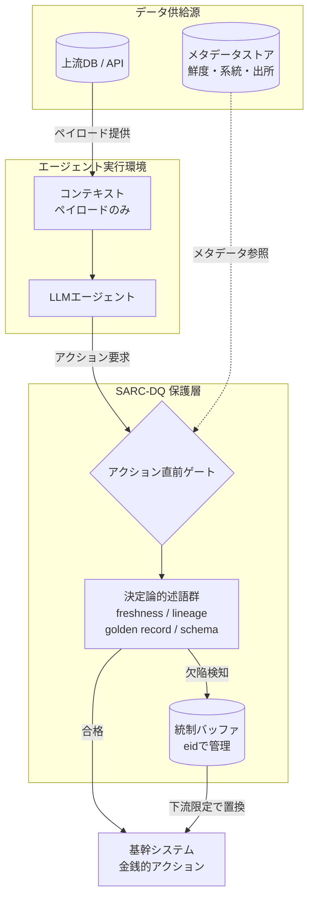

AIエージェントに実行権限を渡すと、間違いはテキストではなく**発注・更新・支払い**として現れます。このとき効いてくるのは、モデルの賢さではなく「どこで止めるか」という配置の設計です。

本記事では、arXivに投稿された論文 *SARC-DQ: Runtime Data-Quality Gating for Agentic AI*（arXiv:2607.26313）を読み解き、次の3点を持ち帰れる形で整理します。

- 書式は正しいのに壊れているデータが、なぜエージェントを黙って誤らせるのか
- なぜ上位モデルへの乗り換えがこの問題の対策にならないのか
- 実行直前にゲートを置く設計を、自分のRAG／自動化パイプラインへどう落とすか

対象読者は、LLMに「読ませる」だけでなく「実行させる」設計を検討している開発者・アーキテクトです。

## 何が壊れているのか：ペイロードではなくメタデータ

データ品質の議論は、伝統的に**ペイロード（データ本文）**の話でした。型が違う、NULLが入っている、JSONが壊れている。こうした欠陥はパーサやスキーマ検証で落ちるので、少なくとも「気づける」欠陥です。

論文が焦点を当てるのは、そこではありません。

- 120日前の単価。書式は正しく、桁も妥当
- 更新済みで失効した旧マスターレコード。構造は完全に有効

これらは論文で**メタデータ起因の欠陥（Metadata-borne Defects）**と呼ばれます。欠陥が宿るのは本文ではなく、鮮度（freshness）・系統（lineage）・出所（provenance）・バージョン（version）といった**データに付随する事実**の側です。

ここに厄介さがあります。LLMのコンテキストには通常、値そのものしか入りません。「この単価がいつ時点のものか」がコンテキストに存在しなければ、モデルはそれを**疑う手がかりを構造的に持てない**のです。論文の実験では、この状況でエージェントが明示的なデータ品質フラグを立てた割合は **0%** でした。疑わなかったのではなく、疑う材料がなかった、と読むのが正確です。

結果として起きるのが**サイレント転換（Silent Conversion）**です。エラーも警告も出さず、正常系のフローのまま、誤った金額・誤った数量でアクションが実行されます。

## 賢いモデルに替えても直らない

直感的には「より推論能力の高いモデルなら気づくのでは」と考えたくなります。論文はここを正面から潰しにいきます。

推論単価で約15倍の開きがある4階層のモデル（Haiku 4.5 → Sonnet 5 → Opus 4.8 → Fable 5）を同一ベンチマークにかけたところ、メタデータ欠陥に起因する**行動欠陥率（ADR: Action Defect Rate）は60%から62%**へと、ほぼ横ばいでした。疑念を示す行動マーカーの識別性能も **AUC ≤ 0.50**、つまり偶然と区別がつきません。

さらに直感に反するのが、論文が**無能の盾（The Incompetence Shield）**と呼ぶ現象です。

- 入力に忠実に従う能力（決定弾力性 Decision Elasticity）が高いモデルほど、汚染データを忠実に信じて誤ったアクションを実行し、損失を出す
- 逆に、そもそも入力データをあまり参照しないエージェント（Decision Elasticity 0.000）は、**偶然にも**汚染の影響を受けない

つまり「壊れにくく見えた」のは、指示追従性が低いことの副作用にすぎません。能力を上げることはこの文脈では防壁にならず、むしろ欠陥データを忠実に実行に変換する効率を高めます。

この結果を、論文は「データ品質検証は**知能（Intelligence）**の問題ではなく**配置（Placement）**の問題である」とまとめています。プロンプトを工夫する、上位モデルに替える、という対策の方向自体がずれている、という主張です。

## 解決策の置き場所：アクション直前ゲート

SARC-DQの中身は、アーキテクチャとしてはむしろ地味です。エージェントがアクション（API呼び出しやDB更新）を発行する**直前**に、決定論的なデータ品質述語を評価するゲートを1枚挟む。それだけです。

欠陥を検知したときの振る舞いが特徴的で、**Quarantine-and-Substitute（隔離と置換）**を取ります。コンテンツアドレス（eid）で管理された**統制バッファ（Governed Buffer）**から既知の正しいデータを引き、**下流でのみ**差し替える。上流のソースDBへの書き込みはゼロです（論文のProposition 1）。

上流を書き換えないことには実務上の意味があります。レガシーDBや他部門所有のシステムを直せない状況でも、実行側だけで安全側に倒せる。かつ、上流の履歴を汚さないので lineage の保証が崩れません。

図の要点は、**メタデータがモデルではなくゲートに流れ込んでいる**ことです。モデルに疑わせるのではなく、モデルの外側で機械的に判定します。

### 述語と応答プロトコル

論文が定義する主要な述語と、違反時のレスポンスは次のとおりです。

| 述語 | 検証内容 | 判定基準 | 違反時のレスポンス |
|---|---|---|---|
| `freshness(max_age)` | 経過時間（鮮度） | `current_time - record_timestamp <= max_age` | Quarantine & Substitute |
| `lineage_present` | 出所・追跡可能性 | 祖先ノードID / eid の存在 | Block / Escalate |
| `golden_record_unique` | マスターの単一性 | 重複する現行レコードの不在 | Quarantine & Substitute |
| `cross_source_consistent(tol)` | 複数ソース間の整合 | 許容誤差 `tol` 以内 | Degrade Autonomy（人間確認へ昇格） |
| `schema_conformant` | スキーマ適合 | 必須フィールド・型の合致 | Block |
| `complete(required)` | 業務上の必須項目充足 | 必須属性の非ヌル評価 | Quarantine & Substitute |

注目したいのは、レスポンスが「止める」だけではない点です。置換で自動回復させる、自律度を落として人間に上げる、完全に止める、と**欠陥の性質ごとに出口が分かれています**。すべてを人間確認に上げると運用が回らないため、この階層化は実装上も重要です。

## 検証結果を素直に読む

論文は GIGO-Bench という決定論的ベンチマーク（在庫補充の Newsvendor タスク）で、8種類の汚染クラス・4段階の汚染率（2%, 5%, 10%, 20%）・6つの緩和アームを比較しています。結果は都合よく揃っておらず、そこが読みどころです。

**H1（Silence）: 支持。** メタデータ欠陥の注入下で、エージェントは60%の割合でサイレントに誤った発注を実行し、直接的な金銭損失を出しました。モデル階層を上げてもADRは60%→62%と変わりません。

**H2（検出の非対称性）: 再定義。** 当初は「ペイロード可視の欠陥はLLM Criticで検知でき、メタデータ起因の欠陥はゲートでしか検知できない」という二項対立を想定していました。実験はこれを崩します。

- `schema_drift` はペイロード上の欠陥だが、LLM Criticの検知率は **0%**、決定論的スキーマ述語は **100%** 捕捉
- `superseded_golden_record` はメタデータ欠陥だが、旧レコードと新レコードを同時に提示するとペイロード上の矛盾が生じ、LLM Criticでも **100%** 検知可能

結論として、検出可能性は欠陥の分類ではなく、**「見せた表現（Representation）／利用可能な同伴エビデンス（Companion Evidence）／実装された述語（Predicates）」の三つ組**で決まる、と再定義されています。実務的には「何を一緒に見せるか」を設計変数として握れる、ということです。

**H3（ゲートの優位）: 事実としては優位。** 現実的なペイロードのみのCritic（Arm C）に対し、アクション直前ゲート（Arm D）は検出率 **62% vs 31%**、残留損失 **294 vs 311** と明確に上回りました。

**H4（下流修復だけで十分か）: 仮説通りとしては非支持。** ポートフォリオ全体の回復率は **-0.04** にとどまり、目標の 0.80 に届いていません。ただし内訳を見ると評価が変わります。

- 述語がカバーする鮮度欠陥（`stale_master_data`）では、未ガード時の損失 134 に対しガード時 **-0.5**（ノイズ範囲内、実質的に損失ゼロへ回復）
- 一方、述語が実装されていない単位不一致（`silent_unit_change`）が**損害の83%**を占め、全体の回復率を引き下げた

つまりゲートは「効く範囲では完全に効き、述語がない範囲では何もしない」という、極めて素直な挙動をします。全体スコアの悪さは手法の弱さではなく、**述語カバレッジの不足**を測っている、と読むのが妥当です。

## 限界を先に押さえる

導入を検討するなら、次の3点は前提として置いておく必要があります。

1. **上流の根本修正ではない。** 下流限定修復である以上、上流DBの汚染はそのまま残ります。上流のデータガバナンスとは代替ではなく補完の関係です。
2. **述語がない欠陥には無力。** 単位不一致（`silent_unit_change`）や業務上ありうる外れ値（`plausible_outlier`）のように述語未定義の欠陥に対しては、検出率 0% です。ゲートの価値は述語の設計品質にそのまま比例します。
3. **信頼できるメタデータが前提。** タイムスタンプやバージョンが正しく付与されていることが条件です。メタデータ自体が欠落・改ざんされている場合、ゲートは機能しません。

3点目は特に重要で、「メタデータを整備できていない環境では、まずそこから」という順序を意味します。

## 自分のパイプラインへどう落とすか

この論文が有用なのは、示唆が抽象論に留まらず**配置の話**だからです。既存のRAGや自動化パイプラインに、次の形で移植できます。

### RAGの評価軸を「回答精度」から「証拠品質」へ

RAGの評価は長く「生成された回答が正確か」に寄っていました。しかし金銭やシステム更新を伴うエージェントでは、問うべきは**その検索結果がアクション実行を許可できるだけの証拠品質（Evidence Quality）を備えているか**です。

- 取得したチャンクの最終更新日を述語で判定し、`max_age` を超えたら生成前に落とす
- コサイン類似度上位1件を鵜呑みにせず、複数ソース間の整合性を実行前に確認する

類似度は「関連しているか」しか測りません。「まだ有効か」は別の述語で測る必要があります。

### 上流を直せない環境での下流分岐

レガシーDBや他部門システムが上流にある場合、Governed Buffer パターンが効きます。検証済みのゴールデンレコードをローカルにキャッシュしておき、古いレコードを検出したら自動で差し替える。差し替えられない不確実性が残る場合は、アクションを止めて通知チャネル経由で人間に上げる（Degrade Autonomy）。

### 自動投稿・自動実行への Pre-Action Gate

自分の運用で言えば、記事の自動投稿やSNS予約投稿にも同じ形が使えます。投稿を発行する直前に、重複チェック・参照URLの生存確認・生成日時の鮮度チェックを決定論的なステップとして挟む。LLMに「おかしくないか確認して」と頼むのではなく、**機械的に判定できるものは機械で判定し、判定できないものだけ人間に上げる**という切り分けです。

述語は最初から網羅する必要はありません。H4の結果が示すとおり、**損害の大きい欠陥クラスから順に述語を足していく**のが費用対効果の高い進め方です。

## まとめ

- 最も危険なデータ欠陥は、書式は正しくメタデータだけが壊れているもの。エージェントは疑う手がかりを持てず、黙って誤ったアクションを実行する
- 推論単価で約15倍離れた4階層のモデルを比べても、行動欠陥率は60%→62%とほぼ変化しない。指示追従性が高いモデルほど汚染データを忠実に実行する
- 対策は上位モデルへの乗り換えでもプロンプト調整でもなく、アクション直前に決定論的述語を置くという配置の設計
- 効果は述語カバレッジに比例する。カバーされた鮮度欠陥では損失をほぼゼロまで回復した一方、述語未定義の欠陥は損害の83%を占めた
- 移植先はRAGの証拠品質チェック、上流を直せない環境での Governed Buffer、自動実行フローの実行前チェック

「エージェントに実行させる」設計をするなら、賢さに賭ける前に、止める場所を1枚決めておく。それがこの論文の実務的な結論です。

この記事が少しでも参考になった、あるいは改善点などがあれば、ぜひリアクションやコメント、SNSでのシェアをいただけると励みになります！

## 参考リンク

- Besanson, G. (2026). *SARC-DQ: Runtime Data-Quality Gating for Agentic AI: Silent Evidence Defects, the Incompetence Shield, and Downstream-Only Remediation*. arXiv:2607.26313 [cs.SE]. https://arxiv.org/abs/2607.26313
- HTML版: https://arxiv.org/html/2607.26313
- 公式実装リポジトリ: https://github.com/besanson/dqSarc
- AgentSpec: *Customizable Runtime Enforcement for Safe and Reliable LLM Agents*. arXiv:2503.18666. https://arxiv.org/abs/2503.18666
- MI9: *Agent Intelligence Protocol: Runtime Governance for Agentic AI Systems*. arXiv:2508.03858. https://arxiv.org/abs/2508.03858
- ISO/IEC 5259 series (2024), *Artificial intelligence — Data quality for analytics and machine learning*（出典名のみ）
- ISO 8000, *Data quality*（出典名のみ）
