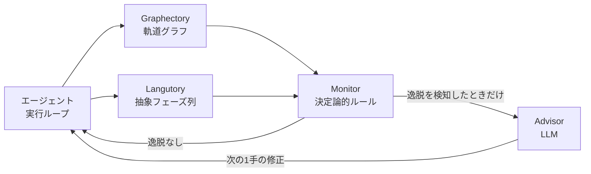

コーディングエージェントを長時間走らせると、同じコマンドを繰り返す、エラー対処のループから抜けられない、テストを飛ばしてパッチを出す、といった詰まり方をします。この記事では、2026年8月公開の論文「Online Monitoring and Corrective Steering of Programming Agents（LivePlan）」を題材に、**エージェントの実行中監視と介入をどう設計するか**を整理します。

読み終えると、次の3点が持ち帰れます。

- 「詰まっている」を、時間やトークン量ではなく**行動構造**で判定する方法
- 逸脱を検知したあと、**再計画ではなく次の1手だけ**を直す介入の組み立て方
- 監視・介入が**逆効果になる条件**と、その測り方

対象読者は、自作ハーネスやエージェントフレームワークの上でコーディングエージェントを運用している方です。

*この記事の全体像。以下、順に解説します。*

## なぜ監視をLLMに任せると壊れるのか

これまでの主流は、LLM-as-a-judge 型でした。SAGE や SWE-PRM のように、LLMが軌道を眺めて「逸脱しているか」を判定し、同時に「どう直すか」も助言します。判定と助言が同じモデルの同じ呼び出しに同居している構造です。

ここに副作用があります。LLMは「問題を指摘してください」とプロンプトされると、**問題がないときでも問題を作り出す**傾向を持ちます。順調に進んでいる探索に対して「まだ足りない、続けよ」と誤った助言が入り、正しい手順が壊れます。

LivePlan が置いた前提は、この非対称性です。

> 逸脱の**判定**は決定論的ルールに任せ、**助言**だけをLLMに任せる。

判定は再現性が要る仕事なので、コードで書けるならコードで書く。助言は自由度が要る仕事なので、LLMに渡す。役割を分けたうえで、**逸脱が検知されたときにのみ**LLMを呼びます。定期的にLLMへ様子を見せに行く設計とは、呼び出しの条件がまったく違います。

## 監視の土台: 軌道を2つの表現に落とす

決定論的に判定するには、エージェントの実行履歴を機械が読める形に落とす必要があります。LivePlan は2つの表現を併用します。

| 表現 | 何を保持するか | 何を検知できるか |
|---|---|---|
| Graphectory（軌道グラフ） | ツール呼び出し・状態遷移をノードとエッジで保持 | 同一操作の反復、思考と行動の振動 |
| Langutory（抽象フェーズ列） | 実行を抽象フェーズの系列として保持 | 特定フェーズの長期停滞、必須フェーズのスキップ |

グラフは「同じところをぐるぐる回っていないか」を見るのに向き、フェーズ列は「あるべき手順を踏んでいるか」を見るのに向きます。粒度の違う2つを持つのが要点です。

図の要点は、**Advisor へ向かう矢印に条件が付いている**ことです。逸脱がなければLLMは呼ばれず、エージェントはそのまま進みます。

## 検知する4つの逸脱シグナル

Monitor が見るシグナルは4つです。いずれも表層メトリクスではなく、行動の形に対する判定になっています。

1. **Repeated Action（同一操作反復）** — Graphectory の後退エッジ。同じコマンドや実りのない検索を繰り返している状態。
2. **Thought / Action Oscillation（思考・行動の振動）** — Graphectory の自己ループや閉路。特定のエラー対処を無限に往復している状態。
3. **Long Stagnation（長期停滞）** — Langutory で、同一フェーズ（例: バグ箇所の特定）が閾値を超えて継続している状態。論文では7ステップ連続が例として挙げられています。
4. **Plan Violation（計画違反）** — 必須フェーズ（例: パッチ提出前の回帰テスト検証）をスキップしようとしている状態。

自作ハーネスに落とすときの実装イメージは次のとおりです。1〜2はグラフの閉路検出、3はステートマシンのタイムアウト、4は状態遷移の事前条件チェックとして書けます。いずれもLLMを呼ばずに判定できます。

## 介入は「次の1手」だけを直す

逸脱を検知したあと、何をどこまで直すか。LivePlan は選択肢を明確に切っています。

| 方針 | 採否 | 理由 |
|---|---|---|
| 全体計画の再生成（Re-planning） | 採らない | コストが高く、誤った前提で作り直すと回復不能になる |
| 初期状態からの再起動 | 採らない | それまでの探索成果を捨てる |
| 次の1手の修正（Next-step correction） | 採る | 直近コンテキストだけで判断でき、段階的に軌道を戻せる |

Advisor に渡す入力も、全履歴ではなく「直近のコンテキスト + Monitor が出した逸脱ステータス」に絞られます。出力は「今すぐ取るべき行動」だけです。改善が確認された事例では、1回の実行あたり平均3.70回の介入が行われました。少数の大きな修正ではなく、小さな修正を重ねる設計です。

### ブロッキングと非ブロッキングを分ける

すべての逸脱を同じ強さで止める必要はありません。LivePlan は2段階に分けます。

- **ブロッキング**（計画違反など） — 実行を阻止する。上限は最大5回。
- **非ブロッキング**（探索の長期化など） — 進行は許可し、助言だけを付与する。

停滞は「進んでいるが遅い」だけかもしれないので止めない。手順違反は結果の正しさに直結するので止める。この線引きが、探索の自由度と軌道修正を両立させています。上限を設けているのは、介入が繰り返し無視される状況で無限に粘らないためのフォールバックです。

## 監視は常に有益ではない: 3つの反証

ここが実運用でいちばん効く部分です。論文は監視・介入の副作用も分析しています。

### 誤判定が正しい探索を壊す

比較対象として置かれた Periodic Advisor（5ステップごとに定期的にLLMが監視する方式）では、エージェントがバグ箇所を正しく特定し終えた直後に、LLMが「まだ特定できていないので探索を続けよ」と誤助言し、正しいパッチ作成を阻害する事例が確認されました。

定期監視は「呼ばれた以上、何か言わなければならない」構造になりやすい。**呼び出し条件を逸脱検知に限定すること自体が、この失敗モードへの防御**になっています。

### 正しい助言が無視される

LivePlan が正確な修正助言（例:「変数XとYの両方を修正せよ」）を与えたのに、エージェント自身が誤った推論をして、一度適用した修正を Revert してしまうケースが存在します。

推論時の介入だけでは限界があるということです。論文はここから、**介入指示に忠実に従うようエージェントを Post-training する必要性**を指摘しています。ハーネス側の設計だけで解ける問題ではない、という留保として受け取るのが妥当です。

### 「良い逸脱」がある

介入によって、事前計画への厳密な準拠（Plan Phase Fidelity）が下がるケースもあります。ただしこれは、Advisor が「元の計画にはないが有用な回帰テスト」を追加提案した結果でした。

計画どおりに進むことが常に最適解ではない、という含意です。**計画準拠率を監視の成功指標にしてはいけない**という実務的な警告として読めます。見るべきは、最終的に課題が解けたかどうかです。

## 自作ハーネスへの落とし込み

以上を、手を動かす順に整理します。

1. **行動履歴を構造として保持する**
   実行ループの中に、ツール呼び出しとフェーズ遷移をグラフまたは配列で持つ軽量なレイヤを挟みます。まずは記録するだけでよく、判定は後から足せます。

2. **閾値をハードコードして、そこだけでLLMを呼ぶ**
   「同一フェーズの連続滞在数」「同一コマンドのエラー反復回数」を定数として置き、超えたときにだけリカバリ専用のLLM呼び出しを行います。定期呼び出しにはしません。

3. **止める逸脱と、助言だけの逸脱を分ける**
   結果の正しさに直結する手順違反はブロッキング、進捗の遅さは非ブロッキングに割り当て、ブロッキングには回数上限を設けます。

4. **既存の成功例を壊していないかを測る**
   新しい介入ロジックを入れたら、SWE-bench などの一部を使い、**それまで解けていた課題が解けなくなっていないか（R→U の発生率）** を必ず測定します。全体の成功率が上がっていても、内訳で退行が起きていることがあります。

4番目が最も見落とされやすい手順です。監視機構は「悪くなった場合を減らす」ために入れるので、良くなった件数だけを見ると、自分で作った退行に気づけません。

## まとめ

- LLM-as-a-judge 型の監視は、**問題を指摘するよう促されると問題を作り出す**という失敗モードを持つ。
- LivePlan は**判定を決定論的ルール、助言をLLM**に分離し、逸脱検知時にだけLLMを呼ぶ。
- 判定材料は軌道グラフ（反復・振動）と抽象フェーズ列（停滞・計画違反）の2表現。
- 介入は再計画や再起動ではなく**次の1手の修正**。手順違反はブロッキング、遅さは非ブロッキングに分ける。
- 監視には副作用がある。**計画準拠率を成功指標にせず、既存の成功例が壊れていないか（R→U）を必ず測る**。

自作ハーネスであれば、まずは「行動履歴を構造として持つ」ところから始められます。判定ルールも介入もその上に後から足せるので、記録レイヤの追加が最も費用対効果の高い一歩になります。

この記事が少しでも参考になった、あるいは改善点などがあれば、ぜひリアクションやコメント、SNSでのシェアをいただけると励みになります！

## 引用文献

- Shuyang Liu, et al. "Online Monitoring and Corrective Steering of Programming Agents", arXiv:2608.06701 (August 2026). https://arxiv.org/abs/2608.06701
