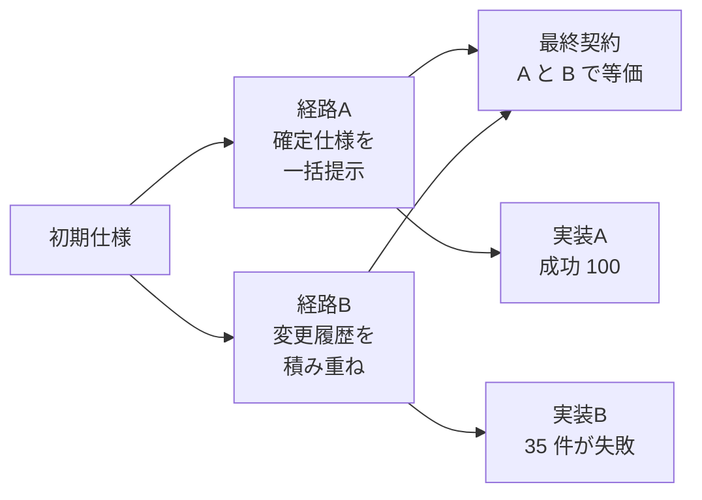
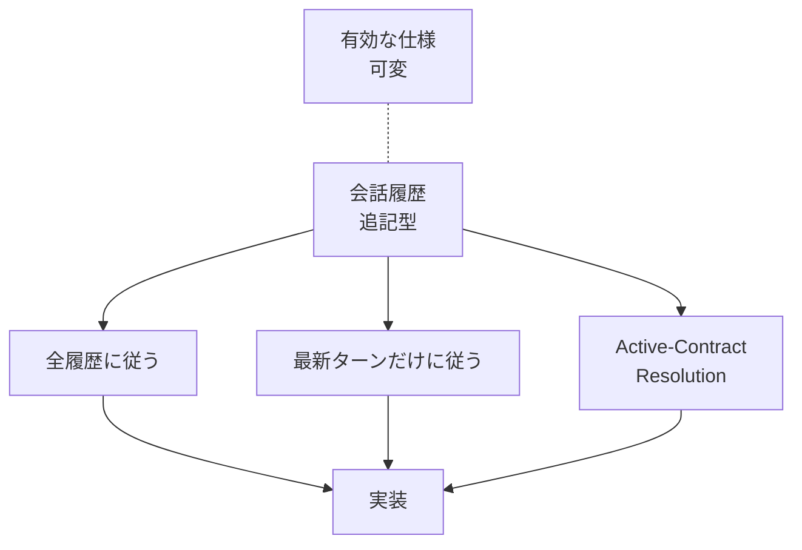
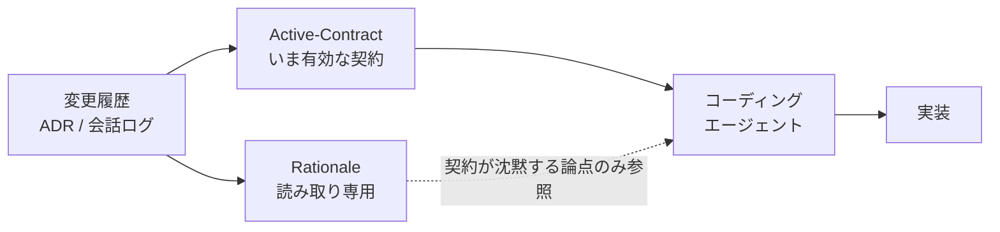

コーディングエージェントに要件を渡すとき、私たちは暗黙にひとつの前提を置いています。「最終的に何を作るかが同じなら、そこに至る説明の順番が違っても、出てくるものは同じはずだ」という前提です。

arXiv に投稿された論文 [SpecPath: Testing Coding Agents Across Contract-Equivalent Specification Histories](https://arxiv.org/abs/2608.09799) は、この前提が成り立たないことを示しています。最終仕様（契約）が等価でも、そこに至る要件変更の履歴が違うと、エージェントの実装結果が変わる。論文はこれを**仕様経路感度（specification-path sensitivity）**と呼びます。

この記事では、その現象と失敗の構造を整理したうえで、ADR や要件変更履歴を AI にどう渡すかという文書設計の観点で、実務に落とせる対策までをまとめます。対象読者は、AI エージェントに開発を任せる側で、要件やアーキテクチャ決定の記録の持ち方を設計する立場の方です。


*この記事の全体像。以下、順に解説します。*

## 仕様経路感度とは何か

同じ最終仕様を、2 通りの渡し方でエージェントに与えたとします。

- **経路 A**: 完成した仕様を、最初から確定形で一度に渡す
- **経路 B**: 初期仕様を渡し、その後「あの要件は取り下げ」「この条件は差し替え」といった変更を会話で積み重ね、最終的に A と同じ契約に到達する

契約としては A と B は等価です。にもかかわらず、結果は一致しません。

論文の検証では、**経路 A（直接的な仕様定義）で完全に成功した 100 の実装ブロックのうち、35 件が、契約は等価だが履歴の経路が異なる条件（等価な履歴）で失敗しました**（[arXiv:2608.09799](https://arxiv.org/abs/2608.09799)）。



ここが厄介なのは、**契約を見比べても差が説明できない**点です。レビュー時に「仕様書どおりか」だけを確認しても、この失敗は検出できません。差は仕様の内容ではなく、仕様に至る経路に宿っています。

そして実務でエージェントに渡されるのは、ほぼ常に経路 B です。要件は会話とチケットとコミットの積み重ねとして手渡され、確定形で一括提示されることはまれだからです。

## つまずきやすい 3 つの変更パターン

論文は、エージェントが躓きやすい変更履歴の型として、次の 3 つを特定しています。

| パターン | 内容 | 典型的な失敗 |
|---|---|---|
| 廃止要件（Cancellation / Retraction） | 一度出した要件を、後から取り下げる | 取り下げたはずの要件が実装に残る |
| 上書き要件（Override / Replacement） | 既存の要件を別の要件で置き換える | 旧要件と新要件の両方を満たそうとして矛盾する |
| 例外追加（Split / Added Conditions） | 全体に適用していた規則に、後から例外条件を足す | 例外を全体規則として適用する、または例外を無視する |

3 つに共通するのは、**後の発話が前の発話の効力を打ち消す、または限定する**という構造です。会話ログは時系列に並んだテキストにすぎないので、その打ち消し関係はテキスト上に明示されません。読み手が推論して初めて成立します。

たとえば、こうした履歴です。

```text
turn 1: 削除 API は論理削除とする。deleted_at を立てる。
turn 5: 監査要件が外れたので、論理削除はやめて物理削除でよい。
turn 9: ただし、支払い済み注文だけは履歴を残す必要がある。
```

最終契約は「原則は物理削除、支払い済み注文のみ論理削除」の 1 行です。しかし履歴をそのまま渡すと、turn 1 の `deleted_at` が全テーブルに残ったり、turn 9 の例外が全件に適用されたりします。これが上書きと例外追加の複合ケースです。

## なぜ失敗するのか: 追記型の記録と可変な仕様のズレ

失敗の構造は、記録の性質と対象の性質のミスマッチとして説明できます。

- **プロンプトや会話の履歴は「追記型（append-only）」**です。過去の発話は上書きされず、そのまま残り続けます。
- **一方、要件（仕様）そのものは「可変（mutable）」**です。取り下げ、差し替え、限定によって、有効な内容が時々刻々と書き換わります。

追記型の記録の上に、可変な状態が乗っている。エージェントが読むのは記録のほうなので、記録から現在の状態を復元する作業が必ず挟まります。

このとき、単純な方策はどちらも破綻します。

- **すべての履歴をそのまま記憶して従う**: 取り下げ済みの要件にも従おうとし、矛盾する実装になる
- **最新のターンの指示だけに盲目的に従う**: 直近で言及されなかった有効な要件が落ちる



論文が求めるのは、実装に着手する前段に**Active-Contract Resolution（現在有効な契約の再構成）**を明示的に置くことです。履歴全体から「いま有効な義務・制約のセット」を推論し、正規化してから実装に入る。この工程を暗黙にエージェント任せにしている限り、経路の違いが結果の違いとして漏れ出します。

## 素朴な対策の落とし穴: 再構成による背景理由の喪失

ここまで読むと「では履歴は渡さず、再構成した最新仕様だけ渡せばよい」と結論したくなります。しかし、この対策には副作用があります。

要件履歴を「最新の有効な仕様」だけに要約・再構成すると、**変更に至った背景理由（rationale）や暗黙的制約が落ちます**。要約による損失（lossy compression / summarization bias）です。

先の例で言えば、再構成後の契約は「原則は物理削除、支払い済み注文のみ論理削除」です。ここからは、次の情報が消えています。

- なぜ論理削除をやめたのか（監査要件が外れたから）
- なぜ支払い済みだけ例外なのか（履歴保持の必要があるから）

この情報が無いと、エージェントは判断のよりどころを失います。実装中に契約が触れていない論点に出会ったとき——たとえば「返金済みの注文はどちらか」——背景理由があれば履歴保持の必要性から推論できますが、契約だけでは推論できません。結果として、意図に反した実装に倒れます。

つまり、次のトレードオフが立ちます。

| 渡し方 | 得られるもの | 失うもの |
|---|---|---|
| 履歴をそのまま渡す | 背景理由・暗黙的制約 | 現在有効な契約の一意性（＝仕様経路感度に晒される） |
| 再構成した契約だけ渡す | 契約の一意性 | 背景理由・暗黙的制約（＝要約による損失） |

なお、論文が報告する失敗率をモデルの推論能力の向上がどこまで打ち消すかは、この記事の時点で検証できていない論点です。履歴の依存関係を段階的に解きほぐす推論を挟めば経路感度は下がる、という見方はありますが、特定のモデル世代で解消済みと断定できる根拠は確認できませんでした。**モデルの改善に賭けるのではなく、文書構造の側で経路感度を減らす設計を採る**のが、現時点で取れる確実な手です。

## 現場での設計: ハイブリッドコンテキスト

トレードオフの両側を避けるには、どちらか一方を選ぶのではなく、**役割を分けて両方を持たせる**構成にします。

- **主コンテキスト**: 着手前に Active-Contract を明示的に再構成させる。実装が従うべき規範はこれ一つに絞る
- **参照サブコンテキスト**: 変更の経緯（rationale）を読み取り専用として保持する。契約が触れていない論点に出会ったときだけ参照させる



重要なのは、**この 2 つを対等に扱わない**ことです。rationale を規範として渡すと、取り下げ済み要件が復活して仕様経路感度に戻ります。あくまで「契約が沈黙している論点についてのみ参照する背景資料」という位置づけを、プロンプト上で明示します。

ADR（Architecture Decision Records）の文書構造は、この分離と相性がよい形をしています。ADR は 1 決定 1 ファイルで、Status（Proposed / Accepted / Superseded / Deprecated）と Context と Decision を分けて持つためです。

- **Status が Superseded / Deprecated の ADR** は、Active-Contract の構成から外す
- **Context（決定の背景）** は rationale サブコンテキストへ回す
- **Accepted な ADR の Decision だけ** を集めて Active-Contract を組む

この対応づけを機械的に行えるよう ADR の Status を維持しておくと、Active-Contract Resolution の大部分がテキスト処理として決定的に実行できます。エージェントの推論に委ねる範囲が狭いほど、経路感度の影響も小さくなります。

## 履歴バリエーションを回帰テストにする

もう一つの実践は、仕様経路感度そのものをテスト対象にすることです。

論文が特定した 3 パターン（廃止・上書き・例外追加）は、**意図的に作れる**変更履歴です。ひとつの最終契約に対して、そこへ至る履歴のバリエーションを複数用意し、どの経路でも同じ実装に着地するかを確認します。

具体的な組み方は次のとおりです。

1. **基準となる最終契約を 1 つ決める**。小さくてよい（削除の扱い、認可の条件など、判定可能な粒度）
2. **その契約に到達する履歴を 4 通り用意する**
   - 直接提示（確定形を一括で渡す。これが基準結果）
   - 廃止パターン（余分な要件を先に出し、後で取り下げる）
   - 上書きパターン（別の要件を先に出し、後で差し替える）
   - 例外追加パターン（全体規則を先に出し、後で例外を足す）
3. **4 通りすべてを実行し、実装が契約を満たすかを同一のアサーションで判定する**
4. **経路ごとの合否を記録する**

このスイートは、プロンプトを改修したときやモデルを切り替えたときの回帰テストとして機能します。「直接提示では通るが、上書きパターンだけ落ちる」といった形で、経路感度の残存が可視化されるためです。

計測の単位は、成功率そのものより**経路間の一致率**に置くのが有効です。基準結果と各経路の結果が一致するかを見れば、契約の難しさとは切り分けて、経路感度だけを取り出せます。

## まとめ

- 最終仕様が等価でも、そこに至る変更履歴の経路が違うと、コーディングエージェントの実装結果は変わる（仕様経路感度）。論文の検証では、直接提示で成功した 100 ブロックのうち 35 件が、等価な履歴の条件で失敗した
- つまずきやすいのは、廃止要件・上書き要件・例外追加の 3 パターン。いずれも「後の発話が前の発話の効力を打ち消す」構造を持ち、その関係はテキスト上に明示されない
- 原因は、追記型の会話履歴と可変な仕様のミスマッチ。全履歴に従うことも、最新ターンだけに従うことも、どちらも破綻する
- 対策の中心は、実装着手前の Active-Contract Resolution。ただし契約だけに要約すると背景理由（rationale）が落ち、契約が沈黙する論点で意図に反した実装を招く
- 実務解は、規範としての Active-Contract と、読み取り専用の rationale を分けて持つハイブリッド構成。ADR の Status と Context の分離がこの設計に対応する
- 3 パターンの履歴バリエーションを作り、経路間の一致率を回帰テストとして計測すると、プロンプト改修やモデル切り替え時に経路感度の残存を検出できる

この記事が少しでも参考になった、あるいは改善点などがあれば、ぜひリアクションやコメント、SNSでのシェアをいただけると励みになります！

## 参考リンク

- [SpecPath: Testing Coding Agents Across Contract-Equivalent Specification Histories (arXiv:2608.09799)](https://arxiv.org/abs/2608.09799)
