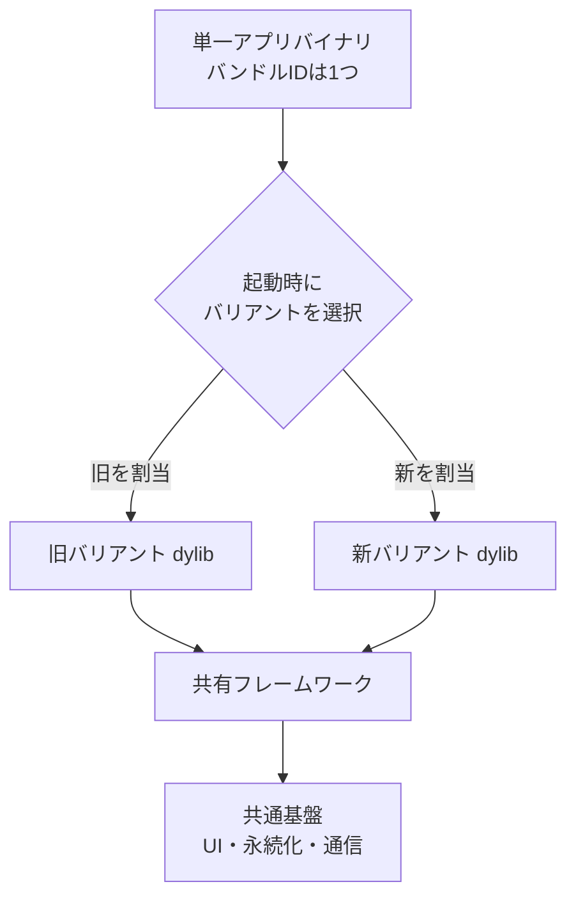

モバイルアプリを全面的に作り直すとき、いちばん難しいのは「書き直すこと」ではなく「**書き直したものへ、ユーザーを失わずに乗り換えること**」です。

Web であれば Strangler Fig パターン（既存システムを部分ごとに新実装へ置き換え、最後に旧実装を絞め殺す移行手法）でルーティング層から少しずつ切り替えられます。しかしモバイルアプリはストアで配信される単一のバイナリで、ユーザーの端末に「デプロイ」できるのは月に数回です。前段のプロキシで振り分ける、という手が使えません。

この記事では、arXiv に公開された [Mobile App Rewrites via Dual Boot](https://arxiv.org/abs/2608.15135) で報告されている **Dual Boot（デュアルブート）** という構成を扱います。新旧2つの実装をそれぞれ動的ライブラリ（dylib）としてコンパイルし、**1つのアプリバイナリに同梱して起動時に選ぶ**という方法です。この事例では、これによって約10か月の段階移行と A/B テストを完了し、最後に旧実装をビルド構成から丸ごと削除しています。

読み終えると、次の3点が判断できるようになります。

- Dual Boot が解いている問題は何で、既存のやり方と何が違うのか
- 自分たちのアプリと組織で採用してよいか、避けるべきか
- 採用した場合に必ず向き合うことになるコスト（バイナリサイズ・起動時間・ビルド保守）

*この記事の全体像。以下、順に解説します。*

## モバイル刷新で選べる手段は、これまで2つしかなかった

大規模刷新の進め方は、実務上ほぼ次の2択でした。

**1. 別アプリとして新規リリースする**

新しいバンドル ID で作り直し、旧アプリのユーザーを誘導します。コードは綺麗に始められますが、**インストールベース・ストアのレビュー・ランキング・課金の紐付けをすべて捨てる**ことになります。移行のたびに再獲得のコストが発生し、離脱が読めません。

**2. 同一バイナリ内でフィーチャーフラグ分岐する**

既存アプリの中に新実装を足し、フラグで画面ごとに切り替えます。ユーザーは維持できますが、**共有基盤の至るところに条件分岐が散らばります**。そして厄介なのは終盤です。旧実装を消そうとしたとき、「このユーティリティは旧側しか使っていないか」を人手で追う羽目になり、結局消し切れずに残ります。

Dual Boot は、この2つの良いところ、つまり「**ユーザーは維持する**」と「**コードは分離しておく**」を同時に取ろうとする構成です。

## Dual Boot の構造

分離の単位を、コード中の `if` ではなく**コンパイル単位（動的ライブラリ）**に置きます。

動きは次のとおりです。

1. ビルド時に、旧実装と新実装を**別々の dylib としてコンパイル**し、1つのアプリバイナリへ同梱する
2. プロセス起動時（`main`）に実験プラットフォームの割り当てを読む
3. 割り当てられた側の dylib だけをロードし、以降はその実装が動く

ユーザーから見えるのは今までと同じ1つのアプリです。バンドル ID も、レビューも、インストール実績もそのまま残ります。一方でコードから見ると、新旧はビルドの段階で完全に別世界になっています。

**分岐が存在するのはエントリポイントの一箇所だけ**、という点がこの構成の核心です。

## 分離をコンパイル単位に置くと、何が変わるか

### 移行のための条件分岐が散らばらない

フィーチャーフラグ方式では、分岐は書いた場所すべてに残ります。Dual Boot では新旧が別のコンパイル単位なので、**それぞれのコードは相手の存在を知りません**。新実装側のコードには「旧ではこうだった」という記述が一切入らず、書き手は新しい設計に集中できます。

### 新旧のバイナリサイズを別々に測れる

コンパイル単位が分かれているため、「新実装にしたらアプリはどれだけ太るのか / 痩せるのか」を移行中に正確に計測できます。フラグ方式ではコードが一体化するため、この切り分けができません。

### 旧実装の廃止が「削除」で完了する

これが実務上いちばん効きます。旧バリアントをやめるとき、やることは**その dylib をビルド設定から外すことだけ**です。旧側しか参照していなかったライブラリやコードは、依存関係をたどられなくなるので確実にバイナリから消えます。

フラグ方式の「消し漏れが積み上がって、次の刷新のときの負債になる」という定番の失敗が、構造的に起きません。報告ではこれを **Deprecation as Deletion（廃止＝削除）** と呼んでいます。

### 段階ロールアウトとホールドアウトが使える

新旧の割り当ては起動時の実験設定なので、1% → 10% → 100% のような段階展開ができます。さらに、**恒久的なホールドアウト群（旧のまま据え置く一定割合のユーザー）**を残せるため、「刷新したことで指標がどう動いたか」を因果として測定できます。別アプリ方式では、そもそも比較対象が揃いません。

## 3つの手法の比較

| 評価軸 | 別アプリ新規リリース | 同一バイナリ内フラグ分岐 | Dual Boot |
| :--- | :--- | :--- | :--- |
| ユーザー獲得・リテンション | 再獲得が必要、離脱リスク大 | 既存維持 | 既存維持 |
| ソースコードの汚染 | 発生しない | 共有基盤に条件分岐が散乱 | エントリポイントのみ |
| 旧版廃止時のコード削除 | 容易（アプリ丸ごと廃棄） | 共有依存の精査とリファクタが必要 | 容易（dylib をビルドから外すだけ） |
| 移行中のバイナリサイズ | 分散（各アプリは軽量） | 一体化して増加、後処理が困難 | 一時的に2〜3倍、削除は確実 |

見てのとおり、Dual Boot は**移行期間中のバイナリサイズを対価として、他の3軸を取りに行く**トレードオフです。この対価が払えるかどうかが採否の分かれ目になります。

## 実装上の最大の障壁はデッドコード削除

素直に作ると、この構成は動きません。理由は、モバイル OS 向けのツールチェーンが**アグレッシブなデッドコード削除（DCE: Dead-code Elimination）**を行うためです。

起動時に動的に解決されるシンボルは、ビルド時の静的解析からは「誰からも呼ばれていない」ように見えます。結果として、必要なコードがリンカに削られます。

報告されている対処は次の組み合わせです。

- **シンボル解決マップをビルド時に自動生成する** — どのバリアントがどのシンボルを必要とするかを機械的に列挙する
- **保持リスト（retain lists）を生成し、リンカへ渡す** — 削ってはいけないシンボルを明示する
- **実行時は `DylibLoader` を経由して解決する** — 直接リンクせず、ロード層を挟む

つまり、**マップと保持リストを手で書かない**という設計になっています。手書きのリストは新規シンボルの追加に必ず追従し損ねるので、ビルドパイプラインで生成する形にしたのは妥当な判断です。

同時にこれは、標準ツールチェーンから外れた仕組みを自前で持ち続けることを意味します。ここが後述するコストの本体です。

## 採用してよい条件、避けるべき条件

判断軸は、技術というより**組織とアプリの状態**にあります。

**採用してよい条件**

- 既存のインストールベース（ユーザー数・レビュー・ランキング）が大きく、別アプリ移行による離脱が許容できない
- ビルドインフラを専任で見られるチーム（プラットフォームエンジニアリング）を置ける組織規模である
- 刷新の効果を、ホールドアウト群を使って定量的に説明する必要がある

**避けるべき条件**

- ビルドや CI/CD のカスタム運用にリソースを割けない小規模チーム
- 既存バイナリが既に大きく、2倍になるとストアの配信制限を確実に超える

前者はやや意外に見えるかもしれませんが、重要な点です。Dual Boot が支払わせるコストは**アプリのコードではなくビルドシステムに集中します**。アプリ開発者の人数ではなく、「ビルドを保守する人がいるか」で判断すべき手法です。

## 残るリスクと、まだ答えの出ていない点

強力な手法ですが、次のリスクは消えていません。採用前に自分たちの数字で確認する必要があります。

**ストアの配信制限に抵触する**

新旧を同梱するため、移行期間中はバイナリが通常の2〜3倍になります。iOS ではモバイルデータ通信でのダウンロードに上限（通常 200MB）があり、これを超えると新規インストール率やアップデート率が落ちます。**移行のために獲得を犠牲にしていないか**は、実際に計測しないと分かりません。

**コールドスタートが遅くなる**

起動時に `dlopen` で大きな動的ライブラリをロードするため、起動時間が悪化する恐れがあります。刷新の目的が体験改善であるほど、この副作用は本末転倒になりやすい部分です。

**審査ガイドラインや安全性検証との競合**

実行時に機能構成を大きく切り替える作りは、Apple の審査ガイドライン（隠し機能の禁止など）に触れるリスクがあります。また、ハードウェアベースの安全性証明（Attestation）機構から見て、異常な構成として検知される懸念も指摘されています。いずれも「必ず問題になる」という報告ではなく、**事前確認が必要な未解決の不確実性**として扱うのが妥当です。

**ビルドパイプラインの保守コストと属人化**

シンボル解決マップの生成やリンカ制御は、標準から外れたカスタムビルドです。OS やツールチェーンのアップデートで壊れる可能性があり、理解している人が1人しかいない状態になりやすい領域でもあります。

## 検討するなら、先に確かめる2つの数字

採用可否を議論する前に、次を測ると話が早く進みます。

1. **現在のバイナリサイズと、2倍になったときの配信制限との距離** — 超えるなら Dual Boot は最初から選択肢に入りません
2. **カスタムビルドを自前で構築・保守できるか** — シンボルマップ自動生成と保持リスト管理を、誰がどれだけの工数で持つのか

この2つが通らない場合、無理に採用するより、移行範囲を絞るか別手法を取るほうが安全です。

## まとめ

- Dual Boot は、新旧の実装を**別々の動的ライブラリとしてコンパイルし、1つのアプリバイナリに同梱**して、起動時に選ぶ構成です
- 分離の単位をコード中の分岐ではなく**コンパイル単位**に置くことで、条件分岐の散乱を防ぎ、旧実装の廃止を「ビルド設定から外すだけ」で完了させられます
- バンドル ID とインストールベースを維持したまま、段階ロールアウトとホールドアウトによる効果測定ができます
- 対価は**移行期間中のバイナリサイズ2〜3倍**、起動時間の悪化リスク、そして標準から外れたビルドパイプラインの保守です
- 判断軸はアプリ規模だけでなく、**ビルドインフラを専任で保守できる組織かどうか**にあります

刷新の議論は「どう作り直すか」に寄りがちですが、実際に失敗するのは移行のフェーズです。移行手段の選択肢として、この構成を頭の片隅に置いておくと役に立つ場面があるはずです。

この記事が少しでも参考になった、あるいは改善点などがあれば、ぜひリアクションやコメント、SNSでのシェアをいただけると励みになります！

## 参考リンク

- [Mobile App Rewrites via Dual Boot (arXiv:2608.15135)](https://arxiv.org/abs/2608.15135)
