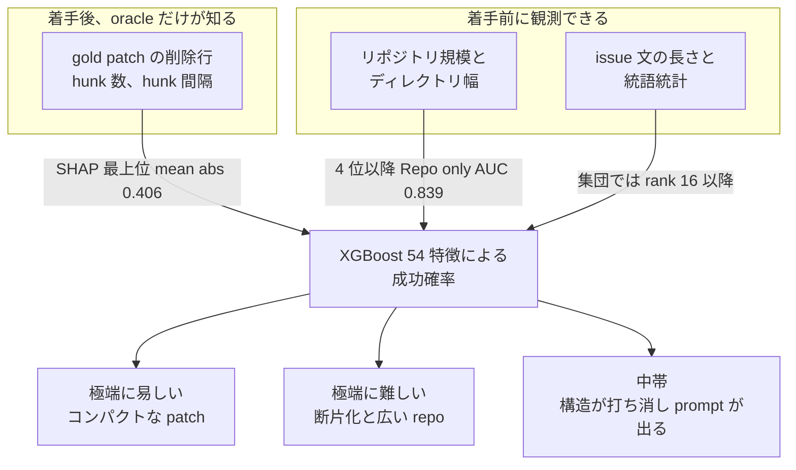

コーディングエージェントに issue を投げるとき、「これは通りそう」「これは無理そう」を先に知りたくなります。
モデルの振り分け、レビュー予算の配分、そもそも人間がやるかの判断が、そこで変わるからです。

Al-Haque と Johnson の論文 [What Makes Software Issue Resolution Tasks Difficult for Agents?](https://arxiv.org/abs/2608.18280)（arXiv:2608.18280、ESEM 2026 Technical Track 採録）は、この問いに定量的な回答を出しています。
45,769 課題を LLM 推論なしの 54 個の静的特徴だけで学習し、held-out AUC 0.863 でエージェントの成否を当てた、という結果です。

この記事では次の 3 点を扱います。

- その 0.863 が **どういう条件で成り立つ数字か**
- 何が効いていて、**着手前に観測できるのはどこまでか**
- 自分のリポジトリと自分のエージェントに、**どこまで持ち込めるか**

先に結論を言うと、AUC 0.863 の主因は「着手前には観測できない特徴」です。
それでも、この論文はベンチマークの難易度監査と、自分のエージェントの軌跡を層別する道具としては十分に使えます。

*この記事の全体像。以下、順に解説します。*

## 実験の枠組み

論文がやっていることは単純です。
課題ごとに決定論的な特徴量を作り、エージェントが実際に解けたかどうかを教師ラベルにして、勾配ブースティングで当てにいきます。

| 項目 | 内容 |
|---|---|
| 分析集合 | CoderForge-Preview から 45,769 tasks、1,553 repos |
| ソース内訳 | SWE-Smith 36,068（78.8%）、SWE-Rebench 9,701（21.2%） |
| 教師エージェント | Qwen3-Coder-480B + OpenHands v0.52.1、最大 100 step、隔離 Docker |
| 試行回数 | 課題あたり最大 8 回、平均 4.8 回。温度は非ゼロ |
| 成功定義 | 最終パッチがリポジトリの全テストを通る |
| 成果分布 | always pass 49.8%、always fail 32.5%、mixed 17.7% |
| 特徴量 | 初期 63 個 → VIF 閾値 10 で 9 個を除外し 54 個 |
| 分割 | task-level 80/20 層化分割（36,615 / 9,154）、`random_state=42` |
| モデル | XGBoost 400 trees、depth 8、lr 0.03、min child weight 2 |

54 個の特徴は 3 系統に分かれます。

- **patch 系（13 個）**: gold patch の削除行数、hunk 数、hunk 間隔など
- **repo 系（14 個）**: ファイル数、ルート直下ディレクトリ数、深さ、同名ファイル衝突など
- **prompt 系（27 個）**: issue 文の長さ、接続詞連鎖、代名詞密度などの統語統計

予測対象は 3 つです。
`any_success`（8 試行中 1 回以上成功、陽性率 67.5%）、`maj_success`（過半数成功）、`pass_rate`（連続値、平均 0.593）。

結果は次の通りです。

| 指標 | 値 |
|---|---|
| held-out AUC（`any_success`） | 0.863 |
| MCC / Brier / PR-AUC | 0.549 / 0.129 / 0.916 |
| 10-fold CV AUC | 0.851 ± 0.009 |
| `pass_rate` の R² | 0.408 |

同条件で Random Forest も AUC 0.863 に届く一方、Logistic Regression は 0.750 にとどまります。
特徴と成否の関係が非線形であることを示しています。
確率較正は XGBoost が全レンジで最も直線に近く、閾値を切って使う用途に向いています。

なお、二値の `any_success` は当てられても、連続の `pass_rate` は R² 0.408 です。
「8 回中何回通るか」までは、静的特徴では半分も説明できません。

## どの特徴が効いたのか

特徴集合ごとに学習し直した結果が、この論文でいちばん重要な表です。

| 特徴集合 | 特徴数 | `any_success` AUC | `pass_rate` R² |
|---|---|---|---|
| Patch only | 13 | 0.846 | 0.375 |
| Repo only | 14 | 0.839 | 0.350 |
| Prompt only | 27 | 0.599 | 0.025 |
| Patch + Repo | 27 | 0.861 | 0.401 |
| Repo + Prompt（gold patch 抜き） | 41 | 0.839 | 0.361 |
| 全特徴 | 54 | 0.863 | 0.406 |

読み取れることは 3 つあります。

1. **構造だけでほぼ頭打ち**。Patch + Repo の 0.861 に prompt 27 個を足しても、AUC の増分は 0.002 です。
2. **issue 文だけではほとんど当たらない**。Prompt only は AUC 0.599、R² 0.025 でほぼランダムです。
3. **gold patch を外すと 0.839 に落ち、Repo only（0.839）とほぼ同じ**。つまり prompt は repo に何も足していません。

SHAP の上位 3 特徴はすべて patch 系で、方向は「大きいほど失敗」です。

1. `patch_lines_deleted`（mean |SHAP| 0.406）
2. `patch_num_hunks`
3. `patch_hunk_gap_mean`

この 3 つで全 54 特徴の mean |SHAP| の 29% を占めます。
4 位は `repo_top_level_dir_count`（0.153）で、ここで初めて repo 系が出てきます。
交互作用の上位も patch × repo（hunk 間隔 × 削除行、hunk 数 × ルート直下の幅）です。

直感的には「修正が広く散らばっているほど、そして探索空間が広いほど失敗する」という、素朴だが強い法則が測定された、と読めます。

## 中難度帯だけ issue 文が顔を出す

集団レベルでは prompt 特徴は rank 16 以降で、独立寄与はほぼゼロでした。
ところが予測確率 `p̂` で層を切ると、様子が変わります。

| 帯 | 定義 | n | prompt が SHAP 上位 5 に入る割合 | median R(x) |
|---|---|---|---|---|
| easy | `p̂` 上位 10% | 893 | 26.8%（239/893） | 0.205 |
| mid | 平均 0.685 の ±0.05 | 575 | **70.3%（404/575）** | **0.404** |
| hard | `p̂` 下位 10% | 886 | 6.8%（60/886） | 0.108 |

`R(x)` は、その課題での prompt SHAP 絶対値の最大を、構造 SHAP 絶対値の最大で割った比です。

機構はこう読めます。
極端帯では「コンパクトな patch」か「断片化 + 広いリポジトリ」かが予測を飽和させてしまい、文面が入り込む余地がありません。
中帯では構造由来の信号が互いに打ち消し合い、残った差分に統語統計が乗ってきます。
中帯で頻出するのは `prompt_pronouns_per_sentence`（11.1%）、`prompt_mean_conj_chain_len`（10.1%）、`prompt_mean_competing_dependents_per_head`（9.4%）です。
代名詞が多い、接続の連鎖が長い、係り先の競合が多い——いずれも「読んで解釈が割れる文」の統語的な条件です。

ただし、この読みには 3 つの制限があります。

- **帯の定義がモデル自身の `p̂` に依存している**。構造で説明しきれなかった課題を中帯に集めたうえで、残差の特徴順位を見ているので、循環に近い構造があります。
- **測っているのは nocuous ambiguity ではない**。実装が分岐してしまう本質的な曖昧さではなく、統語的な曖昧さの「条件」にすぎません。論文 §6.3 も上限として認めています。
- **issue 文の 78.8% は人間が書いていない**。SWE-Smith 由来の課題文は、gold patch と失敗テストから言語モデルが生成した文です。実務の「仕様が抜けているチケット」とは別物です。

実務への落とし方は、せいぜい「中くらいに見えるチケットは、モデルを大きくする前に指示を書き直せ」までです。
prompt スコアを難易度の主指標にするのは、この結果からは支持されません。

## 着手前に採点できるもの・できないもの

この論文を運用に持ち込もうとすると、すぐ壁にぶつかります。
効いている特徴が、着手前には観測できないからです。

図の右側（gold patch）が AUC 0.863 の主因ですが、そこは「正解の差分」を知らないと埋まりません。
現場で着手前に使えるのは左側だけです。

| 採点したいもの | 対応する特徴 | 着手前に観測できるか | 使うなら |
|---|---|---|---|
| 変更箇所数、hunk 数、削除行 | patch 上位 3 | できない。gold が要る | 類似の過去 PR を代理にできるときだけヒューリスティックとして |
| リポジトリ規模、ルート幅、深さ、同名ファイル衝突 | repo | できる | 粗い順位付け。較正は自リポで取り直す |
| issue の長さ、接続、代名詞、PP 密度 | prompt | できる | 中帯の文面改善。難易度スコアにはしない |
| 依存範囲（モジュール境界、層の跨ぎ） | 静的特徴に存在しない | できない | 別研究が示す主要な失敗モード。レビュー予算を残す |

つまり「着手前に変更箇所数を採点してエージェントを振り分ける」という運用は、主因そのものが観測不能なので成立しません。
実行できるのはリポジトリ規模の粗いスコアだけで、その AUC 0.839 にも次節の問題が残っています。

## この数字を鵜呑みにできない理由

論文自身が単一エージェント・gold patch 依存・Python 偏りを脅威として明記しています。
そのうえで、運用判断に効く反証を並べます。

**gold patch 依存**。
フルモデルの主因は oracle 情報です。gold を抜いた repo + prompt は AUC 0.839 で、repo only との差は 0.0006 しかありません。

**task-level 分割によるリポジトリ漏洩の疑い**。
再現パッケージの `split.py` は `train_test_split` のみで、`GroupKFold` を使っていません。
SWE-Smith は 1 リポあたり約 290 tasks を持つため、同一リポジトリが train と test の両方に入ります。
repo 特徴はリポジトリ内でほぼ定数なので、モデルが学んだのは「規模の一般則」ではなく「リポジトリの識別子」かもしれません。
repo-out 分割での AUC は報告されていません。

**分析集合の 78.8% が合成バグ**。
SWE-Smith は手続き的な変異と LM 生成でテストを壊して課題を作ります。実務のチケットではありません。

**単純そうなパッチでも全滅する課題がある**。
[Beyond Resolution Rates](https://arxiv.org/abs/2604.02547)（arXiv:2604.02547）は、変更 10 行以下・単一ファイルの 12 課題で 19 エージェントすべてが失敗したと報告しています。
always-solved 群との patch 行数の差は p=0.24 で有意ではなく、失敗の 12 件中 10 件は「層の取り違え」でした。
サイズは難易度の代理として不完全です。

**説明の上限**。
成否が試行ごとに割れる mixed 17.7% は、決定論的な静的特徴では原理的に解けません。
`pass_rate` の R² が 0.41 前後にとどまるのはそのためです。

**成功定義の弱さ**。
[SWE-Bench+](https://arxiv.org/abs/2410.06992) は、解答リーク 32.67%、弱いテスト 31.08% を検出し、解決率 12.47% が 3.97% まで落ちると報告しました。
CoderForge には同等のフィルタがかかっていません。「既存テストが 1 回通った」を成功と呼ぶ限界がここにあります。

**着手前予測の現実的な上限**。
[Agent Psychometrics](https://arxiv.org/abs/2604.00594)（arXiv:2604.00594）は、problem statement のみからの予測で SWE-bench Verified の AUC が 0.755〜0.786、新規ベンチマークの hold-out では 0.67〜0.74 だと報告しています。
着手前かつ未知リポジトリという条件では、この 0.67〜0.79 の帯のほうが保守的な上限として妥当です。

## 自分のリポジトリへ外挿するときの落とし穴

外挿を弱める要因は独立ではなく、重なって効いてきます。

| 要因 | 論文の分布 | 実務で起きること |
|---|---|---|
| 課題の作り方 | 78.8% が合成バグ | 仕様欠落、複数の妥当解、対話による介入 |
| 言語 | Python OSS が中心 | モノレポ、多言語、社内フレームワーク |
| リポ多様性 | SWE-Smith 側は 124 リポに大量のタスク | 新規サービス、学習セット外のコード |
| エージェント | Qwen3-Coder-480B + OpenHands のみ | Claude、Codex、自前ハーネス |
| 規模 | 公開 GitHub の中規模 Python | 商用コードはより難しい傾向 |

最後の行について、[SWE-Bench Pro](https://arxiv.org/abs/2509.16941)（arXiv:2509.16941）は GPT-5 の Pass@1 が公開セット 23.3%、商用コードセットで 17.8% 以下だったと報告しています。
本論文の再実験ではありませんが、商用コードのほうが難しい方向に振れることの傍証にはなります。

そしてクロスプロジェクト予測そのものが難しい、という古典的な結果もあります。
Zimmermann らが 2009 年に報告した欠陥予測の実験では、プロジェクトをまたいだ 622 の学習・評価の組み合わせのうち、precision / recall / accuracy がすべて 0.75 を超えたのは 21 通り（3.4%）だけでした。
repo 特徴ベースのモデルは、この失敗モードを閉じていません。

さらに、事前学習汚染も未測定です。
Qwen3-Coder-480B は公開コードで事前学習されており、「解けやすさ」の一部は「見たことがあるリポジトリだから」で説明できてしまいます。

## 明日から使える運用ルール

ここまでを踏まえると、使いどころはかなり限定されますが、ゼロではありません。

**やってよいこと**

1. 自分のエージェントの軌跡に「リポジトリ規模」と「（事後に判明した）パッチ断片化」を付与して層別する。aggregate の解決率だけを見るのをやめる。
2. 着手前はファイル数・ルート直下の幅・深さだけを粗いフラグにする。確率値は出さない。
3. 中くらいに見える課題は、モデルを上げる前に issue を具体化する。対象ファイル名、再現手順、期待挙動を足す。
4. パッチが小さく見えても、層を跨ぎそうならレビューとテストの予算を残す。

**やってはいけないこと**

- AUC 0.863 をルーティングの SLO として運用する。
- gold patch がないのに hunk 数や削除行を「予測して」作業予算を削る。
- prompt の統語スコアを難易度の主指標にする。
- Qwen3 + OpenHands の SHAP 順位を、別モデルの苦手分野だと読み替える。

**このスコアラーを本番に載せない条件**

gold patch がまだない。振り分け先のリポジトリが学習セットにない。実チケットである。単純に見えて層を跨ぐ。エージェントが違う。成功定義が「既存テストを 1 回通す」だけである。連続的な失敗確率やコストが必要である。機能追加や対話的な作業である。
このいずれかに該当するなら、そのまま載せる根拠はありません。

**自分で確かめるなら**

再現パッケージ [ebtesam25/diffmodel-esem](https://github.com/ebtesam25/diffmodel-esem) には frozen XGBoost の pickle と `family_ablation_metrics.csv` が入っており、`./run_paper.sh` で再学習なしのロード、`./run_all.sh` で公表ハイパーパラメータによる再学習ができます（`--search` を付けると RandomizedSearchCV からやり直します）。
検証したい順は次の 3 つです。

1. `base_repo` で GroupKFold した AUC。repo-only の 0.839 がどこまで落ちるかを見る。
2. `cf_split == SWE_Rebench` だけで再学習する。合成バグ 78.8% を外したときの挙動を見る。
3. 自分のハーネスの軌跡で同じ 54 特徴を再フィットし、SHAP 順位が入れ替わるかを見る。

## まとめ

- arXiv:2608.18280 は、45,769 課題を LLM 推論なしの静的特徴 54 個で学習し、エージェント成否を held-out AUC 0.863 で予測した。
- 効いているのは **gold patch の断片化（削除行・hunk 数・hunk 間隔）とリポジトリ規模**。issue 文の統語特徴は集団では ΔAUC 0.002 以下しか足さない。
- ただし主因の gold patch は **着手前には観測できない**。gold を抜くと AUC 0.839 で、リポジトリ特徴だけの場合と実質同じになる。
- task-level 分割によるリポジトリ漏洩、78.8% の合成バグ、単一 scaffold、弱い成功定義が残っており、0.863 を事前推定の運用値として使う根拠は弱い。
- 実務では、ベンチマークの難易度監査と自エージェント軌跡の層別に用途を絞り、着手前はリポジトリ規模の粗い順位付けと、中帯チケットの issue 文改善に限定するのが妥当。

「エージェントに任せられるか」を先に当てる仕組みは魅力的ですが、この論文が示したのはむしろ「当てるのに必要な情報は、当てたい時点にはまだ存在しない」という構図でした。
それでも、自分のエージェントのログに構造特徴を付けて層別するだけで、見えるものは確実に増えます。

この記事が少しでも参考になった、あるいは改善点などがあれば、ぜひリアクションやコメント、SNSでのシェアをいただけると励みになります！

## 参考リンク

- Ebtesam Al-Haque, Brittany Johnson. What Makes Software Issue Resolution Tasks Difficult for Agents? arXiv:2608.18280v1, 2026-08-18. [abs](https://arxiv.org/abs/2608.18280) / [HTML](https://arxiv.org/html/2608.18280) / [PDF](https://arxiv.org/pdf/2608.18280)
- ESEM 2026 Technical Track [公式プログラム](https://conf.researchr.org/track/eseiw-2026/eseiw-2026-esem---technical-track)（プログラムは変更されうる）
- 再現パッケージ: [ebtesam25/diffmodel-esem](https://github.com/ebtesam25/diffmodel-esem)
- Together AI. CoderForge-Preview, 2026-02-25. [ブログ](https://www.together.ai/blog/coderforge-preview) / [Hugging Face](https://huggingface.co/datasets/togethercomputer/CoderForge-Preview)
- John Yang et al. SWE-smith. [arXiv:2504.21798](https://arxiv.org/abs/2504.21798)
- Ibragim Badertdinov et al. SWE-rebench. [arXiv:2505.20411](https://arxiv.org/abs/2505.20411)
- Chris Ge et al. Agent Psychometrics: Task-Level Performance Prediction in Agentic Coding Benchmarks. [arXiv:2604.00594](https://arxiv.org/abs/2604.00594)
- Mehtiyev, Assunção. Beyond Resolution Rates. [arXiv:2604.02547](https://arxiv.org/abs/2604.02547)
- Aleithan et al. SWE-Bench+. [arXiv:2410.06992](https://arxiv.org/abs/2410.06992)
- Deng et al. SWE-Bench Pro. [arXiv:2509.16941](https://arxiv.org/abs/2509.16941)
- Zimmermann et al. Cross-project defect prediction: a large scale experiment on data vs. domain vs. process. ESEC/FSE 2009. [DOI 10.1145/1595696.1595713](https://doi.org/10.1145/1595696.1595713)
