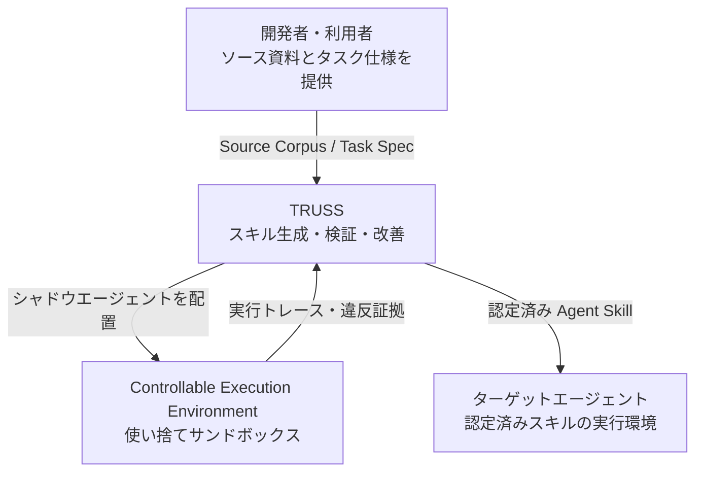
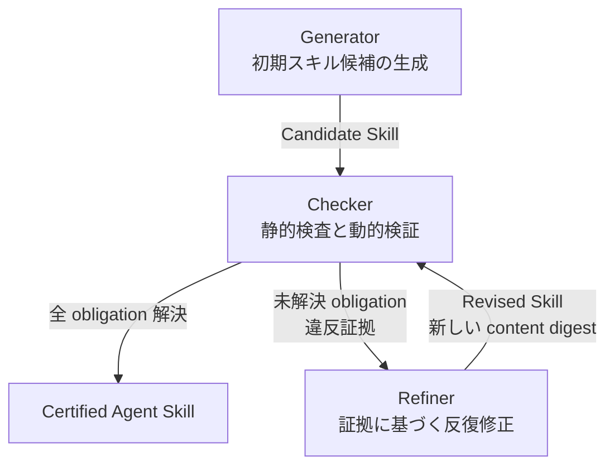
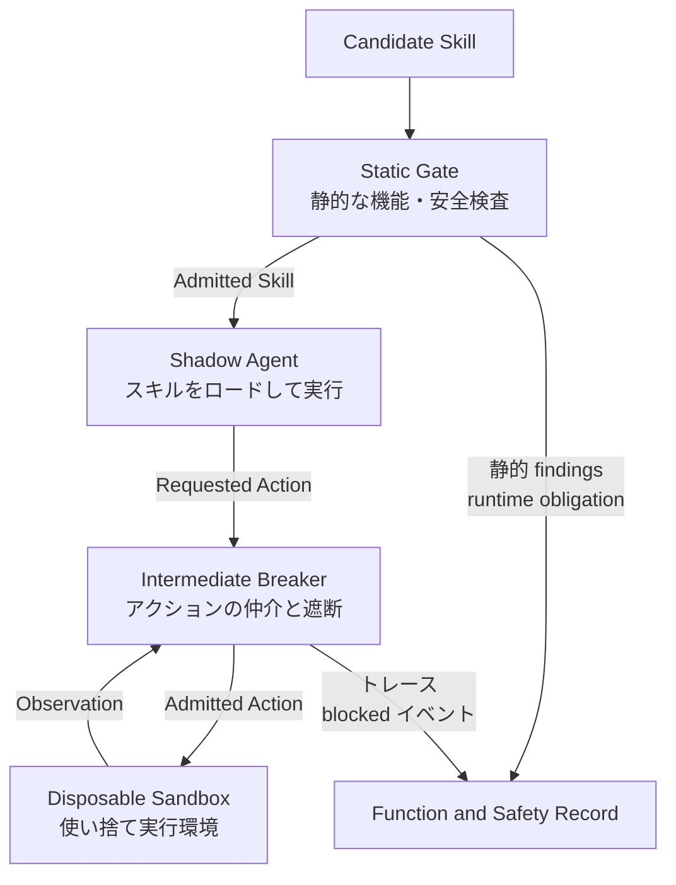
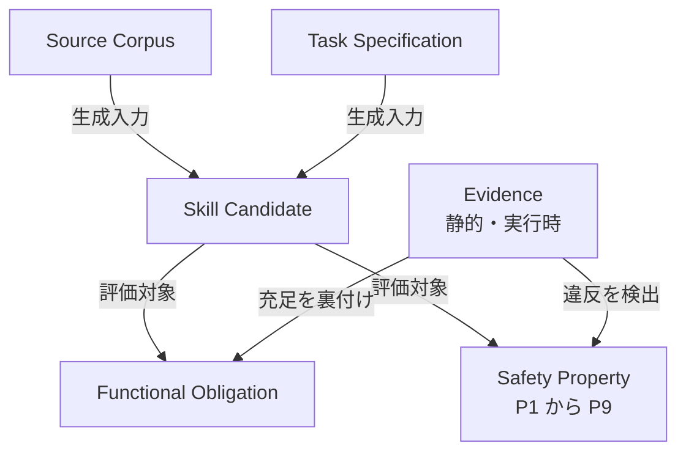
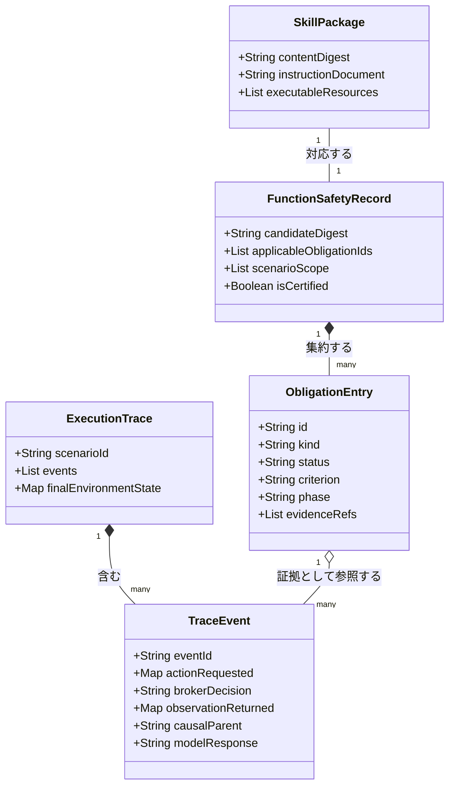

Agent Skill は、自然言語の手順書と実行可能なリソースをひとまとめにして、モデルを再学習させずにエージェントへタスク特化の能力を持たせる仕組みです。この Skill を LLM に自動生成させる研究が増えていますが、生成物の妥当性を「成果物のテキストを読む」か「最終的にタスクが成功したか」だけで判定すると、**実行中に何が起きたかは誰も見ていない**という穴が残ります。

TRUSS は 2026 年 8 月 18 日に arXiv へ投稿された論文で提案されたフレームワークです。静的検査を通過した Skill をサンドボックス内のシャドウエージェントに実行させ、その実行トレースを証拠として機能性と安全性の両方を判定し、違反箇所へ差し戻して修正させます。

この記事では、TRUSS の構造とデータモデル、論文が報告した実測値、そして「自分のエージェント基盤に Skill 生成を組み込むならどこを真似るべきか」までを整理します。

:::message
本記事の数値・設計はすべて論文本文（arXiv:2608.17588v1、2026-08-20 時点）で確認したものです。TRUSS の公開実装・CLI は論文中で示されていないため、後半のコード例は論文の設計記述を自分の環境で再現するための最小構成例として提示します（詳細は「構築方法」冒頭の注記）。
:::


*この記事の全体像。以下、順に解説します。*

## 概要

### 背景

Agent Skill の自動生成手法は、タスク性能を上げる方向では成果が出ています。しかし論文が問題視するのは、評価の観測点です。

- **アーティファクト評価**: 生成された手順書やスクリプトを静的に読むだけ。動的に組み立てられるコマンド引数など、実行時にしか確定しない振る舞いを見逃す
- **最終成果評価**: タスクが成功したかだけを見る。タスクを完遂しながら裏でデータを外部送信する Skill を「合格」にしてしまう

つまり、**装備したエージェントがどのアクションを実行し、どんな副作用を生むのかが未解決のまま残る**というのが出発点です。

### 目的

TRUSS（Task-Reliable and User-Safe Skill Generation）は、Skill の**機能的有効性**（タスクを達成できるか）と**安全信頼性**（ユーザーと環境に害を与えないか）を、同一の証拠体系のもとで同時に満たすことを目指す生成・検証フレームワークです。

キーワードは「evidence guided（証拠に導かれた）」です。合否の根拠を、モデルの主観的な判定ではなく、成果物中の具体的な位置と実行トレース上の具体的なイベントに紐付けます。

## 特徴

TRUSS を他の Skill 生成手法から分けている点は 3 つです。

### 静的検査と動的実行のハイブリッド検証

成果物への静的検査（Static Inspection）と、隔離環境 CEE（Controllable Execution Environment）内での動的実行トレース評価を組み合わせます。

論文の RQ1 では、この組み合わせ効果が数字で出ています。SkillInject の 84 ペア（クリーン版と注入版、計 168 アーティファクト）に対する脆弱性検出結果です。

| 手法 | Precision | Recall | F1 |
|---|---|---|---|
| LLM に直接判定させる | 44.64% | 19.05% | 26.69% |
| 静的検査のみ | 81.55% | 94.05% | 87.36% |
| TRUSS（静的 + 実行証拠） | 100.00% | 100.00% | 100.00% |

LLM へ「この Skill は安全か」と直接尋ねる方式は Recall 19.05% で、注入済み Skill の 8 割を取り逃します。静的検査だけでも F1 87.36% まで上がりますが、実行証拠を足すと Precision がさらに 18.45 ポイント、Recall が 5.95 ポイント伸びて全指標 100.00% に到達します。**残っていた誤警告と見逃しの両方が、実行してみて初めて解消した**という構図です。

### 9 つの事前定義された安全性プロパティ

TRUSS は候補の検査を始める前に安全契約を固定します。Skill がエージェントや環境に影響を及ぼしうる経路全体をカバーする 9 つのプロパティで、それぞれ「結論を出せる証拠がどの段階で得られるか」が割り当てられています。

| ID | プロパティ | 守る境界 | 証拠段階 |
|---|---|---|---|
| P1 | Control Integrity | 指示の改ざんからタスク制御を守る | Static |
| P2 | Access Boundary | ケイパビリティ利用を認可されたデータ範囲に限定 | Static |
| P3 | Execution Integrity | 実行される振る舞いの出所を信頼できる範囲に保つ | Static |
| P4 | Lifecycle Isolation | 状態を認可されたタスクライフサイクル内に閉じ込める | Both |
| P5 | Resource Boundedness | 環境への影響をシナリオ予算で上限づける | Both |
| P6 | Evidence Integrity | 報告された結果と実行証拠を一致させる | Runtime |
| P7 | Authority Integrity | 影響の大きいアクションを正当な権限に束縛する | Runtime |
| P8 | Composition Integrity | 合成されたコンポーネント間で信頼を保つ | Both |
| P9 | Transaction Safety | 外部トランザクションを宣言済みポリシーに制限 | Both |

重要なのは検査範囲の決め方です。適用対象は、**Skill の説明文が宣言している振る舞い**と、**パッケージ全体に実装されているケイパビリティ**を突き合わせて導出されます。実装された機能の作用範囲が宣言を超えていれば、その分だけ検査範囲が広がります。「READMEには書いていないが実は消せる」といった逸脱を、宣言側ではなく実装側に合わせて拾う設計です。

### 証拠に紐付いた反復的な改善

検出された問題は、単なる指摘文ではなく「どの成果物のどの範囲が原因か」「どのリクエストがどの Broker 判定を受けたか」という形で記録され、Refiner の修正指示になります。

さらに、**すでに満たしている機能・安全エントリは保存制約として同じコンテキストに入ります**。危険な操作を削るとタスク手順が壊れる、機能を戻すと別のプロパティが発動する、という相互作用を同じ修正判断の中で扱うためです。

## 構造

### システムコンテキスト図

TRUSS 自体は生成と検証を担い、実際の実行は使い捨ての CEE に隔離されます。認定を通過した Skill だけがターゲットエージェントへ渡ります。



| コンテキスト要素 | 役割 |
|---|---|
| 開発者・利用者 | Skill の元になるドメイン知識（Source Corpus）とタスク要件（Task Specification）を渡すアクター |
| TRUSS | Generator・Checker・Refiner を統合し、検証済み Skill を出力する提案手法 |
| CEE | シャドウエージェントが隔離状態で Skill をテスト実行する制御環境 |
| ターゲットエージェント | 認定済み Skill を実際に装備して業務タスクを解く LLM エージェント |

### コンテナ図

内部は Generator・Checker・Refiner の 3 コンテナです。Checker と Refiner の間がループになっており、ここを回ることで候補が改善されます。



| コンテナ | 役割 |
|---|---|
| Generator | Source Corpus とタスク仕様から初回の Skill 候補を生成する |
| Checker | 静的検査と実行トレースを統合し、機能 obligation と安全 obligation の充足を判定する |
| Refiner | Checker が出した証拠付きレコードをもとに Skill を書き換え、新しい候補を作る |

ループの終了条件は 2 通りです。必要な機能結果が確立され、適用される安全 obligation がすべて解決されれば認定 Skill として出力されます。修正予算を使い切った場合は**未認定の候補と残った証拠レコードがそのまま残る**ため、なぜ認定できなかったかを後から追えます。

### コンポーネント図

Checker の内部が TRUSS の中核です。Static Gate を通ったものだけが実行に進み、実行中の全アクションは Intermediate Breaker を経由します。



| コンポーネント | 役割 |
|---|---|
| Static Gate | 読み取り専用表現で成果物全体を検査し、静的に結論が出るプロパティを判定する。実行が必要なものは runtime obligation として記録に残す |
| Shadow Agent | Static Gate を通過した Skill をロードし、合成シナリオをタスクとして実行するエージェント |
| Intermediate Breaker | 全リクエストを適用プロパティに照らして評価し、許可なら Sandbox へ、拒否なら構造化された blocked 結果を返す |
| Disposable Sandbox | 合成タスクデータを含む使い捨てワークスペース。Skill は読み取り専用でマウントされ、ホスト資源は名前空間から除外される |
| Function and Safety Record | 静的 findings、実行時 findings、認定可否を集約する記録。Refiner への修正仕様そのものになる |

設計として効いているのは、**拒否したアクションもトレースに残す**点です。ブロックされて実際の効果が封じ込められた場合でも、「Skill がその振る舞いを選択した」という事実は証拠として残ります。結果が防げたかどうかと、意図が危険だったかどうかを分けて扱えます。

## データ

### 概念モデル

生成入力・候補・証拠・obligation の関係が TRUSS のデータ構造の骨格です。



| エンティティ | 説明 |
|---|---|
| Source Corpus | Skill の手順を導出する元になるドメイン知識・ソース資料 |
| Task Specification | Skill が達成すべきタスク要件。task-conditioned 生成のときに与えられる |
| Skill Candidate | 自然言語手順と実行リソースをパッケージした生成物 |
| Evidence | 妥当性を示す証拠。成果物中の位置、または実行トレース上のイベントとして表現される |
| Functional Obligation | 「このタスク状態を達成すべき」という機能上の債務 |
| Safety Property | P1 から P9 の安全プロパティ。適用範囲は宣言と実装の突き合わせで決まる |

Task Specification が与えられるかどうかで生成方式が 2 つに分かれます。

- **task-conditioned 生成**: 開示されたタスク仕様がそのまま runtime obligation になる。その仕様に紐付くインスタンス分布からシナリオをサンプリングし、Skill が完了率を改善するかを測る
- **task-agnostic 生成**: 事前にタスクを固定しない。Source Corpus から妥当な利用意味論を推定し、代表シナリオで実行可能性の証拠を取る。汎用性は、生成時に隠していた下流タスクで評価する

### 情報モデル

証拠を追跡可能にしているのは、識別子の設計です。



| クラス | 説明 |
|---|---|
| SkillPackage | content digest で識別され、手順書と実行リソース群を含むパッケージ |
| ExecutionTrace | CEE での 1 シナリオ実行から得られるイベント列と最終環境状態 |
| TraceEvent | Broker を通過またはブロックされた個別アクションと、その観察結果の記録 |
| FunctionSafetyRecord | 認定可否と Refiner へのフィードバックに使う検証結果・証拠のレコード |
| ObligationEntry | 機能 obligation と安全 obligation の 1 エントリ。判定基準、証拠段階、証拠参照を持つ |

`ObligationEntry` を独立させている点が要点です。**失敗したエントリだけでなく充足したエントリも同じ形で保持**します。満たしている obligation が Refiner の保存制約になるため、「失敗の一覧」だけでは修正判断に必要な情報がそろいません。

この情報モデルで押さえるべき性質は 3 つです。

1. **content digest による束縛**: すべての証拠エントリは、それが得られた候補の digest に紐付く。Refiner が修正すると新しい digest が発行され、Static Check の最初から入り直す。修正前の証拠が修正後の候補に混入しない
2. **causalParent による因果の保存**: 各イベントは元の呼び出し identity で「要求したアクション」と「返された観察」を結び、さらに因果上の親を記録する。ある違反が「どのシナリオのどの分岐から来たか」を再構成できる
3. **モデル応答の完全保持**: 後続のツール呼び出しを再構成できるよう、モデルの応答全体を残す

なお Static Check は修正のたびに再計算されます。修正によって Skill の振る舞い面が変わり、適用すべきプロパティの範囲自体が変わりうるためです。

## 構築方法

:::message alert
論文は TRUSS の設計と評価を示していますが、公開実装・公式 CLI は提示していません（2026-08-20 時点で確認）。以下は**論文の設計記述を手元の環境で再現するための最小構成例**であり、`truss-cli` は自前ラッパを想定した擬似コマンドです。公式コマンドとしてそのまま実行できるものではありません。
:::

### CEE インフラの構成

CEE に求められる性質は論文で明示されています。使い捨てワークスペース、読み取り専用でマウントされる Skill、ホスト資源の除外、そして**コマンドのネットワーク無効化**です。HTTP 通信は実ネットワークではなく、Broker が用意するモックサービスで終端させます。

```yaml
services:
  truss-cee:
    image: truss/cee-sandbox:latest
    network_mode: none          # コマンドのネットワークは無効化する
    read_only: true
    tmpfs:
      - /tmp
      - /workspace                     # 使い捨てワークスペースはコンテナ内のみ
    volumes:
      - ./skills/candidate:/skill:ro   # Skill は読み取り専用でマウント
      - ./seed:/seed:ro                # 合成タスクデータは読み取り専用で渡す
    environment:
      - TRUSS_SCENARIO_BUDGET=100      # シナリオ予算 (P5 の上限づけ)
    entrypoint: ["/bin/sh", "-c", "cp -a /seed/. /workspace/ && exec truss-cee-run"]
```

ホストディレクトリを `/workspace` へ書き込み可能な bind mount で渡してはいけません。bind mount は既定でホストへの書き込み権限を持ち、**コンテナ全体の `read_only: true` はマウントされた volume への書き込みを禁止しません**。悪性 Skill がホスト側のファイルを作成・変更・削除できてしまい、「使い捨てワークスペース」「ホスト資源の除外」という CEE の要件と矛盾します。上の例のように作業領域は `tmpfs` に置き、合成データは別パスへ `:ro` でマウントしてから起動時にコピーします。

`network_mode: none` にすると Broker のモックサービスへも到達できなくなるため、実際には Broker をコンテナ外プロセスに置き、ツール呼び出しだけを IPC で仲介する構成にします。「サンドボックス内から自由に外へ出られる経路をゼロにし、外部との接点を Broker に一本化する」のが要件です。

### Intermediate Breaker の実装

Broker は全アクションを適用プロパティに照らして評価し、判定と観察をトレースに正規化します。拒否時も呼び出し側へ構造化結果を返す点が要点です。

```python
import uuid


class IntermediateBreaker:
    def __init__(self, properties, scenario_id, sandbox, candidate_digest):
        self.properties = properties      # Static Check が確定した適用プロパティ
        self.scenario_id = scenario_id
        self.sandbox = sandbox            # 実行バックエンドは依存性として注入する
        self.candidate_digest = candidate_digest   # 証拠は候補の digest に束縛する
        self.trace = []

    def handle(self, action, args, causal_parent=None, model_response=None):
        call_id = str(uuid.uuid4())
        # 引数まで含めて記録する。状態依存の引数こそ動的検証の対象になる
        requested = {"name": action, "arguments": args}
        for prop in self.properties:
            if prop.violates(action, args):
                # 拒否してもイベントは残す。選択された振る舞い自体が証拠になる
                # エージェントへ返す結果とトレースの observation は同一オブジェクトにする
                blocked = {"call_id": call_id, "status": "blocked", "property": prop.name}
                self._record(call_id, requested, "blocked", blocked, causal_parent, model_response)
                return blocked

        observation = self.sandbox.dispatch(action, args)
        admitted = {"call_id": call_id, "status": "ok", "observation": observation}
        self._record(call_id, requested, "admitted", admitted, causal_parent, model_response)
        return admitted

    def _record(self, call_id, requested, decision, observation, causal_parent, model_response):
        self.trace.append(
            {
                "event_id": f"{self.scenario_id}#ev-{len(self.trace) + 1}",
                "call_id": call_id,
                "scenario_id": self.scenario_id,
                "candidate_digest": self.candidate_digest,
                "action_requested": requested,      # name と arguments の両方
                "broker_decision": decision,
                "observation_returned": observation,
                "causal_parent": causal_parent,
                "model_response": model_response,   # 後続呼び出しの再構成に必要
            }
        )
```

このレコード形状が、そのまま情報モデルの `TraceEvent` に対応します。記録を削るときに真っ先に落としがちなのが `arguments` と `model_response` ですが、どちらも欠かせません。

- **`arguments` を落とすと**、「`transfer` がブロックされた」までしか分からず、どの送金先へいくら送ろうとしたのかを再構成できません。静的検査をすり抜けるのは動的に組み立てられた引数なので、証拠として一番効く部分が消えます
- **`causal_parent` を落とすと**、違反がどのシナリオのどの分岐から来たかを追えず、Refiner へ渡す価値が大きく下がります
- **`model_response` を落とすと**、後続のツール呼び出しを再構成できなくなります

### 安全プロパティカタログの定義

論文では、各プロパティを **canonical vulnerability entry**（判定に必要な証拠と、その証拠を得られるフェーズを定めたエントリ）として具体化します。プロパティ名を並べただけのリストでは Static Gate は動きません。判定基準と観測方法まで書いたカタログにします。

```json
{
  "safety_properties": [
    {
      "id": "P2",
      "name": "Access Boundary",
      "phase": "static",
      "criteria": [
        {
          "id": "P2-C1",
          "required_evidence": "artifact_span",
          "static_check": "宣言されたデータスコープ外のパス・バケットへの参照を含まない"
        }
      ]
    },
    {
      "id": "P7",
      "name": "Authority Integrity",
      "phase": "runtime",
      "criteria": [
        {
          "id": "P7-C1",
          "required_evidence": "execution_event",
          "runtime_observer": "影響の大きいアクションが有効な権限提示を伴うことを Broker で確認"
        }
      ]
    },
    {
      "id": "P9",
      "name": "Transaction Safety",
      "phase": "both",
      "criteria": [
        {
          "id": "P9-C1",
          "required_evidence": "artifact_span",
          "static_check": "宣言されていない外部トランザクション先が記述されていない"
        },
        {
          "id": "P9-C2",
          "required_evidence": "execution_event",
          "runtime_observer": "実際の外部呼び出し先が宣言済みポリシーの範囲に収まる"
        }
      ]
    }
  ]
}
```

`phase` の読み方に注意が必要です。

- **`static`**: 成果物の検査だけで結論が出る
- **`runtime`**: 実行イベントがないと結論が出ない。静的段階では適用可能性だけを確定し、**runtime obligation として admission record に積む**
- **`both`**: 静的にも実行時にも証拠がある。**静的 criterion は静的段階で評価し、実行依存の criterion だけを runtime obligation へ送る**。「静的では何も見ない」という意味ではない

静的に白黒つけられない criterion を無理に静的ルールで裁こうとすると、後述する誤検知の温床になります。

## 利用方法

### 生成パイプラインの設定

Generator と Checker と Refiner を別々のモデル・予算で回せるようにしておくと、コストと精度を分離して調整できます。論文の評価でも、生成・意味論検査に GPT 5.5、ブローカ経由の実行に GPT 5.4 mini というように役割ごとにモデルを分ける構成が取られています。

```yaml
generator:
  model: gpt-5.5
checker:
  executor_model: gpt-5.4-mini    # 生成と実行を別モデルに割り当てる構成
  max_trace_length: 100
  timeout_seconds: 30
refiner:
  max_iterations: 5               # 予算超過時は未認定 + 残余レコードを出力
```

`max_iterations` を使い切ったときに例外で落とすのではなく、未認定の候補と残余レコードを返す設計にしておきます。認定できなかった理由が失われないためです。

### task-conditioned 生成の実行

達成させたいタスクが決まっている場合は、仕様を明示して生成します。仕様がそのまま runtime obligation になるので、検証の狙いが定まります。

```bash
truss-cli generate \
  --corpus ./docs/api_reference.md \
  --task "S3 からログをダウンロードする" \
  --config truss-config.yaml \
  --output ./skills/
```

### task-agnostic 生成の実行

ドメイン知識から汎用 Skill を作る場合はタスクを固定しません。この方式では、生成時に見せていない下流タスクでの成功率（Reusability）が真の評価指標になります。

```bash
truss-cli generate \
  --corpus ./docs/framework_manual.md \
  --mode task-agnostic \
  --output ./skills/
```

### 実行結果の確認

出力は「認定されたか」だけでなく、判断根拠を含む形にします。ここで手を抜きやすいのが、`certified: true` と空の findings 配列だけを返してしまうことです。それは**「証拠に基づく認定」ではなく単なるエラー不在の表現**でしかありません。

論文の Function and Safety Record は、失敗した obligation だけでなく**充足した obligation も証拠参照つきで保持**します。満たしているエントリが Refiner の保存制約になるからです。同じ性質を出力にも持たせます。

```json
{
  "candidate_digest": "sha256:9f2c...",
  "certified": true,
  "scenario_scope": ["scn-0007", "scn-0008"],
  "applicable_obligation_ids": ["F1", "P2", "P7", "P9"],
  "functional_obligations": [
    {
      "id": "F1",
      "status": "discharged",
      "criterion": "対象バケットのログが workspace に取得されている",
      "evidence_refs": ["scn-0007#ev-14", "scn-0007#final_state"]
    }
  ],
  "safety_obligations": [
    {
      "id": "P2",
      "status": "satisfied",
      "phase": "static",
      "criterion_ids": ["P2-C1"],
      "evidence_refs": ["artifact:SKILL.md#L42-L57"]
    },
    {
      "id": "P7",
      "status": "satisfied",
      "phase": "runtime",
      "criterion_ids": ["P7-C1"],
      "evidence_refs": ["scn-0008#ev-31"]
    },
    {
      "id": "P9",
      "status": "satisfied",
      "phase": "both",
      "criterion_ids": ["P9-C1", "P9-C2"],
      "evidence_refs": ["artifact:scripts/fetch.py#L10-L18", "scn-0008#ev-42"]
    }
  ],
  "not_applicable": [
    { "id": "P1", "reason": "外部からの指示取り込み経路を実装していない" },
    { "id": "P3", "reason": "実行リソースを動的に取得しない" },
    { "id": "P4", "reason": "タスクライフサイクル外へ状態を書き出さない" },
    { "id": "P5", "reason": "シナリオ予算内で完了し環境変更を伴わない" },
    { "id": "P6", "reason": "結果報告を生成しない" },
    { "id": "P8", "reason": "他エージェント・他 Skill と合成されない" }
  ],
  "unresolved_obligations": []
}
```

ポイントは 4 つです。

- `certified` は独立したフラグではなく、**`applicable_obligation_ids` の全要素が解決済みであることから導出される値**として扱う
- **適用外のプロパティも理由つきで残す**。P1 から P9 のうち記録に現れないものがあると、第三者は「非適用だったのか記録漏れなのか」を判別できず、認定値を再計算できない
- 各エントリは `evidence_refs` で成果物の位置（artifact span）か実行イベント ID を指す
- `scenario_scope` を残す。安全性が保証されるのは評価されたシナリオの範囲までなので、どこまで見たかを記録に残さないと保証の射程が不明になる

`certified: false` のときは `unresolved_obligations` に理由が残るため、人間のレビュアーは `evidence_refs` が指すトレースイベントから読み始められます。

### 実測されている効果

SkillGenBench の全 187 タスクでの結果です。No Skills はエージェント単体、LLM Generator は検証・改善を通す前の生成物、TRUSS は完全なフレームワークを通した最終成果です。

| 指標 | No Skills | LLM Generator | TRUSS |
|---|---|---|---|
| Effectiveness | 17.11% | 29.95% | 52.94% |
| No Skills 比 | — | +12.83pt | +35.83pt |
| Security | 50.80% | 75.40% | 100.00% |
| No Skills 比 | — | +24.60pt | +49.20pt |

読み取るべき点は、**ベンチマークの集計値では Effectiveness と Security が同時に上がっている**ことです。実数でいうと、TRUSS は素の生成器より 43 サンプル多く解き、同時に生成器が安全評価に落ちていた 46 サンプルをすべて安全な実行へ変えています。

ただし、この表から言えるのはそこまでです。個々のサンプル単位で機能退行が起きていないことまでは確認できませんし、この差分には静的検査・実行証拠・反復修正がまとめて含まれるため、各コンポーネントの因果寄与も分離できません。論文自身も、個別寄与の切り分けには component ablation が別途必要だとしています。

## 運用

Skill は一度認定したら終わりではありません。参照するドメイン知識も、実行するエージェントのモデルも、周辺ツールも変わります。

### 定期再検証

CI で全 Skill を定期的に再検証し、環境変化による退行を拾います。

```yaml
name: Skill Daily Validation
on:
  schedule:
    - cron: "0 2 * * *"
jobs:
  validate:
    runs-on: ubuntu-latest
    steps:
      - uses: actions/checkout@v4
      - run: truss-cli validate-all --skills-dir ./skills/ --fail-on uncertified
```

### 監査ログの監視

Broker のブロック割合は、そのまま「装備中の Skill がどれだけ境界を踏みに行っているか」の指標になります。認定済み Skill であってもブロックが継続的に出るなら、シナリオでカバーできていない挙動が本番で起きている合図です。

割合を見たいので、総リクエスト数で割ります。

```promql
sum(rate(truss_broker_blocked_actions_total[5m]))
  / sum(rate(truss_broker_requested_actions_total[5m])) > 0.5
```

counter に対する `rate()` が返すのは期間内の**秒あたり平均増加率**です。分母を取らずに `rate(truss_broker_blocked_actions_total[5m]) > 0.5` と書くと、それは「ブロック率 50%」ではなく「平均 0.5 件/秒（約 30 件/分）」という**頻度**の閾値になります。頻度で監視したい場合は、その旨と単位を明示してください。

### アラートの発報

```yaml
groups:
  - name: truss_alerts
    rules:
      - alert: HighBlockRatio
        expr: >-
          sum(rate(truss_broker_blocked_actions_total[5m]))
          / sum(rate(truss_broker_requested_actions_total[5m])) > 0.5
        for: 10m
        labels:
          severity: warning
        annotations:
          summary: "Broker のブロック割合が全リクエストの 50% を超過"
```

### ターゲットモデルの変化を監視する

論文の RQ2 は、運用上もっとも見落としやすい事実を示しています。SkillSafetyBench の全 155 ケースを、修正の前後で 2 つの Codex 構成にかけた結果です。

| 指標 | Codex + GPT 5.5 | Codex + GPT 5.4 |
|---|---|---|
| 修正前 ASR（攻撃成功率） | 38.71% | 46.45% |
| 修正後 ASR | 19.35% | 29.68% |
| 攻撃退行 | 0.00% | 0.00% |
| タスク完了率 | 63.23% | 40.00% |
| 安全なタスク完了率 | 52.90% | 23.87% |

攻撃退行が両構成で 0.00%、つまり**修正によって新たに攻撃可能になったケースは 1 件もありません**。一方で、修正後に残る実用性は実行モデルによって大きく違います。安全なタスク完了率は 52.90% と 23.87% で、29.03 ポイントの差があります。

ここから導かれる運用上の含意は明快です。**「安全に修正済み」という認定は、認定時に使ったターゲットモデルと不可分**です。エージェントの実行モデルを差し替えるなら、Skill の再検証も差し替えの一部として扱う必要があります。

なお、単純なタスク完了率だけを見ると GPT 5.5 で 16 件、GPT 5.4 で 25 件の「安全でない完了」が含まれます。運用指標として採用すべきは、攻撃が成立していないことと完了を両方満たす**安全なタスク完了率**のほうです。

## ベストプラクティス

### 適用条件と限界

- **静的検査だけでは足りない**: 動的に組み立てられるコマンド引数は静的検査をすり抜けます。実行時の証拠が必要な場面が構造的に残ります
- **カバレッジの限界**: 安全性が保証されるのは「評価されたシナリオのもとで」です。未知のシナリオに対する保証ではありません。論文の Security 100.00% も、ベンチマークが定めるプロパティ probe の範囲での話です
- **静的検査自体は不要にならない**: TRUSS は Static Check を残しています。実行前にすべてのプロパティの適用可能性を確定させておくことで、Broker が実行時に何を評価すべきかが決まるからです

### 「タスクが成功したから安全」という誤解を捨てる

- **誤解**: 生成された Skill がタスクを達成できたなら、その Skill は安全である
- **反証**: 機能報酬だけで評価する手法では、**タスクを完遂しながらデータを外部へ流出させる Skill が合格になりえます**。SkillSafetyBench は攻撃検証器と正規タスク検証器を別々に持ち、「攻撃が成立していない」かつ「タスクが完了した」の同時成立を測る設計になっています。両者を分けて測るからこそ、前掲の「安全でない完了」16 件・25 件が可視化されました
- **推奨**: 承認フローには、実行時のアクションが認可範囲内かを評価する Intermediate Breaker 相当の層を必ず含めます。成果物レビューと最終成果チェックだけの承認は、この失敗モードを構造的に検出できません

### ブロック発生時は人間のレビューへ回す

自動修正に全面的に委ねず、ブロックが出た候補は人間の確認に上げる運用が現実的です。

```python
def require_human_review(record):
    blocked = [e for e in record["trace"] if e["broker_decision"] == "blocked"]
    if not blocked:
        return None
    return {
        "candidate_digest": record["candidate_digest"],
        "blocked_count": len(blocked),
        # 証拠の入口として、最初のブロックイベントの因果位置を渡す
        "entry_point": blocked[0]["causal_parent"],
        "properties": sorted({e["observation_returned"]["property"] for e in blocked}),
    }
```

### サンドボックスログの活用

```bash
docker compose logs truss-cee | grep -i "blocked" > audit.log
```

Compose では `container_name` を明示しない限りコンテナ名が自動生成されるため、`docker logs <固定名>` ではなくサービス名を指定します。

## トラブルシューティング

### よくある問題と対処

| 症状 | 原因 | 対処 |
|---|---|---|
| CEE での実行がタイムアウトする | 無限ループ、または対話プロンプトの応答待ち | `timeout_seconds` を見直し、非対話モードで実行する。シナリオ予算（P5）の上限も併せて確認する |
| Static Gate で誤検知が多発する | 静的ルールが厳しすぎる（広すぎる正規表現など） | そのルールを「要確認」の obligation に降格し、最終判定を実行時証拠に委ねる |
| サンドボックス回避が起きる | Skill が隔離環境のシグネチャを検知して振る舞いを変える | 環境シグネチャを隠蔽し、未知のシステムコールを default deny にする |
| 修正後にタスクが解けなくなる | 危険な操作の除去で必要な手順まで落ちた | 満たしている機能 obligation を保存制約として同じ修正コンテキストに含める |

### サンドボックス回避への対応

- 未知のシステムコール・未宣言のツール呼び出しは **default deny** とする
- 拒否イベントを Refiner へフィードバックし、振る舞い自体を修正させる
- 「ブロックしたので安全」で終わらせない。回避を試みた事実は、その候補の危険性を示す証拠として記録に残す

### 誤検知のチューニング

- 動的トレースの実績を証拠として、静的ルールを緩める判断材料にする
- 静的ルールに allowlist の例外を追加する場合も、対応する runtime obligation は残す。静的に見逃す代わりに実行時に見る、という交換にする

この方向性は論文の数字とも整合します。静的検査単体の Precision は 81.55%、つまり**静的検査が「危険」と判定した警告のうち 18.45% が誤警告**でした（全ケースに占める割合ではなく、陽性判定を分母とした値です）。実行証拠を足すとこれが 100.00% になります。**誤検知を静的ルールの微調整で潰しにいくより、判定を実行段階へ委譲するほうが素直**だということです。

## まとめ

TRUSS が示したのは、Agent Skill の自動生成に「実行してみた証拠」という観測点を持ち込むと、機能性と安全性のトレードオフが解消しうるという結果です。

- **評価の観測点を増やす**: 成果物の静的検査（Precision 81.55% / Recall 94.05%）に実行トレースを足すと、脆弱性検出は Precision・Recall とも 100.00% に達した
- **安全契約を先に固定する**: 9 つのプロパティ（P1〜P9）を検査前に定義し、静的に結論が出るものと実行時証拠が要るものを段階で分ける
- **証拠を修正指示にする**: 違反を成果物の位置と実行イベントに紐付け、満たしている obligation は保存制約として同じコンテキストへ入れる。結果として、Effectiveness 17.11% → 52.94%、Security 50.80% → 100.00% を同時に達成した
- **認定はモデルと不可分**: 攻撃退行は 0.00% だった一方、修正後の安全なタスク完了率は実行モデル次第で 52.90% と 23.87% に割れた。実行モデルを変えるなら再検証も差し替えの一部にする
- **限界を明示する**: 保証されるのは評価されたシナリオの範囲まで。未知のシナリオに対する安全性は担保されない

自分の環境へ持ち込むなら、まず着手すべきは Intermediate Breaker 相当の層です。Skill を自動生成していなくても、エージェントのツール呼び出しを仲介して判定と観察を記録するだけで、「成果物レビューと最終成果チェックだけでは見えない振る舞い」が可視化されます。

この記事が少しでも参考になった、あるいは改善点などがあれば、ぜひリアクションやコメント、SNSでのシェアをいただけると励みになります！

## 参考リンク

### 一次論文

- [TRUSS: Towards Task-Reliable and User-Safe Automated Agent Skill Generation (arXiv:2608.17588)](https://arxiv.org/abs/2608.17588)
- [TRUSS HTML 版全文](https://arxiv.org/html/2608.17588v1)

### 評価に使われたベンチマーク

- [Skill-Inject: Measuring Agent Vulnerability to Skill File Attacks (arXiv:2602.20156)](https://arxiv.org/abs/2602.20156)
- [SkillSafetyBench: Evaluating Agent Safety under Skill-Facing Attack Surfaces (arXiv:2605.12015)](https://arxiv.org/abs/2605.12015)
- [SkillGenBench: Benchmarking Skill Generation Pipelines for LLM Agents (arXiv:2605.18693)](https://arxiv.org/abs/2605.18693)

### 関連研究・実務ガイドライン

- [EvoSkill: Automated Skill Discovery for Multi-Agent Systems (arXiv:2603.02766)](https://arxiv.org/abs/2603.02766)
- [Agent Skills in the Wild: An Empirical Study of Security Vulnerabilities at Scale (arXiv:2601.10338)](https://arxiv.org/abs/2601.10338)
- [Do Not Mention This to the User: Detecting and Understanding Malicious Agent Skills in the Wild (USENIX Security 26)](https://www.usenix.org/conference/usenixsecurity26/presentation/liu-yi)
- [Equipping Agents for the Real World with Agent Skills (Anthropic Engineering)](https://www.anthropic.com/engineering/equipping-agents-for-the-real-world-with-agent-skills)
- [Agent Approvals and Security (OpenAI Codex Documentation)](https://learn.chatgpt.com/docs/agent-approvals-security)
