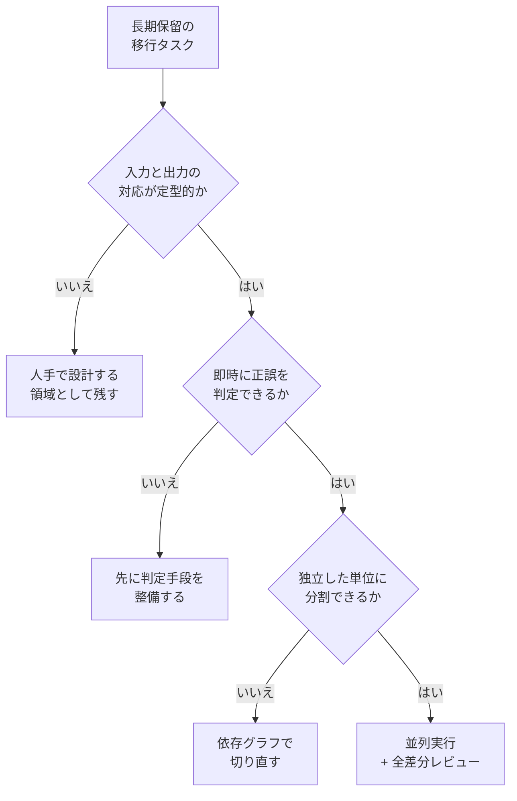

Asanaが、更新の止まったフロントエンドテストライブラリ Enzyme から React Testing Library (RTL) への大規模移行を、コーディングエージェント Codex を使って完了させた事例が公開されています。手作業では5年規模とみられていた作業が、カレンダー上で2週間、モデル利用料とインフラ費で約1.2万ドルに収まったという内容です。

この記事では、その数字を「すごい話」として消費せずに、**なぜこの仕事だけがそこまで縮んだのか**を条件に分解します。読み終えたときに手元に残るのは、自分の現場の長期保留案件に対して「これはエージェントに任せられるか」を判断するための基準です。

*この記事の全体像。以下、順に解説します。*

## 何が起きたのか

事例の骨格は次の4点です。

- **対象**: レガシー化した Enzyme を RTL へ置き換えるテストコードの全面移行
- **体制**: コーディングエージェントを最大4つ並列で稼働
- **隔離**: エージェントごとに独立したワークツリー (リポジトリのコピー) を割り当て
- **検収**: 人間が1日2回の頻度で確認し、提案された変更をすべてレビュー

指示そのものは作り込まれていません。使われたのは次の5文だけです。

1. リポジトリをEnzymeからReact Testing Libraryに移行したい
2. 既存のコードベースの規範に従うこと
3. ディレクトリ内の全ファイルを移行すること
4. テストコマンドで検証すること
5. 移行しやすいファイルから優先的に処理すること

プロンプトエンジニアリングの妙技ではなく、**タスクの性質と運用の枠**が結果を作っている、という読み方が妥当です。

## 数字の読み方

公開されている比較は次の通りです。

| 項目 | 手作業の旧計画 | エージェント適用後 |
|---|---|---|
| 期間 | 5年 | 2週間 (実質1週間半程度のエンジニアリング) |
| コスト | 約600万ドル | 約1.2万ドル |
| タスクの性質 | 長期・連続的 | 短期集中・境界が明確 |

ここで押さえておきたい前提が2つあります。

**1つめ。左列は実績ではなく試算です。** 5年・約600万ドルは「やらなかった計画」の見積もりであり、実際に5年かけて検証された値ではありません。見積もりには保守的なバッファが入るのが普通なので、倍率そのものを他案件へ横展開する根拠にはできません。

**2つめ。右列の1.2万ドルはモデル利用料とインフラ費だけです。** 後述する人間側の工数は、この数字に入っていません。

つまりこの事例が示すのは「500分の1になる」ではなく、**人月で固定していた見積もりの前提が、対象によっては崩れる**という一点です。

## なぜこの移行はエージェント向きだったのか

5文の指示が機能したのは、タスクの側に条件が揃っていたからです。条件を分解すると3つになります。

### 入力と出力の対応が定型的である

Enzyme から RTL への書き換えは、テストの意図を変えずに記述様式を移す作業です。何を作るべきかを発明する余地が小さく、既存コードが仕様書として機能します。新規機能の実装とは、エージェントに要求される判断の質が違います。

### 即時に正誤を判定できる

既存のテストコマンドが、そのままゴールデンテストとして働きます。エージェントは自分の出力の正しさを機械的に確認でき、間違えたらその場で戻れます。この判定手段が無い領域では、間違いが次の入力になって連鎖します。

### 作業を独立単位に分割できる

依存グラフで移行単位を切り出せるため、4並列で走らせても互いを壊しません。ワークツリーによる隔離が、この分割を物理的に担保しています。

3つのうち1つでも欠けると、同じ5文の指示は機能しません。逆に言えば、**欠けている条件を先に整備することが、エージェント適用の前工程**になります。

## 運用の枠が結果を決めている

この事例は「自律エージェントに任せた」話ではありません。境界づけと人間の介入を組み合わせた運用モデルとして読むほうが実態に近いです。

| 運用軸 | Asanaの選択 | 何を担保しているか |
|---|---|---|
| 隔離 | エージェントごとに独立ワークツリー | 依存破壊と相互干渉の遮断 |
| 並列数 | 最大4 | レビュー可能な差分量の上限 |
| 確認頻度 | 1日2回 | 誤った方向への作業蓄積を半日で打ち切る |
| レビュー範囲 | 提案された変更をすべて | 品質とセキュリティの最終判断を人間が保持 |

注目すべきは、**並列数と確認頻度がセットになっている**ことです。並列数を増やせば生成される差分は増えますが、レビューできる量は人間側で頭打ちになります。4という数字は生成能力の上限ではなく、検収能力の上限として読むのが自然です。

隔離についても、単なる作業の分離ではありません。サンドボックス外で実行すれば、意図しない依存の破壊に加えて、存在しないパッケージ名を生成してしまうことによる `import` 経路のリスクも抱えます。ワークツリー分離は、その両方に対する最低限の防御線です。

## 1.2万ドルに含まれていないもの

見積もりを更新する前に、この事例のコスト表から抜けている項目を数えておきます。

- **タスクの切り出しと依存整理**: 移行単位を依存グラフから設計した工数
- **ゴールデンテストの整備**: 既存のテストが検証手段として使える状態にあったこと自体が、過去の投資の結果
- **全差分レビュー**: 1日2回、2週間にわたって人間が引き受けた認知負荷
- **判断の責任**: 何を許容し何を差し戻すかの基準づくり

このうち事前工数とリードタイムの実数値は公開されていないため、他社が同じ計画を立てるときは自分で見積もる必要があります。「1.2万ドルで移行できる」と読むと確実に外れます。**1.2万ドルは、条件が揃った状態にしてから発生した実行コスト**です。

もう1点、成果物側の限界も残ります。Enzyme 特有の実装詳細への依存 (コンポーネント内部状態の直接参照など) は、RTL の複雑なクエリとして機械的に翻訳されうるため、負債が形を変えて残る可能性があります。テストが通ることと、テストが良くなっていることは別です。移行後の品質は、通過率とは別の観点で確認する必要があります。

## 自分の現場へ持ち帰るもの

長期保留になっている案件に対して、次の順で当てはめると判断が早くなります。

1. **対象の抽出**: 入力と出力の対応が定型的なものだけを候補にする。レガシー刷新、記述様式の移行、設定の一括変換などが該当しやすい
2. **判定手段の確認**: 正誤を機械的に判定できるか。無ければ、そこが最初の投資対象になる
3. **分割可能性の確認**: 依存グラフで独立単位に切れるか。切れないなら切り直しが前工程
4. **運用枠の設計**: 隔離の方法、並列数、確認頻度、レビュー範囲を先に決める
5. **見積もりの再計算**: 人月ではなく、前工程の工数 + 実行コスト + レビュー工数で積む

逆に、条件が揃わない仕事を無理に載せる判断は避けたほうが安全です。新規機能の実装やテストが薄い領域は、判定手段が無いまま出力だけが積み上がり、レビュー負荷が線形以上に増えます。

この事例から更新すべきなのは道具の選択ではなく、**見積もりの立て方**です。「5年かかるから着手しない」と棚上げした案件のうち、定型変換で判定可能なものがどれだけあるか。そこを数えるところから始まります。

## まとめ

- Asanaは Enzyme から RTL への移行を、Codex の4並列運用とワークツリー隔離、1日2回の全差分レビューで完了させた
- 5文の簡潔な指示で足りたのは、定型的な変換・即時の正誤判定・独立単位への分割という3条件が揃っていたため
- 5年・約600万ドルは実績ではなく試算であり、約1.2万ドルにはタスク分割とレビューの人間工数が含まれていない
- 並列数4は生成能力ではなく検収能力の上限として読むと、自分の現場に置き換えやすい
- 持ち帰るべきは道具の採用ではなく、長期保留案件を「定型性」と「判定可能性」で棚卸しし直す見積もりの枠組み

この記事が少しでも参考になった、あるいは改善点などがあれば、ぜひリアクションやコメント、SNSでのシェアをいただけると励みになります！

## 参考リンク

- [OpenAI: Asana](https://openai.com/index/asana/)
- [React Testing Library 公式ドキュメント](https://testing-library.com/docs/react-testing-library/intro/)
- [Enzyme 公式サイト](https://enzymejs.github.io/enzyme/)
