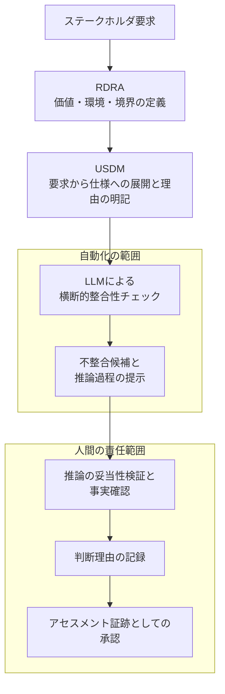

*この記事の全体像。以下、順に解説します。*

## この記事の対象と結論

Automotive SPICE (ASPICE) 4.0 の SYS.2 (システム要求分析) では、要求間の一貫性と双方向トレーサビリティの確保が求められます。この作業は文書をまたぐ突き合わせになるため、人手ではコストが高く、LLM で自動化したくなる領域です。

一方で、アセスメントで問われるのは「ツールが何と言ったか」ではなく「人間がどう判断したか」です。自動化の範囲を広げすぎると、監査証跡としてはむしろ弱くなります。

この記事では、次の 3 点を整理します。

- ASPICE 4.0 SYS.2 で整合性の要求がどう変わったか
- 既存の静的解析で検出できる不整合と、できない不整合の境目
- LLM に任せる範囲と、人間が負う責任をどこで切るか

対象読者は、車載に限らず**要求レビューのプロセス設計を判断する立場**の方です。ツールの導入手順ではなく、責任分界の設計を扱います。

## 全体像

機械検査と人間の判断の責任境界を、要求の構造化から承認までの流れで示します。

要点は、自動化の出口が「承認」ではなく「候補と根拠の提示」で止まっていることです。

## ASPICE 4.0 SYS.2 で何が変わったか

ASPICE 4.0 の SYS.2 では、BP5 において「一貫性の確保」と「双方向トレーサビリティの確立」が統合されました。

この統合が意味するのは、次の違いです。

| 観点 | 統合前の受け取られ方 | 4.0 で求められること |
|---|---|---|
| トレーサビリティ | 上位要求と下位要求のリンクが張られている | リンク先の**内容に矛盾がない** |
| 確認単位 | 個々の要求文 | 要求群を横断した意味の整合 |
| 証跡 | リンク表・マトリクス | 整合していると判断した根拠 |

リンクが存在することと、リンクの両端が内容として整合していることは別物です。後者を確認するには、複数の文書を横断して意味を突き合わせる必要があります。ここが、自動化を検討したくなる出発点です。

## 既存の静的解析では届かない不整合

要求文の品質チェックツールは以前から存在します。ただし、それらが得意なのは**文単位で閉じた欠陥**です。

既存ツールで検出しやすいもの。

- 用語の揺れ (同じ対象に複数の呼称)
- 受動態や曖昧語 (「適切に」「速やかに」) の使用
- 必須項目の欠落、形式の不備

一方、次の 3 種類は文単位のチェックでは原理的に検出できません。

1. **文書をまたいだ条件の矛盾** — 別々の章で定義された条件が、特定のケースで両立しない
2. **上位要求と下位要求の内容的な断絶** — リンクは張られているが、下位が上位を満たしていない
3. **暗黙の前提の不一致** — 明文化されていない前提が、文書間で食い違っている

いずれも「複数の要求を横断して意味を突き合わせる」処理が必要です。単語や構文のパターンマッチでは届きません。

:::message
検出できないものを検出できるツールで確認しても、確認したという記録が残るだけです。まず「どの種類の不整合を、何で確認するのか」を分けておく必要があります。
:::

## LLM が担えるのは「候補抽出」まで

前節の 3 種類は、LLM が扱える領域です。文脈を保ったまま複数文書を読み、条件の重なりや意味的な断絶を指摘できます。さらに、なぜそう判断したかの推論過程を出力させられます。

ただし、LLM を置く位置は**一次スクリーニング**に限定するのが妥当です。理由は、後段のリスクを人間側で吸収する必要があるからです。

### 自動化を広げると発生する 4 つのリスク

| リスク | 内容 | 影響 |
|---|---|---|
| 自動化バイアス | 流暢な推論を過信し、批判的思考が働かなくなる | レビューが承認作業に形骸化する |
| ハルシネーションの看過 | 存在しない前提条件を捏造した推論が混ざる | 専門家でも見抜きにくい |
| レビューコストの逆転 | 長大な推論をファクトチェックする負荷が高い | 手動レビューより生産性が下がる |
| 監査での証跡不備 | 承認したという記録しか残らない | 大量承認ログが否認リスクになる |

3 番目の「レビューコストの逆転」は見落とされがちです。AI の出力が長く詳細であるほど、検証する側の認知的負荷は上がります。**導入したのに遅くなる退行ケース**が存在する前提で設計する必要があります。

4 番目も重要です。厳格な監査では、人間が承認したこと (Human-in-the-Loop が成立していること) だけでは不十分で、**人間がどう独自の検証を行ったか**という思考プロセスと、検証にかけた時間の記録が問われます。大量の AI 推論を短時間で承認しているログは、確認していない証拠として読まれかねません。

## 責任境界をどこで切るか

以上を踏まえると、分界点は次のように置けます。

| 工程 | 担当 | 成果物 |
|---|---|---|
| 横断的な不整合候補の抽出 | LLM | 候補リスト |
| 判断根拠の提示 | LLM | 推論過程 |
| 推論の妥当性検証・事実確認 | 人間 | 検証結果 |
| 判断理由の記録 | 人間 | Rationale |
| 最終承認 | 人間 | アセスメント証跡 |

LLM 側に「最終判断」と「自動修正」を渡さないことが要点です。自動修正を許すと、修正の妥当性を検証する工程が別途必要になり、レビューコストの逆転が起きやすくなります。

### 形骸化を防ぐ仕組みを工程に埋める

運用ルールとして「よく確認すること」と書いても、自動化バイアスは残ります。プロセスやツール側で、単純承認ができないようにする設計が有効です。

この考え方は Cognitive Forcing Functions (認知的強制関数) と呼ばれます。具体的には次のような形になります。

- 承認ボタンを押す前に、判断理由 (Rationale) の記述を必須にする
- AI の結論を先に見せず、根拠となる箇所を先に提示する
- 候補ごとに「同意 / 不同意 / 判断保留」を選ばせ、一括承認を用意しない

いずれも、承認を意図的に**遅くする**設計です。速度を落とす代わりに、監査で求められる思考プロセスの記録が副産物として残ります。

## 前段の構造化が自動化の精度を決める

LLM に渡す入力が非構造の文書のままだと、横断チェックの精度は上がりません。前段で要求を構造化しておくことが、自動化の投資対効果を左右します。

- **RDRA** — システム価値・外部環境・システム境界を関係性のモデルとして定義する。要求同士がどの文脈に属するかが明示されるため、比較すべき対象を絞り込める
- **USDM** — 要求から仕様への展開を階層で表し、各要求に「理由」を明記する。理由が書かれていれば、下位仕様が上位要求を満たしているかを意味の水準で照合できる

特に USDM の「理由」は、上位と下位の内容的な断絶を検出する手がかりになります。理由がない要求は、リンクが張られていても整合を判定する材料がありません。

つまり、**構造化は自動化の前提条件**です。構造化を飛ばして LLM を入れると、検出できない不整合が「検出されなかった」として通過します。

## 明日から試せる 2 つのステップ

大掛かりな仕組みを作る前に、既存のレビュープロセスへ差し込む形で検証できます。

### 1. 不整合候補リストを事前配布する

要求レビュー会議の入力として、LLM が抽出した不整合候補リストを事前に配布します。会議そのものは変えません。

確認したいこと。

- 候補のうち、実際に不整合だった割合
- 会議で新たに見つかった不整合のうち、候補リストに載っていなかったもの
- 事前配布によってレビュー時間が短縮されたか、逆に伸びたか

3 番目が伸びていれば、レビューコストの逆転が起きています。その場合は候補の件数や粒度を絞ります。

### 2. 監査ログに検証内容を記録する

承認時のログに、次の 2 つを追加して試験運用します。

- レビューアが検証にかけた時間
- 独自判断のコメント (AI の指摘に同意した理由、または退けた理由)

このログは監査証跡になると同時に、形骸化の検知にも使えます。検証時間が極端に短い、コメントが定型文の繰り返しになっている、といった兆候が数字で見えます。

## まとめ

- ASPICE 4.0 SYS.2 では、リンクの存在ではなく**内容の整合**が求められる
- 文書横断の矛盾・上位下位の断絶・暗黙の前提の不一致は、文単位の静的解析では検出できない
- LLM の役割は**候補抽出と根拠の提示**までに限定する。最終判断と自動修正は渡さない
- 自動化バイアス、ハルシネーション、レビューコストの逆転、証跡不備の 4 つを前提に設計する
- 承認を意図的に遅くする仕組み (Rationale の必須記述など) が、形骸化の防止と監査証跡を同時に満たす
- RDRA / USDM による構造化は、自動化の前提条件であって後回しにできない

判断のポイントは「AI にどこまでやらせるか」ではなく、「**人間が説明責任を負える範囲はどこか**」から逆算することです。説明できない範囲まで自動化すると、速くなった分だけ証跡が薄くなります。

この記事が少しでも参考になった、あるいは改善点などがあれば、ぜひリアクションやコメント、SNSでのシェアをいただけると励みになります！

## 参考リンク

- [ASPICE 4.0 SYS.2、要求整合性チェックの自動化範囲と人の責任を分離 (Zenn)](https://zenn.dev/haowei/articles/87c92542ca67d8)
- Automotive SPICE Process Assessment / Reference Model Version 4.0 (VDA QMC)
