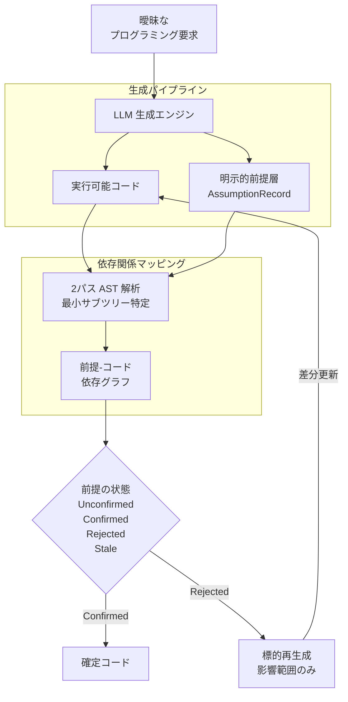
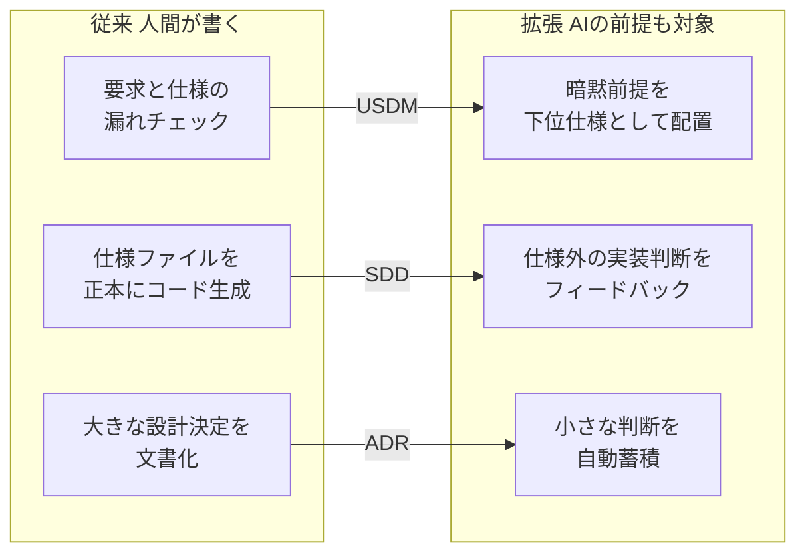

## この記事で扱うこと

LLM にコードを書かせると、プロンプトに書いていない部分は LLM が勝手に決めます。null が来たらどうするか、例外時に何を返すか、入力をどこまで検証するか。こうした判断は成果物のどこにも残らず、レビューでも見つかりません。

2026 年 7 月に arXiv で公開された論文 *AssumptionMiner: Extracting, Tracing, and Revising Implicit Assumptions in LLM Code Generation*（[arXiv:2607.22898](https://arxiv.org/abs/2607.22898)）は、この「暗黙の前提」をコードと並ぶ**第一級の成果物**として抽出・追跡・改訂する枠組みを提案しています。

この記事では次を扱います。

- 暗黙の前提が生む「動くが誤り」というバグの構造
- AssumptionMiner の 3 つの仕掛け（前提層 / AST 追跡 / 標的再生成）
- 論文が示す精度と、まだ解けていない課題
- 論文を待たずに今日のワークフローへ持ち込める部分

対象読者は、LLM にコードを書かせるチームで、レビューや仕様管理の設計に責任を持つ方です。

## なぜ「動くが誤り」が生まれるのか

自然言語のプロンプトは、仕様としてほぼ必ず不完全です（Under-specified）。「CSV を読み込んで集計する関数を書いて」と頼んだとき、次はどれも未指定のまま残ります。

| 未指定になりやすい軸 | LLM が黙って決めること |
|---|---|
| 入力検証 | 空ファイル・不正行を無視するか例外にするか |
| データ形式 | 区切り文字、文字コード、ヘッダの有無 |
| エラー処理 | 例外送出か、`None` 返却か、ログのみか |
| 永続化 | 一時ファイルの場所、上書き可否 |
| パフォーマンス | 全行メモリ展開か、ストリーム処理か |
| セキュリティ | パストラバーサル対策の有無 |

LLM はこれらを質問せず、もっともらしい既定値で埋めます。結果として、**単体テストは通るのに開発者の意図やチームの規約に反するコード**が出てきます。論文はこれを "working-but-wrong"（動くが誤り）と呼びます。

厄介なのは、この誤りが失敗として現れない点です。テストが赤くならないので CI では検出できず、コードを読んでも「そう書いてある」だけで、それが**意図した選択なのか埋め合わせなのか**が区別できません。

ソフトウェア工学の観点からは、Mary Shaw が指摘するように「バイブコーディングは現実世界の言語から機械の言語へのシフトを無視している」という問題の一断面と言えます。曖昧な人間の言語から厳密な機械の言語への変換は、必ずどこかで情報を補う必要があり、その補完が不可視のまま実装に焼き付いてしまうわけです。

### 既存アプローチとの違い

この課題への従来の打ち手は、生成**前**に質問させる方向でした。ClarifyGPT のような対話型の質問生成は、曖昧な要求を検出して開発者に確認します。

ただし事前質問には構造的な限界があります。

- 何が曖昧かを**生成前に**網羅できない
- 質問に答えた後の実装で、新たな前提が追加で発生する
- 一度答えた内容が、後のコード変更で失効しても追跡されない

AssumptionMiner は方向が違います。生成を止めずにコードを出させ、**同時に「何を仮定したか」を構造化データとして吐かせる**。そして、その前提とコードの対応関係を保持し続けます。事前の質問攻めではなく、事後のレビュー対象として前提を可視化する設計です。

## AssumptionMiner の全体像



要点は 3 つです。順に見ていきます。

### 1. 前提層をファーストクラスの成果物にする

LLM にコードだけでなく、推論・補完した設計選択の一覧（`AssumptionRecord`）を構造化データとして出力させます。前提は 6 カテゴリに分類されます。

1. 入力検証
2. データフォーマット
3. エラー処理方針
4. 永続化
5. パフォーマンス
6. セキュリティ

このタクソノミが効くのは、**レビューの視線を固定できる**からです。「何か見落としがないか」という漠然とした確認ではなく、「セキュリティ枠に何が入っているか」という具体的な問いに変わります。カテゴリごとにレビュー担当を割り当てることも、特定カテゴリだけを必ず人間確認にする運用も組めます。

### 2. AST ガイドで前提とコードを双方向に結ぶ

前提を列挙しただけでは、「この前提を変えたらどこが変わるのか」が分かりません。AssumptionMiner は 2 パスの解析でこれを解決します。

- **第 1 パス**: キーワードの重複から候補となるコード領域を粗く抽出
- **第 2 パス**: 抽象構文木（AST）上の最小サブツリーへ絞り込み

結果として、どの前提がどのコード領域を統制（govern）しているかの依存グラフが得られます。テキストの近さだけで対応づけると関数名の偶然一致に引きずられますが、構文木の構造で絞ることで「その前提が実際に効いている範囲」に寄せられる、という設計です。

### 3. 標的再生成で影響範囲だけを差し替える

開発者が前提をレビューして、修正（フリップ）または却下したとき、コード全体を作り直しません。AST で特定された影響領域だけを局所的に再生成します。

これは実運用上かなり大きい違いです。プロンプトを書き直して全体を再生成させると、指摘とは無関係の箇所まで変わってしまい、差分レビューが成立しません。「1 つの前提を直したら 1 か所だけ変わる」という対応関係が保てて初めて、前提のレビューが継続可能な作業になります。

### 前提のライフサイクル

前提には 4 つの状態が定義されています。

| 状態 | 意味 | 次にすること |
|---|---|---|
| Unconfirmed | LLM が自動補完した初期状態 | 開発者がレビューする |
| Confirmed | 開発者が検証し許可した状態 | そのまま確定コードへ |
| Rejected | 開発者が拒否し別仕様を要求した状態 | 標的再生成へ回す |
| Stale | コードや上位要件の変更で再検証が必要 | 再レビューへ差し戻す |

**Stale が入っている点が実務的**です。一度 Confirmed にした前提も、後続の変更で前提が崩れれば無効になります。承認済みの前提が永久に有効だと扱うと、確認作業がアリバイになってしまいます。状態を戻せる設計にしておくことで、前提が仕様として生き続けます。

## 論文が示した数字

評価のために、180 個の曖昧なプログラミングタスクと 676 個のアノテーション付き前提からなるデータセットが構築されています。

| 指標 | 値 | 補足 |
|---|---|---|
| 記述レベル抽出 F1 | 0.816 | 確信度加重アンサンブル使用。オフラインベースライン比 3.6 倍 |
| 判定レベル抽出 F1 | 0.66 | 厳格な設計判定単位での評価 |
| 1 タスクあたり平均前提数 | 3.8 個 | レビュー負荷の目安 |

記述レベル（テキストの類似度で「同じ前提を指しているか」を判定）では F1 = 0.816 と実用域に見えますが、**判定レベル（厳格な設計判定の単位で一致するか）では 0.66 に落ちます**。この差が示すのは、LLM は「前提らしき文」は書けても、「設計判断として正しい粒度」で切り出すのはまだ苦手だということです。

数字を読むときは、どちらのレベルの話かを必ず確認してください。0.816 だけを取り出すと、実装時の体感より楽観的な期待を持つことになります。

## 未解決の課題

論文自身が挙げる限界のうち、導入判断に効くものは 3 つです。

### 連鎖的編集の伝播

単一の前提を修正して該当関数を再生成したとき、**その関数を呼び出している他のモジュールやインターフェースへの影響が追従しない**リスクがあります。局所再生成の利点がそのまま弱点になる構図です。関数のシグネチャや戻り値の意味が変わる種類の前提修正では、依存グラフの外側で不整合が起きえます。

導入するなら、標的再生成の後に呼び出し側のテストを回す前提で組む必要があります。

### 粒度の壁

前述の判定レベル F1 = 0.66 です。抽出された前提が、レビューしたい単位とずれることが 3 回に 1 回程度は起きる計算になります。抽出結果をそのまま仕様書へ流し込むのではなく、人間が粒度を整える工程を残しておくのが現実的です。

### 認知負荷

1 タスクあたり平均 3.8 個の前提が出ます。すべてを手動確認させると、LLM 生成の速さという利点を打ち消します。**重要度に応じたフィルタリングが必須**です。

たとえばセキュリティと永続化のカテゴリだけは必ず人間確認、パフォーマンスは閾値を超えるときだけ、といったポリシーを先に決めておく。前提を全部見せることではなく、見るべき前提を選べることが運用の肝になります。

## 既存の仕様管理手法への接続

この枠組みが面白いのは、既存の要求定義・設計手法を「人間が明示的に書いた仕様」から「AI が補完した暗黙前提」へ拡張する筋道が見えることです。



- **USDM**（仕様の階層化・漏れ防止）: 従来は人間が要求と仕様の漏れを確認します。拡張すると、AI が補完した暗黙前提を「理由」や下位仕様として配置し、漏れを追跡可能にできます。
- **SDD**（仕様駆動開発）: 従来は OpenAPI や JSON Schema といった仕様ファイルを正本にコードを生成します。拡張すると、仕様ファイルに書かれていない実装上の判断を前提層として抽出し、仕様側のフィードバックループへ回せます。
- **ADR**（Architecture Decision Record）: 従来は大規模なアーキテクチャ決定を人間が文書化します。拡張すると、AI 生成コードに含まれる小さな設計決定（エラー処理方針、ライブラリ選択の仮定など）を Micro-ADR として自動蓄積できます。

いずれも「決定の記録」という同じ性質を持つ以上、記録の生成元が人間か AI かは本質的な差ではない、という見立てです。

## 実装を待たずに取り込めること

論文の実装をそのまま導入しなくても、考え方だけを移植できます。負荷の低い順に 2 つ挙げます。

### 1. 生成プロンプトに前提の出力を足す

コード生成用のシステムプロンプトに、コードと同時に前提配列を出させる指示を加えます。

```text
コードを出力する際は、あわせて JSON 形式で assumptions 配列を出力してください。
各要素は次のフィールドを持ちます。

- assumption: 補完した前提の内容（1 文）
- category: input_validation | data_format | error_handling |
            persistence | performance | security のいずれか
- target: その前提が効いている関数名または行範囲
- confidence: high | medium | low

プロンプトに明示されていた事項は含めず、あなたが判断で補った事項のみを挙げてください。
```

最後の 1 行が重要です。これを外すと、プロンプトに書いた内容の復唱で配列が埋まり、**本当に見たい「勝手に決めた部分」が埋もれます**。

まずは `category` が `security` と `error_handling` のものだけ目を通す、といった絞り込みから始めると、認知負荷の問題を避けながら効果を確認できます。

### 2. 前提をレビューの対象物として置く

生成された `assumptions.json` をコミット対象に含め、PR レビューで「AI がどんな暗黙前提を置いてこのコードを書いたか」をレビュアーが確認できるようにします。

差分として見えるようになると、次が起きます。

- 前提が変わった PR で、コード差分より先に前提差分が目に入る
- レビューコメントが「この行おかしくない?」から「この前提でいいの?」に変わる
- 却下された前提が履歴として残り、同じ議論を繰り返さずに済む

論文の Stale 状態に相当する運用は、まずは手動で構いません。上位の仕様を変えたときに、関連する前提へ再確認のフラグを立てるだけでも、承認のアリバイ化は防げます。

なお、この 2 つはいずれも**抽出精度に依存しません**。LLM の前提抽出が粗くても、「前提を書き出させる」「それを差分として見る」という構造自体が、隠れていた判断を表に出す効果を持ちます。精度の壁は論文側の課題として残る一方、運用の骨格は今日から試せます。

## まとめ

- LLM へのプロンプトは常に不完全で、埋められなかった部分は LLM が黙って決める。結果として「テストは通るが意図に反する」誤りが生まれる
- AssumptionMiner は、その暗黙前提をコードと並ぶ成果物として構造化出力させ、AST ガイドの依存グラフでコードと双方向に結び、修正時は影響範囲だけを再生成する
- 精度は記述レベル F1 = 0.816 に対し、判定レベルでは 0.66。粒度の正しさはまだ課題で、人間が整える工程は残る
- 連鎖的編集の伝播、粒度、認知負荷（平均 3.8 前提/タスク）が未解決。カテゴリ単位のフィルタリング方針を先に決める必要がある
- USDM / SDD / ADR は、対象を「人間が書いた仕様」から「AI が補完した前提」へ広げる形で接続できる
- 実装を待たずとも、プロンプトへ `assumptions` 配列の出力を足し、それを PR レビューの対象物として置くところから始められる

「AI にコードを書かせる」という判断をするとき、速さの対価として何を見えなくしているかを把握しておくことは、発注する側の責任範囲に入ります。前提を成果物にするという発想は、その見えない部分を検査可能な形に戻すための、素直で有効なアプローチだと考えます。

## 参考リンク

- [arXiv:2607.22898 — AssumptionMiner: Extracting, Tracing, and Revising Implicit Assumptions in LLM Code Generation](https://arxiv.org/abs/2607.22898)
- [Replication Package (Zenodo DOI: 10.5281/zenodo.21535058)](https://doi.org/10.5281/zenodo.21535058)
