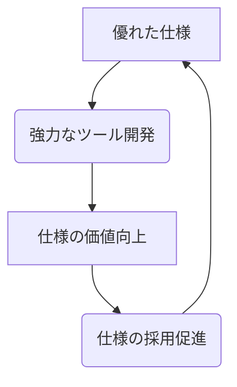

AsyncAPI 3.0は、現代のイベント駆動アーキテクチャ（EDA）における非同期APIのガバナンス課題を解決するための重要なマイルストーンです。

この記事では、AsyncAPI 3.0の仕様詳細、エコシステム、実践的応用、そして導入戦略について、技術リーダーやアーキテクト向けに包括的な情報を整理します。


## 序論: EDAの進化とAsyncAPI 3.0の戦略的重要性

### イベント駆動アーキテクチャ（EDA）の台頭

現代のソフトウェア開発では、従来の同期的なリクエスト/レスポンスモデルから、非同期のイベント駆動パターンへの移行が加速しています。この変化は、マイクロサービスやIoTアプリケーションが要求するスケーラビリティ、回復力、リアルタイム応答性に応えるために必要です。

EDAは、コンポーネント間の直接的な依存関係を排除します。これにより、分散システム全体の柔軟性と耐障害性を向上させる効果的な解決策として広く採用されています。

### EDAにおけるガバナンスの欠如

しかし、EDAの普及は新たな課題を生みました。非同期APIを標準的かつ機械可読な方法で定義し、統制するための共通言語が存在しなかった点です。

RESTful APIの世界では、OpenAPIがこの役割を果たし、APIの設計、ドキュメント化、テスト、コード生成を標準化しました。一方で、非同期通信の世界では、ドキュメントのフォーマットや命名規則が統一されず、一貫性が欠如していました。

この状況は、サービスの発見可能性を低下させ、チーム間の連携を妨げ、メンテナンスコストを増大させます。この「ガバナンスの欠如」こそが、AsyncAPIが解決する核心的な課題です。

### マイルストーンとしてのAsyncAPI 3.0

AsyncAPIは、この課題を解決する業界標準仕様として登場しました。2023年12月にリリースされたバージョン3.0は、仕様の成熟度を飛躍的に高める重要なマイルストーンです。

以降では、AsyncAPI 3.0の以下の点を詳述します。

  * 仕様の核となる構造のパラダイムシフト
  * 仕様駆動のライフサイクルを可能にする堅牢なツーリングエコシステム
  * エンタープライズ規模のアプリケーションにおける実証済みの価値


## 第1章: AsyncAPI 3.0仕様

本章では、AsyncAPI 3.0仕様の中核となる概念と、このバージョンを定義づける重要な変更点を解説します。

### 1.1 中核となる概念と目的

#### APIを「契約」として定義する

AsyncAPIドキュメントは、メッセージ駆動型APIのための機械可読な「契約書」として機能します。これは、サービス間の通信ルールを厳密に定義するものです。

大きな特徴は、プロトコルに依存しない（protocol-agnostic）点です。これにより、Apache Kafka、MQTT、AMQP、WebSocketsなど、多岐にわたるプロトコル上で動作するAPIを記述でき、極めて高い汎用性を実現しています。

この契約書に基づき、プロデューサー（送信側）とコンシューマー（受信側）は、独立して開発を進めることができます。

#### ファイルフォーマットと構造

AsyncAPIドキュメントは、YAMLまたはJSON形式で記述します。一般的には、可読性が高いYAML 1.2の使用を推奨します。

ドキュメントは単一ファイルでも記述できますが、`$ref`キーワードを用いて複数のファイルに分割し、再利用性を高めることも可能です。このモジュール性により、大規模なシステムでもコンポーネントを整理し、管理しやすい状態を維持できます。

### 1.2 ドキュメントの構造と主要コンポーネント

AsyncAPI 3.0ドキュメントを構成する主要なオブジェクトの役割を、「ユーザー登録（userSignedUp）」イベントを例に解説します。

  * **asyncapi**: 仕様バージョンの明記（必須）。（例: `3.0.0`）
  * **info**: APIの基本メタデータ（必須）。（例: `title`, `version`）
  * **servers**: メッセージブローカーやサーバーへの接続情報。（例: `host`, `protocol`）
  * **channels**: メッセージが流れる経路（トピック、キュー）の再利用可能な定義。
  * **operations**: バージョン3.0の根幹。アプリケーションが「何をするか」（`send`または`receive`）を定義し、振る舞いとチャネルを結びつける。
  * **messages**: 送受信されるデータ（payload、headers）の定義。ペイロードのスキーマは、AsyncAPI Schema、Avro、Protobufなどで定義可能。
  * **components**: 再利用性を実現するためのライブラリ。`messages`や`schemas`などを定義し、他から`$ref`で参照する。

### 1.3 バージョン3.0におけるパラダイムシフト

バージョン3.0の変更は、仕様の根底にある思想そのものを変える戦略的なものです。

#### オペレーションとチャネルの分離

最も重要な変更点は、`operations`（操作）が`channels`（チャネル）から分離されたことです。

  * **v2.x**: `publish`や`subscribe`操作がチャネル定義内にネスト。チャネルの再利用性が低く、トランスポート層とアプリケーションロジックが密結合。
  * **v3.0**: `operations`がトップレベルのオブジェクトに変更。チャネルを`$ref`で「参照」する形。

この「関心の分離」により、チャネル（例：特定のKafkaトピック）を一度定義すれば、複数のオペレーションや異なるマイクロサービスから再利用できます。これは、大規模なEDAにおける定義の重複を排除し、一貫性を保つ上で大きな進歩です。

#### publish/subscribeからsend/receiveへ: 曖昧さの解消

バージョン2.xで混乱の最大の原因だった`publish`と`subscribe`という用語を廃止しました。

v2.xは「チャネル中心」で記述され、一つのチャネル定義内に `publish` と `subscribe` が混在可能でした。このため、仕様書を読む人の立場（送信側か受信側か）によって、`publish` という言葉が「自分が行う送信」なのか「相手が行う操作（=自分は受信）」なのか、**視点によって意味が反転**し、曖昧でした。

バージョン3.0では、`operations`オブジェクト内に`action`プロパティを導入し、`send`（送信）または`receive`（受信）を使用します。この定義は明確に「**アプリケーション中心**」です。記述されているアプリケーションがメッセージを送信するのか、受信するのかを明確に示します。

#### ネイティブなリクエスト/リプライパターンのサポート

多くの実用的なユースケースで必要なリクエスト/リプライパターンを、バージョン3.0で正式にサポートしました。`operations`オブジェクト内の`reply`オブジェクトを通じて実現します。これにより、応答チャネルや相関IDのロジックを簡潔かつ明確に定義できます。

#### v2.xとv3.0の比較

| 機能領域 | v2.xのアプローチ | v3.0のアプローチ | 理由と戦略的利点 |
| :--- | :--- | :--- | :--- |
| **オペレーション** | `publish`と`subscribe`が`channels`内にネスト。視点（主語）が曖昧。 | トップレベルの`operations`オブジェクトに`action: send/receive`を定義。`channel`を参照。 | **明確性とオーナーシップ**: 曖昧さを排除し、「アプリケーション中心」の視点を徹底。単一サービスチームがAPI契約を所有可能。 |
| **チャネルの再利用性** | 低い。チャネルは特定のアプリケーション操作に束縛。 | 高い。チャネルは分離され、メッセージの宛先として再利用可能な定義。 | **効率性と一貫性**: チャネル定義を複数のサービスやオペレーションで再利用でき、重複を排除。 |
| **リクエスト/リプライ** | ネイティブサポートなし。回避策が必要。 | `operations`内の`reply`オブジェクトを通じてネイティブにサポート。 | **完全性**: 現実世界の重要な非同期パターンをモデル化でき、仕様の表現力が向上。 |
| **チャネルID** | チャネルのアドレス（例：`user/signedup`）がキー/ID。 | キーは任意のユニークID。アドレスは`address`プロパティで定義。 | **柔軟性**: 同じアドレスを異なるコンテキストで、異なるチャネル定義として使用可能になり、モデリングの柔軟性が向上。 |

#### 「アプリケーション中心」への思想的転換

バージョン3.0の一連の変更は、従来の「チャネル中心」視点から、「**アプリケーション中心**」の視点への意図的な転換を表しています。

これにより、**1つのAsyncAPIファイルは、1つの特定のアプリケーション（サービス）の契約書**である、という「主語」が明確になりました。仕様書には、そのアプリケーションが行う操作（`action: send` または `action: receive`）のみを記述します。

この転換は、より優れたガバナンスを実現します。一つのドキュメントが単一サービスの振る舞いを明確に定義することで、そのサービスの開発チームはAPI契約に完全なオーナーシップを持てます。これは、スケーラブルな「分散型ガバナンスモデル」を実現する上で不可欠です。


## 第2章: AsyncAPIエコシステムと関連ツール

AsyncAPIは単なる仕様書ではなく、イベント駆動APIのライフサイクル全体をサポートする成熟したエコシステムです。仕様とツールが密接に連携して開発されています。

### 仕様駆動開発のフライホイール効果

仕様とツールの共生関係は、「仕様駆動開発のフライホイール効果」を生み出します。



<br>

| 要素名 | 説明 |
| :--- | :--- |
| **優れた仕様** | AsyncAPI 3.0のような明確で強力な仕様の定義。 |
| **強力なツール開発** | 仕様に基づき、コード生成やバリデーションなど、価値あるツールが開発される。 |
| **仕様の価値向上** | 強力なツール群が仕様自体の実用的な価値を高める。 |
| **仕様の採用促進** | 価値が高まることで、より多くの開発者や組織が仕様を採用する。採用が広がると、さらに仕様が洗練される（Aに戻る）。 |

<br>

この好循環により、AsyncAPIは単なるドキュメント標準から、仕様駆動開発ライフサイクルのためのプラットフォームへと昇華します。AsyncAPIドキュメントは、ドキュメント、コード、テスト、インフラの「信頼できる唯一の情報源（Single Source of Truth）」となります。

### ライフサイクルと主要ツール

| ライフサイクル段階 | ツール名 | 主要な機能 | サポートするアプローチ |
| :--- | :--- | :--- | :--- |
| **設計・オーサリング** | AsyncAPI Studio | ビジュアルエディタ、リアルタイムバリデーション、ドキュメントプレビュー | デザインファースト |
| **バリデーション** | AsyncAPI CLI | 仕様準拠のコマンドライン検証。CI/CDに最適。 | 両方 |
| **ガバナンス** | Spectral | カスタムのスタイルガイドやガバナンスルールを適用するリンター。 | デザインファースト |
| **コード生成** | AsyncAPI Generator | テンプレートに基づきサーバー/クライアントの定型コードを生成（Java, Python, Go等）。 | デザインファースト |
| **モデル生成** | Modelina | スキーマから型付けされたデータモデルを生成。 | デザインファースト |
| **ドキュメント生成** | HTML/Markdown Templates | Generatorを介して静的なHTMLやMarkdownドキュメントを生成。 | デザインファースト |
| **UIレンダリング** | asyncapi-react | Webアプリ内でインタラクティブなドキュメントをレンダリング。 | デザインファースト |
| **コードから仕様生成** | Springwolf, Saunter | 既存のコードベース（Spring,.NET）からAsyncAPIドキュメントを生成。 | コードファースト |
| **ランタイムバリデーション** | asyncapi-validator | アプリケーション内でメッセージペイロードをランタイム時に検証。 | 両方 |

### 2.1 設計、バリデーション、ガバナンス

  * **AsyncAPI Studio（設計）**: AsyncAPIドキュメントをリアルタイムで作成、検証、視覚化するWebベースのツールです。YAMLを記述すると、プレビューやバリデーション結果が即座に表示され、エラーを迅速に修正できます。
  * **AsyncAPI CLI（バリデーション）**: `asyncapi validate`コマンドを提供し、ローカル環境やCI/CDパイプラインで仕様準拠を検証します。公式のJavaScriptパーサーやGoパーサーによるプログラム検証も可能です。
  * **Spectral（ガバナンス）**: 仕様準拠に加え、「`summary`フィールドを必須にする」といった組織独自のルール（スタイルガイド）を適用するリンティングツールです。静的解析により、大規模組織でもAPI設計の一貫性と品質を維持します。

### 2.2 コード生成とモデリング

  * **AsyncAPI Generator（コード生成）**: AsyncAPIドキュメントから定型コード（クライアント/サーバー）を生成する中心的なツールです。テンプレートベースで、Java、Python、Go、Springフレームワークなど多様な言語や環境に対応します。
  * **Modelina（データモデル生成）**: `components/schemas`で定義されたスキーマから、型付けされたデータモデル（DTOやPOJO）を生成することに特化したツールです。コード内のデータ構造と仕様の同期を保証し、型安全性を向上させます。
  * **asyncapi-validator（メッセージバリデーション）**: アプリケーションのランタイムで使用するライブラリです。送受信するメッセージペイロードがスキーマに準拠しているかを実行時に検証し、データの完全性とシステムの堅牢性を高めます。

### 2.3 UIコンポーネントとコミュニティリソース

  * **asyncapi-react（ドキュメントレンダリング）**: AsyncAPIファイルからインタラクティブなHTMLドキュメントをレンダリングする公式Reactコンポーネントです。開発者ポータルへの組み込みに適しています。
  * **コミュニティと学習リソース**: AsyncAPIイニシアチブは、Linux Foundation傘下の活発なオープンソースコミュニティによって支えられています。公式Slack、詳細なドキュメント、チュートリアル、GitHubリポジトリなどが、開発者の学習と活用を強力にサポートします。


## 第3章: 実践的な応用とユースケース分析

本章では、AsyncAPI 3.0が現実世界のシナリオでどのように適用されているかを探ります。

### 3.1 主要なアーキテクチャパターン

#### マイクロサービス

AsyncAPIは、マイクロサービス間のイベントベース通信のドキュメント化に最適です。v3.0の「アプリケーション中心」の思想に基づくベストプラクティスは、**マイクロサービスごとに一つのAsyncAPIファイルを作成する**ことです。

各ファイルは、そのサービスが「主語」となり、イベントを `send` するのか `receive` するのかを明確に定義します。これにより、サービスの境界が明確になり、インターフェースが「契約」として確立されます。共有メッセージスキーマなどは、`$ref`を用いて共通ファイルから参照し、一貫性を保ちます。（詳細は第4章）

#### Internet of Things (IoT)

公式の「Streetlights（街灯）」チュートリアルは、IoTユースケースの典型例です。多数のデバイス（街灯センサー）からMQTTブローカー経由で送信されるテレメトリデータ（照度測定値）を受信するアプリケーションをモデル化します。

このパターンは、あらゆる種類のIoTシナリオに応用可能です。AsyncAPIは、デバイスとバックエンドシステム間の非同期通信を標準化し、相互運用性を確保します。

### 3.2 企業における導入事例

  * **TransferGo（フィンテック）**:
      * **アプローチ**: コードファーストから開始し、DTOから仕様を自動生成。
      * **進化**: ガバナンスの重要性が増し、CIパイプラインにスキーマバリデーションや契約テスト（Microcks）を導入。
      * **現在**: AsyncAPI仕様を信頼できる情報源とし、開発者ポータル（Port.io）を構築。イベントの発見可能性を一元化。
  * **IBM（エンタープライズソフトウェア）**:
      * **アプローチ**: 自社製品「Event Endpoint Management」の中核にAsyncAPIを採用し、Kafkaトピックの記述とガバナンスに活用。
      * **特徴**: バージョン3.0リリース後、迅速にその生成をサポートし、オープンソースのジェネレーターテンプレートにも貢献。
  * **ADEO（小売）**:
      * **アプローチ**: CI/CDパイプラインに統合されたデザインファーストを実践。
      * **特徴**: Gitリポジトリ内のAsyncAPIファイルからHTMLドキュメントを自動生成。Avroスキーマを`$ref`で参照し、コードとドキュメントの同期を保証。リクエスト/リプライパターンを仕様内で明確に文書化。

### 3.3 ハイブリッドアーキテクチャにおけるOpenAPIとの連携戦略

現代のシステムは、同期API（OpenAPIで管理）と非同期イベント（AsyncAPIで管理）が混在するハイブリッドアーキテクチャが一般的です。

この複雑性を管理する鍵は、DRY原則（Don't Repeat Yourself）に従い、データモデルの信頼できる情報源を一つに保つことです。

ベストプラクティスは、`User`や`Order`といった共通のデータスキーマを、独立したJSON Schemaファイルとして定義することです。そして、OpenAPIドキュメントと複数のAsyncAPIドキュメントの両方から、`$ref`キーワードを用いてこれらの共有スキーマファイルを参照します。

このアプローチにより、「仕様のドリフト」（同期APIと非同期APIで同じモデルの定義が乖離する問題）を防ぎ、システム全体の一貫性を維持できます。


## 第4章: 導入と運用のための戦略

本章では、組織内でAsyncAPIを成功裏に導入・運用するための戦略的な指針を提供します。

### 4.1 開発アプローチの選択: デザインファースト vs. コードファースト

AsyncAPIエコシステムは、どちらか一方のアプローチを強制せず、両方をサポートする柔軟性を持ちます。

#### デザインファースト（コントラクトファースト）

コードを書く前に、APIの契約書であるAsyncAPIファイルを作成するアプローチです。

  * **利点**:
      * チーム間のコラボレーション促進。
      * 早期のフィードバック獲得。
      * コンシューマーによるモック生成と並行開発が可能。
      * 技術的負債の削減。
      * 強力なガバナンスの実現。
  * **欠点**:
      * 初期計画に時間が必要。
      * 開発開始が遅れる感覚。

#### コードファースト

まずコードを実装し、そのアノテーションや構造からAsyncAPIドキュメントを生成するアプローチです。

  * **利点**:
      * 迅速な開発開始（特にプロトタイプや既存プロジェクト）。
      * ドキュメントと実装の常時一致。
  * **推奨ケース**:
      * 既存システムのドキュメント化。
      * 小規模チーム。
      * 迅速なプロトタイピング。

#### 意思決定フレームワーク

  * **デザインファーストを選択**: 新規開発で、複数のステークホルダーが関与する複雑なシステム。
  * **コードファーストを選択**: 既存システムのドキュメント化や、迅速なプロトタイピング。

組織は、まずコードファーストで既存システムをドキュメント化し、その後、新規プロジェクトでデザインファーストに移行する、といった段階的な導入戦略も可能です。

### 4.2 契約リポジトリとスキーマ管理

v3.0の「1サービス＝1ファイル」アプローチを採用すると、異なるサービス（例：送信側と受信側）が共通のメッセージスキーマをどのように同期させるか、という課題が生じます。

この課題は、`$ref`による外部参照機能とGitを組み合わせた「**契約リポジトリ**」アプローチによって解決します。これは、EDAガバナンスにおけるベストプラクティスです。

#### 契約リポジトリによる共通定義の管理

中央のGitリポジトリ（例: `contract-repo`）を「信頼できる唯一の情報源（SSoT）」として用意します。このリポジトリの構造を以下のように分割します。

```plaintext
contract-repo/
│
├── common/                # 2チームで合意が必要な「共通定義」
│   ├── schemas/
│   │   └── userSignedUpPayload.v1.yaml
│   ├── messages/
│   │   └── userSignedUp.v1.yaml
│   └── channels/
│       └── user_registered.v1.yaml
│
└── services/              # 各チームが「自分の使い方」を宣言する場所
    ├── user-service/
    │   └── asyncapi.yaml    (action: send を記述)
    │
    └── email-service/
        └── asyncapi.yaml    (action: receive を記述)
```

  * **`common/`**:
      * 全チームで合意が必要な「共通定義」を配置します。
      * `messages/`、`schemas/`、`channels/` といった単位で分割します。
      * 例: `common/schemas/userSignedUpPayload.v1.yaml`
  * **`services/`**:
      * 各サービスチームがオーナーシップを持つ「サービス固有の定義」を配置します。
      * 例: `services/user-service/asyncapi.yaml`
      * このファイルは、`info` でサービス名を定義し、`operations` で `action: send` を宣言し、`messages` として `$ref: ../../common/messages/userSignedUp.v1.yaml` のように共通定義を参照します。

この運用により、定義の重複を排除し、全サービス間での一貫性を強制できます。

#### 4.2.1 具体的な定義サンプル

`contract-repo` アプローチを、具体的なファイルサンプルで示します。
（※ディレクトリ構造をシンプルにするため、ここでは共通定義を1ファイルにまとめています）

##### 1\. 共通定義ファイル (common/)

まず、サービス間で共有する定義（スキーマ、メッセージ、チャネル）をファイルに切り出します。

```yaml
# 
# ファイル名: common/common-definitions.v1.yaml
#
asyncapi: 3.0.0
info:
  title: 共有定義ライブラリ
  version: 1.0.0

# このファイルは定義のライブラリであり、
# サーバーやオペレーションは持たない

channels:
  userRegisteredChannel:
    address: user_registered
    description: ユーザー登録イベントが流れるチャネル

components:
  messages:
    userSignedUp:
      payload:
        $ref: '#/components/schemas/userSignedUpPayload'
  
  schemas:
    userSignedUpPayload:
      type: object
      properties:
        userId:
          type: string
          format: uuid
        email:
          type: string
          format: email
```

##### 2\. 送信側サービス (services/)

送信側（ユーザーサービス）は、自分の仕様書で `action: send` を宣言し、共通ファイルを `$ref` で参照します。

```yaml
# 
# ファイル名: services/user-service/asyncapi.yaml
#
asyncapi: 3.0.0
info:
  title: ユーザーサービス API
  version: 1.0.0
  description: ユーザー登録イベントを送信するサービス

servers:
  production:
    host: kafka.example.com:9092
    protocol: kafka

operations:
  sendUserSignUpEvent:
    action: send
    channel:
      # 共通のチャネル定義を参照
      $ref: '../../common/common-definitions.v1.yaml#/channels/userRegisteredChannel'
    messages:
      # 共通のメッセージ定義を参照
      - $ref: '../../common/common-definitions.v1.yaml#/components/messages/userSignedUp'

# このファイル固有のcomponentsは無いため、セクションごと削除
```

##### 3\. 受信側サービス (services/)

受信側（メールサービス）も同様に、自分の仕様書で `action: receive` を宣言し、全く同じ共通ファイルを参照します。

```yaml
# 
# ファイル名: services/email-service/asyncapi.yaml
#
asyncapi: 3.0.0
info:
  title: メールサービス API
  version: 1.0.0
  description: ユーザー登録イベントを受信してメールを送信するサービス

servers:
  production:
    host: kafka.example.com:9092
    protocol: kafka

operations:
  receiveUserSignUpEvent:
    action: receive
    channel:
      # 共通のチャネル定義を参照
      $ref: '../../common/common-definitions.v1.yaml#/channels/userRegisteredChannel'
    messages:
      # 共通のメッセージ定義を参照
      - $ref: '../../common/common-definitions.v1.yaml#/components/messages/userSignedUp'
```

#### 4.2.2 Git-Opsによる合意形成ワークフロー

契約リポジトリの運用は、GitのPull Request (PR) ベースで行い、チーム間の合意形成をプロセス化します。

1.  **共通定義の変更 (相談・合意)**:
      * `common/` ディレクトリへの変更PRは、関係する全チーム（送信側と受信側）のレビューと合意 (Approve) を必須とします。
      * これにより、スキーマ変更が他チームに与える影響について、マージ前に「相談して確定する」プロセスが保証されます。
2.  **サービス定義の変更 (宣言)**:
      * 各チームは、`services/` 配下の自分のファイルに「どの共通定義を `send` / `receive` するか」を宣言するPRを作成します。
3.  **CIによる自動化**:
      * PRが作成されると、CI (継続的インテグレーション) が自動で `asyncapi validate` を実行します。
      * これにより、構文エラー、`$ref` のリンク切れ、ガバナンスルール違反（例：Spectralによるリンティング）を自動的に検知できます。

### 4.3 バージョニング戦略

EDAにおける破壊的変更は、未知の多数のコンシューマーに影響を与える可能性があり、その影響は甚大です。

#### 時間的デカップリング

チャネル名にメジャーバージョンを含める（例：`user_registered.v1`、`user_registered.v2`）プラクティスは、単なる命名規則ではなく、アーキテクチャパターンです。

これは「時間的デカップリング」を実現します。イベントの2つのバージョンがシステム内に共存可能となり、コンシューマーは自身のペースで新しいバージョンへ移行できます。これにより、分散システム全体の長期的な進化可能性と回復力を保証します。

#### APIのバージョニング戦略

  * `info.version`フィールドにセマンティックバージョニング（SemVer）を採用します。
  * CI/CDパイプラインでConventional Commitsを利用し、コミットメッセージ（`feat:`, `fix:`, `BREAKING CHANGE:`）から適切なバージョン（パッチ、マイナー、メジャー）を自動的にインクリメントします。

### 4.4 旧バージョンからの移行ガイド

旧バージョンからバージョン3.0への移行には、主にAsyncAPI Converterツールを使用します。

#### 自動変換

以下のCLIコマンドで、多くの構造的な変更を自動で処理します。

```bash
asyncapi convert asyncapi.yaml --target-version=3.0.0 --output=new-asyncapi.yaml
```

#### 手動レビューのチェックリスト

コンバーター実行後、意図が正しく変換されているかを確認するために手動レビューが不可欠です。

  * **オペレーションの確認**:
      * `publish`/`subscribe`が、アプリケーション視点で正しく`send`/`receive`アクションに変換されているか。
  * **チャネルの分離**:
      * チャネルがオペレーションから分離され、オペレーションから正しく参照されているか。
  * **チャネルIDとアドレス**:
      * チャネルのキーがユニークIDに変換され、トピック名やキュー名が`address`プロパティに正しく設定されているか。
  * **リクエスト/リプライパターン**:
      * 既存のパターンが、新しいネイティブの`reply`オブジェクトで、より簡潔に表現できないか検討。
  * **参照の有効性**:
      * 構造変更後も、すべての`$ref`参照が依然として有効であるか。


## まとめ

### 戦略的価値の要約

AsyncAPI 3.0は、そのアプリケーション中心のモデルと成熟したツーリングエコシステムにより、単なるドキュメントフォーマットを超えた存在へと進化しました。

  * `operations`と`channels`の分離は、再利用性と明確性を劇的に向上させました。
  * `send`/`receive`への変更は、「視点が反転する」という長年の混乱を解消し、仕様書の「主語」を固定しました。
  * ネイティブなリクエスト/リプライのサポートは、仕様の表現力を現実世界の要求に近づけました。

AsyncAPI 3.0は今や、イベント駆動アーキテクチャのための仕様駆動開発ライフサイクルを実現し、より優れた設計、迅速な開発、そして堅牢なガバナンスを可能にする基盤技術です。

### 将来展望

AsyncAPIの未来は、強力なコミュニティとエコシステムの成長にかかっています。ツールの継続的な進化、クラウドプラットフォームとの統合、そしてLinux Foundationによる安定したガバナンス体制は、AsyncAPIが次世代の分散システムにおける業界標準となることを示唆しています。

したがって、AsyncAPI 3.0の採用は、単なる技術的な選択ではありません。それは、組織が構築するイベント駆動アーキテクチャの安定性、スケーラビリティ、そして長期的なメンテナンス性に対する、戦略的な投資です。

この記事が、あなたの組織のイベント駆動アーキテクチャを前に進める一助になれば幸いです。

少しでも参考になった、あるいは改善点などがあれば、ぜひリアクションやコメント、SNSでのシェアをいただけると励みになります！


-----

## 参考文献

  * **公式ドキュメント・仕様**
      * [AsyncAPI Initiative for event-driven APIs | AsyncAPI Initiative for event-driven APIs](https://www.asyncapi.com/)
      * [Introduction | AsyncAPI Initiative for event-driven APIs](https://www.asyncapi.com/docs/concepts/asyncapi-document)
      * [AsyncAPI document structure | AsyncAPI Initiative for event-driven APIs](https://www.asyncapi.com/docs/concepts/asyncapi-document/structure)
      * [Application | AsyncAPI Initiative for event-driven APIs](https://www.asyncapi.com/docs/concepts/application)
      * [Payload schema | AsyncAPI Initiative for event-driven APIs](https://www.asyncapi.com/docs/concepts/asyncapi-document/define-payload)
      * [3.0.0 | AsyncAPI Initiative for event-driven APIs](https://www.asyncapi.com/docs/reference/specification/latest)
      * [The AsyncAPI specification allows you to create machine-readable definitions of your asynchronous APIs. - GitHub](https://github.com/asyncapi/spec)
      * [Overview | AsyncAPI Initiative for event-driven APIs](https://www.asyncapi.com/docs/tutorials)
      * [AsyncAPI docs community](https://www.asyncapi.com/docs/community/onboarding-guide/docs-community)
  * **v3.0解説・移行ガイド**
      * [AsyncAPI 3.0.0 Release Notes | AsyncAPI Initiative for event-driven ...](https://www.asyncapi.com/blog/release-notes-3.0.0)
      * [What's New in AsyncAPI v3.0? - Nordic APIs](https://nordicapis.com/whats-new-in-asyncapi-v3-0/)
      * [How to Write a v3 AsyncAPI Description - Nordic APIs](https://nordicapis.com/how-to-write-a-v3-asyncapi-description/)
      * [AsyncAPI gets a new version 3.0 and new operations - Atamel.Dev](https://atamel.dev/posts/2024/05-13_asyncapi_30_send_receive/)
      * [AsyncAPI v3: What's New? with Dale Lane and Salma Saeed - Confluent](https://www.confluent.io/events/kafka-summit-london-2024/asyncapi-v3-whats-new/)
      * [AsyncAPI v3 is here - IBM TechXchange Community](https://community.ibm.com/community/user/blogs/dale-lane1/2023/12/06/asyncapi-v3-is-here)
      * [AsyncAPI V3 with Fran Méndez - InfoQ](https://www.infoq.com/podcasts/fran-mendez-asyncapi-v3/)
      * [AsyncAPI 3.0: What's new and should you upgrade? - YouTube](https://www.youtube.com/watch?v=9TpOTmHpqVI)
      * [AsyncAPI 3.0 - The Cheat Sheet | Bump.sh Docs & Guides](https://docs.bump.sh/guides/asyncapi/cheatsheet/)
      * [Overview | AsyncAPI Initiative for event-driven APIs](https://www.asyncapi.com/docs/migration)
      * [Migrating to v3 | AsyncAPI Initiative for event-driven APIs](https://www.asyncapi.com/docs/migration/migrating-to-v3)
  * **ツール・エコシステム**
      * [Tools | AsyncAPI Initiative for event-driven APIs](https://www.asyncapi.com/tools)
      * [AsyncAPI Studio](https://studio.asyncapi.com/)
      * [Validate AsyncAPI documents | AsyncAPI Initiative for event-driven ...](https://www.asyncapi.com/docs/guides/validate)
      * [Validate AsyncAPI document with Studio](https://www.asyncapi.com/docs/tutorials/studio-document-validation)
      * [Generator | AsyncAPI Initiative for event-driven APIs](https://www.asyncapi.com/tools/generator)
      * [asyncapi/generator: Use your AsyncAPI definition to generate literally anything. Markdown documentation, Node.js code, HTML documentation, anything\! - GitHub](https://github.com/asyncapi/generator)
      * [Message validation | AsyncAPI Initiative for event-driven APIs](https://www.asyncapi.com/docs/guides/message-validation)
      * [asyncapi-validator - NPM](https://www.npmjs.com/package/asyncapi-validator)
      * [asyncapi/asyncapi-react: React component for rendering documentation from your specification in real-time in the browser. It also provides a WebComponent and bundle for Angular and Vue - GitHub](https://github.com/asyncapi/asyncapi-react)
      * [8+ AsyncAPI Documentation Generators - Nordic APIs](https://nordicapis.com/8-asyncapi-documentation-generators/)
      * [Convert to or migrate between AsyncAPI versions with the converter - GitHub](https://github.com/asyncapi/converter-js)
  * **ベストプラクティス・運用**
      * [A straight guide to APIs and architecture concepts - AsyncAPI](https://www.asyncapi.com/blog/a_straight_guide_to_apis_and_architecture_concepts)
      * [Organizing your AsyncAPI documents | AsyncAPI Initiative for event ...](https://www.asyncapi.com/blog/organizing-asyncapi-documents)
      * [Reusable parts | AsyncAPI Initiative for event-driven APIs](https://www.asyncapi.com/docs/concepts/asyncapi-document/reusable-parts)
      * [Reusability with traits | AsyncAPI Initiative for event-driven APIs](https://www.asyncapi.com/docs/concepts/asyncapi-document/reusability-with-traits)
      * [Coming from OpenAPI | AsyncAPI Initiative for event-driven APIs](https://www.asyncapi.com/docs/tutorials/getting-started/coming-from-openapi)
      * [AsyncAPI vs. OpenAPI: Which Specification Is Right for Your App? - Bump.sh](https://bump.sh/blog/asyncapi-vs-openapi)
      * [Unifying OpenAPI & AsyncAPI : Designing JSON Schemas+Examples - Specmatic](https://specmatic.io/appearance/unifying-openapi-asyncapi-designing-json-schemas/)
      * [Share models between AsyncAPI and RESTful APIs? - Software Engineering Stack Exchange](https://softwareengineering.stackexchange.com/questions/432784/share-models-between-asyncapi-and-restful-apis)
      * [OpenAPI & AsyncAPI $ref: Advanced Guide - Bump.sh](https://bump.sh/blog/openapi-asyncapi-ref-usage-guide/)
      * [API Design First vs Code First: Choose Your Strategy - codecentric AG](https://www.codecentric.de/en/knowledge-hub/blog/charge-your-apis-volume-26-choosing-the-right-api-development-strategy-a-guide-to-api-design-first-vs-code-first-approaches)
      * [Code-First vs. Design-First: Eliminate Friction with API Exploration - Swagger](https://swagger.io/blog/code-first-vs-design-first-api/)
      * [AsyncAPI versioning is easy, right? - EventStack](https://eventstack.tech/posts/versioning-is-easy)
      * [AsyncAPI versioning in practice | EventStack](https://eventstack.tech/posts/asyncapi-versioning-in-practice)
  * **導入事例・ケーススタディ**
      * [Case Studies | AsyncAPI Initiative for event-driven APIs](https://www.asyncapi.com/casestudies)
      * [How TransferGo adopted AsyncAPI | AsyncAPI Initiative for event ...](https://www.asyncapi.com/blog/transfergo-asyncapi-story?utm_source=rss)
      * [AsyncAPI Case Studies](https://www.asyncapi.com/casestudies/adeogroup)
      * [Using AsyncAPI in Event-Driven Architecture - Capital One](https://www.capitalone.com/tech/software-engineering/asyncapi-event-driven-architecture/)
      * [IBM continues to support OpenSource AsyncAPI in breaking the ...](https://www.ibm.com/new/product-blog/ibm-continues-to-support-opensource-asyncapi-in-breaking-the-boundaries-of-event-driven-architectures)
