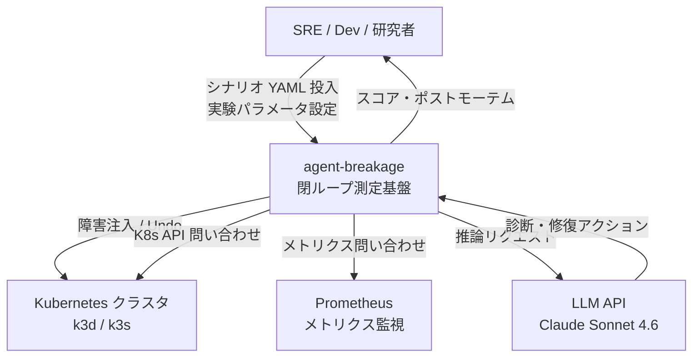
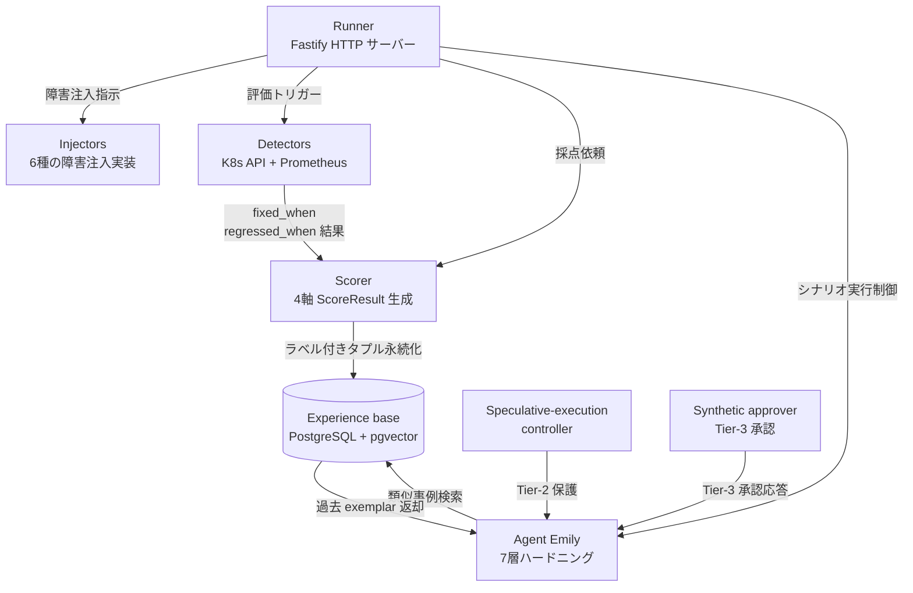
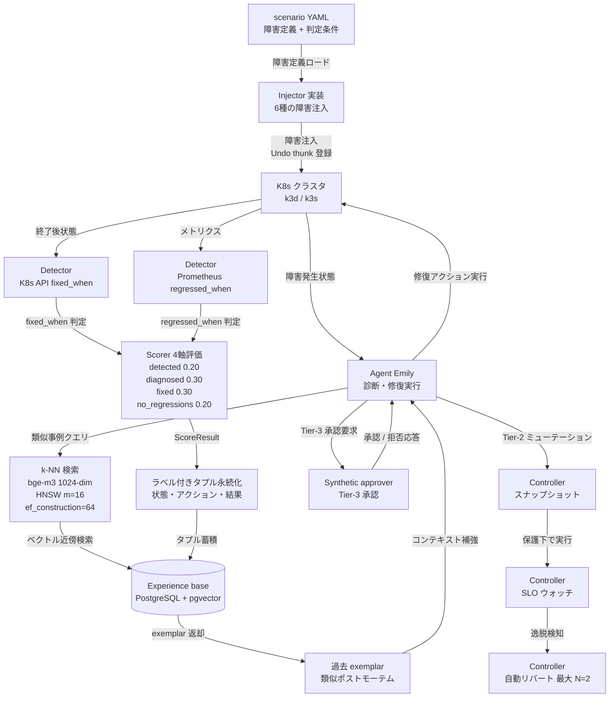
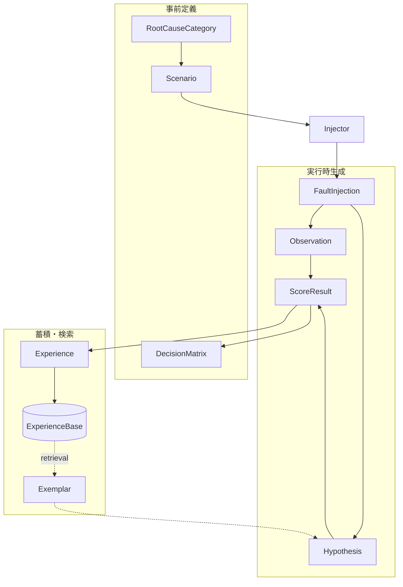
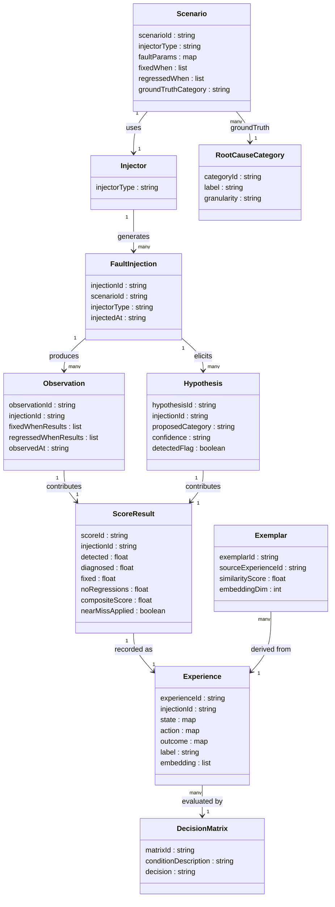

> 対象論文: arXiv:2605.23058 "A measurement substrate for agentic Kubernetes operations: Methodology and a case study in retrieval-compounding falsification" (Joshua Odmark, Gideon Rubin, Deon van der Vyver, 2026)
> 本記事では論文に明示されていないコマンド・設定を「論文の意図を反映した実装例」と明示し、補完元を参考リンクに添えています。

## 概要

### 「AIが運用を改善した」という主張が反証不可能な理由

自律Kubernetes運用エージェントに関する実証的主張の大半は、構造的に反証不可能です。論文は4点の欠陥を指摘します。

| 欠陥 | 内容 |
|---|---|
| 対照の欠如 | エージェントを無効化したベースラインと比較しない観察結果のみを報告している |
| 選択バイアス | 成功事例の選択的報告が蔓延している (selection bias is endemic) |
| 事前登録なし | 結果を見てから「成功」の定義を選ぶ。事前登録された決定マトリクスが不在 |
| サンプル不足 | スコアのノイズ (σ≈0.10–0.16) に対してサンプル数が小さすぎる (n=3 等) |

これら4点が揃うと、エージェントに効果があってもなくても、データが主張を支持するように見えてしまいます。

### agent-breakage が解決すること

agent-breakage は以下の対応策を一体化した閉ループ測定フレームワークです。

- 対照の欠如には、決定論的埋め込み (deterministic-embedder) で retrieval 機能を無効化した制御エージェントを置きます
- 選択バイアスには、実験者が注入した障害の内容を正解として保持し、成功事例の選別を不可能にします
- 事前登録なしには、実験開始前に「この結果が出たらこう判断する」を表として固定します
- サンプル不足には、Welch t-test とスコアの分散から適切な n を算出します

### chaos engineering との関係

chaos engineering の原典 (principlesofchaos.org) は「control 群 vs 実験群の対照実験」作法を既に内包しています。障害注入技術自体 (Chaos Mesh・LitmusChaos 等) は既知です。agent-breakage の新規性は「注入 → エージェント応答 → 結果ラベル付きタプル → 次インシデント検索」という閉ループ全体にあります。chaos engineering の対照実験作法を AI エージェント評価に移植したのが本フレームワークの位置づけです。

### 関連技術との比較

| フレームワーク | 障害注入 | グラウンドトゥルース | 反復数 | 統計的反証性 |
|---|---|---|---|---|
| agent-breakage (本論文) | 閉ループ注入 (K8s API 直接) | 注入障害が正解、4軸採点 | n=20–60 + 360 runs | 強: 対照群・事前登録・Welch t-test |
| AIOpsLab (MS, arXiv:2501.06706) | 閉ループ注入 | detection/localization/RCA/mitigation 4軸 | 本文未確認 | 弱: 観察報告寄り |
| ITBench (IBM+UCB, arXiv:2502.05352) | 障害クラス注入 (102シナリオ) | 障害伝播チェーン明示 (最精緻) | 10 runs/シナリオ | 中: 反復明示、対照は限定的 |
| K8s RAG Bench (CNCF/Foley) | 実 PR をタスク化 | 実 PR diff | n=9 | 中: 制約を自認 (Type II error) |

agent-breakage の優位性は「事前登録 + 対照群 + 選択バイアス補正」という実験統計の作法にあります。グラウンドトゥルースの精緻さでは ITBench が先行しており、役割は相補的です。

## 特徴

### 特徴1: 障害注入を対照実験に昇華させた

chaos engineering が持つ「control 群 vs 実験群」作法を AI エージェント評価に移植しました。実験者が障害の正解を知っている状態を人工的に作るため、エージェントの診断が正しいかを客観的に判定できます。グラウンドトゥルースが存在しない観察報告とは根本的に異なります。

### 特徴2: 4軸の重み付き採点で「直した」を厳密に定義する

| 軸 | 重み | 判定基準 |
|---|---|---|
| detected | 0.20 | 時間予算内にエージェントが障害仮説を発行したか |
| diagnosed | 0.30 | 根本原因カテゴリがグラウンドトゥルースと一致 (副次カテゴリは 0.35 倍クレジット) |
| fixed | 0.30 | シナリオ終了時に `fixed_when` 条件がすべて成立したか |
| no_regressions | 0.20 | `regressed_when` 条件が発動しなかったか |

最終スコアは [0,1] の加重合成値です。「検出した」「診断した」「直した」「壊さなかった」を分離して測るため、単一の解決率や MTTR で丸める既存ベンチより細かく失敗モードを記録できます。

### 特徴3: 事前登録された決定マトリクスで confirmation bias を封じる

実験開始前に判断基準を表として固定します。

| 実験結果 | 決定 |
|---|---|
| 3シナリオ中 2 つが p<0.05 で有意正 | Continue Phase 1 (本格採用) |
| Mixed (1/3 有意、他は正トレンド) | Ship limited v0 (限定リリース、コーパス成長後に再検討) |
| Null または負の pooled 効果 | Pivot away from retrieval (retrieval を主機構から外す) |

結果を見てから解釈を選ぶ余地を構造的に消します。これが confirmation bias への最も安価な保険です。

### 特徴4: 自分の仮説を自分で部分反証してみせた

論文のケーススタディは、著者自身の「retrieval (過去事例検索) を足せばエージェントが賢くなる (retrieval-compounding)」という仮説の検証です。

n=20 主実験の結果を示します (シナリオ名は以降 `-advocate` サフィックスを省略)。

| シナリオ | Δスコア | 検定結果 |
|---|---|---|
| secret-missing-key | +0.058 | p<0.05 ✓ |
| cpu-limit-throttling | +0.091 | 非有意 |
| readiness-probe | −0.032 | 非有意 |
| pooled (3シナリオ合計) | +0.039 | 非有意 |

3シナリオ中1シナリオのみ有意となり、決定マトリクスの「Mixed」行に該当して限定リリースとなりました。さらに cpu-limit-throttling は n=3 (初期) で +0.17 を示していましたが、n=40 で −0.031 に符号反転しました。小標本の数字が符号レベルで誤る典型例を自分の実験で示しています。

### 特徴5: 3つの交絡要因を実測で炙り出した

| 交絡 | 内容 | 影響と対処 |
|---|---|---|
| pgvector ivfflat バグ | 小コーパスで不規則に 0–3 行しか返さない (乱数シード依存) | retrieval-used 信号の異常分散で検出し HNSW に切替 (m=16, ef_construction=64) |
| +19% 選択バイアス | 「retrieval 該当あり」は既解決の簡単な事例の母集団 | 本番観察で +19% に見えた改善が、対照実験後に +0.039 に縮小 |
| 3倍過大評価 | 早期 n=3 で cpu-limit-throttling +0.17・replicas-zero +0.41 と報告 | n=40 で前者は −0.031 に符号反転、後者は両 arm が μ≈0.91 に収束。σ≈0.10–0.16 に対し n=3 は標準誤差 0.06–0.09 |

## 構造

### システムコンテキスト図



| 要素名 | 説明 |
|---|---|
| SRE / Dev / 研究者 | シナリオ YAML を投入し実験パラメータを設定。スコアとポストモーテムを受け取り意思決定 |
| agent-breakage 閉ループ測定基盤 | 障害注入・エージェント実行・採点・経験蓄積を一貫して行う本フレームワーク |
| Kubernetes クラスタ k3d / k3s | 障害注入対象。K8s API を通じて状態が読み取られ採点の根拠となる |
| LLM API Claude Sonnet 4.6 | エージェント Emily が推論に使用する外部言語モデル API |
| Prometheus メトリクス監視 | Detector が regressed_when / fixed_when 評価に用いるメトリクスソース |

### コンテナ図



| 要素名 | 説明 |
|---|---|
| Runner | シナリオ実行の全体オーケストレーションを担う中央サーバー。POST /run・POST /retrieve・ポストモーテム取得などのエンドポイントを持つ |
| Injectors | K8s クラスタに既知の障害を注入し、シナリオ終了時に Undo thunk で復元 |
| Detectors | fixed_when / regressed_when 条件を K8s API および Prometheus を通じて評価 |
| Scorer | detected / diagnosed / fixed / no_regressions の 4 軸を重み付き合成し [0,1] スコアを生成 |
| Experience base | 過去のポストモーテムをベクトル検索可能な形で蓄積する永続化ストア |
| Speculative-execution controller | Tier-2 ミューテーション前後に状態スナップショットを取得し SLO 逸脱時に自動リバート |
| Synthetic approver | 設定可能な遅延・拒否率で人間承認を模倣するスタンドアロン HTTP サービス |
| Agent Emily | 診断・修復を実行する自律エージェント。アクション権限を Tier-1/2/3 で階層管理 |

### コンポーネント図



| 要素名 | 説明 |
|---|---|
| scenario YAML | 実験の入力。注入する障害の種類・fixed_when・regressed_when 条件を宣言的に定義 |
| Injector 実装 6種 | 各 Injector は注入後に Undo thunk を返してシナリオ終了時に元の状態へ復元 |
| K8s クラスタ k3d / k3s | 注入対象かつ観測対象。単一クラスタ障害モデルで運用 |
| Agent Emily | 7 層ハードニングを持つ自律エージェント。LLM API を介して診断仮説を立て修復アクションを実行 |
| k-NN 検索 bge-m3 HNSW | BAAI/bge-m3 1024 次元埋め込みを用いた最近傍検索。maxDistance 0.40 で無関係 exemplar をフィルタ |
| Experience base | HNSW インデックス m=16 ef_construction=64 で構成された過去事例ベクトルストア |
| 過去 exemplar | 検索で返された過去の診断・修復事例。エージェントのコンテキストとして利用 |
| Controller スナップショット | Tier-2 ミューテーション実行前にクラスタ状態を記録 |
| Controller SLO ウォッチ | ミューテーション実行中に SLO 逸脱を監視 |
| Controller 自動リバート | 逸脱検知時に最大 N=2 回まで自動リバートし、3 回目は人間レビューのため一時停止 |
| Synthetic approver | 設定可能な遅延・拒否率で人間承認を模倣し、実際の承認と同一形式の監査ログを生成 |
| Detector K8s API | シナリオ終了時に Kubernetes API を問い合わせ fixed_when 条件の充足を判定 |
| Detector Prometheus | メトリクスを参照して regressed_when 条件の発動を判定。sustained_for_s で一時的な偽陽性を除去 |
| Scorer 4軸評価 | 4 軸を重み付き合成し [0,1] の ScoreResult を生成。近似正解は 0.35 倍クレジットを付与 |
| ラベル付きタプル永続化 | スコア済みの実験結果をタプルとして Experience base に蓄積し次回以降の retrieval に供する |

## データ

### 概念モデル



事前定義のエンティティを示します。

| 要素名 | 説明 |
|---|---|
| Scenario | 障害定義・判定条件・グラウンドトゥルースを宣言する実験の単位 |
| RootCauseCategory | 約 24 の根本原因カテゴリ (medium granularity)。採点の語彙 |
| DecisionMatrix | 実験前に登録する「結果から決定」のマッピング |

実行時生成のエンティティを示します。

| 要素名 | 説明 |
|---|---|
| FaultInjection | Injector がクラスタに注入した障害の記録 |
| Observation | Detector が観測した fixed_when / regressed_when の評価結果 |
| Hypothesis | エージェントが立てた診断仮説 (提案カテゴリ・確信度) |
| ScoreResult | 4軸の加重合成スコア |

蓄積・検索のエンティティを示します。

| 要素名 | 説明 |
|---|---|
| Experience | 状態・アクション・結果のラベル付きタプル。埋め込みを持つ |
| ExperienceBase | Experience を蓄積するベクトルストア |
| Exemplar | retrieval が返す過去事例 |

### 情報モデル



`embedding` (1024次元)、`embeddingDim=1024`、`RootCauseCategory` の約24カテゴリ、`ScoreResult` の重み配分、near-miss の 0.35倍クレジット、`Injector` の6タイプ (deployment-patch / secret-content / configmap-patch / flagd-flag / network-policy / pod-evict) はすべて論文本文に明記されています。`Experience` の `state/action/outcome` の具体的なフィールド構成は論文記述から推測です。

`compositeScore` は以下の加重和で算出します。

```
compositeScore = 0.20 × detected
              + 0.30 × diagnosed   (near-miss の場合は 0.35 倍クレジット)
              + 0.30 × fixed
              + 0.20 × noRegressions
```

値域は [0, 1] です。`DecisionMatrix` は実験前に事前登録され、`compositeScore` の分布 (シナリオ単位の p 値) と有意なシナリオ数によって Continue / Ship limited / Pivot のいずれかを決定します。

## 構築方法

### 前提スタック

| 層 | 技術 | バージョン |
|---|---|---|
| ランタイム (Runner) | Node.js | 20+ |
| 分析スクリプト | Python | 3.x (統計は stdlib statistics、SciPy は本記事の実装例) |
| データベース | PostgreSQL | 14+ (参照実装は 17) |
| ベクトル拡張 | pgvector | ≥ 0.5.0 (HNSW 対応版、参照実装は 0.8.2) |
| 埋め込みモデル | BAAI/bge-m3 | 1024 次元 |
| 埋め込みサーバー | text-embeddings-inference (Hugging Face) | — |
| クラスタ | k3d / k3s | Docker 上の軽量 K8s |
| LLM | Anthropic Claude Sonnet 4.6 | デフォルト (operator 抽象化で切替可) |

論文はセットアップ所要時間として clean machine から約 90 分 (最長ステップは bge-m3 モデルのコールドスタート) と記載しています。実験本体は別途、falsify テストが約 5 時間/arm、密度スイープが約 26 時間です。

### 環境セットアップ手順

#### 1. k3d クラスタ作成

論文は Docker 上の k3d/k3s をクラスタ基盤として使用します。以下は k3d 公式に基づく実装例です。

```bash
# k3d のインストール (論文の意図を反映した実装例 / k3d.io 参照)
curl -s https://raw.githubusercontent.com/k3d-io/k3d/main/install.sh | bash
k3d cluster create breakage-cluster --wait
kubectl get nodes
```

#### 2. PostgreSQL + pgvector のセットアップ

```bash
# 論文の意図を反映した実装例 / pgvector 公式参照
docker run -d \
  --name breakage-postgres \
  -e POSTGRES_PASSWORD=yourpassword \
  -p 5432:5432 \
  pgvector/pgvector:pg17
psql -h localhost -U postgres -c "CREATE EXTENSION IF NOT EXISTS vector;"
```

#### 3. text-embeddings-inference (bge-m3) のセットアップ

```bash
# CPU 環境での起動 (論文の意図を反映した実装例 / HuggingFace TEI 公式参照)
model=BAAI/bge-m3
volume=$PWD/tei-data
docker run -d \
  --name breakage-tei \
  -p 8080:80 \
  -v $volume:/data \
  --pull always \
  ghcr.io/huggingface/text-embeddings-inference:cpu-latest \
  --model-id $model
curl http://localhost:8080/embed -X POST \
  -d '{"inputs":"test embedding"}' -H 'Content-Type: application/json'
```

bge-m3 モデルのコールドスタートに時間を要します。起動完了を確認してから次ステップに進んでください。

#### 4. Anthropic API キーの設定

```bash
export ANTHROPIC_API_KEY="your-api-key"
```

### pgvector の HNSW インデックス作成

論文は当初 ivfflat インデックスを使用しましたが、小コーパスで「乱数シード依存の不規則な 0〜3 行返却」が発生することを実測で確認し、migration 004 で HNSW に切り替えたと記述しています。パラメータは `m=16, ef_construction=64` です。

```sql
-- 論文の意図を反映した実装例: migration 004 相当 (pgvector ≥ 0.5.0 が必要)
DROP INDEX IF EXISTS experience_embedding_ivfflat_idx;

CREATE INDEX experience_embedding_hnsw_idx
  ON experiences
  USING hnsw (embedding vector_cosine_ops)
  WITH (m = 16, ef_construction = 64);

-- クエリ時の探索幅 (ef_construction=64 に合わせた設定例)
SET hnsw.ef_search = 64;
```

`m=16, ef_construction=64` は pgvector のデフォルト値と一致しており、論文はこの標準構成を使用しています。

### control 群の設定: BREAKAGE_EMBEDDER=deterministic

agent-breakage の最も重要な設計の一つが、retrieval を実質的に無効化した対照群の作り方です。論文は `deterministic` embedder を使用し、DJB2 ハッシュで意味的にランダムなベクトルを生成させます。このベクトルは本物の埋め込みと意味的距離が大きいため、`maxDistance=0.40` のフィルタに引っかかり、retrieval 結果がゼロになります。

```bash
# 論文明示の設定: control 群の実行
export BREAKAGE_EMBEDDER=deterministic
export BREAKAGE_RETRIEVAL_MAX_DISTANCE=0.40
```

この設計により「retrieval の有無だけを変数として分離」しながら、障害分布を両 arm で同一に保てます。

## 利用方法

### scenario YAML の書き方

```yaml
# 論文の意図を反映した実装例
# breakage/scenarios/anchor/secret-missing-key-advocate.yaml
name: secret-missing-key-advocate

injector:
  type: secret-content          # 6種: deployment-patch / secret-content /
                                 # configmap-patch / flagd-flag /
                                 # network-policy / pod-evict
  target:
    namespace: advocacy
    name: advocate-secret
  patch:
    data:
      required-api-key: null

fixed_when:
  - type: k8s-api
    resource: pods
    namespace: advocacy
    selector: app=advocate
    condition: all_running
    sustained_for_s: 30

regressed_when:
  - type: prometheus
    query: 'sum(rate(http_errors_total{namespace="advocacy"}[1m])) > 0.1'

ground_truth:
  primary_category: secret-misconfiguration
  secondary_categories:
    - environment-variable-misconfiguration   # near-miss 判定に使用 (0.35倍クレジット)
```

`fixed_when` / `regressed_when` は Kubernetes API ハンドラと Prometheus ハンドラの両方をサポートします。`sustained_for_s` は「N 秒間継続して条件を満たすこと」を要求します。`ground_truth.primary_category` は制御語彙 (約 24 カテゴリ) から選択します。

### anchor scenarios (9個)

n=20 falsify テストの主軸となる基準シナリオです。

| シナリオ名 | 障害の概要 |
|---|---|
| `secret-missing-key-advocate` | Secret からキーが欠落 |
| `secret-wrong-password-advocate` | Secret のパスワードが不正 |
| `cpu-limit-throttling-advocate` | CPU Limit によるスロットリング |
| `liveness-probe-always-fails-advocate` | Liveness Probe が常に失敗 |
| `readiness-probe-misconfigured-advocate` | Readiness Probe の設定ミス |
| `replicas-zero-advocate` | replicas=0 によるゼロスケール |
| `env-var-missing-advocate` | 環境変数の欠落 |
| `image-pull-failure-advocate` | イメージ Pull 失敗 |
| `oom-advocate-api` | OOM Kill |

### coverage scenarios (3トランシュ)

- k8s-troubleshooting: bad-command-crashloop / pod-pending-request-too-high / serviceaccount-missing
- otel-demo-flagd-faults: cart-failure / email-memory-leak / kafka-queue-problems / payment-failure / recommendation-cache-failure
- sre-book-ch22-cascading: replica-loss-amplification / slow-startup-retry-storm

### 実験の回し方

treatment arm (retrieval 有効) と control arm (retrieval 無効) を各 20 回実行し、シナリオごとに Welch t-test で比較します。

```bash
# treatment arm: retrieval 有効
SCENARIOS="secret-missing-key-advocate cpu-limit-throttling-advocate readiness-probe-misconfigured-advocate" \
REPS=20 bash breakage/scripts/falsify-tei.sh

# control arm: retrieval 無効
SCENARIOS="secret-missing-key-advocate cpu-limit-throttling-advocate readiness-probe-misconfigured-advocate" \
REPS=20 bash breakage/scripts/falsify-control.sh
```

コーパス密度スイープでは `poolCap=5`、`poolCap=15`、`full` の 3 段階で、3 シナリオ × 3 密度 × 2 arm × 20 rep = 360 runs を実施します。

```bash
bash breakage/scripts/density-sweep.sh
```

n=40 では、n=20 で境界的だった cpu-limit-throttling-advocate と、早期 n=3 で +0.41 を示した replicas-zero-advocate を再実行し、符号反転または収束を確認します。

```bash
bash breakage/scripts/n40-rerun.sh
```

cpu-limit-throttling は n=20 で +0.091 (非有意)、n=40 で −0.031 に符号反転しました。replicas-zero は n=40 で両 arm が μ≈0.91 に収束しました。

### 決定マトリクスによる判定 (事前登録)

| 実験結果 | 決定 |
|---|---|
| 3シナリオ中 2 つが p<0.05 で有意正 | Continue Phase 1 (本格採用) |
| Mixed (1/3 有意、他は正トレンド) | Ship limited v0 (限定リリース) |
| Null または負の pooled 効果 | Pivot away from retrieval |

### Welch t-test での有意性判定

```python
# 論文の意図を反映した実装例
from scipy import stats
import statistics

def welch_t_test(treatment_scores, control_scores):
    t_stat, p_value = stats.ttest_ind(
        treatment_scores, control_scores, equal_var=False)  # 分散不均一を仮定
    effect = statistics.mean(treatment_scores) - statistics.mean(control_scores)
    return {"t": t_stat, "p": p_value, "delta": effect, "significant": p_value < 0.05}
```

### 再現コストの目安

| フェーズ | Wall-clock | API クレジット |
|---|---|---|
| n=20 falsify テスト (1 arm) | ~5 時間 | ~$30–60 |
| コーパス密度スイープ (360 runs 合計) | ~26 時間 (逐次実行) | ~$150–300 |
| n=40 再実行 | ~8.5 時間 | ~$60–120 |

## 運用

### Experience base の成長管理

- 各実験が終わるたびに `(状態, アクション, 結果)` のラベル付きタプルが自動蓄積されます
- コーパス密度の監視には `poolCap` パラメータを使います (`poolCap=5 / 15 / full`)
- 密度を上げても per-scenario の heterogeneity が per-density の分散を上回るため、コーパス量の増加だけでは改善を期待できません。シナリオごとの mechanistic alignment を優先してキュレーションします

### framework-error と reasoning-error の分離運用

- インジェクタ例外・Detector クラッシュ・Scorer が DB 到達不能、の各イベントは `framework-error` として分類し、エージェント能力評価の集計から除外します
- framework-error は substrate-health レポートとして別途追跡します
- 除外ルールは実験前に定義し、事後に「都合の悪いランを捨てた」と解釈されないよう設計段階でドキュメント化します

### スコア分散 σ の監視とサンプルサイズ決定

- 4軸加重スコアの標準偏差は σ ≈ 0.10–0.16 (実測値) です
- フレームワークが定める最低公表可能サンプル数は n=20。n=40 では 95% CI の幅が ±0.05 程度まで縮まります
- 新しいシナリオを追加した際は、最初の 5〜10 ランでスコア分散を試算し、所望の検出力に必要な n を事前に見積もります

### 再現性タグ運用 (v0.1.0)

- 特定の Git タグ (v0.1.0) をピン留めすることで決定論的な再現を保証します
- タグを更新した場合は必ず対照実験を再実行し、過去スコアとの比較可能性を検証します

## ベストプラクティス

「よくある誤解 → 反証エビデンス → 推奨行動」の構造で整理します。

### ① 対照 (エージェント無効ベースライン) を必ず置く

- 誤解: エージェントを使って問題が解決したなら、エージェントが貢献したと言える
- 反証: 本番観察で「retrieval 該当事例あり」は +19% 改善に見えましたが、これは既解決の簡単な母集団を観測していたためです。対照実験後の pooled 効果は +0.039 (非有意) に縮小しました
- 推奨: `deterministic-embedder` (maxDistance=0.40) を control arm として常に並走させます

### ② 成功定義を結果より先に固定する (事前登録決定マトリクス)

- 誤解: 結果を見てから「成功/部分成功」を判断すれば柔軟に対応できる
- 反証: 事後解釈は confirmation bias の温床です。arXiv:2502.09858 (POPPER) は事前登録が再現性を抜本的に改善することを示しています
- 推奨: 決定マトリクスを実験開始前にバージョン管理リポジトリにコミットし、事後変更の証跡を残します

### ③ 小標本の数字を信じない (Welch t-test と n の確保)

- 誤解: n=3 で効果量 +0.17〜+0.41 なら十分な証拠だ
- 反証: cpu-limit-throttling は n=3 で +0.17 → n=20 で +0.091 → n=40 で −0.031 (符号反転)。replicas-zero も n=3 で +0.41 を示しましたが n=40 では両 arm が μ≈0.91 に収束しました。σ≈0.10–0.16 に対し n=3 の標準誤差は 0.06–0.09 で、効果量と同オーダーです
- 推奨: 最低 n=20 から報告し理想は n=40 以上。分散不均一に頑健な Welch t-test を使い、事前に power analysis を実施します

```python
# サンプルサイズ試算 (参考)
from scipy.stats import norm
import numpy as np

sigma, delta, alpha, beta = 0.13, 0.05, 0.05, 0.20
z_a = norm.ppf(1 - alpha / 2)
z_b = norm.ppf(1 - beta)
n = ((z_a + z_b) * sigma / delta) ** 2
print(f"推定必要サンプル数: {int(np.ceil(n))} per arm")  # → 約 105 per arm
```

### ④ retrieval/RAG は機構的整合性が支配的で一律には効かない

- 誤解: コーパスを増やせばエージェントはどのシナリオでも賢くなる
- 反証: 360 runs の密度スイープで、コーパス密度より mechanistic alignment が支配的でした。secret-missing-key は全密度で有意改善 (p<0.01) した一方、cpu-limit-throttling は全密度でマイナス (OOM の前例が引かれ誤誘導)
- 推奨: retrieval の効果をシナリオ別に測定し、有害シナリオでは per-scenario フラグで無効化します。コーパス全体の平均で語ることを避けます

### ⑤ 選択バイアスを除去する

- 誤解: 本番ログで「retrieval が命中したケースは +19% 改善」なら retrieval は効果的だ
- 反証: retrieval が命中する状況は、類似事例が既にある、つまり以前に解決した簡単な問題に母集団が偏っています。この選択バイアスを除去すると pooled 効果は +0.039 に縮小します
- 推奨: 本番観察ではなく対照実験で測定します。本番ログを使う場合は命中群/非命中群の難易度を事前スコアで補正します

## トラブルシューティング

| 症状 | 原因 | 対処 |
|---|---|---|
| 同一設定でスコアが run ごとに大きくばらつく | ivfflat インデックスがプローブの乱数シード依存で 0–3 行しか返さない | migration 004 で HNSW (m=16, ef_construction=64) に切り替え。移行後に retrieval-used 分布を確認 |
| retrieval-used フラグがあるのにスコアが下がる | mechanistic misalignment: 意味的に近いが機構が異なる前例 (例: cpu-limit-throttling に OOM) | 当該シナリオの retrieval を per-scenario フラグで無効化し、コーパスを別途キュレーション |
| 小標本 (n≦10) で大きな正の効果量が出た | σ≈0.10–0.16 に対しサンプルが少なく標準誤差が効果量と同程度 | n を 20 以上に増やす。n=3 の +0.41 が n=40 で収束/符号反転した事例を参照 |
| framework-error がエージェントスコアに混入 | インジェクタ例外 / 検出器クラッシュ / Scorer が DB 到達不能 | framework-error フラグを付与して集計から除外し、substrate-health に別途記録 |
| deterministic-embedder control の妥当性が後から疑問になる | control は情報内容の有無を分離するが retrieval パイプラインの存在は除去できない | control 設計の範囲を報告書に明記する。妥当性確認は継続的に行う |
| 決定マトリクスの Mixed 判定が連続して出る | 検出力不足 (n 不足) または mechanistic misalignment が多数のシナリオに及ぶ | まず n を増やして検出力を確認。続く場合はシナリオのキュレーションを見直す |
| 実験コストが予算を超える | n=60 × 複数シナリオで arm あたり $30–60 が累積 | 優先度の高い 1〜2 シナリオに絞って先行検証し、pooled 効果が明確に正のときのみスケールアップ |

### 反証・限界の統合

agent-breakage を適用する際に過信を避けるための注意点を示します。

- 外的妥当性の制約 (強): 単一エージェント (Emily) / 単一クラスタ (k3d) / 合成 injector 6 種は内的妥当性を最大化する代わりに本番予測力を犠牲にします (arXiv:2505.13654)。合成障害は本番の race condition / network partition を再現しません (arXiv:2605.18181)。結果は「この設定下でのエージェント比較」として扱います
- 競合パラダイム SLO/error budget (強): 運用 AI 評価の業界主流は二値反証実験ではなく error budget による連続評価 + 本番 observation です (Google SRE Workbook)。開発・CI 段階の能力比較に agent-breakage を、本番の継続品質保証に SLO 監視を使う二層構造が現実的です
- rubric の恣意性 (中): near-miss の 0.35 倍クレジットや4軸の重み配分は設計者の裁量で、それ自体は反証不能です (arXiv:2601.08843)。重みを摂動させる sensitivity analysis を併用し結論の頑健性を示します
- Mixed → limited ship の抜け道 (中): 中間判定は「結局 ship する」経路を残します。Mixed から ship への移行に必要な追加検証要件 (コーパス密度の最低閾値、追加 n) を事前に明示します
- コスト ROI (中): per-scenario n=20 の主実験で 1/3 しか有意でなく pooled n=60 でも非有意だった結果に対し、arm あたり $30–60 × 5 時間を掛けると、検証コストが非現実的になりえます。本番 observability と比較し、組織のリスク許容度と照らして判断します

## まとめ

agent-breakage は、障害注入・4軸採点・事前登録決定マトリクス・対照群を一体化し、「AIが運用を改善した」という主張を反証可能な形で測る閉ループ測定基盤です。著者自身の retrieval-compounding 仮説を n=20–60 で部分反証し、小標本の符号反転・選択バイアス・インフラバグという交絡を実測で炙り出した点に、個別結論を超えた方法論としての価値があります。

この記事が少しでも参考になった、あるいは改善点などがあれば、ぜひリアクションやコメント、SNSでのシェアをいただけると励みになります！

## 参考リンク

- 一次論文 (本フレームワーク)
  - [arXiv:2605.23058 — A measurement substrate for agentic Kubernetes operations](https://arxiv.org/abs/2605.23058)
  - [arXiv HTML 版](https://arxiv.org/html/2605.23058)
- 関連学術論文 (系譜)
  - [arXiv:2501.06706 — AIOpsLab (Microsoft Research)](https://arxiv.org/abs/2501.06706)
  - [arXiv:2502.05352 — ITBench (IBM + UC Berkeley)](https://arxiv.org/abs/2502.05352)
  - [arXiv:2502.09858 — POPPER (事前登録による仮説検証)](https://arxiv.org/abs/2502.09858)
- 反証・限界
  - [arXiv:2505.13654 — Chaos Engineering in the Wild](https://arxiv.org/html/2505.13654v1)
  - [arXiv:2605.18181 — 単一環境評価と overfitting](https://arxiv.org/html/2605.18181)
  - [arXiv:2601.08843 — Rubric-Conditioned LLM Grading](https://arxiv.org/html/2601.08843v1)
  - [Scribbr: Internal vs External Validity](https://www.scribbr.com/methodology/internal-vs-external-validity/)
- 関連ツール公式
  - [pgvector](https://github.com/pgvector/pgvector)
  - [pgvector HNSW 解説 (Crunchy Data)](https://www.crunchydata.com/blog/hnsw-indexes-with-postgres-and-pgvector)
  - [HuggingFace text-embeddings-inference](https://huggingface.co/docs/text-embeddings-inference/en/quick_tour)
  - [BAAI/bge-m3](https://huggingface.co/BAAI/bge-m3)
  - [k3d](https://k3d.io)
  - [principlesofchaos.org](https://principlesofchaos.org/)
- SRE 実務
  - [Google SRE Workbook — Implementing SLOs](https://sre.google/workbook/implementing-slos/)
  - [Google SRE Workbook — Error Budget Policy](https://sre.google/workbook/error-budget-policy/)
