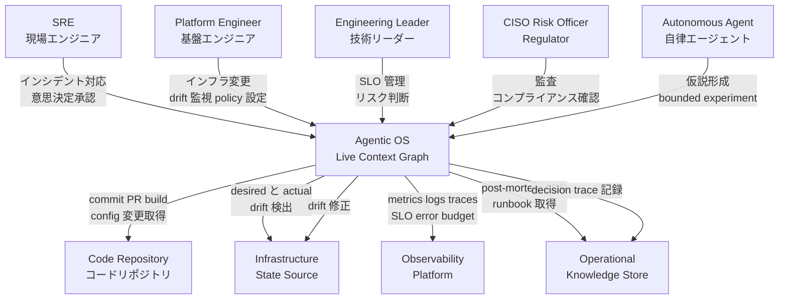
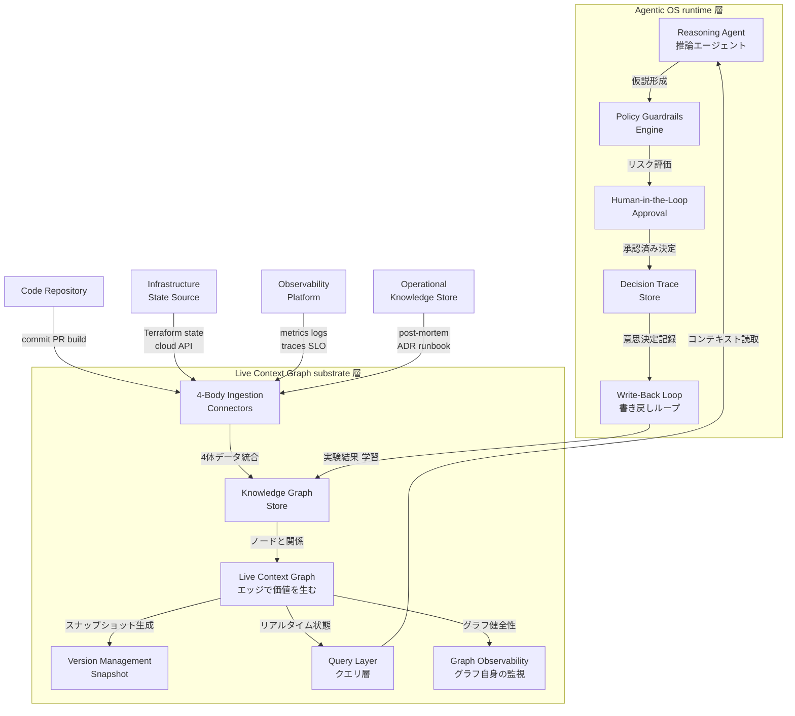
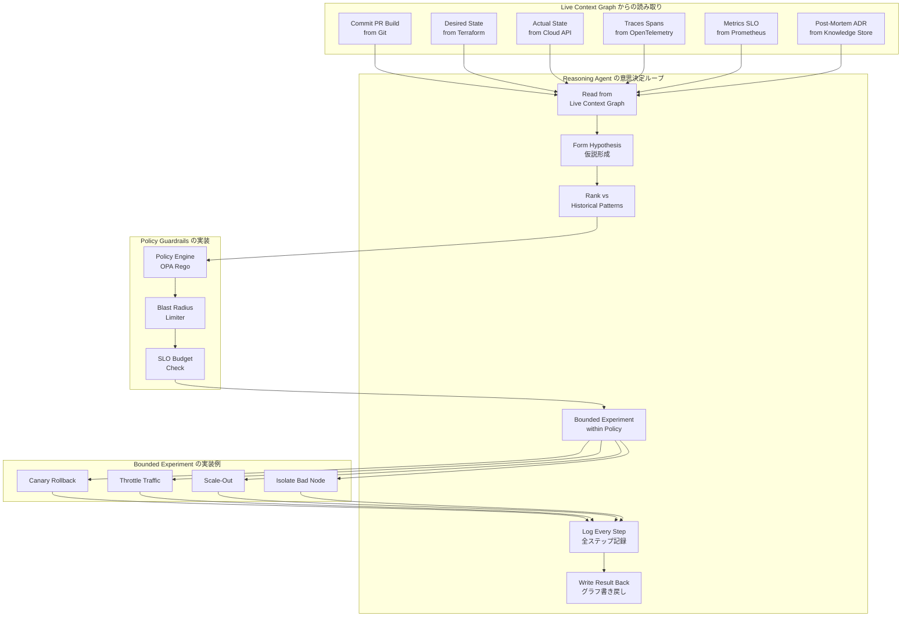
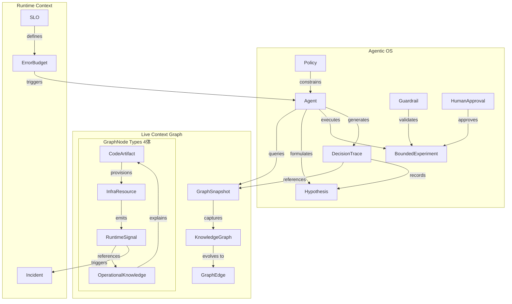
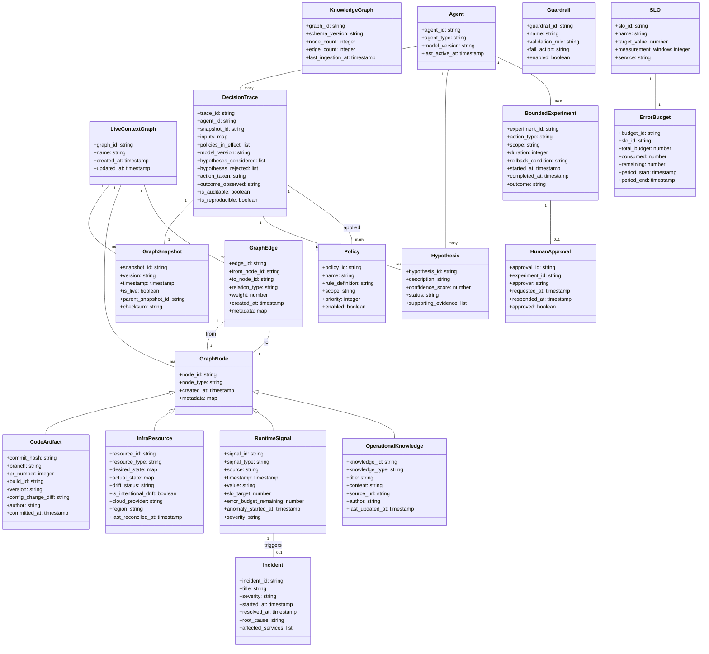

> この記事は、CNCF Blog (2026-07-06, Sanjeev Sharma / Field CTO at StackGen) の「SRE の 4体問題 (4-Body Problem of SRE)」と、その解として提案される Live Context Graph / Agentic OS for Ops という方法論を、構造とデータの観点から技術調査したものです。本方法論は具体的なプロダクトでなく設計思想のため、構築方法・利用方法のコード例は「意図を反映した実装案」として示し、補完元を明示します。

## 概要

本方法論は、SRE が直面する「4体問題 (4-Body Problem of SRE)」を起点に、自律運用に必要な文脈 (context) 基盤の構築方法を提示します。

### なぜ自律運用のボトルネックは model capability でなく context なのか

現代の運用において、どの意思決定も 4 つの真実の体の交差点に座ります。

- **Code**: commit、PR、branch、build artifact、version、config change。何を、いつ deploy し、昨日と何が違うか
- **Infrastructure State**: cloud account、network、Kubernetes cluster、queue、database、IAM policy の実際の現在形。Terraform が示す desired と、今実際にある actual
- **Runtime Signals**: metrics、logs、traces、events、error budgets、SLOs、customer-impacting alerts。今この瞬間システムが何をしていて、いつ挙動が変わったか
- **Operational Knowledge**: tribal wisdom、post-mortems、ADR (Architectural Decision Records)、on-call playbooks、runbooks。なぜそうなっているかを説明する Slack thread

各体は単独でほぼ解決済です (Git、Terraform + cloud API、Prometheus 等の observability、Confluence / Notion / Slack)。問題は、あらゆる意思決定が 4 体すべての交差点に座り、交差点にはこれまでシステムが無かったことです。

この交差点は、シニアエンジニア数名の頭の中に断片で存在する「人間の糊 (people putty)」で埋められてきました。人間パテは、高価・希少・2 年で辞める・スケールしないという性質を持ちます。runbook は書いた瞬間が最も正確で、次の infra 変更で drift します。stale runbook は無い runbook より悪いです。自信を持った誤った行動を招くからです。

エージェントの失敗は、多くの場合、断片化された文脈に起因します。断片化された文脈は、検証しづらい「もっともらしい失敗 (plausible hallucination)」を生みます。自律運用の前提は、エージェントが reason できる統合された文脈です。

### 4体問題とは何か

著者は物理の 3 体問題を比喩として引用します。物理の 3 体問題は、3 つの質量の長期的な軌道が閉形式解を持たず、カオス的に振る舞うことで知られます。著者の framing では、4 体問題は単に 33% 難しくなるのでなく、ダイナミクスが質的に (qualitatively) 変わります。SRE の 4 体 (Code、Infrastructure State、Runtime Signals、Operational Knowledge) も、独立でなく互いの軌道が常に影響し合います。SRE は「顧客信頼を失わずに 30 秒後のシステム位置を予測する」実践です。

従来、この 4 体を同時に追跡できるのは、数名のシニアエンジニアの頭の中だけでした。著者が経験した深夜 2 時のインシデントブリッジコールでは、8 ベンダー・200 行 RACI が並び、真因は誰の observability にも統合されていない subcontracted network telemetry stream に隠れていました。この夜が教えたことは 2 つです。

1. 誰も全体像を持っていない
2. どんなに経験豊富でも、人間は全体像を頭の中に保持できない

### Live Context Graph と Agentic OS がどの問題を解くか

**Live Context Graph** は、4 体すべてとその間の関係の「単一・リアルタイム・クエリ可能・観測可能・durable」な表現です。Knowledge Graph から導出され、進化の順は **Artifacts → Knowledge Graph → Live Context Graph** です。以下の 5 つの性質を持ちます。


- **Live**: stale context は no context より悪い。昨日のビューは今日の世界ではない
- **Context graph**: 価値は個々のノード (commit、Terraform resource、span、runbook) でなく edges (エッジ) にある。「この commit がこの module を変え、この resource を provision し、この latency anomaly を出し、過去のこのインシデントに一致し、この fix で解決した」
- **Queryable**: 人間とエージェント双方から、一貫した semantics でクエリ可能
- **Observable**: グラフ自身が first-class な telemetry source。グラフが live でなくなったことを検知できる
- **Durable**: すべてのエージェント決定は特定バージョンのグラフに対して下される。validation と auditability のため replay できる

**Agentic OS for Ops** は、Live Context Graph の上で動作する runtime です。reasoning agents、policy、guardrails、human-in-the-loop approvals が住む場所です。基盤なしにクリティカルパスに置ける信頼できる agent は無い、というのが核心的な主張です。

People putty が最も厚い 3 箇所から回収が始まります。

- **CI/CD pipelines**: 全 commit / build / test / deploy と過去インシデントの学びが agent の working memory に入る。SLO breach 時に「何か変わったか」を聞かずに済む (13:54 に connection-pool config を触った deploy が diff・author・blast radius 付きで既知)
- **Infrastructure drift**: Terraform の should と cloud の is を継続 reconcile し、drift を outage 化前に flag する。金曜夜の break-glass fix のような intentional drift も observable event として扱う
- **SLO violations**: breach が traceable agent decision を trigger する。hypothesis 形成 → historical pattern に対しランク付け → policy guardrail 内で bounded experiment (canary rollback、throttle、scale-out、bad node isolation) → 全ステップ log。人間は最初の 12 分の調査が citation 付きで済んだ war room に入る

共通パターンは、agents read from graph → reason hypotheses → act within policy → write result back です。各ループがグラフを richer にし、次を良くします (compounding)。

### The Path の 2 原則

自律運用への道は、2 つの原則に集約されます。運用の詳細は「ベストプラクティス」で扱います。

1. **Treat operations as data (graph-before-agents)**: Code / Infra State / Runtime Signals / Operational Knowledge を相互不信のサイロにせず、query・version・reason できる Live Context Graph に統合する。基盤が agents より先に来る
2. **Embed agents in the path, not after it**: 事後の post-mortem 自動化は dictation にすぎない。エージェントは 4 体を継続ループで reason し、各決定が trace を足し、各 trace が次を良くする

### 信頼の正体は decision trace

「LLM を挟んだスクリプト」は autonomy ではありません。先週火曜と prompt が違い、木曜に model version が上がり、input context がどこにも記録されないなら、それは opaque automation です。各エージェント行動は durable な記録 (decision trace) を生む必要があります。詳細は「データ」の情報モデルで扱います。

### メトリクスの位置づけ

agent が 4 体を継続 reason し、事後に post-mortem を書くのでなく path に埋め込まれると、インシデントは稀になり 2 a.m. page は例外になります。注視すべき数字は「どれだけ速く復旧したか (MTTR)」から「どれだけ悪い夜を経験せずに済んだか」へ移ります。ただし、これは基盤と trace を正しく作った consequence であり、出発点ではありません。

### 成熟度の段階

copilots から autopilots への ladder があります。「AI assists me」から「AI acts on its own」へ向かい、ほとんどの組織は mid-climb です。2026 年に完全自律運用に到達するかは No です。ただし trajectory は明確で、人を増やしてもスケールしません。better context と trustworthy agents でスケールします。

## 特徴

本方法論の特徴を以下に列挙します。

- **4 体の統合による全体文脈の構築**: Code / Infrastructure State / Runtime Signals / Operational Knowledge を単一のグラフに統合し、意思決定が座る交差点を初めてシステム化する
- **エッジに価値を置く設計**: 価値は個々のノードでなくエッジ (関係性) にあり、commit から fix までの因果連鎖がエージェントの推論基盤になる
- **Live・版管理・observable なグラフ**: 最新性 (Live)、replay 可能な版管理 (Durable)、グラフ自身の観測可能性 (Observable) を同時に満たす
- **decision trace による auditability**: 各行動が inputs・policies・model version・hypotheses・action・outcome を durable に記録し、auditable / reproducible / trustworthy を担保する
- **graph-before-agents の原則**: エージェントより先に統合文脈基盤を作る。断片化された文脈の上で動かすと plausible failure を生む
- **エージェントを path に埋め込む**: 事後の post-mortem 自動化でなく、継続ループでインシデントをそもそも稀にする
- **metrics は consequence**: MTTR から「悪い夜を避けた回数」へ指標を移すが、それは基盤の結果であり出発点にしない
- **stale runbook を drift として扱う**: 運用知識をグラフ化し、runbook が参照する構成の drift を observable event にする

### People putty からの回収ポイント

| 箇所 | 回収内容 |
|---|---|
| CI/CD pipelines | 全 commit・build・test・deploy と過去インシデントの学びが agent の working memory に入る |
| Infrastructure drift | Terraform の should と cloud の is を継続 reconcile し drift を outage 化前に flag する |
| SLO violations | breach が traceable agent decision を trigger し、hypothesis 形成からランク付け、bounded experiment、全ステップ log まで回る |

### 関連技術・類似アプローチとの比較

以下は、一次ソースの主張を踏まえた筆者による整理です。各アプローチの特性を、4 体のカバレッジ・文脈統合・版管理・監査可能性・エージェント前提設計の観点で対比します。

| アプローチ | 4体のカバレッジ | 文脈統合 | 版管理・replay | 監査可能性 (decision trace) | エージェント前提設計 |
|---|---|---|---|---|---|
| 従来の AIOps | Runtime Signals 中心、一部 Operational Knowledge | 限定的 (主に observability 内) | 通常なし | ベンダー依存、限定的 | 後付けが多い |
| Observability プラットフォーム単体 | Runtime Signals のみ | なし (metrics / logs / traces の集約のみ) | なし | なし | 設計外 |
| Runbook automation | Operational Knowledge の一部 | なし (人間が文脈を補完) | なし (スクリプトのみ) | なし | 設計外 |
| CMDB | Infrastructure State、一部 Code | 限定的 (asset 中心) | 別途 (Git 等) | なし | 設計外 |
| GitOps drift detection | Code、Infrastructure State | 限定的 (desired vs actual) | あり (Git 履歴) | あり (Git 履歴ベース) | 設計外 |
| 本提案 (Live Context Graph + Agentic OS) | 4 体すべて | 統合 (edges に価値) | あり (snapshot 版管理、replay 可能) | あり (auditable / reproducible / trustworthy) | 前提 (graph-before-agents) |

#### ユースケース別推奨

| ユースケース | 推奨アプローチ | 理由 |
|---|---|---|
| 既存システムの監視・アラート改善 | 従来の AIOps、Observability プラットフォーム | Runtime Signals 中心で足り、導入コストが低い |
| IaC drift 検知・自動修復 | GitOps drift detection | Code と Infrastructure State の差分に特化し軽量 |
| 定型作業の自動化 | Runbook automation | 既存プロセスの置き換えに特化 |
| 資産管理・コンプライアンス | CMDB | Infrastructure State の可視化・追跡に特化 |
| 自律運用への移行、インシデント予防 | 本提案 (Live Context Graph + Agentic OS) | 4 体統合、エージェント前提設計、監査可能性を同時に満たす |
| 複雑なマルチクラウド・マルチベンダー環境 | 本提案 (Live Context Graph + Agentic OS) | 断片化された文脈を統合し、people putty に依存しない |

## 構造

本方法論は具体的なプロダクトでなく方法論であるため、C4 モデルの各図は参照実装でなく、提案フレームワークの論理的な役割と責務の関係を示します。

### システムコンテキスト図

中核システムは Agentic OS + Live Context Graph であり、4 つの真実の体を統合したコンテキスト基盤の上でエージェントが自律運用を実現します。



#### アクター

| 要素名 | 説明 |
|---|---|
| SRE | インシデント対応・runbook 確認・エージェントの意思決定承認を行う現場エンジニア |
| Platform Engineer | インフラ変更・drift 監視・policy 設定を担う基盤エンジニア |
| Engineering Leader | SLO 管理・リスク判断・戦略決定を行う技術リーダー |
| CISO Risk Officer Regulator | 監査・コンプライアンス確認・リスク評価を行う統制担当者 |
| Autonomous Agent | 自律的な意思決定・仮説形成・bounded experiment を実行するエージェント |

#### 中核システム

| 要素名 | 説明 |
|---|---|
| Agentic OS Live Context Graph | 4 つの真実の体を統合したコンテキストグラフの上で、エージェントが自律運用を実現する基盤システム |

#### 外部システム (4 つの真実の体のソース)

| 要素名 | 説明 |
|---|---|
| Code Repository | commit・PR・branch・build artifact・version・config 変更を管理するコードリポジトリ |
| Infrastructure State Source | Terraform の desired state と cloud API から得られる actual state を提供するソース |
| Observability Platform | metrics・logs・traces・events・error budgets・SLOs・alerts を提供する基盤 |
| Operational Knowledge Store | post-mortem・ADR・runbook・on-call playbooks・tribal wisdom を保持するストア |

### コンテナ図

中核システムをドリルダウンし、2 層の構造を示します。下層の Live Context Graph substrate が 4 つの体を統合し、上層の Agentic OS runtime がその上で自律運用を実現します。



#### Live Context Graph substrate 層

| 要素名 | 説明 |
|---|---|
| 4-Body Ingestion Connectors | Code・Infrastructure State・Runtime Signals・Operational Knowledge の 4 体からデータを取り込むコネクタ群 |
| Knowledge Graph Store | 4 つの体のデータを統合した知識グラフのストレージ |
| Live Context Graph | ノードでなくエッジ (関係) に価値を置く、リアルタイムなコンテキストグラフ |
| Version Management Snapshot | 各決定が特定バージョンのグラフに対して行われるための版管理とスナップショット機能 |
| Query Layer | 人間とエージェント双方から一貫したセマンティクスでクエリ可能な問い合わせ層 |
| Graph Observability | グラフ自身を first-class なテレメトリソースとし、グラフが live でなくなったことを検知する observability |

#### Agentic OS runtime 層

| 要素名 | 説明 |
|---|---|
| Reasoning Agent | Live Context Graph からコンテキストを読み取り、仮説を形成し、過去パターンと照合する推論エージェント |
| Policy Guardrails Engine | エージェントの行動をリスク評価し、policy 範囲内に制限するガードレールエンジン |
| Human-in-the-Loop Approval | リスクの高い決定や policy 範囲外の行動に対する人間承認フロー |
| Decision Trace Store | すべての意思決定の入力・仮説・行動・結果を durable に記録し、監査と再現可能性を担保するストア |
| Write-Back Loop | エージェントの実験結果や学習をグラフに書き戻し、次のループをより良くする compounding ループ |

#### 3 つのエントリポイントの位置づけ

runtime 層の Reasoning Agent は、people putty が最も厚い 3 つのトリガーから起動されます。それぞれ substrate 層の特定の入力に対応します。

| エントリポイント | トリガー条件 | 対応する substrate 層の入力 |
|---|---|---|
| CI/CD pipelines | commit / build / deploy イベント | 4-Body Ingestion Connectors の Code 取り込み |
| Infrastructure drift | desired と actual の不一致検出 | Infrastructure State Source の drift 検出 |
| SLO violations | error budget の breach | Runtime Signals の SLO 閾値超過 |

### コンポーネント図

エージェントの意思決定ループをドリルダウンし、具体的な技術要素を含めた構造を示します。エージェントは Live Context Graph から読み取り、仮説を形成し、policy guardrails 内で bounded experiment を実行し、結果を書き戻します。



#### グラフからの読み取り

| 要素名 | 説明 |
|---|---|
| Commit PR Build | Git から commit・PR・build の情報を読み取る |
| Desired State | Terraform から desired state を読み取る |
| Actual State | Cloud Provider API から actual state を読み取る |
| Traces Spans | OpenTelemetry から traces と spans を読み取る |
| Metrics SLO | Prometheus から metrics と SLO を読み取る |
| Post-Mortem ADR | Knowledge Store から post-mortem と ADR を読み取る |

#### 意思決定ループ

| 要素名 | 説明 |
|---|---|
| Read from Live Context Graph | 特定スナップショットから 4 つの体の統合コンテキストを読み取る |
| Form Hypothesis | SLO 違反や drift などの観測事象に対し、過去パターンを参照して仮説を形成する |
| Rank vs Historical Patterns | 複数の仮説を過去のインシデントや成功パターンと照合してランク付けする |
| Bounded Experiment within Policy | Policy guardrails 内で仮説を検証する制限された実験を実行する |
| Log Every Step | 入力・仮説・棄却した選択肢・行動・結果のすべてを記録する |
| Write Result Back | 実験結果と学習をグラフに書き戻し、次のループの推論を改善する |

#### Policy Guardrails の実装

| 要素名 | 説明 |
|---|---|
| Policy Engine | OPA Rego などで、エージェントの行動が組織の policy に適合するか評価する |
| Blast Radius Limiter | 実験の影響範囲を制限し、全体システムへの波及を防ぐ |
| SLO Budget Check | SLO のエラーバジェット残量を確認し、超過時は行動を制限する |

#### Bounded Experiment の実装例

| 要素名 | 説明 |
|---|---|
| Canary Rollback | カナリアデプロイのロールバックを実行し、一部トラフィックで影響を検証する |
| Throttle Traffic | トラフィックを絞り、負荷を制限して影響を観測する |
| Scale-Out | リソースをスケールアウトし、容量不足による影響を緩和する |
| Isolate Bad Node | 不良ノードを隔離し、他のノードへの影響を防ぐ |

## データ

本セクションでは、Live Context Graph の構造と Agentic OS for Ops の意思決定機構を構成するエンティティを、概念モデルと情報モデルとして整理します。一次ソースに明示されていない属性は、隣接する実装 (Git、Terraform、OpenTelemetry、Neo4j) から推測したものとして注記します。

### 概念モデル

4 つの体 (CodeArtifact、InfraResource、RuntimeSignal、OperationalKnowledge) は LiveContextGraph に統合され、各エンティティは GraphNode として表現されます。KnowledgeGraph は 4 体を統合した静的な基盤で、Live Context Graph はそれを live・queryable・durable に拡張したものです。GraphSnapshot は Live Context Graph の特定バージョンを捕捉し、エージェントはその snapshot を参照して DecisionTrace を生成します。

なお、本文では概念名を「Live Context Graph」「decision trace」のように表記し、図と情報モデルではクラス名を `LiveContextGraph` `DecisionTrace` のように CamelCase で表記します。両者は同じ対象を指します。



#### 関連の意味

| 関連 | 意味 |
|---|---|
| KnowledgeGraph evolves to GraphEdge | 静的な知識グラフがエッジ表現を獲得し、live で queryable な Live Context Graph に拡張される |
| GraphSnapshot captures KnowledgeGraph | Live Context Graph の特定バージョンを版管理のために捕捉する |
| CodeArtifact provisions InfraResource | コード変更が実際のインフラリソースを生成・変更する因果を示す |
| InfraResource emits RuntimeSignal | インフラの状態変化が観測可能なシグナルを生成する |
| RuntimeSignal references OperationalKnowledge | 異常や SLO 違反が過去のインシデント記録や runbook を参照する |
| OperationalKnowledge explains CodeArtifact | なぜその実装がなされたかを post-mortem や ADR が説明する |
| Agent queries GraphSnapshot | エージェントは特定版のグラフに対して意思決定を行う |
| Policy constrains Agent | ポリシーがエージェントの行動範囲を制約する |
| Guardrail validates BoundedExperiment | ガードレールが実験の実行前に妥当性を検証する |
| DecisionTrace references GraphSnapshot | 意思決定記録はどの版のグラフを見たかを記録する |

### 情報モデル

各エンティティの主要属性を示します。型名は言語固有の表記を避け、list / map / set 等の汎用名を用います。



#### GraphSnapshot

| 属性 | 説明 |
|---|---|
| snapshot_id | スナップショットの一意識別子。version との対応を保持する |
| version | 単調増加する版番号またはセマンティックバージョン |
| timestamp | スナップショットが捕捉された時刻 |
| is_live | 現在有効な最新版であるかを示すフラグ |
| parent_snapshot_id | 差分管理のための親スナップショット参照 |
| checksum | 内容の整合性検証用ハッシュ (一次ソースに明示なし、Git の commit SHA から推測) |

#### DecisionTrace (信頼の要)

一次ソースで明示された 6 項目 (inputs / policies / model version / hypotheses / action / outcome) を必ず保持します。

| 属性 | 説明 |
|---|---|
| snapshot_id | 参照した GraphSnapshot の版 (どの snapshot を見たか) |
| inputs | エージェントが読み取った入力データ |
| policies_in_effect | 決定時に有効だったポリシーの一覧 |
| model_version | 使用した推論モデルのバージョン |
| hypotheses_considered | 検討したすべての仮説 |
| hypotheses_rejected | 棄却した仮説とその理由 |
| action_taken | 実行したアクション (canary rollback / throttle / scale-out / isolate 等) |
| outcome_observed | アクション実行後に観測された結果 |
| is_auditable | 全入力が記録され監査可能であることを示すフラグ |
| is_reproducible | 同じ状態に対し replay 可能であることを示すフラグ |

#### InfraResource

| 属性 | 説明 |
|---|---|
| desired_state | Terraform 等の IaC が定義する期待状態 |
| actual_state | クラウドプロバイダーから取得した実際の状態 |
| drift_status | drift の有無 (none / detected / intentional / unknown) |
| is_intentional_drift | 金曜夜の break-glass fix のような意図的な drift かを示すフラグ |
| last_reconciled_at | 最後に desired と actual を照合した時刻 |

#### RuntimeSignal

| 属性 | 説明 |
|---|---|
| signal_type | metric / log / trace / event / alert の区別 |
| slo_target | この信号が関連する SLO の目標値 |
| error_budget_remaining | 現時点で残っているエラーバジェット |
| anomaly_started_at | 異常が検出され始めた時刻 (一次ソースに明示なし、observability 実装から推測) |

#### BoundedExperiment

| 属性 | 説明 |
|---|---|
| action_type | canary rollback / throttle / scale-out / isolate 等の実験種別 (一次ソースに列挙) |
| scope | 実験が影響を与える範囲 (region / AZ / service / deployment 等) |
| duration | 実験の最大継続時間 (秒) |
| rollback_condition | 自動ロールバックをトリガーする条件式 |
| outcome | success / partial / failed / rolled_back (一次ソースに明示なし、実験結果記録として推測) |

#### エンティティ間の因果例 (edges の価値)

一次ソースでは「この commit がこの module を変え、この resource を provision し、この latency anomaly を出し、過去のこのインシデントに一致し、この fix で解決した」という因果連鎖が GraphEdge の価値として示されています。

| from_node | relation_type | to_node | 意味 |
|---|---|---|---|
| CodeArtifact (commit) | changes | CodeArtifact (module) | commit がどのモジュールを変更したか |
| CodeArtifact (module) | provisions | InfraResource | モジュールがどのリソースを生成したか |
| InfraResource | emits | RuntimeSignal (latency) | リソースがどのシグナルを発しているか |
| RuntimeSignal (latency spike) | matches | Incident (past) | 現在の異常が過去のどのインシデントに類似するか |
| Incident (past) | resolved_by | CodeArtifact (fix commit) | 過去のインシデントがどの修正で解決したか |
| OperationalKnowledge (runbook) | explains | InfraResource (network policy) | なぜその構成が存在するかを説明する |

#### 補完と制約

本セクションで一次ソースに明示されない属性は、以下の隣接技術から推測しました。checksum / parent_snapshot_id は Git の commit SHA と親コミット参照、RuntimeSignal の anomaly_started_at は OpenTelemetry span と Prometheus alert 開始時刻、InfraResource の cloud_provider / region は Terraform provider 設定、BoundedExperiment の outcome はカナリアデプロイの結果記録、OperationalKnowledge の source_url は Confluence / Notion / Slack の URL スキーマから推測しています。

## 構築方法

本フレームワークは方法論であり参照実装を持たないため、以下は既存技術を用いた実装案です。一次ソースの主張そのものでなく、意図を反映した構成例として示します。想定するグラフストアは Neo4j です。

### 前提条件

- **Git リポジトリ**: コードの版管理が行われていること
- **Terraform または同等の IaC ツール**: インフラ状態が宣言的に管理されていること
- **Observability 基盤**: OpenTelemetry Collector / Prometheus による収集経路が稼働していること
- **Knowledge store**: Confluence / Notion / Slack または ADR の保管先が存在すること
- **グラフデータベース**: Neo4j 等のグラフストアがプロビジョニングされていること

Live Context Graph の構築は Artifacts → Knowledge Graph → Live Context Graph の順で段階的に進めます。

### ステップ 1: 4 体からのデータ収集

#### Code

Git log の抽出と GitHub API 経由の commit / PR / branch 取得を行います。

```bash
git log --pretty=format:"%H|%an|%ae|%ad|%s" --date=iso > commits.csv
```

push イベントを契機に commit をグラフへ流す実装案です。

```yaml
# .github/workflows/commit-to-graph.yml
name: Commit Graph Ingestion
on:
  push:
    branches:
      - main
jobs:
  ingest-commit:
    runs-on: ubuntu-latest
    steps:
      - name: Send to graph ingest endpoint
        run: |
          curl -X POST "${{ secrets.GRAPH_INGEST_ENDPOINT }}" \
            -H "Content-Type: application/json" \
            -d '{
              "sha": "${{ github.sha }}",
              "author": "${{ github.event.head_commit.author.name }}",
              "message": "${{ github.event.head_commit.message }}",
              "timestamp": "${{ github.event.head_commit.timestamp }}"
            }'
```

(補完元: GitHub Actions のイベントと workflow)

#### Infrastructure State

Terraform state の JSON 出力と drift 検出を行います。

```bash
terraform show -json > tfstate.json
terraform plan -refresh-only
driftctl scan --output json://drift.json
```

driftctl の `--output` は `<format>://<destination>` 形式で、上記はファイル出力です。ただし driftctl は現在 maintenance mode で、最新リリースは 2023 年で止まっています。新規採用では、`terraform plan -detailed-exitcode` による差分検知や、クラウドネイティブな drift 検出手段への差し替えも検討します。

(補完元: Terraform CLI の plan コマンド、driftctl)

#### Runtime Signals

OpenTelemetry Collector で traces / metrics / logs を統合収集し、Prometheus で metrics を scrape します。

```yaml
# otel-collector-config.yaml
receivers:
  otlp:
    protocols:
      grpc:
        endpoint: 0.0.0.0:4317
      http:
        endpoint: 0.0.0.0:4318
  prometheus:
    config:
      scrape_configs:
        - job_name: "app-metrics"
          static_configs:
            - targets: ["app:8080"]
processors:
  batch: {}
  memory_limiter:
    check_interval: 1s
    limit_mib: 512
exporters:
  otlp:
    endpoint: observability-backend:4317
service:
  pipelines:
    traces:
      receivers: [otlp]
      processors: [batch]
      exporters: [otlp]
    metrics:
      receivers: [otlp, prometheus]
      processors: [memory_limiter, batch]
      exporters: [otlp]
    logs:
      receivers: [otlp]
      processors: [batch]
      exporters: [otlp]
```

(補完元: OpenTelemetry Collector Configuration)

#### Operational Knowledge

Confluence / Notion の export API で runbook / post-mortem / ADR を取得し、Slack export で重要スレッドを抽出し、Markdown または JSON に統一して知識グラフへ流します。

```python
# ingest_confluence.py (実装案)
import requests

confluence_url = "https://your-instance.atlassian.net/wiki"
auth = ("user@example.com", "api_token")
resp = requests.get(
    f"{confluence_url}/rest/api/content",
    params={"spaceKey": "OPS", "type": "page", "expand": "body.storage"},
    auth=auth,
)
for page in resp.json()["results"]:
    knowledge = {
        "knowledge_id": page["id"],
        "knowledge_type": "runbook",
        "title": page["title"],
        "content": page["body"]["storage"]["value"],
        "source_url": f"{confluence_url}{page['_links']['webui']}",
    }
    # knowledge を Neo4j の OperationalKnowledge ノードとして MERGE する
```

(補完元: Atlassian Confluence REST API)

### ステップ 2: グラフストアへの ingest

収集したデータを Neo4j に投入します。ノードタイプの例は Commit / Module / Resource / Span / Incident / Runbook / ADR、エッジタイプの例は CHANGES (Commit から Module)、PROVISIONS (Module から Resource)、EMITS (Resource から Span)、MATCHES (Span から Incident)、RESOLVED_BY (Incident から Runbook) です。

```python
# ingest_commits.py
from neo4j import GraphDatabase

driver = GraphDatabase.driver("neo4j://localhost:7687", auth=("neo4j", "your_password"))
commits = [
    {"sha": "abc123", "author": "Alice", "message": "Fix latency", "timestamp": "2026-07-01T10:00:00Z"},
]
cypher = """
UNWIND $commits AS commit
MERGE (c:Commit {sha: commit.sha})
SET c.author = commit.author,
    c.message = commit.message,
    c.timestamp = datetime(commit.timestamp)
"""
with driver.session() as session:
    session.run(cypher, commits=commits)
driver.close()
```

(補完元: Neo4j Python Driver)

### ステップ 3: edges の構築

各体の間の関連を明示的に結びます。

```python
# link_commit_to_module.py
cypher = """
MATCH (c:Commit {sha: $sha})
MATCH (m:Module {name: $module_name})
MERGE (c)-[:CHANGES]->(m)
"""
with driver.session() as session:
    session.run(cypher, sha="abc123", module_name="vpc-module")
```

```python
# link_span_to_incident.py
cypher = """
MATCH (s:Span {span_id: $span_id})
MATCH (i:Incident {id: $incident_id})
MERGE (s)-[:MATCHES]->(i)
"""
with driver.session() as session:
    session.run(cypher, span_id="span456", incident_id="inc-2022-03-15")
```

#### entity resolution と OpenTelemetry semantic conventions

edges の構築で最大のコストは、4 体のデータを一貫した entity (service / resource / deployment) に紐づける entity resolution です。OpenTelemetry の semantic conventions は `service.name` / `service.version` / `deployment.environment.name` / `k8s.pod.uid` などの標準属性を定義し、traces / metrics / logs 間の entity 統一を支援します。

- `service.name` と `service.version` を commit の module 名・version にマッチング
- `k8s.pod.uid` を InfraResource の pod ID にマッチング
- `deployment.environment.name` を policy guardrail の environment 判定に利用

標準属性に寄せることで、異なる体のノードを高い精度で結びつけられます。(補完元: OpenTelemetry Semantic Conventions)

### ステップ 4: 版管理とスナップショット化

各エージェント決定が、どの時点のグラフに対して下されたかを再現できるよう、グラフの状態をスナップショットとして保存します。

```python
# snapshot_graph.py
import datetime
snapshot_id = f"snapshot-{datetime.datetime.utcnow().isoformat()}"
cypher = "CREATE (s:Snapshot {id: $snapshot_id, timestamp: datetime()})"
with driver.session() as session:
    session.run(cypher, snapshot_id=snapshot_id)
```

(補完元: Event Sourcing / immutable log パターン)

## 利用方法

Live Context Graph 構築後、エージェントや人間がグラフをクエリし、decision trace を記録し、policy guardrail を適用する方法を示します。

### 必須パラメータと前提

| パラメータ | 意味 |
|---|---|
| snapshot_id | クエリやエージェント決定の再現性のため、操作対象のグラフ snapshot を指定する |
| policy set | エージェントが実行可能な操作範囲を制限する policy 束 (OPA Rego で記述) |
| model_version | 使用する AI モデルのバージョン |
| hypothesis log | エージェントが検討した仮説リストを保持する構造 |

### グラフのクエリ例

特定 commit に起因する latency anomaly と過去 incident を辿ります。

```cypher
MATCH (c:Commit {sha: $commit_sha})
      -[:CHANGES]->(m:Module)
      -[:PROVISIONS]->(r:Resource)
      -[:EMITS]->(s:Span)
      -[:MATCHES]->(i:Incident)
WHERE s.latency > $threshold
RETURN c.sha, c.author, c.message, m.name, r.id, s.trace_id, s.latency, i.id, i.resolution
```

現在 drift を持つリソースとその過去の修復履歴を辿ります。

```cypher
MATCH (r:Resource)
WHERE r.drift = true
OPTIONAL MATCH (r)-[:RESOLVED_BY]->(rb:Runbook)
RETURN r.id, r.type, r.drift_details, rb.title, rb.procedure
```

### decision trace の記録形式

各エージェント決定を durable に記録する形式の実装案です。一次ソースの 6 項目を含めます。

```json
{
  "trace_id": "decision-2026-07-07T08:30:00Z",
  "timestamp": "2026-07-07T08:30:00Z",
  "snapshot_id": "snapshot-2026-07-07T08:29:50Z",
  "agent_id": "agent-slo-responder-v3",
  "model_version": "gpt-5.5",
  "policies_in_effect": ["policy-blast-radius-limit", "policy-require-approval-for-scale"],
  "inputs": {
    "slo_breach": {"slo_name": "api-p99-latency", "current_value": 3.2, "threshold": 2.0, "breach_start": "2026-07-07T08:25:00Z"},
    "recent_changes": [{"commit_sha": "abc123", "author": "Alice", "message": "Increase connection pool size", "timestamp": "2026-07-07T08:20:00Z"}]
  },
  "hypotheses": [
    {"hypothesis": "Connection pool config change caused latency spike", "confidence": 0.85, "status": "considered"},
    {"hypothesis": "Database replica lag increased", "confidence": 0.45, "status": "rejected"}
  ],
  "action_taken": {"type": "canary_rollback", "target": "api-service-v2", "blast_radius_percent": 10, "approved_by": "auto"},
  "outcome": {"latency_post_action": 2.1, "slo_recovered": true, "recovery_time_seconds": 45}
}
```

### policy guardrail の記述例

エージェントが本番環境で取る行動には blast-radius limit / approval requirement / allowed actions の制約が必要です。OPA Rego の現行構文 (v1) を用います。

```rego
# blast-radius-limit.rego
package guardrails

import rego.v1

default allow := false

allow if {
    input.action.blast_radius_percent <= 20
    input.action.type in ["canary_rollback", "throttle", "scale_out"]
}
```

破壊的操作は environment を問わず human approval を必須にします。非破壊的な action はそのまま許可します。

```rego
# require-approval.rego
package guardrails

import rego.v1

default allow := false

destructive_actions := {"terminate_instance", "delete_database", "rollback_major_version"}

# 非破壊的な action は許可する
allow if {
    not input.action.type in destructive_actions
}

# 破壊的な action は environment を問わず human approval を必須にする
allow if {
    input.action.type in destructive_actions
    input.approval.human_approved == true
}
```

(補完元: Open Policy Agent の Rego)

### write-back loop の実装

エージェントの実験結果を graph に書き戻し、hypothesis の状態を更新します。この書き戻しが次ループの推論を改善します。

```python
# writeback_result.py (実装案)
cypher = """
MATCH (e:BoundedExperiment {experiment_id: $experiment_id})
SET e.outcome = $outcome, e.completed_at = datetime()
WITH e
MATCH (h:Hypothesis {hypothesis_id: $hypothesis_id})
MERGE (e)-[:VALIDATED]->(h)
SET h.status = 'confirmed'
"""
with driver.session() as session:
    session.run(cypher, experiment_id="exp-2026-07-07", outcome="success", hypothesis_id="hyp-conn-pool")
```

## 運用

### グラフの鮮度 (liveness) の運用

Live Context Graph の中核前提は「stale context は no context より悪い」です。運用では、グラフ自身を first-class な telemetry source として監視し、グラフが live でなくなったことを検知します。

- **鮮度 SLI の定義**: 4 体それぞれの ingestion 遅延を計測します。最新 commit 反映までの遅延、terraform state 反映までの遅延、trace ingestion 遅延、runbook 更新反映遅延を個別に持ちます
- **鮮度 SLO とアラート**: ingestion 遅延がしきい値を超えたら、グラフを参照するエージェントの自律実行を停止し、human-in-the-loop に降格します

| メトリクス | 意味 | 逸脱時の対応 |
|---|---|---|
| graph_ingestion_lag_seconds | 体ごとの取り込み遅延 | しきい値超過で自律実行を停止 |
| graph_edge_staleness_ratio | 一定時間更新の無いエッジ比率 | 高値で再 ingestion をトリガー |
| snapshot_age_seconds | 最新スナップショットの経過時間 | is_live を false に落とす |

グラフ自身を Prometheus metrics として export する実装案です。

```python
# graph_exporter.py (実装案)
from prometheus_client import Gauge, start_http_server
from neo4j import GraphDatabase
from datetime import datetime, timezone
import time

graph_ingestion_lag = Gauge("graph_ingestion_lag_seconds", "Lag per body type", ["body_type"])
driver = GraphDatabase.driver("neo4j://localhost:7687", auth=("neo4j", "password"))

def collect_metrics():
    with driver.session() as session:
        record = session.run("MATCH (c:Commit) RETURN max(c.timestamp) AS latest").single()
        if record and record["latest"]:
            lag = (datetime.now(timezone.utc) - record["latest"].to_native()).total_seconds()
            graph_ingestion_lag.labels(body_type="code").set(lag)

if __name__ == "__main__":
    start_http_server(8000)
    while True:
        collect_metrics()
        time.sleep(60)
```

### snapshot と版管理の運用

一次ソースは「すべてのエージェント決定は特定バージョンのグラフに対して下される」ため replay 可能である必要があると述べます。

- **保持ポリシー**: 監査対象の decision trace が参照する snapshot は、監査要件の保持期間に合わせて保持します。参照されない中間 snapshot は圧縮または間引きます
- **replay の運用**: 監査や事後検証の際、当該 trace の snapshot_id を指定してグラフ状態を復元し、同じ入力に対する再評価を行います
- **ストレージ設計**: フルコピーでなく親 snapshot からの差分で保持し、グラフ全体の肥大を抑えます

### エージェントループの運用

- **blast-radius 制限**: bounded experiment の影響範囲を policy で束縛し、逸脱時は即時ロールバックします
- **human-in-the-loop 承認**: 破壊的 action や policy 範囲外の action は人間承認を必須にします。承認の遅延そのものを計測します
- **compounding の監視**: hypothesis 的中率や recovery time の推移を継続計測します。改善が頭打ちなら、過去 incident の学習不足を疑います

### decision trace の運用

- **完全性の担保**: action を取ったのに trace が欠落している状態を検知するため、action イベントと trace イベントの件数を突き合わせます
- **監査提出**: CISO / risk officer / regulator の要求に対し、対象期間の trace を snapshot 参照付きで抽出します
- **プライバシー**: trace の inputs に含まれる機微情報はマスキングまたは参照化し、監査可能性と両立させます

### 3 つのエントリポイントごとの運用

| エントリポイント | 運用で最初に入れること |
|---|---|
| CI/CD pipelines | commit / build / deploy イベントを継続 ingest し、SLO breach 時に直近変更を即時参照可能にする |
| Infrastructure drift | desired と actual を継続 reconcile し、intentional drift も observable event として記録する |
| SLO violations | breach を traceable agent decision の trigger にし、hypothesis 形成から bounded experiment までを trace 付きで回す |

## ベストプラクティス

- **graph-before-agents を守る**: エージェント導入より先に、4 体を統合した Live Context Graph を作ります。断片化された文脈の上で動かすと plausible hallucination を生みます
- **エージェントを path に埋め込む**: 事後の post-mortem 自動化は dictation です。継続ループでインシデントをそもそも稀にします
- **decision trace を最初から baked-in にする**: auditable / reproducible / trustworthy を後付けでなく最初の設計に含めます。監査要求が来てから trace を足すのでは、初回の interesting な action を説明できません
- **stale runbook を放置しない**: 運用知識をグラフ化し、runbook が参照する構成の drift を observable event として扱い、drift 発生時に該当 runbook を要更新として flag します
- **metrics の見方を移す (ただし consequence として)**: MTTR から「悪い夜を避けた回数」へ移しますが、これは基盤の結果であり出発点にしません
- **段階的成熟 (copilot から autopilot へ)**: 一気に full autonomy を狙わず、trace の蓄積と hypothesis 的中率が積み上がった領域から自律度を上げます

### 反証・限界

一次ソースは thought leadership であり、実装コストや運用負荷の定量評価を伴いません。過信を避けるため、隣接領域の知見から限界を明示します。

| 誤解・限界 | 反証 | 推奨 |
|---|---|---|
| グラフさえ作れば自律運用は近い | 一次ソース自身が「2026 年に完全自律運用は No」と明言 | full autonomy を KPI に置かず、trace 蓄積と hypothesis 的中率で測る |
| 文脈を統合すれば hallucination は消える | LLM は grounding が緩むと確信を持って誤った RCA を出す。AIOps のアラート相関は 2025 時点でも false positive を残す | 出力を実データに強く紐づけ、破壊的 action の前に human review を挟む |
| グラフ構築・鮮度維持は軽い | observability データはボリューム・多様性・スキーマ非統一・ephemeral なリソース identity により entity resolution が難しく高コスト | OpenTelemetry semantic conventions に寄せ、CI/CD から段階導入する |
| decision trace は無害に貯められる | 全 action の記録と参照 snapshot が急速に肥大し、inputs に機微情報が入り得る | snapshot を差分保持し、機微フィールドをマスキングする |
| bounded experiment は安全 | 影響範囲の見積りを誤ると本番被害を広げ、confidently wrong な fix のリスクが残る | policy で action 種別と blast-radius を厳格に束縛し、逸脱時は即時ロールバックする |

## トラブルシューティング

| 症状 | 原因 | 対処 |
|---|---|---|
| エージェントが誤った RCA を出す | グラフが stale で直近変更や現在の signal が未反映 | ingestion 遅延を確認し、is_live が false のグラフでは自律実行を停止する |
| drift の誤検知が多い | 比較対象がずれている、intentional drift を未区別 | driftctl や terraform plan の対象範囲を見直し、intentional drift を observable event として登録する |
| 監査で決定が説明できない | decision trace の欠落、または参照 snapshot が破棄済み | action と trace の件数突き合わせで欠落を検知し、監査対象 trace の snapshot 保持を延長する |
| hypothesis のランキングが弱い | 過去 incident が不足し historical pattern が薄い | 過去 post-mortem と incident のグラフ化を進め、matches / resolved_by エッジを拡充する |
| 危険な action が実行された | policy guardrail が未整備、または blast-radius 制限が緩い | OPA policy に destructive_actions の human approval 必須と blast-radius 上限を追加する |
| グラフが徐々に古くなる | ingestion pipeline の停止や rate limit | graph_ingestion_lag のアラートを設定し、体ごとの ingestion を冗長化する |
| trace ストレージが逼迫する | 全 snapshot をフルコピーで保持している | 親 snapshot からの差分保持に切り替え、未参照 snapshot を間引く |

## まとめ

自律運用の壁はモデル性能でなく、Code・Infra State・Runtime Signals・Operational Knowledge の4体をまたぐ文脈の欠落にあります。先に版管理された Live Context Graph を作り、各エージェント決定に decision trace を残す。この順序が、監査可能な自律運用への現実的な道筋になります。

この記事が少しでも参考になった、あるいは改善点などがあれば、ぜひリアクションやコメント、SNSでのシェアをいただけると励みになります！

## 参考リンク

### 一次ソース

- [The 4-Body Problem of SRE: Why Autonomous Operations Depend on Context (CNCF Blog, 2026-07-06)](https://www.cncf.io/blog/2026/07/06/the-4-body-problem-of-sre-why-autonomous-operations-depend-on-context/)
- [The 4-Body Problem of SRE: Building an Agentic OS for Autonomous Operations (StackGen Blog)](https://stackgen.com/blog/the-4-body-problem-of-sre-building-an-agentic-os-for-autonomous-operations)

### 系譜 (SRE / observability / IaC)

- [Google SRE Book: Service Level Objectives](https://sre.google/sre-book/service-level-objectives/)
- [OpenTelemetry Collector Configuration](https://opentelemetry.io/docs/collector/configuration/)
- [OpenTelemetry Semantic Conventions](https://opentelemetry.io/docs/specs/semconv/)
- [Prometheus Configuration](https://prometheus.io/docs/prometheus/latest/configuration/configuration/)
- [Terraform CLI: plan command](https://developer.hashicorp.com/terraform/cli/commands/plan)

### 関連ツール

- [driftctl: Detect and track infrastructure drift (GitHub)](https://github.com/snyk/driftctl)
- [Neo4j Python Driver](https://neo4j.com/docs/api/python-driver/current/)
- [Neo4j Cypher Manual](https://neo4j.com/docs/cypher-manual/current/)
- [Open Policy Agent: Policy Language (Rego)](https://www.openpolicyagent.org/docs/latest/policy-language/)

### 補完元 (実装案の参照)

- [GitHub Actions: Events that trigger workflows](https://docs.github.com/en/actions/reference/workflows-and-actions/events-that-trigger-workflows)
- [Atlassian Confluence Cloud REST API](https://developer.atlassian.com/cloud/confluence/rest/v1/intro/)
- [Event Sourcing Pattern (Martin Fowler)](https://martinfowler.com/eaaDev/EventSourcing.html)
