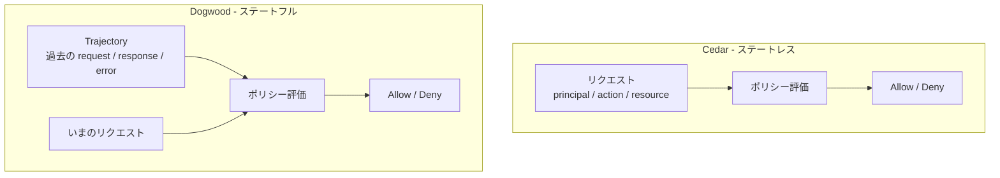

AIエージェントに危険な操作をさせないための対策として、いまもっとも広く使われているのはシステムプロンプトです。「本番DBには書き込むな」「顧客情報を外部に送るな」と書いておく。しかしこれは、指示に従うかどうかがモデルの判断に委ねられている、という意味では制御ではありません。プロンプトインジェクションひとつで前提が崩れます。

2026年8月、AWSがオープンソースとして公開したポリシー言語 **Dogwood** は、この問題を「モデルへの指示」ではなく「ゲートウェイでの権限判定」として解こうとしています。同日発表された Amazon Bedrock AgentCore の temporal policies は、この Dogwood を基盤にしています。

この記事では次を扱います。

- Dogwood が従来の認可と何を変えたのか
- 既存の認可言語 Cedar との関係
- Trajectory（行動履歴）を評価対象にするという概念構造
- 採用前に見ておくべき4つのトレードオフ
- 現時点での現実的な落としどころ

対象読者は、AIエージェントを業務システムへ組み込む立場の方と、その安全性の担保方法を決める立場の方です。

## 何が変わったのか: 単発の認可から、履歴つきの認可へ

従来のアクセス制御は、1回のリクエストを独立して評価します。「誰が（principal）」「何を（action）」「どのリソースに対して（resource）」の3つ組を見て、その場で許可か拒否かを決める。IAMポリシーも、Cedarも、OPAも基本はこの形です。これを Point-in-Time Authorization（単発の認可）と呼びます。

このモデルは、エージェントの制御には決定的に足りません。エージェントで問題になる制約は、たいてい時間軸を含むからです。

| 表現したい制約 | 単発の認可で書けるか |
| --- | --- |
| 送金する前に、承認ステップを通っていること | 書けない（過去の履歴を参照できない） |
| 機密データを読んだ後は、外部への送信を禁止する | 書けない（このセッションで何を読んだかを知らない） |
| 同じ外部APIを1時間に10回以上呼ばせない | 書けない（回数を数えられない） |

いずれも「いまのリクエスト単体」を見ても判定できません。**そのエージェントがこれまで何をしてきたか**を知らないと決められない。Dogwood はここに踏み込んだ言語です。

## Dogwood の位置づけ: Cedar の拡張

Dogwood はゼロから作られた言語ではなく、AWS が以前から公開している認可言語 **Cedar** をベースにした拡張です。設計上の重要な性質が2つあります。

1. **Cedar 互換** — 既存の Cedar ポリシーは、そのまま Dogwood のポリシーとして有効です。移行時に書き直しは発生しません。
2. **temporal 条件の追加** — `when temporal { formerly within 1h ... }` のような構文で、過去のイベント履歴（回数・順序・内容）を参照して現在の呼び出しの許否を判断できます。

つまり、既存の静的な認可の記述はそのまま残し、履歴に依存する条件だけを上乗せする、という増分的な設計になっています。

実行される場所も重要です。Dogwood のポリシーは、エージェントのプロンプト内ではなく **Bedrock AgentCore の Gateway レイヤー**で評価されます。ツール呼び出しはこのゲートウェイを通るため、モデルがどう「説得」されようと、ポリシーで禁止された呼び出しは物理的に通りません。プロンプトインジェクションによる制約の回避に対して、原理的に強い構造です。

仕様と Rust 製の参照実装は Apache 2.0 で公開されており、CLI（`dogwood`）を使ってローカルでポリシーとイベント履歴（トレースログ）を突き合わせ、検証・リプレイができます。実際のエージェントを動かさずに「このポリシーは、あのときの実行を止められたか」を確認できるということです。

## 概念構造: Trajectory を評価する

Dogwood は、エージェントのツール呼び出しの流れを **Trajectory（行動履歴）** として扱います。各ツール呼び出しの `request` / `response` / `error` がイベントとして並び、ポリシーはそのイベント列に対して評価されます。

Cedar と Dogwood の違いは、評価が何を見るかにあります。

Cedar は1リクエストを独立に評価します。判定に必要な情報がリクエストの中で閉じているので、どのノードで評価しても結果は同じです。

Dogwood はこれまでのイベントログ全体を文脈として保持します。同じリクエストでも、それ以前に何が起きたかによって結果が変わる。この「同じ入力でも結果が変わりうる」という性質が、後述するトレードオフのほぼすべての源になっています。

## 採用前に見るべき4つのトレードオフ

コンセプトは筋がよい一方で、いま本番へ持ち込むには無視できない制約があります。

### 1. 形式的検証（自動推論）が temporal 条件に効かない

Cedar の最大の強みは、SMTソルバーを用いた形式的検証でした。「このポリシーは到達不能な条件を含んでいないか」「意図しない権限昇格の経路がないか」をツールで事前に検出できる。

**この自動推論が、Dogwood の temporal 条件には未対応です。**

痛いのは、temporal 条件こそ人間が読んで正しさを判断しにくい部分だという点です。状態遷移が絡むポリシーは、条件の組み合わせが爆発します。「Aの後にBを通ればCが許可されるが、その間にDが挟まると意図せず許可される」といったエッジケースは、レビューで見つけるのが非常に難しい。従来 Cedar が機械で潰していた領域を、Dogwood では人手のレビューとテストで担保することになります。

### 2. ステートフル評価のオーバーヘッド

セッション履歴を遡って評価する以上、履歴が長くなるほど評価レイテンシは増加します。長時間動き続けるエージェントほど不利になる方向です。

さらに、分散環境ではこの履歴の状態同期が必要になります。ステートレスな Cedar が「どこで評価しても同じ」だったのに対し、Dogwood は評価ノード間で Trajectory を一致させる仕組みを要求します。運用コストとリソースコストの両方が上がります。

### 3. デバッグが難しい

Gateway 層で拒否された場合、エージェント側に返るのは基本的に「Access Denied」です。ここに構造的な問題があります。

**エージェントは、過去のどの行動が原因で拒否されたのかを知らされません。** すると自律的な回復ができない。「別の方法を試す」ためには何がダメだったかを知る必要がありますが、その情報がない状態では、同じ拒否を繰り返すか、無関係な迂回を試みるかのどちらかになりがちです。

人間の運用者にとっても事情は同じで、「なぜこの呼び出しが止まったのか」を追うには Trajectory 全体とポリシーを突き合わせる必要があります。CLI によるリプレイが提供されているのは、まさにここが難所だからでしょう。

### 4. 成熟度とセキュリティリスク

Dogwood 特有の CVE は2026年8月時点で報告されていません。ただし OSS 版のインタープリタは **本番環境向けではない（Not Production-Ready）** と明言されています。

また、周辺の Bedrock AgentCore については、2026年に CVE-2026-18830（Critical、入力検証の欠陥）や CVE-2026-12530（Python SDK のコマンドインジェクション）が報告されています。**セキュリティ制御そのものをインフラ側へ寄せるということは、そのインフラの脆弱性が制御の破綻に直結する**ということでもあります。依存先の脆弱性情報を追う体制はセットで必要です。

> なお、上記の Not Production-Ready 表記と CVE 情報は二次情報にもとづきます。採用判断の際は公式アドバイザリで最新の状態を確認してください。

## 現場での落としどころ

ここまでを踏まえると、「Dogwood へ全面移行する」は現時点では取れません。ただし「様子見で何もしない」も、得られるものが小さすぎます。現実的な切り分けは3点です。

**1. ステートレスな認可は Cedar / OPA のまま維持する**

1リクエストで完結するアクセス制御まで Dogwood へ寄せる理由はありません。形式的検証が効く領域は、効くまま残すのが合理的です。制御の大半はこちらに残ります。

**2. Dogwood の適用範囲を、高リスクなフローだけに限定する**

送金、機密データアクセス、外部への情報送信、本番環境への書き込み。**失敗したときのビジネス影響が極めて大きい経路にだけ** temporal policies を適用します。範囲が狭ければ、ポリシーの状態空間も小さくなり、形式的検証がないことのリスクも、レイテンシ増加の影響も抑えられます。トレードオフの4つとも、適用範囲を絞ることで同時に軽くなります。

**3. Deny を受け取ったときのフィードバック設計を、アプリ側に作り込む**

Gateway が「Access Denied」しか返さないなら、その手前で意味を補うのはアプリケーションの責務です。どの制約に触れたのか、どの過去のイベントが原因なのかをエージェントへ返す層を用意しておくと、自律的な回復の余地が生まれます。ここを設計せずに導入すると、「ポリシーで止まったエージェントがひたすら空回りする」という運用になります。

## 見えていない論点

残っている大きな問いは、スケールの側です。ステートフルなポリシー評価をプロダクション環境で分散スケーリングさせるとき、Trajectory の保持と同期をどう設計するのが定石なのか。この点の具体的なアーキテクチャやベストプラクティスは、まだ公開情報として整理されていません。長時間・大量セッションを扱う構成を検討するなら、自前で検証する前提が要ります。

## まとめ

- Dogwood は、AIエージェントのツール呼び出しを**履歴を含めて**評価するポリシー言語である
- Cedar の拡張であり、既存の Cedar ポリシーはそのまま有効。temporal 条件が上乗せされる
- 評価は Gateway 層で行われるため、プロンプトインジェクションで回避されにくい
- 一方で、形式的検証の未対応・評価オーバーヘッド・デバッグ困難・成熟度の4点は無視できない
- 現実的な打ち手は「Cedar を主、Dogwood を高リスク経路限定」+「Deny のフィードバック設計」

「AIの危険な能力をプロンプトで抑止する」から「権限で止める」への移行は、遅かれ早かれ通る道です。Dogwood はその起点として筋のよいコンセプトを持っています。ただし現時点では、全面採用ではなく**適用範囲を絞って構造を学ぶ**フェーズだと捉えるのが妥当です。

この記事が少しでも参考になった、あるいは改善点などがあれば、ぜひリアクションやコメント、SNSでのシェアをいただけると励みになります！

## 参考リンク

- [Introducing Dogwood: runtime verification for AI agents](https://aws.amazon.com/jp/blogs/opensource/introducing-dogwood-runtime-verification-for-ai-agents/)
- [Securing AI agents with temporal policies in Amazon Bedrock AgentCore](https://aws.amazon.com/blogs/machine-learning/securing-ai-agents-with-temporal-policies-in-amazon-bedrock-agentcore/)
- [AWS の新ポリシー言語 Dogwood を試す](https://zenn.dev/exwzd/articles/20260813-dogwood-agent-policy)
