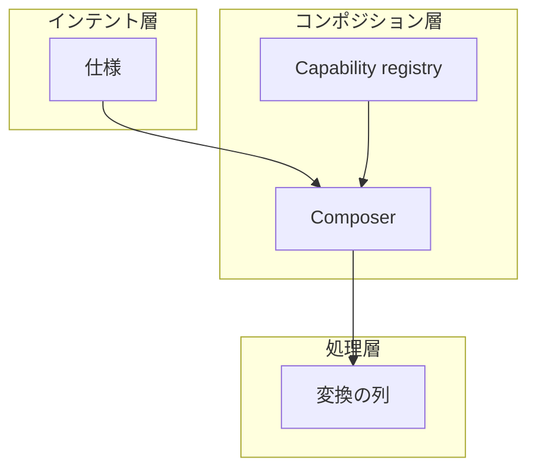

AWS Architecture Blog が 2026-07-09 に公開した specification-driven composition は、データ変換の意図を構造化仕様へ書き、登録済みの変換部品だけを実行時に組み立てる構成パターンです。著者は AWS Professional Services の technical lead である Rostislav Markov です。想定しているのは、同じ変換を複数のパイプラインで繰り返しているデータ担当と、その基盤を設計する人です。

この記事では、仕様・registry・composer の役割、公式サンプルが仕様に課している契約、導入を後回しにする条件を順に説明します。起点となった InfoQ Japan の報道（2026-09-25）が指している実体は、この Architecture Blog です。


*この記事の全体像。以下、順に解説します。*

## specification-driven compositionとは

specification-driven composition は、データセットとフィールド対応と変換名を仕様に持ち、変換関数の中身は仕様に持たない、という分け方です。組み立て役が仕様を検証し、AWS Step Functions の定義を作り、AWS Lambda の部品を順に呼びます。スキーマは固定の製品ではなく、composer 側で独自に検証してよい、とブログ本文が書いています。

ワークフローは 3 層に分かれます。インテント層が仕様、コンポジション層が composer と capability registry、処理層が変換の列です。



仕様は「何を、どの変換名で、どのフィールドへ写すか」を持ちます。registry は「その名前がどの関数か」を持ちます。composer はその 2 つから実行定義を作ります。処理層の各段は、書式整形、検証、エンリッチメントのような一つの操作です。

ブログの仕様例は JSON で、`source.dataset`、`target.dataset`、`mappings` の `source_field`、`target_field`、`transformation.capability` を持ちます。composer は変換を実行しません。参照された capability の存在とメタデータを確認し、Amazon States Language の定義へ落とします。

registry は識別子、入出力、呼び出し方、権限境界、バージョンを持つ想定です。ブログは、定義をバージョン管理し、CI/CD で検証してから公開し、仕様がバージョンを明示する、と書いています。

ブログのサーバーレス例では、人が仕様を Amazon S3 に置くと composer の Lambda が起動します。メタデータの検索先は Amazon OpenSearch Service の domain です。Step Functions が Lambda を順に呼び、各段が Amazon CloudWatch Logs にトレースを出します。起動経路として、S3 イベント以外に EventBridge のスケジュール、API または UI、StartExecution、上流パイプラインを挙げています。承認済み仕様は、データ更新のたびに書き直さずに再実行できる、という説明です。

分類の例では、仕様のフィールドに `sensitivity` を付けます。capability は、分類を保存するか、消すか、追加するかを registry に宣言します。composer が出力側の分類を導出します。マスキング成果物の例は AWS Lake Formation の列権限です。

ブログは、ドメイン利用者が仕様を書き、実行コードであるステートマシンはシステム側の成果物に留める、と書いています。AI には capability の発見と仕様の起草と分析を任せ、実行は検証済み capability に残す、とも書いています。

適用条件は次の 4 つです。

- 構造化仕様でワークフローを記述できる
- 変換を横断して再利用する
- 実行前の検証が要る
- 決定的で、監査できる

具体例は、臨床試験データを SDTM のような提出形式へ写像する規制報告です。

## 公式サンプルの契約

公式サンプル `aws-samples/sample-specification-driven-composition` は、リポジトリ作成が 2026-09-18、main の commit が 2026-09-19 です。以下の仕様と拒否の挙動は、2026-09-27 に main の `specs/orders-spec.json` と `composer/composer.py` を確認した内容です。README は非本番と書いています。

| 項目 | Architecture Blog 2026-07-09 | aws-samples |
| --- | --- | --- |
| 位置づけ | パターンの解説。Next steps にこのリポジトリは無い | README は未公開予定の Compute Blog のサンプルと書き、設計根拠として Architecture Blog をリンクする |
| registry | OpenSearch Service の domain | DynamoDB テーブル。名前とバージョンがキー |
| 起動 | 仕様アップロードの S3 イベント | 手順は `aws lambda invoke`。仕様と入力は事前に S3 へコピーする |
| 仕様の変換 | `capability` 名のみの例 | `capability` と `version` を両方必須にする |
| ステートマシン | 「組み立てて開始する」。API 名は無い | 同名があれば `UpdateStateMachine`、無ければ `CreateStateMachine`。型は `STANDARD`。どちらも `publish=True`。実行は版 ARN |
| 本番 | 規制報告の例を適用先に挙げる | sample code, for non-production usage |

サンプルの仕様は、注文日の整形と金額の正規化の 2 変換です。`version` を各変換にピン止めします。

```json
{
  "source": {
    "dataset": "raw_orders"
  },
  "target": {
    "dataset": "orders_clean"
  },
  "mappings": [
    {
      "source_field": "order_date",
      "target_field": "order_date",
      "transformation": {
        "capability": "format_date",
        "version": "1.0"
      }
    },
    {
      "source_field": "amount",
      "target_field": "amount_normalized",
      "transformation": {
        "capability": "normalize_currency",
        "version": "1.0"
      }
    }
  ]
}
```

`format_date` は日付を ISO 8601 に揃えます。`normalize_currency` は通貨の文字列を数値にします。仕様 JSON に Lambda の ARN を書く欄はありません。ARN は registry 項目の `lambda_arn` から、生成された定義の `FunctionName` へ入ります。

composer の処理順は次のとおりです。

1. ステートマシン名を検査する。既定は `orders-transform` で、`orders-` に続く 1 文字から 72 文字の英数字とハイフンだけを受けます。
2. 成果物バケット上の S3 URI から仕様 JSON を読む。
3. `validate_spec` が、`source` / `target` / `mappings`、データセット名、各 mapping の `source_field` / `target_field` / `transformation`、`capability` と `version` の形式を見る。識別子は `^[A-Za-z0-9_-]{1,64}$`、バージョンは `^[0-9]+(\.[0-9]+)*$` です。
4. `get_capability` が DynamoDB を GetItem する。項目が無いと `Capability not found: format_date v9.9` のようなエラーで戻る。この時点では `upsert_state_machine` に進みません。
5. mapping 1 件につき Task 状態 1 つの Amazon States Language を作る。
6. 同名のステートマシンがあれば `UpdateStateMachine`、無ければ `CreateStateMachine` する。作成時の型は `STANDARD` です。どちらも `publish=True` です。
7. 実行は公開版の ARN に対する `StartExecution` です。実行名は run 識別子と同じです。

README は、registry を書けるロールが capability の解決先を決める、と書いています。registry に新しい版を足しても、仕様が古い版を指していれば解決先は変わりません。差分として見る単位は、そのピンとフィールド対応です。

`CreateStateMachine` の Errors は、同じ名前で definition または role ARN が違うと `StateMachineAlreadyExists` になる、と書いています。同じページの冪等性の Note は、比較対象を name、definition、type、logging、tracing、encryption、publish、versionDescription とします。roleArn が違っても前回の要求として無視し、roleArn は更新されません。サンプルは先に update するため、初回作成の重複エラーをその経路から外しています。

削除は API 上は非同期で、実行が終わるまで機械は残ります。サンプル README の片付けは、`sam delete` の前に `delete-state-machine` を別コマンドで要求します。ステートマシンは SAM スタックの外に残るためです。実行のたびに `publish=True` なので、同じ名前を使い続けると、既定の公開版 1,000 に向かいます。

動的に機械を残すときの公式上限は、このサンプル型（アカウント内に Standard の機械を作り、版を公開する）を採る場合に効きます。出典は Step Functions Developer Guide の service quotas で、2026-09-27 に本文を取得したものです。

| 上限 | 値 |
| --- | --- |
| 登録済みステートマシン | 既定 100,000。表の引き上げ先は 150,000 |
| 定義サイズ | 1 MB。ハード |
| Standard の実行履歴 | 25,000 events。達するとその実行は失敗する |
| タスク入出力 | 256 KiB。ハード |
| 公開バージョン | 既定 1,000／ステートマシン。soft で、Support Center から引き上げを申請できる |
| CreateStateMachine / UpdateStateMachine | 既定はバケット 100、補充毎秒 1。soft で、バケットと補充率は AWS が上げうる |

## 注意点

InfoQ 日本語版の見出しは「仕様主導型コンポジションを導入」です。英語版の見出しは "AWS Introduces Specification-Driven Composition" です。両記事の本文が指している実体は、2026-07-09 の Architecture Blog です。InfoQ 英語の公開は 2026-08-26、日本語は 2026-09-25 で、翻訳者は Naoko Koshimura、英語記事の作者は Leela Kumili です。同名の What's New、サービス料金ページ、GA 告知は、2026-09-27 の検索では見つかっていません。

ブログの利益文には測定がありません。"teams adopting this pattern report being able to onboard new datasets in days rather than weeks" は、顧客名と件数を本文に持ちません。監査準備時間が短くなる、という文も同様に定性です。著者個人の補足リポジトリ `rosmarkov/specification-driven-composition-framework` の README は、その一式を設計の実行例であり、産業上の有効性の証明ではない、と書いています。

ガバナンスが仕様に閉じることは、AWS が製品として保証する性質ではありません。ブログは、検証ロジックを composer に自前で書く、と述べています。閉じるのは、未登録の変換を合成前に拒否し、registry の書き込みが解決先の関数を決める経路を別の承認に置いた実装だけです。仕様を S3 に置いた瞬間に合成が走る経路は、その検証が実装されていることが前提になります。registry を書ける主体は、仕様の語彙の外で実行関数を差し替えられます。閉世界は仕様ファイルだけではできません。

OpenSearch を registry にする図は、発見検索（説明、スキーマ、タグ）の理由でブログが選んでいます。2026-09-27 時点の公式サンプルは DynamoDB の GetItem であり、OpenSearch のコードは `composer/composer.py` にありません。図を実装図として読むと、存在するコードと違います。domain の node-to-node encryption まで含めた OpenSearch は、消すまで時間課金のクラスターです。最低月額は料金ページの数値と突き合わせていないため、この記事では載せていません。採用前に料金ページで確認してください。

サンプル README の費用文は、ウォークスルーが typically less than $1、カスタマー管理 KMS キーが about $1 per month で、スタック削除まで時間按分、です。これは README の見積もりであり、AWS 料金表で再計算した請求額ではありません。

Standard の履歴 25,000 と公開版 1,000 は、サンプルが選んだ API の上に残ります。ブログはこの選択を書いていません。

2026-09-27 時点の GitHub star は、aws-samples が 1、著者の先行リポジトリ `rosmarkov/specification-driven-composition`（作成 2026-03-31）が 0、framework リポジトリが 0 です。いずれも archived ではありません。公開された採用失敗や撤退の記録は、2026-09-27 時点では見つかっていません。見つからなかったことは、成功事例の裏付けにはなりません。

次の点は、確認した資料の範囲では未解決です。

- README が予告する Compute Blog「How to build specification-driven data workflows with AWS Step Functions」の公開 URL は、2026-09-27 の検索では見つかっていません。
- OpenSearch を registry にする公式サンプルは、確認したブログと 3 リポジトリの範囲にはありません。
- フィールド分類の伝播と Lake Formation への受け渡しは、ブログの例だけです。
- 「days rather than weeks」の測定データは、ブログ本文にありません。

## Glue の宣言と使い分ける

このパターンの発表が、既存機能の廃止を伴っている、という記述はブログにありません。近い「意図と実装の分離」は、別の公式機能に既にあります。

AWS Glue blueprints は、パラメータ付きのひな型から Glue の workflow を生成します。開発ガイドは、1 つの blueprint からデータアナリストが類似の ETL workflow を作れる、と書いています。overview は、中身が Python の layout generator script であり、開発者がそのスクリプトと設定ファイルを書く、と書いています。

AWS Glue 6.0 の Spark Declarative Pipelines は、Big Data Blog の 2026-09-09 の記事が "SDP separates the what from the how" と書いています。宣言は Python のデコレータです。依存順はデータセット参照から決まり、1 つの Glue ジョブとして走ります。オーケストレータを外側に残すことはできる、とも書いています。

表形式の ETL が 1 ジョブの宣言に収まるなら、Lambda、Step Functions、registry、composer の 4 点を自前で持つ必要は薄いです。職務分離のために「実行コードをドメイン利用者に書かせない」こと自体は、SDP のデコレータ記述がコードである限り、別問題として残ります。ワークフローの変種が少ないときも、composer 一式は後回しにできます。ブログの自己制限は "fewer than three to five workflows" です。

## 閉世界を仕様に残す条件

このパターンは、要件を差分で更新するやり方のデータ変換版に読めます。変える単位はパイプラインコードではなく仕様です。GitOps でモデルに実行用 YAML を直接書かせない、というやり方にも対応します。ブログは、ドメイン用語の仕様と、生成されたステートマシンを分け、ドメイン利用者は実行コードを書かない、と述べています。サンプルでは、モデルや人が編集してよい面は仕様 JSON であり、Amazon States Language は composer が毎回生成します。

閉世界が効く条件は、次の 3 つが同時に守られることです。

1. 仕様に関数 ARN や任意コードの欄が無い。
2. composer が、registry に無い名前とバージョンを合成前に拒否する。
3. registry と composer の変更は、仕様のマージとは別のリリース権限である。

3 が欠けると、仕様をいくら固定しても、registry の 1 行で処理を足せます。ブログが AI に仕様起草を許す、と書いた範囲は、この 3 つの内側に限ります。エージェントに任せる範囲は仕様の草案までにし、capability の登録と composer の変更は別承認にします。

## 試すときの順序

記事や設計メモでは、新サービス名として扱いません。Architecture Blog のパターンと、後発の非本番サンプルを分けて書きます。

試すなら、ブログの OpenSearch 図ではなく、aws-samples の DynamoDB、バージョンピン、合成前拒否、レジストリ書き込みの分離から始めます。README の非本番注記と、ステートマシンが SAM スタックの外に残る片付けを先に読みます。

逆転条件は、Compute Blog または What's New がこのパターンをマネージドサービスとして公開し、registry と検証がサービス側の契約になることです。2026-09-27 時点の資料はその状態ではありません。

## まとめ

specification-driven composition は、データ変換の意図を仕様に書き、登録済みの変換だけを実行時に組み立てる構成パターンです。ガバナンスが仕様に寄るのは、未登録の変換を合成前に拒否し、registry の書き込みを別承認に置いた実装を自分で持つときです。変種が少ない、または Glue の 1 ジョブで宣言できる ETL なら、composer 一式は後回しにできます。

この記事が少しでも参考になった、あるいは改善点などがあれば、ぜひリアクションやコメント、SNSでのシェアをいただけると励みになります！

## 参考リンク

- [Specification-driven composition for flexible data workflows](https://aws.amazon.com/blogs/architecture/specification-driven-composition-for-flexible-data-workflows/)（AWS Architecture Blog, Rostislav Markov, 2026-07-09）
- [AWS Introduces Specification-Driven Composition](https://www.infoq.com/news/2026/08/aws-spec-driven-data-workflow/)（InfoQ, Leela Kumili, 2026-08-26）
- [仕様主導型コンポジションを導入](https://www.infoq.com/jp/news/2026/09/aws-spec-driven-data-workflow/)（InfoQ Japan, 2026-09-25）
- [aws-samples/sample-specification-driven-composition](https://github.com/aws-samples/sample-specification-driven-composition)
- [rosmarkov/specification-driven-composition](https://github.com/rosmarkov/specification-driven-composition)
- [rosmarkov/specification-driven-composition-framework](https://github.com/rosmarkov/specification-driven-composition-framework)
- [Step Functions service quotas](https://docs.aws.amazon.com/step-functions/latest/dg/service-quotas.html)
- [CreateStateMachine API](https://docs.aws.amazon.com/step-functions/latest/apireference/API_CreateStateMachine.html)
- [Developing blueprints in AWS Glue](https://docs.aws.amazon.com/glue/latest/dg/orchestrate-using-blueprints.html)
- [Overview of blueprints in AWS Glue](https://docs.aws.amazon.com/glue/latest/dg/blueprints-overview.html)
- [Build declarative ETL pipelines with AWS Glue 6.0](https://aws.amazon.com/blogs/big-data/build-declarative-etl-pipelines-with-aws-glue-6-0/)（AWS Big Data Blog, 2026-09-09）
