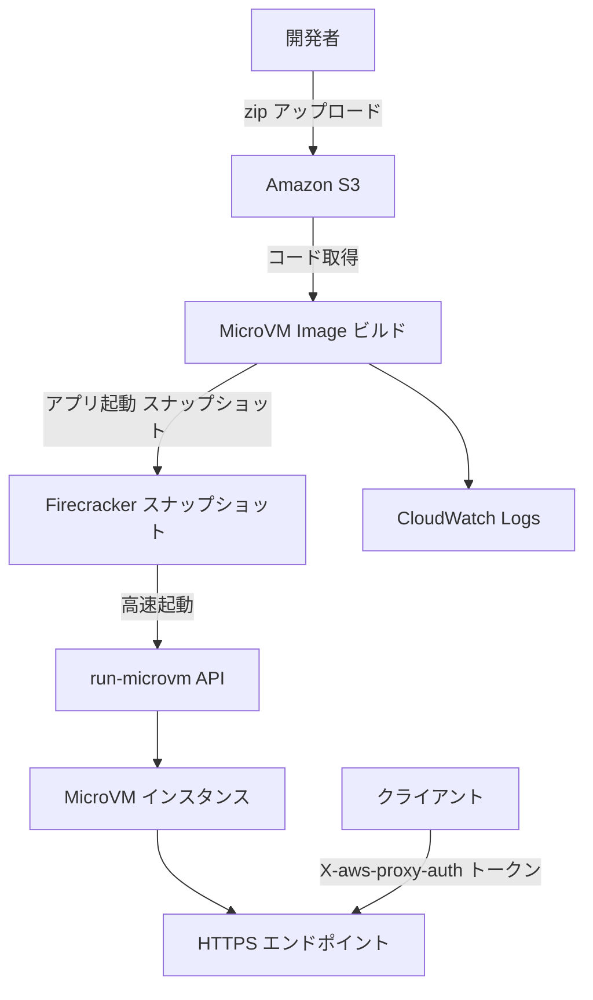
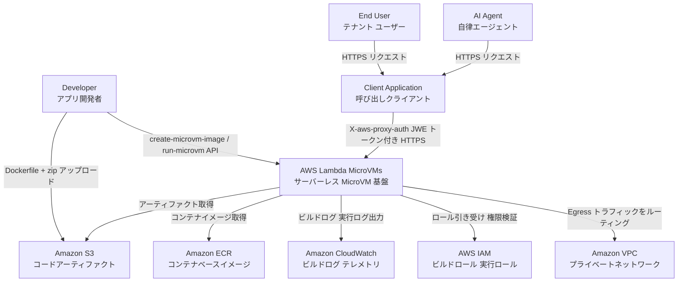
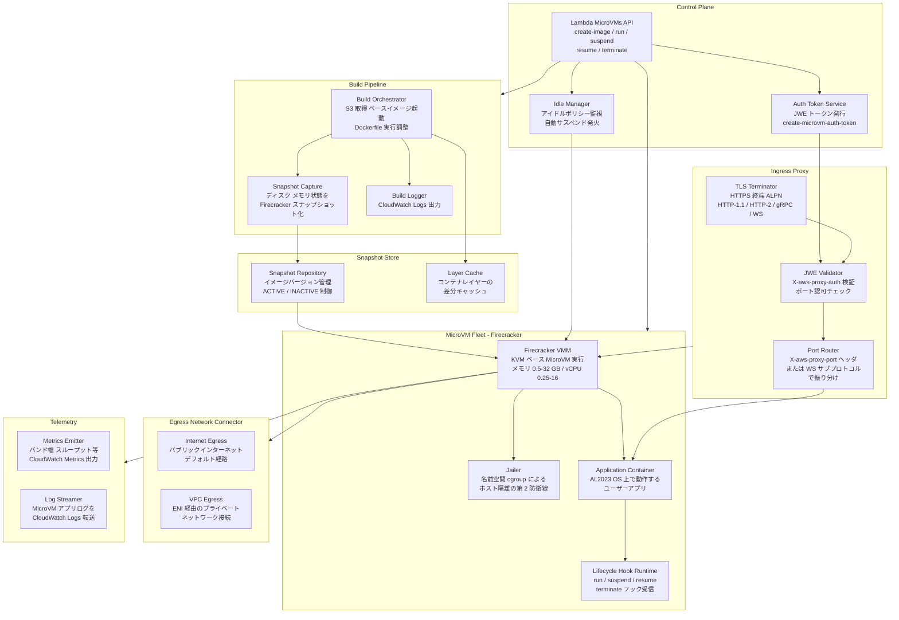
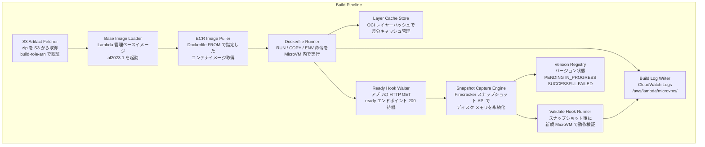
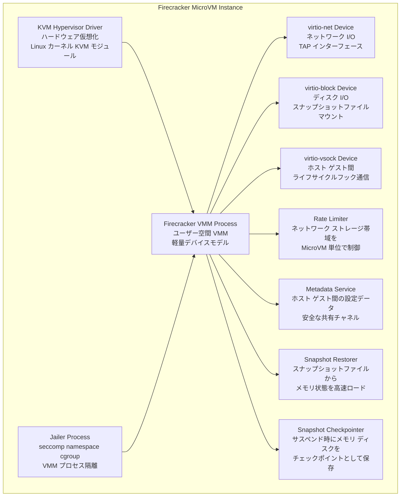
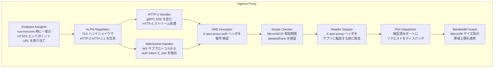
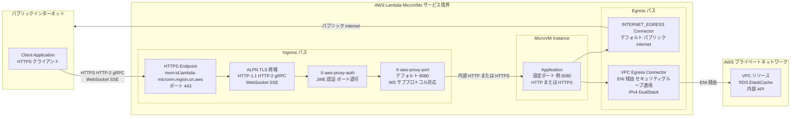
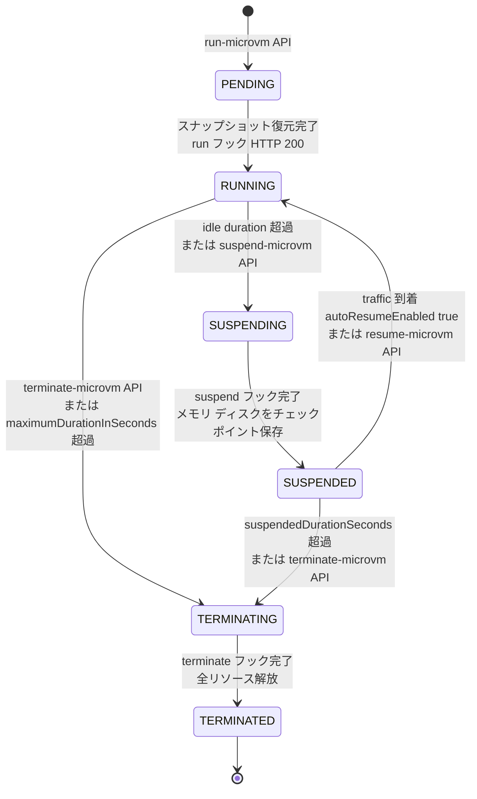
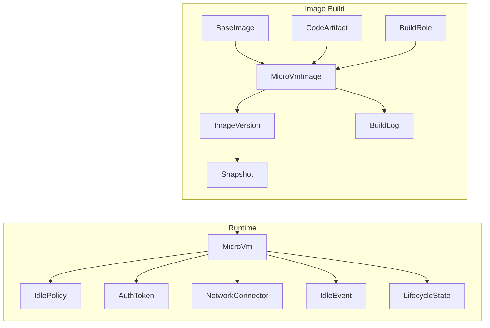

## ■概要

AWS Lambda MicroVMs は、2026 年 6 月 22 日に GA となった AWS のサーバーレス計算プリミティブです。Firecracker 仮想化技術を基盤とし、ユーザーまたは AI が生成したコードを VM レベルの強隔離環境で実行できます。Lambda Functions の基盤として月間 15 兆回以上の呼び出しを支える Firecracker を、開発者が直接制御できるように公開したサービスです。

対象ユースケースは「複数ユーザーまたは AI エージェントが接続し、コードを実行する環境」です。インタラクティブ開発環境・CI/CD・AI サンドボックスなど、高い隔離性・高速起動・ライフサイクル制御の 3 要素を同時に求める用途向けです。



| 要素名 | 説明 |
|---|---|
| 開発者 | Dockerfile とアプリコードを zip 化して S3 にアップロードする |
| Amazon S3 | ビルドアーティファクト (zip) の保存先 |
| MicroVM Image ビルド | Lambda が Dockerfile を実行しアプリを起動して初期化済みスナップショットを生成する |
| Firecracker スナップショット | 完全初期化済みの VM 状態を保存したイメージ |
| run-microvm API | スナップショットから MicroVM を即時起動する API 呼び出し |
| MicroVM インスタンス | 実行中の Firecracker VM。メモリ・ディスク・プロセスを保持する |
| HTTPS エンドポイント | LB 不要の専用エンドポイント `mvm-<id>.lambda-microvm.<region>.on.aws` |
| CloudWatch Logs | ビルドログの出力先 `/aws/lambda/microvms/<image-name>` |
| クライアント | 短命トークン (`create-microvm-auth-token`) を `X-aws-proxy-auth` ヘッダに付与して接続する |

### 他サービスとの比較

| サービス | 実行方式 | 隔離レベル | 最大実行時間 | 状態保持 | 起動速度 | 課金モデル |
|---|---|---|---|---|---|---|
| **Lambda MicroVMs** | Firecracker VM (管理不要) | VM レベル (カーネル非共有) | 8 時間 | メモリ・ディスク・プロセスを保持 (suspend/resume) | スナップショットから near-instant | baseline 秒課金 + peak 使用分のみ。suspend 中はコンピュート無課金 |
| **Lambda Functions** | Firecracker VM (内部) | VM レベル (ユーザー非制御) | 15 分 | ステートレス | Cold start あり / Provisioned Concurrency で短縮可 | リクエスト数 + 実行時間 (GB-秒) |
| **AWS Fargate** | コンテナ (ECS/EKS タスク) | コンテナレベル (カーネル共有) | 制限なし | タスク内でファイルシステム保持 | 数十秒〜数分 | vCPU・メモリ秒課金 (実行中常時) |
| **Firecracker 直叩き** | Firecracker VM (自己管理) | VM レベル (カーネル非共有) | 制限なし | 自己管理 | サブ秒〜数百 ms | インフラ費用 (EC2 等) + 運用コスト |
| **E2B** | Firecracker VM (マネージド) | VM レベル (カーネル非共有) | 最大 24 時間 | セッション内保持 | 200 ms 未満 | 従量課金 (無料枠あり) |
| **Modal Labs Sandbox** | コンテナ相当 (カスタム) | コンテナレベル | 最大 24 時間 | Filesystem Snapshot で状態移行 | 数秒 | 実行時間従量課金 |
| **Fly Machines** | Firecracker VM (マネージド) | VM レベル (カーネル非共有) | 制限なし | volume + Filesystem に保持 | 数百 ms (auto-start) | vCPU・メモリ秒課金 + ボリューム |
| **Cloudflare Containers** | コンテナ (Workers 連携) | コンテナレベル | 非公開 | 一定アイドル後に停止 | Workers と連携のため高速 | Workers Paid プラン |

> 同一ワークロード (2 vCPU / 4 GB メモリ・常時 730 h/月) 換算では、Fargate 約 $72 / Lambda MicroVMs (baseline 常時 RUNNING) 約 $184 / Fly Machines (always-on) 約 $40 程度 (2026-06 時点の公開料金からの目安、Pricing 計算は `2 × 730 × 3600 × $0.0000276944 + 4 × 730 × 3600 × $0.0000036667 ≈ $184` から導出)。Lambda MicroVMs は「suspend 中は無課金」の前提で短セッションを大量に回す設計に最適化されており、常時稼働ワークロードでは Fargate/Fly の方が安価です。

### いつ Lambda MicroVMs を選ぶか / 選ばないか

| 判断軸 | Lambda MicroVMs を選ぶ | Lambda MicroVMs を選ばない |
|---|---|---|
| **隔離要件** | VM レベルの強隔離が必須 (untrusted コード・マルチテナント) | コンテナ程度の隔離で十分な社内ツール |
| **実行時間** | 15 分超〜最大 8 時間のセッションが必要 | 15 分以内のリクエスト処理 (Lambda Functions が最適) |
| **状態保持** | セッション中メモリ・ディスクを維持したい | ステートレス処理で状態は外部ストアに任せられる |
| **インフラ管理** | LB・ネットワーク設定を最小化したい | 長期稼働サーバーやコンテナオーケストレーション基盤がすでにある |
| **起動速度** | スナップショットからの near-instant 起動が必要 | 低頻度バッチ処理で起動速度は問わない |
| **アーキテクチャ** | ARM64 で動作することが許容できる | x86_64 専用バイナリ・ライブラリへの依存がある |
| **エコシステム** | AWS 環境に統一したい | E2B / Modal / Fly などの専用サンドボックス SDK を使っている |
| **コスト構造** | アイドル時コストを抑えたい (suspend 中はコンピュート無課金) | 常時稼働でサスペンドが不要なワークロード (Fargate の方がシンプル) |

## ■特徴

- **Firecracker ベースの VM 隔離**: 各 MicroVM は専用カーネルを持ち、カーネルを共有するコンテナより高い隔離性を実現します。
- **スナップショット起動**: Dockerfile でアプリを起動した初期化済み状態をスナップショット化し、`run-microvm` 時に復元します。アプリの初期化時間をゼロにします。
- **Suspend / Resume**: アイドル時に自動サスペンドし、トラフィック到達時に near-instant で再開します。アイドルポリシー (`maxIdleDurationSeconds` / `suspendedDurationSeconds`) で挙動を制御します。
- **最大 8 時間の実行時間**: Lambda Functions の 15 分上限を超え、長時間インタラクティブセッションや AI エージェントタスクに対応します。
- **ARM64 限定**: 2026 年 6 月 GA 時点の対応アーキテクチャは ARM64 のみです。
- **Baseline + 最大 4x Burst**: ベースライン (設定した vCPU・メモリ) は常時課金、ピーク時は最大 4 倍 (上限 16 vCPU / 32 GB メモリ) まで垂直スケールし、使用分のみ追加課金します。
- **最大スペック**: vCPU 最大 16、メモリ最大 32 GB、ディスク最大 32 GB。
- **専用 HTTPS エンドポイント**: `mvm-<id>.lambda-microvm.<region>.on.aws` の専用 URL を自動発行します。LB・リバースプロキシの設置は不要です。
- **マルチプロトコル対応イングレス**: HTTP/1.1・HTTP/2・gRPC・WebSocket・SSE を同一エンドポイントで受け付けます。
- **JWE 認証**: `create-microvm-auth-token` で発行した短命トークンを `X-aws-proxy-auth` ヘッダで渡す認証方式を採用します。
- **設定可能なエグレス**: `INTERNET_EGRESS` (パブリックインターネット) または VPC 接続を選択します。
- **ライフサイクル API**: `suspend-microvm` / `resume-microvm` / `terminate-microvm` で各状態を明示的に制御します。
- **CloudWatch Logs 統合**: ビルドログは `/aws/lambda/microvms/<image-name>` に自動出力されます。
- **サーバー管理不要**: EC2・Fargate タスク・EKS ノードの管理は不要です。

## ■構造

> **注記**: 以下のコンテナ図・コンポーネント図に含まれる内部コンポーネント名 (例: Idle Manager, JWE Validator, Snapshot Repository, Endpoint Assigner 等) は、公式 API・CLI の挙動と Firecracker の構造から起こした **推定アーキテクチャ**です。AWS 公式ドキュメントは MicroVMs の挙動と公開 API は説明していますが、内部実装の名称・分解は公開していません。責務理解の補助として読んでください。

### ●システムコンテキスト図



| 要素名 | 説明 |
|---|---|
| Developer | MicroVM イメージをビルドし、MicroVM のライフサイクルを API で操作する開発者 |
| End User | AI IDE・CI/CD・Jupyter 等のアプリケーション経由で MicroVM に接続するエンドユーザー |
| AI Agent | コード実行サンドボックスや強化学習環境として MicroVM を利用する自律型 AI エージェント |
| AWS Lambda MicroVMs | Firecracker ベースのサーバーレス MicroVM 基盤。イメージビルド・スナップショット管理・ネットワーキング・ライフサイクル管理を提供 |
| Amazon S3 | Dockerfile とアプリコードを含む zip アーティファクトの保存先。ビルド時に取得される |
| Amazon ECR | Dockerfile の `FROM` で指定するプライベートコンテナベースイメージのレジストリ |
| Amazon CloudWatch | ビルドログ (`/aws/lambda/microvms/<image-name>`) と MicroVM 実行ログの格納先 |
| AWS IAM | ビルドロール (S3・ECR・CloudWatch アクセス) と実行ロール (MicroVM の AWS サービスアクセス) を管理 |
| Amazon VPC | VPC Egress Network Connector を通じた MicroVM からのプライベートネットワーク通信先 |
| Client Application | MicroVM の HTTPS エンドポイントに接続するアプリ。JWE トークンで認証する |

### ●コンテナ図




#### Control Plane

| 要素名 | 説明 |
|---|---|
| Lambda MicroVMs API | create-microvm-image / run-microvm / suspend-microvm 等を受け付ける統合コントロール API |
| Idle Manager | MicroVM のエンドポイントへのトラフィックを監視し、`maxIdleDurationSeconds` 超過で自動サスペンドを発火する |
| Auth Token Service | `create-microvm-auth-token` を処理し、MicroVM ID・ポートスコープ・有効期限を含む JWE トークンを発行する |

#### Build Pipeline

| 要素名 | 説明 |
|---|---|
| Build Orchestrator | S3 からアーティファクトを取得し、ベースイメージ上で MicroVM を起動して Dockerfile 実行を調整する |
| Snapshot Capture | アプリ初期化完了後 (`/ready` フック HTTP 200) にディスク・メモリ・プロセス状態を Firecracker スナップショットとして保存する |
| Build Logger | ビルドプロセスのログを CloudWatch Logs (`/aws/lambda/microvms/<image-name>`) に転送する |

#### Snapshot Store

| 要素名 | 説明 |
|---|---|
| Snapshot Repository | MicroVM イメージのバージョン (PENDING / IN_PROGRESS / SUCCESSFUL / FAILED) と有効化状態 (ACTIVE / INACTIVE) を管理する |
| Layer Cache | Dockerfile ビルド時のコンテナレイヤー差分キャッシュ。再ビルド時の差分転送を最適化する |

#### MicroVM Fleet (Firecracker)

| 要素名 | 説明 |
|---|---|
| Firecracker VMM | KVM ベースのユーザー空間 VMM。vCPU・メモリ・ディスクを分離した MicroVM を起動・停止・スナップショット管理する |
| Jailer | seccomp フィルタ・Linux 名前空間・cgroup を組み合わせて Firecracker プロセスをホストから多重隔離する第 2 防衛線 |
| Application Container | AL2023 OS 上で動作するユーザー定義のアプリコンテナ。baseline 時の vCPU・メモリを超えた場合は最大 4x にバースト |
| Lifecycle Hook Runtime | `/run`, `/suspend`, `/resume`, `/terminate` の各ライフサイクルイベントを HTTP でアプリに通知し、応答を Control Plane に返す |

#### Ingress Proxy

| 要素名 | 説明 |
|---|---|
| TLS Terminator | クライアントとの TLS を終端。ALPN で HTTP/2 を優先交渉し、HTTP/1.1 にフォールバック。gRPC・WebSocket・SSE もサポート |
| JWE Validator | `X-aws-proxy-auth` ヘッダの JWE トークンを検証し、MicroVM ID の一致・有効期限・ポートスコープを確認する |
| Port Router | `X-aws-proxy-port` ヘッダまたは WebSocket サブプロトコル `lambda-microvms.port.N` を解析し、MicroVM 内の対象ポートへルーティングする。デフォルトは 8080 |

#### Egress Network Connector

| 要素名 | 説明 |
|---|---|
| Internet Egress | デフォルトのパブリックインターネット向け出口。Lambda 管理の `INTERNET_EGRESS` ARN で参照する |
| VPC Egress | 顧客 VPC の ENI を通じてプライベートリソース (RDS・ElastiCache 等) に接続するカスタムコネクタ。セキュリティグループ・NACL が適用される |

#### Telemetry

| 要素名 | 説明 |
|---|---|
| Metrics Emitter | 帯域幅使用率・スループット等のメトリクスを CloudWatch Metrics に出力する |
| Log Streamer | MicroVM 内アプリの標準出力・エラー出力を CloudWatch Logs に転送する |

### ●コンポーネント図

#### Build Pipeline ドリルダウン



| コンポーネント名 | 説明 |
|---|---|
| S3 Artifact Fetcher | build-role-arn の認証情報で S3 から zip アーティファクトを取得する |
| Base Image Loader | `--base-image-arn` で指定された Lambda 管理 MicroVM ベースイメージ (AL2023) を起動する |
| ECR Image Puller | Dockerfile の `FROM` 行で指定されたコンテナベースイメージを取得する。プライベート ECR は build-role の ecr 権限が必要 |
| Dockerfile Runner | Dockerfile の `RUN`, `COPY`, `ENV`, `EXPOSE`, `CMD`/`ENTRYPOINT` を MicroVM 内で順次実行する |
| Ready Hook Waiter | アプリ起動後に `/aws/lambda-microvms/runtime/v1/ready` を HTTP でポーリングし、200 返答でスナップショットへ進む。タイムアウトは 1〜3600 秒で設定可能 |
| Validate Hook Runner | スナップショット後に新規 MicroVM を起動し `/validate` を呼んで動作検証する。ウォームアップにも使用可能 |
| Snapshot Capture Engine | Firecracker の VSOCK/API 経由でディスクイメージとメモリ状態をファイルとして永続化する |
| Layer Cache Store | OCI コンテナレイヤーのハッシュ単位でキャッシュを管理し、再ビルド時の差分転送量を削減する |
| Build Log Writer | ビルド各ステップのログを CloudWatch Logs へ書き込む |
| Version Registry | イメージバージョンの状態 (PENDING / IN_PROGRESS / SUCCESSFUL / FAILED) と有効化状態 (ACTIVE / INACTIVE) を管理する |

#### MicroVM Fleet (Firecracker) ドリルダウン



| コンポーネント名 | 説明 |
|---|---|
| KVM Hypervisor Driver | Linux カーネルの KVM モジュール。ハードウェア支援仮想化でゲスト CPU・メモリを分離する |
| Firecracker VMM Process | ユーザー空間で動作する VMM 本体。最小限のデバイスモデル (virtio-net / virtio-block / virtio-vsock / Serial / キーボード) のみ実装 |
| Jailer Process | seccomp フィルタ・Linux 名前空間・cgroup で Firecracker プロセスをホストから隔離する第 2 防衛線 |
| virtio-net Device | ゲスト・ホスト間のネットワーク I/O を担う仮想 NIC。TAP インターフェース経由でホストネットワークに接続 |
| virtio-block Device | ゲストのディスク I/O を担う仮想ブロックデバイス。スナップショットファイルをブロックデバイスとしてマウント |
| virtio-vsock Device | ホスト・ゲスト間の AF_VSOCK 通信チャネル。ライフサイクルフック (`/run`, `/suspend` 等) の HTTP 通信に使用 |
| Rate Limiter | ネットワーク帯域とストレージ I/O を MicroVM サイズに比例して制限する (0.5 GB: 1 MB/s〜8 GB: 16 MB/s) |
| Metadata Service | ホストから MicroVM ゲストへ設定データを安全に受け渡す内部チャネル。`runHookPayload` の配信に使用 |
| Snapshot Restorer | スナップショットファイルからメモリ状態を高速ロードして MicroVM を再開する。`run-microvm` および `resume-microvm` 時に動作 |
| Snapshot Checkpointer | `suspend-microvm` 時にメモリとディスクの現在状態をチェックポイントファイルとして保存する |

#### Ingress Proxy ドリルダウン



| コンポーネント名 | 説明 |
|---|---|
| Endpoint Assigner | `run-microvm` 成功時に `mvm-<id>.lambda-microvm.<region>.on.aws` 形式の一意 HTTPS URL を割り当てる |
| ALPN Negotiator | TLS ハンドシェイク時に ALPN で HTTP/2 を優先交渉。クライアントが非対応の場合は HTTP/1.1 にフォールバック |
| HTTP-2 Handler | HTTP/2 マルチプレクシング・gRPC (HTTP/2 over TLS)・SSE のストリーム処理を担う |
| WebSocket Handler | WS 接続開始時のサブプロトコル (`lambda-microvms.authentication.<token>`, `lambda-microvms.port.N`) を解析して認証・ポート情報を取得する |
| JWE Decryptor | `X-aws-proxy-auth` ヘッダの JWE (JSON Web Encryption) 文字列を Lambda の鍵で復号し内容を取得する |
| Scope Checker | 復号された JWE の microvmId・有効期限・`allowedPorts` を検証。不一致は 403 Forbidden を返す |
| Header Stripper | `X-aws-proxy-*` ネームスペースのヘッダをアプリケーションに転送する前にすべて除去する |
| Port Dispatcher | 検証済みの対象ポート (デフォルト 8080) にリクエストをディスパッチする |
| Bandwidth Guard | MicroVM サイズ別の帯域上限 (例: 2 GB = 4 MB/s) を適用し、超過時は 429 Too Many Requests を返す |

### ●ネットワーク構成図



#### Ingress 詳細

| 要素名 | 説明 |
|---|---|
| HTTPS Endpoint | `run-microvm` 時に割り当てられる一意のエンドポイント URL。ポート 443 で受け付ける。ロードバランサー不要 |
| TLS 終端 (ALPN) | クライアントとの TLS を終端。ALPN で HTTP/2 を優先し HTTP/1.1 にフォールバック。HTTP/2, gRPC, WebSocket, SSE に対応 |
| X-aws-proxy-auth | JWE (JSON Web Encryption) 形式の認証トークン。`create-microvm-auth-token` で発行。microvmId・allowedPorts・expiration をスコープに含む |
| X-aws-proxy-port | リクエストのルーティング先ポートを指定するヘッダ。WebSocket は `lambda-microvms.port.N` サブプロトコルで代替可。デフォルト 8080 |

#### Egress 詳細

| 要素名 | 説明 |
|---|---|
| INTERNET_EGRESS Connector | Lambda 管理のデフォルト出口コネクタ ARN。パブリックインターネットへの通信を許可する |
| VPC Egress Connector | `aws lambda-core create-network-connector` で作成するカスタムコネクタ。VPC サブネット・セキュリティグループを指定。ENI を自動プロビジョニング。IPv4 / DualStack 対応 |
| NO_INGRESS Connector | Ingress を完全無効化するための Lambda 管理コネクタ ARN |

### ●MicroVM ライフサイクル状態遷移



| 状態 | 説明 |
|---|---|
| PENDING | スナップショットからのロード中。リソース割り当て中 |
| RUNNING | アプリがリクエストを受け付け可能。`/run` フック完了後に遷移。コンピュート課金が発生 |
| SUSPENDING | `/suspend` フック実行中。メモリ・ディスクをチェックポイントに保存中 |
| SUSPENDED | 一時停止状態。メモリ・ディスク状態を保持。コンピュート課金なし。スナップショットストレージ料金のみ |
| TERMINATING | `/terminate` フック実行中。リソース解放中 |
| TERMINATED | 終端状態。全リソース解放済み。復旧・再起動は不可 |

## ■データ

### ●概念モデル



| エンティティ | 説明 |
|---|---|
| BaseImage | Lambda 管理の MicroVM ベースイメージ。AL2023 など。`--base-image-arn` で参照 |
| CodeArtifact | S3 にアップロードしたアプリ + Dockerfile の zip |
| BuildRole | ビルド時に Lambda が引き受ける IAM ロール (S3, ECR, CloudWatch アクセス) |
| MicroVmImage | ビルド設定とメタデータを束ねるリソース。複数の ImageVersion を保持 |
| ImageVersion | 1 つの MicroVmImage の中の個別ビルドバージョン。Lambda 自動採番 |
| Snapshot | ImageVersion ごとに紐づく Firecracker スナップショット。run / resume の素材 |
| BuildLog | CloudWatch Logs のログストリーム |
| MicroVm | スナップショットから起動した個別のランタイムインスタンス |
| IdlePolicy | MicroVm の自動 suspend / resume 設定 |
| AuthToken | JWE 形式の短命認証トークン |
| NetworkConnector | Ingress / Egress のネットワーク設定 ARN |
| IdleEvent | アイドル判定とサスペンド契機の履歴 |
| LifecycleState | MicroVm の状態遷移履歴 |

### ●情報モデル

```mermaid
classDiagram
  class MicroVmImage {
    imageName : string
    imageArn : string
    imageState : ImageState
    stateReason : string
    description : string
    memory : integer
    baseImageArn : string
    baseImageVersion : string
    buildRoleArn : string
    codeArtifact : CodeArtifact
    environmentVariables : map
    additionalOsCapabilities : list
    hooks : HookConfig
    createdAt : datetime
    lastUpdatedAt : datetime
  }

  class ImageVersion {
    imageVersion : string
    versionState : VersionState
    versionActivation : VersionActivation
    stateReason : string
    createdAt : datetime
  }

  class Snapshot {
    snapshotId : string
    imageVersion : string
    diskState : string
    memoryState : string
    createdAt : datetime
  }

  class BaseImage {
    imageIdentifier : string
    imageArn : string
    versionState : BaseImageVersionState
    releasedAt : datetime
    deprecatedAt : datetime
    expiresAt : datetime
  }

  class CodeArtifact {
    uri : string
  }

  class BuildRole {
    roleArn : string
  }

  class BuildLog {
    logGroup : string
    logStream : string
  }

  class HookConfig {
    hookPort : integer
    readyTimeoutInSeconds : integer
    validateTimeoutInSeconds : integer
  }

  class MicroVm {
    microvmId : string
    imageArn : string
    imageVersion : string
    state : MicroVmState
    stateReason : string
    endpoint : string
    executionRoleArn : string
    maximumDurationInSeconds : integer
    runHookPayload : string
    loggingConfig : LoggingConfig
    createdAt : datetime
    lastUpdatedAt : datetime
  }

  class IdlePolicy {
    autoResumeEnabled : boolean
    maxIdleDurationSeconds : integer
    suspendedDurationSeconds : integer
  }

  class AuthToken {
    microvmId : string
    authToken : map
    expirationInMinutes : integer
    allowedPorts : list
    expiresAt : datetime
  }

  class NetworkConnector {
    connectorArn : string
    connectorName : string
    connectorState : NetworkConnectorState
    stateReason : string
    configuration : ConnectorConfig
    operatorRoleArn : string
    createdAt : datetime
  }

  class ConnectorConfig {
    subnetIds : list
    securityGroupIds : list
    networkProtocol : string
    associatedComputeResourceTypes : list
  }

  class IdleEvent {
    microvmId : string
    idleSince : datetime
    triggerType : string
  }

  class LifecycleState {
    state : MicroVmState
    previousState : MicroVmState
    transitionedAt : datetime
    trigger : string
  }

  class LoggingConfig {
    logGroup : string
    logStream : string
    enabled : boolean
  }

  MicroVmImage "1" --> "many" ImageVersion
  ImageVersion "1" --> "0..1" Snapshot
  MicroVmImage "many" --> "1" BaseImage
  MicroVmImage "1" --> "1" CodeArtifact
  MicroVmImage "1" --> "1" BuildRole
  MicroVmImage "1" --> "many" BuildLog
  MicroVmImage "1" --> "0..1" HookConfig
  MicroVm "1" --> "1" IdlePolicy
  MicroVm "1" --> "many" AuthToken
  MicroVm "many" --> "many" NetworkConnector
  MicroVm "1" --> "many" IdleEvent
  MicroVm "1" --> "many" LifecycleState
  MicroVm "1" --> "0..1" LoggingConfig
  NetworkConnector "1" --> "0..1" ConnectorConfig
```



### ●Enum 値一覧

#### ImageState (MicroVmImage のライフサイクル)

| 値 | 説明 |
|---|---|
| `CREATING` | 初回 create-microvm-image 実行中 |
| `CREATED` | 初回ビルド成功。MicroVM を起動できる状態 |
| `CREATION_FAILED` | 初回ビルド失敗 |
| `UPDATING` | update-microvm-image 実行中 |
| `UPDATED` | 更新ビルド成功。MicroVM を起動できる状態 |
| `UPDATE_FAILED` | 更新ビルド失敗 |
| `DELETING` | delete-microvm-image 実行中 |
| `DELETED` | 削除完了 |
| `DELETION_FAILED` | 削除失敗 |

> MicroVM を起動できる条件: image state が `CREATED` または `UPDATED`、かつ対象 Version が `SUCCESSFUL` かつ `ACTIVE` の 3 条件すべて。

#### VersionState (ImageVersion のビルド進捗)

| 値 | 説明 |
|---|---|
| `PENDING` | ビルドキュー待ち |
| `IN_PROGRESS` | Dockerfile 実行・スナップショット取得中 |
| `SUCCESSFUL` | ビルド成功。スナップショット生成済み |
| `FAILED` | ビルド失敗。CloudWatch Logs で詳細確認 |

#### VersionActivation

| 値 | 説明 | 制御者 |
|---|---|---|
| `ACTIVE` | MicroVM を起動可能。新バージョン作成時の既定値 | ユーザー |
| `INACTIVE` | 無効化。削除せず一時停止したい場合に使用 | ユーザー |

#### BaseImageVersionState

| 値 | 期間 | 制限 |
|---|---|---|
| `AVAILABLE` | — | 推奨。新規ビルド・起動とも可 |
| `DEPRECATED` | 60 日間 | 新バージョンあり。ビルド・起動とも引き続き可 |
| `EXPIRING` | 30 日間 | 新規 Image ビルド不可。既存 Image の起動は可 |
| `EXPIRED` | — | ビルド・起動とも不可。最新バージョンで再ビルド必要 |
| `RECALLED` | 即時 | 重大なセキュリティ問題のため即時利用不可 |

#### MicroVmState と遷移

| 状態 | 説明 |
|---|---|
| `PENDING` | リソース割り当て中。スナップショットをロード中 |
| `RUNNING` | 稼働中。エンドポイント URL でトラフィックを受付中 |
| `SUSPENDING` | サスペンド処理中。`/suspend` フック実行中 |
| `SUSPENDED` | サスペンド済み。状態は保全。コンピュート料金は発生しない |
| `TERMINATING` | 終了処理中。`/terminate` フック実行中 |
| `TERMINATED` | 終了済み。終端状態。再開・再起動不可 |

> 公式 MicroVM 状態テーブルは上記 6 値のみです。`SUSPENDED → RUNNING` は直接遷移として記載されており、`RESUMING` のような中間状態は公開されていません。`get-microvm` の応答も上記 6 値のいずれかになります。

| 遷移元 | 遷移先 | トリガー |
|---|---|---|
| `PENDING` | `RUNNING` | プロビジョニング完了・`/run` フック成功 |
| `RUNNING` | `SUSPENDING` | アイドル時間超過 または `suspend-microvm` API |
| `SUSPENDING` | `SUSPENDED` | `/suspend` フック完了・メモリ / ディスクのチェックポイント完了 |
| `SUSPENDED` | `RUNNING` | トラフィック到着 (`autoResumeEnabled=true`) または `resume-microvm` API |
| `RUNNING` | `TERMINATING` | `terminate-microvm` API または `maximumDurationInSeconds` 超過 |
| `SUSPENDED` | `TERMINATING` | `suspendedDurationSeconds` 超過 または `terminate-microvm` API |
| `TERMINATING` | `TERMINATED` | `/terminate` フック完了・全リソース解放 |

> `/run` フックが失敗・タイムアウトした場合、`RUNNING` に遷移せず直接 `TERMINATING` へ移行することがあります。

#### NetworkConnectorState

| 値 | 説明 |
|---|---|
| `PENDING` | ENI をプロビジョニング中 |
| `ACTIVE` | 利用可能。`run-microvm` で参照できる |
| `INACTIVE` | 一時的に無効 |
| `FAILED` | プロビジョニングまたは更新失敗。`StateReason` 参照 |
| `DELETING` | 削除中。ENI クリーンアップ中 |
| `DELETE_FAILED` | 削除失敗 |

### ●API レスポンス JSON サンプル

#### get-microvm-image レスポンス

```json
{
  "imageName": "my-first-microvm-image",
  "imageArn": "arn:aws:lambda:us-east-1:123456789012:microvm-image:my-first-microvm-image",
  "state": "CREATED",
  "imageVersion": "1.0"
}
```

> 公式サンプルは最小表示。完全フィールドセット (`description`, `createdAt`, `memory`, `codeArtifact`, `buildRoleArn`, `baseImageArn`, `environmentVariables`, `hooks`, `additionalOsCapabilities` 等) は API Reference 全公開待ちです。

#### run-microvm レスポンス

```json
{
  "microvmId": "mvm-01234567-abcd-ef01-2345-6789abcdef01",
  "state": "PENDING",
  "endpoint": "mvm-01234567-abcd-ef01-2345-6789abcdef01.lambda-microvm.us-east-1.on.aws"
}
```

#### create-microvm-auth-token レスポンス

```json
{
  "authToken": {
    "X-aws-proxy-auth": "<JWE token string>"
  }
}
```

> `authToken` はマップ型。キー `X-aws-proxy-auth` にトークン文字列が入ります。

#### /run フック受信 JSON

```json
{
  "microvmId": "mvm-01234567-abcd-ef01-2345-6789abcdef01",
  "runHookPayload": "tenant-specific-string"
}
```

### ●AuthToken allowedPorts 型定義

| 形式 | 構造 | 説明 |
|---|---|---|
| 単一ポート | `{"port": N}` | 特定の 1 ポートのみ許可 |
| ポート範囲 | `{"range": {"startPort": N, "endPort": N}}` | 範囲内のポートを許可 |
| 全ポート | `{"allPorts": {}}` | 全ポートを許可 |

## ■構築方法

### ●前提条件

#### 対応リージョン

GA 時点 (2026-06-22) で以下の 5 リージョンが対応しています。

| リージョンコード | ロケーション |
|---|---|
| us-east-1 | 米国東部 (バージニア北部) |
| us-east-2 | 米国東部 (オハイオ) |
| us-west-2 | 米国西部 (オレゴン) |
| eu-west-1 | 欧州 (アイルランド) |
| ap-northeast-1 | アジアパシフィック (東京) |

#### アーキテクチャ制約

MicroVMs は **ARM64** 専用です。コンテナベースイメージと依存バイナリはすべて `linux/arm64` でビルドしてください。

#### S3 バケット

```bash
aws s3 mb s3://<bucket-name> --region <region>
```

#### AWS CLI バージョン

`lambda-microvms` サブコマンドには十分新しい AWS CLI v2 が必要です (DevelopersIO の検証記事では **v2.35.10** で動作確認済み。公式に下限バージョンの明記はありません)。

```bash
aws --version
aws lambda-microvms help
```

### ●IAM ビルドロールの作成

信頼ポリシー (`trust-policy.json`):

```json
{
  "Version": "2012-10-17",
  "Statement": [{
    "Effect": "Allow",
    "Principal": { "Service": "lambda.amazonaws.com" },
    "Action": ["sts:AssumeRole", "sts:TagSession"]
  }]
}
```

権限ポリシー (`build-policy.json`):

```json
{
  "Version": "2012-10-17",
  "Statement": [
    {
      "Effect": "Allow",
      "Action": ["s3:GetObject"],
      "Resource": "arn:aws:s3:::<bucket-name>/*"
    },
    {
      "Effect": "Allow",
      "Action": [
        "logs:CreateLogGroup",
        "logs:CreateLogStream",
        "logs:PutLogEvents"
      ],
      "Resource": "arn:aws:logs:*:*:*"
    }
  ]
}
```

プライベート ECR を使う場合は ECR 権限を追加します。

```json
{
  "Effect": "Allow",
  "Action": [
    "ecr:GetAuthorizationToken",
    "ecr:BatchCheckLayerAvailability",
    "ecr:GetDownloadUrlForLayer",
    "ecr:BatchGetImage"
  ],
  "Resource": "*"
}
```

ロール作成:

```bash
aws iam create-role \
  --role-name MicroVMBuildRole \
  --assume-role-policy-document file://trust-policy.json

aws iam put-role-policy \
  --role-name MicroVMBuildRole \
  --policy-name MicroVMBuildPolicy \
  --policy-document file://build-policy.json
```

### ●Dockerfile の作成とベースイメージ選択

MicroVMs には「MicroVM ベースイメージ」と「コンテナベースイメージ」の **2 種類**があります。

| 種別 | ARN / URI | 役割 |
|---|---|---|
| **MicroVM ベースイメージ** | `arn:aws:lambda:<region>:aws:microvm-image:al2023-1` | MicroVM の OS 環境とサービスコンポーネント。`--base-image-arn` に指定 |
| **コンテナベースイメージ (Lambda 管理)** | `public.ecr.aws/lambda/microvms:al2023-minimal` | Dockerfile の `FROM` に使う Amazon Linux 2023 最小イメージ |
| **コンテナベースイメージ (任意)** | 任意の Linux イメージ | スナップショット互換性の要件を満たすもの |

利用可能な MicroVM ベースイメージの確認:

```bash
aws lambda-microvms list-managed-microvm-images

aws lambda-microvms list-managed-microvm-image-versions \
  --image-identifier arn:aws:lambda:<region>:aws:microvm-image:al2023-1
```

#### スナップショット互換性の要点

- **CSPRNG**: 言語標準の CSPRNG ライブラリを使います。スナップショット復元後も MicroVM ごとに一意な値を生成できます。
- **OpenSSL**: Lambda 管理コンテナベースイメージ (`public.ecr.aws/lambda/microvms:al2023-minimal`) にはスナップショット互換版が含まれます。独自イメージを使う場合は `openssl-snapsafe-libs` を導入します。

#### Dockerfile 例 (Python / Flask)

```dockerfile
FROM public.ecr.aws/lambda/microvms:al2023-minimal
RUN dnf install -y python3 python3-pip && dnf clean all
WORKDIR /app
COPY requirements.txt .
RUN pip install --no-cache-dir -r requirements.txt
COPY app.py .
EXPOSE 8080
CMD ["gunicorn", "--bind", "0.0.0.0:8080", "app:app"]
```

#### Dockerfile 例 (Node.js)

```dockerfile
FROM node:24-alpine
WORKDIR /app
COPY app.js .
EXPOSE 8080
CMD ["node", "app.js"]
```

### ●アーティファクトのパッケージングと S3 アップロード

```bash
zip app.zip app.py requirements.txt Dockerfile
aws s3 cp app.zip s3://<bucket-name>/app.zip
```

### ●MicroVM イメージの作成


```bash
aws lambda-microvms create-microvm-image \
  --name <image-name> \
  --code-artifact uri=s3://<bucket-name>/app.zip \
  --base-image-arn arn:aws:lambda:<region>:aws:microvm-image:al2023-1 \
  --build-role-arn arn:aws:iam::<account-id>:role/MicroVMBuildRole \
  --region <region>
```

| パラメータ | 必須 | 説明 |
|---|---|---|
| `--name` | 必須 | イメージ名 |
| `--code-artifact` | 必須 | S3 アーティファクト URI (`uri=s3://...`) |
| `--base-image-arn` | 必須 | Lambda 管理ベースイメージの ARN |
| `--build-role-arn` | 必須 | ビルドロールの ARN |
| `--memory` | 任意 | ベースラインメモリ (GB)。デフォルト 2 GB |
| `--additional-os-capabilities` | 任意 | 追加 Linux ケーパビリティ (`["ALL"]`) |
| `--environment-variables` | 任意 | 環境変数 (最大 50 変数) |
| `--base-image-version` | 任意 | ベースイメージのバージョンを固定する場合に指定 |
| `--description` | 任意 | イメージの説明 |
| `--hooks` | 任意 | フック設定 `hookPort=<port>,readyTimeoutInSeconds=<sec>,validateTimeoutInSeconds=<sec>` (タイムアウトは 1〜3600 秒) |

フック付き create 例:

```bash
aws lambda-microvms create-microvm-image \
  --name my-microvm-image \
  --code-artifact uri=s3://<bucket-name>/app.zip \
  --base-image-arn arn:aws:lambda:<region>:aws:microvm-image:al2023-1 \
  --build-role-arn arn:aws:iam::<account-id>:role/MicroVMBuildRole \
  --hooks 'hookPort=8080,readyTimeoutInSeconds=300,validateTimeoutInSeconds=120'
```

#### ビルド状態のポーリング

```bash
while true; do
  STATE=$(aws lambda-microvms get-microvm-image \
    --image-identifier arn:aws:lambda:<region>:<account-id>:microvm-image:<image-name> \
    --query 'state' --output text)
  echo "$(date +%H:%M:%S) $STATE"
  [ "$STATE" = "CREATED" ] && break
  sleep 10
done
```

#### イメージビルドフック

ビルド中にアプリケーションが公開する HTTP エンドポイントをフックとして設定できます。

| フック | パス | 目的 | HTTP ステータス |
|---|---|---|---|
| `/ready` | `/aws/lambda-microvms/runtime/v1/ready` | 初期化完了を通知してスナップショットをトリガー | 200: 完了 / 503: 未準備 (リトライ) |
| `/validate` | `/aws/lambda-microvms/runtime/v1/validate` | 復元後の動作を検証する。起動最適化にも使用可 | 200: 合格 / 503: 継続中 (リトライ) |

リスンポートは `--hooks` の `hookPort` フィールドで指定します。

### ●MicroVM サイジング

`--memory` パラメータでベースラインを設定します。vCPU はメモリに比例します (2 GB = 1 vCPU)。ピーク時はベースラインの最大 4 倍まで自動スケールします。

| Baseline メモリ | Baseline vCPU | Peak メモリ | Peak vCPU | エンドポイント帯域 |
|---|---|---|---|---|
| 0.5 GB | 0.25 | 2 GB | 1 | 1 MB/s (8 Mbps) |
| 1 GB | 0.5 | 4 GB | 2 | 2 MB/s (16 Mbps) |
| 2 GB (既定) | 1 | 8 GB | 4 | 4 MB/s (32 Mbps) |
| 4 GB | 2 | 16 GB | 8 | 8 MB/s (64 Mbps) |
| 8 GB | 4 | 32 GB | 16 | 16 MB/s (128 Mbps) |

> 公式仕様では MicroVM 1 台あたりディスク最大 32 GB が上限です。

## ■利用方法

### ●主要操作のコマンド一覧 (2026-06-22 GA 時点)

| 操作 | CLI コマンド | 分類 |
|---|---|---|
| MicroVM イメージ作成 | `create-microvm-image` | イメージ |
| MicroVM イメージ取得 | `get-microvm-image` | イメージ |
| MicroVM イメージ一覧 | `list-microvm-images` | イメージ |
| MicroVM イメージ更新 | `update-microvm-image` | イメージ |
| MicroVM イメージ削除 | `delete-microvm-image` | イメージ |
| イメージバージョン取得 | `get-microvm-image-version` | イメージ |
| イメージバージョン一覧 | `list-microvm-image-versions` | イメージ |
| イメージバージョン更新 | `update-microvm-image-version` | イメージ |
| イメージバージョン削除 | `delete-microvm-image-version` | イメージ |
| イメージビルド取得 | `get-microvm-image-build` | イメージ |
| イメージビルド一覧 | `list-microvm-image-builds` | イメージ |
| マネージドイメージ一覧 | `list-managed-microvm-images` | イメージ |
| マネージドイメージバージョン一覧 | `list-managed-microvm-image-versions` | イメージ |
| MicroVM 起動 | `run-microvm` | MicroVM |
| MicroVM 取得 | `get-microvm` | MicroVM |
| MicroVM 一覧 | `list-microvms` | MicroVM |
| MicroVM サスペンド | `suspend-microvm` | MicroVM |
| MicroVM レジューム | `resume-microvm` | MicroVM |
| MicroVM 終了 | `terminate-microvm` | MicroVM |
| 認証トークン作成 | `create-microvm-auth-token` | 認証 |
| シェル認証トークン作成 | `create-microvm-shell-auth-token` | 認証 |
| ビルド完了待ち | `wait microvm-image-version-successful` (※未確認) | Waiter |
| MicroVM RUNNING 待ち | `wait microvm-state-running` (※未確認) | Waiter |
| タグ一覧 | `list-tags` | タグ |
| タグ付与 | `tag-resource` | タグ |
| タグ削除 | `untag-resource` | タグ |

> Waiter (`aws lambda-microvms wait <name>`) は記事執筆時点 (2026-06-24) の公式 AWS CLI Reference に明示記載がありません。AWS CLI v2 は通常 waiter を自動生成しますが、実環境で `aws lambda-microvms wait help` を確認したうえで使用してください。利用不可の場合は本文の「ビルド状態のポーリング」と同様の `get-microvm` / `get-microvm-image` でループしてください。

### ●MicroVM の起動 (run-microvm)

```bash
aws lambda-microvms run-microvm \
  --image-identifier arn:aws:lambda:<region>:<account-id>:microvm-image:<image-name> \
  --ingress-network-connectors "arn:aws:lambda:<region>:aws:network-connector:aws-network-connector:ALL_INGRESS" \
  --egress-network-connectors "arn:aws:lambda:<region>:aws:network-connector:aws-network-connector:INTERNET_EGRESS" \
  --idle-policy '{"autoResumeEnabled":true,"maxIdleDurationSeconds":900,"suspendedDurationSeconds":300}' \
  --maximum-duration-in-seconds 14400 \
  --region <region>
```

| パラメータ | 必須 | 説明 |
|---|---|---|
| `--image-identifier` | 必須 | MicroVM イメージの ARN |
| `--image-version` | 任意 | イメージバージョン。省略時は最新のアクティブバージョン |
| `--execution-role-arn` | 任意 | MicroVM が他の AWS サービスにアクセスするための実行ロール |
| `--idle-policy` | 任意 | 自動サスペンド・レジュームの設定 |
| `--maximum-duration-in-seconds` | 任意 | 最大実行時間 (秒)。最大 28,800 秒 (8 時間) |
| `--run-hook-payload` | 任意 | MicroVM 起動時に `/run` フックへ渡すペイロード (最大 16 KB) |
| `--logging` | 任意 | CloudWatch ログ設定 |
| `--ingress-network-connectors` | 任意 | 受信ネットワークコネクタの ARN |
| `--egress-network-connectors` | 任意 | 送信ネットワークコネクタの ARN |

#### アイドルポリシーのフィールド

| フィールド | 説明 | 最大値 |
|---|---|---|
| `autoResumeEnabled` | `true` のとき、サスペンド中に通信が届くと自動でレジュームする | — |
| `maxIdleDurationSeconds` | 通信がない状態が続くとサスペンドするまでの秒数 | 28,800 秒 (8 時間) |
| `suspendedDurationSeconds` | サスペンド状態を維持する最大秒数。経過後に自動終了する | — |

### ●状態確認と一覧

```bash
aws lambda-microvms get-microvm \
  --microvm-identifier <microvm-id>

aws lambda-microvms wait microvm-state-running \
  --microvm-identifier <microvm-id>

aws lambda-microvms list-microvms

aws lambda-microvms list-microvms \
  --image-identifier <image-name> \
  --image-version 1.0
```

### ●認証トークンの作成と利用

すべての MicroVM エンドポイントへのリクエストには JWE 形式の認証トークンが必要です。

```bash
aws lambda-microvms create-microvm-auth-token \
  --microvm-identifier <microvm-id> \
  --expiration-in-minutes 30 \
  --allowed-ports '[{"allPorts":{}}]'
```

#### ポートスコープの指定方法

| 指定方法 | JSON |
|---|---|
| 単一ポート | `[{"port": 8080}]` |
| ポート範囲 | `[{"range": {"startPort": 8000, "endPort": 8099}}]` |
| 全ポート | `[{"allPorts": {}}]` |

#### トークンを変数に格納する例

```bash
TOKEN=$(aws lambda-microvms create-microvm-auth-token \
  --microvm-identifier <microvm-id> \
  --expiration-in-minutes 30 \
  --allowed-ports '[{"port":8080}]' \
  --query 'authToken."X-aws-proxy-auth"' \
  --output text)
```

### ●認証フローと HTTP リクエスト

認証フローは以下の 3 ステップです。

1. `create-microvm-auth-token` でトークンを取得する
2. `X-aws-proxy-auth` ヘッダにトークンを付与する
3. MicroVM の HTTPS エンドポイントへリクエストを送信する

#### curl

```bash
curl "https://<microvm-id>.lambda-microvm.<region>.on.aws/" \
  -H "X-aws-proxy-auth: <TOKEN>" \
  -H "X-aws-proxy-port: 8080"
```

#### boto3 (Python)

```python
import boto3
import requests

client = boto3.client("lambda-microvms")

run_resp = client.run_microvm(
    imageIdentifier="arn:aws:lambda:us-east-1:123456789012:microvm-image:my-image",
    idlePolicy={
        "autoResumeEnabled": True,
        "maxIdleDurationSeconds": 900,
        "suspendedDurationSeconds": 300
    }
)
microvm_id = run_resp["microvmId"]
endpoint = run_resp["endpoint"]

# RUNNING 状態になるまでポーリング待機 (boto3 waiter 名は公式未確認のため明示ポーリング)
import time
while True:
    state = client.get_microvm(microvmIdentifier=microvm_id)["state"]
    if state == "RUNNING":
        break
    if state in {"TERMINATING", "TERMINATED"}:
        raise RuntimeError(f"MicroVM failed to reach RUNNING: state={state}")
    time.sleep(2)

token_resp = client.create_microvm_auth_token(
    microvmIdentifier=microvm_id,
    expirationInMinutes=30,
    allowedPorts=[{"allPorts": {}}]
)
token = token_resp["authToken"]["X-aws-proxy-auth"]

resp = requests.get(
    f"https://{endpoint}/health",
    headers={"X-aws-proxy-auth": token}
)
print(resp.status_code, resp.json())
```

#### AWS SDK for JavaScript v3

```javascript
import {
  LambdaMicrovmsClient,
  RunMicrovmCommand,
  CreateMicrovmAuthTokenCommand
} from "@aws-sdk/client-lambda-microvms";

const client = new LambdaMicrovmsClient({});

const { microvmId, endpoint } = await client.send(new RunMicrovmCommand({
  imageIdentifier: "arn:aws:lambda:us-east-1:123456789012:microvm-image:my-image",
  idlePolicy: {
    autoResumeEnabled: true,
    maxIdleDurationSeconds: 900,
    suspendedDurationSeconds: 300
  }
}));

const { authToken } = await client.send(new CreateMicrovmAuthTokenCommand({
  microvmIdentifier: microvmId,
  expirationInMinutes: 30,
  allowedPorts: [{ allPorts: {} }]
}));

const resp = await fetch(`https://${endpoint}/health`, {
  headers: { "X-aws-proxy-auth": authToken["X-aws-proxy-auth"] }
});
console.log(await resp.json());
```

#### WebSocket 接続

WebSocket では認証トークンとポートをサブプロトコルで指定します。

```javascript
const protocols = [
  "lambda-microvms",
  `lambda-microvms.authentication.<TOKEN>`,
  "lambda-microvms.port.9000"
];
const ws = new WebSocket(`wss://<microvm-endpoint>/path`, protocols);
```

Lambda はリクエスト転送前に `lambda-microvms.*` サブプロトコルを除去します。

### ●プロトコルサポートとポートルーティング

| プロトコル | 対応状況 |
|---|---|
| HTTP/1.1 | 対応 |
| HTTP/2 | 対応 (ALPN による自動ネゴシエーション) |
| WebSocket | 対応 |
| gRPC | 対応 |
| SSE (Server-Sent Events) | 対応 |

ルーティング先ポートの優先順位:

1. `X-aws-proxy-port` ヘッダの値
2. WebSocket サブプロトコル `lambda-microvms.port.<N>` の値
3. デフォルト (8080)

### ●ネットワークコネクタの設定

Lambda 管理のコネクタ ARN:

| コネクタ | ARN |
|---|---|
| 全ポート受信 | `arn:aws:lambda:<region>:aws:network-connector:aws-network-connector:ALL_INGRESS` |
| インターネット送信 | `arn:aws:lambda:<region>:aws:network-connector:aws-network-connector:INTERNET_EGRESS` |
| 受信なし | `arn:aws:lambda:<region>:aws:network-connector:aws-network-connector:NO_INGRESS` (完全 ARN は他 2 種からの推定) |

#### VPC 接続コネクタの作成

VPC 内のリソースに接続する場合はカスタム VPC エグレスコネクタを作成します。

前提 IAM ロール (`NetworkConnectorOperatorRole`):

```json
{
  "Version": "2012-10-17",
  "Statement": [
    {
      "Sid": "CreateENI",
      "Effect": "Allow",
      "Action": "ec2:CreateNetworkInterface",
      "Resource": [
        "arn:aws:ec2:*:*:network-interface/*",
        "arn:aws:ec2:*:*:subnet/*",
        "arn:aws:ec2:*:*:security-group/*"
      ]
    },
    {
      "Sid": "TagENI",
      "Effect": "Allow",
      "Action": "ec2:CreateTags",
      "Resource": "arn:aws:ec2:*:*:network-interface/*",
      "Condition": {
        "StringEquals": {
          "ec2:ManagedResourceOperator": "network-connectors.lambda.amazonaws.com"
        }
      }
    }
  ]
}
```

コネクタ作成:

```bash
aws lambda-core create-network-connector \
  --name my-vpc-connector \
  --configuration '{
    "VpcEgressConfiguration": {
      "SubnetIds": ["<subnet-id>"],
      "SecurityGroupIds": ["<sg-id>"],
      "NetworkProtocol": "IPv4",
      "AssociatedComputeResourceTypes": ["MicroVm"]
    }
  }' \
  --operator-role arn:aws:iam::<account-id>:role/NetworkConnectorOperatorRole
```

> `create-network-connector` は `lambda-microvms` ではなく **`lambda-core`** サービス側のコマンドです。

VPC コネクタを使った MicroVM 起動:

```bash
aws lambda-microvms run-microvm \
  --image-identifier arn:aws:lambda:<region>:<account-id>:microvm-image:<image-name> \
  --egress-network-connectors <connector-arn> \
  --idle-policy '{"maxIdleDurationSeconds":900,"suspendedDurationSeconds":1800,"autoResumeEnabled":false}'
```

### ●イメージ更新と削除

```bash
aws lambda-microvms update-microvm-image \
  --image-identifier arn:aws:lambda:<region>:<account-id>:microvm-image:<image-name> \
  --code-artifact uri=s3://<bucket-name>/app-v2.zip \
  --base-image-arn arn:aws:lambda:<region>:aws:microvm-image:al2023-1 \
  --build-role-arn arn:aws:iam::<account-id>:role/MicroVMBuildRole \
  --description "v2 アプリケーションコードに更新"

aws lambda-microvms update-microvm-image-version \
  --image-identifier <image-name> \
  --image-version 1.0 \
  --state INACTIVE

aws lambda-microvms delete-microvm-image \
  --image-identifier arn:aws:lambda:<region>:<account-id>:microvm-image:<image-name>
```

> `update-microvm-image` でも `--base-image-arn` と `--build-role-arn` は必須です。省略すると `ValidationException` になります。

### ●リソースのクリーンアップ

```bash
aws lambda-microvms terminate-microvm \
  --microvm-identifier <microvm-id>

aws lambda-microvms delete-microvm-image \
  --image-identifier arn:aws:lambda:<region>:<account-id>:microvm-image:<image-name>

aws s3 rm s3://<bucket-name> --recursive
aws s3 rb s3://<bucket-name>

aws iam delete-role-policy \
  --role-name MicroVMBuildRole \
  --policy-name MicroVMBuildPolicy
aws iam delete-role --role-name MicroVMBuildRole
```

### ●エンドポイントエラーコード一覧

| コード | 原因 | 対処 |
|---|---|---|
| 400 Bad Request | リクエスト形式の誤り、またはポートヘッダの不正 | フォーマットを確認する |
| 403 Forbidden | トークン未提供・期限切れ・無効、またはポートが `allowedPorts` 外 | 新しいトークンを発行する、またはポートを確認する |
| 429 Too Many Requests | レート制限超過 | エクスポネンシャルバックオフでリトライする |
| 500 Internal Server Error | 内部エラー | リクエストをリトライする |
| 502 Bad Gateway | アプリケーション未応答、または自動レジュームの失敗 | MicroVM の状態を確認する |

## ■運用

### ●ライフサイクル制御 (suspend / resume / terminate)

```bash
aws lambda-microvms suspend-microvm \
  --microvm-identifier <microvm-id>

aws lambda-microvms resume-microvm \
  --microvm-identifier <microvm-id>

aws lambda-microvms terminate-microvm \
  --microvm-identifier <microvm-id>
```

- `suspend` 前に Lambda が `/suspend` フックを呼ぶ。書き込みのフラッシュ・コネクション切断はここで実施します。
- `resume` 時は snapshot 復元 → `/resume` フック → 200 で RUNNING へ遷移します。
- `terminate` 前に `/terminate` フックが呼ばれます。

#### ライフサイクルフック一覧 (MicroVM 実行時)

| フック | パス | 呼び出しタイミング | 用途 |
|---|---|---|---|
| `/run` | `/aws/lambda-microvms/runtime/v1/run` | snapshot から起動した直後 | テナント固有状態の初期化、ユニーク値のリセット。200 を返すまで外部トラフィックを受け付けない |
| `/resume` | `/aws/lambda-microvms/runtime/v1/resume` | suspend からの復帰直後 | 認証情報の更新、コネクション再確立 |
| `/suspend` | `/aws/lambda-microvms/runtime/v1/suspend` | suspend 直前 | write フラッシュ、コネクションのクローズ |
| `/terminate` | `/aws/lambda-microvms/runtime/v1/terminate` | terminate 直前 | データのフラッシュ、外部システムへの通知 |

### ●idle policy の値設計

| シナリオ | 推奨値 |
|---|---|
| インタラクティブな AI コーディング (Cursor 等のバックエンド) | `autoResumeEnabled=true`, `maxIdleDurationSeconds=300〜900`, `suspendedDurationSeconds=1800〜3600` |
| 非同期バッチ・データ処理 (ジョブが終わったら破棄) | `autoResumeEnabled=false`, 必要な実行時間に合わせて `maxIdleDurationSeconds` を設定 |
| マルチテナント CI/CD (ジョブ完了で破棄、resume なし) | `autoResumeEnabled=false`, ジョブの最大実行時間に合わせる |

`suspendedDurationSeconds` を長くするほど snapshot ストレージ料金が増える点に注意します。

### ●スケーリング

- **垂直スケール**: 1 台の MicroVM が baseline の最大 4x まで自動で拡張します。
- **水平スケール**: 複数 MicroVM を並列起動します。リージョンの baseline メモリ合計クォータ内で運用します。マルチテナント設計では、`run-microvm` 戻り値の `microvmId` と `endpoint` をテナント管理 DB (例: DynamoDB) に保存し、クライアントからのリクエスト時に DB を引いて対象 MicroVM の HTTPS エンドポイントへ誘導します。API Gateway や Lambda Function を前段に置いて、tenant 解決とトークン発行をまとめるパターンも有効です。

#### アカウントレベルのメモリクォータ

| リージョン | デフォルト合計メモリ |
|---|---|
| us-east-1 / us-east-2 / us-west-2 / ap-northeast-1 | 1,024 GB |
| その他のリージョン (eu-west-1 等) | 400 GB |

> 上記数値は記事執筆時点 (2026-06-24) の Service Quotas コンソールでの調査値です。AWS General Reference (`docs.aws.amazon.com/general/...`) の Lambda ページには MicroVM 固有値が掲載されていない場合があるため、本番設計前に Service Quotas コンソールの「Lambda MicroVMs」名前空間 (`Max allocated memory` クォータ) で最新値を必ず確認してください。

#### 同時接続数クォータ (vCPU あたり)

| MicroVM サイズ (baseline vCPU) | 最大同時接続数 |
|---|---|
| 1 vCPU (2 GB) | 8 |
| 2 vCPU (4 GB) | 16 |
| 4 vCPU (8 GB) | 32 |
| 8 vCPU (16 GB) | 64 |
| 16 vCPU (32 GB) | 128 |

> こちらも Service Quotas の調査時取得値です。最新値は Service Quotas コンソールで確認してください。

### ●観測 (CloudWatch Logs / Metrics / X-Ray)

#### CloudWatch Logs


ビルドログは `/aws/lambda/microvms/<image-name>` に出力されます。

```bash
aws logs tail /aws/lambda/microvms/my-microvm-image --follow
```

`run-microvm` の `--logging` パラメータでロググループ名とストリームをカスタマイズ、または無効化できます。

#### CloudWatch Metrics

CloudWatch コンソールに送出される MicroVM 関連の想定メトリクス例 (公式の正式名・ディメンションは記事執筆時点 (2026-06-24) で確認できないため、CloudWatch コンソールの `AWS/LambdaMicrovms` 相当名前空間で実際の出力を確認のうえ採用してください):

| メトリクス名 (想定) | 説明 |
|---|---|
| `RunningMicrovms` | RUNNING 状態の MicroVM 数 |
| `SuspendedMicrovms` | SUSPENDED 状態の MicroVM 数 |
| `ResumeLatency` | resume 完了までの時間 (ms) |
| `EndpointRequests` | エンドポイントへのリクエスト数 |
| `EndpointErrors` | エンドポイントエラー数 (4xx / 5xx) |

#### X-Ray 統合

Lambda Functions のような自動インスツルメンテーションはありません。コンテナ内に X-Ray SDK を手動組み込みし、実行ロールに `xray:PutTraceSegments` と `xray:PutTelemetryRecords` 権限を付与します。

Python (Flask) 組み込み例:

```python
from aws_xray_sdk.core import xray_recorder, patch_all
from aws_xray_sdk.ext.flask.middleware import XRayMiddleware

patch_all()  # boto3 / requests / sqlalchemy 等を自動計装
app = Flask(__name__)
xray_recorder.configure(service="my-microvm-app", sampling=True)
XRayMiddleware(app, xray_recorder)
```

実行ロールに付与する IAM ポリシー:

```json
{
  "Version": "2012-10-17",
  "Statement": [{
    "Effect": "Allow",
    "Action": ["xray:PutTraceSegments", "xray:PutTelemetryRecords"],
    "Resource": "*"
  }]
}
```

### ●イメージ更新 (バージョニング・blue/green デプロイ)

`update-microvm-image` で新バージョンをビルドします。3 つの状態が独立して管理されます。

| 状態の種類 | 取りうる値 | 管理者 |
|---|---|---|
| Image state | CREATING / CREATED / CREATION_FAILED / UPDATING / UPDATED / UPDATE_FAILED / DELETING / DELETED / DELETION_FAILED | Lambda (自動) |
| Version state | PENDING / IN_PROGRESS / SUCCESSFUL / FAILED | Lambda (自動) |
| Version activation | ACTIVE / INACTIVE | 利用者 |

#### blue/green デプロイ手順

1. `update-microvm-image` を呼び新バージョンビルドを開始
2. ビルドが `SUCCESSFUL` を確認
3. 新バージョンを指定した MicroVM を並列起動しトラフィック段階移行
4. 旧バージョン MicroVM を terminate
5. 旧バージョンを `INACTIVE` に設定

#### ベースイメージのパッチ適用

```bash
aws lambda-microvms update-microvm-image \
  --image-identifier <image-arn> \
  --base-image-arn arn:aws:lambda:<region>:aws:microvm-image:al2023-1 \
  --build-role-arn <build-role-arn>
```

ベースイメージの deprecation サイクル: `AVAILABLE` → `DEPRECATED` (60 日) → `EXPIRING` (30 日) → `EXPIRED`、または重大セキュリティ問題で `RECALLED`。

### ●コスト管理

#### 料金構成 (us-east-1, ARM/Graviton 基準)

| 課金項目 | 単価 | 発生タイミング |
|---|---|---|
| vCPU コンピュート | $0.0000276944 / vCPU-秒 | RUNNING 中 (baseline + peak 差分) |
| メモリ コンピュート | $0.0000036667 / GB-秒 | RUNNING 中 (baseline + peak 差分) |
| snapshot 書き込み | $0.0038 / GB | suspend 時 |
| snapshot 読み込み | $0.00155 / GB | run または resume 時 |
| イメージストレージ | $0.08 / GB-月 | イメージ保持中 |

- suspend 中はコンピュート課金が停止し、snapshot ストレージ料金のみ発生します。
- terminate ですべての課金が停止します。

#### コスト削減の戦略

- **idle policy で自動 suspend**: `maxIdleDurationSeconds` を短く設定するほどコスト削減効果が大きくなります。
- **suspendedDurationSeconds で自動 terminate**: 不要な MicroVM を放置しないよう設定します。
- **baseline を適切に設定**: 平均使用量に合わせ、peak 時のみ 4x バーストを活用します。
- **イメージ版数を整理**: イメージ 1 個あたり最大 50 バージョン (調整可)。不要バージョンは削除します。

#### コスト試算の参考例

前提条件: us-east-1, ARM/Graviton 単価, baseline 2 GB / 1 vCPU。

| ユースケース | 試算前提 | 月間コスト | 単位コスト |
|---|---|---|---|
| 開発環境 (100 ユーザー) | 1 ユーザー = 平日 4 h/日 RUNNING + 残りは SUSPENDED, 月 20 営業日 | 約 $1,241 | 約 $12.41 / ユーザー |
| CI/CD ジョブ (10,000 件 / 月) | 1 ジョブ平均 5 分 RUNNING, 終了即 terminate | 約 $1,124 | 約 $0.112 / ジョブ |

> 内訳の概算: 1 ユーザー × 4 h × 20 日 = 80 h/月。`vCPU 課金 80h × 3600s × $0.0000276944 ≈ $7.97 / メモリ課金 80h × 3600s × 2GB × $0.0000036667 ≈ $2.11` に snapshot 読み書きとアイドル時 snapshot 保持を加えると約 $12 前後です。実環境では peak 4x の burst 使用率、`/validate` warmup の頻度、suspend サイクル数で大きく振れます。

#### SUSPENDED 期間のストレージコスト

snapshot ストレージは GB-月単位で課金されます。2 GB MicroVM (snapshot サイズおおむね 2-3 GB) を 1 日 8 時間 suspend するケースの概算式:

```
月間ストレージ料金 = snapshotSizeGB × $0.08 × (suspend 時間/月 ÷ 730h)

例: 2.5 GB の snapshot × $0.08 × (240h/730h) = 約 $0.066 / MicroVM
```

100 MicroVM を同程度 suspend した場合の追加コストは約 $6.6 / 月で、コンピュート停止分の節約 (約 $400+) と比較すると無視できる水準です。suspend→resume サイクルごとに発生する snapshot 書き込み・読み込み (`$0.0038/GB` + `$0.00155/GB`) も見積もりに含めてください。2.5 GB snapshot で 1 サイクル約 $0.014。1 日 10 サイクル × 30 日 = 約 $4.2 / MicroVM になります。

## ■ベストプラクティス

### ●マルチテナント設計

- **テナントごとに独立した MicroVM を割り当てる**: 1 台を複数テナントで共有すると Firecracker の VM 分離が活かせません。
- **`--run-hook-payload` でテナント固有情報を渡す**: テナント ID、セッショントークン、Secrets Manager のパスなど、イメージビルド時に決定できない情報を `/run` フックに渡します。

```bash
aws lambda-microvms run-microvm \
  --image-identifier <image-arn> \
  --run-hook-payload '{"tenantId":"tenant-abc","sessionToken":"..."}' \
  --idle-policy '{"autoResumeEnabled":true,"maxIdleDurationSeconds":300,"suspendedDurationSeconds":900}'
```

- **認証トークンの TTL を短く** (例 15〜30 分): 長命トークンは漏洩時のリスクが大きくなります。
- **`allowedPorts` を最小権限で設定**: `allPorts` は便利ですが port allowlist で必要なポートに限定するのが推奨です。

### ●セキュリティ

- **同一イメージから起動した MicroVM 同士は snapshot で同じ初期状態を共有します**: ビルド時に生成したシークレットや乱数シードが全 MicroVM に複製されます。ユニーク値の生成は必ず `/run` フックに委譲します。
- **シークレットは環境変数ではなく Secrets Manager 経由で取得**: `environmentVariables` はビルド時に snapshot に焼き込まれます。
- **実行ロールの権限を最小化**: `--execution-role-arn` には MicroVM が必要とする AWS API だけを許可します。
- **ネットワーク egress は VPC コネクタで制御**: 社内リソースのみへのアクセスに絞り、セキュリティグループ + NACL で出口を制限します。

### ●snapshot 互換性 (CSPRNG / OpenSSL の落とし穴)

#### 安全なランダム値生成

- **ビルドフェーズで UUID・シークレット・乱数を生成しないでください**: 全 MicroVM で同一になります。
- **`/dev/random` / `/dev/urandom` ベースの CSPRNG を使います**。

| 言語 | 推奨ライブラリ |
|---|---|
| Java 11+ | `SecureRandom` |
| Node.js | `crypto.randomBytes` |
| Python 3.12+ | `secrets` モジュール (`secrets.token_bytes`, `secrets.token_urlsafe` 等) |
| .NET 8+ | `Cryptography.RandomNumberGenerator` |

#### OpenSSL の落とし穴

- デフォルト設定では snapshot 互換でない場合があります。
- Lambda 提供ベースコンテナイメージ (`public.ecr.aws/lambda/microvms:al2023-minimal`) には snapshot-safe な OpenSSL が含まれます。
- 独自イメージでは `openssl-snapsafe-libs` を導入します。

#### snapshot-safe な warmup

`/validate` フックでモックリクエストを処理させると、Lambda が snapshot のホットパスを追跡し、run / resume 時のレイテンシを低減します。

```python
@app.post("/aws/lambda-microvms/runtime/v1/validate")
async def validate():
    await process_mock_request()
    return {"status": "ok"}
```

ネットワーク接続はビルドフェーズで確立したものが resume 後に無効になる場合があります。`/run` および `/resume` フックでコネクションを再確立します。

### ●ネットワーク

- VPC egress コネクタでデータ漏洩を防ぎます (デフォルトはインターネット出口)。
- egress allowlist をセキュリティグループのアウトバウンドルールで明示します。
- コネクタは事前に `ACTIVE` 状態にしておきます (`PENDING`/`FAILED` のままだと `run-microvm` 失敗)。
- 1 コネクタを複数 MicroVM で共有できます。コネクタ削除前に参照 MicroVM を全 terminate します。

### ●CI/CD パイプライン

#### GitHub Actions (OIDC)

```yaml
name: Deploy MicroVM Image
on:
  push:
    branches: [main]

jobs:
  build:
    runs-on: ubuntu-latest
    permissions:
      id-token: write
      contents: read
    steps:
      - uses: actions/checkout@v4

      - name: Configure AWS credentials
        uses: aws-actions/configure-aws-credentials@v4
        with:
          role-to-assume: arn:aws:iam::123456789012:role/GitHubActionsRole
          aws-region: us-east-1

      - name: Package and upload artifacts
        run: |
          zip -r artifact.zip Dockerfile app/
          aws s3 cp artifact.zip s3://my-bucket/deployments/app-${{ github.sha }}.zip

      - name: Update MicroVM image
        run: |
          aws lambda-microvms update-microvm-image \
            --image-identifier arn:aws:lambda:us-east-1:123456789012:microvm-image:my-sandbox \
            --code-artifact uri=s3://my-bucket/deployments/app-${{ github.sha }}.zip \
            --base-image-arn arn:aws:lambda:us-east-1:aws:microvm-image:al2023-1 \
            --build-role-arn arn:aws:iam::123456789012:role/MicrovmBuildRole \
            --description "Deploy ${{ github.sha }}"

      - name: Wait for build completion
        run: |
          aws lambda-microvms wait microvm-image-version-successful \
            --image-identifier arn:aws:lambda:us-east-1:123456789012:microvm-image:my-sandbox
```

#### AWS CodeBuild

```yaml
version: 0.2
phases:
  pre_build:
    commands:
      - zip -r artifact.zip Dockerfile app/
      - aws s3 cp artifact.zip s3://$ARTIFACT_BUCKET/app-$CODEBUILD_RESOLVED_SOURCE_VERSION.zip
  build:
    commands:
      - aws lambda-microvms update-microvm-image
          --image-identifier $IMAGE_ARN
          --code-artifact uri=s3://$ARTIFACT_BUCKET/app-$CODEBUILD_RESOLVED_SOURCE_VERSION.zip
          --base-image-arn $BASE_IMAGE_ARN
          --build-role-arn $BUILD_ROLE_ARN
```

### ●監査 (CloudTrail)

| CloudTrail イベント名 | 監査ポイント |
|---|---|
| `RunMicrovm` | 誰がいつ MicroVM を起動したか |
| `TerminateMicrovm` | 意図しない強制終了がないか |
| `CreateMicrovmAuthToken` | トークン発行の頻度と発行元 |
| `CreateMicrovmShellAuthToken` | シェルアクセスの有無 (特権操作) |
| `UpdateMicrovmImage` | イメージの変更履歴 |
| `UpdateMicrovmImageVersion` | バージョンの有効化・無効化 |

```bash
aws cloudtrail start-query \
  --query-statement "SELECT eventName, userIdentity.arn, requestParameters FROM <event-data-store-id> WHERE eventSource = 'lambda-microvms.amazonaws.com' AND eventTime > '2026-06-22T00:00:00Z'"

aws cloudtrail lookup-events \
  --lookup-attributes AttributeKey=EventSource,AttributeValue=lambda-microvms.amazonaws.com
```

## ■トラブルシューティング

| 症状 | 考えられる原因 | 対処方法 |
|---|---|---|
| `CREATE_FAILED` (ビルドエラー) | Dockerfile のビルド手順にエラーがある | `/aws/lambda/microvms/<image-name>` のログを確認し、失敗した RUN 命令を特定して修正 |
| `CREATE_FAILED` (S3 アクセス) | ビルドロールに `s3:GetObject` 権限がないか、バケットポリシーで拒否 | ビルドロールのポリシーと S3 バケットポリシーを確認し、対象 URI に `s3:GetObject` を付与 |
| `CREATE_FAILED` (ベースイメージ不一致) | カスタムベースイメージが ARM64 に対応していない | `FROM` 行のイメージが linux/arm64 をサポートしているか確認。`public.ecr.aws/lambda/microvms:al2023-minimal` を推奨 |
| HTTPS エンドポイントが 403 | 認証トークンが期限切れ | `create-microvm-auth-token` で新トークンを発行 |
| HTTPS エンドポイントが 403 | リクエスト対象ポートがトークンの `allowedPorts` に含まれていない | `--allowed-ports` を確認し、必要なポートを含めて再発行 |
| HTTPS エンドポイントが 502 | auto-resume 失敗 (resume 最大リトライ超過) | `get-microvm` で状態確認。resume フックが 200 を返しているかアプリログを確認。必要なら terminate して新 MicroVM 起動 |
| resume 後の最初のリクエストが遅い | suspend 後の snapshot 復元と `/resume` フックに時間がかかっている | `/validate` フックで warmup。resume フックを軽量に。大きな MicroVM ほど復元時間が長い |
| 毎回同じ UUID・シークレット | ビルドフェーズで生成した値が snapshot に焼き込まれた | 生成を `/run` フックに移動。`/dev/urandom` ベースの CSPRNG を使用 |
| OpenSSL を使うアプリで乱数の衝突 | snapshot-safe でない OpenSSL | `public.ecr.aws/lambda/microvms:al2023-minimal` に切替、または `openssl-snapsafe-libs` を導入 |
| ARM64 バイナリが見つからない | バイナリが x86_64 用 | ビルド環境を ARM64 に揃える、Dockerfile でクロスコンパイルを設定 |
| `ServiceQuotaExceededException` | アカウント baseline メモリ合計がリージョンクォータに到達 | 不要 MicroVM を terminate するか、Service Quotas で「Max allocated memory」引き上げ申請 |
| `ThrottlingException` (RunMicrovm) | `run-microvm` の API レート上限超過 (5 RPS バースト) | exponential backoff + jitter で再試行 |
| `ResourceNotFoundException` (run-microvm) | 指定イメージが存在しないか `CREATED` 状態にない | `get-microvm-image` で状態確認。Version activation が `ACTIVE` かも確認 |
| バージョン上限到達 | 1 イメージ 50 バージョンまで (デフォルト) | 古い INACTIVE バージョンを削除、または Service Quotas で「Versions per MicroVM Image」引き上げ申請 |

### Caveat

- **burst 時の帯域幅**: サイジング表のエンドポイント帯域は baseline 基準値です。peak 4x バースト時に帯域も追従して上がるかは公式 docs に明示がなく、現状はベースラインで設計するのが安全です。
- **MicroVM-to-MicroVM 通信**: 同一アカウント内の MicroVM 同士は通常 INTERNET_EGRESS 経由 (公開エンドポイント) で通信します。MicroVM 間の直接 L2/L3 通信は想定されていないため、相互通信が必要なら API Gateway / SQS / EventBridge を挟む設計にします。
- **Snapshot 互換性**: Lambda 側の Firecracker 更新で snapshot 互換性が破棄されることがあります。CI/CD パイプラインで最新ベースイメージへの自動追従を仕込んでおきます。

## まとめ

AWS Lambda MicroVMs は、Firecracker の VM 隔離・スナップショット起動・ライフサイクル API をサーバーレスとして提供する GA サービスです。最大 8 時間の実行時間と suspend 中の無課金モデルにより、AI サンドボックス・マルチテナント CI/CD・インタラクティブ開発環境など、短セッションを高頻度で回すワークロードで費用対効果が高くなります。一方、常時稼働ワークロードや x86_64 依存のシステムには Fargate 等の方が適しており、利用シナリオに応じた選択が重要です。

### ●最小構成で試す 3 ステップ

1. `aws lambda-microvms create-microvm-image` でイメージビルド (Dockerfile + zip を S3 に置き、`--base-image-arn` で AL2023 ベース指定)
2. `aws lambda-microvms run-microvm` で MicroVM 起動 (idle-policy と network-connector を指定)
3. `aws lambda-microvms create-microvm-auth-token` でトークン取得 → `curl -H "X-aws-proxy-auth: <token>" https://mvm-<id>.lambda-microvm.<region>.on.aws/` でアプリへ疎通

### ●今後の注目ポイント

- **x86_64 サポート**: 現状 ARM64 専用のため、x86_64 専用バイナリへの依存があるワークロードでは選定外。今後のロードマップ次第で対象範囲が広がる可能性があります。
- **対応リージョン拡張**: GA 時の 5 リージョン (us-east-1/2, us-west-2, eu-west-1, ap-northeast-1) を超えた展開は、グローバル分散デプロイの選定軸になります。
- **マネージドフレームワーク統合**: Bedrock AgentCore や AWS Step Functions などとの直接連携、または Terraform / CDK の正式サポートが整うと、IaC 運用が一気に進みます。

この記事が少しでも参考になった、あるいは改善点などがあれば、ぜひリアクションやコメント、SNSでのシェアをいただけると励みになります！

## ■参考リンク

### 公式ドキュメント

- [AWS Lambda MicroVMs Developer Guide](https://docs.aws.amazon.com/lambda/latest/dg/lambda-microvms-guide.html)
- [Create your first Lambda MicroVM (Getting Started)](https://docs.aws.amazon.com/lambda/latest/dg/microvms-getting-started.html)
- [Core Concepts (How MicroVMs work)](https://docs.aws.amazon.com/lambda/latest/dg/microvms-how-it-works.html)
- [MicroVM Images](https://docs.aws.amazon.com/lambda/latest/dg/microvms-images.html)
- [Running and using MicroVMs](https://docs.aws.amazon.com/lambda/latest/dg/microvms-launching.html)
- [MicroVMs Networking](https://docs.aws.amazon.com/lambda/latest/dg/microvms-networking.html)
- [Working with snapshots](https://docs.aws.amazon.com/lambda/latest/dg/microvms-images-snapshots.html)
- [AWS Lambda MicroVMs API Reference](https://docs.aws.amazon.com/lambda/latest/microvm-api/Welcome.html)
- [API Operations 一覧](https://docs.aws.amazon.com/lambda/latest/microvm-api/API_Operations.html)

### 製品ページ・料金

- [AWS Lambda MicroVMs (製品ページ)](https://aws.amazon.com/lambda/lambda-microvms/)
- [AWS Lambda Pricing (MicroVMs 課金モデル)](https://aws.amazon.com/lambda/pricing/)
- [AWS Lambda Service Quotas (一般リファレンス・MicroVM 固有値は Service Quotas コンソール側で確認)](https://docs.aws.amazon.com/general/latest/gr/lambda-service.html)
- [Amazon Linux 2023 パッケージリスト (openssl-snapsafe-libs)](https://docs.aws.amazon.com/linux/al2023/release-notes/all-packages.html)

### 発表・解説

- [AWS News Blog: Run isolated sandboxes with full lifecycle control – AWS Lambda introduces MicroVMs](https://aws.amazon.com/blogs/aws/run-isolated-sandboxes-with-full-lifecycle-control-aws-lambda-introduces-microvms/)
- [The Register: AWS debuts Lambda MicroVMs with up to 8 hours runtime](https://www.theregister.com/devops/2026/06/23/aws-debuts-lambda-microvms-with-up-to-8-hours-runtime/)
- [DevelopersIO: AWS Lambda introduces MicroVMs (hands-on)](https://dev.classmethod.jp/en/articles/aws-lambda-introduces-microvms/)
- [DevelopersIO: Flask app on AWS Lambda MicroVMs (suspend/resume 検証)](https://dev.classmethod.jp/en/articles/aws-lambda-microvms-flask-suspend-resume/)

### Firecracker

- [Firecracker 公式サイト](https://firecracker-microvm.github.io/)
- [Firecracker GitHub](https://github.com/firecracker-microvm/firecracker)
- [Firecracker snapshot-support](https://github.com/firecracker-microvm/firecracker/blob/main/docs/snapshotting/snapshot-support.md)

### 競合・代替サービス

- [E2B Cloud Sandbox](https://e2b.dev/)
- [Modal Labs Sandbox](https://modal.com/docs/guide/sandbox)
- [Fly Machines](https://fly.io/docs/machines/)
- [Cloudflare Containers](https://developers.cloudflare.com/containers/)
