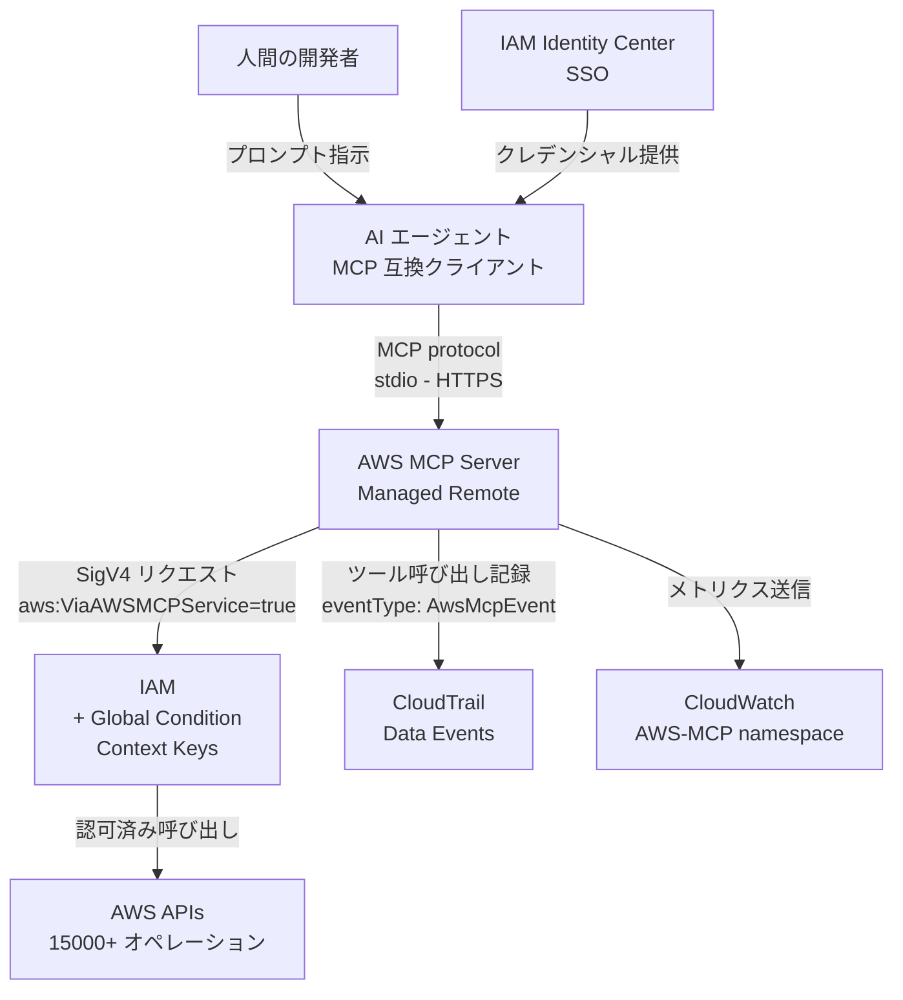
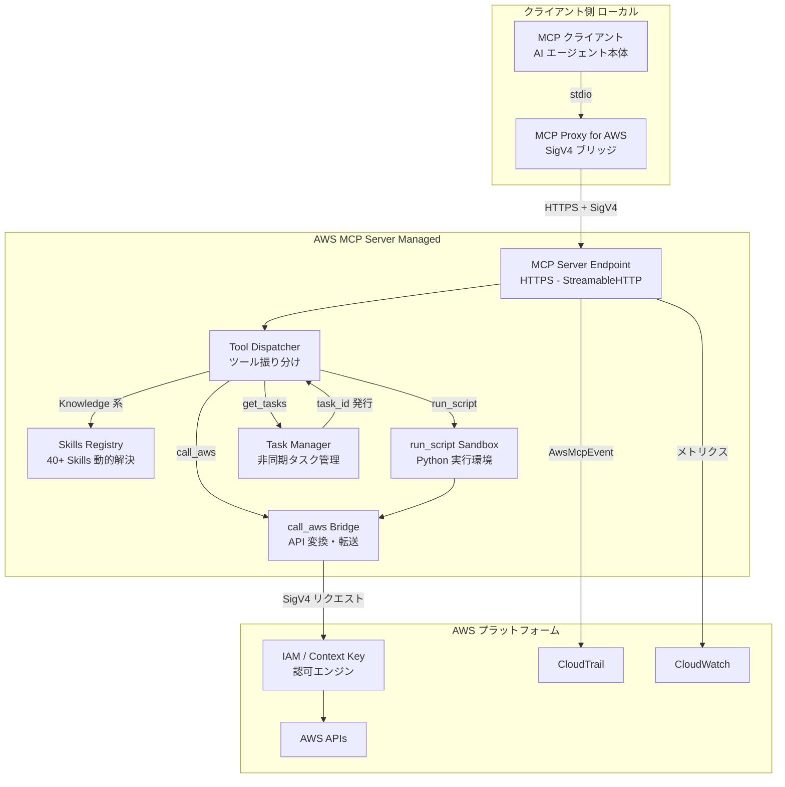
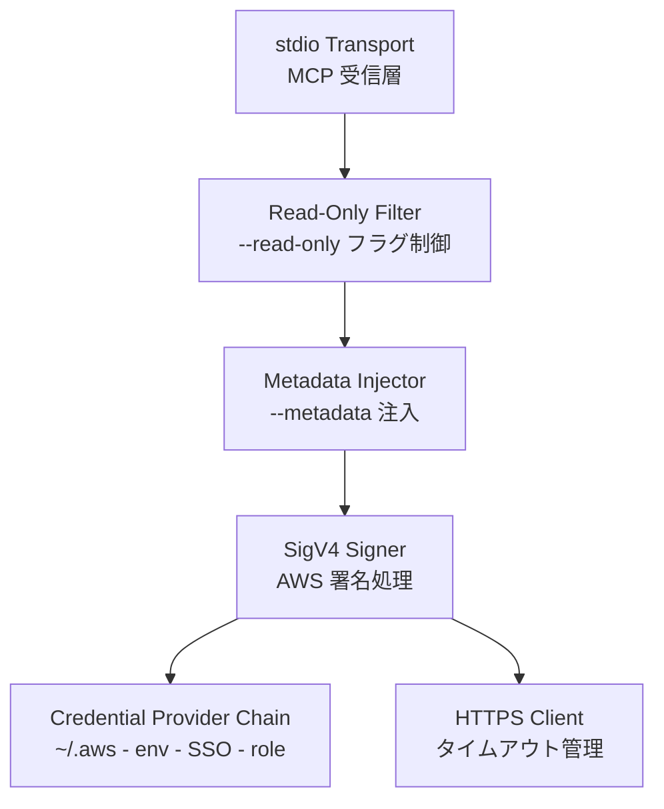
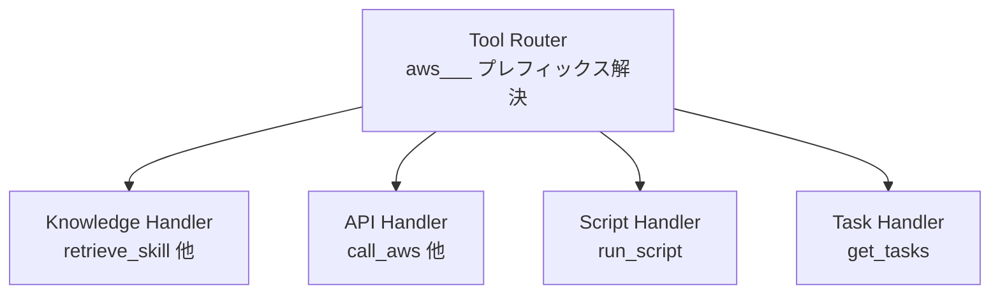
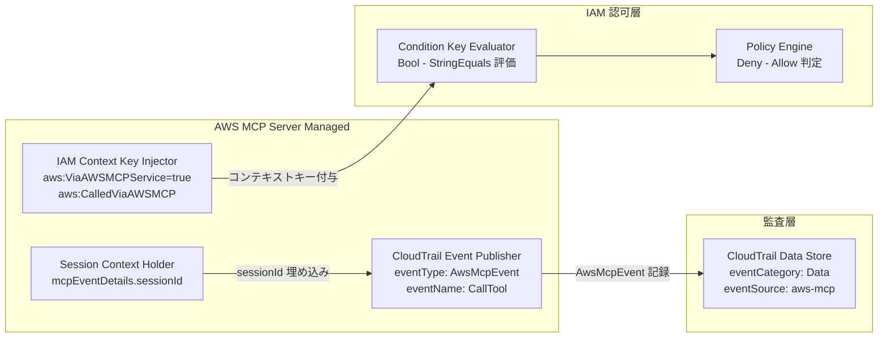
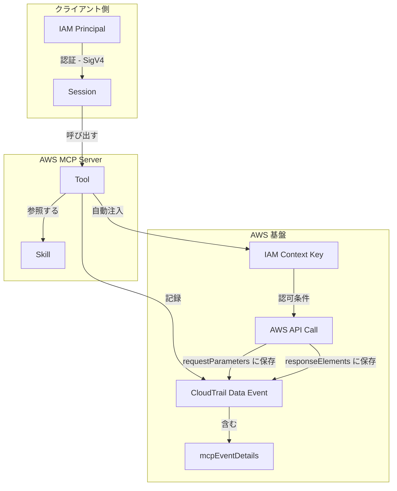
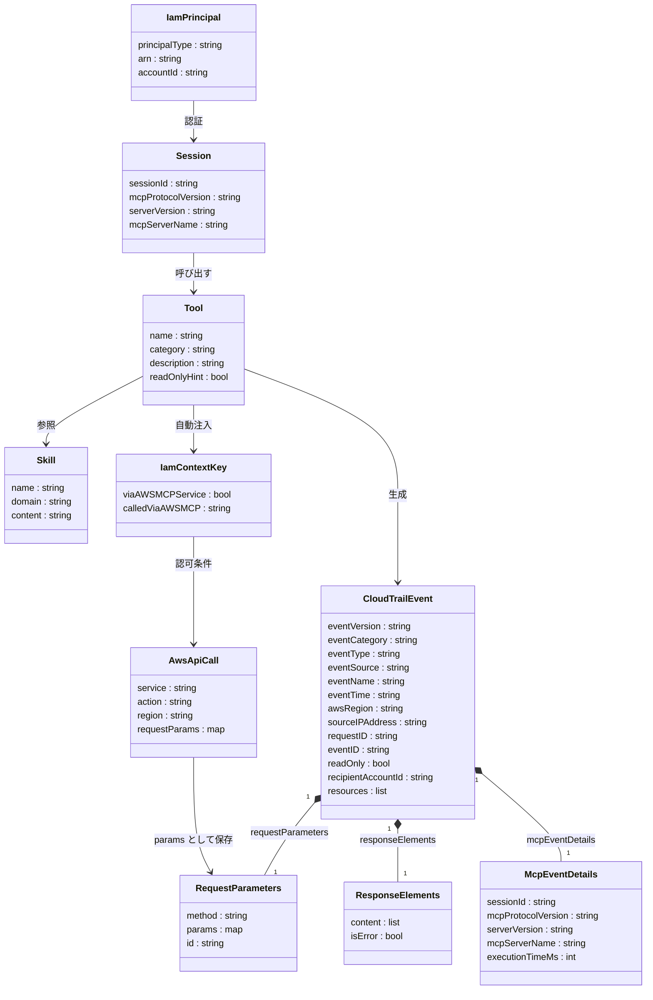

> 調査日: 2026-05-07 / 対象: マネージド版 AWS MCP Server (re:Invent 2025 発表 / 2026-05-06 GA) / 対象読者: クラウド / プラットフォーム / SRE / セキュリティ担当


## ■概要

AWS MCP Server は、AWS がフルマネージドで提供する**リモート MCP (Model Context Protocol) サーバー**です。Claude Code / Cursor / Kiro / Codex / Q Developer CLI などの MCP クライアントから、AWS の 15,000 以上の API を呼び出すための「公式の接続面」を提供します。2025 年 12 月（re:Invent）に preview として発表され、2026 年 5 月 6 日に GA となりました。

このサービスが意味するのは、**AI エージェントに AWS 操作を委譲する経路の標準化**です。これまで設計者ごとにバラバラだった統制点（クレデンシャル管理・AI 由来の識別・監査）を、1 本のマネージドゲートウェイに集約できます。

GA 同日に上位概念として **Agent Toolkit for AWS** が発表され、AWS MCP Server はその中核コンポーネントです。Agent Toolkit は「AWS MCP Server + Agent Skills (40+) + Agent Plugins (AWS Core / AWS Data Analytics / AWS Agents) + Rules files」の 4 つの主要要素で構成されます。

### 関連技術との関係

| 技術 | AWS MCP Server との関係 |
|---|---|
| MCP プロトコル | クライアント⇔サーバー間の通信規格。AWS MCP Server はこのプロトコルに準拠したリモートサーバーとして動作します |
| awslabs/mcp 自走 OSS 群 | AWS が公開する 60+ のオープンソース MCP サーバー群 (aws-api-mcp-server / ecs-mcp-server / eks-mcp-server 等)。クライアント PC や自前コンテナで実行します。マネージド版とは別物です |
| IAM + コンテキストキー | GA でグローバル条件コンテキストキー (`aws:ViaAWSMCPService` / `aws:CalledViaAWSMCP`) が追加されました。IAM ポリシーで「AI エージェント経由のリクエスト」を識別・制御できます |
| CloudTrail | MCP Server 経由の全 API 呼び出しを Data event として自動記録します。`eventType: AwsMcpEvent` で MCP 専用の識別が可能です |
| MCP Proxy for AWS | ローカルで起動する公式オープンソースプロキシ。クライアントの IAM 認証 (SigV4) を MCP プロトコルに橋渡しします |

### 代替アプローチとの比較

| アプローチ | クレデンシャル流路 | 認可境界 | 監査の粒度 | ベンダーロックインリスク |
|---|---|---|---|---|
| AWS MCP Server (マネージド) | クライアントが SigV4 署名。MCP サーバーは credentials を保持しない | IAM + コンテキストキー (`aws:ViaAWSMCPService` / `aws:CalledViaAWSMCP`) で AI 経由を識別可能 | CloudTrail Data event (`eventType: AwsMcpEvent`) + `mcpEventDetails`。ツール名・パラメータ・セッション ID が自動記録される | AWS マネージドのため MCP 仕様の breaking change への追従は AWS 任せ。SLA 未公開 |
| awslabs/mcp 自走 OSS | サーバープロセスが `~/.aws/credentials` を直接保持 | IAM のみ。AI 識別は session tag の自前付与が必要 | CloudTrail に通常 API として記録。MCP 経由の識別は弱い | Apache-2.0 OSS。脆弱性対応も自前 (CVE-2025-5277 の前例あり) |
| Bash + `aws` CLI 直叩き | シェルセッションの `~/.aws/credentials` | IAM のみ | CloudTrail のみ。プロンプトとの紐付けは外側で行う必要がある | ロックインなし。LLM が組み立てた任意文字列を shell が実行するリスクが最大 |
| Q Developer CLI | AWS Builder ID / IAM Identity Center | Q CLI 自身は MCP クライアント。ツール側の認可は別途 MCP / 内蔵ツールに依存 | CloudTrail + Q セッションログ | AWS サービスへの依存度が高い。stdio 中心でリモート MCP の活用パターンが限定的 |
| Lambda + Step Functions | Lambda 実行ロール (静的) | IAM ロール固定 + Step Functions 入力 JSON で粗く制限 | CloudTrail + Step Functions 実行履歴 (入出力含む) | AWS サービスへの強い依存。エージェント的な柔軟性は MCP 構成に劣る |

---

## ■特徴

### GA 時点の基本仕様

| 項目 | 内容 |
|---|---|
| エンドポイント | `https://aws-mcp.us-east-1.api.aws/mcp` / `https://aws-mcp.eu-central-1.api.aws/mcp` (2 リージョンのみ) |
| 認証 | SigV4 + MCP Proxy for AWS。IAM Identity Center (SSO) 推奨。Static IAM Key は非推奨 |
| 提供ツール数 | 11 個 (Knowledge 6 種 + API 5 種、後述) |
| Skills | 40+ が動的取得 (`retrieve_skill` で runtime 解決。固定セットではなく service team が更新) |
| 課金 | サーバー本体は無料。実行された AWS リソース + データ転送のみ |
| 対応クライアント | Claude Code / Claude Desktop / Cursor / Kiro / Kiro CLI / Codex / 任意の MCP 互換クライアント |

### IAM コンテキストキー (GA 最大の構造変化)

GA でグローバル条件コンテキストキーが正式に追加されました。

| キー | 値 | 用途 |
|---|---|---|
| `aws:ViaAWSMCPService` | `true` | AWS MCP Server 経由の全リクエストに自動付与 |
| `aws:CalledViaAWSMCP` | `aws-mcp.amazonaws.com` | 経由した MCP サーバーを識別 |

同一 IAM プリンシパルでも「MCP 経由では書き込み禁止、人間の Bash 経由は許可」のようなチャネル別最小権限が設計できます。Preview 期に存在した独自 permission (`aws-mcp:InvokeMcp` 等) は GA で無効化され、コンテキストキーへの移行が必須です。

### CloudTrail での監査

| フィールド | 値 |
|---|---|
| `eventSource` | `aws-mcp.us-east-1.api.aws` (または eu-central-1) |
| `eventName` | `CallTool` |
| `eventCategory` | `Data` (データイベントとして自動記録) |
| `eventType` | `AwsMcpEvent` (MCP 専用イベントタイプ) |
| `mcpEventDetails` | `sessionId` / `mcpProtocolVersion` / `serverVersion` / `mcpServerName` / `executionTimeMs` |

プロンプト本文 (ユーザー発話そのもの) は CloudTrail に残りません。一方、ツール呼び出しの引数 (`requestParameters.params`)・`run_script` で実行された Python コード・応答テキスト (`responseElements.content`) は CloudTrail に記録され得ます。発話レベルの監査が必要な場合は、MCP クライアント側のセッションログを別途保存します。

### Preview からの主な変化点

1. IAM コンテキストキーの正式化 — Preview 期は別ロール・別権限の組み立てが必要でしたが、コンテキストキーで同一プリンシパルから絞り込めるようになりました
2. ドキュメント取得の認証不要化 — `search_documentation` / `read_documentation` が匿名利用可能になりました
3. トークン消費の削減 — ツール定義・応答の slim 化により、1 回のインタラクションで消費するトークンが減りました
4. Agent SOP から Agent Skills へ移行 — Anthropic の Skills 形式でガイダンスを提供する方式に移行しました
5. `run_script` ツールの追加 — サーバー側 Python サンドボックスが GA で新規追加されました

---

## ■構造

### ●システムコンテキスト図



| 要素名 | 説明 |
|---|---|
| 人間の開発者 | AI エージェントへの自然言語指示と AWS 操作方針の意思決定を行うアクター |
| AI エージェント | MCP クライアントとして動作し、ツール呼び出しを生成・実行するアクター |
| AWS MCP Server (Managed Remote) | MCP プロトコルの受信・AWS API への変換・転送を行う本調査対象システム |
| IAM + Global Condition Context Keys | `aws:ViaAWSMCPService` / `aws:CalledViaAWSMCP` の評価による認可制御を行う外部システム |
| AWS APIs | EC2 / S3 / Lambda 等 15,000+ API エンドポイント群 |
| CloudTrail Data Events | MCP 経由の全ツール呼び出しを `AwsMcpEvent` として自動記録する外部システム |
| CloudWatch | スループット / エラー率 / レイテンシのメトリクス収集を行う外部システム |
| IAM Identity Center (SSO) | AI エージェントクライアントへ短命クレデンシャルを提供する推奨認証経路 |

### ●コンテナ図

AWS MCP Server をドリルダウンし、関連するローカルコンポーネントを含めた構成を示します。



| 要素名 | 説明 |
|---|---|
| MCP クライアント | AI エージェント本体。stdio で Proxy に接続する外部コンテナ |
| MCP Proxy for AWS | stdio と HTTPS+SigV4 の変換を行うローカルコンテナ |
| MCP Server Endpoint | HTTPS リクエスト受信と MCP プロトコル処理の入口を担うマネージドコンテナ |
| Tool Dispatcher | ツール名に応じて Knowledge / API / Sandbox / Task 各サブシステムへ振り分ける |
| Skills Registry | 40+ Skills を動的に保持・解決し、`retrieve_skill` などを処理する |
| call_aws Bridge | MCP ツール呼び出しを SigV4 署名付き AWS API リクエストに変換・転送する |
| run_script Sandbox | サーバー側 Python 実行環境。複数 API の横断処理や長時間実行を担当する |
| Task Manager | 長時間タスクの非同期管理。task_id 発行と `get_tasks` でのポーリング対応 |
| IAM / Context Key 認可エンジン | `aws:ViaAWSMCPService` 等を評価し最終的な認可判断を行う |
| AWS APIs | 実際の AWS サービスエンドポイント群 |
| CloudTrail | MCP イベントの永続記録を担う |
| CloudWatch | 運用メトリクスの収集・集計を担う |

### ●コンポーネント図

#### MCP Proxy for AWS の内部構成



| 要素名 | 説明 |
|---|---|
| stdio Transport | MCP クライアントからの JSON-RPC 受信層 |
| SigV4 Signer | リクエストへの AWS Signature Version 4 署名付与 |
| Credential Provider Chain | AWS SDK 標準の認証情報解決チェーン (環境変数 / `~/.aws/credentials` / SSO / assume-role など) を順に評価 |
| Read-Only Filter | `readOnlyHint=true` でないツールを無効化するガード (`--read-only` フラグ) |
| Metadata Injector | MCP リクエストに `--metadata AWS_REGION=<region>` 等のキーバリューを付加 |
| HTTPS Client | 上流への HTTPS 送信とタイムアウト制御 |

#### Tool Dispatcher の内部構成



| 要素名 | 説明 |
|---|---|
| Tool Router | `aws___` プレフィックスのツール名を受けて適切なハンドラへルーティングする |
| Knowledge Handler | Skills / ドキュメント / リージョン情報の検索・取得 (`retrieve_skill` / `search_documentation` / `read_documentation` / `recommend` / `list_regions` / `get_regional_availability`) |
| API Handler | `call_aws` から SigV4 Bridge への変換・転送、API 提案、プリサインド URL 生成 (`call_aws` / `suggest_aws_commands` / `get_presigned_url`) |
| Script Handler | Python コードをサーバー側サンドボックスで実行 (`run_script`) |
| Task Handler | 非同期タスクのステータスポーリング対応 (`get_tasks`) |

#### IAM Context Key 注入と CloudTrail 記録の構成



| 要素名 | 説明 |
|---|---|
| IAM Context Key Injector | MCP 経由の全リクエストに `aws:ViaAWSMCPService=true` / `aws:CalledViaAWSMCP=aws-mcp.amazonaws.com` を自動付与する |
| CloudTrail Event Publisher | ツール呼び出しを `eventType: AwsMcpEvent` / `eventName: CallTool` / `eventCategory: Data` で発行する |
| Session Context Holder | クライアントセッション ID を保持し監査レコードに埋め込む |
| Condition Key Evaluator | IAM ポリシーの Condition ブロックでコンテキストキーを評価する |
| Policy Engine | Deny / Allow の最終判定を行う。AWS MCP Server 自身への呼び出しには専用 IAM permission 不要 |
| CloudTrail Data Store | `eventSource: aws-mcp.<region>.api.aws` でフィルタ可能な永続ストア。プロンプト本文は含まない |

---

## ■データ

### ●概念モデル



| エンティティ | 説明 |
|---|---|
| IAM Principal | AWS MCP Server を呼び出すユーザーまたはロール。IAM Identity Center または静的 IAM キーで識別される |
| Session | MCP Proxy for AWS が確立するクライアント接続単位。sessionId によって識別される |
| Tool | AWS MCP Server が提供する機能単位 (11 個)。Knowledge Tools と API Tools の 2 カテゴリ |
| Skill | Tool から動的取得される手順・ベストプラクティスの知識単位 (40+)。`retrieve_skill` で実行時解決 |
| IAM Context Key | MCP 経由リクエストに自動付与されるグローバルコンテキストキー (`aws:ViaAWSMCPService` と `aws:CalledViaAWSMCP`) |
| AWS API Call | `call_aws` や `run_script` が実行する AWS サービス API 呼び出し (15,000+ API) |
| CloudTrail Data Event | MCP の全ツール呼び出しを記録するイベント (`eventType: AwsMcpEvent` / `eventCategory: Data`) |
| mcpEventDetails | CloudTrail Data Event に埋め込まれる MCP 固有の詳細フィールド群 |

### ●情報モデル



| エンティティ | 説明 |
|---|---|
| Session | MCP クライアントとサーバー間のセッション。sessionId が CloudTrail と MCP クライアントログの突合キーになる |
| Tool | AWS MCP Server が公開するツール単位。Knowledge (6 個) と API (5 個) の計 11 個。readOnlyHint フラグでプロキシの `--read-only` モードと連動 |
| Skill | `retrieve_skill` で動的取得される手順書。40+ が随時サービスチームから更新される |
| IamPrincipal | 呼び出し元の IAM 識別子。CloudTrail の `userIdentity` ブロックに対応 |
| IamContextKey | 全 MCP リクエストに自動付与されるコンテキストキー (`aws:ViaAWSMCPService` (bool) と `aws:CalledViaAWSMCP` (string)) |
| AwsApiCall | `call_aws` / `run_script` が実行する下流 AWS API。requestParameters.params に呼び出し内容がそのまま保存される |
| CloudTrailEvent | `eventType: AwsMcpEvent` / `eventCategory: Data` で識別される MCP 専用イベント。`eventName` は常に `CallTool` |
| RequestParameters | MCP リクエストの複製。`method` (ツール名 — namespace prefix `aws___` は除去)、`params`、`id` を保持 |
| ResponseElements | ツール応答。`content` リストと `isError` フラグを保持。プロンプト本文は含まれない |
| McpEventDetails | CloudTrail イベントに埋め込まれる MCP 固有サブオブジェクト。sessionId で MCP クライアントログとの突合が可能 |

### Tool カタログ

#### Knowledge Tools (6 個)

| ツール名 (MCP クライアント表記) | CloudTrail requestParameters.method | 説明 | readOnlyHint |
|---|---|---|---|
| `aws___retrieve_skill` | `retrieve_skill` | 指定ドメインの Skill (ワークフロー・ベストプラクティス) を取得 | true |
| `aws___search_documentation` | `search_documentation` | AWS ドキュメント全体を横断検索 (GA から認証不要) | true |
| `aws___read_documentation` | `read_documentation` | AWS ドキュメントページを Markdown 形式で取得 | true |
| `aws___recommend` | `recommend` | 関連トピックや閲覧傾向に基づき AWS ドキュメントの推薦コンテンツを取得 | true |
| `aws___list_regions` | `list_regions` | 全 AWS リージョンの識別子と名前を取得 | true |
| `aws___get_regional_availability` | `get_regional_availability` | サービス・機能・SDK API・CloudFormation リソースのリージョン可用性を確認 | true |

#### API Tools (5 個)

| ツール名 (MCP クライアント表記) | CloudTrail requestParameters.method | 説明 | readOnlyHint |
|---|---|---|---|
| `aws___call_aws` | `call_aws` | 15,000+ AWS API を認証付きで実行。長時間処理は task ID を返す | false |
| `aws___suggest_aws_commands` | `suggest_aws_commands` | AWS API の説明・構文ヘルプ。新 API も対応 | true |
| `aws___run_script` | `run_script` | Python コードをサンドボックス環境で実行 | false |
| `aws___get_presigned_url` | `get_presigned_url` | S3 の事前署名 URL を生成 | false |
| `aws___get_tasks` | `get_tasks` | `call_aws` / `run_script` の task ID をポーリング | true |

### IAM Context Key 一覧

| キー名 | 型 | 値の例 | 用途 |
|---|---|---|---|
| `aws:ViaAWSMCPService` | bool | `true` | AWS managed MCP server 経由の全リクエストで自動的に true |
| `aws:CalledViaAWSMCP` | string | `aws-mcp.amazonaws.com` | 特定の managed MCP server を識別 |

---

## ■構築方法

### 前提条件

| 項目 | 要件 |
|---|---|
| AWS CLI | 2.32.0 以上 (`aws login` コマンドを使う場合) |
| uv / uvx | Python パッケージランナー (`uvx` で mcp-proxy-for-aws を起動する場合) |
| AWS アカウント | IAM Identity Center を有効化済み (推奨) |
| ネットワーク | `https://aws-mcp.us-east-1.api.aws` または `https://aws-mcp.eu-central-1.api.aws` への HTTPS アウトバウンド |
| 対応 OS | macOS / Linux / Windows |

### mcp-proxy-for-aws のインストール (3 系統)

#### uvx (推奨)

```bash
# uv のインストール (macOS / Linux)
curl -LsSf https://astral.sh/uv/install.sh | sh

# 起動確認
uvx mcp-proxy-for-aws@latest --help
```

MCP クライアントの設定に `uvx mcp-proxy-for-aws@latest` を記載しておけば、クライアント起動時に自動で最新版がダウンロード・実行されます。別途インストール作業は不要です。

#### ローカル clone (バージョン固定)

```bash
git clone https://github.com/aws/mcp-proxy-for-aws.git
cd mcp-proxy-for-aws
uv run mcp_proxy_for_aws/server.py https://aws-mcp.us-east-1.api.aws/mcp
```

#### Docker (公式 ECR イメージ)

```bash
docker pull public.ecr.aws/mcp-proxy-for-aws/mcp-proxy-for-aws:latest
```

### 主要 CLI フラグ

| フラグ | 説明 | デフォルト | 必須 |
|---|---|---|---|
| `endpoint` (位置引数) | `https://aws-mcp.us-east-1.api.aws/mcp` 等 | — | Yes |
| `--region` | SigV4 署名に使う AWS リージョン | `AWS_REGION` 環境変数 | No |
| `--profile` | 使用する AWS 認証プロファイル | `AWS_PROFILE` 環境変数 | No |
| `--metadata` | MCP リクエストに注入する key=value (例: `AWS_REGION=us-west-2`) | `--region` から自動注入 | No |
| `--read-only` | `readOnlyHint=true` のないツールを無効化 | False | No |
| `--retries` | 上流へのリトライ回数 | 0 | No |
| `--tool-timeout` | ツール呼び出し 1 回の最大秒数 | 300 | No |
| `--timeout` | 全操作のタイムアウト秒数 | 180 | No |
| `--log-level` | ログレベル | INFO | No |

### 認証

#### 推奨: `aws login`

```bash
# AWS CLI 2.32.0 以上が必須
aws login
# ブラウザが開き、マネジメントコンソールと同じ認証情報でサインインする
# セッションは最大 12 時間有効
```

#### 推奨: `aws configure sso`

```bash
aws configure sso
aws sso login --profile my-sso-profile
aws sts get-caller-identity --profile my-sso-profile
```

#### 非推奨: Static IAM Access Key

```bash
aws configure
# 90 日ごとのローテーションが必要。自動更新なし → 非推奨
```

### 各 MCP クライアントへの接続設定

#### Claude Desktop

`~/Library/Application Support/Claude/claude_desktop_config.json`:

```json
{
  "mcpServers": {
    "aws-mcp": {
      "command": "uvx",
      "args": [
        "mcp-proxy-for-aws@latest",
        "https://aws-mcp.us-east-1.api.aws/mcp",
        "--metadata", "AWS_REGION=ap-northeast-1"
      ]
    }
  }
}
```

#### Claude Code

```bash
claude mcp add-json aws-mcp --scope user \
  '{"command":"uvx","args":["mcp-proxy-for-aws@latest","https://aws-mcp.us-east-1.api.aws/mcp","--metadata","AWS_REGION=ap-northeast-1"]}'
```

#### Cursor IDE

`.cursor/mcp.json`:

```json
{
  "mcpServers": {
    "aws-mcp": {
      "command": "uvx",
      "args": [
        "mcp-proxy-for-aws@latest",
        "https://aws-mcp.us-east-1.api.aws/mcp",
        "--metadata", "AWS_REGION=ap-northeast-1"
      ]
    }
  }
}
```

#### Kiro CLI

`.kiro/settings/mcp.json`:

```json
{
  "mcpServers": {
    "aws-mcp": {
      "command": "uvx",
      "timeout": 100000,
      "transport": "stdio",
      "args": [
        "mcp-proxy-for-aws@latest",
        "https://aws-mcp.us-east-1.api.aws/mcp",
        "--metadata", "AWS_REGION=ap-northeast-1"
      ]
    }
  }
}
```

#### Codex

`~/.codex/config.toml`:

```toml
[mcp_servers.aws_mcp]
command = "uvx"
args = [
  "mcp-proxy-for-aws@latest",
  "https://aws-mcp.us-east-1.api.aws/mcp",
  "--metadata", "AWS_REGION=ap-northeast-1"
]
startup_timeout_sec = 60
```

### 接続テスト

```
利用可能な AWS リージョンを一覧してください
```

`aws___list_regions` が自動的に呼び出され、リージョン一覧が返れば接続成功です。

---

## ■利用方法

### 必須パラメータ

| パラメータ | 値・説明 | 必須 |
|---|---|---|
| `transport` | `stdio` (プロキシ経由) | Yes |
| `endpoint` (位置引数) | `https://aws-mcp.<region>.api.aws/mcp` | Yes |
| `--metadata AWS_REGION=<region>` | AWS API 操作のデフォルトリージョン (未指定時は `us-east-1`) | 推奨 |
| `--profile <profile>` | 使用する AWS プロファイル名 | No |
| `--region <region>` | SigV4 署名に使うリージョン | No |
| `--read-only` | write 系ツールをプロキシ層で無効化 | No |
| `--retries <n>` | 上流サービスへのリトライ回数 | No |
| `--tool-timeout <sec>` | ツール呼び出しの最大秒数 | No |

### エンドポイント選択 (--region との関係)

| 項目 | 説明 |
|---|---|
| MCP サーバーエンドポイント | `aws-mcp.us-east-1.api.aws/mcp` または `aws-mcp.eu-central-1.api.aws/mcp` |
| `--metadata AWS_REGION=<region>` | エージェントが AWS 操作を実行するデフォルトリージョン |
| 両者の関係 | エンドポイントリージョンと操作リージョンは別々に設定可能 (例: us-east-1 に接続しながら ap-northeast-1 のリソースを操作) |
| デフォルト動作 | `--metadata` 未指定時は操作リージョンが `us-east-1` にフォールバック |
| クエリ内での上書き | プロンプト中で個別の操作リージョンを指定するとその操作のみ上書きされる |

### 基本的な Tool 呼び出し例

#### call_aws — S3 バケット一覧

エージェントへのプロンプト:

```
ap-northeast-1 の S3 バケット一覧を取得してください
```

エージェントが内部で実行する相当のコール:

```json
{
  "tool": "aws___call_aws",
  "arguments": {
    "service": "s3",
    "operation": "list_buckets",
    "region": "ap-northeast-1"
  }
}
```

#### search_documentation — ドキュメント検索

```json
{
  "tool": "aws___search_documentation",
  "arguments": {
    "query": "S3 bucket policy configuration",
    "topic": "s3"
  }
}
```

#### run_script — Python サンドボックスで複数 API を横断集計

```json
{
  "tool": "aws___run_script",
  "arguments": {
    "code": "import boto3\nfor region in ['ap-northeast-1', 'us-east-1']:\n    client = boto3.client('lambda', region_name=region)\n    resp = client.list_functions()\n    print(f'{region}: {len(resp[\"Functions\"])} functions')"
  }
}
```

#### get_tasks — long-running task のポーリング

```json
{
  "tool": "aws___get_tasks",
  "arguments": {
    "task_id": "<前の呼び出しで返された task_id>"
  }
}
```

### IAM ポリシー設定例

#### 全 AWS managed MCP server 経由の操作を一律拒否

```json
{
  "Effect": "Deny",
  "Action": "*",
  "Resource": "*",
  "Condition": {
    "Bool": {
      "aws:ViaAWSMCPService": "true"
    }
  }
}
```

#### 特定の managed MCP server 経由の破壊的操作を拒否

```json
{
  "Effect": "Deny",
  "Action": ["s3:DeleteBucket", "s3:DeleteObject"],
  "Resource": "*",
  "Condition": {
    "StringEquals": {
      "aws:CalledViaAWSMCP": "aws-mcp.amazonaws.com"
    }
  }
}
```

設計のポイント:

- `aws:ViaAWSMCPService` は将来追加される managed MCP server にも横断的に効きます
- `aws:CalledViaAWSMCP` は特定の managed MCP server のみを対象にできます
- 同一 IAM プリンシパルで「人間の直接操作は許可、MCP 経由は read-only」を実現できます

### read-only モードの実現 (3 パターン)

#### パターン A: MCP 経由の破壊的操作をすべて拒否

```json
{
  "Effect": "Deny",
  "Action": [
    "s3:DeleteBucket",
    "s3:DeleteObject",
    "ec2:TerminateInstances",
    "rds:DeleteDBInstance"
  ],
  "Resource": "*",
  "Condition": {
    "Bool": {"aws:ViaAWSMCPService": "true"}
  }
}
```

#### パターン B: 特定 MCP サーバー経由のみ拒否

```json
{
  "Effect": "Deny",
  "Action": ["s3:DeleteBucket", "s3:DeleteObject"],
  "Resource": "*",
  "Condition": {
    "StringEquals": {"aws:CalledViaAWSMCP": "aws-mcp.amazonaws.com"}
  }
}
```

#### パターン C: mcp-proxy-for-aws の `--read-only` フラグ

```bash
uvx mcp-proxy-for-aws@latest \
  https://aws-mcp.us-east-1.api.aws/mcp \
  --read-only \
  --metadata AWS_REGION=ap-northeast-1
```

IAM 側のガードと併用することを推奨します。

---

## ■運用

### CloudTrail Data Events の有効化

AWS MCP Server のツール呼び出しは Data Event として分類されます。Trail / Event Data Store 側で Data event の取得を有効にする必要があります (selector の resource type は GA 直後で公式表記が変動する可能性があるため、最新の [CloudTrail Integration Doc](https://docs.aws.amazon.com/aws-mcp/latest/userguide/logging-using-cloudtrail.html) を参照してください)。

CloudTrail Lake で Event Data Store を作る場合の例:

```bash
aws cloudtrail create-event-data-store \
  --name aws-mcp-audit \
  --advanced-event-selectors '[
    {
      "Name": "Capture AWS MCP Server data events",
      "FieldSelectors": [
        {"Field": "eventCategory", "Equals": ["Data"]},
        {"Field": "eventSource", "Equals": ["aws-mcp.us-east-1.api.aws"]}
      ]
    }
  ]'
```

### CloudTrail ログの構造

```json
{
  "eventVersion": "1.08",
  "eventCategory": "Data",
  "eventType": "AwsMcpEvent",
  "eventSource": "aws-mcp.us-east-1.api.aws",
  "eventName": "CallTool",
  "awsRegion": "us-east-1",
  "requestParameters": {
    "method": "call_aws",
    "params": { /* MCP リクエストパラメータ全コピー */ },
    "id": "request-id"
  },
  "responseElements": {
    "content": [{ "type": "text", "text": "..." }],
    "isError": false
  },
  "readOnly": true,
  "mcpEventDetails": {
    "sessionId": "sess_xyz789_YXJuOmF3czppYW06...",
    "mcpProtocolVersion": "2024-11-05",
    "serverVersion": "1.0.0",
    "mcpServerName": "aws-mcp.us-east-1.api.aws",
    "executionTimeMs": 250
  }
}
```

ツール名の表記ゆれに注意します。

| MCP クライアント側 | CloudTrail での記録 |
|---|---|
| `aws___call_aws` | `eventName=CallTool`, `requestParameters.method=call_aws` |
| `aws___retrieve_skill` | `eventName=CallTool`, `requestParameters.method=retrieve_skill` |
| `aws___run_script` | `eventName=CallTool`, `requestParameters.method=run_script` |

### CloudTrail からのフィルタリング

`aws cloudtrail lookup-events` は Data event には使えないため、CloudTrail Lake (`start-query`) または Athena/CloudWatch Logs Insights を使います。

CloudTrail Lake のクエリ例:

```sql
SELECT eventTime, eventName, eventSource, requestParameters, mcpEventDetails
FROM <event-data-store-id>
WHERE eventSource = 'aws-mcp.us-east-1.api.aws'
  AND eventTime > '2026-05-07T00:00:00Z'
ORDER BY eventTime DESC;
```

特定 sessionId で Athena から抽出:

```sql
SELECT *
FROM cloudtrail_logs
WHERE eventsource = 'aws-mcp.us-east-1.api.aws'
  AND json_extract_scalar(mceventdetails, '$.sessionId') = 'sess_xyz789_...'
ORDER BY eventtime DESC;
```

書き込み操作のみ:

```sql
SELECT eventtime, eventname,
       json_extract_scalar(requestparameters, '$.method') AS tool_name,
       useridentity
FROM cloudtrail_logs
WHERE eventsource = 'aws-mcp.us-east-1.api.aws'
  AND readonly = false
ORDER BY eventtime DESC;
```

### CloudWatch メトリクスとアラーム

AWS MCP Server は `AWS-MCP` namespace で標準メトリクス (invocation count / success rate / client errors / server errors / throttling) を提供します ([Preview Enhanced Monitoring 発表](https://aws.amazon.com/about-aws/whats-new/2026/03/aws-mcp-server-preview-enhanced-monitoring/) 経由で確認、最新仕様は GA Blog / 公式 docs を参照)。

公式メトリクスでの監視に加えて、CloudTrail → CloudWatch Logs → Metric Filter による独自メトリクスも併用できます。

```bash
# Invocation Count メトリクス
aws logs put-metric-filter \
  --log-group-name aws-mcp-cloudtrail \
  --filter-name MCP-InvocationCount \
  --filter-pattern '{ $.eventsource = "aws-mcp.us-east-1.api.aws" }' \
  --metric-transformations \
    metricName=MCPInvocationCount,metricNamespace=AWS-MCP,metricValue=1

# Write Operation Count メトリクス
aws logs put-metric-filter \
  --log-group-name aws-mcp-cloudtrail \
  --filter-name MCP-WriteOpCount \
  --filter-pattern '{ $.eventsource = "aws-mcp.us-east-1.api.aws" && $.readOnly = false }' \
  --metric-transformations \
    metricName=MCPWriteOpCount,metricNamespace=AWS-MCP,metricValue=1
```

書き込み操作急増アラーム:

```bash
aws cloudwatch put-metric-alarm \
  --alarm-name MCP-WriteOpSpike \
  --metric-name MCPWriteOpCount \
  --namespace AWS-MCP \
  --period 300 \
  --evaluation-periods 1 \
  --threshold 10 \
  --comparison-operator GreaterThanThreshold \
  --alarm-actions arn:aws:sns:us-east-1:123456789012:SecurityAlert
```

### sessionId と MCP クライアントログの突合

`mcpEventDetails.sessionId` はセッション開始から終了まで一貫した値が付与されます。Claude Code 側ではデバッグログで sessionId を確認できます。

突合手順:

1. Claude Code のデバッグログから対象操作の `sessionId` を取得
2. CloudTrail の Athena クエリで同 sessionId を条件に `requestParameters.method` を抽出
3. 転送先サービスの CloudTrail (S3, EC2 等) と `requestID` で突合
4. `readOnly=false` のイベントを優先してレビュー

### Credential 期限切れ対応

| 認証方式 | 自動更新 | セッション期限 | 推奨度 |
|---|---|---|---|
| `aws login` | 15 分ごとに自動ローテーション | 最大 12 時間 | 最推奨 |
| `aws configure sso` | refresh token で自動更新 | デフォルト 1 時間 (最大 12 時間に延長可) | 推奨 |
| Cross-account AssumeRole | SDK が自動更新 | ベースプロファイルに依存 | 状況次第 |
| Static Access Key | 自動更新なし | 無期限 (90 日ローテーション推奨) | 非推奨 |

リカバリー手順:

```bash
# 1. 現在のクレデンシャル状態確認
aws sts get-caller-identity

# 2a. aws login 方式の場合
aws login

# 2b. SSO 方式の場合
aws sso login --profile YOUR_SSO_PROFILE

# 3. mcp-proxy-for-aws の再起動
# Claude Code のセッションを再起動するか、MCP サーバーを再接続
```

---

## ■ベストプラクティス

### SCP / Permission Boundary で `aws:ViaAWSMCPService` を強制

bash や直接 boto3 経由のアクセスと、MCP 経由アクセスを IAM レベルで区別し、破壊的操作を MCP 経路でも制御します。

重要な制約: `aws:ViaAWSMCPService=true` は MCP Server を経由したリクエストにのみ付与されます。エージェントが bash ツールや汎用コード実行ツールで `aws` CLI / boto3 を直接呼び出した場合、このキーはセットされません。bash 経由を遮断する唯一の手段は「エージェントから bash/shell ツール自体を除去する」または Permission Boundary でベースポリシーを絞ることです。

```json
{
  "Version": "2012-10-17",
  "Statement": [
    {
      "Sid": "DenyDestructiveViaMCP",
      "Effect": "Deny",
      "Action": [
        "s3:DeleteBucket",
        "s3:DeleteObject",
        "ec2:TerminateInstances",
        "rds:DeleteDBInstance",
        "dynamodb:DeleteTable"
      ],
      "Resource": "*",
      "Condition": {
        "Bool": {"aws:ViaAWSMCPService": "true"}
      }
    }
  ]
}
```

### エージェント用 IAM Role 設計 (PoLP / read-mostly + 限定 write)

設計原則:

1. エージェント専用ロールを人間用ロールと完全分離する
2. デフォルトは read-only。write が必要な場合は操作種別ごとに個別付与する
3. Permission Boundary を必ずアタッチし、ロール単体ポリシーより更に絞る

ロール設計マトリクス:

| エージェントタイプ | ベースポリシー | Permission Boundary | 追加 Deny |
|---|---|---|---|
| 調査・探索専用 | ReadOnlyAccess | ReadOnlyAccess | `aws:ViaAWSMCPService` 時の Delete 全拒否 |
| インフラ変更あり | ReadOnlyAccess + 対象サービス限定 Write | 対象サービス + 操作種別 | Delete/Terminate を一律拒否 |
| CI/CD エージェント | デプロイ対象リソースのみ | デプロイ対象 + Region 限定 | 本番 account の操作を拒否 |

### マルチアカウント (Org SCP) 設計

```
Organization Root
├── SCP: エージェントロールの命名規則強制 (tag: Usage=Agent 必須)
├── OU: Sandbox
│   └── SCP: MCP 経由を含む全アクション許可 (学習用)
├── OU: Staging
│   └── SCP: Delete/Terminate を MCP 経由でも Deny
└── OU: Production
    ├── SCP: Delete/Terminate/ModifyDBInstance を全面 Deny
    └── Permission Boundary: read-mostly + 承認済み Write のみ
```

### 段階導入パターン

```
フェーズ 1: Sandbox (1-2 週間)
  - --read-only モード + ReadOnlyAccess ポリシー
  - CloudTrail Data Events 全記録
  - 書き込みは完全禁止
  - 目的: ツール呼び出しパターンと必要権限の把握

フェーズ 2: Staging (2-4 週間)
  - 必要な Write 権限を最小スコープで付与
  - Permission Boundary で Delete/Terminate を封鎖
  - CloudWatch アラームで異常検知
  - 目的: 実運用シナリオの検証

フェーズ 3: Production (限定スコープ)
  - Sandbox/Staging で確認済みの権限セットのみ
  - SCP で Org レベルのガードレール適用
  - インシデント対応 Runbook を整備
```

フェーズ移行チェック:

```bash
aws iam simulate-principal-policy \
  --policy-source-arn arn:aws:iam::123456789012:role/AgentMCPRole \
  --action-names "s3:DeleteObject" "ec2:TerminateInstances" \
  --resource-arns "*" \
  --condition-entries '{"ConditionKeyName":"aws:ViaAWSMCPService","ConditionType":"Bool","ConditionValues":["true"]}'
```

### awslabs/mcp 自走 OSS との併用パターン

| シナリオ | AWS MCP Server (マネージド) | awslabs/mcp (自走) | 根拠 |
|---|---|---|---|
| 汎用 AWS 操作 | 推奨 | 補完 | 15,000+ API 対応 + CloudTrail 自動統合 |
| 特定サービス深掘り (EKS, ECS) | 補完 | 推奨 (eks-mcp-server 等) | サービス専用ツールの方が機能豊富 |
| コンプライアンス要件 (SOC2/PCI) | 推奨 | 要カスタム実装 | CloudTrail 自動統合で監査証跡が標準化 |
| データソブリンティ要件 | 制約あり (us-east-1/eu-central-1 のみ) | 推奨 | 自走なら任意リージョンで稼働可能 |
| Well-Architected 評価 | 補完 | 推奨 | 特化型ツール群が整備済み |

ハイブリッド構成例:

```json
{
  "mcpServers": {
    "aws-mcp": {
      "command": "uvx",
      "args": [
        "mcp-proxy-for-aws@latest",
        "https://aws-mcp.us-east-1.api.aws/mcp",
        "--metadata", "AWS_REGION=ap-northeast-1",
        "--read-only"
      ]
    },
    "aws-iac": {
      "command": "uvx",
      "args": ["awslabs.aws-iac-mcp-server@latest"],
      "env": {
        "AWS_PROFILE": "agent-dev-role",
        "AWS_REGION": "ap-northeast-1"
      }
    }
  }
}
```

### 反証と運用上の注意

- `aws:ViaAWSMCPService` は MCP 経由のみ true。bash/shell 直叩きには付かない。SCP / Permission Boundary との併用が必須
- MCP プロトコル仕様自体の脆弱性監査 (Snyk, Unit42, OWASP MCP Top 10) は継続中。プロンプトインジェクション・ツールポイズニング・コマンドインジェクションを「MCP 経由なら防げる」と思い込まない
- リージョンが 2 拠点のみ・SLA 未公開。データレジデンシーや法定可用性の要件がある業種では検証環境からの段階導入を推奨
- MCP 仕様の breaking change (2025-06-18 改訂で JSON-RPC batching 削除) に AWS 側がどう追従するかは未確定
- プロンプト本文の監査は CloudTrail だけでは閉じない。発話レベル監査が必要なら、MCP クライアント側のセッションログ吸い上げパイプラインを別途整備する

---

## ■トラブルシューティング

### 症状・原因・対処 一覧

| 症状 | 原因 | 対処 |
|---|---|---|
| `ExpiredTokenException: Your AWS session token has expired.` | 一時クレデンシャルの期限切れ。SSO のデフォルトは 1 時間 | `aws sso login` または `aws login` で再認証。SSO セッションを最大 12 時間に延長 |
| `UnrecognizedClientException` | クレデンシャルが無効 (失効・削除・別パーティション・不正形式) | `aws sts get-caller-identity` でクレデンシャルの有効性確認。プロファイル名が正しいか確認 |
| `InvalidSignatureException` | SigV4 署名不一致 (別リージョン向けスコープ、クロック歪み、リクエスト改ざん) | `--region` フラグを明示。ローカル時刻と NTP を確認。proxy が body を変更していないか確認 |
| `No AWS credentials found.` | クレデンシャルプロバイダーチェーンで認証情報が見つからない | `aws configure list` で設定確認。`AWS_PROFILE` 環境変数確認。`~/.aws/credentials` の存在確認 |
| `aws:ViaAWSMCPService` で Deny したが、bash 経由の操作は通ってしまう | コンテキストキーは MCP Server 経由のみ付与される | エージェントから bash ツールを除去する。または Permission Boundary でベースポリシーを絞る |
| `call_aws` が特定 API で失敗する | API が GA 対応前・リージョン未対応・パラメータ形式が最新 SDK と異なる | `aws___suggest_aws_commands` で正しい API 構文を確認。`run_script` で boto3 を直接使用する代替策を検討 |
| us-east-1/eu-central-1 以外のエンドポイントに接続できない | GA 対応リージョンは us-east-1 と eu-central-1 のみ | エンドポイントを変更。操作対象リージョンは `--metadata AWS_REGION=ap-northeast-1` で別指定可能 |
| Throttling / 5xx エラー | 呼び出し先 AWS サービスの API クォータ超過、または MCP Server 自体の負荷 | `--retries` フラグを増やす。指数バックオフで再試行。Service Quotas でクォータ引き上げを申請 |
| ツール名が `aws___call_aws` と `call_aws` で混在 | MCP クライアントは `aws___` prefix を付ける。CloudTrail ログは prefix なし | MCP クライアント設定では `aws___` 表記、Athena クエリでは `requestParameters.method` = `call_aws` で検索 |
| `--read-only` モードで使えるツールが激減 | `readOnlyHint=true` でないツールをすべて無効化するため | `--read-only` は使わず、IAM の Permission Boundary + Deny ポリシーで書き込みを制御する |
| `aws___get_tasks` で task が見つからない | task ID を保持していない、またはタスクが期限切れ | 前の `call_aws` / `run_script` 応答から task ID を取得し直す |
| `run_script` が sandbox でライブラリ不足エラー | sandbox の利用可能 Python ライブラリが限定 (公式リスト未公開) | 標準 boto3 / botocore に依存するコードに書き直す |

### ログ調査フロー

```
1. エラーメッセージ確認
   └── CloudTrail の responseElements.isError = true のイベントを検索

2. sessionId で操作を追跡
   └── mcpEventDetails.sessionId で当該セッションの全イベントを抽出

3. 転送先サービスの CloudTrail を突合
   └── requestID で各サービス (S3, EC2 等) の CloudTrail ログと名寄せ

4. IAM 権限シミュレーション
   aws iam simulate-principal-policy ...

5. CloudTrail の eventSource 確認
   └── aws-mcp.us-east-1.api.aws であれば MCP 経由確定
```

---

## ■まとめ

AWS MCP Server の GA は、AI エージェントに AWS 操作を委譲する経路を「公式マネージドゲートウェイ + IAM コンテキストキー + CloudTrail Data event」に標準化する転換点です。一方で `aws:ViaAWSMCPService` は MCP 経由のみ true となる片側性、リージョン 2 拠点・SLA 未公開・プロンプト本文監査の欠落などの実務的な制約があるため、SCP/Permission Boundary との併用と段階導入を前提に採用範囲を見極めるのが現実的です。

この記事が少しでも参考になった、あるいは改善点などがあれば、ぜひリアクションやコメント、SNSでのシェアをいただけると励みになります！

## ■参考リンク

### 公式ドキュメント (一次)

- [AWS MCP Server is now generally available (GA Blog, 2026-05-06)](https://aws.amazon.com/blogs/aws/the-aws-mcp-server-is-now-generally-available/)
- [Setting up the AWS MCP Server (Getting Started Guide)](https://docs.aws.amazon.com/aws-mcp/latest/userguide/getting-started-aws-mcp-server.html)
- [Understanding the MCP Server tools](https://docs.aws.amazon.com/aws-mcp/latest/userguide/understanding-mcp-server-tools.html)
- [Logging AWS MCP Server API calls using AWS CloudTrail](https://docs.aws.amazon.com/aws-mcp/latest/userguide/logging-using-cloudtrail.html)
- [IAM Service Authorization Reference (aws-mcp-server)](https://docs.aws.amazon.com/service-authorization/latest/reference/list_awsmcpserver.html)
- [IAM global condition context keys](https://docs.aws.amazon.com/IAM/latest/UserGuide/reference_policies_condition-keys.html)
- [Secure AI Agent Access Patterns Using MCP (AWS Security Blog)](https://aws.amazon.com/blogs/security/secure-ai-agent-access-patterns-to-aws-resources-using-model-context-protocol/)
- [AWS MCP Server Preview Enhanced Monitoring (2026-03)](https://aws.amazon.com/about-aws/whats-new/2026/03/aws-mcp-server-preview-enhanced-monitoring/)

### プロキシ・関連ツール

- [aws/mcp-proxy-for-aws (GitHub)](https://github.com/aws/mcp-proxy-for-aws)
- [ECR Public Gallery: mcp-proxy-for-aws](https://gallery.ecr.aws/mcp-proxy-for-aws/mcp-proxy-for-aws)
- [awslabs/mcp (OSS リポジトリ)](https://github.com/awslabs/mcp)
- [awslabs/mcp サイト](https://awslabs.github.io/mcp/)

### AWS ガイダンス

- [AWS Prescriptive Guidance — MCP governance strategy](https://docs.aws.amazon.com/prescriptive-guidance/latest/mcp-strategies/mcp-governance-strategy.html)
- [Deploying MCP Servers on Amazon ECS (AWS Containers Blog)](https://aws.amazon.com/blogs/containers/deploying-model-context-protocol-mcp-servers-on-amazon-ecs/)

### セキュリティ参考資料 (二次)

- [OWASP MCP Top 10](https://owasp.org/www-project-mcp-top-10/)
- [Snyk Labs — Prompt Injection Meets MCP](https://labs.snyk.io/resources/prompt-injection-mcp/)
- [Practical DevSecOps — MCP Security Vulnerabilities](https://www.practical-devsecops.com/mcp-security-vulnerabilities/)

### 日本語リソース

- [Qiita — AWS API MCP Server を理解して使いこなす](https://qiita.com/yoshimi0227/items/cd97de409813fa408813)
- [Zenn — Well-Architected Security Assessment Tool MCP](https://zenn.dev/cscloud_blog/articles/1b7c41e620f306)
- [サーバーワークス Blog — re:Invent 2025 AWS MCP Server](https://blog.serverworks.co.jp/reinvent-2025-aws-mcp-server-intro)

