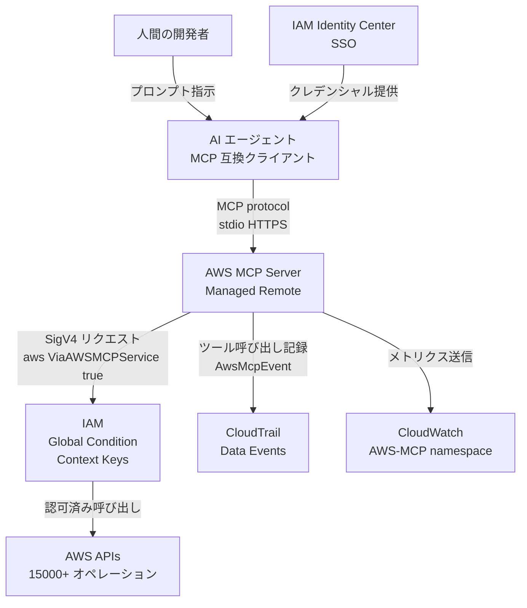
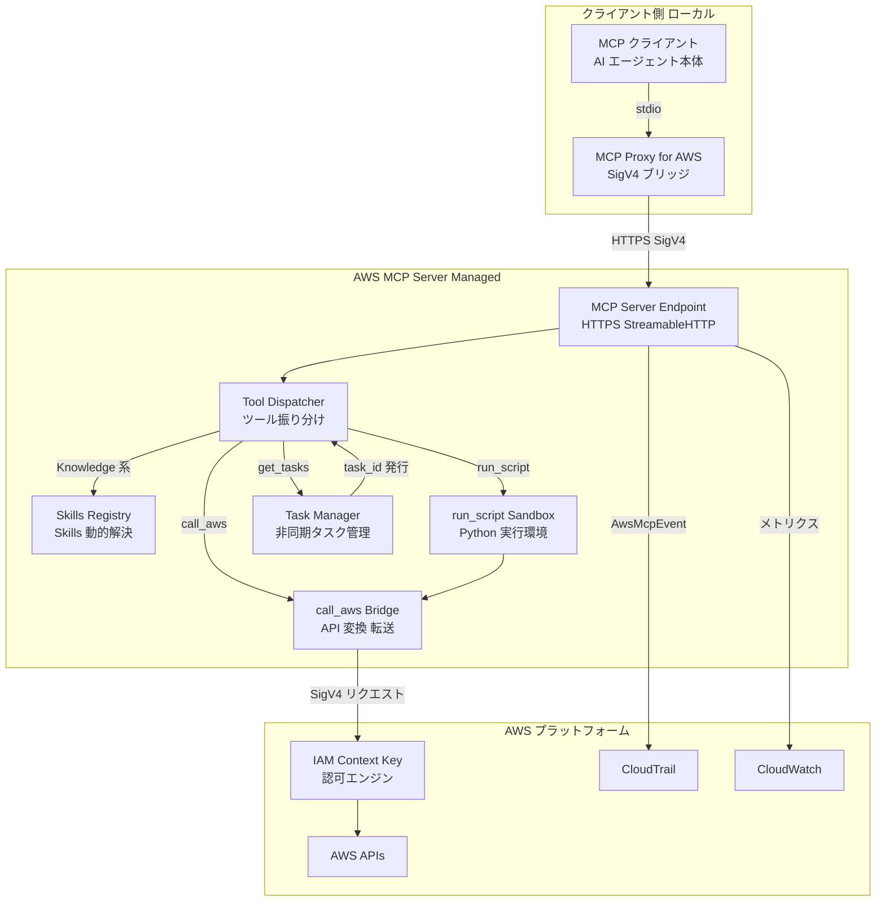
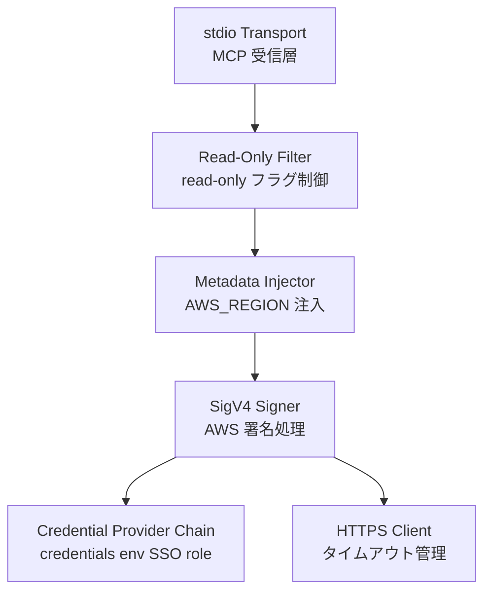
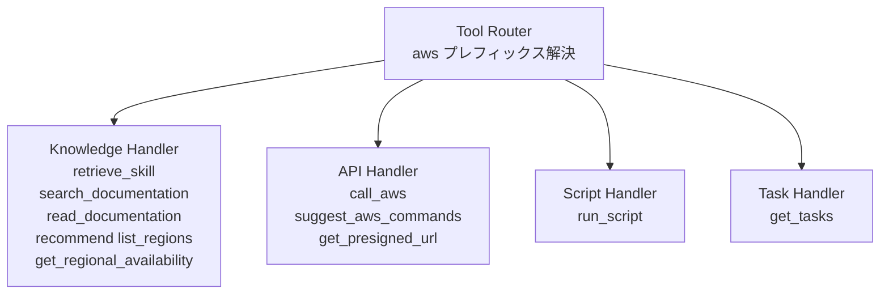
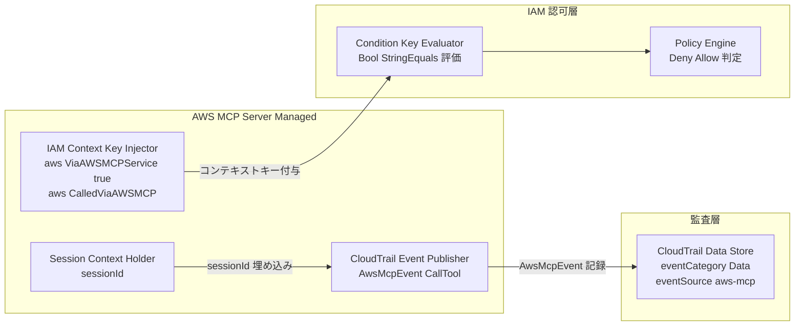
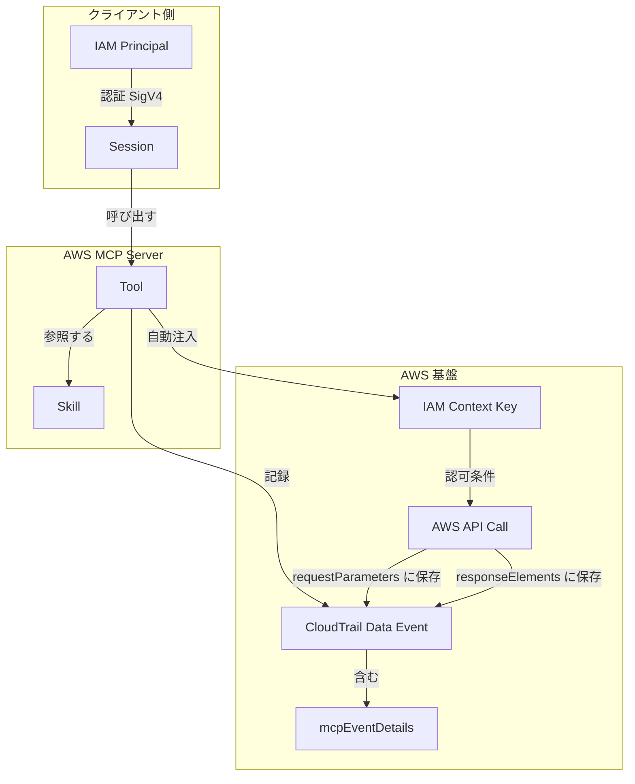
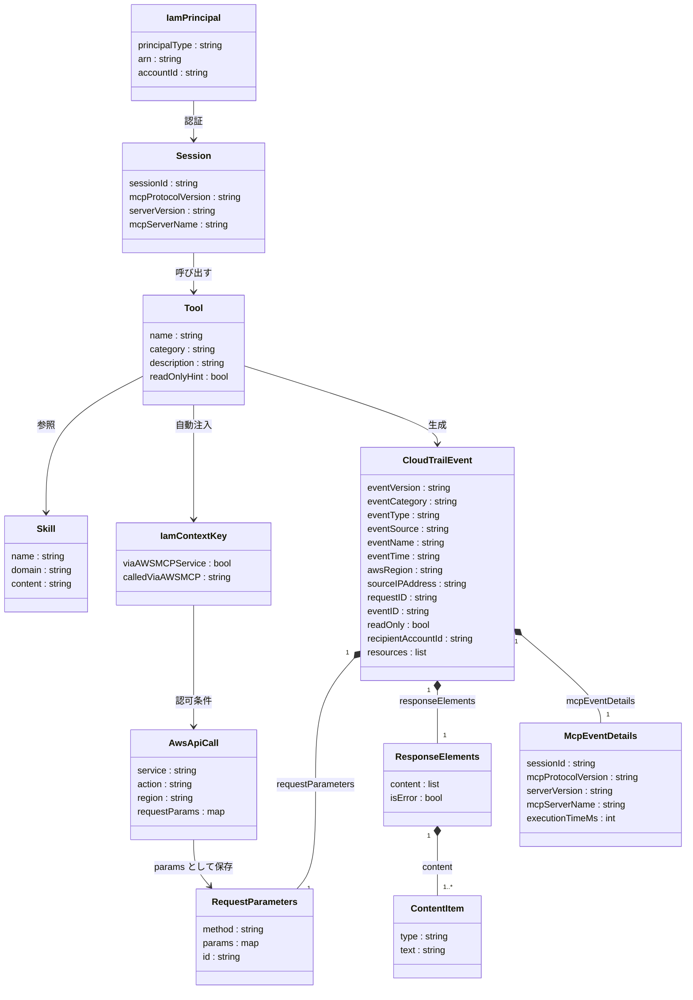

> 調査日: 2026-05-07 / 対象: マネージド版 AWS MCP Server (GA: 2026-05-06)

## 概要

AWS MCP Server は、AWS がフルマネージドで提供するリモート MCP (Model Context Protocol) サーバーです。Claude Code / Cursor / Kiro / Codex / Q Developer CLI などの MCP クライアントから、AWS の 15,000 以上の API を呼び出すための公式の接続面を提供します。2025 年 12 月の re:Invent で preview として発表され、2026 年 5 月 6 日に GA となりました。

このサービスの本質は、AI エージェントに AWS 操作を委譲する経路の標準化です。これまで設計者ごとにバラバラだった統制点 (クレデンシャル管理 / AI 由来の識別 / 監査) を、1 本のマネージドゲートウェイに集約できます。

GA 同日に上位概念として Agent Toolkit for AWS が発表されました。Agent Toolkit は「Agent Skills + AWS MCP Server + Agent Plugins」の 3 本柱で構成され、AWS MCP Server がその中核コンポーネントです。

### 関連技術との関係

| 技術 | AWS MCP Server との関係 |
|---|---|
| MCP プロトコル | クライアント / サーバー間の通信規格。AWS MCP Server は MCP 準拠のリモートサーバーとして動作します |
| awslabs/mcp 自走 OSS 群 | AWS が公開する 60+ のオープンソース MCP サーバー群。クライアント PC や自前コンテナで実行します。マネージド版とは別物です |
| IAM + コンテキストキー | GA でグローバル条件コンテキストキー (`aws:ViaAWSMCPService` / `aws:CalledViaAWSMCP`) が追加されました |
| CloudTrail | MCP Server 経由の全 API 呼び出しを Data event として自動記録します |
| MCP Proxy for AWS | ローカルで起動する公式 OSS プロキシ。MCP クライアントの stdio を AWS Credential Provider Chain ベースの SigV4 署名付き HTTPS に変換します |

## 特徴

### GA 時点の基本仕様

| 項目 | 内容 |
|---|---|
| エンドポイント | `https://aws-mcp.us-east-1.api.aws/mcp` / `https://aws-mcp.eu-central-1.api.aws/mcp` (2 リージョン) |
| 認証 | SigV4 + MCP Proxy for AWS。IAM Identity Center (SSO) を推奨 |
| 提供ツール数 | 11 個 (Knowledge 6 種 + API 5 種) |
| Skills | 動的取得 (`retrieve_skill` で runtime 解決) |
| 課金 | サーバー本体は無料。実行された AWS リソース + データ転送のみ |
| 対応クライアント | Claude Code / Claude Desktop / Cursor / Kiro / Kiro CLI / Codex / 任意の MCP 互換クライアント |

### 提供ツール一覧

**Knowledge ツール (6 種)**

| ツール名 | 機能 |
|---|---|
| `retrieve_skill` | AWS ドメイン固有の Skills (ワークフロー・ベストプラクティス・手順) を取得 |
| `search_documentation` | API リファレンス・ベストプラクティス・サービスガイド・Skills を横断検索 (GA から認証不要) |
| `read_documentation` | AWS ドキュメントページを Markdown 形式で取得 |
| `recommend` | 関連トピックや閲覧頻度に基づくドキュメント推薦 |
| `list_regions` | 全 AWS リージョンの識別子と名称を取得 |
| `get_regional_availability` | サービス・機能・SDK API・CloudFormation リソースのリージョン別提供状況を確認 |

**API ツール (5 種)**

| ツール名 | 機能 |
|---|---|
| `call_aws` | 15,000 以上の AWS API を認証・構文バリデーション付きで実行するユニバーサルゲートウェイ |
| `suggest_aws_commands` | AWS API の説明と構文ヘルプを返す (新規 API も対応) |
| `run_script` | サーバー側サンドボックスで Python を実行。IAM 権限を継承し並列 API 呼び出しに対応 |
| `get_presigned_url` | Amazon S3 の署名付き URL を生成 |
| `get_tasks` | `call_aws` や `run_script` が返した task ID のステータスをポーリング |

### IAM コンテキストキー

GA でグローバル条件コンテキストキーが正式に追加されました。

| キー | 値 | 用途 |
|---|---|---|
| `aws:ViaAWSMCPService` | `true` | AWS MCP Server 経由の全リクエストに自動付与 |
| `aws:CalledViaAWSMCP` | `aws-mcp.amazonaws.com` | 経由した MCP サーバーを識別 |

公式に確認できたグローバル条件コンテキストキーは上記 2 種です。同一 IAM プリンシパルでも「MCP 経由では書き込み禁止、人間の Bash 経由は許可」のチャネル別最小権限を設計できます。Preview 期に Service Authorization Reference に登場していた `aws-mcp:InvokeMcp` 等の独自 action については、GA 時点の公式ガイドが下流 IAM + コンテキストキーによる制御に重心を移しているため、新規設計ではコンテキストキーを起点に組み立てることを推奨します。

### CloudTrail での監査

| フィールド | 値 |
|---|---|
| `eventSource` | `aws-mcp.us-east-1.api.aws` (または eu-central-1) |
| `eventName` | `CallTool` |
| `eventCategory` | `Data` (Data Event として記録) |
| `eventType` | `AwsMcpEvent` (MCP 専用イベントタイプ) |
| `mcpEventDetails` | `sessionId` / `mcpProtocolVersion` / `serverVersion` / `mcpServerName` / `executionTimeMs` |

プロンプト本文は CloudTrail に残りません。発話レベルの監査が必要な場合は MCP クライアント側のセッションログを別途保存します。

### Preview からの主な変化点

1. IAM コンテキストキーの正式化 (Preview 期は別ロールが必要だったが、コンテキストキーで同一プリンシパルから絞り込める)
2. ドキュメント取得の認証不要化 (`search_documentation` / `read_documentation` が匿名利用可能)
3. トークン消費の削減 (ツール定義・応答の slim 化)
4. Agent SOP から Agent Skills へ移行
5. `run_script` ツールの追加 (サーバー側 Python サンドボックス)

### 代替アプローチとの比較

| アプローチ | クレデンシャル流路 | 認可境界 | 監査の粒度 | ベンダーロックインリスク |
|---|---|---|---|---|
| AWS MCP Server (マネージド) | クライアントが SigV4 署名。MCP サーバーは credentials を保持しない | IAM + コンテキストキーで AI 経由を識別 | CloudTrail Data event + `mcpEventDetails` | MCP 仕様の breaking change への追従は AWS 任せ。SLA 未公開 |
| awslabs/mcp 自走 OSS | サーバープロセスが `~/.aws/credentials` を保持 | IAM のみ。AI 識別は session tag を自前付与 | CloudTrail に通常 API として記録。MCP 経由の識別は弱い | Apache-2.0 OSS。脆弱性対応も自前 |
| Bash + `aws` CLI 直叩き | シェルセッションの `~/.aws/credentials` | IAM のみ | CloudTrail のみ | LLM が組み立てた任意文字列を shell が実行するリスクが最大 |
| Q Developer CLI | AWS Builder ID / IAM Identity Center | Q CLI が MCP クライアント | CloudTrail + Q セッションログ | AWS サービスへの依存度が高い |
| Lambda + Step Functions | Lambda 実行ロール (静的) | IAM ロール固定 + Step Functions 入力 JSON | CloudTrail + Step Functions 履歴 | エージェント的な柔軟性は劣る |

## 構造

### システムコンテキスト図



| 要素名 | 説明 |
|---|---|
| 人間の開発者 | AI エージェントへの自然言語指示と AWS 操作方針の意思決定 |
| AI エージェント | MCP クライアントとして動作し、ツール呼び出しを生成・実行 |
| AWS MCP Server | MCP プロトコルの受信と AWS API への変換・転送。AWS がフルマネージドで運用 |
| IAM + Global Condition Context Keys | `aws:ViaAWSMCPService` / `aws:CalledViaAWSMCP` の評価による認可制御 |
| AWS APIs | EC2 / S3 / Lambda 等 15,000+ API エンドポイント群 |
| CloudTrail Data Events | MCP 経由の全ツール呼び出しを `AwsMcpEvent` として自動記録 |
| CloudWatch | スループット / エラー率 / レイテンシのメトリクス収集 |
| IAM Identity Center | AI エージェントクライアントへの短命クレデンシャル提供 |

### コンテナ図



| 要素名 | 説明 |
|---|---|
| MCP クライアント | AI エージェント本体。stdio で Proxy に接続 |
| MCP Proxy for AWS | stdio と HTTPS+SigV4 の変換。AWS Credential Provider Chain で署名 |
| MCP Server Endpoint | HTTPS リクエスト受信。MCP プロトコル処理の入口 |
| Tool Dispatcher | ツール名に応じて Knowledge / API / Sandbox / Task に振り分け |
| Skills Registry | 動的 Skills の保持・解決 |
| call_aws Bridge | MCP ツール呼び出しを SigV4 署名付き AWS API リクエストに変換・転送 |
| run_script Sandbox | サーバー側 Python 実行環境。複数 API の横断処理を担当 |
| Task Manager | 長時間タスクの非同期管理 |
| IAM 認可エンジン | `aws:ViaAWSMCPService` 等を評価し最終的な認可判断 |
| CloudTrail | MCP イベントの永続記録 |
| CloudWatch | 運用メトリクスの収集・集計 |

### コンポーネント図 (MCP Proxy for AWS の内部)



| 要素名 | 説明 |
|---|---|
| stdio Transport | MCP クライアントからの JSON-RPC 受信 |
| SigV4 Signer | リクエストへの AWS Signature Version 4 署名付与 |
| Credential Provider Chain | 認証情報の解決順序管理 (`~/.aws/credentials` → 環境変数 → SSO → assume-role) |
| Read-Only Filter | `readOnlyHint=true` でないツールを無効化するガード |
| Metadata Injector | MCP リクエストにキーバリューを付加 |
| HTTPS Client | 上流への HTTPS 送信とタイムアウト制御 |

### コンポーネント図 (Tool Dispatcher の内部)



| 要素名 | 説明 |
|---|---|
| Tool Router | `aws___` プレフィックスを受けて適切なハンドラへルーティング |
| Knowledge Handler | Skills / ドキュメント / リージョン情報の検索・取得 |
| API Handler | `call_aws` から SigV4 Bridge への変換と API 提案・プリサインド URL 生成 |
| Script Handler | Python コードをサンドボックスで実行 |
| Task Handler | 非同期タスクのステータスポーリング対応 |

### コンポーネント図 (IAM Context Key 注入と CloudTrail 記録)



| 要素名 | 説明 |
|---|---|
| IAM Context Key Injector | MCP 経由の全リクエストに自動でコンテキストキーを付与 |
| CloudTrail Event Publisher | ツール呼び出しを CloudTrail Data イベントとして発行 |
| Session Context Holder | クライアントセッション ID を保持し監査レコードに埋め込み |
| Condition Key Evaluator | IAM ポリシーの Condition ブロックでコンテキストキーを評価 |
| Policy Engine | Deny / Allow の最終判定 |
| CloudTrail Data Store | `eventSource: aws-mcp.<region>.api.aws` でフィルタ可能な永続ストア |

## データ

### 概念モデル



| エンティティ | 説明 |
|---|---|
| IAM Principal | AWS MCP Server を呼び出すユーザー/ロール |
| Session | MCP Proxy for AWS が確立するクライアント接続単位 |
| Tool | AWS MCP Server が提供する機能単位 (11 個) |
| Skill | Tool から動的取得される手順・ベストプラクティスの知識単位 |
| IAM Context Key | MCP 経由リクエストに自動付与されるグローバルコンテキストキー |
| AWS API Call | `call_aws` や `run_script` が実行する AWS サービス API 呼び出し |
| CloudTrail Data Event | MCP の全ツール呼び出しを記録するイベント |
| mcpEventDetails | CloudTrail Data Event に埋め込まれる MCP 固有の詳細フィールド群 |

### 情報モデル



| エンティティ | 説明 |
|---|---|
| Session | MCP クライアントとサーバー間のセッション。sessionId が CloudTrail と MCP クライアントログの突合キー |
| Tool | AWS MCP Server が公開するツール単位。`readOnlyHint` フラグでプロキシの `--read-only` モードと連動 |
| Skill | `retrieve_skill` で動的取得される手順書 |
| IamPrincipal | 呼び出し元の IAM 識別子。CloudTrail の `userIdentity` ブロックに対応 |
| IamContextKey | 全 MCP リクエストに自動付与されるコンテキストキー |
| AwsApiCall | `call_aws` / `run_script` が実行する下流 AWS API |
| CloudTrailEvent | `eventType: AwsMcpEvent` / `eventCategory: Data` で識別される MCP 専用イベント |
| RequestParameters | MCP リクエストの複製 |
| ResponseElements | ツール応答 |
| ContentItem | `content` リストの各要素 |
| McpEventDetails | CloudTrail イベントに埋め込まれる MCP 固有サブオブジェクト |

## 構築方法

### 前提条件

| 項目 | 要件 |
|---|---|
| AWS CLI | 2.32.0 以上 (`aws login` を使う場合) |
| uv / uvx | Python パッケージランナー |
| AWS アカウント | IAM Identity Center (SSO) を有効化 (推奨) |
| ネットワーク | `https://aws-mcp.us-east-1.api.aws` または `eu-central-1` への HTTPS アウトバウンド |
| 対応 OS | macOS / Linux / Windows |

### IAM Identity Center 事前設定 (推奨)

1. AWS マネジメントコンソールで IAM Identity Center を有効化
2. 管理者ユーザーを作成し、最小権限の Permission Set を割り当て
3. `aws configure sso` または `aws login` でローカル CLI を認証

### mcp-proxy-for-aws のインストール

#### uvx (推奨)

```bash
# uv のインストール (macOS / Linux)
curl -LsSf https://astral.sh/uv/install.sh | sh

# Windows
powershell -ExecutionPolicy ByPass -c "irm https://astral.sh/uv/install.ps1 | iex"

# 起動確認
uvx mcp-proxy-for-aws@latest --help
```

#### ローカル clone (バージョン固定)

```bash
git clone https://github.com/aws/mcp-proxy-for-aws.git
cd mcp-proxy-for-aws
uv run mcp_proxy_for_aws/server.py https://aws-mcp.us-east-1.api.aws/mcp
```

#### Docker (公式 ECR イメージ)

```bash
docker pull public.ecr.aws/mcp-proxy-for-aws/mcp-proxy-for-aws:latest
```

### 主要 CLI フラグ

| フラグ | 説明 | デフォルト |
|---|---|---|
| `endpoint` | MCP エンドポイント URL (必須位置引数) | — |
| `--region` | SigV4 署名に使う AWS リージョン | `AWS_REGION` 環境変数 |
| `--profile` | 使用する AWS 認証プロファイル | `AWS_PROFILE` 環境変数 |
| `--metadata` | MCP リクエストに注入する key=value ペア | `--region` から自動注入 |
| `--read-only` | `readOnlyHint=true` のないツールを無効化 | `False` |
| `--retries` | 上流へのリトライ回数 | `0` |
| `--tool-timeout` | ツール呼び出し 1 回の最大秒数 | `300` |
| `--timeout` | 全操作のタイムアウト秒数 | `180` |
| `--connect-timeout` | 接続タイムアウト秒数 | `60` |
| `--read-timeout` | 読み取りタイムアウト秒数 | `120` |
| `--write-timeout` | 書き込みタイムアウト秒数 | `180` |
| `--log-level` | ログレベル | `INFO` |
| `--disable-telemetry` | テレメトリ収集を無効化 | `False` |
| `--service` | SigV4 署名のサービス名 | 自動推定 |

### バージョン確認

```bash
uvx mcp-proxy-for-aws@latest --version
```

## 利用方法

### 必須パラメータ

| パラメータ | 値・説明 | 必須 |
|---|---|---|
| `transport` | `stdio` | Yes |
| `endpoint` | `https://aws-mcp.<region>.api.aws/mcp` | Yes |
| `--metadata AWS_REGION=<region>` | AWS API 操作のデフォルトリージョン | 推奨 |
| `--profile <profile>` | 使用する AWS プロファイル名 | No |
| `--region <region>` | SigV4 署名に使うリージョン | No |
| `--read-only` | 書き込み系ツールを無効化 | No |

### IAM Identity Center 認証

#### `aws login` (推奨, 15 分ごと自動ローテーション)

```bash
aws login
# ブラウザが開きマネジメントコンソールと同じ認証情報でサインイン。最大 12 時間有効
```

#### `aws configure sso` (推奨)

```bash
aws configure sso
aws sso login --profile my-sso-profile
aws sts get-caller-identity --profile my-sso-profile
```

#### Static IAM Access Key (非推奨)

```bash
aws configure
# 90 日ごとのローテーションが必要。自動更新なし
```

#### Cross-account Assume-Role

```ini
# ~/.aws/config
[profile my-role]
role_arn = arn:aws:iam::123456789012:role/MyRole
source_profile = default
region = us-east-1
```

```bash
uvx mcp-proxy-for-aws@latest https://aws-mcp.us-east-1.api.aws/mcp \
  --profile my-role \
  --metadata AWS_REGION=ap-northeast-1
```

### 各 MCP クライアントへの接続設定

#### Claude Desktop

```json
{
  "mcpServers": {
    "aws-mcp": {
      "command": "uvx",
      "args": [
        "mcp-proxy-for-aws@latest",
        "https://aws-mcp.us-east-1.api.aws/mcp",
        "--metadata", "AWS_REGION=ap-northeast-1"
      ]
    }
  }
}
```

#### Claude Code (CLI)

```bash
claude mcp add-json aws-mcp --scope user \
  '{"command":"uvx","args":["mcp-proxy-for-aws@latest","https://aws-mcp.us-east-1.api.aws/mcp","--metadata","AWS_REGION=ap-northeast-1"]}'
```

#### Cursor IDE (`.cursor/mcp.json`)

```json
{
  "mcpServers": {
    "aws-mcp": {
      "command": "uvx",
      "args": [
        "mcp-proxy-for-aws@latest",
        "https://aws-mcp.us-east-1.api.aws/mcp",
        "--metadata", "AWS_REGION=ap-northeast-1"
      ]
    }
  }
}
```

#### Kiro CLI / Kiro IDE

```json
{
  "mcpServers": {
    "aws-mcp": {
      "command": "uvx",
      "timeout": 100000,
      "transport": "stdio",
      "args": [
        "mcp-proxy-for-aws@latest",
        "https://aws-mcp.us-east-1.api.aws/mcp",
        "--metadata", "AWS_REGION=ap-northeast-1"
      ]
    }
  }
}
```

#### Codex (`~/.codex/config.toml`)

```toml
[mcp_servers.aws_mcp]
command = "uvx"
args = [
  "mcp-proxy-for-aws@latest",
  "https://aws-mcp.us-east-1.api.aws/mcp",
  "--metadata", "AWS_REGION=ap-northeast-1"
]
startup_timeout_sec = 60
```

### 接続テスト

Kiro CLI で:

```
/tools
/mcp
```

プロンプトで「利用可能な AWS リージョンを一覧してください」と入力すると、`aws___list_regions` が呼ばれます。

### 基本的な Tool 呼び出し例

#### S3 バケット一覧

```json
{
  "tool": "aws___call_aws",
  "arguments": {
    "service": "s3",
    "operation": "list_buckets",
    "region": "ap-northeast-1"
  }
}
```

#### ドキュメント検索

```json
{
  "tool": "aws___search_documentation",
  "arguments": {
    "query": "S3 bucket policy configuration",
    "topic": "s3"
  }
}
```

#### Python サンドボックスで複数 API を横断集計

```json
{
  "tool": "aws___run_script",
  "arguments": {
    "code": "import boto3\nfor region in ['ap-northeast-1', 'us-east-1']:\n    client = boto3.client('lambda', region_name=region)\n    resp = client.list_functions()\n    print(f'{region}: {len(resp[\"Functions\"])} functions')"
  }
}
```

#### 長時間タスクのポーリング

```json
{
  "tool": "aws___get_tasks",
  "arguments": {
    "task_id": "<前の呼び出しで返された task_id>"
  }
}
```

### read-only モード

AWS MCP Server に「read-only フラグ」は存在しません。read-only 制御は IAM ポリシーと `aws:ViaAWSMCPService` コンテキストキーで行います。

#### MCP 経由の破壊的操作をすべて拒否

```json
{
  "Effect": "Deny",
  "Action": [
    "s3:DeleteBucket",
    "s3:DeleteObject",
    "ec2:TerminateInstances",
    "rds:DeleteDBInstance"
  ],
  "Resource": "*",
  "Condition": {
    "Bool": {
      "aws:ViaAWSMCPService": "true"
    }
  }
}
```

#### 特定 MCP サーバー経由の操作のみ拒否

```json
{
  "Effect": "Deny",
  "Action": ["s3:DeleteBucket", "s3:DeleteObject"],
  "Resource": "*",
  "Condition": {
    "StringEquals": {
      "aws:CalledViaAWSMCP": "aws-mcp.amazonaws.com"
    }
  }
}
```

#### mcp-proxy-for-aws の `--read-only` フラグ

```bash
uvx mcp-proxy-for-aws@latest \
  https://aws-mcp.us-east-1.api.aws/mcp \
  --read-only \
  --metadata AWS_REGION=ap-northeast-1
```

ただし IAM 側のガードと併用することを推奨します。

## 運用

### CloudTrail Data Event の確認方法

AWS MCP Server を経由したツール呼び出しは CloudTrail Data Event として記録されます。Trail のデフォルトでは Management Event のみが記録されるため、MCP ツール呼び出しを Trail / Lake に保存するには「Data event selector」で `aws-mcp` リソースタイプを明示的に追加します。Event history (90 日) では Data Event は閲覧できない点にも注意します。

| フィールド | 値 |
|---|---|
| `eventSource` | `aws-mcp.us-east-1.api.aws` または `eu-central-1` |
| `eventName` | `CallTool` |
| `eventCategory` | `Data` |
| `eventType` | `AwsMcpEvent` |

#### Athena クエリ例

```sql
-- 直近 24 時間の MCP ツール呼び出し
SELECT
  eventtime,
  json_extract_scalar(requestparameters, '$.method') AS tool_name,
  json_extract_scalar(mcpeventdetails, '$.sessionId') AS session_id,
  json_extract_scalar(mcpeventdetails, '$.executionTimeMs') AS exec_ms,
  readonly
FROM cloudtrail_logs
WHERE eventsource = 'aws-mcp.us-east-1.api.aws'
  AND eventname = 'CallTool'
  AND eventtime > date_add('hour', -24, now())
ORDER BY eventtime DESC;
```

```sql
-- 書き込み操作のみ抽出
SELECT eventtime, useridentity,
       json_extract_scalar(requestparameters, '$.method') AS tool_name
FROM cloudtrail_logs
WHERE eventsource = 'aws-mcp.us-east-1.api.aws'
  AND readonly = false
ORDER BY eventtime DESC;
```

プロンプト本文は CloudTrail に記録されません。MCP クライアントのセッションログを別途保存し、`sessionId` で突合します。

> **Athena 列名について**: CloudTrail JSON のフィールド名は `mcpEventDetails` ですが、CloudTrail SerDe 経由で作成された Athena テーブルでは小文字化された `mcpeventdetails` 列としてマッピングされます。組織で利用する DDL の SerDe / 列名定義に合わせて参照してください。

### CloudWatch Metrics

2026-03 の Preview 拡張モニタリングで `AWS-MCP` namespace のメトリクスが追加されました。GA 時点では公式仕様の網羅的なリファレンスが未公開のため、以下のメトリクス名・閾値・CloudFormation アラーム例は運用設計の出発点として参考にし、実環境では AWS Console の CloudWatch メトリクス一覧で実際に発行されているメトリクス名を確認したうえで採用してください。記載は確定情報ではありません。

| メトリクス名 (想定) | 単位 | 推奨閾値 | 用途 |
|---|---|---|---|
| `ToolInvocationCount` | Count | — | ツール呼び出し総量。急増は予期しないエージェントループの検知 |
| `ToolErrorRate` | Percent | > 5% でアラーム | 認証エラー・タイムアウト・権限不足の統合エラー率 |
| `ToolResponseTokens` | Count | > 20,000 でウォーニング | 25K token 上限への接近を早期検知 |
| `ThrottledRequests` | Count | > 0 が連続 5 分でアラーム | 呼び出し先 AWS API のスロットリング |
| `SessionCount` | Count | — | 同時セッション数 |
| `ToolExecutionDurationMs` | Milliseconds | p99 > 60,000ms でアラーム | proxy 側 `--tool-timeout` 前に検知 |

#### CloudFormation アラーム例

```yaml
McpHighErrorRateAlarm:
  Type: AWS::CloudWatch::Alarm
  Properties:
    AlarmName: aws-mcp-high-error-rate
    Namespace: AWS-MCP
    MetricName: ToolErrorRate
    Statistic: Average
    Period: 300
    EvaluationPeriods: 2
    Threshold: 5
    ComparisonOperator: GreaterThanThreshold
    TreatMissingData: notBreaching
```

### セッション ID と MCP クライアントログの突合

CloudTrail には `mcpEventDetails.sessionId` が記録されますが、プロンプト本文は保存されません。

```python
# ツール起動ごとに sessionId を RoleSessionName に埋め込む例
sts.assume_role(
    RoleArn='arn:aws:iam::111122223333:role/AgentDataRole',
    RoleSessionName=f'agent-{mcp_session_id[:28]}',
    Tags=[
        {'Key': 'McpSessionId', 'Value': mcp_session_id},
        {'Key': 'AccessType',   'Value': 'AI'},
    ]
)
```

インシデント調査の手順書に「CloudTrail の `sessionId` → MCP クライアントログの同 `sessionId` エントリ → プロンプト全文の取得」フローを明記します。

### 認証セッションのローテーション

| 方式 | 自動更新 | セッション有効期間 | 推奨度 |
|---|---|---|---|
| `aws login` | 15 分ごと自動ローテーション | 最大 12h | 最推奨 |
| `aws configure sso` | キャッシュリフレッシュトークンでサイレント更新 | 既定 1h (最大 12h) | 推奨 |
| `aws configure` (static key) | 自動更新なし | 無期限 | 非推奨 |
| Cross-account AssumeRole | AWS SDK が透過的にリフレッシュ | ロールセッション上限 (既定 1h) | 状況に応じて |

`ExpiredTokenException` が頻発する場合は `aws login` への切り替えを優先します。Static key はエージェント用ロールで使わない方針が原則です。

## ベストプラクティス

### IAM Context Keys を活用した最小権限設計

#### MCP 経由でのみ削除系 API を拒否

```json
{
  "Version": "2012-10-17",
  "Statement": [
    {
      "Sid": "DenyDestructiveViaMCP",
      "Effect": "Deny",
      "Action": [
        "s3:DeleteBucket",
        "s3:DeleteObject",
        "ec2:TerminateInstances",
        "rds:DeleteDBInstance",
        "iam:DeleteUser",
        "iam:DeleteRole"
      ],
      "Resource": "*",
      "Condition": {
        "StringEquals": {
          "aws:CalledViaAWSMCP": "aws-mcp.amazonaws.com"
        }
      }
    }
  ]
}
```

### SCP / Permission Boundary でゲートを敷く

#### SCP: エージェント用ロールは MCP 経由でのみ使える

```json
{
  "Sid": "AgentRoleMcpOnly",
  "Effect": "Deny",
  "Action": "*",
  "Resource": "*",
  "Condition": {
    "ArnLike": {
      "aws:PrincipalArn": "arn:aws:iam::*:role/AgentRole-*"
    },
    "Bool": {
      "aws:ViaAWSMCPService": "false"
    }
  }
}
```

#### Permission Boundary: エージェント用ロールの最大権限を ReadOnly に封じ込め

```json
{
  "Sid": "AgentMaxPermissions",
  "Effect": "Allow",
  "Action": [
    "ec2:Describe*",
    "s3:Get*",
    "s3:List*",
    "cloudwatch:Get*",
    "cloudwatch:List*",
    "logs:Describe*",
    "logs:Get*",
    "logs:Filter*"
  ],
  "Resource": "*"
}
```

### bash 経由の credential 流出を SCP で遮断

`aws:ViaAWSMCPService` は MCP 経由のリクエストにのみ付与されます。エージェントが bash ツールを保有している場合、bash 経由の `aws` CLI 呼び出しにはこのキーが付きません。

防御は 2 段構えで行います。

1. MCP クライアント設定でエージェントから bash ツールを剥奪
2. SCP で「AgentRole は ViaAWSMCPService=false の場合に Deny」を組織レベルで強制

### read-only ガードレールの二重化

`mcp-proxy-for-aws` の `--read-only` フラグは `readOnlyHint=true` が付いていないツールを無効化しますが、フラグだけに頼る運用は不十分です。Issue #2820 で報告されている通り、`--read-only` 適用時に公開ツールが極端に絞られすぎる UX 問題があります。

```text
[クライアント設定]
  --read-only フラグ → ツールレベルの第一防衛線

[IAM ポリシー (エージェント用ロール)]
  ReadOnlyAccess + 削除/書き込み系の明示 Deny → 認可レベルの最終防衛線
```

### 段階導入

```text
Phase 1: sandbox (検証環境)
  - エージェント用 IAM Role を新設
  - Permission Boundary で *Read* / *Describe* / *List* 系に限定
  - Claude Code から call_aws で動作確認
  - CloudTrail で eventSource=aws-mcp.* が記録されることを確認

Phase 2: staging
  - Permission Boundary を「read 全部 + 限定的 write」に拡張
  - aws:ViaAWSMCPService=true を Condition に明示した Deny ポリシー追加
  - SCP で「AgentRole は MCP 経由のみ」を強制
  - sessionId と CloudTrail の突合をインシデントドリルで確認

Phase 3: 本番 (限定スコープ)
  - IaC / 監査 / ドキュメント検索系から先行導入
  - run_script は stable な集計・ヘルスチェックから
  - プロンプト全文ログを Claude Code 側でローテーション保存し S3 に転送
  - 破壊的操作は Step Functions / Lambda 型に留置
```

### マネージド版 + awslabs/mcp 自走 OSS の使い分け

| ユースケース | 推奨構成 | 理由 |
|---|---|---|
| 汎用 AWS API 呼び出し | マネージド版 | `aws:ViaAWSMCPService` が自動付与。CloudTrail Data Event で監査可能 |
| AWS ドキュメント・スキル検索 | マネージド版 | `search_documentation` / `retrieve_skill` が安定 |
| EKS / ECS 専用オペレーション | awslabs/mcp (eks/ecs-mcp-server) | マネージド版のカバレッジ外 |
| DocumentDB / Redshift | awslabs/mcp | データベース専用 MCP がスキーマ理解で優位 |
| IaC 生成 (CDK / Terraform) | awslabs/mcp (aws-iac-mcp-server) | terraform-mcp-server は 2026-03 に非推奨化 |
| データソブリンティ要件 (AP リージョン) | awslabs/mcp (自走) | マネージド版は us-east-1 / eu-central-1 のみ |

コンテキストキーが効くのはマネージド版経由のみです。自走 OSS を併用する場合は Session Tag (`aws:PrincipalTag/AccessType=AI`) を自前で付与し CloudTrail での識別を補います。

## トラブルシューティング

| # | 症状 | 原因 | 対処 |
|---|---|---|---|
| 1 | bash 経由で AWS API を叩いてしまい IAM Context Key が付かない | エージェントが bash ツールを持っており MCP より bash を選択 | MCP クライアント設定で bash を除外し、SCP で AgentRole を `ViaAWSMCPService=false` の場合に Deny |
| 2 | `InvalidSignatureException` / `UnrecognizedClientException` | mcp-proxy-for-aws のバージョンが古く SigV4 署名の service / region が不一致 | `uvx mcp-proxy-for-aws@latest` で最新版を使う |
| 3 | `ExpiredTokenException` が頻発 | static access key または短命 STS トークンを使用中 | `aws login` または `aws configure sso` に切り替え |
| 4 | 25K token 上限超過でツール応答が reject される | list 系をページネーションなしで呼んだ | `call_aws` の引数に `--max-items` / `--page-size` を指定。または `run_script` の paginator で件数制御 |
| 5 | `--read-only` 指定時に使えるツールが 1 個になる | `readOnlyHint=true` が付いていないツールが全て無効化される (Issue #2820) | `--read-only` フラグは使わず IAM 側で ReadOnlyAccess + Deny の二重化で制御 |
| 6 | prompt injection によりツールが意図しない API を呼び出す | 処理対象に隠しプロンプトが埋め込まれていた | 入力サニタイズ、削除系 API の IAM Deny、ツール呼び出し前に人間の確認 |
| 7 | アジア太平洋リージョンで latency が大きい | エンドポイントは us-east-1 / eu-central-1 の 2 拠点のみ | latency 許容度の高いユースケースに限定 |
| 8 | `run_script` が巨大なレスポンスを返す | スクリプト内でページネーションせず全件取得 | スクリプト内に件数上限を組み込む。または S3 に書き出して `get_presigned_url` でダウンロード |
| 9 | `call_aws` の応答に task ID が返り結果が取れない | 長時間処理は同期完了せず非同期 task ID を返す仕様 | `get_tasks` ツールでポーリング (10–30 秒間隔) |
| 10 | 旧 aws-api/knowledge-mcp-server と tool 名が競合 | マネージド版と自走 OSS が同時登録 | 公式ガイドに従い旧サーバーを削除してからマネージド版を設定 |

### bash 経由 API と IAM Context Key 欠落の構造

```text
問題の構造:
  エージェントが bash で aws s3 ls を実行
  → aws:ViaAWSMCPService = (付与されない)
  → IAM Deny ポリシーの "StringEquals aws:CalledViaAWSMCP" が不一致
  → Deny が発火せず通過

対処の優先順位:
  1. MCP クライアントの tool permission 設定で bash を除外する (最優先)
  2. SCP で "AgentRole は ViaAWSMCPService=false で Deny" を組織レベルで強制
  3. bash が除外できない場合は Session Policy で AssumeRole ごとに権限を絞る
```

### 25K token 上限超過の対処

```python
# run_script でページネーション制御する例
import boto3

client = boto3.client('ec2', region_name='ap-northeast-1')
paginator = client.get_paginator('describe_instances')
results = []
for page in paginator.paginate(PaginationConfig={'MaxItems': 20, 'PageSize': 10}):
    for reservation in page['Reservations']:
        results.extend(reservation['Instances'])
    if len(results) >= 20:
        break
print(f"取得件数: {len(results)}")
```

### prompt injection 防御チェックリスト

```text
入力層:
  - 処理対象テキストに「aws」「cli」「execute」「run」を含む疑わしい命令形を検出
  - 外部 URL / ファイル / Issue 本文は要約してから渡す

IAM 層:
  - 削除/変更系 API を aws:CalledViaAWSMCP で Deny
  - ToolInvocationCount 急増アラームを有効化

クライアント層:
  - write 系ツール呼び出し前に人間の確認ステップを挟む
```

### 反証エビデンスの統合

#### CVE と MCP 全体のセキュリティ

- 誤解: 「AWS managed MCP Server に切り替えれば OSS の脆弱性から解放される」
- 反証: コミュニティ実装やサードパーティ MCP サーバー (例: CVE-2025-5277 は `alexei-led/aws-mcp-server` のコマンドインジェクション) で CVE が複数報告されています。AWS マネージド版自体の脆弱性ではありませんが、MCP プロトコル自体の STDIO 設計欠陥や OWASP MCP Top 10 はマネージド版にも適用されます
- 推奨: マネージド版採用で OSS の直接的脆弱性リスクは下がりますが「MCP = 安全」とは言い切れません。本番導入前にペネトレーションテストを実施します

#### `aws:ViaAWSMCPService` の有効範囲

- 誤解: 「`aws:ViaAWSMCPService=true` を Condition に付ければ AI 経由の全操作を IAM でコントロールできる」
- 反証: bash / CLI 経由ではこのキーは付きません。prompt injection で呼び出されたツールには正規の MCP セッション経由でも `true` が付くため、「MCP = 安全な意図」を前提にした設計は危険です
- 推奨: `aws:ViaAWSMCPService` は識別シグナルとして使い、bash 剥奪 + SCP + Permission Boundary の多層防御として設計します

#### CloudTrail だけでは監査が閉じない

- 誤解: 「CloudTrail Data Event を有効にすれば MCP 経由の操作を完全に監査できる」
- 反証: プロンプト本文は CloudTrail に記録されません。SOC 2 / HIPAA / PCI-DSS には CloudTrail だけでは不十分です
- 推奨: インシデント対応手順に「sessionId で CloudTrail と MCP クライアントログを突合」ステップを必ず組み込み、プロンプト全文の長期保管パイプラインを事前に整備します

#### プロトコル互換性リスク

- 誤解: 「AWS がマネージドで管理しているので MCP プロトコルの変更に影響されない」
- 反証: MCP 仕様 2025-06-18 改訂で JSON-RPC batching が削除されました (breaking change)。AWS 側の追従タイムラインや SLA は未公開です
- 推奨: 本番環境ではバージョンを pin し、テスト環境で互換性を確認してから更新します。MCP プロトコルの major version 変更を追跡する変更管理プロセスを整備します

## まとめ

AWS MCP Server (Managed) の GA は、AI エージェントに AWS 操作を委譲する経路を「公式の接続面」へ標準化する転換点です。IAM コンテキストキー (`aws:ViaAWSMCPService` / `aws:CalledViaAWSMCP`) と CloudTrail Data Event を軸に、bash 剥奪 / SCP / Permission Boundary との多層防御を組み合わせることで、エージェント由来の AWS 操作を統制しつつ運用できます。

この記事が少しでも参考になった、あるいは改善点などがあれば、ぜひリアクションやコメント、SNS でのシェアをいただけると励みになります！

## 参考リンク

- 公式ドキュメント
  - [AWS MCP Server is now generally available (GA Blog, 2026-05-06)](https://aws.amazon.com/blogs/aws/the-aws-mcp-server-is-now-generally-available/)
  - [AWS MCP Server Getting Started Guide](https://docs.aws.amazon.com/aws-mcp/latest/userguide/getting-started-aws-mcp-server.html)
  - [Understanding the MCP Server tools](https://docs.aws.amazon.com/aws-mcp/latest/userguide/understanding-mcp-server-tools.html)
  - [CloudTrail Integration for AWS MCP Server](https://docs.aws.amazon.com/aws-mcp/latest/userguide/logging-using-cloudtrail.html)
  - [Secure AI Agent Access Patterns Using MCP (AWS Security Blog)](https://aws.amazon.com/blogs/security/secure-ai-agent-access-patterns-to-aws-resources-using-model-context-protocol/)
  - [AWS MCP Server Enhanced Monitoring (2026-03)](https://aws.amazon.com/about-aws/whats-new/2026/03/aws-mcp-server-preview-enhanced-monitoring/)
  - [IAM Global Condition Context Keys](https://docs.aws.amazon.com/IAM/latest/UserGuide/reference_policies_condition-keys.html)
  - [IAM Service Authorization Reference (awsmcpserver)](https://docs.aws.amazon.com/service-authorization/latest/reference/list_awsmcpserver.html)
  - [AWS Prescriptive Guidance — MCP Governance Strategy](https://docs.aws.amazon.com/prescriptive-guidance/latest/mcp-strategies/mcp-governance-strategy.html)
  - [AWS CLI: Sign in with aws login command](https://docs.aws.amazon.com/cli/latest/userguide/cli-configure-sign-in.html)
- GitHub
  - [aws/mcp-proxy-for-aws](https://github.com/aws/mcp-proxy-for-aws)
  - [awslabs/mcp (OSS リポジトリ)](https://github.com/awslabs/mcp)
  - [Issue #2820 (--read-only 過剰絞り込み)](https://github.com/awslabs/mcp/issues/2820)
  - [Issue #911 (postgres-mcp --readonly 無視)](https://github.com/awslabs/mcp/issues/911)
- 記事・セキュリティ
  - [Snyk Labs — Prompt Injection Meets MCP](https://labs.snyk.io/resources/prompt-injection-mcp/)
  - [Unit42 — MCP Attack Vectors](https://unit42.paloaltonetworks.com/model-context-protocol-attack-vectors/)
  - [OWASP MCP Top 10](https://owasp.org/www-project-mcp-top-10/)
  - [Practical DevSecOps — MCP Security Vulnerabilities](https://www.practical-devsecops.com/mcp-security-vulnerabilities/)
  - [The Register — MCP Design Flaw (2026-04-16)](https://www.theregister.com/2026/04/16/anthropic_mcp_design_flaw/)
  - [Rafter Blog — MCP Audit Logging Problems](https://rafter.so/blog/mcp-audit-logging-problems)
  - [DEV.to — Solving AI's 25,000 Token Wall](https://dev.to/swapnilsurdi/solving-ais-25000-token-wall-introducing-mcp-cache-1fie)
