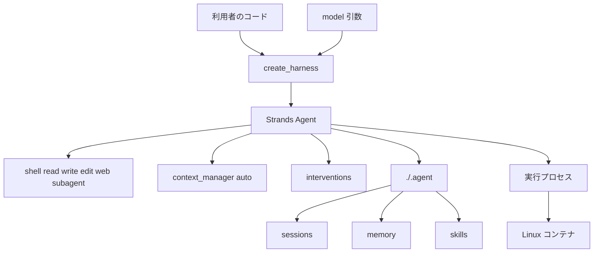

Strands harness は、AWS の Strands チームが 2026-09-21 に Apache-2.0 で公開した組み立て済みのエージェントです。
Python では `create_harness()`、TypeScript では `createHarness()` を 1 回呼ぶと、シェル、ファイル操作、Web アクセス、セッション、長期記憶、コンテキスト管理、サブエージェントを備えたエージェントが返ります。
モデルは引数で指定します。省略したときの既定は Amazon Bedrock で、設定参照の既定文字列は `bedrock/global.anthropic.claude-opus-5` です。
この記事では、何が既定で入っているか、モデルを替えたときにどこが揃わないか、本番の最初の版で自社が固定する点を、2026-09-29 時点の公式ドキュメントと公開ソースに沿って整理します。


*この記事の全体像。以下、順に解説します。*

## Strands harnessとは

Strands harness は、ツール、コンテキスト、セッション、記憶、フック、システムプロンプトの既定をあらかじめ組んだエージェントです。
返る実体は Strands Harness SDK の `Agent` で、工場関数の外側に別のラッパー型はありません。
モデル、ツール、承認、ディスク上の状態は、工場関数の別引数です。
公開の説明は [Strands チームのブログ](https://strandsagents.com/blog/introducing-strands-harness/) と [ユーザーガイド](https://strandsagents.com/docs/user-guide/harness/) にあります。
Publickey は 2026-09-29 に、この公開を日本語で報じています。

ソースは GitHub の [`strands-agents/harness-sdk`](https://github.com/strands-agents/harness-sdk) です。
2026-09-29 時点でアーカイブではなく、star は 8,519、リポジトリの作成日は 2025-05-14、default branch `main` の更新は 2026-09-28 です。
リポジトリの作成日は、組み立て済み harness の公開日とは別です。
インストールするパッケージ名も分かれます。組み立て済み側は Python の `strands-harness` と npm の `@strands-agents/harness`、SDK 側は `strands-agents` です。

### インストールと最小の呼び出し

クイックスタートが求める実行環境は、Python 3.10 以降、または Node.js 20 以降です。

```bash
pip install strands-harness
npm install @strands-agents/harness
npm install -g @strands-agents/cli
```

3 行目は対話用 CLI です。
CLI はプロバイダとモデルを選んで対話し、`/export` で Python または TypeScript のプロジェクトを書き出します。
ライブラリとして使う最小例は、クイックスタートの Bedrock 既定です。
Bedrock では、Bedrock API キー（`AWS_BEARER_TOKEN_BEDROCK`）、AWS のアクセスキー、または EC2、ECS、Lambda などの IAM ロールのいずれかが要ります。

```python
from strands_harness import create_harness

agent = create_harness()
agent(
    "REST API のバージョニングを3方式比べ、推奨を api-versioning.md に書いてください"
)
```

モデルを明示するときは `provider/name` を渡します。
ブログが例示する文字列には、`bedrock/global.anthropic.claude-opus-5`、`anthropic/claude-opus-5`、`openai/gpt-5.6-sol`、`google/gemini-3.5-flash`、`litellm/openai/gpt-5.6-sol` があります。
クイックスタートは OpenAI を `openai/gpt-5.4`、Google を `google/gemini-2.5-flash`、Ollama を `ollama/llama3.1` と書いています。
別名があるのは Amazon Bedrock、Anthropic、OpenAI、Google、Ollama、LiteLLM です。
未知の組み込みツール名は、構築時に失敗します。

会話をまたいで残すときはセッション ID を指定します。
既定の保存先は `./.agent/sessions` です。

```python
from strands_harness import create_harness

agent = create_harness(session={"id": "api-design"})
agent("外部顧客向けなら、その3方式のどれを採りますか")
```

### 既定で付くもの

設定参照が挙げる組み込みツールは次の 8 つです。

| 名前 | 役割 |
|---|---|
| `shell` | コマンドを実行する |
| `read` / `write` / `edit` | ファイルを読む、書く、文字列を置換する |
| `web_fetch` | URL を GET し、要約モデルがプロンプトに答える |
| `web_search` | プロバイダの検索を有効にするスイッチ |
| `programmatic_tool_caller` | モデルが書いたコードからツールを呼ぶ |
| `subagent` | 組み込みの `generalist` へサブタスクを渡す |

組み込みプラグインの既定は `todos` と `environment` です。
スキルの走査先は `./.agent/skills`、長期記憶の既定ディレクトリは `./.agent/memory` です。
`web_fetch` はページ本文そのものではなく、要約モデルの答えを返します。
プロンプトを空にするとページテキストを返します。
取得結果は 15 分キャッシュされます。
`read` は絶対パスを取り、`..` を拒否します。

`context_manager` の既定は `"auto"` です。
Python SDK の `context_manager.py` では、1,500 トークンを超えるツール結果を 750 トークンの preview に切り詰め、利用率が 85% を超えると古い履歴を要約し、直近 4 メッセージを残します。
2026-09-29 に default branch のこのファイルを確認した定数は、`_AUTO_TRUNCATE_THRESHOLD = 1_500`、`_TRUNCATE_PREVIEW_TOKENS = 750`、`_AUTO_SUMMARIZE_UTILIZATION = 0.85`、`preserve_recent=4` です。
セッションがあるとき、オフロードした成果物はセッションディレクトリに残ります。
セッションが無いときのオフロード先は、プロセスを超えない一時ディレクトリです。

システムプロンプトは、先に調べ、不可逆な操作の前に確認し、終える前に検証するようモデルへ指示します。
ツール承認の引数 `interventions` の既定は none で、呼び出しはそのまま実行されます。
利用者が渡せるのは `"ask"`、`"smart"`、自然言語の規則、`.cedar` で終わる Cedar ファイル、SDK のハンドラです。

組み込みの `generalist` は、親のモデル、キャッシュ、コンテキスト管理、組み込みツール、プラグイン、`interventions`、サンドボックスを継承します。
渡す指示は汎用のロールプロンプトで、会話は空から始まります。
常にバックグラウンドで動き、親はそのあいだ作業を続けられます。
他の互換ツールは、既定ポリシー `{ agentic: ['*'] }` ではモデルがバックグラウンド実行を選べます。
その呼び出しは結果を待ってから続きに使います。

`shell` は呼び出しごとに新しいシェルです。
作業ディレクトリと環境変数は呼び出しをまたいで残りません。
ファイルツールとシェルは同じサンドボックス経由で、既定はホスト上のローカルサンドボックスです。
Docker サンドボックスと SSH サンドボックスへ付け替えられます。

工場関数が返す `Agent` はプロセスとして動きます。
本番ガイドは、デプロイガイドの実行先へそのまま載せられると書き、例として AWS Lambda、AWS Fargate、Amazon EKS、Amazon Bedrock AgentCore を挙げています。
ブログは、Linux コンテナを持つプロバイダの例として Modal、Cloudflare Containers、Azure Container Apps、Google Cloud Run、Amazon ECS、Amazon Bedrock AgentCore を並べています。

### 呼び出しの集まり方

利用者のコードは 1 つの工場関数に集まり、返る実体は `Agent` です。
ディスク上の状態は `./.agent` 配下のファイルです。



## 注意点

ここからは、公開時の数値と見出しが、ドキュメントのどの範囲までを指すかを分けます。

### 費用と精度は開発チームの自己申告である

公式ブログの本文は、同じ Claude または GPT を使い、6 本のベンチマークで Strands harness のコストが 28% 低い（costs 28% less）、と書いています。
同じ段落は、トークン効率は良く、ベンチマークのスコアはほぼ同等（nearly equal）だとも書いています。
導入文は equal or better accuracy とも書きます。
ページ題は "28% lower token cost" です。
Publickey が引用する AWS Developers の投稿は "28% fewer tokens" です。
28% がトークン量なのか請求額なのかは、ブログ本文だけでは一意に決まりません。
Deepseek Harness はトークン効率が最も良い一方、精度は最低だった、とも書いています。
計測環境は EC2 上の Harbor です。

Fable 5 の Terminal Bench 2.1 では、Claude Code よりコストが 77% 低く（cost 77% less）、スコアは高い、と書いています。
比較したハーネスの版、試行数、信頼区間、6 本の名前はブログ本文にありません。
ドル金額もブログ本文にはありません。
ブログはフォローアップ論文を予告しています。
2026-09-29 時点で、その論文の掲載先は公式ブログからは特定できません。

Hacker News では、ブログ著者の Albert Zhao が、図表の Terminal Bench 2.1（high effort、Fable 5）について、Strands harness が 69.7、Claude Code が 61.8 だと述べています。
同じスレッドで飽和を指摘され、著者は飽和を認めたうえで、後続の深掘りで Terminal Bench 4.0 を見る可能性に触れています。
Publickey は同じ図を見て、スコア 69.7 でトップ、コスト 56.29 ドルで 2 位、Claude Code は一番下、と書いています。
56.29 ドルは図表の読み取りであり、ブログ本文の数字ではありません。

77% という比率を、コーディング専用ハーネスの置換根拠にはしません。
公式ブログ自身が、Strands harness をコーディング専用ではなく汎用エージェントだと書いています。
28% と 77% は、費用の見込みにも使いません。
論文が出てから、同じモデル、同じ課題、自社のツールセットで測り直す対象です。

著者は Hacker News で、Strands が Amazon 社内の数千のエージェントを支えている、とも述べています。
件数の定義と時点は投稿にありません。
社内規模の一次統計としては扱いません。

### モデル非依存と任意コンテナは、引数と Linux コンテナの範囲である

「特定の LLM に依存しない」は、モデル引数を差し替えられる、という意味に限られます。
検索、キャッシュ、推論強度、コンテキスト窓はプロバイダで分岐します。
差の中身は次の節に置きます。

「任意のコンテナ」は、公式ブログの文では Linux コンテナを持つプロバイダです。
著者は Hacker News で、Cloudflare Containers と Modal では公開前に動かしたが、デプロイ文書はこれからだと述べています。
2026-09-29 時点で、公式のデプロイ索引にこの 2 つの専用ページは見つかっていません。
コンテナへ載せても、資格情報と `./.agent` の永続化は利用者が持ちます。
本番ガイドは、エフェメラルなディスクでは `session` と `memory` のディレクトリを永続ボリュームか自前のストアへ向けるよう書いています。

「確認してから実行する」はシステムプロンプトの指示です。
ランタイムの承認は既定ではありません。
`programmatic_tool_caller` は、モデルが書いたコードを Monty の中で動かします。
本番ガイドは、隔離されるのはそのコードであり、コードから呼ぶツールは隔離されない、と書いています。
信頼できない入力では、SDK のサンドボックスに入れるか、このツールを外すよう求めています。

### 日付と製品名が隣り合う

Publickey は、Strands Harness SDK を 2026 年 8 月の公開だと書いています。
`harness-sdk` の作成日は 2025-05-14 です。
AWS の 2026-06-17 サミットまとめは、Harness SDK のコンテキスト管理にすでに触れています。
8 月公開という日付は、この 2 つと一致しません。
組み立て済み harness の公開ブログの日付は 2026-09-21 です。

同じサミットまとめには、Amazon Bedrock AgentCore harness の一般提供が別項目であります。
Strands harness の公開説明とは別の告知です。
名前が似ていても、2026-09-21 の OSS 工場関数と同一視しません。

[arXiv:2609.07360](https://arxiv.org/abs/2609.07360) は Strands の計測論文ではありません。
題は "Scanning the Harness" です。
v3 の改訂日は 2026-09-25、初版投稿は 2026-09-07 です。
対象は公開 GitHub 上のコーディングエージェント設定です。

NVD を "harness" で探すと、別製品 Harness（旧 Gitness）の CVE に当たります。
番号が似ていても Strands の脆弱性ではありません。
`strands-agents/harness-sdk` 向けの GitHub Advisory は、2026-09-29 の確認範囲では見つかっていません。
本番放棄のポストモーテムも、同じ確認範囲では見つかっていません。

## モデルを替えても揃わない境界

モデル文字列を替えても、次の境界は自動では揃いません。
公式ドキュメントが書いている差です。

| 境界 | 公式に書いてある差 | 置き換え時に見ること |
|---|---|---|
| 検索 | Bedrock Converse の既定 `web_search` は no-op。明示すると構築失敗。回避は第三者の Exa | 検索がプロバイダネイティブか、無いか、Exa か |
| キャッシュ | Bedrock と Anthropic 直接はハーネスが設定。OpenAI、Google、bedrock-mantle はサーバ側。切っても効かない経路がある | 同じプロンプトの請求が、期待したキャッシュで減るか |
| 推論強度 | `effort` はプロバイダごとの受理レベルに写像される。拒否されるレベルは構築時に失敗する。組み立て済みの `Model` を渡すと `effort` は無視される | 拒否されるレベルで構築が落ちないか |
| コンテキスト窓 | 未登録のモデル ID は既定の 200,000 へ落ちる | 利用率 85% の要約が、実窓に対して遅いか |
| 承認 | 既定は none。プロンプトの「確認」はゲートではない | 削除やネットワークが、承認なしで通るか |
| 状態 | `./.agent` はローカルファイル。セッションが無いオフロードは一時ディレクトリ | コンテナ再起動のあと、同じ session id で会話が戻るか |
| サブエージェント | `generalist` は親の承認とサンドボックスを継承し、既定でバックグラウンド | 委任先だけ承認をすり抜けないか |
| 資格情報 | Bedrock 既定は Bedrock API キー、AWS キー、または IAM ロール。CLI はプロバイダごとのキーを見る | 実行先の環境変数とロールが、選んだプロバイダと一致するか |

`web_search` がプロバイダネイティブになるのは、OpenAI、Anthropic の Python ライブラリ、Google、bedrock-mantle 上の GPT-5 と GPT-6 です。
Amazon Bedrock の Converse では、既定のままなら警告を出して検索を付けません。
`builtin_tools` で明示すると構築時に失敗します。
Exa を指定すると、どのモデルでも Exa のホスト検索に置き換わります。
クエリは Exa へ送られます。
キーなしの無料枠で始められ、上限を上げるときは `EXA_API_KEY` を置きます。

プロンプトキャッシュをハーネスが設定するのは Amazon Bedrock と Anthropic 直接です。
OpenAI、Google、bedrock-mantle ではサーバ側の自動キャッシュで、`caching` を切ってもハーネス側の設定は効きません。
組み立て済みの `Model` インスタンスへキャッシュを明示すると、警告を出して無視されます。
その場合はインスタンス側で設定します。

Ollama の窓は、open の [Issue #4620](https://github.com/strands-agents/harness-sdk/issues/4620)（2026-09-25 起票、Strands 1.57.0、`strands-harness` 0.1.2）が、テーブル未登録のため 200,000 へ黙って落ちると報告しています。
2026-09-29 に default branch の `_defaults.py` を見た範囲では、`ollama`、`qwen`、`llama3` の文字列はコメント以外に無く、`DEFAULT_CONTEXT_WINDOW_LIMIT` は 200_000 です。
起票者の「32,768 窓では約 6 倍」は、その Issue の再現であり、この記事では再実行していません。

Gemini では、open の [#3639](https://github.com/strands-agents/harness-sdk/issues/3639)（2026-08-04）が、サーバ側の組み込みツールと function tools の併用で 400 になると報告しています。
本文は、`include_server_side_tool_invocations` がリクエストに乗らない、と書いています。
再現に書かれた版は TypeScript SDK 1.9.0 と 1.11.2、Python `strands-agents` 1.50.2 です。
Issue は 2026-09-29 時点で open です。
open の [#4523](https://github.com/strands-agents/harness-sdk/issues/4523)（2026-09-22）は、Gemini の 429 が `error.status` の文字列次第でリトライされない、と報告しています。
open の [#1060](https://github.com/strands-agents/harness-sdk/issues/1060)（2025-10-21）は、Gemini の明示コンテキストキャッシュを足す feature request です。
不具合の確定ではありません。

## ハーネスの正本を3層に分ける

モデルを替える前に、正本を 3 層に分けます。
混ぜると、文字列の差し替えがツールと状態の同一に見えます。

| 層 | Strands harness での置き場 | 決めること |
|---|---|---|
| モデル | 引数のプロバイダ。既定は Bedrock | どのモデルベンダーの能力と契約を使うか |
| ハーネス | `strands-agents/harness-sdk` の既定と、そこに載る skills、MCP、承認 | 上流を追うか、自社で凍結するか |
| 実行 | 利用者のプロセスと Linux コンテナ | 資格情報、ディスク、サンドボックスを誰が持つか |

これは、Claude Code や Codex など複数のベンダーハーネスを 1 つの API の後ろに束ねる構成とは違います。
束ねる構成では、ハーネスの正本がベンダーごとに残ります。
Strands harness では、ハーネスの正本がこの OSS の工場関数の既定に寄ります。
モデルベンダーのハーネスは使いません。
実行先のコンテナは利用者が選びます。
配布主体は、ブログの著者一覧が Strands チームの公開ブログだと示しています。
Hacker News では Albert Zhao が、ブログ著者の一人だと名乗っています。
ライセンスは Apache-2.0 で、フォークを禁じてはいません。

arXiv:2609.07360v3（Kapner, Soceanu, Petrunin, Gartner。会議採録は abs ページに無い）は、コーディングエージェントがリポジトリ指示、スキル、フック、ツールサーバ宣言、サブエージェント定義から挙動を受け取ると書いています。
これらは実行可能な依存へも届くので、設定のレビューがソフトウェアサプライチェーンの一部になる、と摘要は述べます。
測定対象は 3,171 リポジトリで、setup が 2,660、skill collection が 511 です。
本文の中心結果は、2,660 のうち 409（15.4%）が、ピンしていない MCP 宣言か、広い実行の事前承認を含む、というものです。
論文は、測っている単位がリポジトリ上の宣言であり、実行時の被害と再現率は未測定だと限定しています。
この 15.4% は Strands harness の欠陥率ではありません。
スキルと承認を、上流の更新のたびに無審査で取り込まない、という判断の根拠に使います。

採用するときの現時点の置き方は、モデル引数と Linux コンテナを分けられる組み立て済みエージェントとして受け、承認、スキル、MCP、状態の 4 つは自社のピンで持つ、です。
「モデルも実行先も中立な完成品」としては受けません。

工場関数がモデル文字列を受け、Bedrock 以外の別名を公式が列挙していること、返る型が SDK の `Agent` であること、コンテキストの定数がソースと一致すること、`generalist` が親の承認とサンドボックスを継承するとサブエージェントのページが書いていること、Apache-2.0 でありホスト型コントロールプレーンが必須だとは書かれていないことは、この置き方を支えます。
検索、キャッシュ、推論レベル、コンテキスト窓がプロバイダで分岐すること、承認の既定が none であること、既定サンドボックスがコンテナではないこと、Monty がコードだけを隔離すること、28% と 77% が自己申告であること、同じ「Strands」の名で 2025 年からの SDK と 2026-09-21 の組み立て済み harness が 1 つのリポジトリに同居することは、完成品扱いを弱めます。

## 最初の版で凍結する4点

Strands harness を選ぶ場合、クラウド事業者側の OSS がハーネスの正本になります。
モデルベンダーのハーネスは正本にしません。
実行先のコンテナは自社が正本にします。
複数のベンダーハーネスを 1 つの API に束ねる構成を、この OSS は置き換えません。
置き換わるのは、ハーネスを自作するときの初期状態です。

最初のバージョンで凍結するものは 4 つです。

1. `interventions` を none のままにしません。削除、外部送信、シェルを、承認か Cedar の対象にします。
2. スキルと MCP は、上流のディレクトリをそのまま指しません。ピンしたコピーを自社のリポジトリに置きます。
3. `shell` のサンドボックスを、ホストローカルの既定から、実行先のコンテナ境界へ合わせます。
4. `session` と `memory` のディレクトリを、コンテナの一時ディスク以外に固定します。

自然言語の承認は、たとえば次の形です。
`session` の `id` はクイックスタート、`dir` は本番ガイドが別々に示しています。
永続ボリュームのパスは実行先に合わせて置き換えます。

```python
from strands_harness import create_harness

agent = create_harness(
    interventions="Ask before deleting files or making any network request.",
    session={"id": "api-design", "dir": "/data/agent/sessions"},
    memory={"dir": "/data/agent/memory"},
)
```

成果物ごとに、追うものと凍結するものを分けます。

| 成果物 | 扱い | 理由 |
|---|---|---|
| エージェントループ、プロバイダアダプタ、1,500 と 85% の閾値 | 上流を取り込む。取り込みのたびに再テストする | コストと窓の挙動がここにある。Ollama の窓欠落のように、上流の表がモデルとずれる |
| `interventions` とシェルのサンドボックス種別 | 自社で凍結する | 既定は承認なし、隔離はホストローカルである |
| `./.agent/skills` に入れるスキルと、MCP のパッケージ版 | 自社で凍結し、版をピンする | 論文が示すのは、宣言そのものが実行依存になることである |
| `session` と `memory` のディレクトリ | 実行先ごとに固定する | コンテナのローカルディスクは状態の正本にならない |
| ベンチマークの 28% と 77% | 採用理由にしない | 方法の論文が未確認で、チームの自己申告である |

上流のループとプロバイダアダプタは追ってよいです。
取り込む条件は、固定した 1 つのモデルで、上の 4 つが前回と同じ結果になることです。
Ollama や Gemini へ広げるときは、窓の利用率、検索と function tools の併用、429 のリトライを、そのモデルだけで見ます。

### まだ公開情報だけでは決まらないこと

次は、2026-09-29 時点で結論に使っていません。

- 予告されたベンチマーク論文が、6 本の名前、ハーネスの版、試行数、区間を出すか。69.7 と 61.8 の差が、著者が認めた飽和の下で残るか。
- [#4620](https://github.com/strands-agents/harness-sdk/issues/4620) と [#3639](https://github.com/strands-agents/harness-sdk/issues/3639) が、今の `strands-harness` リリースでまだ再現するか。Issue は open ですが、現行パッケージでは再実行していません。
- Cloudflare Containers と Modal の専用手順が、著者の「これから」のあとで公開されたか。2026-09-29 のドキュメント索引では見つかっていません。
- 同一 session id を複数インスタンスが同時に書くときの挙動。セッション実装を読んでいないため、ここには書きません。
- 追加インストール（`strands-harness` の extras）が、プロバイダごとに必須か。クイックスタートが明示しているのは、Bedrock 向けの資格情報です。

## まとめ

Strands harness は、モデル引数と Linux コンテナを分けて渡せる組み立て済みエージェントです。
返る型は SDK の `Agent` で、シェル、ファイル、Web、セッション、長期記憶、コンテキスト管理、`generalist` が既定で付きます。
モデル文字列の差し替えは、検索、キャッシュ、推論強度、コンテキスト窓の同一を意味しません。
承認の既定は無く、システムプロンプトの確認文はゲートではありません。
28% と 77% は開発チームの自己申告で、費用の見込みには使いません。

選ぶときは、ハーネスの正本をこの OSS に寄せ、実行先のコンテナは自社が持ち、承認、スキル、MCP、状態の 4 つを最初の版で凍結します。
上流のループは、その 4 つが同じモデルで前回と同じ結果になるときだけ取り込みます。

この記事が少しでも参考になった、あるいは改善点などがあれば、ぜひリアクションやコメント、SNSでのシェアをいただけると励みになります！

## 参考リンク

- Strands Agents. "Introducing Strands harness: frontier performance with 28% lower token cost." 2026-09-21. https://strandsagents.com/blog/introducing-strands-harness/
- Strands Agents. "Strands harness." https://strandsagents.com/docs/user-guide/harness/
- Strands Agents. "Strands harness quickstart." https://strandsagents.com/docs/user-guide/harness/quickstart/
- Strands Agents. "Configuration reference." https://strandsagents.com/docs/user-guide/harness/reference/configuration/
- Strands Agents. "Manage context and caching." https://strandsagents.com/docs/user-guide/harness/configure/context-and-caching/
- Strands Agents. "Web access." https://strandsagents.com/docs/user-guide/harness/tools/web-access/
- Strands Agents. "Shell and file tools." https://strandsagents.com/docs/user-guide/harness/tools/shell-and-files/
- Strands Agents. "Gate tool calls with interventions." https://strandsagents.com/docs/user-guide/harness/configure/interventions/
- Strands Agents. "Delegate to subagents." https://strandsagents.com/docs/user-guide/harness/configure/subagents/
- Strands Agents. "Run work in the background." https://strandsagents.com/docs/user-guide/harness/configure/background-tasks/
- Strands Agents. "Take Strands harness to production." https://strandsagents.com/docs/user-guide/harness/production/
- GitHub `strands-agents/harness-sdk`. https://github.com/strands-agents/harness-sdk
- コンテキスト定数: https://github.com/strands-agents/harness-sdk/blob/main/strands-py/src/strands/_context_manager/context_manager.py
- コンテキスト窓の既定: https://github.com/strands-agents/harness-sdk/blob/main/strands-py/src/strands/models/_defaults.py
- Issue #4620: https://github.com/strands-agents/harness-sdk/issues/4620
- Issue #3639: https://github.com/strands-agents/harness-sdk/issues/3639
- Issue #4523: https://github.com/strands-agents/harness-sdk/issues/4523
- Issue #1060: https://github.com/strands-agents/harness-sdk/issues/1060
- 新野淳一. "AWS、AIエージェントを自作できるツール「Strandsハーネス」をオープンソースで公開。" Publickey. 2026-09-29. https://www.publickey1.jp/blog/26/awsaistrandsllm.html
- AWS News Blog Team. "Top announcements of the AWS Summit in New York, 2026." 2026-06-17. https://aws.amazon.com/blogs/aws/top-announcements-of-the-aws-summit-in-new-york-2026/
- Hacker News. "Strands Harness." https://news.ycombinator.com/item?id=49817289
- Albert Zhao の返信: https://news.ycombinator.com/item?id=49818622
- Albert Zhao の返信: https://news.ycombinator.com/item?id=49818727
- Kapner, Soceanu, Petrunin, Gartner. "Scanning the Harness: Configuration Exposures in AI Coding-Agent Supply Chains." arXiv:2609.07360v3. https://arxiv.org/abs/2609.07360
