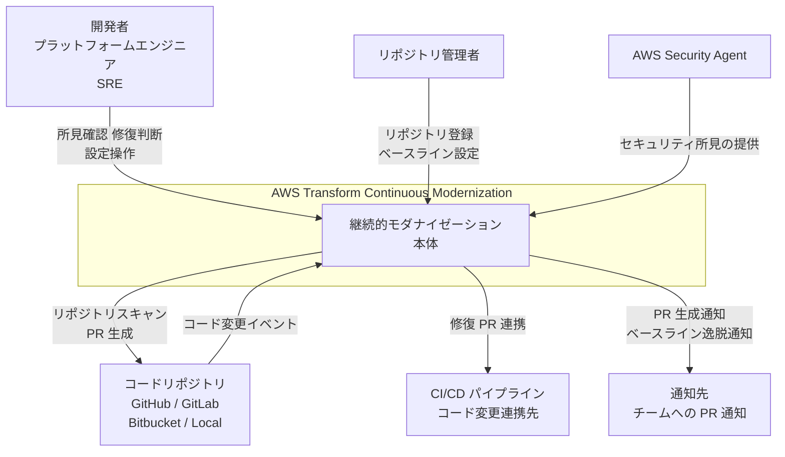
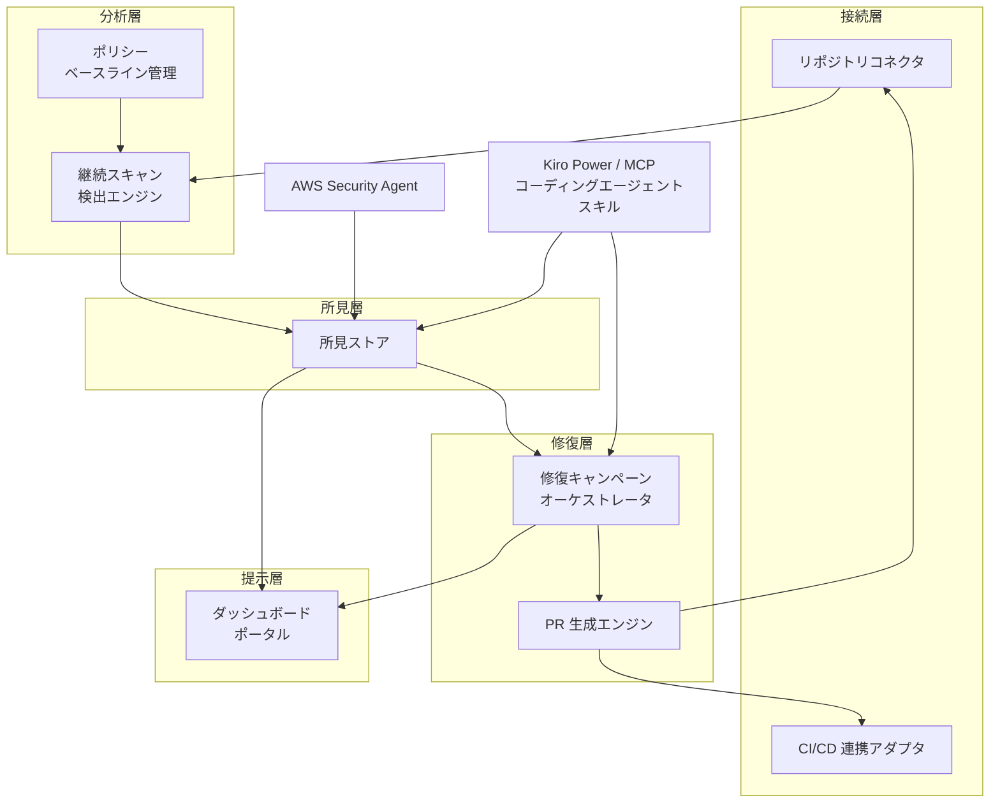
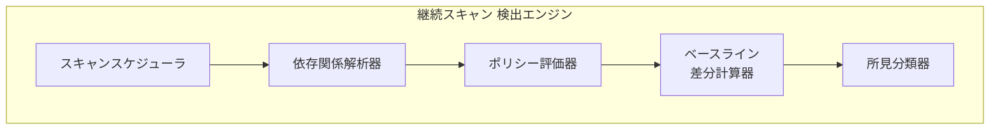
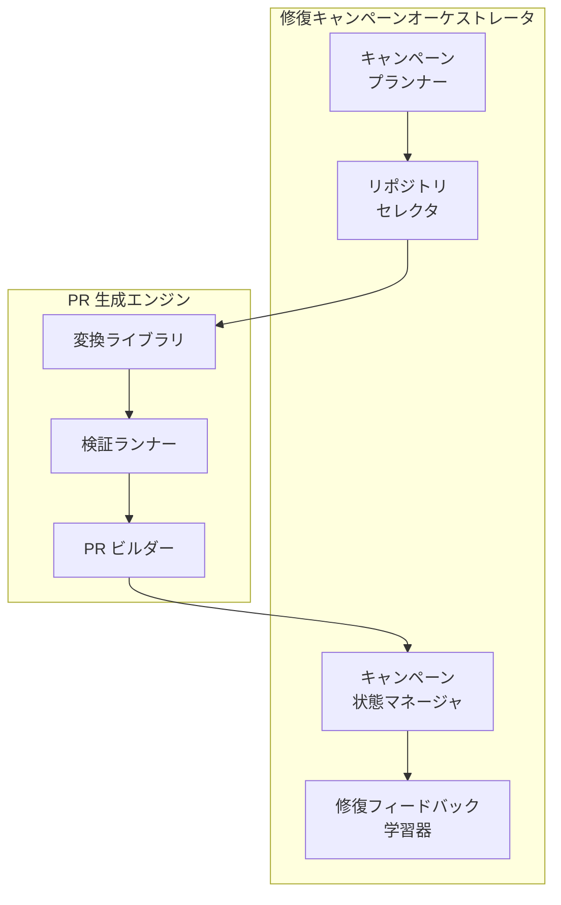
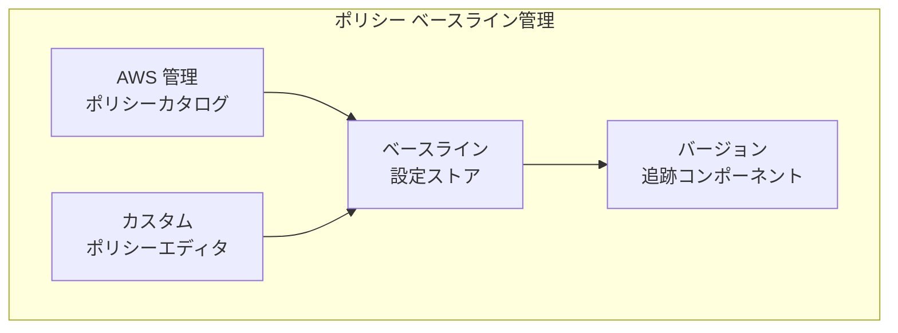
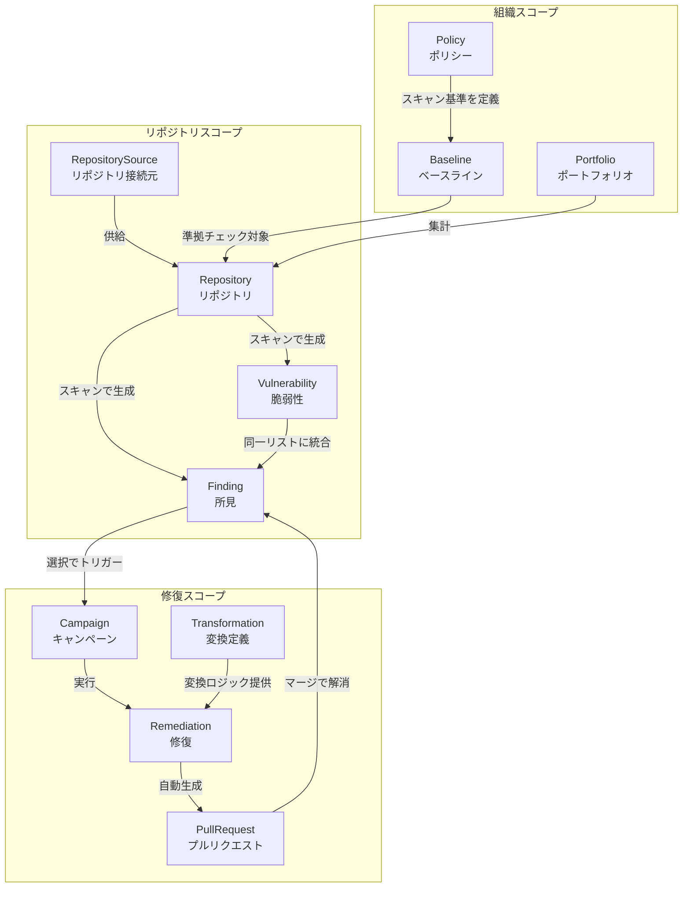
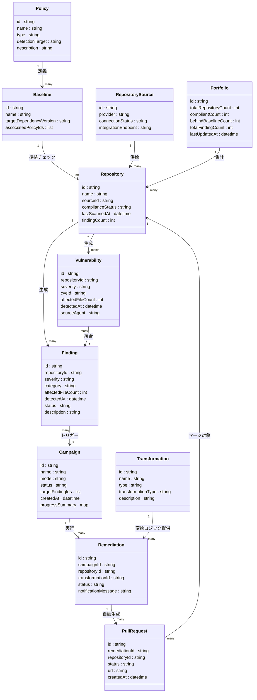

> 本記事は 2026 年 6 月 17 日の preview 発表時点の情報に基づきます。preview 段階のため、仕様は変更される可能性があります。continuous modernization 固有の手順が未公開な箇所は、公式 User Guide の `atx ct` コマンドリファレンスや公式記載の機能から導いた運用案を「実装案」として明示します。

## 概要

AWS Transform – continuous modernization は、組織が保有するコードリポジトリ群の技術的負債を継続的に検出・優先順位付け・自律修復する AWS Transform の新機能（preview）です。

### 解決する課題

従来の技術的負債対応は、大規模な一括移行プロジェクトとして計画されがちでした。実施コストの高さと実施頻度の低さから、負債が蓄積し続けるジレンマがありました。AWS Transform – continuous modernization は「モダナイゼーションをプロジェクトではなく継続プロセスとして扱う」という思想に立ちます。ポリシー・ベースライン・修復キャンペーンという三層として整理できる仕組みで、技術的負債を組織横断で管理します。

### AWS Transform 本体における位置づけ

AWS Transform は、インフラ移行・メインフレームモダナイゼーション・Windows アプリ近代化・コードモダナイゼーションをカバーするエンタープライズ向け変革支援サービスです。continuous modernization はその「コードモダナイゼーション」領域を拡張し、単発変換から常時稼働の自律修復へ進化させた機能に位置づきます。

## 特徴

### スキャンと発見

- リポジトリを設定済みベースラインと照合して継続スキャンし、発見事項を数週間ではなく数時間で生成します（preview 段階の情報）。
- 組織全体の多数のリポジトリを横断して、どのリポジトリが組織標準から逸脱しているかを可視化します。
- ポートフォリオ俯瞰ダッシュボード・重大度/カテゴリ/リポジトリ別の詳細ビュー・接続済みリポジトリ一覧の 3 ビューを提供します。

### ポリシーとベースライン

- OOTB（Out-of-the-Box）ポリシー: EOL（End of Life）依存パッケージの検出・非推奨フレームワークの検出をすぐに利用できます。
- カスタムポリシー: 組織固有の承認ライブラリ一覧・内部コーディング標準・プラットフォームチームが定義した技術的負債ポリシーを追加できます。

### 自律修復キャンペーン

- 発見事項に対して自律修復を設定すると、対象リポジトリへの Pull Request を自動生成します。
- Java バージョンアップグレード・AWS SDK 移行・ライブラリ更新などの組み込み変換テンプレートを提供します。
- カスタム変換パターンを追加して組織固有のリファクタリングも自動化できます。
- 修復は検証済み PR（validated PR）として生成されます。AWS Transform custom 側には実行フィードバックを知識として蓄積する continual learning の仕組みがあります。continuous modernization 側での反映範囲は preview 段階のため要確認です。

### 分析タイプ

公式の分析タイプは 6 種です。

| 分析タイプ | 説明 |
|---|---|
| `tech-debt-quick` | パッケージマニフェストの高速メタデータスキャン |
| `tech-debt-comprehensive` | コードレベルの技術的負債解析 |
| `security` | AWS Security Agent による脆弱性・CVE 検出 |
| `agentic-readiness` | AI/エージェント統合の準備度評価 |
| `modernization-readiness` | クラウドモダナイゼーション機会の評価 |
| `custom` | 任意の変換定義の実行 |

### 2 つの動作モード（ブログのフレーミング）

- continuous モード: 日次更新・セキュリティパッチ・コーディング標準の適用をリポジトリ全体に継続的に適用します。実装上は EventBridge Scheduler による定期分析で実現します。
- campaign モード: フレームワーク移行やメジャーランタイムバージョンアップグレードなど、多数のアプリに及ぶ大規模な単発モダナイゼーション施策を対象とします。

### AWS Security Agent 連携

AWS Security Agent と統合し、ソースコードレベルの脆弱性の検出と修復まで対応します。検出された脆弱性は技術的負債の所見と同じ優先度リスト・PR ワークフローに合流します。

### アクセス方式

- Kiro Power / agent plugin（公式推奨）: Kiro IDE の AWS Transform Power、または `awslabs/agent-plugins` の `plugins/aws-transform`（Claude Code / Codex / Cursor 対応）。エージェントスキルが setup から修復までを会話的にオーケストレーションします。
- CLI（`atx ct`）: continuous modernization 専用のサブコマンド体系。
- MCP（Model Context Protocol）: `awslabs/mcp` で提供。
- AWS Transform Web アプリケーション: ポートフォリオ・所見の可視化。

### 関連技術との比較

| 比較軸 | 従来型一括移行プロジェクト | Dependabot / Renovate | SonarQube 等 静的解析 | AWS Transform – continuous modernization |
|---|---|---|---|---|
| 実行方式 | 手動計画・一回限り | 依存更新 PR を自動生成 | CI/CD に組み込み解析 | リポジトリ横断の継続スキャン＋自律修復 |
| 継続性 | 単発 | 継続（依存監視） | 継続（品質監視） | 継続（ベースライン照合を常時実行） |
| 自律修復範囲 | なし | 依存バージョン更新のみ | なし（報告のみ） | 依存更新・フレームワーク移行・SDK 換装まで |
| スコープ | 単一〜複数アプリ | リポジトリ単位 | リポジトリ単位 | 組織全体の多数リポジトリ横断 |
| 対象負債種別 | 移行時に特定した負債 | EOL パッケージ | コード品質・バグ | EOL 依存・非推奨フレームワーク・組織ポリシー違反・脆弱性 |
| ポリシー定義 | プロジェクト計画書 | 設定ファイル（リポジトリ別） | 品質ゲート | 組織横断のベースライン＋カスタムポリシー |

Dependabot / Renovate はパッケージマネージャーの依存グラフを監視対象とするため、フレームワーク移行やコーディング標準の適用は対象外です。静的解析ツールはコード解析による発見に特化し、修復 PR の自動生成は別途ワークフローを必要とします。AWS Transform – continuous modernization はスキャン・優先順位付け・PR/MR 生成を単一プラットフォームで完結させる点で差異があります。

## 構造

> 公式記載の機能から論理構造を再構成しています。preview 段階のため内部実装の詳細は非公開であり、以下の図はブログ・ドキュメントに記載された機能群を論理コンポーネントとして整理したものです。

### システムコンテキスト図



| 要素名 | 説明 |
|---|---|
| 開発者 / プラットフォームエンジニア / SRE | 所見ダッシュボードを参照し、修復キャンペーンの起動や PR のレビュー・マージを行うアクター |
| リポジトリ管理者 | 組織のコードリポジトリを登録し、ポリシーベースラインを設定するアクター |
| AWS Transform Continuous Modernization | 継続的スキャン・所見管理・修復 PR 生成を自律的に実行するシステム本体 |
| コードリポジトリ | スキャン対象の GitHub / GitLab 上のコードリポジトリ群 |
| CI/CD パイプライン | 修復 PR がマージされた際に動作する継続的インテグレーション・デリバリー基盤 |
| AWS Security Agent | セキュリティ脆弱性を検出し、所見を統合パイプラインへ提供する AWS サービス |
| 通知先 | チームへ修復 PR の生成・ベースライン逸脱を届ける通知チャネル |

### コンテナ図



#### 接続層

| 要素名 | 説明 |
|---|---|
| リポジトリコネクタ | GitHub / GitLab などのコードリポジトリと双方向に接続し、コード取得・PR 送信を仲介するコンポーネント |
| CI/CD 連携アダプタ | 修復 PR のマージ後に CI/CD パイプラインと連携し、ビルド・テスト結果を受け取るコンポーネント |

#### 分析層

| 要素名 | 説明 |
|---|---|
| 継続スキャン 検出エンジン | リポジトリコードをポリシーベースラインに照合して技術的負債を検出するコアエンジン |
| ポリシー ベースライン管理 | 依存ライブラリ終了サポート・非推奨フレームワークなどの検出ルールと組織独自の標準を管理するコンポーネント |

#### 所見層

| 要素名 | 説明 |
|---|---|
| 所見ストア | スキャン結果と AWS Security Agent からのセキュリティ所見を統合して保持・優先度付けするコンポーネント |

#### 修復層

| 要素名 | 説明 |
|---|---|
| 修復キャンペーンオーケストレータ | 優先付けされた所見群から修復キャンペーンを起動し、対象リポジトリへの修復処理を順序制御するコンポーネント |
| PR 生成エンジン | 各対象リポジトリに対して修復内容を適用した Pull Request を自動生成・送信するコンポーネント |

#### 提示層

| 要素名 | 説明 |
|---|---|
| ダッシュボード ポータル | ポートフォリオ全体の技術的負債状況・所見一覧・キャンペーン進捗を提供するウェブ UI |

#### 外部インテグレーション

| 要素名 | 説明 |
|---|---|
| AWS Security Agent | セキュリティ脆弱性の所見を同一パイプラインへ流し込む外部エージェント |
| Kiro Power / MCP / コーディングエージェント スキル | Kiro・MCP サーバー・サードパーティコーディングエージェント経由でキャンペーン操作・所見参照を可能にするアクセスレイヤー |

### コンポーネント図

#### 検出エンジンのドリルダウン



| 要素名 | 説明 |
|---|---|
| スキャンスケジューラ | リポジトリ登録状態とポリシー設定に基づき継続的スキャンをトリガーするコンポーネント |
| 依存関係解析器 | リポジトリのマニフェストやソースコードを解析し、ライブラリ・フレームワーク依存関係のグラフを構築するコンポーネント |
| ポリシー評価器 | AWS 管理および組織独自のポリシー定義を依存関係グラフに照合し、違反箇所を特定するコンポーネント |
| ベースライン差分計算器 | 現在のコード状態と設定されたベースラインを比較し、逸脱量を算出するコンポーネント |
| 所見分類器 | 検出された逸脱を種別・重大度・影響スコープで分類し、所見ストアへ格納する形式に整形するコンポーネント |

#### 修復キャンペーンオーケストレータと PR 生成エンジンのドリルダウン



##### 修復キャンペーンオーケストレータ

| 要素名 | 説明 |
|---|---|
| キャンペーンプランナー | 所見ストアから高優先度の所見群を選択し、修復キャンペーンの範囲・順序・モードを決定するコンポーネント |
| リポジトリセレクタ | キャンペーン対象となる影響リポジトリを特定し、修復処理キューに登録するコンポーネント |
| キャンペーン状態マネージャ | 各リポジトリへの修復 PR 生成・マージ・再スキャン確認のライフサイクル状態を追跡するコンポーネント |
| 修復フィードバック学習器 | チームによる PR のマージ・却下・代替修正の結果を受け取り、将来の変換精度向上に反映するコンポーネント |

##### PR 生成エンジン

| 要素名 | 説明 |
|---|---|
| 変換ライブラリ | Java バージョンアップグレード・SDK 移行・ライブラリ更新などの標準変換ロジックと組織独自の変換定義を実行するコンポーネント |
| 検証ランナー | 変換後のコードが構文的・意味的に正しいかを確認し、変換品質を保証するコンポーネント |
| PR ビルダー | 変換済みコード差分・メッセージ・修復根拠を組み合わせて PR を構築しリポジトリへ送信するコンポーネント |

#### ポリシー・ベースライン管理のドリルダウン



| 要素名 | 説明 |
|---|---|
| AWS 管理ポリシーカタログ | 依存ライブラリ終了サポート・非推奨フレームワーク・既知脆弱性などの検出ルールを AWS が管理・バージョニングするカタログ |
| カスタムポリシーエディタ | 組織固有の承認済みライブラリ・内部コーディング標準・技術的負債ポリシーを定義・管理するコンポーネント |
| ベースライン設定ストア | 組織またはチームごとに有効化されたポリシーセットと目標バージョン水準を永続化するコンポーネント |
| バージョン追跡コンポーネント | ポリシーカタログの更新履歴を管理し、ベースライン変更がスキャン結果に与える影響を追跡するコンポーネント |

## データ

> preview 段階で公式 ER は未公開です。以下はブログ登場概念から妥当にモデル化したものです。公式ドキュメントでは中核概念が Source / Repository / Analysis / Finding / Remediation / TransformationDefinition として定義されています。本モデルの `Campaign` はブログ表現「remediation campaign」を一作業単位として表したもので、公式の `Analysis` と `Remediation` に対応します。

### 概念モデル



| 要素名 | 説明 |
|---|---|
| Policy | 技術的負債を検出するルール定義。OOTB とカスタムの 2 種類 |
| Baseline | 組織が定める「あるべき水準」。スキャン結果と比較される参照値 |
| Portfolio | 組織配下の全リポジトリを束ねる集計単位 |
| RepositorySource | コードリポジトリの接続元（GitHub、GitLab、Bitbucket、ローカル環境） |
| Repository | 継続スキャンの対象となるコードリポジトリ |
| Finding | スキャンで検出された技術的負債の一項目。重要度・カテゴリ・影響ファイル数を保持 |
| Vulnerability | AWS Security Agent が検出したソースコードレベルの脆弱性。Finding と同一リストに統合 |
| Campaign | Finding をまとめて修復する作業単位。continuous / campaign モード |
| Remediation | Campaign 内で実行される個別の修復処理。影響リポジトリごとに PR を生成 |
| Transformation | 修復に適用される変換ロジック定義。OOTB とカスタムの 2 種類 |
| PullRequest | Remediation が自動生成する PR。マージにより Finding が解消 |

### 情報モデル



| 要素名 | 説明 |
|---|---|
| Policy.type | "ootb" は AWS 提供の組み込みポリシー、"custom" は組織が追加定義したポリシー |
| Policy.detectionTarget | 検出対象の種別。EOL 依存、非推奨フレームワーク、承認済みライブラリ、組織標準のいずれか |
| Baseline.targetDependencyVersion | 依存ライブラリの「あるべきバージョン」。ブログ記述から推測した属性 |
| RepositorySource.provider | 接続元のコード管理サービス種別。GitHub、GitLab、Bitbucket、ローカル環境 |
| Repository.complianceStatus | ベースラインとの準拠状態。"behind" はベースラインを下回ることを示す |
| Finding.severity | high / medium / low の 3 段階 |
| Finding.status | 公式の状態値は open / dismissed / obsolete。新規所見は open で始まり、誤検出は理由付きで dismiss、再分析で解消済みは自動的に obsolete |
| Finding.category | 負債の種別。ブログ記述から推測した属性 |
| Vulnerability.cveId | CVE 識別子。AWS Security Agent 連携で取得。ブログ記述から推測した属性 |
| Campaign.mode | "continuous" は日常的なライブラリ更新・パッチ適用、"campaign" は大規模フレームワーク移行や主要ランタイムアップグレードに対応 |
| Remediation | 変換定義を適用して所見を修正する単位。公式には 3 モード（findings-based / TD override / direct TD）があり、出力は GitHub=PR / GitLab=MR / Bitbucket=PR / Local=ブランチ |
| Transformation.type | "ootb" は AWS 提供の組み込み変換、"custom" は組織固有パターン |
| PullRequest.status | "generated" / "merged" / "alternative_applied" / "closed" の状態を取る（実装モデル上の例。公式 enum 値ではない） |

## 構築方法

> continuous modernization は Kiro Power または agent plugin（エージェントスキル）経由の利用が公式推奨です。エージェントが setup・onboarding・source 接続・分析実行・所見トリアージ・修復までを会話的にオーケストレーションします。CLI を直接使う場合は専用の `atx ct` コマンド体系を使います（custom transformation 用の `atx custom ...` とは別系統です）。すべての分析・修復は利用者の AWS アカウント内で利用者のクレデンシャルを使って実行され、ソースコードは利用者の管理下にとどまります。

### 推奨セットアップ（Kiro Power / agent plugin）

| 統合方法 | インストール |
|---|---|
| Kiro IDE（AWS Transform Power） | Kiro マーケットプレイスから AWS Transform Power をインストール |
| Claude Code / Codex / Cursor（agent plugin） | `awslabs/agent-plugins` の `plugins/aws-transform` をインストール。Kiro Power と同等の機能 |

agent plugin / Kiro Power には次のエージェントスキルが含まれます。

| スキル | 役割 |
|---|---|
| Guide | フルワークフローを段階的に案内する対話的オンボーディング |
| Source | source 接続の追加・一覧・削除 |
| Discovery | source をスキャンしてリポジトリを発見 |
| Analysis | 全分析タイプの実行・管理 |
| Findings | 所見のクエリ・フィルタ・管理 |
| Remediation | 所見を修復する remediation の作成・管理 |
| EC2 Execution / Batch Execution | リモート分析用の EC2 / AWS Batch (Fargate) のプロビジョニング |
| Schedule | EventBridge Scheduler で cron スケジュール分析を設定 |
| Reporting | 所見・重大度分布・修復進捗を示す HTML レポート生成 |

### 前提条件（CLI 利用時）

- Node.js 22 以降
- Git（有効な Git リポジトリ内での実行が必要）
- OS: Linux / macOS / WSL（Windows ネイティブは非対応）
- IAM: ユーザー/ロールに AWS Transform のマネージドポリシーをアタッチ

| ポリシー名 | 用途 |
|---|---|
| `AWSTransformCustomFullAccess` | フルアクセス（推奨。サービスリンクロール作成権限を含む） |
| `AWSTransformCustomManageTransformations` | 変換定義の作成・更新・読み取り・削除・実行 |
| `AWSTransformCustomExecuteTransformations` | 変換の実行のみ |

セキュリティ分析や EC2 / Batch 実行を使う場合、CloudFormation・IAM・S3・Secrets Manager・KMS・SSM 等への追加権限が必要です。

#### 対応リージョン（AWS Transform CLI）

| リージョンコード | 拠点 |
|---|---|
| `us-east-1` | US East (N. Virginia) |
| `eu-central-1` | Europe (Frankfurt) |
| `eu-west-2` | Europe (London) |
| `ca-central-1` | Canada (Central) |
| `ap-northeast-1` | Asia Pacific (Tokyo) |
| `ap-northeast-2` | Asia Pacific (Seoul) |
| `ap-southeast-2` | Asia Pacific (Sydney) |
| `ap-south-1` | Asia Pacific (Mumbai) |

### CLI のインストールと認証

```bash
# インストールスクリプトで一括インストール
curl -fsSL https://transform-cli.awsstatic.com/install.sh | bash
atx --version

# 認証情報・リージョン
export AWS_REGION=ap-northeast-1
aws configure set region ap-northeast-1
```

### continuous modernization サーバーの起動と source 接続

continuous modernization の操作は `atx ct` サブコマンドで行います。まずサーバーを起動し、source を接続します。

```bash
# continuous modernization サーバーを起動
atx ct server

# source を追加（GitHub 組織 / GitLab グループ / Bitbucket workspace / ローカル）
atx ct source add
atx ct source list
```

source は次の 4 タイプに対応します。

| source タイプ | 接続単位・方式 |
|---|---|
| GitHub | 組織（personal access token classic） |
| GitLab | グループまたはユーザー（self-hosted インスタンスを含む） |
| Bitbucket | workspace（Cloud）または project（Data Center） |
| Local | git リポジトリを含む親ディレクトリ |

### リポジトリの発見（discovery）

```bash
# source をスキャンしてリポジトリを列挙
atx ct discovery scan
atx ct discovery status

# 発見されたリポジトリを一覧（ラベルでチーム/優先度/移行ウェーブを整理可能）
atx ct repository list
atx ct repository update   # ラベル付与
```

## 利用方法

### `atx ct` サブコマンド一覧

| サブコマンド | 説明 |
|---|---|
| `atx ct server` | continuous modernization サーバーを起動 |
| `atx ct status` | source・リポジトリ・分析・所見・修復のシステム状態を表示 |
| `atx ct source add / list / remove` | source の追加・一覧・削除 |
| `atx ct discovery scan / status` | リポジトリ発見スキャンの実行・状態確認 |
| `atx ct repository list / get / update / delete` | リポジトリの一覧・取得・ラベル更新・削除 |
| `atx ct analysis run / get / list / cancel / delete` | 分析の実行・取得・一覧・キャンセル・削除 |
| `atx ct findings list / get / update / batch-update / delete` | 所見の一覧・取得・状態更新・一括更新・削除 |
| `atx ct remediation create / list / status / retry / delete` | 修復の作成・一覧・状態確認・再試行・削除 |
| `atx ct setup security-agent` | セキュリティエージェント基盤のプロビジョニング・管理 |

### 分析（analysis）の実行

分析タイプを `--type` で指定して実行します。所見は接続後数時間以内（hours, not weeks）で生成されます。

| 分析タイプ | 説明 |
|---|---|
| `tech-debt-quick` | パッケージマニフェスト（pom.xml / package.json / requirements.txt）のメタデータのみを高速スキャン。ソースコードは解析しない |
| `tech-debt-comprehensive` | AWS Transform エージェントによるコードレベルの技術的負債分析 |
| `security` | AWS Security Agent による脆弱性・CVE 検出。1 回限りの基盤セットアップが必要 |
| `agentic-readiness` | AI/エージェント統合の準備度評価。5 カテゴリ 56 基準でスコアリング |
| `modernization-readiness` | クラウドモダナイゼーション機会の評価 |
| `custom` | 任意の変換定義を分析として実行（`--type custom --transformation-name {{name}}`） |

```bash
# リポジトリに対して分析を実行
atx ct analysis run --type tech-debt-quick
atx ct analysis list
atx ct analysis get
```

### 所見（findings）の確認とトリアージ

所見は重大度（high / medium / low）と状態（open / dismissed / obsolete）を持ちます。新規所見は open で始まり、誤検出は理由付きで dismiss し、再分析で解消済みは自動的に obsolete になります。自動修復可能な所見には対応する fix transform が紐づきます。

```bash
# 所見を一覧（repo / source / severity / type / status / analysis でフィルタ）
atx ct findings list --severity high --status open
atx ct findings get
atx ct findings update   # open / dismissed の状態更新
atx ct findings batch-update
```

### 修復（remediation）の作成

remediation は変換定義を適用して所見を修正します。3 つのモードがあります。

| モード | 説明 |
|---|---|
| findings-based | 各所見が自身の fix transform を使う |
| TD override | 指定所見に対して変換定義を上書き指定 |
| direct TD | 所見を介さずリポジトリに変換定義を直接適用 |

出力は source プロバイダーに依存し、GitHub は PR、GitLab は MR、Bitbucket は PR、Local はブランチを生成します。

```bash
# 所見または変換定義から修復を作成
atx ct remediation create
atx ct remediation status   # PR/MR リンクと進捗を確認
atx ct remediation retry    # 失敗した修復を再試行
```

### 変換定義（transformation definition）の確認

continuous modernization は custom 分析・修復で変換定義（TD）を利用します。利用可能な TD は custom 系コマンドで一覧します。

```bash
atx custom def list
```

代表的な AWS マネージド変換定義の抜粋です（公式カタログには 20 件以上が存在します）。

| 変換定義名 | 用途 |
|---|---|
| `AWS/java-aws-sdk-v1-to-v2` | Java AWS SDK v1 → v2 移行 |
| `AWS/java-version-upgrade` | Java バージョンアップグレード |
| `AWS/python-version-upgrade` | Python バージョンアップグレード |
| `AWS/agentic-readiness-analysis` | エージェント対応度分析（ARA） |
| `AWS/modernization-readiness-analysis` | モダナイゼーション対応度分析（MODA） |

## 運用

### 状態監視

- `atx ct status` で source・リポジトリ・分析・所見・修復のシステム状態を確認できます。
- 所見は深刻度（high / medium / low）・カテゴリ・リポジトリ別に一覧化され、ポートフォリオ全体の負債状況を把握できます。
- Reporting スキルが重大度分布・修復進捗を示す HTML レポートを生成します。

### compute オプション（分析・修復の実行基盤）

continuous modernization は分析・修復の実行に 3 つの compute オプションを持ちます。EC2 / Batch のセットアップは Kiro Power / agent plugin のエージェントスキルが基盤プロビジョニングを支援します。

| オプション | 特徴 |
|---|---|
| Local（既定） | ローカルマシンでサーバーを起動して実行。追加基盤不要。試用・小規模・個人利用向け |
| Amazon EC2 | AWS アカウント内の永続 EC2（Amazon Linux 2023 + Docker）で実行。CloudFormation スタックを provision。大規模分析・定期スケジュール分析に対応 |
| AWS Batch (Fargate) | 分析ごとに独立コンテナで実行するサーバーレス。CDK スタックを再利用。複数 source / 分析タイプの並列処理向け |

### 継続的監視（スケジュール分析）

- 定期分析は Amazon EventBridge Scheduler で設定します。日次・週次・カスタム cron で繰り返し分析を起動し、新規所見を継続的に監視できます。
- 自動修復と組み合わせることで、コードの健全性を継続的に維持できます。

### 修復の進捗追跡

- `atx ct remediation status` で各修復の状態と PR/MR リンクを確認できます。失敗した修復は `atx ct remediation retry` で再試行します。
- 所見の状態は再分析で自動更新され、解消済みは obsolete になります。

### 所見のトリアージ運用

公式記載の機能から導いた運用案として、以下のスクリーニングポリシーを推奨します。

```text
high   → 即時修復（PR 生成 + CI 通過後にレビュー）
medium → 日次バッチで PR 生成、レビュアーに割り当て
low    → 記録のみ（次スプリントの積み残しキューに追加）
```

### CI/CD パイプラインとの統合運用

- 公式に明確なのは EventBridge Scheduler による定期分析と、GitHub / GitLab / Bitbucket への PR/MR 生成です。
- CodePipeline・Jenkins・GitHub Actions 等の既存パイプラインからの起動は、`atx ct` を CI のシェルステップで呼ぶ実装案として扱います（以下は実装案）。

```yaml
# GitHub Actions 統合例（公式記載の機能から導いた実装案）
name: transform-ct-scan
on:
  schedule:
    - cron: "0 0 * * *"
jobs:
  scan:
    runs-on: ubuntu-latest
    steps:
      - name: Install AWS Transform CLI
        run: curl -fsSL https://transform-cli.awsstatic.com/install.sh | bash
      - name: Run continuous modernization analysis
        env:
          AWS_REGION: ap-northeast-1
        run: |
          aws configure set region $AWS_REGION
          atx ct analysis run --type tech-debt-quick
```

## ベストプラクティス

### 「自動 PR を出す基準」と「マージしてよい基準」を分けて設計する

AI 自動修復の失敗事例の多くは、PR 生成の判断とマージの判断を同一視したことに起因します。この 2 つを分離して設計することが最も重要です。

| 区分 | 判断主体 | 基準の例 |
|---|---|---|
| PR 生成基準 | 運用側が設定した条件に基づき Transform が実行 | 所見の深刻度がしきい値以上 / 適用可能な変換が存在 / ベースラインから逸脱 |
| マージ基準 | チームが設計する | CI（ビルド・テスト）が全パス / 指定レビュアーの承認 / 変更スコープが許容範囲 / オーナーチームへの事前周知完了 |

PR 自動生成を許可しても、自動マージは段階的に解禁します。最初は「high のみ」から始め、実績を積んでから medium に拡大する段階適用が安全です。

### 何を技術的負債とみなすか（ベースライン・ポリシー設計）

- OOTB ポリシー（EOL 依存・非推奨フレームワーク・一般的な技術的負債）を起点に、組織固有ルールを追加してベースラインを拡張します。
- ベースラインは最初から厳格にしすぎず、現状のポートフォリオで達成可能なラインを起点に段階的に引き上げます。

### 修復の優先度付け

- high は例としてセキュリティ脆弱性や重要な移行・agentic readiness ブロッカー。即時対応。
- medium は重大な懸念。次スプリントで対応。
- low はアドバイザリー。技術的負債バックログとして積み上げ。
- コンテキスト感応型スコアリングを活用します。同じ欠如でも、書き込みを行うサービスでは high、読み取り専用では low になる場合があります。

### PR レビュー担当の運用設計

- PR にはリポジトリのオーナーチームを必ずレビュアーとして割り当てます。AI が生成した変更でも「チームが理解・承認した変更」として扱う文化が重要です。
- 大規模（多数リポジトリ）では、変換カテゴリごとに専任チームをレビュアーに指定してレビュー負荷を分散します。

### ロールアウトの段階適用

```text
Phase 1 (Pilot)   : 1〜3 リポジトリで所見の品質を検証
Phase 2 (Low-Risk): 低重要度リポジトリに展開
Phase 3 (Scale)   : 全ポートフォリオへ展開、キャンペーンモードで大規模移行
Phase 4 (Steady)  : Continuous モードに移行し、モダナイゼーションを背景プロセス化
```

### Preview 段階でのスコープ限定

- サポートされる分析タイプ・変換タイプと接続可能な source を確認してから本番リポジトリに適用します。
- Preview 期間中は変換品質・仕様が変更される可能性があるため、本番クリティカルなリポジトリは Pilot フェーズのみに限定し、GA 後にスコープを拡大する方針が安全です。

## トラブルシューティング

| 症状 | 原因 | 対処 |
|---|---|---|
| 所見が大量に出て PR が氾濫する | ベースラインが実態より厳格すぎる / 全深刻度で自動修復を有効にしている | medium/low を一時的に「記録のみ」に変更し、high のみ修復を有効化。ベースラインを段階的に引き上げる |
| PR が CI で失敗する | 生成された変更がビルド設定・テストと整合しない | 変換定義に検証基準を設定する。インタラクティブに変換へフィードバックを提供する |
| 認証エラーが発生する | IAM 権限不足 / クレデンシャル未設定 | `aws sts get-caller-identity` で認証確認。必要な AWS Transform マネージドポリシーを IAM に追加する |
| ネットワークエラーで接続できない | 必要エンドポイントへのアクセスがブロックされている | ファイアウォールで AWS Transform / S3 の必要エンドポイントを許可する |
| 修復済みなのに所見が残る | 再分析がまだ走っていない | 次の定期スキャンサイクルを待つ。または手動でスキャンを再トリガーする |
| Git エラーが発生する | リポジトリが git 管理下にない | `git status` で確認。`git init` 後に再実行する |
| リージョンエラーが発生する | 環境変数または設定ファイルのリージョン不整合 | `aws configure get region` で確認し、サポート対象リージョンに修正する |

## まとめ

AWS Transform – continuous modernization は、技術的負債の検出から自律的な PR 生成までを継続プロセスとして回す preview 機能です。ポリシー・ベースライン・修復キャンペーンと専用 CLI（`atx ct`）で、組織横断のモダナイゼーションを背景プロセス化します。本番導入では「自動 PR を出す基準」と「マージしてよい基準」を分けて設計することが要点になります。

この記事が少しでも参考になった、あるいは改善点などがあれば、ぜひリアクションやコメント、SNS でのシェアをいただけると励みになります！

## 参考リンク

- 公式ブログ
  - [Proactively reduce tech debt autonomously with AWS Transform – continuous modernization (preview)](https://aws.amazon.com/blogs/aws/proactively-reduce-tech-debt-autonomously-with-aws-transform-continuous-modernization-preview/)
  - [Top announcements of the AWS Summit in New York, 2026](https://aws.amazon.com/blogs/aws/top-announcements-of-the-aws-summit-in-new-york-2026/)
  - [New in AWS Transform: Analyze Your Code for Modernization and Agentic Readiness](https://aws.amazon.com/blogs/migration-and-modernization/new-in-aws-transform-analyze-your-code-for-modernization-and-agentic-readiness/)
  - [Building a scalable code modernization solution with AWS Transform custom](https://aws.amazon.com/blogs/devops/building-a-scalable-code-modernization-solution-with-aws-transform-custom/)
- 公式ドキュメント
  - [AWS Transform User Guide](https://docs.aws.amazon.com/transform/latest/userguide/)
  - [AWS Transform 公式サイト](https://aws.amazon.com/transform/)
  - [AWS CodeConnections セットアップガイド](https://docs.aws.amazon.com/dtconsole/latest/userguide/setting-up-connections.html)
- GitHub
  - [awslabs/agent-plugins](https://github.com/awslabs/agent-plugins)
  - [awslabs/mcp](https://github.com/awslabs/mcp)
- 記事
  - [AWS Summit New York 2026: New ways to make AI agents more effective at work](https://www.aboutamazon.com/news/aws/aws-summit-nyc-2026-ai-agents)
